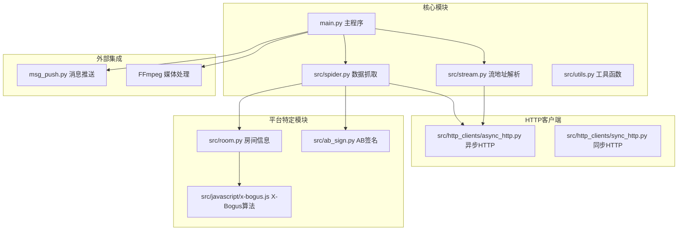
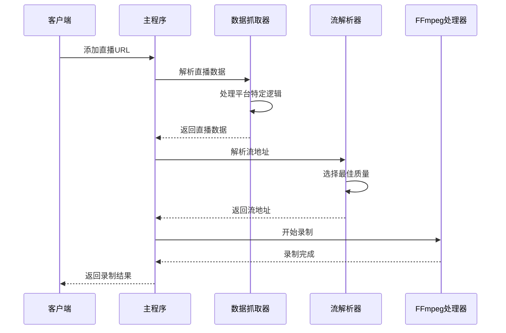
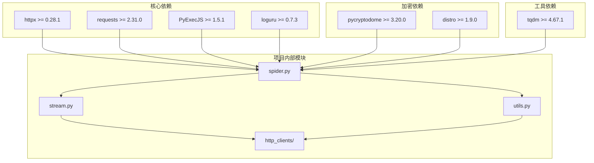

# API参考文档

<cite>
**本文档引用的文件**
- [main.py](file://main.py)
- [src/spider.py](file://src/spider.py)
- [src/stream.py](file://src/stream.py)
- [src/utils.py](file://src/utils.py)
- [src/http_clients/async_http.py](file://src/http_clients/async_http.py)
- [src/http_clients/sync_http.py](file://src/http_clients/sync_http.py)
- [src/room.py](file://src/room.py)
- [src/ab_sign.py](file://src/ab_sign.py)
- [src/javascript/x-bogus.js](file://src/javascript/x-bogus.js)
- [msg_push.py](file://msg_push.py)
- [demo.py](file://demo.py)
- [requirements.txt](file://requirements.txt)
- [README.md](file://README.md)
</cite>

## 目录
1. [简介](#简介)
2. [项目结构](#项目结构)
3. [核心组件](#核心组件)
4. [架构概览](#架构概览)
5. [详细组件分析](#详细组件分析)
6. [依赖分析](#依赖分析)
7. [性能考虑](#性能考虑)
8. [故障排除指南](#故障排除指南)
9. [结论](#结论)
10. [附录](#附录)

## 简介

DouyinLiveRecorder是一个基于Python的直播录制工具，支持超过50个国内外直播平台。该项目采用异步编程模型，结合多种反爬虫绕过技术和FFmpeg媒体处理能力，实现了稳定可靠的直播录制功能。

本项目的核心优势包括：
- 支持国内外主流直播平台的直播录制
- 采用异步HTTP客户端提高并发处理能力
- 集成多种反爬虫绕过技术（X-Bogus、AB签名等）
- 提供完整的直播状态推送功能
- 支持多种媒体格式转换和分段录制

## 项目结构



**图表来源**
- [main.py:1-800](file://main.py#L1-L800)
- [src/spider.py:1-800](file://src/spider.py#L1-L800)
- [src/stream.py:1-446](file://src/stream.py#L1-L446)

**章节来源**
- [main.py:1-800](file://main.py#L1-L800)
- [README.md:72-100](file://README.md#L72-L100)

## 核心组件

### 主程序API

主程序作为整个系统的入口点，负责协调各个组件的工作流程：

**主要功能**：
- 直播间URL解析和验证
- 录制任务调度和管理
- FFmpeg进程管理和媒体文件处理
- 错误监控和异常处理
- 配置文件管理和动态更新

**核心变量和配置**：
- `recording`: 当前录制中的直播集合
- `max_request`: 并发请求限制
- `error_count`: 错误计数器
- `monitoring`: 监测中的直播数量
- `recording_time_list`: 录制时间跟踪

**章节来源**
- [main.py:47-78](file://main.py#L47-L78)
- [main.py:545-800](file://main.py#L545-L800)

### 工具函数API

工具模块提供了通用的辅助功能：

**核心工具函数**：
- `trace_error_decorator`: 异常追踪装饰器
- `handle_proxy_addr`: 代理地址处理
- `get_query_params`: URL查询参数解析
- `update_config`: 配置文件更新
- `check_md5`: 文件MD5校验

**章节来源**
- [src/utils.py:38-206](file://src/utils.py#L38-L206)

### HTTP客户端API

项目实现了两套HTTP客户端以满足不同场景需求：

**异步HTTP客户端**：
- 支持GET和POST请求
- 自动处理重定向
- 支持代理和SSL验证
- 提供状态检查功能

**同步HTTP客户端**：
- 基于requests库
- 支持gzip压缩处理
- 提供详细的错误处理
- 支持自定义超时设置

**章节来源**
- [src/http_clients/async_http.py:10-60](file://src/http_clients/async_http.py#L10-L60)
- [src/http_clients/sync_http.py:20-89](file://src/http_clients/sync_http.py#L20-L89)

## 架构概览



**图表来源**
- [main.py:545-800](file://main.py#L545-L800)
- [src/spider.py:68-142](file://src/spider.py#L68-L142)
- [src/stream.py:40-79](file://src/stream.py#L40-L79)

## 详细组件分析

### 平台API接口规范

#### 抖音直播API

**接口定义**：
```python
async def get_douyin_web_stream_data(url: str, proxy_addr: str = None, cookies: str = None) -> dict
async def get_douyin_app_stream_data(url: str, proxy_addr: str = None, cookies: str = None) -> dict
async def get_douyin_stream_data(url: str, proxy_addr: str = None, cookies: str = None) -> dict
```

**参数说明**：
- `url`: 直播间URL
- `proxy_addr`: 代理服务器地址
- `cookies`: 用户Cookie信息

**返回值**：
- 包含直播状态、流地址、标题等信息的字典
- `is_live`: 直播状态标识
- `anchor_name`: 主播名称
- `stream_url`: 流地址信息

**章节来源**
- [src/spider.py:68-283](file://src/spider.py#L68-L283)

#### TikTok直播API

**接口定义**：
```python
async def get_tiktok_stream_data(url: str, proxy_addr: str = None, cookies: str = None) -> dict | None
```

**特点**：
- 支持海外节点访问
- 自动处理地区限制
- 提供备用解析方案

**章节来源**
- [src/spider.py:285-314](file://src/spider.py#L285-L314)

#### 虎牙直播API

**接口定义**：
```python
async def get_huya_stream_data(url: str, proxy_addr: str = None, cookies: str = None) -> dict
async def get_huya_app_stream_url(url: str, proxy_addr: str = None, cookies: str = None) -> dict
```

**CDN支持**：
- TX: 腾讯云
- HW: 华为云
- HS: 华为云
- AL: 阿里云

**章节来源**
- [src/spider.py:407-518](file://src/spider.py#L407-L518)

#### B站直播API

**接口定义**：
```python
async def get_bilibili_room_info(url: str, proxy_addr: str = None, cookies: str = None) -> dict
async def get_bilibili_stream_data(url: str, qn: str = '10000', platform: str = 'web', proxy_addr: str = None, cookies: str = None) -> str
```

**画质选项**：
- `10000`: 原画
- `400`: 蓝光
- `250`: 超清
- `150`: 高清
- `80`: 流畅

**章节来源**
- [src/spider.py:676-767](file://src/spider.py#L676-L767)

### 加密和签名API

#### X-Bogus算法

**实现原理**：
- 基于JavaScript VM执行
- 支持复杂的字符串处理和加密运算
- 提供安全的参数签名

**使用方式**：
```python
async def get_xbogus(url: str, headers: dict | None = None) -> str
```

**章节来源**
- [src/room.py:42-48](file://src/room.py#L42-L48)
- [src/javascript/x-bogus.js:500-564](file://src/javascript/x-bogus.js#L500-L564)

#### AB签名算法

**实现原理**：
- RC4加密算法
- SM3哈希函数
- 复杂的位运算和掩码操作

**使用方式**：
```python
def ab_sign(url_search_params: str, user_agent: str) -> str
```

**章节来源**
- [src/ab_sign.py:444-455](file://src/ab_sign.py#L444-L455)

### 消息推送API

项目集成了多种消息推送服务：

**钉钉推送**：
```python
def dingtalk(url: str, content: str, number: str = None, is_atall: bool = False) -> Dict[str, Any]
```

**微信推送**：
```python
def xizhi(url: str, title: str, content: str) -> Dict[str, Any]
```

**Telegram推送**：
```python
def tg_bot(chat_id: int, token: str, content: str) -> Dict[str, Any]
```

**邮件推送**：
```python
def send_email(email_host: str, login_email: str, email_pass: str, sender_email: str, sender_name: str,
              to_email: str, title: str, content: str, smtp_port: str = None, open_ssl: bool = True) -> Dict[str, Any]
```

**章节来源**
- [msg_push.py:25-296](file://msg_push.py#L25-L296)

## 依赖分析



**图表来源**
- [requirements.txt:1-7](file://requirements.txt#L1-L7)

**章节来源**
- [requirements.txt:1-7](file://requirements.txt#L1-L7)

## 性能考虑

### 并发控制策略

项目采用了智能的并发控制机制：

**动态请求调整**：
- 基于错误率的自适应调节
- 最大并发数限制
- 请求超时处理

**内存管理**：
- 流式下载处理
- 进程池管理
- 资源清理机制

### 录制优化

**媒体处理优化**：
- FFmpeg参数调优
- 多格式支持
- 分段录制功能

**网络优化**：
- 代理支持
- SSL证书验证
- 连接复用

## 故障排除指南

### 常见问题及解决方案

**直播源解析失败**：
- 检查平台URL格式
- 验证代理设置
- 更新Cookie信息

**录制质量异常**：
- 调整画质设置
- 检查网络带宽
- 更新FFmpeg版本

**平台兼容性问题**：
- 查看平台支持列表
- 检查API变更
- 更新依赖库

**章节来源**
- [src/utils.py:38-51](file://src/utils.py#L38-L51)

## 结论

DouyinLiveRecorder项目展现了现代直播录制系统的完整架构，通过精心设计的模块化结构和强大的技术栈，实现了对多平台直播内容的稳定录制。项目的主要特点包括：

1. **全面的平台支持**：覆盖国内外50+直播平台
2. **先进的反爬虫技术**：集成多种签名算法
3. **高效的媒体处理**：基于FFmpeg的专业录制
4. **完善的错误处理**：多层次的异常监控
5. **灵活的配置管理**：动态配置更新机制

该系统为直播内容创作者和研究者提供了强大的技术支持，具有良好的扩展性和维护性。

## 附录

### API调用示例

**基础录制调用**：
```python
# 异步方式调用
import asyncio
from src.spider import get_douyin_app_stream_data

async def main():
    url = "https://live.douyin.com/745964462470"
    stream_data = await get_douyin_app_stream_data(url)
    print(stream_data)

asyncio.run(main())
```

**批量平台测试**：
```python
from demo import test_live_stream

# 测试多个平台
platforms = ["douyin", "tiktok", "bilibili"]
for platform in platforms:
    test_live_stream(platform)
```

**章节来源**
- [demo.py:213-228](file://demo.py#L213-L228)

### 配置文件说明

**URL配置文件**：
```ini
# 直播间URL列表
https://live.douyin.com/941838427390,主播: 斌的世界
# 注释行（以#开头）
# https://www.huya.com/52333
```

**主配置文件**：
- 录制质量设置
- 代理配置
- 推送通知设置
- FFmpeg参数配置