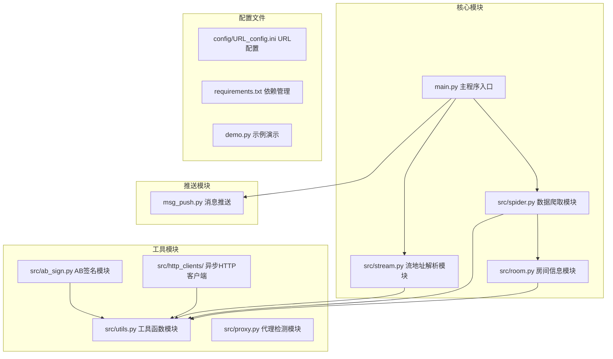
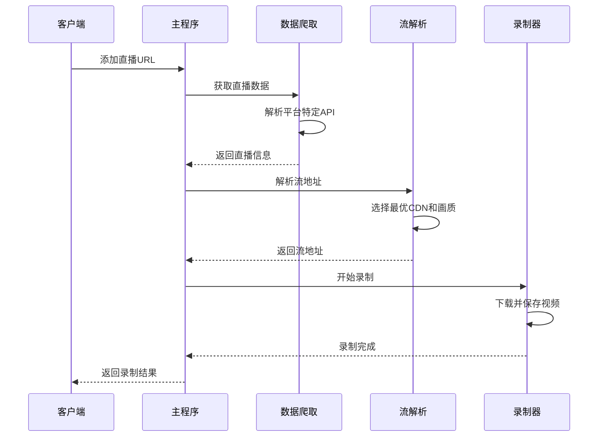
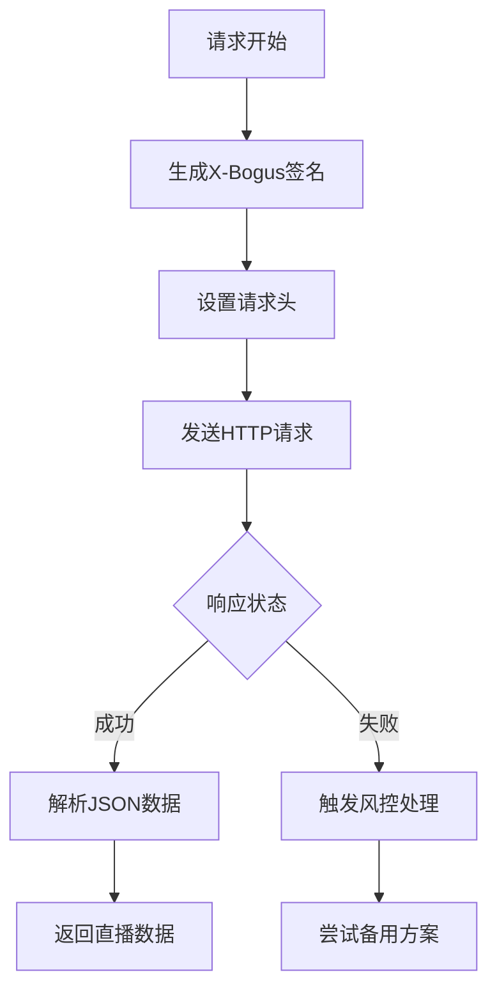
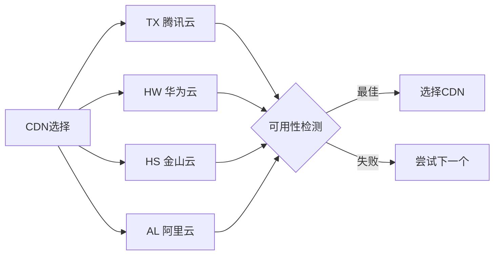
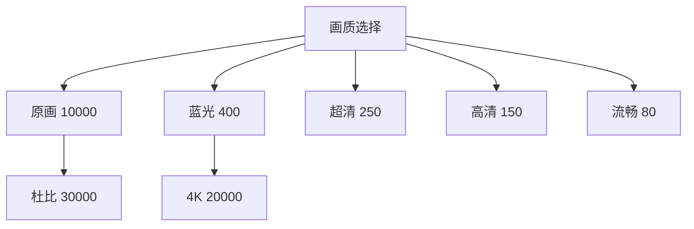
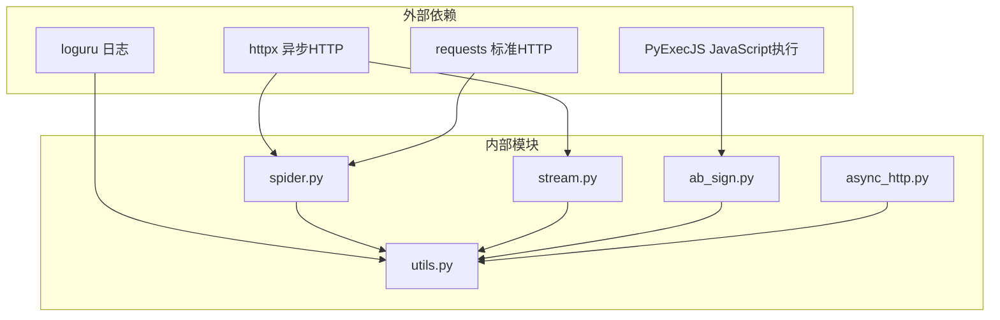
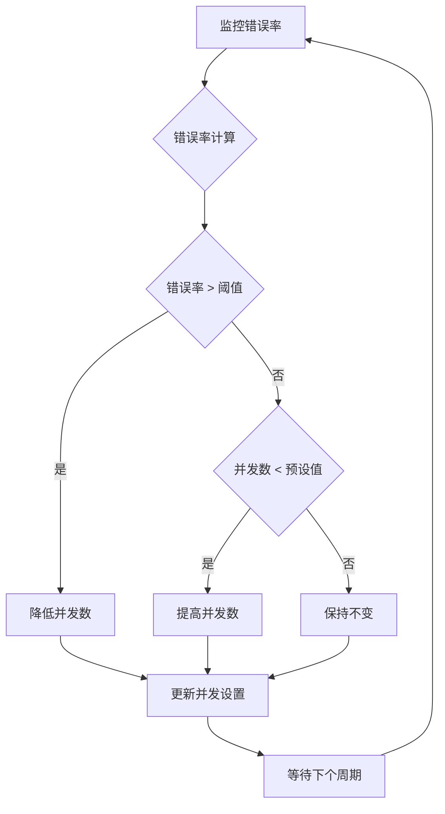

# 平台API规范

<cite>
**本文档引用的文件**
- [README.md](file://README.md)
- [main.py](file://main.py)
- [src/spider.py](file://src/spider.py)
- [src/stream.py](file://src/stream.py)
- [src/room.py](file://src/room.py)
- [src/ab_sign.py](file://src/ab_sign.py)
- [src/utils.py](file://src/utils.py)
- [src/http_clients/async_http.py](file://src/http_clients/async_http.py)
- [src/proxy.py](file://src/proxy.py)
- [demo.py](file://demo.py)
- [msg_push.py](file://msg_push.py)
- [requirements.txt](file://requirements.txt)
- [config/URL_config.ini](file://config/URL_config.ini)
</cite>

## 目录
1. [简介](#简介)
2. [项目结构](#项目结构)
3. [核心组件](#核心组件)
4. [架构概览](#架构概览)
5. [详细组件分析](#详细组件分析)
6. [依赖分析](#依赖分析)
7. [性能考虑](#性能考虑)
8. [故障排除指南](#故障排除指南)
9. [结论](#结论)
10. [附录](#附录)

## 简介

DouyinLiveRecorder 是一个功能强大的直播平台录制工具，支持超过50个主流直播平台。该项目采用异步架构设计，实现了对抖音、TikTok、快手、虎牙、斗鱼、B站等国内外直播平台的统一API接口规范。

本项目的核心目标是提供稳定可靠的直播录制服务，支持多平台并发监控、智能画质选择、代理支持、消息推送等功能。通过标准化的API接口设计，开发者可以轻松集成和扩展新的直播平台支持。

## 项目结构



**图表来源**
- [main.py:1-800](file://main.py#L1-L800)
- [src/spider.py:1-800](file://src/spider.py#L1-L800)
- [src/stream.py:1-446](file://src/stream.py#L1-L446)

**章节来源**
- [README.md:72-100](file://README.md#L72-L100)
- [main.py:41-45](file://main.py#L41-L45)

## 核心组件

### 主程序入口 (main.py)

主程序负责整个应用的生命周期管理，包括：

- **并发控制**: 通过信号量机制控制同时访问网络的线程数量
- **录制管理**: 监控直播状态，自动开始和停止录制
- **配置管理**: 动态加载和更新配置参数
- **错误处理**: 实现智能错误率监控和自适应调整

### 数据爬取模块 (src/spider.py)

专门负责从各个直播平台抓取直播数据，支持：

- **多平台适配**: 针对不同平台的特定API接口
- **反爬虫对抗**: 实现X-Bogus签名算法和风控绕过
- **数据解析**: 统一解析各平台的直播流信息
- **错误恢复**: 自动处理网络异常和平台变更

### 流地址解析模块 (src/stream.py)

负责将爬取到的直播数据转换为可用的流地址：

- **格式转换**: 支持m3u8和flv等多种视频格式
- **质量选择**: 智能选择最优画质和码率
- **CDN优选**: 自动选择最佳CDN节点
- **协议适配**: 支持HTTP、HTTPS、HLS等多种协议

**章节来源**
- [main.py:545-800](file://main.py#L545-L800)
- [src/spider.py:68-282](file://src/spider.py#L68-L282)
- [src/stream.py:40-153](file://src/stream.py#L40-L153)

## 架构概览



**图表来源**
- [main.py:545-800](file://main.py#L545-L800)
- [src/spider.py:68-282](file://src/spider.py#L68-L282)
- [src/stream.py:40-153](file://src/stream.py#L40-L153)

## 详细组件分析

### 抖音平台API规范

#### 接口调用方法

抖音平台支持两种主要的数据获取方式：

1. **网页端接口** (`get_douyin_web_stream_data`)
2. **App端接口** (`get_douyin_app_stream_data`)

#### 认证机制



**图表来源**
- [src/ab_sign.py:444-455](file://src/ab_sign.py#L444-L455)
- [src/spider.py:68-141](file://src/spider.py#L68-L141)

#### 请求参数规范

| 参数名称 | 类型 | 必填 | 描述 | 示例 |
|---------|------|------|------|------|
| aid | string | 是 | 应用ID | "6383" |
| app_name | string | 是 | 应用名称 | "douyin_web" |
| live_id | string | 是 | 直播ID | "1" |
| device_platform | string | 是 | 设备平台 | "web" |
| web_rid | string | 是 | 房间ID | "745964462470" |
| msToken | string | 否 | Token验证 | 自动生成 |

#### 响应格式

```json
{
  "anchor_name": "主播昵称",
  "status": 2,
  "stream_url": {
    "hls_pull_url_map": {
      "ORIGIN": "hls地址?codec=h264"
    },
    "flv_pull_url": {
      "ORIGIN": "flv地址?codec=h264"
    }
  }
}
```

#### 错误处理策略

- **风控检测**: 自动识别并处理平台风控
- **备用方案**: 切换到App端接口
- **重试机制**: 智能重试失败的请求

**章节来源**
- [src/spider.py:68-141](file://src/spider.py#L68-L141)
- [src/ab_sign.py:444-455](file://src/ab_sign.py#L444-L455)

### TikTok平台API规范

#### 接口调用方法

TikTok平台使用网页端解析方式：

```python
async def get_tiktok_stream_data(url: str, proxy_addr: str = None, cookies: str = None)
```

#### 认证机制

TikTok采用复杂的风控机制，需要：

1. **Cookie管理**: 自动处理登录状态
2. **代理支持**: 海外访问需要代理
3. **User-Agent轮换**: 防止被识别为机器人

#### 请求参数

| 参数 | 类型 | 必填 | 说明 |
|------|------|------|------|
| url | string | 是 | TikTok直播URL |
| proxy_addr | string | 否 | 代理地址 |
| cookies | string | 否 | 登录Cookie |

#### 响应数据结构

```json
{
  "LiveRoom": {
    "liveRoomUserInfo": {
      "user": {
        "nickname": "用户名",
        "uniqueId": "唯一标识"
      },
      "liveRoom": {
        "title": "直播标题",
        "streamData": {
          "pull_data": {
            "stream_data": "流数据JSON"
          }
        }
      }
    }
  }
}
```

**章节来源**
- [src/spider.py:285-313](file://src/spider.py#L285-L313)
- [src/stream.py:81-153](file://src/stream.py#L81-L153)

### 快手平台API规范

#### 接口调用方法

快手平台提供两种数据获取方式：

1. **主接口** (`get_kuaishou_stream_data`)
2. **备用接口** (`get_kuaishou_stream_data2`)

#### 数据特点

快手直播数据包含多种分辨率选项：

| 分辨率 | 码率 | 适用场景 |
|--------|------|----------|
| h264 | 4000kbps | 超高清 |
| h265 | 2000kbps | 高清 |
| 自适应 | 动态 | 流畅播放 |

#### 错误处理

```python
{
  "type": 2,
  "is_live": False,
  "anchor_name": "主播昵称"
}
```

**章节来源**
- [src/spider.py:315-404](file://src/spider.py#L315-L404)
- [src/stream.py:156-206](file://src/stream.py#L156-L206)

### 虎牙平台API规范

#### 接口调用方法

虎牙平台支持两种模式：

1. **网页端** (`get_huya_stream_data`)
2. **App端** (`get_huya_app_stream_url`)

#### CDN优选机制



**图表来源**
- [src/spider.py:424-517](file://src/spider.py#L424-L517)
- [src/stream.py:209-299](file://src/stream.py#L209-L299)

#### 抗防盗链机制

虎牙采用复杂的防盗链机制，需要：

1. **动态参数生成**: 实时生成wsSecret等参数
2. **时间戳同步**: 确保服务器时间一致性
3. **签名验证**: 验证请求的合法性

**章节来源**
- [src/spider.py:424-517](file://src/spider.py#L424-L517)
- [src/stream.py:209-299](file://src/stream.py#L209-L299)

### 斗鱼平台API规范

#### 接口调用方法

斗鱼平台使用Token机制：

```python
async def get_douyu_info_data(url: str, proxy_addr: str = None, cookies: str = None)
```

#### Token生成算法

```python
def get_token_js(rid: str, did: str, proxy_addr: str = None) -> list:
    # 1. 获取页面HTML
    # 2. 提取JS代码
    # 3. 编译并执行JS
    # 4. 生成Token参数
    # 5. 返回参数列表
```

#### 请求参数

| 参数 | 类型 | 必填 | 说明 |
|------|------|------|------|
| v | string | 是 | 版本号 |
| did | string | 是 | 设备ID |
| tt | string | 是 | 时间戳 |
| sign | string | 是 | 签名 |
| ver | string | 是 | 接口版本 |
| rid | string | 是 | 房间ID |
| rate | string | 否 | 画质等级 |

**章节来源**
- [src/spider.py:524-544](file://src/spider.py#L524-L544)
- [src/spider.py:582-609](file://src/spider.py#L582-L609)

### B站平台API规范

#### 接口调用方法

B站平台提供双重验证：

1. **房间信息** (`get_bilibili_room_info`)
2. **播放地址** (`get_bilibili_stream_data`)

#### 画质选择机制



**图表来源**
- [src/stream.py:350-378](file://src/stream.py#L350-L378)
- [src/spider.py:707-766](file://src/spider.py#L707-L766)

#### Cookie要求

B站对登录状态有严格要求，需要有效的Cookie才能获取最高画质。

**章节来源**
- [src/stream.py:350-378](file://src/stream.py#L350-L378)
- [src/spider.py:707-766](file://src/spider.py#L707-L766)

## 依赖分析

### 核心依赖关系



**图表来源**
- [requirements.txt:1-7](file://requirements.txt#L1-L7)
- [src/spider.py:21-32](file://src/spider.py#L21-L32)

### 版本兼容性

| 组件 | 最低版本 | 推荐版本 | 兼容性 |
|------|----------|----------|--------|
| Python | 3.10 | 3.11+ | ✅ 完全兼容 |
| httpx | 0.28.1 | 0.28.1+ | ✅ 兼容 |
| PyExecJS | 1.5.1 | 1.5.1+ | ✅ 兼容 |
| requests | 2.31.0 | 2.31.0+ | ✅ 兼容 |

**章节来源**
- [requirements.txt:1-7](file://requirements.txt#L1-L7)

## 性能考虑

### 并发控制机制

系统采用智能并发控制：



**图表来源**
- [main.py:298-325](file://main.py#L298-L325)

### 性能优化策略

1. **异步I/O**: 使用async/await减少阻塞
2. **连接复用**: 复用HTTP连接池
3. **智能缓存**: 缓存常用配置和数据
4. **资源监控**: 实时监控系统资源使用

### 稳定性保障

- **超时控制**: 所有网络请求设置合理超时
- **重试机制**: 自动重试失败的操作
- **降级策略**: 在异常情况下提供降级方案
- **健康检查**: 定期检查各组件运行状态

## 故障排除指南

### 常见问题及解决方案

#### 1. 网络连接问题

**症状**: 请求超时或连接失败
**解决方案**:
- 检查代理设置
- 验证网络连通性
- 调整超时参数

#### 2. 平台风控

**症状**: 返回风控信息或数据为空
**解决方案**:
- 更新User-Agent
- 刷新Cookie
- 使用代理IP轮换

#### 3. 录制失败

**症状**: 视频文件损坏或无法播放
**解决方案**:
- 检查磁盘空间
- 验证FFmpeg安装
- 调整录制参数

### 调试工具

系统提供完善的调试功能：

```python
# 启用详细日志
logger.add("debug.log", level="DEBUG")

# 测试特定平台
test_live_stream("douyin", proxy_addr="127.0.0.1:8080")
```

**章节来源**
- [src/utils.py:38-51](file://src/utils.py#L38-L51)
- [demo.py:213-227](file://demo.py#L213-L227)

## 结论

DouyinLiveRecorder项目通过标准化的API接口设计，成功实现了对50+直播平台的支持。其核心优势包括：

1. **统一接口**: 通过标准化的数据结构，简化了多平台集成
2. **智能风控**: 采用多种反爬虫技术和风控绕过策略
3. **高性能架构**: 异步并发设计确保了系统的高效运行
4. **完整生态**: 包含录制、推送、配置管理等完整功能

该API规范为开发者提供了清晰的技术指导，便于扩展新的直播平台支持和定制化需求。

## 附录

### 支持的直播平台列表

**国内平台**:
- 抖音、快手、虎牙、斗鱼、YY、B站
- 小红书、bigo、blued、网易CC
- 千度热播、猫耳FM、Look直播
- TwitCasting、百度直播、微博直播
- 酷狗直播、花椒直播、流星直播
- Acfun、映客直播、音播直播、知乎直播
- CHZZK、嗨秀直播、VV星球直播、17Live
- 浪Live、畅聊直播、飘飘直播、六间房直播
- 乐嗨直播、花猫直播、淘宝、京东、咪咕直播
- 连接直播、来秀直播、Picarto

**海外平台**:
- TikTok、SOOP、PandaTV、WinkTV
- FlexTV、PopkonTV、TwitchTV、LiveMe
- ShowRoom、AfreecaTV、Shopee、YouTube
- Faceit、TwitCasting、Bigo、Blued

### API调用示例

```python
# 基本使用示例
import asyncio
from src import spider

async def get_live_data():
    # 抖音直播数据获取
    data = await spider.get_douyin_app_stream_data(
        url="https://live.douyin.com/745964462470",
        proxy_addr="127.0.0.1:8080",
        cookies="your_cookie_here"
    )
    return data

# 批量处理示例
async def batch_process():
    platforms = ["douyin", "tiktok", "kuaishou"]
    tasks = [test_live_stream(platform) for platform in platforms]
    await asyncio.gather(*tasks)
```

**章节来源**
- [demo.py:8-210](file://demo.py#L8-L210)
- [README.md:15-68](file://README.md#L15-L68)