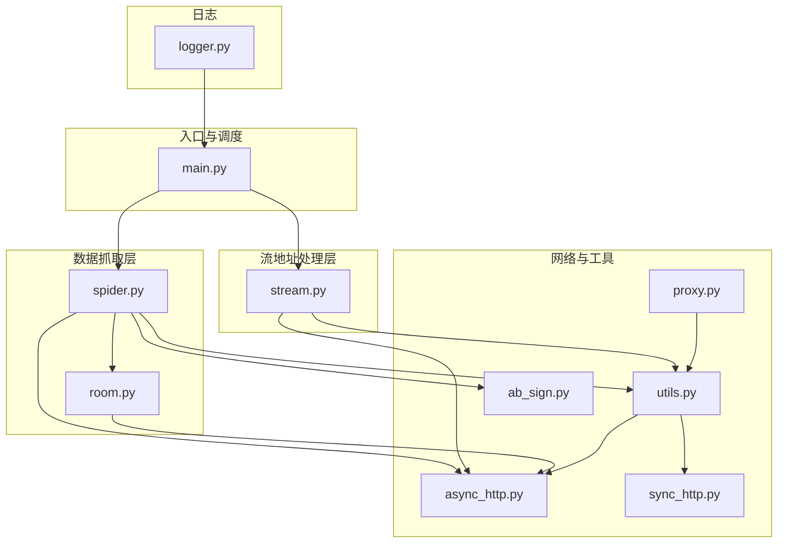
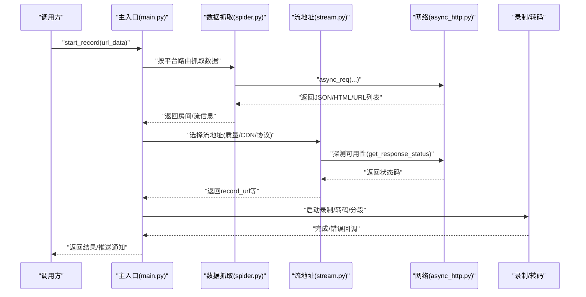
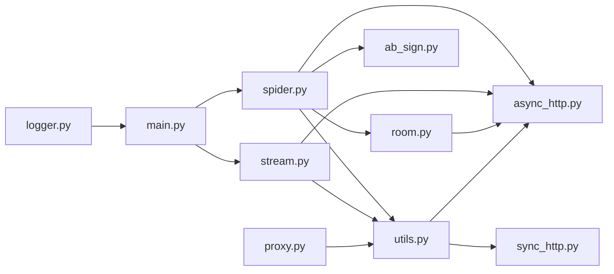

# 核心API接口

<cite>
**本文引用的文件**
- [main.py](file://main.py)
- [spider.py](file://src/spider.py)
- [stream.py](file://src/stream.py)
- [room.py](file://src/room.py)
- [async_http.py](file://src/http_clients/async_http.py)
- [sync_http.py](file://src/http_clients/sync_http.py)
- [utils.py](file://src/utils.py)
- [ab_sign.py](file://src/ab_sign.py)
- [proxy.py](file://src/proxy.py)
- [logger.py](file://src/logger.py)
- [demo.py](file://demo.py)
- [README.md](file://README.md)
</cite>

## 目录
1. [简介](#简介)
2. [项目结构](#项目结构)
3. [核心组件](#核心组件)
4. [架构总览](#架构总览)
5. [详细组件分析](#详细组件分析)
6. [依赖关系分析](#依赖关系分析)
7. [性能考量](#性能考量)
8. [故障排查指南](#故障排查指南)
9. [结论](#结论)
10. [附录](#附录)

## 简介
本文件聚焦于直播监控与数据抓取API、流地址处理API等核心接口，系统性梳理函数签名、参数定义、返回值格式、异常处理机制、调用流程、并发控制与错误码规范，并提供最佳实践示例与依赖关系图，帮助开发者快速理解并正确使用该系统的API架构。

## 项目结构
项目采用模块化设计，核心API分布在以下模块：
- 数据抓取层：spider.py 提供各平台直播数据抓取接口
- 流地址处理层：stream.py 提供统一的流地址选择与质量适配逻辑
- 平台适配层：room.py 提供房间ID、用户ID等辅助解析
- 网络请求层：async_http.py/sync_http.py 提供异步/同步HTTP请求封装
- 工具与安全：utils.py 提供通用工具、ab_sign.py 提供签名算法、proxy.py 提供代理检测
- 日志与入口：logger.py 提供日志配置、main.py 为主入口与录制调度

图表来源
- [main.py](file://main.py)
- [spider.py](file://src/spider.py)
- [stream.py](file://src/stream.py)
- [room.py](file://src/room.py)
- [async_http.py](file://src/http_clients/async_http.py)
- [sync_http.py](file://src/http_clients/sync_http.py)
- [utils.py](file://src/utils.py)
- [ab_sign.py](file://src/ab_sign.py)
- [proxy.py](file://src/proxy.py)
- [logger.py](file://src/logger.py)

章节来源
- [README.md](file://README.md)
- [main.py](file://main.py)

## 核心组件
- 数据抓取API：面向各直播平台的数据抓取接口，负责解析房间信息、直播状态、可用流地址等
- 流地址处理API：统一处理各平台返回的流地址，按质量选择、CDN优选、协议适配
- 网络请求API：异步/同步HTTP请求封装，支持代理、重定向、Cookie返回、状态探测
- 工具与安全API：通用工具、签名生成、代理检测、日志记录
- 主入口API：录制调度、并发控制、错误窗口与动态限速、消息推送、脚本执行

章节来源
- [spider.py](file://src/spider.py)
- [stream.py](file://src/stream.py)
- [async_http.py](file://src/http_clients/async_http.py)
- [sync_http.py](file://src/http_clients/sync_http.py)
- [utils.py](file://src/utils.py)
- [ab_sign.py](file://src/ab_sign.py)
- [proxy.py](file://src/proxy.py)
- [logger.py](file://src/logger.py)
- [main.py](file://main.py)

## 架构总览
系统采用“平台适配 + 数据抓取 + 流地址处理 + 录制调度”的分层架构。主入口根据URL类型路由到对应平台抓取函数，抓取成功后交由流地址处理模块选择最优流，随后进入录制流程；同时通过并发控制与错误率反馈动态调整并发度，保障稳定性。

图表来源
- [main.py](file://main.py)
- [spider.py](file://src/spider.py)
- [stream.py](file://src/stream.py)
- [async_http.py](file://src/http_clients/async_http.py)

## 详细组件分析

### 数据抓取API（spider.py）
- 功能概述：针对不同直播平台的网页/接口进行解析，抽取直播状态、房间信息、可用播放列表等
- 关键接口与签名要点
  - get_douyin_web_stream_data(url, proxy_addr=None, cookies=None) -> dict
    - 输入：直播页URL、可选代理、可选Cookies
    - 返回：房间信息字典，包含anchor_name、status、stream_url等
    - 异常：触发风控或解析失败抛出异常
  - get_douyin_app_stream_data(url, proxy_addr=None, cookies=None) -> dict
    - 输入：直播页URL、可选代理、可选Cookies
    - 返回：房间信息字典，包含anchor_name、status、stream_url等
    - 异常：风控或解析失败抛出异常
  - get_tiktok_stream_data(url, proxy_addr=None, cookies=None) -> dict|None
    - 输入：直播页URL、可选代理、可选Cookies
    - 返回：房间信息字典或None
    - 异常：网络阻断/解析失败抛出异常
  - get_kuaishou_stream_data(url, proxy_addr=None, cookies=None) -> dict
    - 输入：直播页URL、可选代理、可选Cookies
    - 返回：包含is_live、flv_url_list等字段的字典
  - get_huya_stream_data(url, proxy_addr=None, cookies=None) -> dict
    - 输入：直播页URL、可选代理、可选Cookies
    - 返回：包含stream数据的字典
  - get_douyu_stream_data(rid, rate='-1', proxy_addr=None, cookies=None) -> dict
    - 输入：房间ID、可选清晰度等级、可选代理、可选Cookies
    - 返回：包含rtmp_url等字段的字典
  - get_yy_stream_data(url, proxy_addr=None, cookies=None) -> dict
    - 输入：直播页URL、可选代理、可选Cookies
    - 返回：包含avp_info_res等字段的字典
  - get_bilibili_room_info(url, proxy_addr=None, cookies=None) -> dict
    - 输入：直播页URL、可选代理、可选Cookies
    - 返回：包含anchor_name、live_status、title等字段的字典
  - get_bilibili_stream_data(url, qn='10000', platform='web', proxy_addr=None, cookies=None) -> OptionalStr
    - 输入：直播页URL、清晰度qn、平台、可选代理、可选Cookies
    - 返回：播放URL或None
  - get_xhs_stream_url(url, proxy_addr=None, cookies=None) -> dict
    - 输入：直播页URL、可选代理、可选Cookies
    - 返回：包含is_live、flv_url等字段的字典
  - 其他平台：get_*_stream_data、get_*_app_stream_url、get_*_info_data等
- 参数与返回值约定
  - proxy_addr：代理地址字符串，内部会标准化为http://前缀
  - cookies：字符串形式的Cookie，部分平台会覆盖默认Cookie
  - 返回值均为字典或None，包含is_live、anchor_name、title、play_url_list等字段
- 异常处理机制
  - 使用装饰器trace_error_decorator捕获异常并记录日志
  - 部分接口在风控或解析失败时抛出异常，调用方需捕获处理
- 调用流程
  - 主入口根据URL匹配平台，调用对应抓取函数
  - 抓取函数内部使用async_req发起HTTP请求，解析响应后返回结构化数据

章节来源
- [spider.py](file://src/spider.py)
- [async_http.py](file://src/http_clients/async_http.py)
- [utils.py](file://src/utils.py)

### 流地址处理API（stream.py）
- 功能概述：对各平台返回的流地址进行质量选择、CDN优选、协议适配与可用性探测
- 关键接口与签名要点
  - get_douyin_stream_url(json_data, video_quality, proxy_addr) -> dict
    - 输入：抓取返回的json_data、期望清晰度、代理地址
    - 返回：包含anchor_name、is_live、title、m3u8_url、flv_url、record_url、quality等字段
    - 质量选择：按OD/BD/UHD/HD/SD/LD映射，若首选URL不可用则降级
  - get_tiktok_stream_url(json_data, video_quality, proxy_addr) -> dict
    - 输入：抓取返回的json_data、期望清晰度、代理地址
    - 返回：按vbitrate与分辨率排序，选择最优URL
  - get_kuaishou_stream_url(json_data, video_quality) -> dict
    - 输入：抓取返回的json_data、期望清晰度
    - 返回：按bitrate或分辨率映射选择URL
  - get_huya_stream_url(json_data, video_quality) -> dict
    - 输入：抓取返回的json_data、期望清晰度
    - 返回：生成带anti_code的新URL，按质量参数拼接
  - get_douyu_stream_url(json_data, video_quality, cookies, proxy_addr) -> dict
    - 输入：抓取返回的json_data、期望清晰度、Cookies、代理地址
    - 返回：通过get_douyu_stream_data获取rtmp_url并拼接record_url
  - get_yy_stream_url(json_data) -> dict
    - 输入：抓取返回的json_data
    - 返回：从stream_line_addr中选择CDN并返回flv_url
  - get_bilibili_stream_url(json_data, video_quality, proxy_addr, cookies) -> dict
    - 输入：抓取返回的json_data、期望清晰度、代理地址、Cookies
    - 返回：通过get_bilibili_stream_data获取播放URL
  - get_stream_url(json_data, video_quality, url_type='m3u8', spec=False, hls_extra_key=None, flv_extra_key=None) -> dict
    - 输入：抓取返回的json_data、期望清晰度、URL类型、是否特例模式、HLS/FLV额外键
    - 返回：按quality选择m3u8/flv并返回record_url
- 参数与返回值约定
  - video_quality：支持字符串映射（OD/BD/UHD/HD/SD/LD）或数字索引
  - url_type：'m3u8'、'flv'、'all'
  - spec：是否使用平台特例逻辑
- 异常处理机制
  - 使用装饰器trace_error_decorator捕获异常并记录日志
  - 可用性探测通过get_response_status进行HEAD请求，返回布尔值
- 调用流程
  - 主入口在抓取完成后调用对应平台的流地址处理函数
  - 处理函数内部进行质量映射、URL拼接、可用性探测与降级策略

章节来源
- [stream.py](file://src/stream.py)
- [async_http.py](file://src/http_clients/async_http.py)

### 网络请求API（async_http.py / sync_http.py）
- 功能概述：统一的HTTP请求封装，支持代理、重定向、Cookie返回、状态探测
- 关键接口与签名要点
  - async_req(url, proxy_addr=None, headers=None, data=None, json_data=None, timeout=20, redirect_url=False, return_cookies=False, include_cookies=False, abroad=False, content_conding='utf-8', verify=False, http2=True) -> OptionalDict|OptionalStr|tuple
    - 输入：URL、代理、请求头、请求体、超时、是否跟随重定向、是否返回Cookie、是否包含Cookie、是否海外、编码、SSL验证、HTTP/2开关
    - 返回：文本字符串、重定向URL或Cookie字典/元组
    - 异常：请求异常返回字符串表示
  - get_response_status(url, proxy_addr=None, headers=None, timeout=10, abroad=False, verify=False, http2=False) -> bool
    - 输入：URL、代理、请求头、超时、是否海外、SSL验证、HTTP/2开关
    - 返回：HEAD请求状态码为200时返回True，否则False
  - sync_req(...) -> str
    - 同步版本，支持gzip解码、HTTPError处理、URLError处理
- 参数与返回值约定
  - proxy_addr：标准化为http://前缀
  - redirect_url：返回最终重定向URL
  - return_cookies：返回Cookie字典或包含Cookie的元组
- 异常处理机制
  - 统一捕获异常并返回字符串，便于上层判断
  - get_response_status仅返回布尔值，简化可用性判断
- 调用流程
  - 数据抓取与流地址处理模块统一通过async_req发起请求
  - 可用性探测通过get_response_status进行HEAD请求

章节来源
- [async_http.py](file://src/http_clients/async_http.py)
- [sync_http.py](file://src/http_clients/sync_http.py)
- [utils.py](file://src/utils.py)

### 工具与安全API（utils.py / ab_sign.py / proxy.py）
- 工具API（utils.py）
  - trace_error_decorator：异常捕获与日志记录装饰器
  - handle_proxy_addr：代理地址标准化
  - dict_to_cookie_str：字典转Cookie字符串
  - get_query_params：解析URL查询参数
  - check_md5、remove_emojis、check_disk_capacity等：文件与文本处理
- 安全API（ab_sign.py）
  - ab_sign(url_search_params, user_agent) -> str：生成a_bogus签名
  - SM3、rc4_encrypt等：签名算法实现
- 代理检测API（proxy.py）
  - ProxyDetector：跨平台代理检测，返回ProxyInfo
- 参数与返回值约定
  - 代理地址标准化为http://前缀
  - Cookie字符串格式为key=value; key2=value2
- 异常处理机制
  - 工具函数内部捕获异常并返回默认值或空集合
  - 代理检测在Windows/Linux下分别读取注册表/环境变量
- 调用流程
  - 数据抓取模块在构造请求时调用ab_sign生成签名
  - 主入口在需要时调用ProxyDetector获取系统代理

章节来源
- [utils.py](file://src/utils.py)
- [ab_sign.py](file://src/ab_sign.py)
- [proxy.py](file://src/proxy.py)

### 主入口API（main.py）
- 功能概述：录制调度、并发控制、错误率反馈、消息推送、脚本执行
- 关键接口与签名要点
  - start_record(url_data, count_variable=-1) -> None
    - 输入：(清晰度, URL, 主播名)元组、计数变量
    - 流程：按平台路由抓取 -> 流地址处理 -> 录制/转码/分段 -> 结束回调
  - direct_download_stream(source_url, save_path, record_name, live_url, platform) -> bool
    - 输入：源URL、保存路径、录制名称、直播URL、平台
    - 返回：下载成功返回True，否则False
  - check_subprocess(record_name, record_url, ffmpeg_command, save_type, script_command=None) -> bool
    - 输入：录制名称、直播URL、FFmpeg命令、保存类型、可选脚本命令
    - 返回：子进程返回码非0时返回False，否则True
  - adjust_max_request() -> None
    - 动态调整并发线程数，基于错误率滑动窗口
  - push_message(record_name, live_url, content) -> None
    - 输入：录制名称、直播URL、内容
    - 行为：按配置推送至多种平台
- 参数与返回值约定
  - 并发控制：通过全局max_request与锁保护
  - 错误率：5秒窗口内统计错误数，超过阈值降低并发，低于阈值恢复
  - 消息推送：支持微信、钉钉、邮箱、TG、BARK、NTFY、PUSHPLUS
- 异常处理机制
  - 录制过程中注释或停止请求时优雅退出
  - 子进程返回码非0时记录错误并清理状态
- 调用流程
  - 主入口接收URL列表，按平台路由到抓取与流处理
  - 通过semaphore与并发控制限制同时访问数量
  - 录制完成后触发转码/分段/脚本执行

章节来源
- [main.py](file://main.py)

## 依赖关系分析

图表来源
- [main.py](file://main.py)
- [spider.py](file://src/spider.py)
- [stream.py](file://src/stream.py)
- [room.py](file://src/room.py)
- [async_http.py](file://src/http_clients/async_http.py)
- [sync_http.py](file://src/http_clients/sync_http.py)
- [utils.py](file://src/utils.py)
- [ab_sign.py](file://src/ab_sign.py)
- [proxy.py](file://src/proxy.py)
- [logger.py](file://src/logger.py)

章节来源
- [main.py](file://main.py)
- [spider.py](file://src/spider.py)
- [stream.py](file://src/stream.py)
- [room.py](file://src/room.py)
- [async_http.py](file://src/http_clients/async_http.py)
- [sync_http.py](file://src/http_clients/sync_http.py)
- [utils.py](file://src/utils.py)
- [ab_sign.py](file://src/ab_sign.py)
- [proxy.py](file://src/proxy.py)
- [logger.py](file://src/logger.py)

## 性能考量
- 并发控制与动态限速
  - 通过全局max_request与锁保护，结合5秒错误率滑动窗口动态调整并发
  - 当错误率高于阈值时降低并发，低于阈值时逐步恢复
- 请求可用性探测
  - 使用HEAD请求探测URL可用性，避免无效流导致的录制失败
- 代理与网络优化
  - 支持代理地址标准化与平台特定代理启用
  - 异步HTTP客户端支持HTTP/2与SSL验证开关
- 录制与转码
  - 支持分段录制与转码（h264/MP4），减少单文件体积与兼容性问题
- 日志与可观测性
  - 使用loguru记录DEBUG/ERROR级别日志，区分普通信息与错误信息

[本节为通用指导，无需特定文件引用]

## 故障排查指南
- 常见错误与定位
  - 网络阻断/风控：数据抓取接口抛出异常，检查代理与User-Agent
  - 解析失败：返回空或字段缺失，检查URL有效性与平台支持情况
  - 流地址不可用：通过get_response_status探测，触发降级策略
  - 录制中断：注释或停止请求导致优雅退出，检查URL配置与停止信号
- 日志与调试
  - 使用logger记录详细堆栈信息，定位异常发生位置
  - 通过PlayURL.log输出播放URL，便于人工验证
- 最佳实践
  - 为海外平台配置代理并启用平台特定代理
  - 合理设置并发与错误率阈值，避免被平台封禁
  - 录制完成后及时转码与分段，提升后续处理效率

章节来源
- [logger.py](file://src/logger.py)
- [main.py](file://main.py)
- [spider.py](file://src/spider.py)
- [stream.py](file://src/stream.py)

## 结论
该系统通过清晰的分层架构与完善的API设计，实现了多平台直播数据抓取、流地址处理与录制调度的自动化。数据抓取API覆盖主流直播平台，流地址处理API提供质量与CDN优选，网络请求API统一了代理与可用性探测，主入口API实现了并发控制与动态限速。配合日志与异常处理机制，系统具备良好的稳定性与可维护性。

[本节为总结，无需特定文件引用]

## 附录

### API调用最佳实践示例（路径指引）
- 使用demo.py测试平台抓取
  - 示例：调用spider.get_douyin_app_stream_data
  - 路径：[demo.py](file://demo.py)
- 自定义录制流程
  - 步骤：start_record -> 抓取 -> 流处理 -> 录制/转码/分段
  - 路径：[main.py](file://main.py)
- 并发控制与错误率反馈
  - 路径：[main.py](file://main.py)
- 签名与代理
  - 路径：[ab_sign.py](file://src/ab_sign.py)、[proxy.py](file://src/proxy.py)

章节来源
- [demo.py](file://demo.py)
- [main.py](file://main.py)
- [ab_sign.py](file://src/ab_sign.py)
- [proxy.py](file://src/proxy.py)