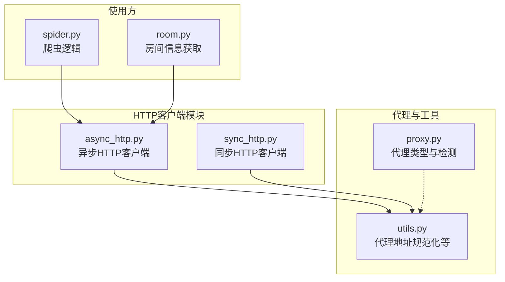
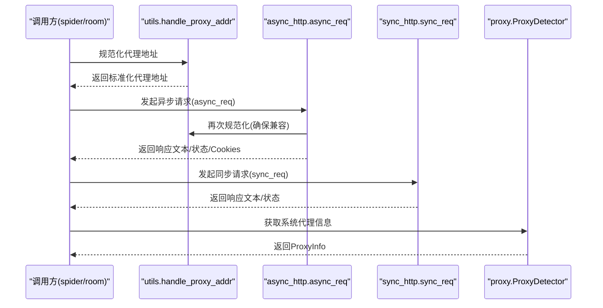
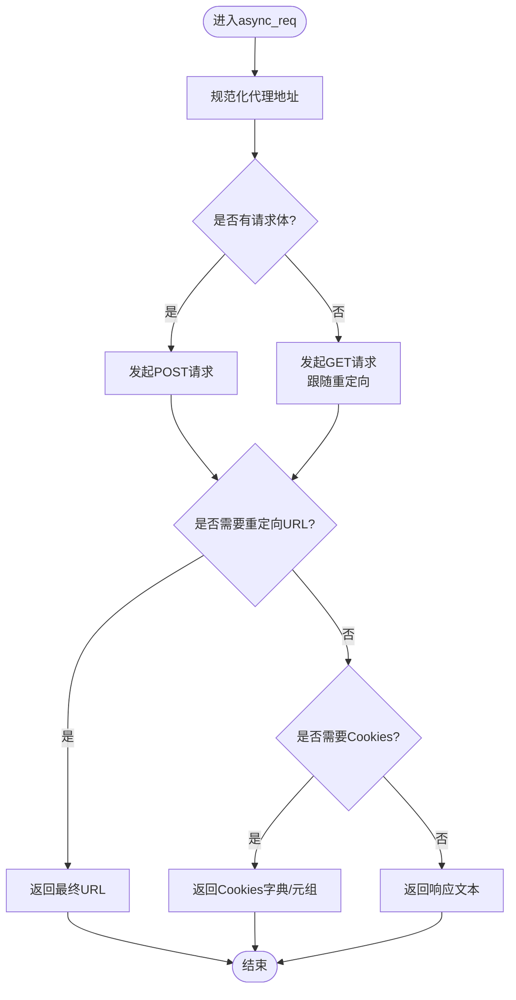
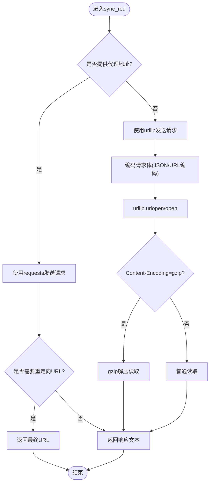
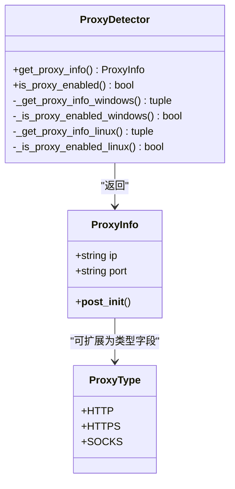
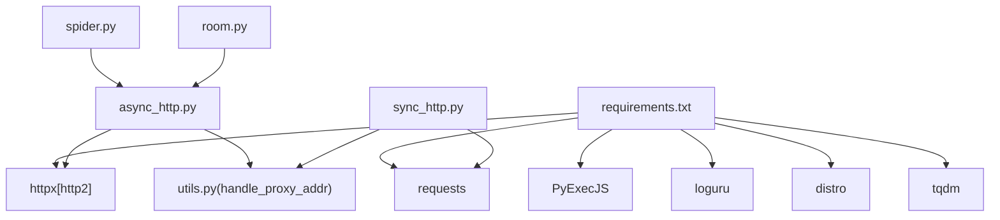

# HTTP客户端模块

<cite>
**本文档引用的文件**
- [async_http.py](file://src/http_clients/async_http.py)
- [sync_http.py](file://src/http_clients/sync_http.py)
- [proxy.py](file://src/proxy.py)
- [utils.py](file://src/utils.py)
- [spider.py](file://src/spider.py)
- [room.py](file://src/room.py)
- [requirements.txt](file://requirements.txt)
- [README.md](file://README.md)
</cite>

## 目录
1. [简介](#简介)
2. [项目结构](#项目结构)
3. [核心组件](#核心组件)
4. [架构概览](#架构概览)
5. [详细组件分析](#详细组件分析)
6. [依赖分析](#依赖分析)
7. [性能考量](#性能考量)
8. [故障排查指南](#故障排查指南)
9. [结论](#结论)
10. [附录](#附录)

## 简介
本文件面向HTTP客户端模块，系统性阐述异步HTTP客户端与同步HTTP客户端的设计理念、实现细节、性能特征与并发能力；同时详解代理支持功能的配置方法、代理类型选择与代理池管理策略。文档还提供HTTP请求头设置、重试机制、超时处理的最佳实践，并结合项目中的实际使用场景，帮助开发者在不同业务场景下做出合适的选择。

## 项目结构
HTTP客户端模块位于src/http_clients目录，配合src/proxy.py提供代理能力，src/utils.py提供通用工具函数（含代理地址规范化），并在src/spider.py、src/room.py等模块中广泛使用。

图表来源
- [async_http.py:1-60](file://src/http_clients/async_http.py#L1-L60)
- [sync_http.py:1-89](file://src/http_clients/sync_http.py#L1-L89)
- [proxy.py:1-93](file://src/proxy.py#L1-L93)
- [utils.py:162-168](file://src/utils.py#L162-L168)
- [spider.py:31](file://src/spider.py#L31)
- [room.py:52](file://src/room.py#L52)

章节来源
- [async_http.py:1-60](file://src/http_clients/async_http.py#L1-L60)
- [sync_http.py:1-89](file://src/http_clients/sync_http.py#L1-L89)
- [proxy.py:1-93](file://src/proxy.py#L1-L93)
- [utils.py:162-168](file://src/utils.py#L162-L168)
- [spider.py:31](file://src/spider.py#L31)
- [room.py:52](file://src/room.py#L52)

## 核心组件
- 异步HTTP客户端（async_http.py）
  - 提供async_req与get_response_status两个核心函数，支持GET/POST、重定向跟随、Cookies返回、SSL验证开关、HTTP/2等特性。
  - 通过httpx.AsyncClient实现异步请求，具备高并发与低阻塞优势。
- 同步HTTP客户端（sync_http.py）
  - 提供sync_req函数，支持requests与urllib两种路径，适配代理与非代理场景，内置gzip解压与异常处理。
  - 适合单线程或轻量级同步任务。
- 代理支持（proxy.py）
  - 定义ProxyType枚举与ProxyInfo数据类，提供跨平台代理检测（Windows注册表、Linux环境变量）。
  - 支持HTTP/HTTPS/SOCKS类型，便于代理池管理与动态选择。
- 工具函数（utils.py）
  - handle_proxy_addr统一代理地址格式，确保httpx能正确识别代理协议。
  - 提供MD5校验、Cookie字符串拼接、配置读写等辅助能力。

章节来源
- [async_http.py:10-60](file://src/http_clients/async_http.py#L10-L60)
- [sync_http.py:20-89](file://src/http_clients/sync_http.py#L20-L89)
- [proxy.py:8-93](file://src/proxy.py#L8-L93)
- [utils.py:162-168](file://src/utils.py#L162-L168)

## 架构概览
异步与同步HTTP客户端共享代理地址规范化流程，异步客户端在httpx.AsyncClient中复用utils.handle_proxy_addr，同步客户端在requests与urllib路径中分别处理代理参数。代理检测模块为系统提供代理配置来源，便于在海外平台录制等场景启用代理。

图表来源
- [async_http.py:28](file://src/http_clients/async_http.py#L28)
- [sync_http.py:34](file://src/http_clients/sync_http.py#L34)
- [utils.py:162-168](file://src/utils.py#L162-L168)
- [proxy.py:38-49](file://src/proxy.py#L38-L49)

## 详细组件分析

### 异步HTTP客户端（async_http.py）
- 设计要点
  - 使用httpx.AsyncClient封装请求生命周期，支持GET/POST、follow_redirects、cookies提取、SSL验证与HTTP/2。
  - 通过utils.handle_proxy_addr确保代理地址带协议前缀，提升兼容性。
  - 提供get_response_status用于快速探测目标URL可达性。
- 并发与性能
  - 异步I/O模型，适合高并发抓取与直播流解析场景，减少阻塞等待。
  - http2参数可按需开启，降低网络开销。
- 错误处理
  - try-except捕获异常并返回字符串形式的错误信息，便于上层统一处理。
- 使用建议
  - 大量并发请求时，建议复用会话或控制并发数，避免资源耗尽。
  - 对海外平台或受限站点，合理设置timeout与verify参数。

图表来源
- [async_http.py:10-46](file://src/http_clients/async_http.py#L10-L46)

章节来源
- [async_http.py:10-60](file://src/http_clients/async_http.py#L10-L60)

### 同步HTTP客户端（sync_http.py）
- 设计要点
  - 支持requests与urllib两条路径：requests用于代理场景，urllib用于直连场景。
  - 自动gzip解压，处理Content-Encoding，支持400等HTTP错误的响应读取。
  - 内置SSL上下文配置，可按需关闭证书校验。
- 适用场景
  - 无需高并发的场景，或对第三方库依赖有约束的环境。
  - 与现有urllib生态集成的场景。
- 性能与限制
  - 同步阻塞模型，不适合大规模并发。
  - 代理与非代理路径差异较大，需注意一致性。

图表来源
- [sync_http.py:20-89](file://src/http_clients/sync_http.py#L20-L89)

章节来源
- [sync_http.py:20-89](file://src/http_clients/sync_http.py#L20-L89)

### 代理支持（proxy.py）
- 代理类型与数据结构
  - ProxyType枚举：HTTP、HTTPS、SOCKS。
  - ProxyInfo数据类：包含ip与port字段，提供端口范围校验与完整性检查。
- 代理检测
  - Windows：通过注册表读取Internet Settings中的ProxyEnable与ProxyServer。
  - Linux：通过http_proxy/https_proxy/ftp_proxy环境变量获取代理信息。
  - is_proxy_enabled用于判断系统是否启用代理。
- 代理池管理建议
  - 结合ProxyType与ProxyInfo，构建代理池列表，按平台或地域轮询或权重选择。
  - 对SOCKS类型，需确保httpx支持相应传输器（如httpx[socks]）。

图表来源
- [proxy.py:8-93](file://src/proxy.py#L8-L93)

章节来源
- [proxy.py:8-93](file://src/proxy.py#L8-L93)

### 实际使用场景与最佳实践
- 海外平台录制（README提及）
  - 对TikTok、AfreecaTV等海外平台，建议开启代理并配置proxy_addr。
  - 在配置文件中设置“使用代理录制的平台”，结合get_response_status进行健康检查。
- 请求头设置
  - 异步客户端：通过headers参数传入User-Agent、Cookie、Referer等。
  - 同步客户端：同样通过headers传入，注意与Cookie字符串拼接。
- 重试机制
  - 当前模块未内置重试，建议在调用方封装指数退避重试（如对get_response_status的探测）。
- 超时处理
  - 异步客户端：timeout参数控制请求超时；对海外平台可适当增大。
  - 同步客户端：timeout参数控制请求超时；urllib路径下也受timeout影响。
- SSL验证
  - 异步客户端：verify参数控制证书校验；仅在必要时关闭。
  - 同步客户端：SSL上下文默认关闭主机名校验与证书校验，谨慎使用。

章节来源
- [README.md:111](file://README.md#L111)
- [async_http.py:49-59](file://src/http_clients/async_http.py#L49-L59)
- [sync_http.py:13-15](file://src/http_clients/sync_http.py#L13-L15)

## 依赖分析
- 第三方库依赖
  - httpx[http2]：异步HTTP客户端，支持HTTP/2加速。
  - requests：同步HTTP客户端，支持代理与JSON/表单数据。
  - PyExecJS：JavaScript执行，用于签名算法等。
  - loguru、distro、tqdm：日志、系统信息与进度条。
- 模块间依赖
  - async_http.py/sync_http.py依赖utils.handle_proxy_addr进行代理地址规范化。
  - spider.py/room.py等模块在获取直播数据时调用异步HTTP客户端。

图表来源
- [requirements.txt:1-7](file://requirements.txt#L1-L7)
- [async_http.py:2](file://src/http_clients/async_http.py#L2)
- [sync_http.py:5](file://src/http_clients/sync_http.py#L5)
- [spider.py:31](file://src/spider.py#L31)
- [room.py:52](file://src/room.py#L52)

章节来源
- [requirements.txt:1-7](file://requirements.txt#L1-L7)
- [async_http.py:2](file://src/http_clients/async_http.py#L2)
- [sync_http.py:5](file://src/http_clients/sync_http.py#L5)
- [spider.py:31](file://src/spider.py#L31)
- [room.py:52](file://src/room.py#L52)

## 性能考量
- 异步优先
  - 在大量并发抓取、直播流解析等场景，优先使用异步HTTP客户端，显著降低阻塞与上下文切换成本。
- 代理与网络
  - 代理链路可能引入延迟，建议对关键接口进行健康检查与降级策略。
- 超时与重试
  - 合理设置timeout，结合指数退避重试，提高成功率与稳定性。
- SSL与HTTP/2
  - 在支持的环境下启用HTTP/2与证书校验，兼顾性能与安全。

## 故障排查指南
- 代理相关
  - 确认代理地址格式：http://ip:port或https://ip:port，utils.handle_proxy_addr会自动补全协议前缀。
  - 使用ProxyDetector检查系统代理状态，避免误判。
- 响应异常
  - 异步客户端返回字符串形式的异常信息，便于定位；同步客户端对400等错误会尝试读取响应体。
- 海外平台
  - 按README指引开启代理并设置代理地址；对受限站点适当增大timeout并检查verify参数。

章节来源
- [utils.py:162-168](file://src/utils.py#L162-L168)
- [proxy.py:38-49](file://src/proxy.py#L38-L49)
- [async_http.py:43-44](file://src/http_clients/async_http.py#L43-L44)
- [sync_http.py:73-83](file://src/http_clients/sync_http.py#L73-L83)
- [README.md:111](file://README.md#L111)

## 结论
HTTP客户端模块提供了异步与同步两种实现，满足不同并发与生态需求。结合代理支持与工具函数，能够灵活应对海外平台录制与复杂网络环境。建议在高并发场景优先采用异步HTTP客户端，并配合合理的超时、重试与代理策略，以获得更稳定与高效的网络访问体验。

## 附录
- 代码片段路径（不含具体代码内容）
  - 异步请求入口：[async_req函数:10-46](file://src/http_clients/async_http.py#L10-L46)
  - 健康检查：[get_response_status函数:49-59](file://src/http_clients/async_http.py#L49-L59)
  - 同步请求入口：[sync_req函数:20-89](file://src/http_clients/sync_http.py#L20-L89)
  - 代理地址规范化：[handle_proxy_addr函数:162-168](file://src/utils.py#L162-L168)
  - 代理类型与检测：[ProxyType/ProxyInfo/ProxyDetector:8-93](file://src/proxy.py#L8-L93)
  - 实际使用示例（异步）：[spider.py中async_req调用:50-65](file://src/spider.py#L50-L65)
  - 实际使用示例（异步）：[room.py中AsyncClient使用:57-59](file://src/room.py#L57-L59)