# JavaScript加密算法

<cite>
**本文档引用的文件**
- [x-bogus.js](file://src/javascript/x-bogus.js)
- [liveme.js](file://src/javascript/liveme.js)
- [migu.js](file://src/javascript/migu.js)
- [taobao-sign.js](file://src/javascript/taobao-sign.js)
- [haixiu.js](file://src/javascript/haixiu.js)
- [laixiu.js](file://src/javascript/laixiu.js)
- [ab_sign.py](file://src/ab_sign.py)
- [spider.py](file://src/spider.py)
- [utils.py](file://src/utils.py)
- [initializer.py](file://src/initializer.py)
- [demo.py](file://demo.py)
</cite>

## 目录
1. [项目概述](#项目概述)
2. [项目结构](#项目结构)
3. [核心组件](#核心组件)
4. [架构概览](#架构概览)
5. [详细组件分析](#详细组件分析)
6. [依赖关系分析](#依赖关系分析)
7. [性能考虑](#性能考虑)
8. [故障排除指南](#故障排除指南)
9. [结论](#结论)

## 项目概述

这是一个基于JavaScript加密算法的综合模块，主要用于处理各种直播平台的参数加密和签名验证。该系统集成了多种加密算法，包括X-Bogus算法、MD5加密、RC4加密以及平台特定的签名算法。

### 主要功能特性
- **多平台支持**: 支持抖音、淘宝、咪咕、LiveMe等多个直播平台
- **多种加密算法**: 包含X-Bogus复杂加密、MD5哈希、RC4对称加密
- **动态JavaScript执行**: 通过PyExecJS在Python环境中执行JavaScript代码
- **自动Node.js管理**: 自动检测和安装Node.js运行环境

## 项目结构

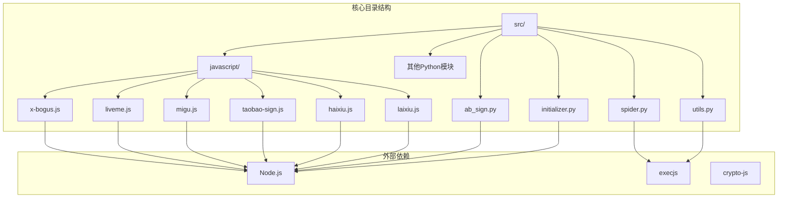

**图表来源**
- [initializer.py:1-221](file://src/initializer.py#L1-L221)
- [spider.py:1-200](file://src/spider.py#L1-L200)

**章节来源**
- [initializer.py:1-221](file://src/initializer.py#L1-L221)
- [spider.py:1-200](file://src/spider.py#L1-L200)

## 核心组件

### X-Bogus算法引擎
X-Bogus是抖音平台的核心反爬虫算法，采用复杂的虚拟机指令解释器：

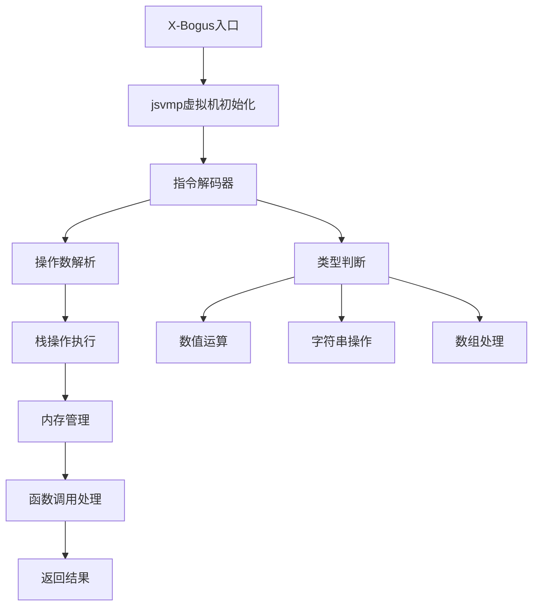

**图表来源**
- [x-bogus.js:9-328](file://src/javascript/x-bogus.js#L9-L328)

### 平台特定加密模块

#### LiveMe加密模块
LiveMe平台采用MD5和自定义签名算法：

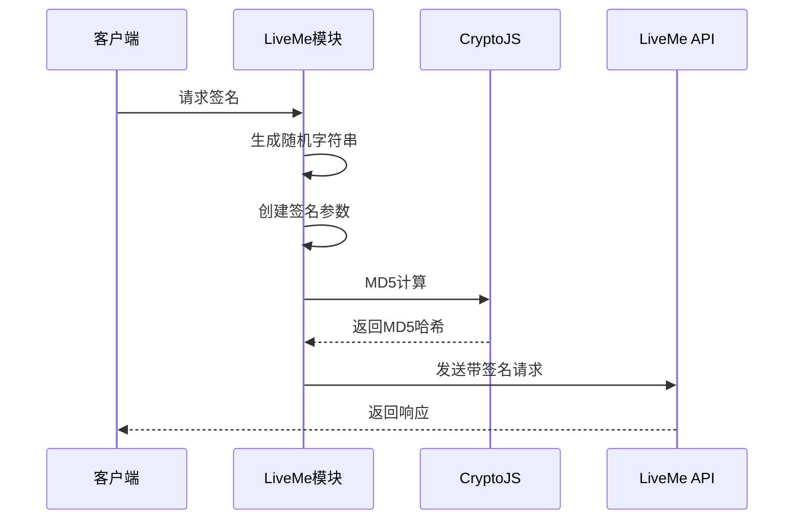

**图表来源**
- [liveme.js:331-425](file://src/javascript/liveme.js#L331-L425)

#### 咪咕视频WASM模块
咪咕视频使用WebAssembly进行参数计算：

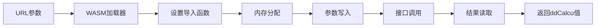

**图表来源**
- [migu.js:51-134](file://src/javascript/migu.js#L51-L134)

**章节来源**
- [x-bogus.js:1-564](file://src/javascript/x-bogus.js#L1-L564)
- [liveme.js:1-426](file://src/javascript/liveme.js#L1-L426)
- [migu.js:1-143](file://src/javascript/migu.js#L1-L143)

## 架构概览

### 整体系统架构

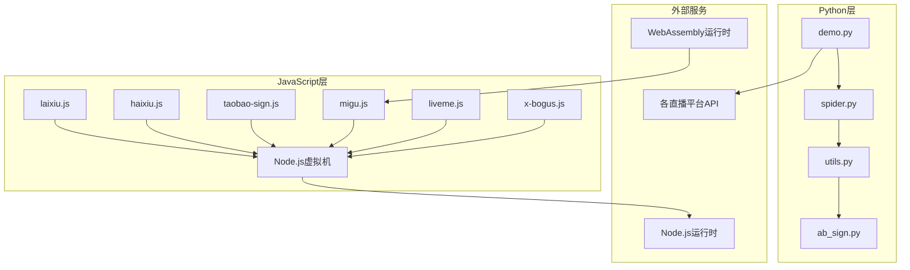

**图表来源**
- [demo.py:1-228](file://demo.py#L1-L228)
- [spider.py:1-200](file://src/spider.py#L1-L200)

### 加密算法执行流程

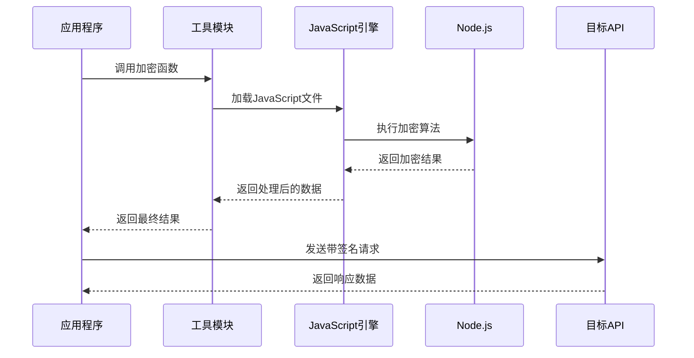

**图表来源**
- [utils.py:38-52](file://src/utils.py#L38-L52)
- [spider.py:68-141](file://src/spider.py#L68-L141)

**章节来源**
- [demo.py:1-228](file://demo.py#L1-L228)
- [spider.py:1-200](file://src/spider.py#L1-L200)
- [utils.py:1-206](file://src/utils.py#L1-L206)

## 详细组件分析

### X-Bogus算法实现

#### 核心虚拟机架构
X-Bogus算法采用了复杂的虚拟机架构，包含以下关键组件：

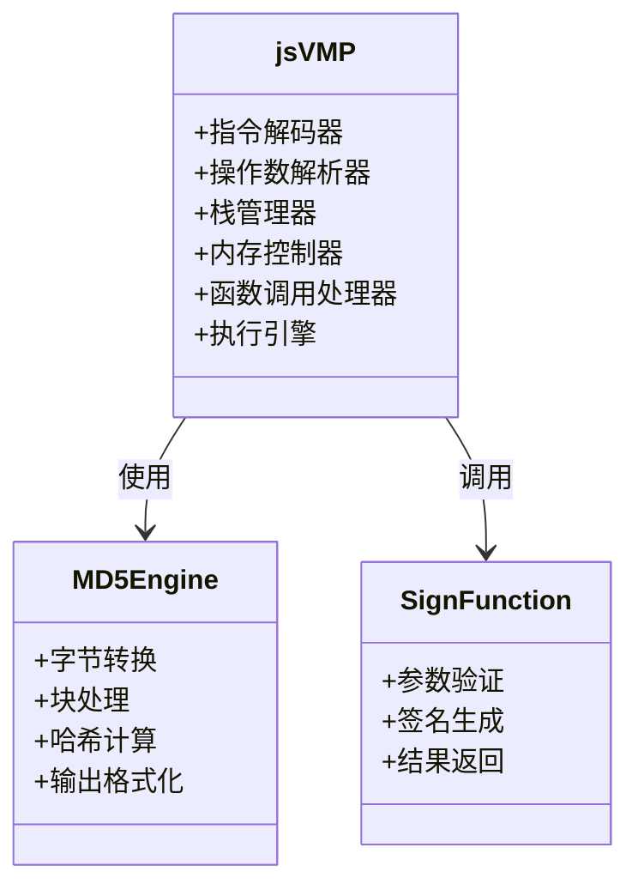

**图表来源**
- [x-bogus.js:330-453](file://src/javascript/x-bogus.js#L330-L453)

#### 指令执行机制
X-Bogus算法通过虚拟机指令解释器执行复杂的加密逻辑：

1. **指令解码**: 将十六进制指令转换为可执行的操作
2. **操作数解析**: 解析指令中的操作数和参数
3. **栈操作**: 执行栈相关的push/pop操作
4. **内存管理**: 管理虚拟机内存空间
5. **函数调用**: 处理函数调用和返回

**章节来源**
- [x-bogus.js:1-564](file://src/javascript/x-bogus.js#L1-L564)

### LiveMe平台加密算法

#### 参数生成规则
LiveMe平台的加密算法遵循以下规则：

1. **时间戳生成**: 使用当前毫秒时间戳
2. **随机字符串**: 生成指定长度的随机字符串
3. **签名参数构建**: 按字母顺序排列参数
4. **MD5计算**: 对最终字符串进行MD5哈希

#### 加密流程图

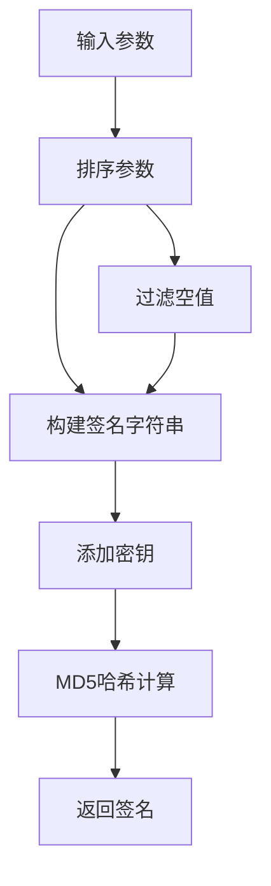

**图表来源**
- [liveme.js:331-351](file://src/javascript/liveme.js#L331-L351)

**章节来源**
- [liveme.js:1-426](file://src/javascript/liveme.js#L1-L426)

### 咪咕视频WASM模块

#### WebAssembly集成
咪咕视频的ddCalcu参数通过WebAssembly模块计算：

1. **WASM加载**: 动态加载咪咕视频的WASM模块
2. **内存管理**: 分配和管理WASM内存空间
3. **参数传递**: 将URL参数传递给WASM模块
4. **结果获取**: 从WASM模块获取计算结果

#### WASM执行流程

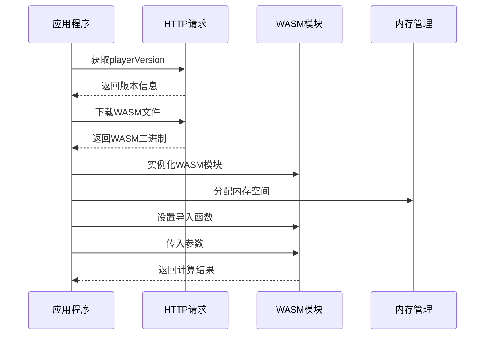

**图表来源**
- [migu.js:51-134](file://src/javascript/migu.js#L51-L134)

**章节来源**
- [migu.js:1-143](file://src/javascript/migu.js#L1-L143)

### 淘宝签名算法

#### MD5实现
淘宝的签名算法基于标准MD5实现：

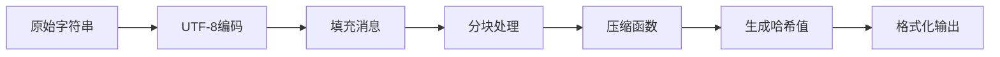

**图表来源**
- [taobao-sign.js:1-78](file://src/javascript/taobao-sign.js#L1-L78)

**章节来源**
- [taobao-sign.js:1-78](file://src/javascript/taobao-sign.js#L1-L78)

### 嗨秀平台加密算法

#### 复杂签名生成
嗨秀平台采用复杂的签名生成算法：

1. **参数预处理**: 清理和验证输入参数
2. **排序处理**: 按键名排序参数
3. **字符串拼接**: 将参数转换为字符串格式
4. **特殊处理**: 应用平台特定的处理规则
5. **最终签名**: 生成最终的签名字符串

**章节来源**
- [haixiu.js:1-539](file://src/javascript/haixiu.js#L1-L539)

### 来秀平台加密算法

#### 简单MD5签名
来秀平台的加密算法相对简单：

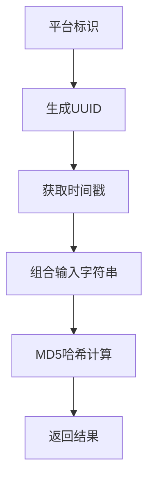

**图表来源**
- [laixiu.js:9-24](file://src/javascript/laixiu.js#L9-L24)

**章节来源**
- [laixiu.js:1-33](file://src/javascript/laixiu.js#L1-L33)

## 依赖关系分析

### Python与JavaScript交互

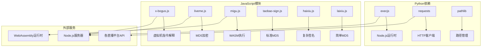

**图表来源**
- [utils.py:15-16](file://src/utils.py#L15-L16)
- [spider.py:25-32](file://src/spider.py#L25-L32)

### 错误处理机制

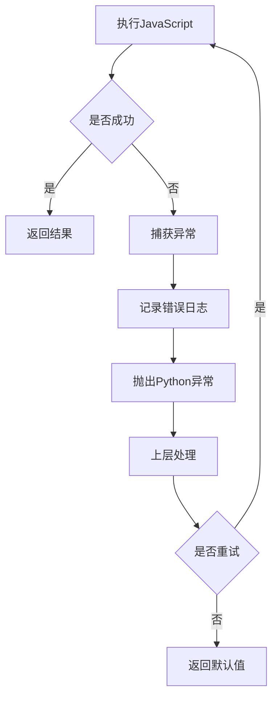

**图表来源**
- [utils.py:38-52](file://src/utils.py#L38-L52)

**章节来源**
- [utils.py:1-206](file://src/utils.py#L1-L206)
- [spider.py:1-200](file://src/spider.py#L1-L200)

## 性能考虑

### 执行效率优化

1. **缓存策略**: JavaScript模块加载后可以重复使用
2. **异步处理**: 使用async/await避免阻塞
3. **内存管理**: 及时释放WASM内存资源
4. **连接复用**: 复用HTTP连接减少开销

### 内存使用优化

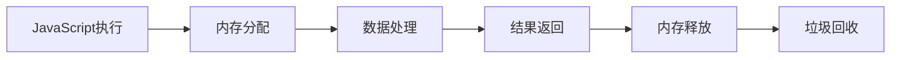

**图表来源**
- [migu.js:66-86](file://src/javascript/migu.js#L66-L86)

## 故障排除指南

### 常见问题及解决方案

#### Node.js环境问题
- **问题**: Node.js未安装或版本过低
- **解决方案**: 使用内置的自动安装功能或手动安装

#### JavaScript执行错误
- **问题**: execjs执行失败
- **解决方案**: 检查JavaScript语法和依赖

#### 加密算法错误
- **问题**: 签名验证失败
- **解决方案**: 检查参数格式和算法实现

#### WASM加载失败
- **问题**: WebAssembly模块无法加载
- **解决方案**: 检查网络连接和模块完整性

**章节来源**
- [initializer.py:179-204](file://src/initializer.py#L179-L204)
- [utils.py:38-52](file://src/utils.py#L38-L52)

## 结论

这个JavaScript加密算法模块提供了完整的多平台加密解决方案，具有以下特点：

1. **模块化设计**: 每个平台都有独立的加密模块
2. **灵活的执行方式**: 支持多种加密算法和执行环境
3. **完善的错误处理**: 提供详细的错误信息和恢复机制
4. **易于扩展**: 新平台的加密算法可以轻松集成

该系统为直播平台的数据采集提供了可靠的技术支撑，通过多种加密算法确保了数据传输的安全性和完整性。