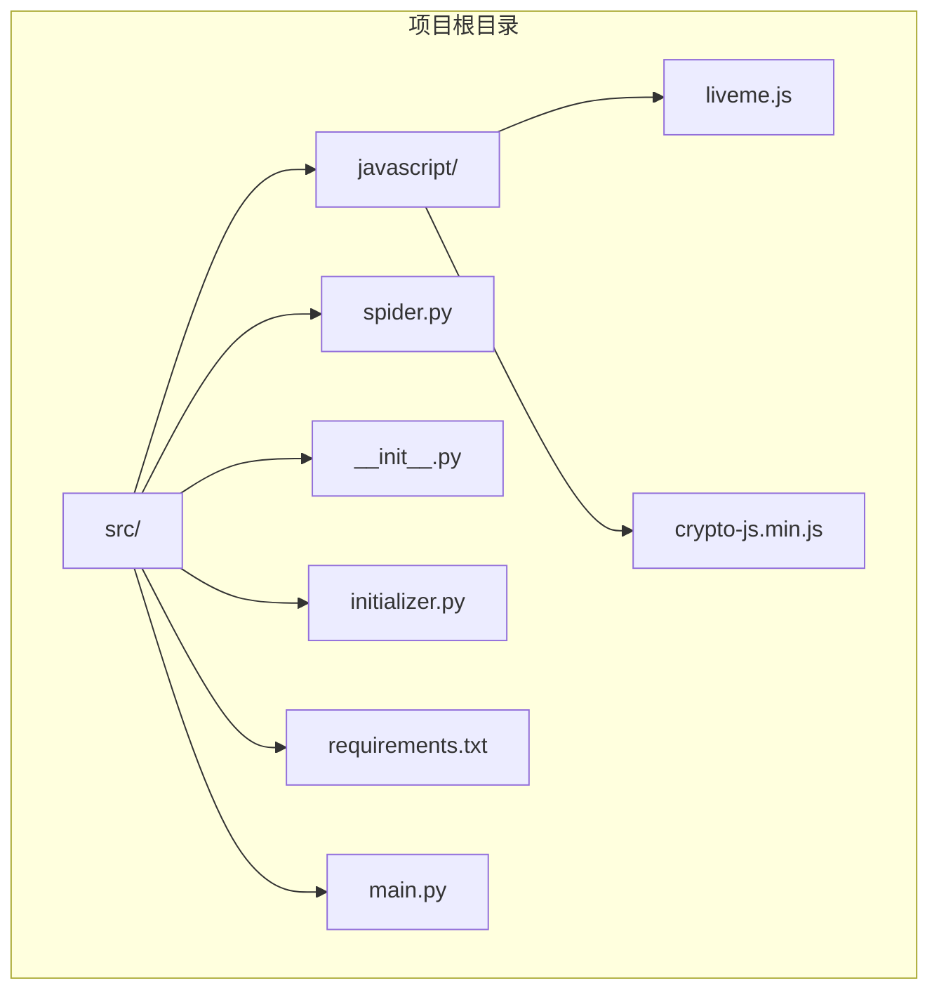
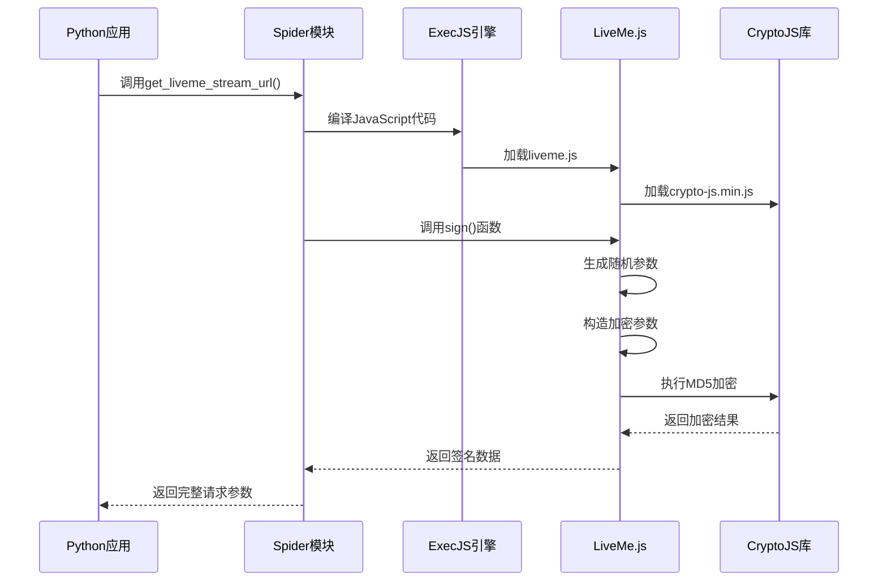
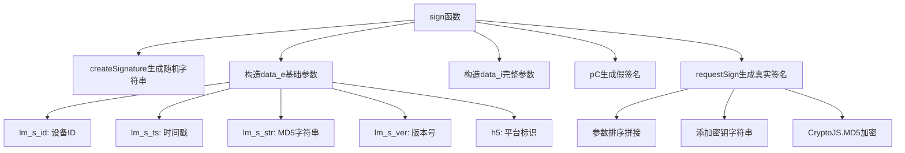
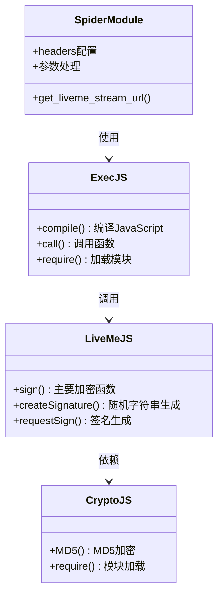
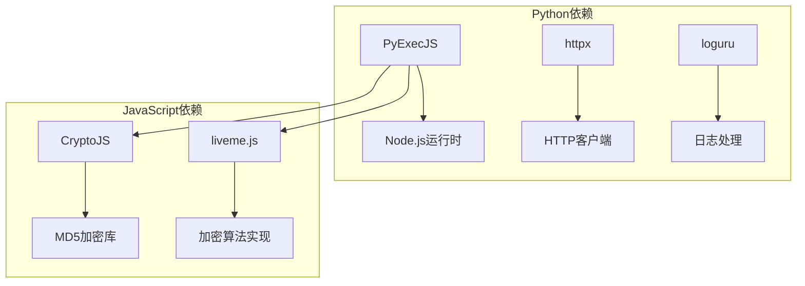
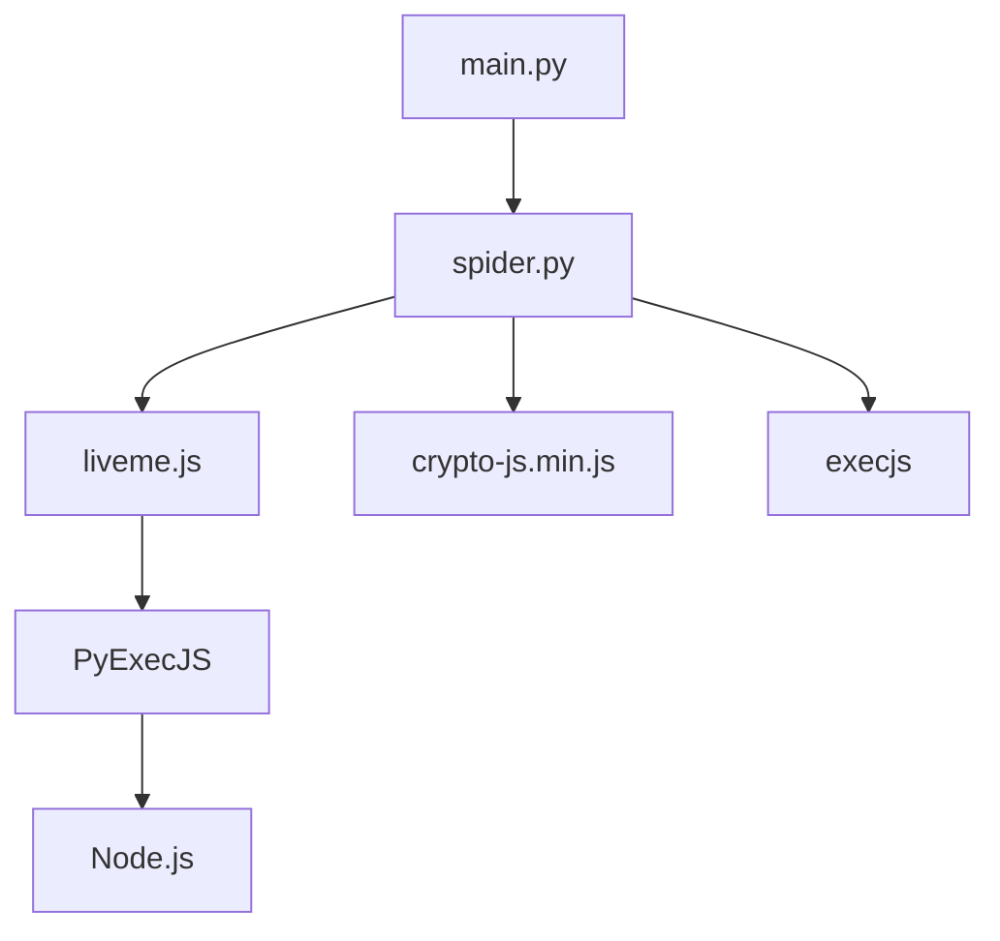

# LiveMe加密算法

<cite>
**本文档引用的文件**
- [liveme.js](file://src/javascript/liveme.js)
- [spider.py](file://src/spider.py)
- [__init__.py](file://src/__init__.py)
- [initializer.py](file://src/initializer.py)
- [requirements.txt](file://requirements.txt)
- [crypto-js.min.js](file://src/javascript/crypto-js.min.js)
- [main.py](file://main.py)
</cite>

## 目录
1. [简介](#简介)
2. [项目结构](#项目结构)
3. [核心组件](#核心组件)
4. [架构概览](#架构概览)
5. [详细组件分析](#详细组件分析)
6. [依赖关系分析](#依赖关系分析)
7. [性能考虑](#性能考虑)
8. [故障排除指南](#故障排除指南)
9. [结论](#结论)

## 简介

LiveMe加密算法是DouyinLiveRecorder项目中用于LiveMe直播平台身份验证的核心组件。该算法通过JavaScript实现，结合Python的PyExecJS库在Python环境中执行，实现了复杂的参数构造、数据处理和加密流程。

该项目是一个可循环值守的直播录制工具，支持多个直播平台的录制功能。LiveMe平台的加密算法是其中的一个重要组成部分，负责生成符合LiveMe服务器要求的签名参数。

## 项目结构

项目采用模块化设计，主要包含以下关键目录和文件：



**图表来源**
- [__init__.py:1-15](file://src/__init__.py#L1-L15)
- [liveme.js:1-426](file://src/javascript/liveme.js#L1-L426)

**章节来源**
- [__init__.py:1-15](file://src/__init__.py#L1-L15)
- [liveme.js:1-426](file://src/javascript/liveme.js#L1-L426)

## 核心组件

### JavaScript加密引擎

LiveMe平台的加密算法主要实现在`liveme.js`文件中，该文件包含了完整的加密逻辑实现。

### Python集成层

通过`spider.py`中的`get_liveme_stream_url`函数，Python代码与JavaScript加密算法进行集成。

### 环境配置

`__init__.py`和`initializer.py`负责Node.js环境的检测和配置，确保JavaScript加密算法能够正常执行。

**章节来源**
- [spider.py:2208-2236](file://src/spider.py#L2208-L2236)
- [__init__.py:1-15](file://src/__init__.py#L1-L15)
- [initializer.py:1-221](file://src/initializer.py#L1-L221)

## 架构概览

LiveMe加密算法的整体架构采用Python-Node.js混合执行模式：



**图表来源**
- [spider.py:2208-2236](file://src/spider.py#L2208-L2236)
- [liveme.js:353-421](file://src/javascript/liveme.js#L353-L421)

## 详细组件分析

### LiveMe.js加密算法实现

#### 主要函数结构



**图表来源**
- [liveme.js:353-421](file://src/javascript/liveme.js#L353-L421)
- [liveme.js:333-351](file://src/javascript/liveme.js#L333-L351)

#### 参数构造流程

加密算法的核心在于参数的构造和处理：

1. **基础参数生成** (`data_e`)
   - `lm_s_id`: 固定的设备标识符
   - `lm_s_ts`: 当前时间戳
   - `lm_s_str`: 预先计算的MD5字符串
   - `lm_s_ver`: 版本号
   - `h5`: 平台标识

2. **完整参数构建** (`data_i`)
   - 继承基础参数
   - 添加时间戳、渠道信息、房间ID等动态参数

3. **签名生成过程**
   - 生成假签名用于参数构造
   - 实际调用`requestSign`函数生成真实签名
   - 使用CryptoJS库进行MD5加密

**章节来源**
- [liveme.js:353-421](file://src/javascript/liveme.js#L353-L421)
- [liveme.js:333-351](file://src/javascript/liveme.js#L333-L351)

### Python集成机制

#### ExecJS执行流程



**图表来源**
- [spider.py:2208-2236](file://src/spider.py#L2208-L2236)
- [liveme.js:423-425](file://src/javascript/liveme.js#L423-L425)

#### 环境配置管理

项目通过`__init__.py`和`initializer.py`确保Node.js环境的正确配置：

1. **Node.js检测** (`check_node`)
   - 自动检测Node.js是否已安装
   - 如未安装则自动下载和配置

2. **环境变量设置** (`__init__.py`)
   - 设置JavaScript脚本路径
   - 配置Node.js执行环境

**章节来源**
- [spider.py:2208-2236](file://src/spider.py#L2208-L2236)
- [__init__.py:1-15](file://src/__init__.py#L1-L15)
- [initializer.py:218-221](file://src/initializer.py#L218-L221)

### 加密算法详细分析

#### 数据处理流程

```mermaid
flowchart LR
A[输入参数] --> B[参数排序]
B --> C[类型转换]
C --> D[字符串拼接]
D --> E[添加密钥]
E --> F[MD5加密]
F --> G[输出签名]
C --> H[数组处理: join(',')]
C --> I[对象处理: JSON.stringify]
C --> J[其他类型: 直接转换]
```

**图表来源**
- [liveme.js:333-351](file://src/javascript/liveme.js#L333-L351)

#### 关键算法组件

1. **随机字符串生成** (`createSignature`)
   - 使用预定义字符集
   - 支持动态长度生成
   - 用于生成验证参数

2. **参数序列化** (`requestSign`)
   - 递归处理嵌套对象
   - 统一数据类型转换
   - 严格按ASCII码排序

3. **MD5加密** (`CryptoJS.MD5`)
   - 基于标准MD5算法
   - 输出十六进制字符串
   - 符合LiveMe服务器要求

**章节来源**
- [liveme.js:11-40](file://src/javascript/liveme.js#L11-L40)
- [liveme.js:333-351](file://src/javascript/liveme.js#L333-L351)

## 依赖关系分析

### 外部依赖

项目的主要外部依赖包括：



**图表来源**
- [requirements.txt:1-7](file://requirements.txt#L1-L7)
- [liveme.js:331-332](file://src/javascript/liveme.js#L331-L332)

### 内部模块依赖



**图表来源**
- [main.py:845-852](file://main.py#L845-L852)
- [spider.py:2208-2236](file://src/spider.py#L2208-L2236)

**章节来源**
- [requirements.txt:1-7](file://requirements.txt#L1-L7)
- [main.py:845-852](file://main.py#L845-L852)

## 性能考虑

### 执行效率优化

1. **缓存策略**
   - JavaScript代码编译结果可重复使用
   - CryptoJS库实例可复用
   - 避免重复的模块加载

2. **内存管理**
   - 及时清理临时参数对象
   - 控制字符串拼接操作
   - 合理处理大对象序列化

3. **并发处理**
   - 支持异步执行模式
   - 避免阻塞主线程
   - 合理控制并发数量

### 网络性能

1. **请求优化**
   - 复用HTTP连接
   - 合理设置超时时间
   - 错误重试机制

2. **资源管理**
   - 及时释放Node.js进程
   - 控制内存使用峰值
   - 监控执行时间

## 故障排除指南

### 常见问题及解决方案

#### Node.js环境问题

**问题**: Node.js未正确安装或配置
**解决方案**:
1. 检查Node.js版本兼容性
2. 验证PATH环境变量设置
3. 重新运行初始化脚本

**章节来源**
- [initializer.py:179-204](file://src/initializer.py#L179-L204)

#### JavaScript执行错误

**问题**: PyExecJS执行JavaScript时出现异常
**解决方案**:
1. 检查JavaScript语法正确性
2. 验证CryptoJS库完整性
3. 确认模块路径正确

#### 加密算法错误

**问题**: 生成的签名不符合预期
**解决方案**:
1. 验证参数构造逻辑
2. 检查MD5加密结果
3. 对比测试数据

### 调试技巧

1. **日志记录**
   - 启用详细的调试日志
   - 记录参数序列化过程
   - 监控执行时间

2. **单元测试**
   - 编写独立的测试用例
   - 验证边界条件
   - 测试错误处理

3. **性能监控**
   - 监控内存使用情况
   - 分析执行时间分布
   - 识别性能瓶颈

**章节来源**
- [spider.py:2208-2236](file://src/spider.py#L2208-L2236)
- [liveme.js:333-351](file://src/javascript/liveme.js#L333-L351)

## 结论

LiveMe加密算法通过Python-Node.js混合架构实现了高效的跨语言加密功能。该算法具有以下特点：

1. **安全性**: 使用标准的MD5加密算法，参数构造复杂度高
2. **兼容性**: 支持多种平台和环境配置
3. **可维护性**: 模块化设计，易于理解和维护
4. **性能**: 优化的执行流程，适合高并发场景

通过合理的错误处理和性能优化，该加密算法能够稳定地支持LiveMe直播平台的数据获取需求。开发者可以根据具体需求对该算法进行进一步的定制和优化。