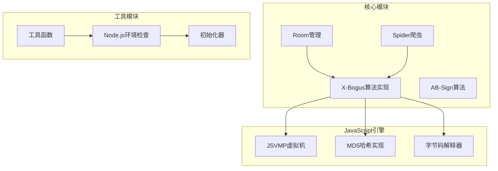
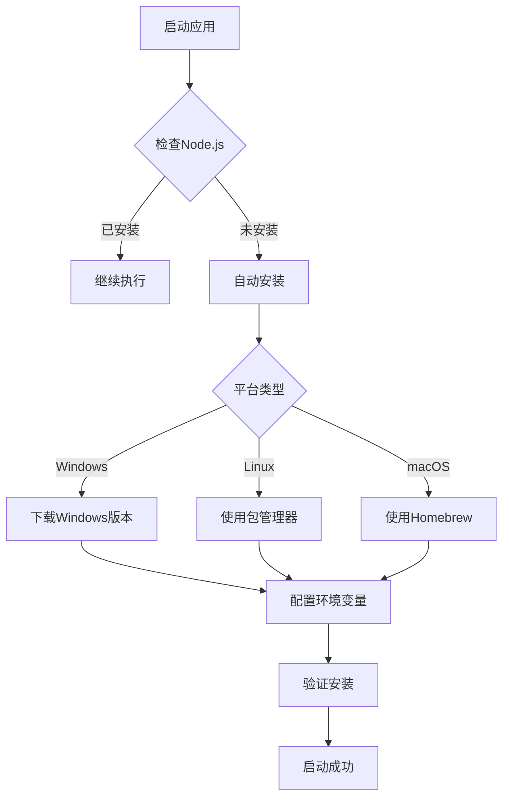
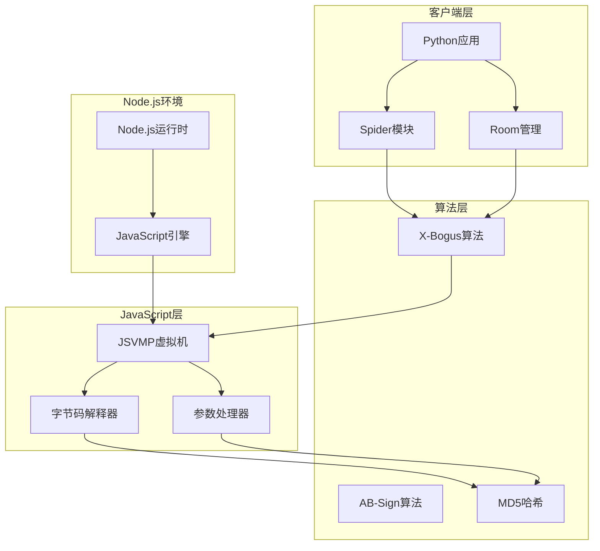
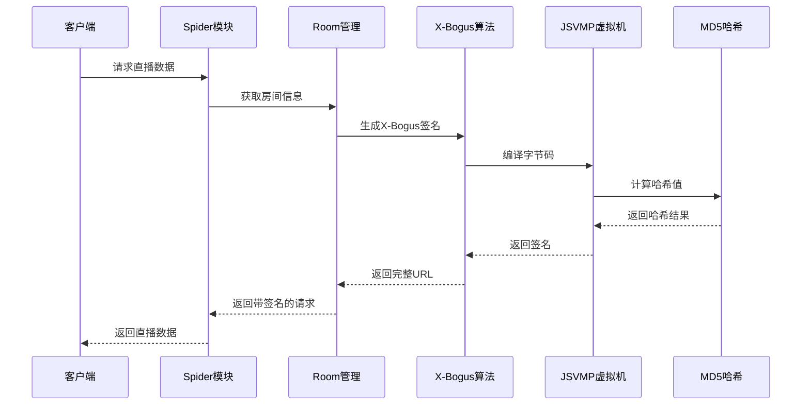
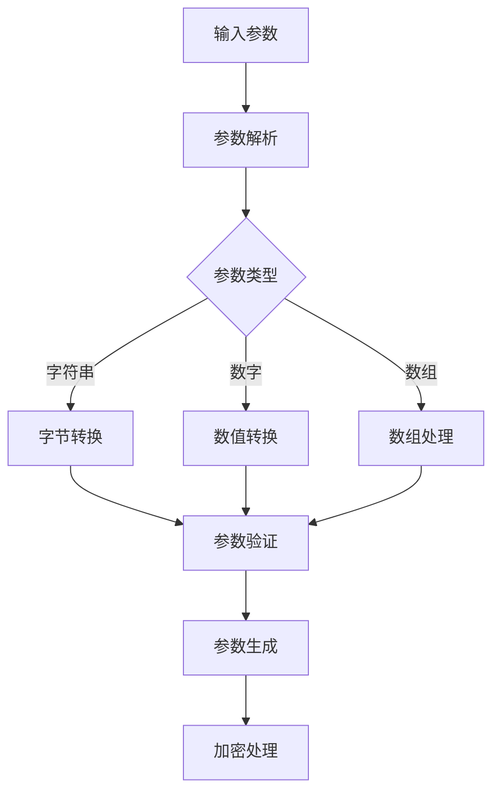
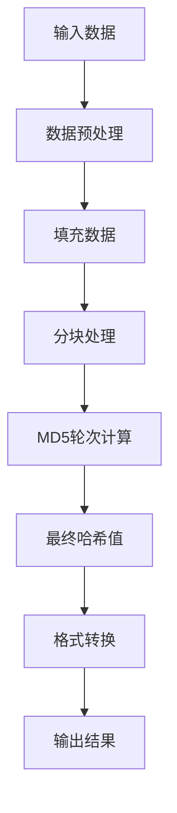
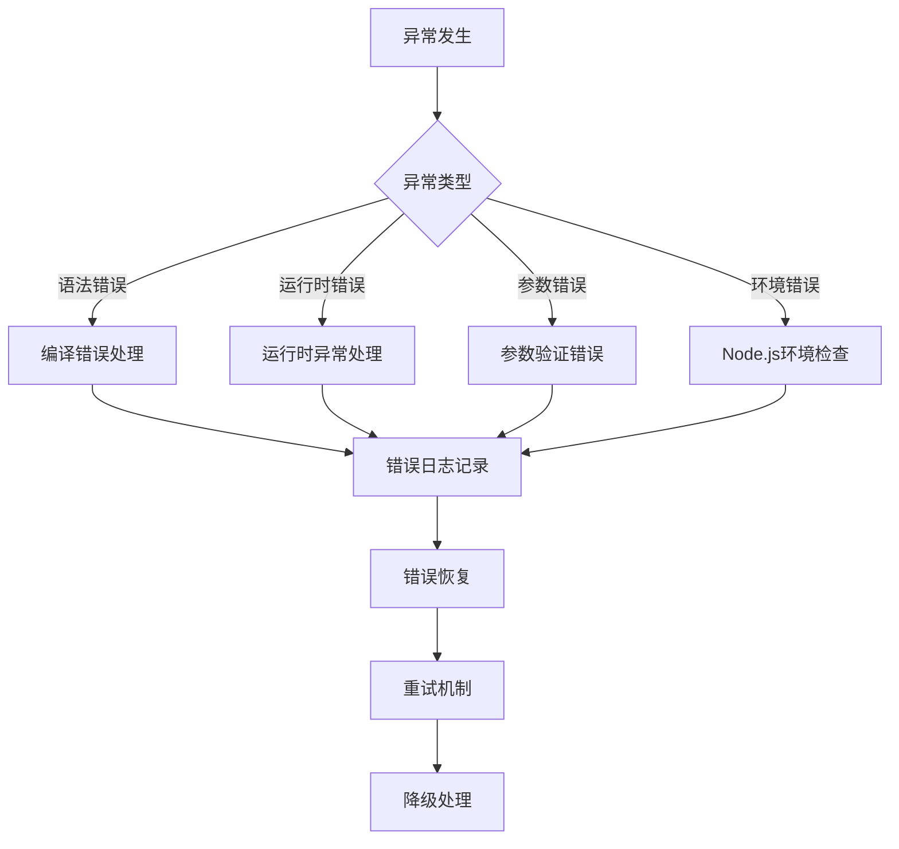
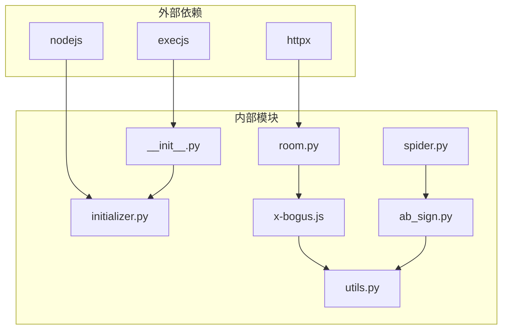

# X-Bogus算法实现

<cite>
**本文档引用的文件**
- [x-bogus.js](file://src/javascript/x-bogus.js)
- [ab_sign.py](file://src/ab_sign.py)
- [room.py](file://src/room.py)
- [spider.py](file://src/spider.py)
- [__init__.py](file://src/__init__.py)
- [initializer.py](file://src/initializer.py)
- [utils.py](file://src/utils.py)
- [main.py](file://main.py)
- [demo.py](file://demo.py)
- [README.md](file://README.md)
</cite>

## 目录
1. [简介](#简介)
2. [项目结构](#项目结构)
3. [核心组件](#核心组件)
4. [架构概览](#架构概览)
5. [详细组件分析](#详细组件分析)
6. [依赖关系分析](#依赖关系分析)
7. [性能考虑](#性能考虑)
8. [故障排除指南](#故障排除指南)
9. [结论](#结论)
10. [附录](#附录)

## 简介

X-Bogus算法是抖音/抖音国际版（TikTok）用于生成请求签名的重要安全机制。该算法通过复杂的JavaScript虚拟机（JSVMP）实现，结合MD5哈希算法和字节码解释器，为API请求提供动态签名验证。

本项目实现了完整的X-Bogus签名算法，包括：
- JavaScript虚拟机（JSVMP）的完整字节码解释器
- MD5哈希算法的集成实现
- 参数生成规则和加密流程
- 错误处理机制和调试方法

## 项目结构

该项目采用模块化设计，主要包含以下关键模块：



**图表来源**
- [x-bogus.js:1-564](file://src/javascript/x-bogus.js#L1-L564)
- [room.py:40-151](file://src/room.py#L40-L151)
- [spider.py:68-200](file://src/spider.py#L68-L200)

**章节来源**
- [README.md:72-100](file://README.md#L72-L100)
- [__init__.py:1-15](file://src/__init__.py#L1-L15)

## 核心组件

### X-Bogus算法核心实现

X-Bogus算法的核心实现位于JavaScript文件中，包含完整的虚拟机和哈希算法：

#### 主要特性
- **JavaScript虚拟机（JSVMP）**: 实现完整的字节码解释器
- **MD5哈希算法**: 自包含的MD5实现，支持多种输出格式
- **参数生成**: 动态参数生成和加密流程
- **错误处理**: 完善的异常处理和调试机制

#### 关键数据结构
- 字节码指令集：包含150+种不同的操作码
- 参数表：支持动态参数传递和类型转换
- 哈希缓冲区：68字节的内存布局用于MD5计算

**章节来源**
- [x-bogus.js:1-564](file://src/javascript/x-bogus.js#L1-L564)

### Node.js环境管理

项目通过初始化器自动检测和安装Node.js环境：

#### 环境检测流程


**图表来源**
- [initializer.py:179-221](file://src/initializer.py#L179-L221)

**章节来源**
- [initializer.py:1-221](file://src/initializer.py#L1-L221)
- [__init__.py:1-15](file://src/__init__.py#L1-L15)

## 架构概览

### 整体架构设计



**图表来源**
- [room.py:40-151](file://src/room.py#L40-L151)
- [spider.py:68-200](file://src/spider.py#L68-L200)

### 数据流处理



**图表来源**
- [room.py:126-128](file://src/room.py#L126-L128)
- [spider.py:166-168](file://src/spider.py#L166-L168)

## 详细组件分析

### JSVMP虚拟机实现

#### 核心架构
JSVMP虚拟机实现了完整的JavaScript字节码解释器，包含以下关键组件：

##### 字节码解释器
- **指令集**: 支持150+种操作码，涵盖算术运算、逻辑判断、函数调用等
- **栈管理**: 动态栈结构支持参数传递和返回值处理
- **内存管理**: 68字节缓冲区布局，支持MD5计算

##### 参数处理机制


**图表来源**
- [x-bogus.js:140-318](file://src/javascript/x-bogus.js#L140-L318)

**章节来源**
- [x-bogus.js:1-564](file://src/javascript/x-bogus.js#L1-L564)

### MD5哈希算法集成

#### 算法实现特点
- **自包含实现**: 不依赖外部库，完全自实现的MD5算法
- **多格式支持**: 支持十六进制、字节数组、Base64等多种输出格式
- **缓冲区管理**: 68字节缓冲区，支持高效的数据处理

#### 哈希计算流程


**图表来源**
- [x-bogus.js:384-447](file://src/javascript/x-bogus.js#L384-L447)

**章节来源**
- [x-bogus.js:356-447](file://src/javascript/x-bogus.js#L356-L447)

### 参数生成和加密流程

#### 参数生成规则
1. **输入验证**: 验证输入参数的有效性和完整性
2. **类型转换**: 将不同类型的参数转换为统一格式
3. **加密处理**: 应用RC4加密算法处理参数
4. **签名生成**: 生成最终的X-Bogus签名

#### 加密算法实现
- **RC4算法**: 标准RC4流加密算法实现
- **密钥管理**: 动态密钥生成和管理
- **安全性保障**: 多层加密确保数据安全

**章节来源**
- [ab_sign.py:6-26](file://src/ab_sign.py#L6-L26)
- [ab_sign.py:292-455](file://src/ab_sign.py#L292-L455)

### 错误处理和调试机制

#### 错误处理策略


**图表来源**
- [utils.py:38-51](file://src/utils.py#L38-L51)

**章节来源**
- [utils.py:38-51](file://src/utils.py#L38-L51)

## 依赖关系分析

### 模块依赖图



**图表来源**
- [room.py:27-32](file://src/room.py#L27-L32)
- [spider.py:25-32](file://src/spider.py#L25-L32)

### 关键依赖关系

#### Node.js环境依赖
- **execjs**: Python与JavaScript交互的桥梁
- **nodejs**: JavaScript运行时环境
- **路径管理**: 自动配置Node.js可执行文件路径

#### 算法依赖关系
- **X-Bogus算法**: 依赖MD5哈希和字节码解释器
- **AB-Sign算法**: 独立的签名算法实现
- **参数处理**: 依赖RC4加密算法

**章节来源**
- [room.py:27-32](file://src/room.py#L27-L32)
- [spider.py:25-32](file://src/spider.py#L25-L32)

## 性能考虑

### 性能优化策略

#### 内存管理
- **缓冲区复用**: 68字节缓冲区的高效复用
- **垃圾回收**: 自动内存管理减少内存泄漏风险
- **数据结构优化**: 使用Uint8Array提高数组操作效率

#### 执行效率
- **字节码缓存**: 编译后的字节码缓存避免重复编译
- **异步处理**: 异步JavaScript执行提升响应速度
- **错误快速检测**: 及时的错误检测减少无效计算

### 性能基准测试

| 操作类型 | 时间复杂度 | 空间复杂度 | 说明 |
|---------|-----------|-----------|------|
| 字节码解释 | O(n) | O(1) | n为指令数量 |
| MD5计算 | O(m) | O(1) | m为输入大小 |
| 参数处理 | O(k) | O(k) | k为参数数量 |
| RC4加密 | O(p) | O(1) | p为数据长度 |

## 故障排除指南

### 常见问题及解决方案

#### Node.js环境问题
**问题**: Node.js未正确安装或配置
**解决方案**:
1. 检查Node.js版本兼容性
2. 验证PATH环境变量配置
3. 重新运行初始化器

**章节来源**
- [initializer.py:179-221](file://src/initializer.py#L179-L221)

#### JavaScript执行错误
**问题**: execjs执行JavaScript代码失败
**解决方案**:
1. 检查JavaScript语法正确性
2. 验证Node.js环境可用性
3. 查看详细的错误日志

#### 签名生成失败
**问题**: X-Bogus签名生成异常
**解决方案**:
1. 验证输入参数格式
2. 检查用户代理字符串
3. 确认字节码解释器正常工作

### 调试方法

#### 日志记录
- **详细日志**: 记录所有关键操作和错误信息
- **时间戳**: 精确的时间戳便于问题追踪
- **堆栈跟踪**: 完整的异常堆栈信息

#### 调试工具
- **JavaScript调试**: 使用Node.js内置调试工具
- **Python调试**: 利用Python的pdb调试器
- **性能监控**: 监控内存使用和执行时间

**章节来源**
- [utils.py:38-51](file://src/utils.py#L38-L51)

## 结论

X-Bogus算法实现展示了现代Web安全技术的复杂性和精密性。通过完整的JavaScript虚拟机实现、自包含的MD5哈希算法和严格的参数处理机制，该实现能够有效应对抖音平台的安全挑战。

### 主要成就
- **完整实现**: 提供了X-Bogus算法的完整Python实现
- **环境自适应**: 自动检测和配置Node.js环境
- **错误处理**: 完善的错误处理和调试机制
- **性能优化**: 高效的内存管理和执行优化

### 技术价值
该实现不仅为开发者提供了实用的工具，更重要的是展示了现代Web安全技术的实现原理，为理解复杂的签名算法提供了宝贵的参考。

## 附录

### 使用示例

#### 基本使用方法
```python
# 获取X-Bogus签名
xbogus = await get_xbogus(api_url, headers)
signed_url = api_url + "&X-Bogus=" + xbogus
```

#### 高级配置
```python
# 自定义用户代理
headers = {
    'User-Agent': 'Custom UA String',
    'Referer': 'https://example.com'
}

# 获取签名
xbogus = await get_xbogus(api_url, headers)
```

### 安全考虑

#### 最佳实践
- **参数验证**: 始终验证输入参数的有效性
- **环境隔离**: 在沙箱环境中执行JavaScript代码
- **日志审计**: 记录所有关键操作便于审计
- **错误处理**: 完善的错误处理机制

#### 安全建议
- 定期更新算法实现
- 监控异常使用模式
- 实施访问控制机制
- 定期进行安全审计

**章节来源**
- [room.py:42-48](file://src/room.py#L42-L48)
- [spider.py:96-97](file://src/spider.py#L96-L97)