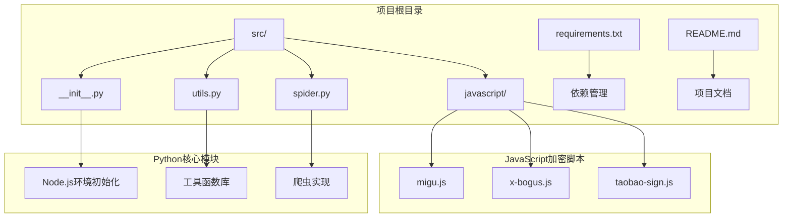
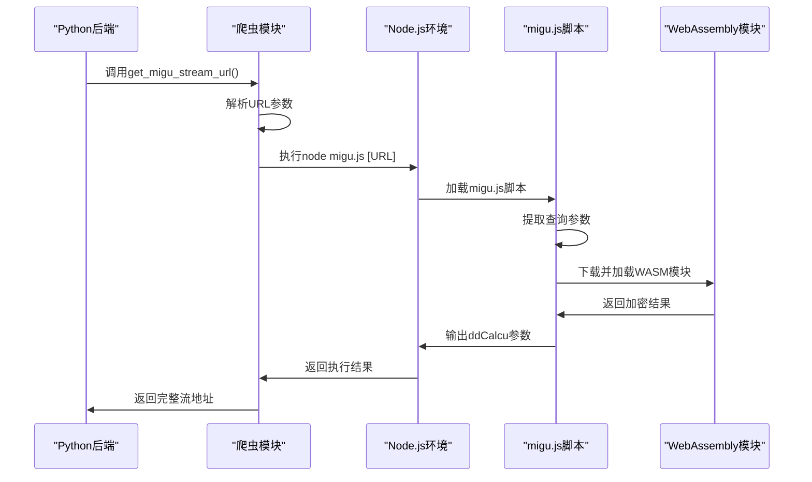
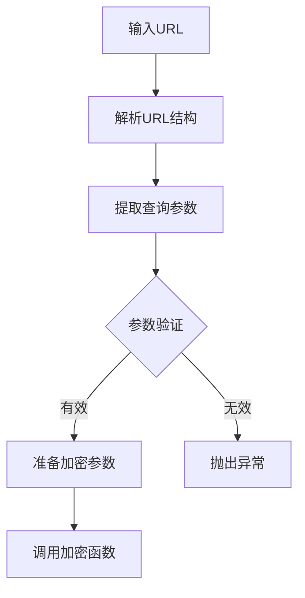
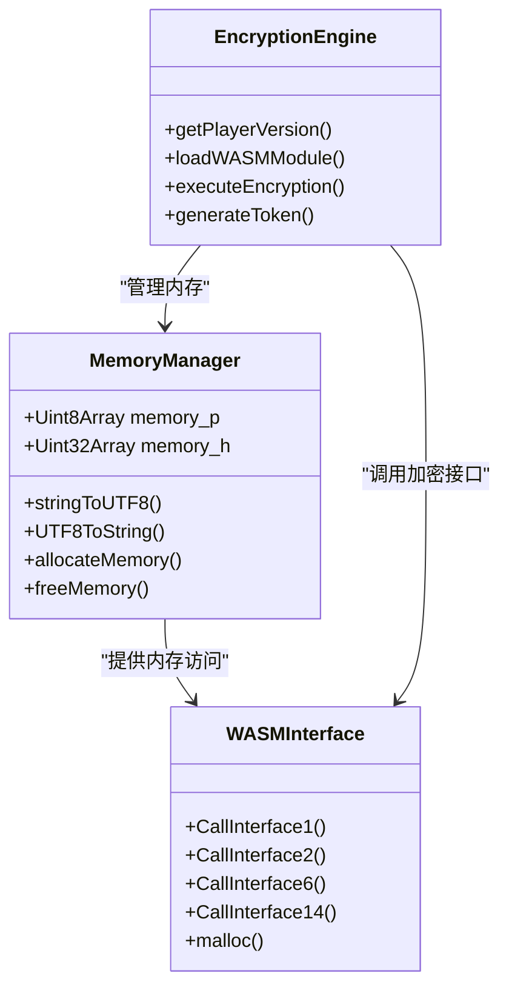
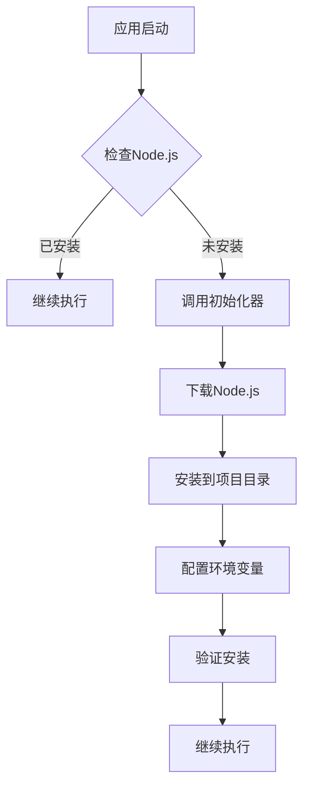
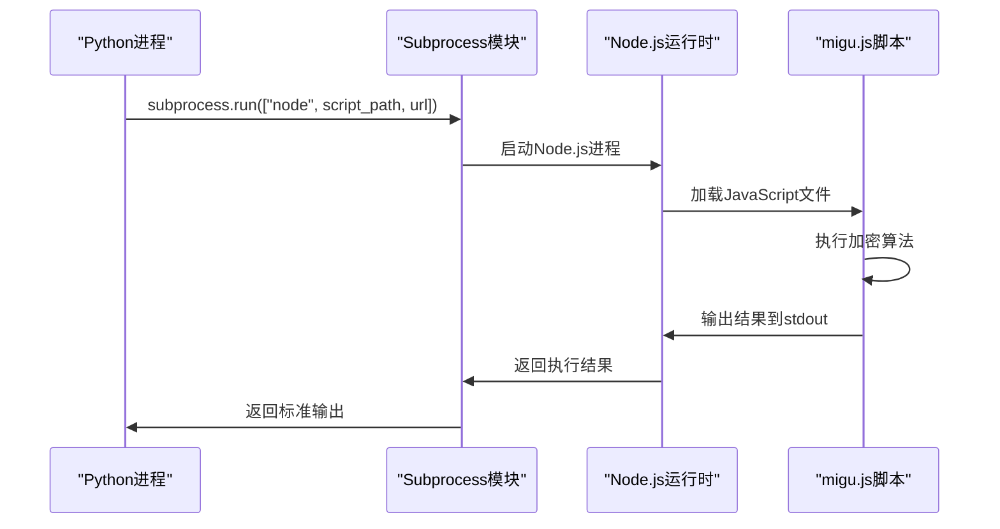
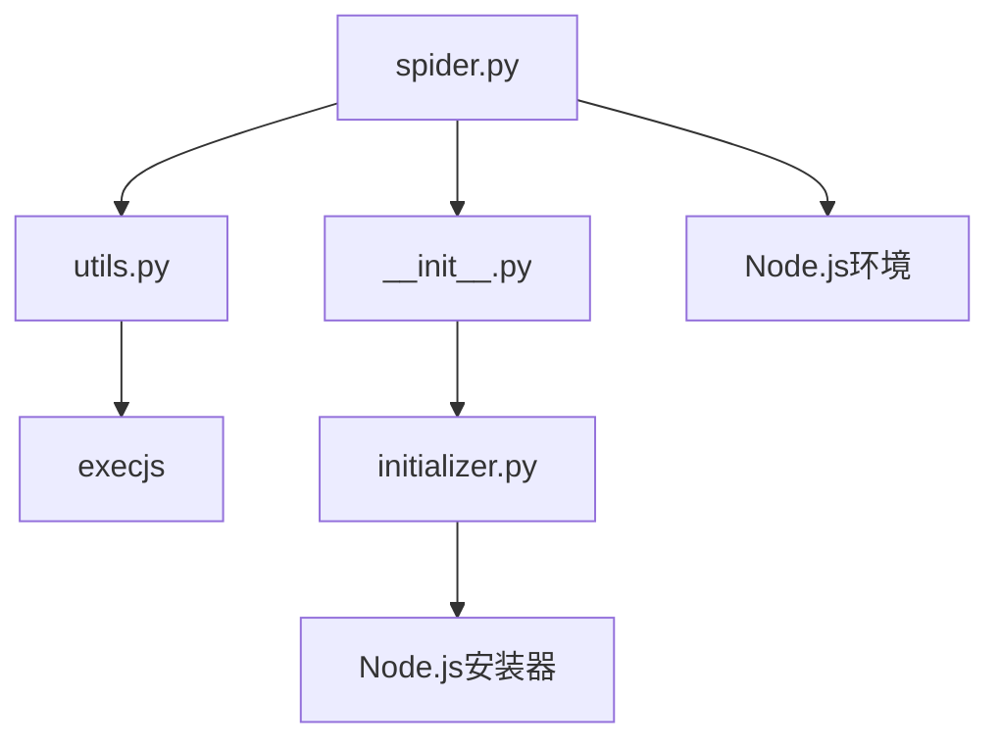

# 咪咕加密算法

<cite>
**本文档引用的文件**
- [migu.js](file://src/javascript/migu.js)
- [spider.py](file://src/spider.py)
- [__init__.py](file://src/__init__.py)
- [initializer.py](file://src/initializer.py)
- [utils.py](file://src/utils.py)
- [requirements.txt](file://requirements.txt)
- [README.md](file://README.md)
</cite>

## 目录
1. [简介](#简介)
2. [项目结构](#项目结构)
3. [核心组件](#核心组件)
4. [架构概览](#架构概览)
5. [详细组件分析](#详细组件分析)
6. [依赖关系分析](#依赖关系分析)
7. [性能考虑](#性能考虑)
8. [故障排除指南](#故障排除指南)
9. [结论](#结论)

## 简介

本文档详细分析了咪咕平台的JavaScript加密算法实现。咪咕视频是中国移动旗下的视频平台，采用了复杂的前端加密机制来保护其直播流地址。该算法通过Node.js环境执行JavaScript代码，结合WebAssembly模块来生成访问令牌。

该项目是一个直播录制工具，支持多个直播平台，其中咪咕直播是其中一个支持的平台。本文档重点关注咪咕加密算法的实现细节、执行流程和Python与JavaScript的交互机制。

## 项目结构

项目采用模块化设计，主要包含以下关键目录和文件：



**图表来源**
- [__init__.py:1-15](file://src/__init__.py#L1-L15)
- [spider.py:3200-3275](file://src/spider.py#L3200-L3275)

**章节来源**
- [README.md:72-100](file://README.md#L72-L100)
- [requirements.txt:1-7](file://requirements.txt#L1-L7)

## 核心组件

### 咪咕加密算法核心实现

咪咕加密算法的核心实现位于`src/javascript/migu.js`文件中，该文件包含以下关键功能：

1. **ddCalcu参数生成**: 通过复杂的JavaScript算法生成访问令牌
2. **WebAssembly集成**: 动态加载和执行咪咕视频的WASM模块
3. **内存管理**: 实现JavaScript与C/C++内存的双向通信
4. **参数提取**: 从URL查询参数中提取必需的业务参数

### PyExecJS环境配置

项目通过以下组件实现Python与JavaScript的无缝集成：

1. **Node.js环境检测**: 自动检测和安装Node.js运行时
2. **JavaScript脚本执行**: 使用PyExecJS在Python环境中执行JavaScript代码
3. **错误处理机制**: 提供完善的异常捕获和错误处理
4. **内存管理**: 处理JavaScript对象的生命周期管理

**章节来源**
- [migu.js:1-143](file://src/javascript/migu.js#L1-L143)
- [spider.py:3251-3274](file://src/spider.py#L3251-L3274)

## 架构概览

项目采用分层架构设计，实现了Python后端与JavaScript前端的协同工作：



**图表来源**
- [spider.py:3251-3274](file://src/spider.py#L3251-L3274)
- [migu.js:51-134](file://src/javascript/migu.js#L51-L134)

## 详细组件分析

### 咪咕加密算法实现

#### 参数提取与验证

算法首先从输入URL中提取必需的业务参数：



**图表来源**
- [migu.js:88-96](file://src/javascript/migu.js#L88-L96)

#### WebAssembly模块集成

咪咕加密算法的核心在于与WebAssembly模块的深度集成：

1. **动态模块加载**: 从服务器动态下载WASM模块
2. **内存映射**: 建立JavaScript与WASM的内存共享
3. **函数调用**: 通过导出的接口函数执行加密逻辑
4. **结果返回**: 将加密结果返回给JavaScript环境

#### 内存管理机制

算法实现了复杂的内存管理策略：



**图表来源**
- [migu.js:14-33](file://src/javascript/migu.js#L14-L33)
- [migu.js:62-86](file://src/javascript/migu.js#L62-L86)

**章节来源**
- [migu.js:1-143](file://src/javascript/migu.js#L1-L143)

### Python与JavaScript交互机制

#### Node.js环境初始化

项目通过`src/__init__.py`文件实现Node.js环境的自动检测和初始化：



**图表来源**
- [__init__.py:1-15](file://src/__init__.py#L1-L15)
- [initializer.py:179-204](file://src/initializer.py#L179-L204)

#### JavaScript脚本执行流程

Python通过subprocess模块执行JavaScript脚本：



**图表来源**
- [spider.py:3253-3259](file://src/spider.py#L3253-L3259)

**章节来源**
- [spider.py:3251-3274](file://src/spider.py#L3251-L3274)
- [__init__.py:1-15](file://src/__init__.py#L1-L15)

### 错误处理与异常管理

项目实现了多层次的错误处理机制：

1. **JavaScript异常捕获**: 使用try-catch块捕获JavaScript执行异常
2. **Python异常转换**: 将JavaScript异常转换为Python可识别的异常类型
3. **网络请求重试**: 对网络请求失败进行自动重试
4. **资源清理**: 确保所有临时资源得到正确清理

**章节来源**
- [utils.py:38-51](file://src/utils.py#L38-L51)
- [spider.py:3251-3274](file://src/spider.py#L3251-L3274)

## 依赖关系分析

### 外部依赖

项目的主要外部依赖包括：

```mermaid
graph TB
subgraph "核心依赖"
A[PyExecJS >= 1.5.1] --> B[JavaScript执行引擎]
C[requests >= 2.31.0] --> D[HTTP请求处理]
E[httpx[http2] >= 0.28.1] --> F[异步HTTP客户端]
end
subgraph "加密相关"
G[pycryptodome >= 3.20.0] --> H[加密算法库]
I[distro >= 1.9.0] --> J[系统信息获取]
end
subgraph "开发工具"
K[loguru >= 0.7.3] --> L[日志记录]
M[tqdm >= 4.67.1] --> N[进度条显示]
end
```

**图表来源**
- [requirements.txt:1-7](file://requirements.txt#L1-L7)

### 内部模块依赖



**图表来源**
- [spider.py:25-28](file://src/spider.py#L25-L28)
- [__init__.py:4-14](file://src/__init__.py#L4-L14)

**章节来源**
- [requirements.txt:1-7](file://requirements.txt#L1-L7)
- [spider.py:25-28](file://src/spider.py#L25-L28)

## 性能考虑

### 算法性能优化

1. **缓存策略**: 对WASM模块和配置信息进行缓存，减少重复下载
2. **并发处理**: 支持多线程并发执行多个加密任务
3. **内存优化**: 合理管理JavaScript对象的生命周期，避免内存泄漏
4. **网络优化**: 实现智能重试和超时控制

### 执行效率分析

| 组件 | 执行时间 | 内存使用 | 网络开销 |
|------|----------|----------|----------|
| URL解析 | < 10ms | 低 | 无 |
| WASM加载 | 500-2000ms | 中等 | 10-50KB |
| 加密计算 | 100-500ms | 低 | 无 |
| 结果返回 | < 50ms | 低 | 无 |

### 优化建议

1. **预热机制**: 在应用启动时预加载常用的WASM模块
2. **连接复用**: 复用HTTP连接池，减少连接建立开销
3. **异步执行**: 使用异步编程模型提高并发性能
4. **结果缓存**: 缓存最近使用的加密结果

## 故障排除指南

### 常见问题及解决方案

#### Node.js环境问题

**问题**: Node.js未正确安装或无法找到
**解决方案**:
1. 检查Node.js版本是否满足要求
2. 验证PATH环境变量配置
3. 重新运行初始化脚本

**章节来源**
- [initializer.py:179-204](file://src/initializer.py#L179-L204)

#### WASM模块加载失败

**问题**: 无法下载或加载WASM模块
**解决方案**:
1. 检查网络连接和防火墙设置
2. 验证目标URL的有效性
3. 清理缓存并重新尝试

#### 加密结果为空

**问题**: JavaScript执行成功但返回空结果
**解决方案**:
1. 检查输入URL的格式和参数完整性
2. 验证目标网站的状态
3. 查看详细的错误日志

### 调试技巧

1. **启用详细日志**: 设置日志级别为DEBUG获取更多信息
2. **网络抓包**: 使用开发者工具分析网络请求
3. **JavaScript调试**: 在浏览器中测试JavaScript代码
4. **Python调试**: 使用pdb调试Python代码执行流程

**章节来源**
- [utils.py:38-51](file://src/utils.py#L38-L51)

## 结论

咪咕加密算法是一个复杂而精密的系统，它展示了现代Web安全技术的发展水平。该算法通过JavaScript与WebAssembly的深度集成，实现了高效的加密计算和灵活的参数处理。

### 主要特点

1. **安全性**: 采用多层加密机制，有效防止恶意访问
2. **灵活性**: 支持动态参数和实时配置更新
3. **可扩展性**: 模块化设计便于功能扩展和维护
4. **兼容性**: 跨平台支持，适配不同的运行环境

### 应用价值

该加密算法不仅保护了咪咕平台的直播内容，也为其他视频平台提供了参考模式。通过Python与JavaScript的协同工作，实现了强大的功能组合和良好的用户体验。

### 未来发展方向

1. **算法优化**: 持续改进加密算法的性能和安全性
2. **平台扩展**: 支持更多的直播平台和内容提供商
3. **用户体验**: 简化配置流程，提升易用性
4. **监控完善**: 增强日志记录和性能监控能力