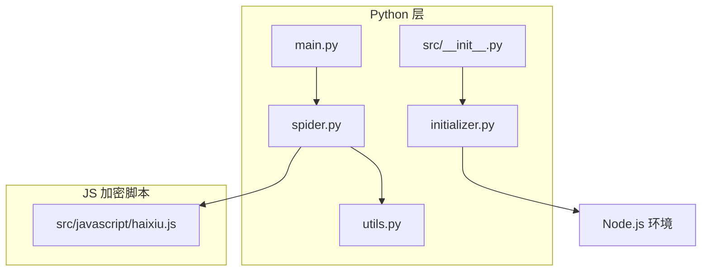
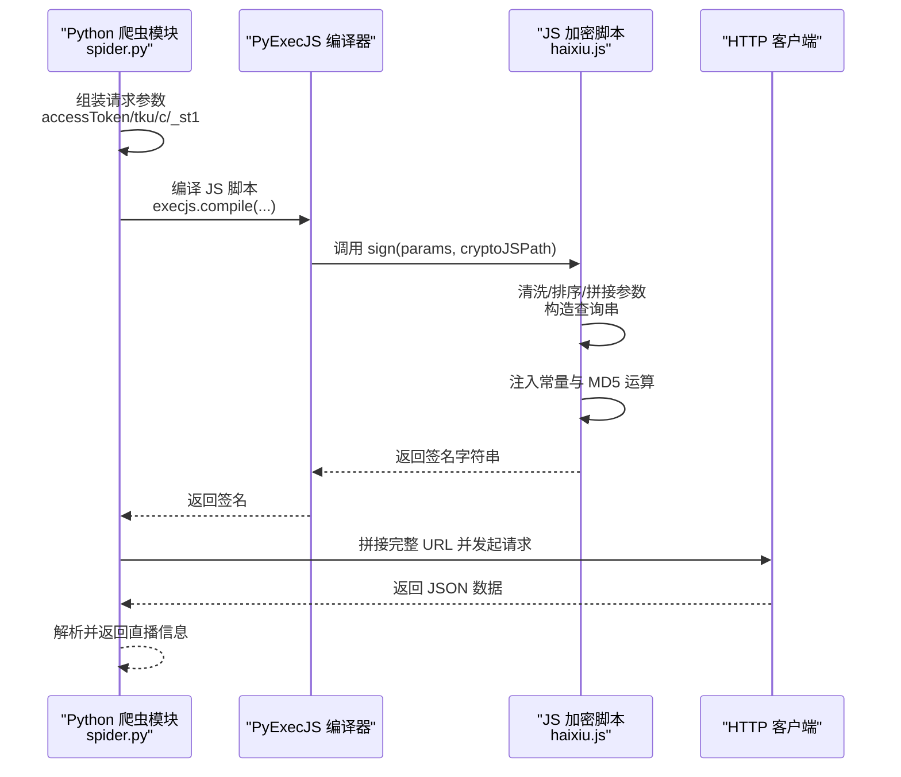
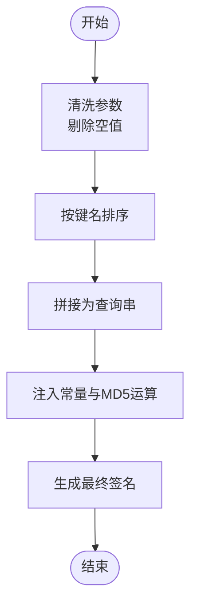
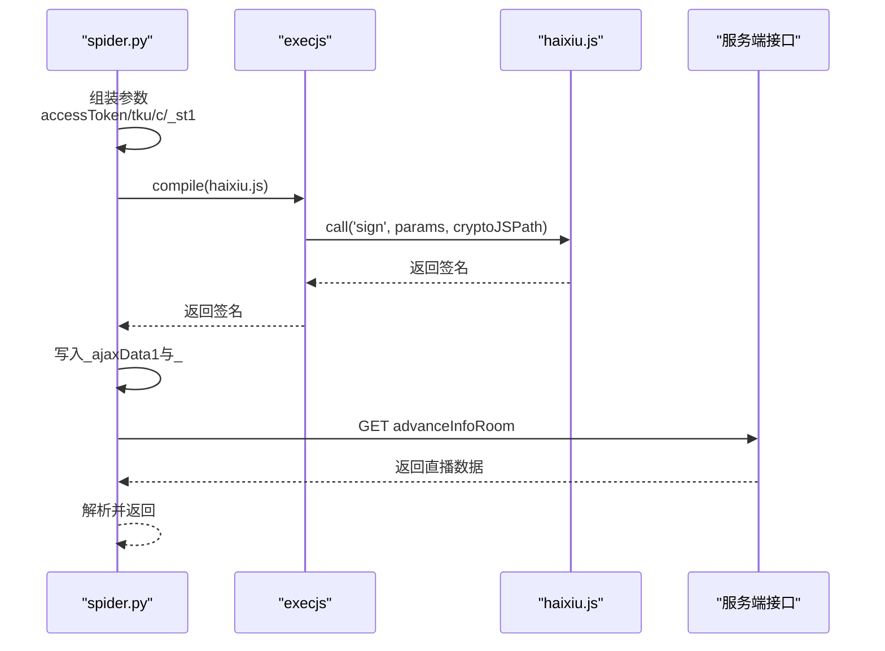
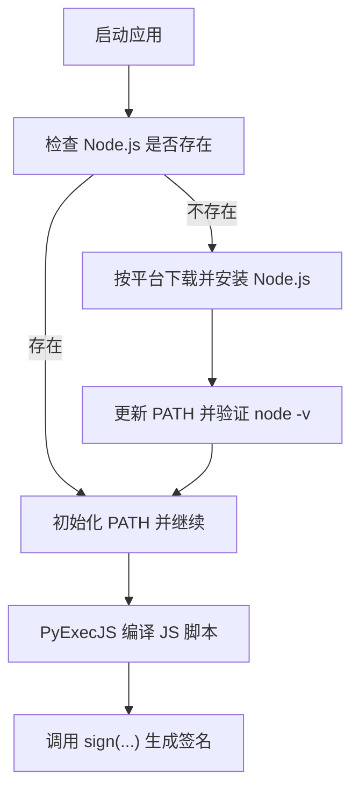
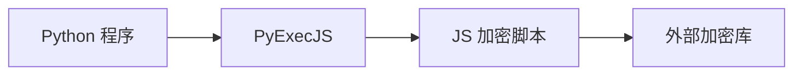

# 嗨秀加密算法

<cite>
**本文引用的文件**
- [src/javascript/haixiu.js](file://src/javascript/haixiu.js)
- [src/spider.py](file://src/spider.py)
- [src/__init__.py](file://src/__init__.py)
- [src/initializer.py](file://src/initializer.py)
- [src/utils.py](file://src/utils.py)
- [demo.py](file://demo.py)
- [README.md](file://README.md)
</cite>

## 目录
1. [简介](#简介)
2. [项目结构](#项目结构)
3. [核心组件](#核心组件)
4. [架构总览](#架构总览)
5. [详细组件分析](#详细组件分析)
6. [依赖分析](#依赖分析)
7. [性能考量](#性能考量)
8. [故障排查指南](#故障排查指南)
9. [结论](#结论)
10. [附录](#附录)

## 简介
本文件面向“嗨秀平台”加密算法的技术文档，聚焦于以下目标：
- 解析嗨秀平台 JavaScript 加密算法的实现方式，涵盖参数处理、算法执行流程与数据转换逻辑；
- 说明 PyExecJS 环境配置、JavaScript 代码执行机制及与 Python 主程序的集成方式；
- 提供使用示例、参数配置指南与常见问题解决方案；
- 包含算法调试技巧与性能分析建议。

## 项目结构
该项目采用“Python 主程序 + JavaScript 加密脚本”的混合架构，其中：
- Python 层负责网络请求、参数拼装、调用 JS 加密模块与后续业务处理；
- JavaScript 层提供加密签名生成逻辑，通过 PyExecJS 在 Python 中编译并调用；
- Node.js 环境由初始化模块自动检测与安装，确保 JS 执行能力。

图示来源
- [src/spider.py:2726-2772](file://src/spider.py#L2726-L2772)
- [src/__init__.py:1-15](file://src/__init__.py#L1-L15)
- [src/initializer.py:218-221](file://src/initializer.py#L218-L221)

章节来源
- [README.md:72-100](file://README.md#L72-L100)
- [src/__init__.py:1-15](file://src/__init__.py#L1-L15)
- [src/initializer.py:218-221](file://src/initializer.py#L218-L221)

## 核心组件
- 嗨秀加密脚本（haixiu.js）：提供签名生成函数，负责参数清洗、排序、拼接、常量注入与最终签名计算。
- 嗨秀爬虫模块（spider.py）：组装请求参数、调用 JS 加密模块、发起网络请求并解析响应。
- 初始化与 Node.js 环境（initializer.py、src/__init__.py）：检测并安装 Node.js，确保 PyExecJS 可用。
- 工具与异常处理（utils.py）：封装 execjs 异常捕获与日志记录，统一错误处理策略。

章节来源
- [src/javascript/haixiu.js:524-530](file://src/javascript/haixiu.js#L524-L530)
- [src/spider.py:2726-2772](file://src/spider.py#L2726-L2772)
- [src/initializer.py:218-221](file://src/initializer.py#L218-L221)
- [src/utils.py:38-51](file://src/utils.py#L38-L51)

## 架构总览
下图展示了从 Python 主流程到 JS 加密模块的调用链路与数据流向：

图示来源
- [src/spider.py:2726-2772](file://src/spider.py#L2726-L2772)
- [src/javascript/haixiu.js:524-530](file://src/javascript/haixiu.js#L524-L530)

章节来源
- [src/spider.py:2726-2772](file://src/spider.py#L2726-L2772)

## 详细组件分析

### 嗨秀加密脚本（haixiu.js）
- 参数处理
  - 输入参数清洗：剔除空值键，保留有效键值；
  - 参数排序：按键名 ASCII 序列排序，形成稳定顺序；
  - 查询串拼接：键值对以“&”连接，末尾去除多余“&”。
- 常量注入与 MD5 运算
  - 通过内部类注入多组常量，参与最终签名的拼接与 MD5 运算；
  - 使用 require 动态加载外部库路径，确保加密库可用。
- 签名生成
  - 将清洗后的参数与常量组合，经多次字符串拼接与 MD5 运算，最终输出签名字符串。

图示来源
- [src/javascript/haixiu.js:482-510](file://src/javascript/haixiu.js#L482-L510)

章节来源
- [src/javascript/haixiu.js:476-530](file://src/javascript/haixiu.js#L476-L530)

### 嗨秀爬虫模块（spider.py）
- 参数组装
  - 生成 accessToken、tku、c、_st1 等必要参数；
  - 依据平台差异选择不同的 access_token 值。
- JS 调用
  - 通过 PyExecJS 编译并调用 haixiu.js 的 sign 函数；
  - 将返回的签名写入 _ajaxData1 参数，附加时间戳 _。
- 请求与解析
  - 拼接服务端 API URL，发起请求；
  - 解析返回的直播状态与媒体地址，返回标准化结果。

图示来源
- [src/spider.py:2726-2772](file://src/spider.py#L2726-L2772)
- [src/javascript/haixiu.js:524-530](file://src/javascript/haixiu.js#L524-L530)

章节来源
- [src/spider.py:2726-2772](file://src/spider.py#L2726-L2772)

### Node.js 环境与 PyExecJS 集成
- 环境检测与安装
  - 初始化模块检查系统是否已安装 Node.js，未安装则按平台自动下载并安装；
  - 安装完成后将 Node.js 路径加入 PATH，确保 Python 可直接调用 node。
- Python 执行 JS
  - 使用 PyExecJS 编译 JS 脚本并调用导出函数；
  - 通过装饰器捕获 execjs.ProgramError，避免程序崩溃并记录日志。

图示来源
- [src/initializer.py:218-221](file://src/initializer.py#L218-L221)
- [src/__init__.py:1-15](file://src/__init__.py#L1-L15)
- [src/utils.py:38-51](file://src/utils.py#L38-L51)

章节来源
- [src/initializer.py:218-221](file://src/initializer.py#L218-L221)
- [src/__init__.py:1-15](file://src/__init__.py#L1-L15)
- [src/utils.py:38-51](file://src/utils.py#L38-L51)

## 依赖分析
- Python 依赖
  - httpx：异步 HTTP 请求；
  - execjs：执行 JS 加密脚本；
  - 其他：配置读取、日志、类型提示等。
- JS 依赖
  - 外部加密库（通过 require 动态加载）；
  - 内部常量与 MD5 运算逻辑。

图示来源
- [src/spider.py:2726-2772](file://src/spider.py#L2726-L2772)
- [src/javascript/haixiu.js:524-530](file://src/javascript/haixiu.js#L524-L530)

章节来源
- [src/spider.py:2726-2772](file://src/spider.py#L2726-L2772)

## 性能考量
- JS 执行成本
  - PyExecJS 在 Python 中编译并执行 JS 存在额外开销，建议：
    - 复用已编译的 JS 实例，避免重复 compile；
    - 控制并发调用频率，减少 Node.js 进程创建次数。
- 参数规模与排序
  - 参数数量较多时，排序与拼接操作会增加 CPU 开销；建议：
    - 仅传递必要参数，避免冗余键；
    - 预先去重与排序，降低 JS 层负担。
- 网络请求
  - 建议使用异步 HTTP 客户端，提升并发效率；
  - 对于高频请求，合理设置重试与退避策略，避免触发风控。

## 故障排查指南
- Node.js 未安装
  - 现象：PyExecJS 抛出 ProgramError 或无法找到 node 命令；
  - 处理：运行初始化模块自动安装 Node.js，或手动安装并确保 PATH 生效。
- JS 执行异常
  - 现象：签名生成失败或返回空值；
  - 处理：检查参数完整性与类型，确认 require 的加密库路径正确。
- 网络请求失败
  - 现象：服务端返回非 200 或 JSON 解析错误；
  - 处理：检查请求头、Cookies、access_token 有效性，确认平台接口未变更。
- 日志与错误捕获
  - 使用装饰器统一捕获 execjs.ProgramError 与通用异常，便于定位问题。

章节来源
- [src/utils.py:38-51](file://src/utils.py#L38-L51)
- [src/initializer.py:218-221](file://src/initializer.py#L218-L221)

## 结论
嗨秀平台加密算法通过“Python 参数组装 + JS 加密签名”的方式实现，具备良好的模块化与可维护性。结合 PyExecJS 与 Node.js 环境，能够在 Python 主流程中无缝调用 JS 加密逻辑。建议在生产环境中关注 JS 执行成本、参数规模与网络请求的稳定性，并通过日志与异常捕获机制提升可观测性与可诊断性。

## 附录

### 使用示例（参数与调用）
- 参数说明
  - accessToken：访问令牌（平台区分）；
  - tku：用户标识；
  - c：客户端标识；
  - _st1：毫秒级时间戳。
- 调用流程
  - 在 spider.py 中组装上述参数；
  - 通过 execjs.compile 读取 haixiu.js 并调用 sign；
  - 将返回的签名写入 _ajaxData1，并附加 _ 时间戳；
  - 拼接完整 URL 后发起请求并解析响应。

章节来源
- [src/spider.py:2726-2772](file://src/spider.py#L2726-L2772)
- [src/javascript/haixiu.js:524-530](file://src/javascript/haixiu.js#L524-L530)

### 参数配置指南
- Node.js 环境
  - 确保系统已安装 Node.js，或允许初始化模块自动安装；
  - 检查 PATH 是否包含 Node.js 可执行文件路径。
- JS 加密库
  - 确认 require 的加密库路径有效；
  - 如需离线部署，提前将加密库文件放置到脚本可访问的路径。

章节来源
- [src/initializer.py:218-221](file://src/initializer.py#L218-L221)
- [src/__init__.py:1-15](file://src/__init__.py#L1-L15)

### 常见问题与解决方案
- “找不到 Node.js”或“无法执行 JS”
  - 解决：运行初始化模块自动安装 Node.js，重启程序。
- “签名为空或无效”
  - 解决：核对参数类型与必填项，确认加密库路径正确。
- “接口返回 403/401”
  - 解决：检查 Cookies、User-Agent、Referer 等请求头，确认 access_token 未过期。

章节来源
- [src/utils.py:38-51](file://src/utils.py#L38-L51)
- [src/spider.py:2726-2772](file://src/spider.py#L2726-L2772)