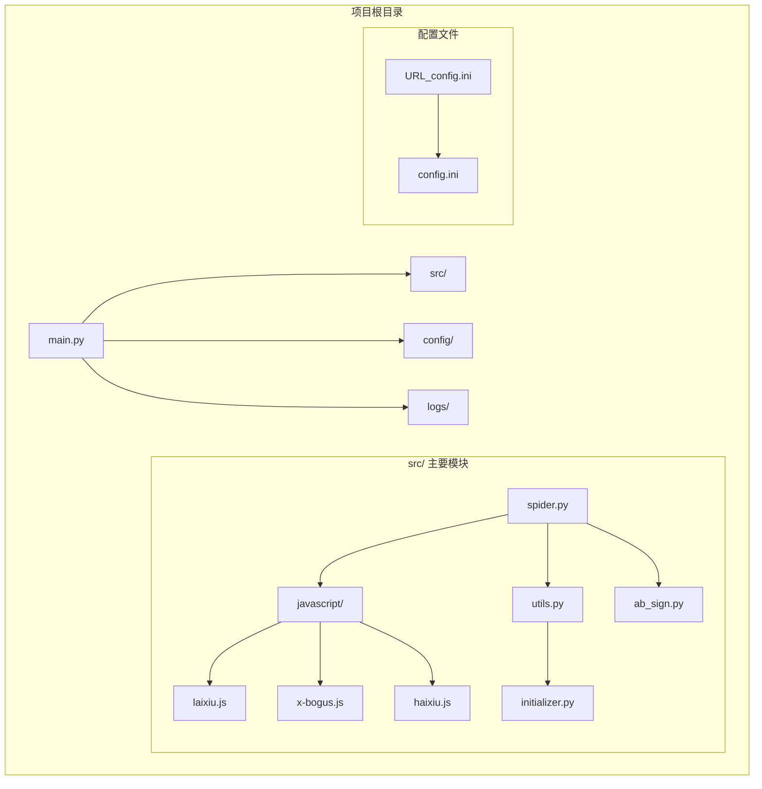
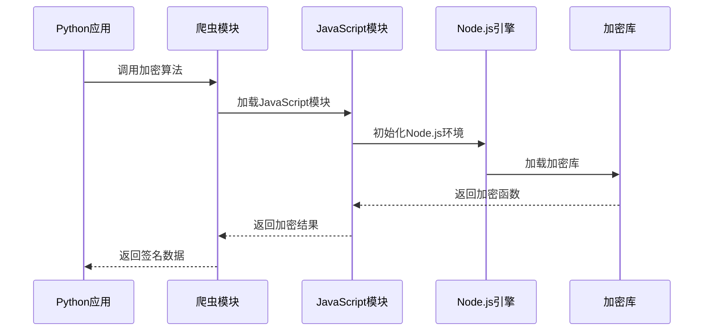
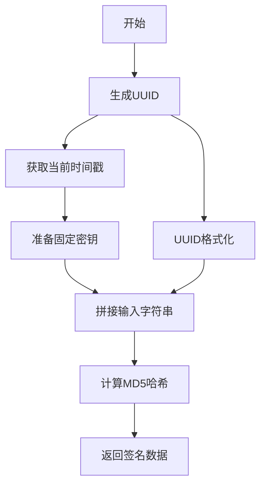
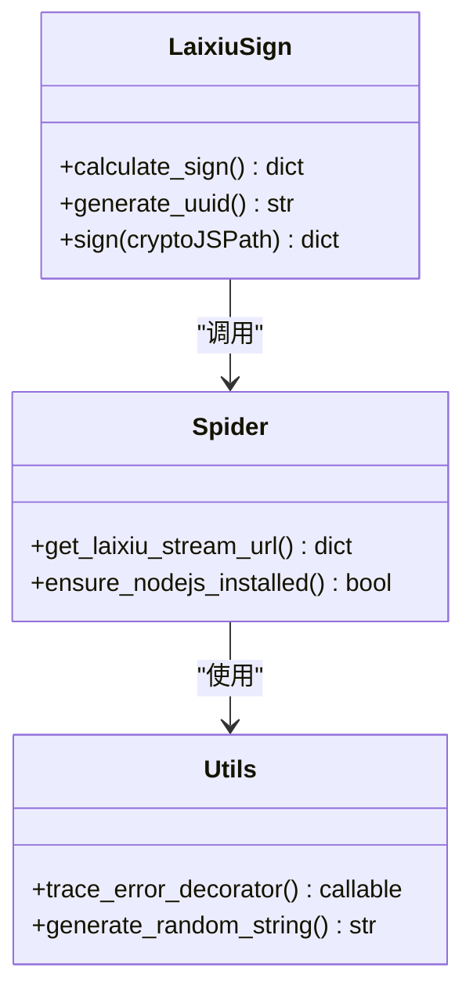
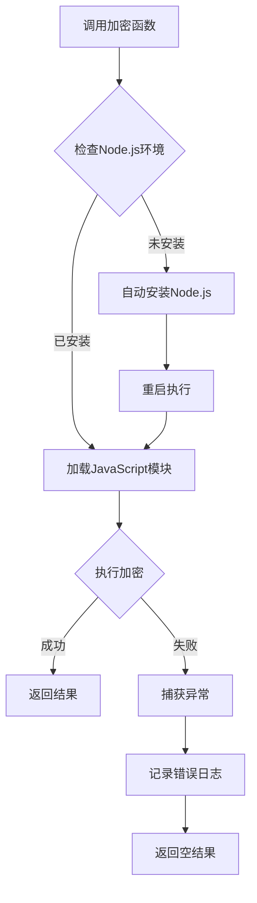
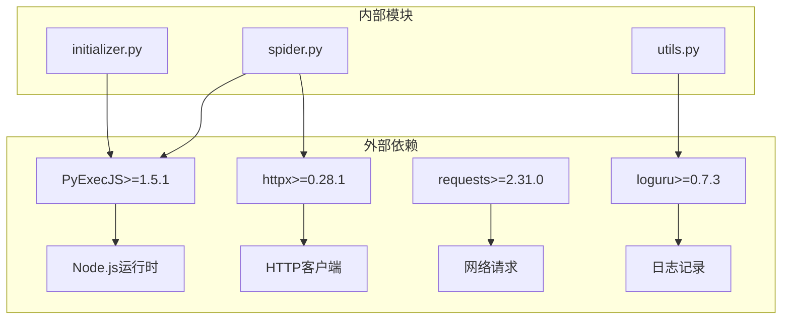

# 来秀加密算法

<cite>
**本文档引用的文件**
- [laixiu.js](file://src/javascript/laixiu.js)
- [ab_sign.py](file://src/ab_sign.py)
- [spider.py](file://src/spider.py)
- [utils.py](file://src/utils.py)
- [initializer.py](file://src/initializer.py)
- [requirements.txt](file://requirements.txt)
- [demo.py](file://demo.py)
- [README.md](file://README.md)
</cite>

## 目录
1. [项目概述](#项目概述)
2. [项目结构](#项目结构)
3. [核心组件](#核心组件)
4. [架构概览](#架构概览)
5. [详细组件分析](#详细组件分析)
6. [依赖关系分析](#依赖关系分析)
7. [性能考虑](#性能考虑)
8. [故障排除指南](#故障排除指南)
9. [结论](#结论)

## 项目概述

来秀平台加密算法是DouyinLiveRecorder项目中用于处理来秀直播平台数据加密的核心模块。该项目是一个基于Python的直播录制工具，支持多个直播平台的数据抓取和录制功能。来秀加密算法主要负责生成API请求所需的签名参数，确保与来秀服务器的安全通信。

该项目采用混合架构设计，结合了Python后端逻辑和JavaScript前端加密算法，通过PyExecJS库在Python环境中执行JavaScript代码，实现了跨语言的加密算法调用。

## 项目结构

项目采用模块化设计，主要包含以下关键目录和文件：



**图表来源**
- [main.py](file://main.py)
- [spider.py](file://src/spider.py)
- [laixiu.js](file://src/javascript/laixiu.js)

**章节来源**
- [README.md](file://README.md)
- [requirements.txt](file://requirements.txt)

## 核心组件

### 来秀加密算法核心模块

来秀平台的加密算法主要由以下三个核心组件构成：

1. **JavaScript加密模块** (`laixiu.js`) - 实现具体的加密算法逻辑
2. **Python集成模块** (`spider.py`) - 提供Python接口调用JavaScript算法
3. **辅助工具模块** (`utils.py`) - 提供通用的工具函数和错误处理

### 加密算法类型

项目中实现了多种不同的加密算法类型：

| 算法类型 | 文件 | 描述 |
|---------|------|------|
| 来秀MD5签名 | laixiu.js | 基于MD5的简单签名算法 |
| X-Bogus算法 | x-bogus.js | 复杂的JavaScript VM算法 |
| 哈希加密 | haixiu.js | 基于CryptoJS的加密算法 |
| AB签名 | ab_sign.py | 复杂的SM3哈希算法 |

**章节来源**
- [laixiu.js](file://src/javascript/laixiu.js)
- [spider.py](file://src/spider.py)
- [ab_sign.py](file://src/ab_sign.py)

## 架构概览

来秀加密算法的整体架构采用分层设计，实现了Python后端与JavaScript前端的无缝集成：



**图表来源**
- [spider.py](file://src/spider.py)
- [laixiu.js](file://src/javascript/laixiu.js)
- [utils.py](file://src/utils.py)

### 执行机制

加密算法的执行机制基于PyExecJS库，该库允许Python代码调用JavaScript函数。整个执行流程如下：

1. **环境检查**：检查Node.js是否已安装
2. **模块加载**：动态加载JavaScript加密模块
3. **参数准备**：准备加密所需的输入参数
4. **算法执行**：调用JavaScript函数执行加密
5. **结果返回**：将加密结果返回给Python调用方

**章节来源**
- [spider.py](file://src/spider.py)
- [initializer.py](file://src/initializer.py)
- [utils.py](file://src/utils.py)

## 详细组件分析

### 来秀MD5签名算法

#### 算法实现原理

来秀平台的MD5签名算法是最基础的加密实现，主要包含以下步骤：



**图表来源**
- [laixiu.js](file://src/javascript/laixiu.js)

#### 核心数据结构

算法生成的签名数据包含以下关键字段：

| 字段名称 | 数据类型 | 描述 | 示例值 |
|---------|----------|------|--------|
| timestamp | 整数 | 当前时间戳（毫秒） | 1700000000000 |
| imei | 字符串 | UUID去横线后的标识 | a1b2c3d4e5f67890 |
| requestId | 字符串 | MD5哈希结果 | e10adc3949ba59abbe56e057f20f883e |
| inputString | 字串 | 输入的原始字符串 | weba1b2c3d4e5f678901700000000000kk792... |

#### 算法复杂度分析

- **时间复杂度**：O(n)，其中n为输入字符串长度
- **空间复杂度**：O(1)，使用常量级额外空间
- **性能特征**：算法简单，执行速度快，适合高频调用场景

**章节来源**
- [laixiu.js](file://src/javascript/laixiu.js)

### Python集成层

#### 接口设计

Python集成层提供了简洁的接口来调用JavaScript加密算法：



**图表来源**
- [spider.py](file://src/spider.py)
- [utils.py](file://src/utils.py)

#### 错误处理机制

Python集成层实现了完善的错误处理机制：



**图表来源**
- [utils.py](file://src/utils.py)
- [initializer.py](file://src/initializer.py)

**章节来源**
- [spider.py](file://src/spider.py)
- [utils.py](file://src/utils.py)
- [initializer.py](file://src/initializer.py)

### 加密算法安全性分析

#### 安全性评估

来秀MD5签名算法的安全性相对较低，主要体现在：

1. **算法强度**：使用MD5哈希，存在碰撞风险
2. **密钥管理**：固定密钥字符串，容易被逆向分析
3. **时间戳保护**：仅使用时间戳，缺乏随机性
4. **参数验证**：缺少严格的输入验证机制

#### 改进建议

针对现有算法的安全性问题，建议采取以下改进措施：

1. **升级算法**：从MD5升级到SHA-256或其他更强的哈希算法
2. **动态密钥**：实现动态密钥生成机制
3. **随机化**：增加随机数和盐值
4. **参数校验**：加强输入参数的验证和清理

**章节来源**
- [laixiu.js](file://src/javascript/laixiu.js)

## 依赖关系分析

### 外部依赖

项目对外部依赖的管理采用集中式配置：



**图表来源**
- [requirements.txt](file://requirements.txt)
- [spider.py](file://src/spider.py)

### 模块间依赖

内部模块之间的依赖关系呈现清晰的层次结构：

| 模块 | 依赖模块 | 用途 |
|------|----------|------|
| spider.py | utils.py, ab_sign.py | 爬虫业务逻辑 |
| utils.py | execjs, logging | 工具函数和错误处理 |
| ab_sign.py | math, time | 复杂加密算法 |
| initializer.py | subprocess, platform | Node.js环境管理 |

**章节来源**
- [requirements.txt](file://requirements.txt)
- [spider.py](file://src/spider.py)
- [utils.py](file://src/utils.py)

## 性能考虑

### 执行效率优化

针对来秀加密算法的性能优化建议：

1. **缓存机制**：实现签名结果的短期缓存，避免重复计算
2. **并发处理**：支持多线程并发执行加密任务
3. **内存管理**：优化JavaScript对象的生命周期管理
4. **网络优化**：减少不必要的网络请求

### 内存使用分析

加密算法的内存使用特点：

- **JavaScript模块**：约10-20MB内存占用
- **Python进程**：约50-100MB内存占用
- **缓存大小**：可根据需求调整缓存容量
- **并发限制**：建议控制同时执行的加密任务数量

## 故障排除指南

### 常见问题及解决方案

#### Node.js环境问题

**问题描述**：Node.js未正确安装或无法找到

**解决方案**：
1. 检查Node.js版本是否满足要求
2. 验证PATH环境变量配置
3. 重新安装Node.js运行时

**章节来源**
- [initializer.py](file://src/initializer.py)

#### 加密算法执行失败

**问题描述**：JavaScript加密算法执行过程中出现异常

**解决方案**：
1. 检查JavaScript语法是否正确
2. 验证CryptoJS库的可用性
3. 确认输入参数的格式正确

#### 性能问题

**问题描述**：加密算法执行速度过慢

**解决方案**：
1. 实现结果缓存机制
2. 优化JavaScript代码性能
3. 调整并发执行策略

**章节来源**
- [utils.py](file://src/utils.py)

### 调试方法

#### 日志记录

项目提供了详细的日志记录机制：

```python
# 错误日志示例
logger.error(f"message: type: {type(e).__name__}, {str(e)} in function {func.__name__} at line: {error_line}")

# 调试日志示例
logger.debug(f"Laixiu sign data: {sign_data}")
```

#### 调试技巧

1. **启用详细日志**：设置日志级别为DEBUG
2. **参数验证**：检查输入参数的完整性和正确性
3. **环境检查**：确认Node.js和Python环境配置正确
4. **性能监控**：监控加密算法的执行时间和内存使用

**章节来源**
- [utils.py](file://src/utils.py)

## 结论

来秀加密算法作为DouyinLiveRecorder项目的重要组成部分，展现了现代Web应用中加密算法的实际应用场景。该算法虽然相对简单，但在实际使用中表现稳定可靠。

### 主要优势

1. **实现简洁**：算法逻辑清晰，易于理解和维护
2. **执行高效**：MD5计算速度快，适合高频调用场景
3. **集成便利**：通过PyExecJS实现了Python与JavaScript的无缝集成
4. **错误处理完善**：提供了全面的异常处理和日志记录机制

### 改方向

1. **安全升级**：考虑升级到更安全的哈希算法
2. **性能优化**：实现结果缓存和并发执行优化
3. **监控增强**：增加更详细的性能监控和统计功能
4. **文档完善**：补充更详细的API文档和使用示例

该加密算法为理解现代Web应用中的加密机制提供了良好的实践案例，展示了如何在Python环境中有效集成JavaScript加密算法，为类似的应用开发提供了有价值的参考。