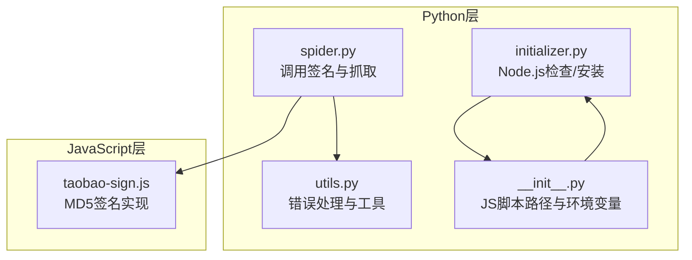
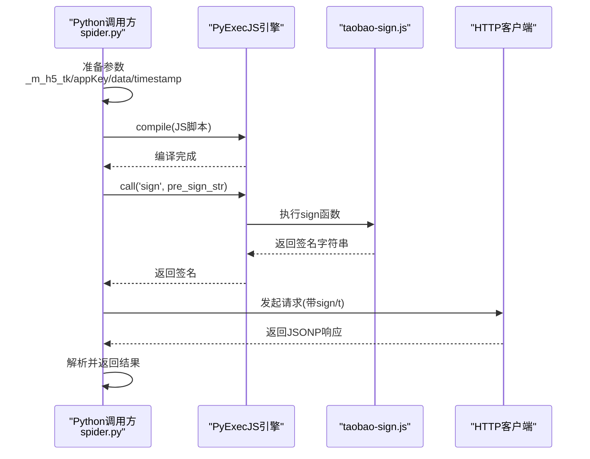
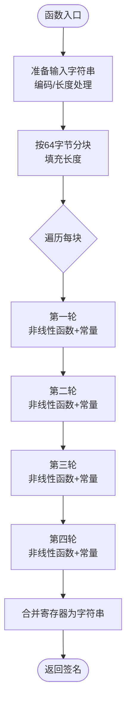
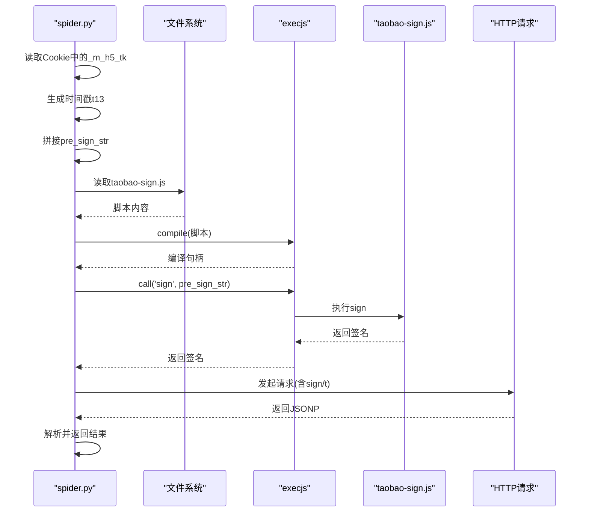
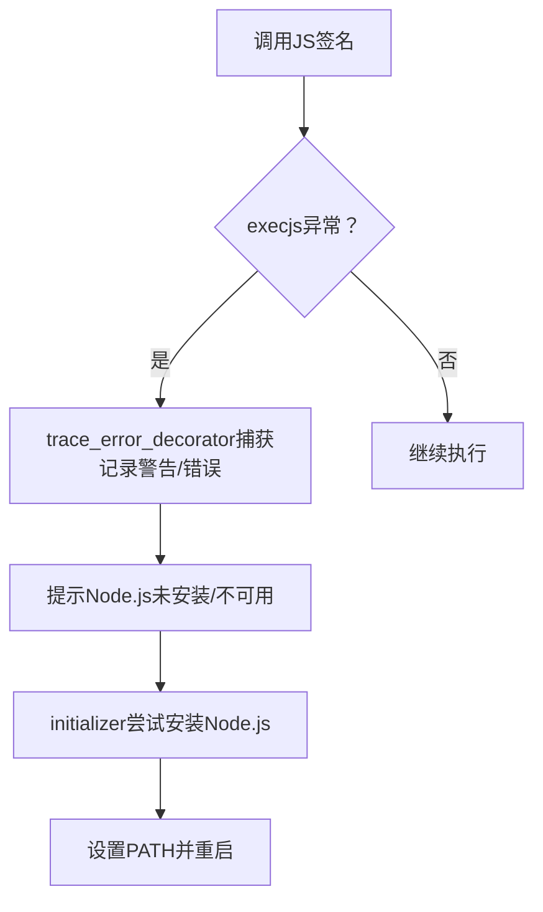
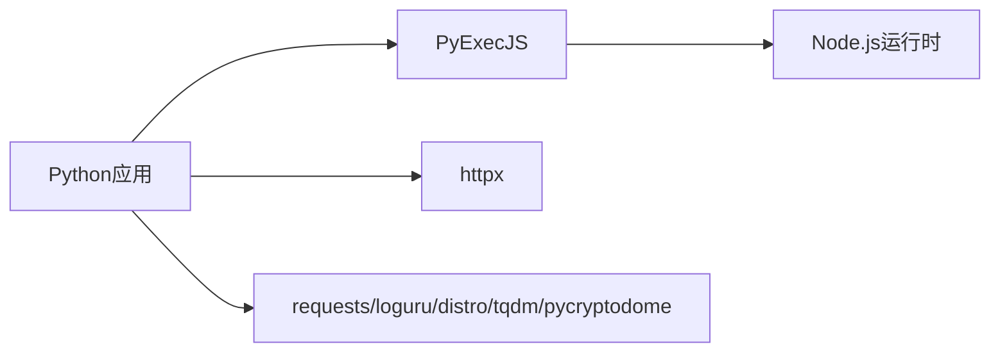

# 淘宝签名算法

<cite>
**本文档引用的文件**
- [taobao-sign.js](file://src/javascript/taobao-sign.js)
- [spider.py](file://src/spider.py)
- [ab_sign.py](file://src/ab_sign.py)
- [utils.py](file://src/utils.py)
- [initializer.py](file://src/initializer.py)
- [__init__.py](file://src/__init__.py)
- [requirements.txt](file://requirements.txt)
- [demo.py](file://demo.py)
- [README.md](file://README.md)
</cite>

## 目录
1. [简介](#简介)
2. [项目结构](#项目结构)
3. [核心组件](#核心组件)
4. [架构总览](#架构总览)
5. [详细组件分析](#详细组件分析)
6. [依赖关系分析](#依赖关系分析)
7. [性能考量](#性能考量)
8. [故障排查指南](#故障排查指南)
9. [结论](#结论)
10. [附录](#附录)

## 简介
本文件面向“淘宝平台签名算法”的技术文档，聚焦于以下目标：
- 解析淘宝签名算法的实现机制，包括签名参数构造、算法核心逻辑、数据加密处理等关键点
- 说明JavaScript加密算法的执行流程、与PyExecJS的集成方式、参数验证和错误处理机制
- 提供具体的使用示例、参数说明、调试方法
- 包含算法安全性分析和性能优化建议

本项目通过PyExecJS在Python侧加载并执行JavaScript签名脚本，实现与淘宝服务端一致的签名生成过程，从而绕过风控校验。

## 项目结构
该项目采用模块化组织，与淘宝签名相关的文件主要集中在以下位置：
- JavaScript签名脚本：src/javascript/taobao-sign.js
- Python入口与调用：src/spider.py
- 工具与错误处理：src/utils.py
- Node.js环境检查与初始化：src/initializer.py、src/__init__.py
- 依赖声明：requirements.txt
- 示例与平台配置：demo.py、README.md

图表来源
- [spider.py:3028-3071](file://src/spider.py#L3028-L3071)
- [taobao-sign.js:1-78](file://src/javascript/taobao-sign.js#L1-L78)
- [utils.py:38-51](file://src/utils.py#L38-L51)
- [initializer.py:218-221](file://src/initializer.py#L218-L221)
- [__init__.py:1-15](file://src/__init__.py#L1-L15)

章节来源
- [spider.py:3028-3071](file://src/spider.py#L3028-L3071)
- [taobao-sign.js:1-78](file://src/javascript/taobao-sign.js#L1-L78)
- [utils.py:38-51](file://src/utils.py#L38-L51)
- [initializer.py:218-221](file://src/initializer.py#L218-L221)
- [__init__.py:1-15](file://src/__init__.py#L1-L15)

## 核心组件
- JavaScript签名脚本：实现MD5风格的签名计算，负责将预签名字符串按规则处理并生成十六进制摘要
- Python调用链：在spider.py中读取taobao-sign.js，通过execjs编译并调用sign函数，返回签名字符串
- 错误处理：utils.py提供trace_error_decorator装饰器捕获execjs.ProgramError等异常
- Node.js环境：initializer.py与__init__.py负责检查/安装Node.js并设置PATH，确保PyExecJS可用

章节来源
- [taobao-sign.js:1-78](file://src/javascript/taobao-sign.js#L1-L78)
- [spider.py:3028-3071](file://src/spider.py#L3028-L3071)
- [utils.py:38-51](file://src/utils.py#L38-L51)
- [initializer.py:218-221](file://src/initializer.py#L218-L221)
- [__init__.py:1-15](file://src/__init__.py#L1-L15)

## 架构总览
淘宝签名在Python侧的调用流程如下：
- Python准备参数：从Cookie中提取_m_h5_tk，拼接时间戳、appKey与请求体
- 读取并编译JavaScript签名脚本：execjs.compile读取taobao-sign.js
- 调用签名函数：传入预签名字符串，得到签名值
- 组装请求并发起HTTP请求，处理返回结果

图表来源
- [spider.py:3064-3071](file://src/spider.py#L3064-L3071)
- [taobao-sign.js:1-78](file://src/javascript/taobao-sign.js#L1-L78)

章节来源
- [spider.py:3064-3071](file://src/spider.py#L3064-L3071)
- [taobao-sign.js:1-78](file://src/javascript/taobao-sign.js#L1-L78)

## 详细组件分析

### JavaScript签名算法实现（taobao-sign.js）
- 输入：预签名字符串（由_m_h5_tk前缀、时间戳、appKey、请求体拼接而成）
- 处理流程：
  - 字符串编码与长度处理
  - 按64字节分块，填充消息长度
  - MD5风格的压缩循环，包含四轮不同的非线性函数与常量
  - 输出：32位小写十六进制字符串
- 关键点：
  - 使用位运算实现循环左移
  - 使用按位与、或、异或组合实现非线性函数
  - 最终将四个缓冲区寄存器拼接为字符串

图表来源
- [taobao-sign.js:39-73](file://src/javascript/taobao-sign.js#L39-L73)

章节来源
- [taobao-sign.js:1-78](file://src/javascript/taobao-sign.js#L1-L78)

### Python调用链与参数构造（spider.py）
- Cookie校验：要求存在_m_h5_tk，否则提示错误
- 参数准备：
  - 从Cookie提取_m_h5_tk并取前缀
  - 生成当前毫秒级时间戳
  - 拼接预签名字符串：_m_h5_tk前缀&时间戳&appKey&请求体
- 签名生成：
  - 读取taobao-sign.js并compile
  - 调用sign函数，得到签名
  - 更新请求参数中的sign与t
- 请求与解析：
  - 组装URL并发起请求
  - 使用utils.jsonp_to_json解析JSONP响应
  - 根据ret消息判断成功与否，提取主播名、直播状态、播放地址等

图表来源
- [spider.py:3039-3071](file://src/spider.py#L3039-L3071)
- [taobao-sign.js:1-78](file://src/javascript/taobao-sign.js#L1-L78)

章节来源
- [spider.py:3039-3071](file://src/spider.py#L3039-L3071)

### 错误处理与调试（utils.py、initializer.py）
- 错误处理：
  - trace_error_decorator捕获execjs.ProgramError，提示Node.js环境问题
  - 其他异常记录详细错误行号与类型
- Node.js环境：
  - 自动检测Node.js是否存在
  - Windows/Linux/macOS分别提供安装策略
  - 设置PATH，确保execjs可用

图表来源
- [utils.py:38-51](file://src/utils.py#L38-L51)
- [initializer.py:218-221](file://src/initializer.py#L218-L221)

章节来源
- [utils.py:38-51](file://src/utils.py#L38-L51)
- [initializer.py:218-221](file://src/initializer.py#L218-L221)

### 参数说明与使用示例
- 关键参数
  - _m_h5_tk：来自Cookie，需正确携带
  - appKey：固定值，用于签名拼接
  - 时间戳t：当前毫秒时间戳
  - 请求体data：JSON字符串，包含直播ID等
- 使用示例（Python侧）
  - 在调用get_taobao_stream_url时，内部会自动准备上述参数并生成签名
  - 若返回ret消息为成功，可进一步解析直播状态与播放地址

章节来源
- [spider.py:3048-3071](file://src/spider.py#L3048-L3071)

## 依赖关系分析
- Python依赖
  - PyExecJS：用于在Python中执行JavaScript
  - httpx：异步HTTP请求
  - 其他通用库：requests、loguru、distro、tqdm、pycryptodome
- Node.js依赖
  - 通过initializer.py自动安装，确保execjs可用

图表来源
- [requirements.txt:1-7](file://requirements.txt#L1-L7)
- [initializer.py:218-221](file://src/initializer.py#L218-L221)

章节来源
- [requirements.txt:1-7](file://requirements.txt#L1-L7)
- [initializer.py:218-221](file://src/initializer.py#L218-L221)

## 性能考量
- JavaScript签名计算为纯CPU操作，单次耗时极短，对整体请求影响有限
- 异步HTTP请求（httpx）可提升并发效率
- 建议
  - 缓存_m_h5_tk与签名结果（在有效期内），减少重复计算
  - 合理设置请求超时与重试策略，避免阻塞
  - 在高并发场景下，控制同时编译JS脚本的数量，避免资源争用

[本节为通用性能建议，无需特定文件来源]

## 故障排查指南
- Node.js未安装
  - 现象：execjs.ProgramError或无法执行JS
  - 处理：initializer.py会尝试自动安装；若失败，手动安装Node.js并确保PATH正确
- Cookie缺失或失效
  - 现象：提示缺少_m_h5_tk或签名失败
  - 处理：确保携带正确的Cookie，必要时更新_m_h5_tk与_m_h5_tk_enc
- 签名不匹配
  - 现象：ret消息提示失败
  - 处理：确认拼接顺序与字符集，确保时间戳为毫秒级，请求体严格一致

章节来源
- [utils.py:38-51](file://src/utils.py#L38-L51)
- [spider.py:3039-3071](file://src/spider.py#L3039-L3071)

## 结论
本项目通过PyExecJS在Python中复现JavaScript签名算法，实现了与淘宝服务端一致的签名生成流程。其优势在于：
- 保持与前端一致的签名逻辑，降低风控识别概率
- 通过异步HTTP与错误处理机制，提升稳定性与可维护性
- 自动化Node.js环境管理，降低部署门槛

建议在生产环境中结合缓存与重试策略，进一步提升性能与鲁棒性。

[本节为总结性内容，无需特定文件来源]

## 附录

### 安全性分析
- 签名强度
  - 采用MD5风格的压缩流程，具备一定的抗碰撞性
  - 依赖_m_h5_tk与时间戳，具备时效性与唯一性
- 风险与对策
  - Cookie泄露风险：严格保护_m_h5_tk与相关凭据
  - 重放攻击：时间戳必须为毫秒级，且服务端应校验有效期
  - 算法逆向：签名逻辑公开，需配合Cookie与参数共同防护

[本节为通用安全分析，无需特定文件来源]

### 使用示例与调试方法
- 示例入口
  - 平台配置中包含淘宝入口，可参考demo.py的测试调用方式
- 调试要点
  - 打印预签名字符串与最终签名，核对字符集与顺序
  - 观察ret消息与返回数据，定位业务错误
  - 检查Node.js版本与execjs编译状态

章节来源
- [demo.py:182-185](file://demo.py#L182-L185)
- [spider.py:3076-3098](file://src/spider.py#L3076-L3098)