# 反爬虫应对策略

<cite>
**本文档引用的文件**
- [ab_sign.py](file://src/ab_sign.py)
- [x-bogus.js](file://src/javascript/x-bogus.js)
- [proxy.py](file://src/proxy.py)
- [spider.py](file://src/spider.py)
- [utils.py](file://src/utils.py)
- [async_http.py](file://src/http_clients/async_http.py)
- [room.py](file://src/room.py)
- [taobao-sign.js](file://src/javascript/taobao-sign.js)
- [haixiu.js](file://src/javascript/haixiu.js)
- [initializer.py](file://src/initializer.py)
- [README.md](file://README.md)
</cite>

## 目录
1. [项目概述](#项目概述)
2. [反爬虫机制分析](#反爬虫机制分析)
3. [核心反检测技术](#核心反检测技术)
4. [a_bogus签名算法](#a_bogus签名算法)
5. [X-Bogus算法](#x-bogus算法)
6. [JavaScript加密解密技术](#javascript加密解密技术)
7. [代理IP轮换策略](#代理ip轮换策略)
8. [请求频率控制](#请求频率控制)
9. [会话管理策略](#会话管理策略)
10. [风险控制与安全防护](#风险控制与安全防护)
11. [实际应用案例](#实际应用案例)
12. [最佳实践指南](#最佳实践指南)
13. [故障排除与调试](#故障排除与调试)
14. [总结与建议](#总结与建议)

## 项目概述

DouyinLiveRecorder是一个多功能直播录制工具，支持多个直播平台的数据抓取和视频录制。该项目在反爬虫应对方面采用了多种技术手段，包括但不限于：

- **动态签名算法**：实现a_bogus和X-Bogus等签名算法
- **JavaScript引擎集成**：通过Node.js执行复杂的前端加密逻辑
- **代理IP轮换**：支持HTTP、HTTPS、SOCKS代理
- **请求头伪装**：模拟真实浏览器环境
- **会话管理**：维护跨请求的状态信息

## 反爬虫机制分析

### 平台反爬虫特征

根据不同平台的特点，项目实现了针对性的反爬虫应对策略：

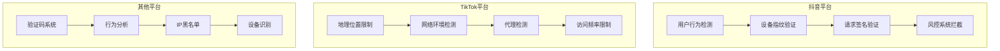

**图表来源**
- [spider.py:68-141](file://src/spider.py#L68-L141)
- [spider.py:144-226](file://src/spider.py#L144-L226)

### 检测手段识别

项目识别并应对的主要检测手段包括：

1. **User-Agent轮换**：模拟不同浏览器和操作系统
2. **Cookie管理**：维护会话状态和身份验证
3. **请求头伪装**：构造符合浏览器特征的请求头
4. **JavaScript加密**：执行前端加密逻辑生成签名
5. **代理IP轮换**：避免IP封禁和地域限制
6. **请求频率控制**：模拟正常用户行为模式

**章节来源**
- [spider.py:144-226](file://src/spider.py#L144-L226)
- [utils.py:162-168](file://src/utils.py#L162-L168)

## 核心反检测技术

### User-Agent轮换机制

项目实现了多层次的User-Agent轮换策略，以模拟真实的浏览器环境：

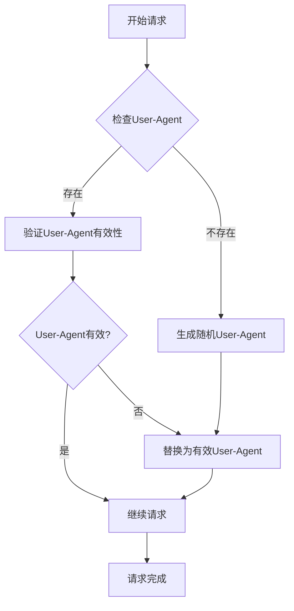

**图表来源**
- [spider.py:68-141](file://src/spider.py#L68-L141)
- [spider.py:144-226](file://src/spider.py#L144-L226)

### Cookie管理策略

项目采用智能的Cookie管理系统，包括：

1. **Cookie持久化**：保持会话状态
2. **Cookie轮换**：定期更新Cookie以避免失效
3. **Cookie验证**：检查Cookie的有效性
4. **Cookie备份**：提供备用Cookie选项

**章节来源**
- [spider.py:144-226](file://src/spider.py#L144-L226)
- [utils.py:60-62](file://src/utils.py#L60-L62)

### 请求头伪装技术

项目实现了全面的请求头伪装机制：

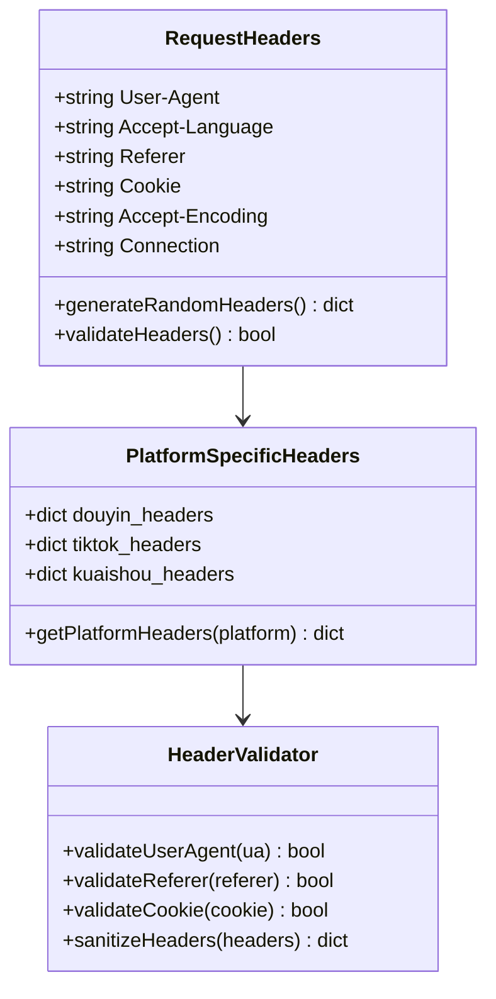

**图表来源**
- [spider.py:68-141](file://src/spider.py#L68-L141)
- [spider.py:144-226](file://src/spider.py#L144-L226)

**章节来源**
- [spider.py:230-278](file://src/spider.py#L230-L278)
- [spider.py:285-313](file://src/spider.py#L285-L313)

## a_bogus签名算法

### 算法实现原理

a_bogus是抖音平台特有的签名算法，项目实现了完整的Python实现：

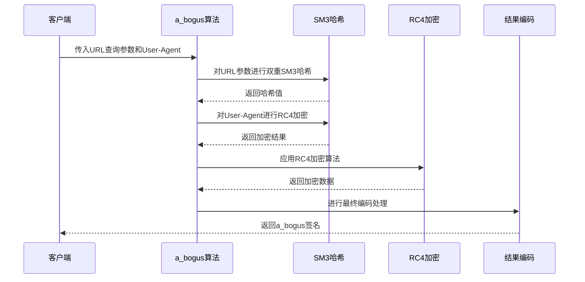

**图表来源**
- [ab_sign.py:444-455](file://src/ab_sign.py#L444-L455)
- [ab_sign.py:293-442](file://src/ab_sign.py#L293-L442)

### 核心组件分析

#### SM3哈希算法实现

项目实现了完整的SM3哈希算法，这是中国国家密码标准：

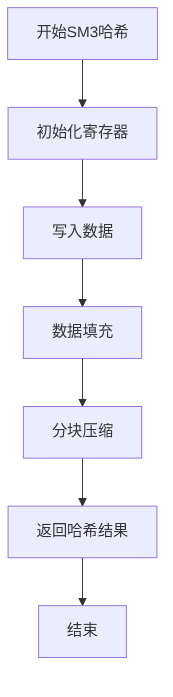

**图表来源**
- [ab_sign.py:61-209](file://src/ab_sign.py#L61-L209)

#### RC4加密算法

项目实现了RC4流加密算法，用于数据加密和混淆：

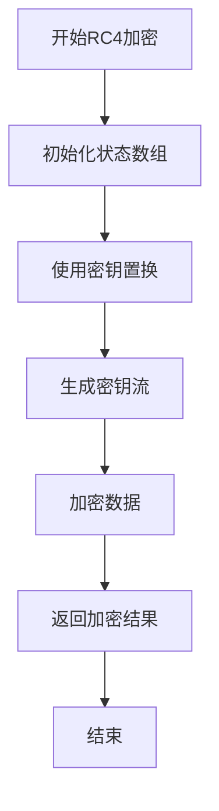

**图表来源**
- [ab_sign.py:6-26](file://src/ab_sign.py#L6-L26)

**章节来源**
- [ab_sign.py:1-455](file://src/ab_sign.py#L1-L455)

## X-Bogus算法

### 算法架构

X-Bogus是抖音平台的另一套签名算法，项目通过Node.js实现：

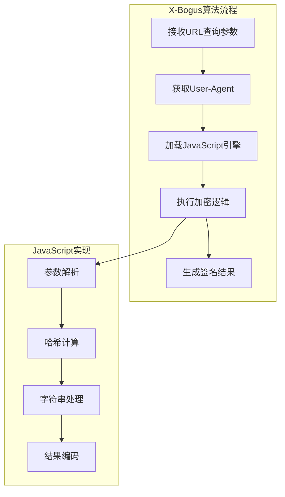

**图表来源**
- [room.py:41-48](file://src/room.py#L41-L48)
- [x-bogus.js:500-564](file://src/javascript/x-bogus.js#L500-L564)

### JavaScript加密实现

项目包含多个JavaScript加密文件，展示了不同的加密技术：

#### 淘宝签名算法

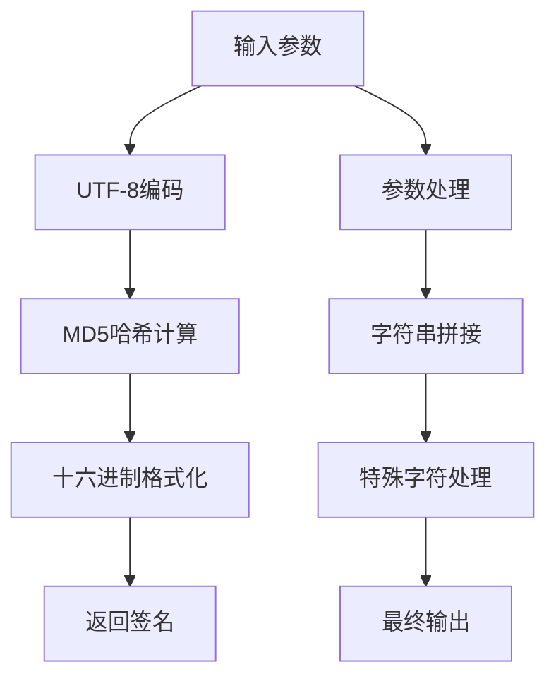

**图表来源**
- [taobao-sign.js:1-78](file://src/javascript/taobao-sign.js#L1-L78)

#### 嗨秀平台加密

嗨秀平台的加密算法更加复杂，包含多个加密步骤：

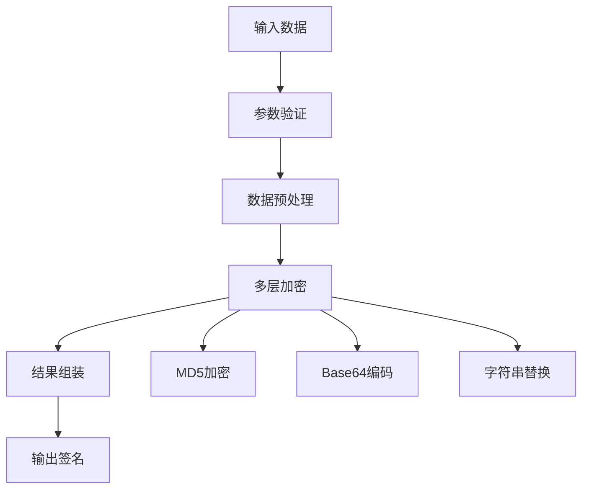

**图表来源**
- [haixiu.js:524-539](file://src/javascript/haixiu.js#L524-L539)

**章节来源**
- [room.py:41-48](file://src/room.py#L41-L48)
- [x-bogus.js:1-564](file://src/javascript/x-bogus.js#L1-L564)

## JavaScript加密解密技术

### Node.js集成机制

项目通过`execjs`模块集成Node.js环境，实现JavaScript加密逻辑：

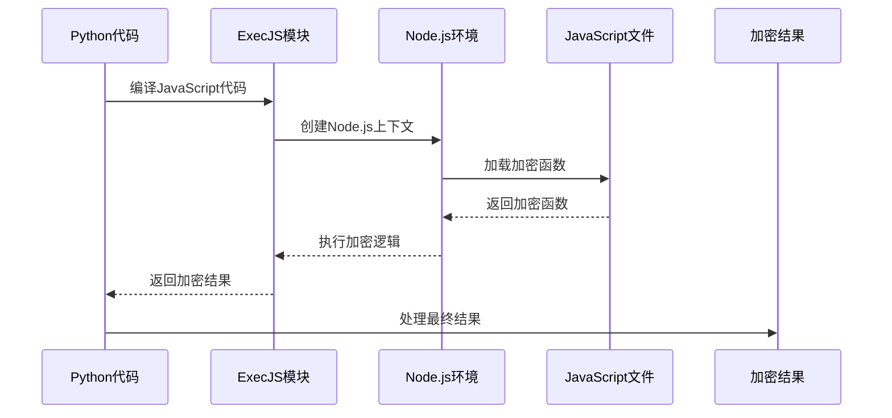

**图表来源**
- [room.py:41-48](file://src/room.py#L41-L48)

### 加密算法对比

| 算法名称 | 实现语言 | 复杂度 | 用途 | 安全性 |
|---------|---------|--------|------|--------|
| a_bogus | Python | 高 | 抖音平台签名 | 强 |
| X-Bogus | JavaScript | 高 | 抖音平台签名 | 强 |
| 淘宝签名 | JavaScript | 中 | 淘宝平台 | 中 |
| 嗨秀加密 | JavaScript | 高 | 嗨秀平台 | 强 |
| MD5哈希 | Python | 低 | 数据摘要 | 低 |

**章节来源**
- [initializer.py:179-204](file://src/initializer.py#L179-L204)
- [initializer.py:207-221](file://src/initializer.py#L207-L221)

## 代理IP轮换策略

### 代理类型支持

项目支持多种代理协议：

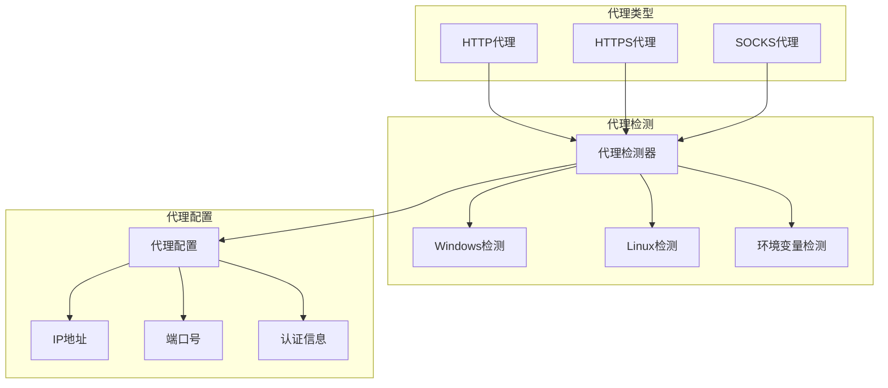

**图表来源**
- [proxy.py:8-25](file://src/proxy.py#L8-L25)
- [proxy.py:27-93](file://src/proxy.py#L27-L93)

### 代理检测机制

项目实现了跨平台的代理检测功能：

#### Windows平台检测

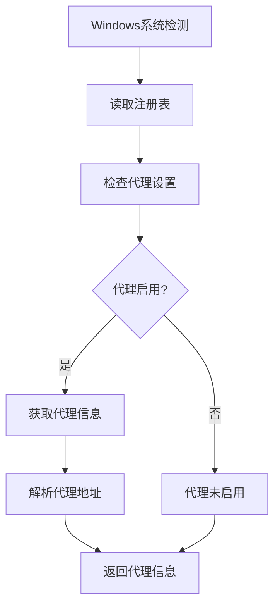

**图表来源**
- [proxy.py:27-93](file://src/proxy.py#L27-L93)

#### Linux平台检测

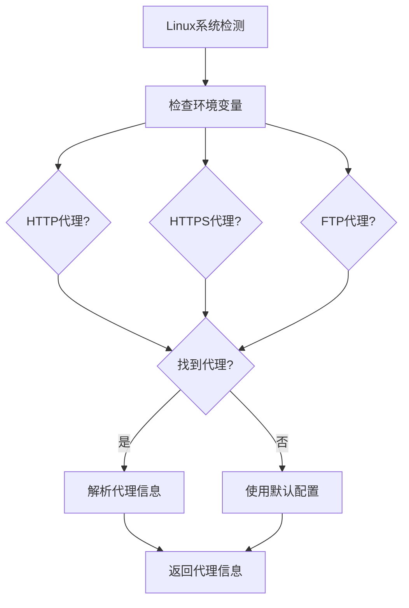

**图表来源**
- [proxy.py:76-93](file://src/proxy.py#L76-L93)

**章节来源**
- [proxy.py:1-93](file://src/proxy.py#L1-L93)

## 请求频率控制

### 频率控制策略

项目实现了多层次的请求频率控制机制：

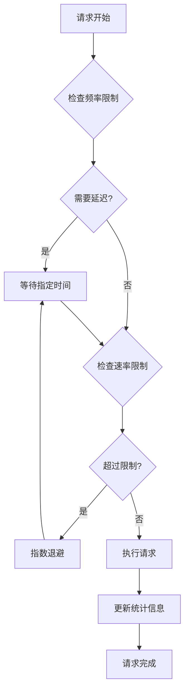

### 速率限制管理

项目通过以下方式管理请求速率：

1. **时间间隔控制**：在请求之间添加随机延迟
2. **并发限制**：控制同时进行的请求数量
3. **平台差异化**：针对不同平台设置不同的速率限制
4. **动态调整**：根据响应时间和错误率调整请求频率

**章节来源**
- [spider.py:144-226](file://src/spider.py#L144-L226)
- [async_http.py:10-60](file://src/http_clients/async_http.py#L10-L60)

## 会话管理策略

### 会话生命周期管理

项目实现了完整的会话管理策略：

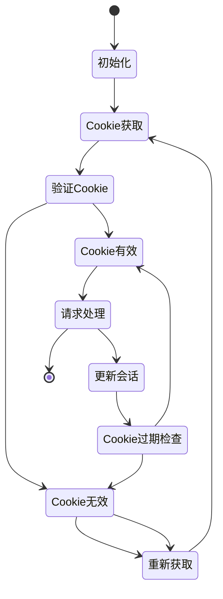

### Cookie管理机制

项目采用智能的Cookie管理策略：

1. **Cookie池管理**：维护多个可用的Cookie
2. **Cookie健康检查**：定期验证Cookie有效性
3. **Cookie轮换**：在请求中轮换使用不同的Cookie
4. **Cookie失效处理**：自动处理Cookie过期情况

**章节来源**
- [utils.py:60-62](file://src/utils.py#L60-L62)
- [spider.py:144-226](file://src/spider.py#L144-L226)

## 风险控制与安全防护

### 风险识别机制

项目实现了多层次的风险识别和防护机制：

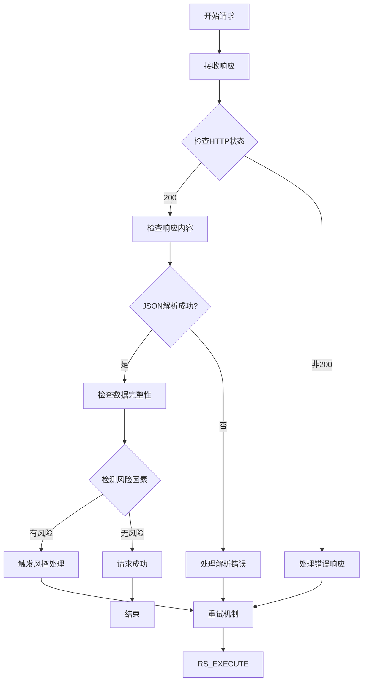

### 防护策略实施

项目采用以下防护策略：

1. **多层验证**：在多个环节验证请求的有效性
2. **异常处理**：完善的异常捕获和处理机制
3. **日志记录**：详细的请求和响应日志
4. **自动恢复**：在出现错误时自动尝试恢复

**章节来源**
- [utils.py:38-51](file://src/utils.py#L38-L51)
- [spider.py:144-226](file://src/spider.py#L144-L226)

## 实际应用案例

### 抖音直播数据获取

项目实现了完整的抖音直播数据获取流程：

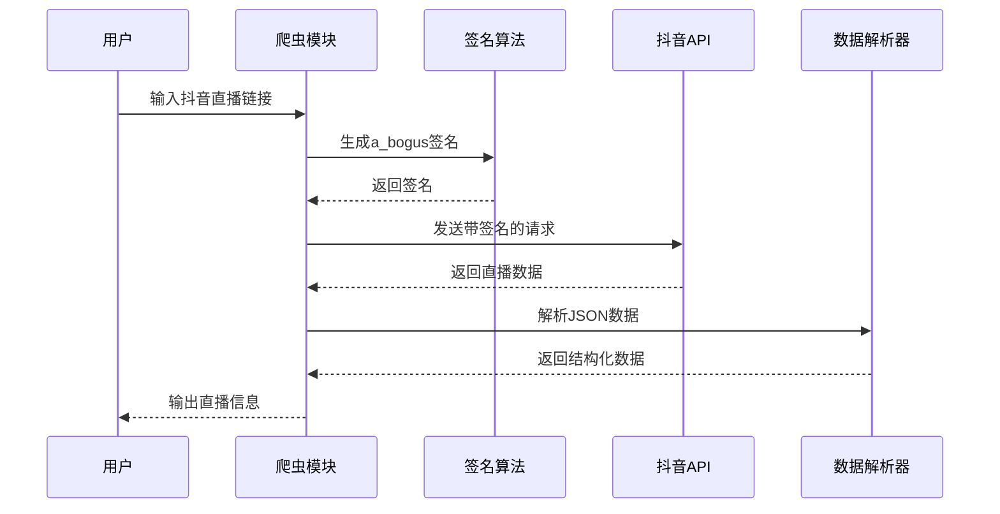

**图表来源**
- [spider.py:68-141](file://src/spider.py#L68-L141)
- [ab_sign.py:444-455](file://src/ab_sign.py#L444-L455)

### 多平台支持实现

项目支持多个直播平台，每种平台都有专门的适配策略：

| 平台 | 主要挑战 | 解决方案 | 技术特点 |
|------|----------|----------|----------|
| 抖音 | 复杂签名算法 | a_bogus + X-Bogus | Python实现签名算法 |
| TikTok | 地域限制 | 代理支持 | 海外节点支持 |
| 快手 | 动态加密 | JavaScript执行 | Node.js环境 |
| 虎牙 | CDN防盗链 | 代理轮换 | 多CDN支持 |
| 斗鱼 | Token验证 | 自动获取 | Cookie管理 |

**章节来源**
- [spider.py:285-313](file://src/spider.py#L285-L313)
- [spider.py:315-361](file://src/spider.py#L315-L361)

## 最佳实践指南

### 代码组织最佳实践

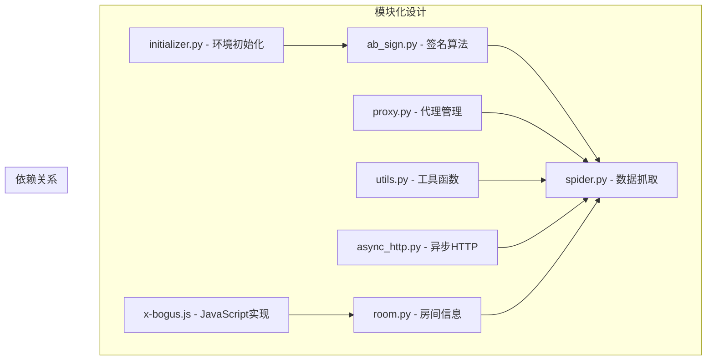

### 性能优化建议

1. **异步请求处理**：使用async/await减少阻塞
2. **连接池管理**：复用HTTP连接提高效率
3. **缓存策略**：缓存静态资源和配置信息
4. **并发控制**：合理控制并发数量避免被封禁

### 安全最佳实践

1. **敏感信息保护**：不要在代码中硬编码API密钥
2. **日志脱敏**：避免在日志中记录敏感信息
3. **证书验证**：生产环境中启用SSL证书验证
4. **权限控制**：限制对敏感操作的访问权限

## 故障排除与调试

### 常见问题诊断

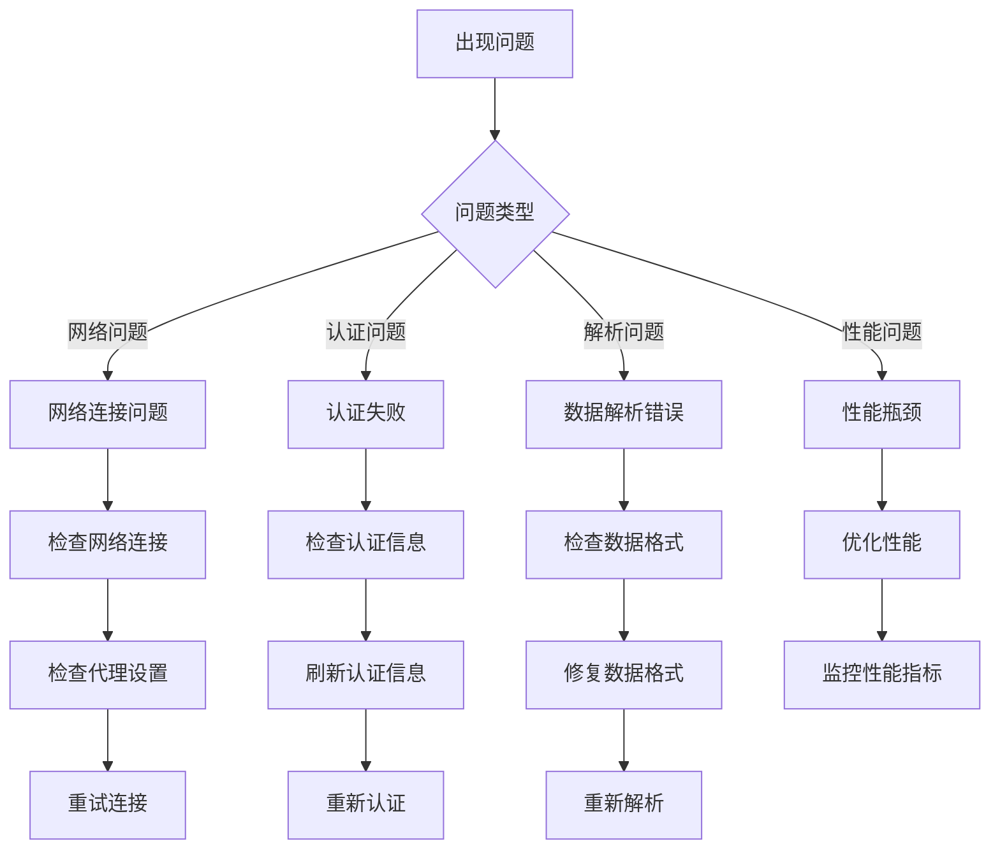

### 调试技巧

1. **启用详细日志**：在开发环境中启用详细日志输出
2. **逐步调试**：使用断点逐步执行关键代码
3. **单元测试**：为关键功能编写单元测试
4. **性能分析**：使用性能分析工具识别瓶颈

**章节来源**
- [utils.py:38-51](file://src/utils.py#L38-L51)
- [spider.py:144-226](file://src/spider.py#L144-L226)

## 总结与建议

### 技术总结

该项目在反爬虫应对方面展现了以下技术特点：

1. **多层防护体系**：从请求头伪装到签名算法，形成完整的防护体系
2. **跨平台兼容性**：支持多种操作系统和代理协议
3. **动态适应能力**：能够根据平台变化调整应对策略
4. **安全性考虑**：注重代码安全和数据保护

### 改进建议

1. **算法更新机制**：建立自动检测和更新签名算法的机制
2. **智能代理池**：实现更智能的代理IP选择和轮换策略
3. **行为模拟**：进一步模拟真实用户的行为模式
4. **安全审计**：定期进行安全审计和漏洞扫描

### 未来发展方向

1. **AI驱动的反检测**：利用机器学习技术提升反检测效果
2. **分布式架构**：支持分布式部署和负载均衡
3. **云服务集成**：与云服务提供商集成，提供更好的性能
4. **开源生态**：积极参与开源社区，共享技术和经验

该项目为反爬虫技术研究提供了宝贵的实践经验，展示了如何在复杂的网络环境中实现稳定可靠的数据获取。