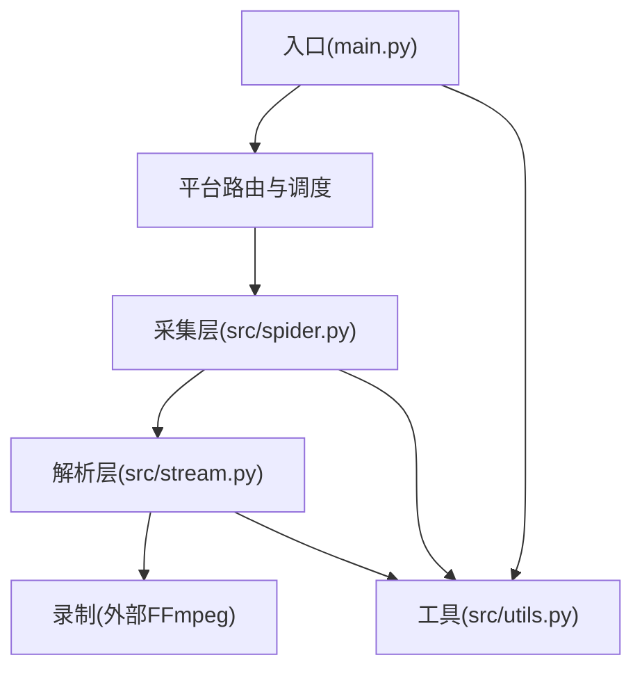
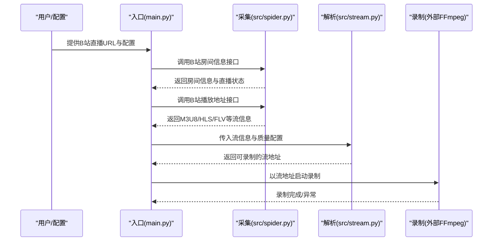
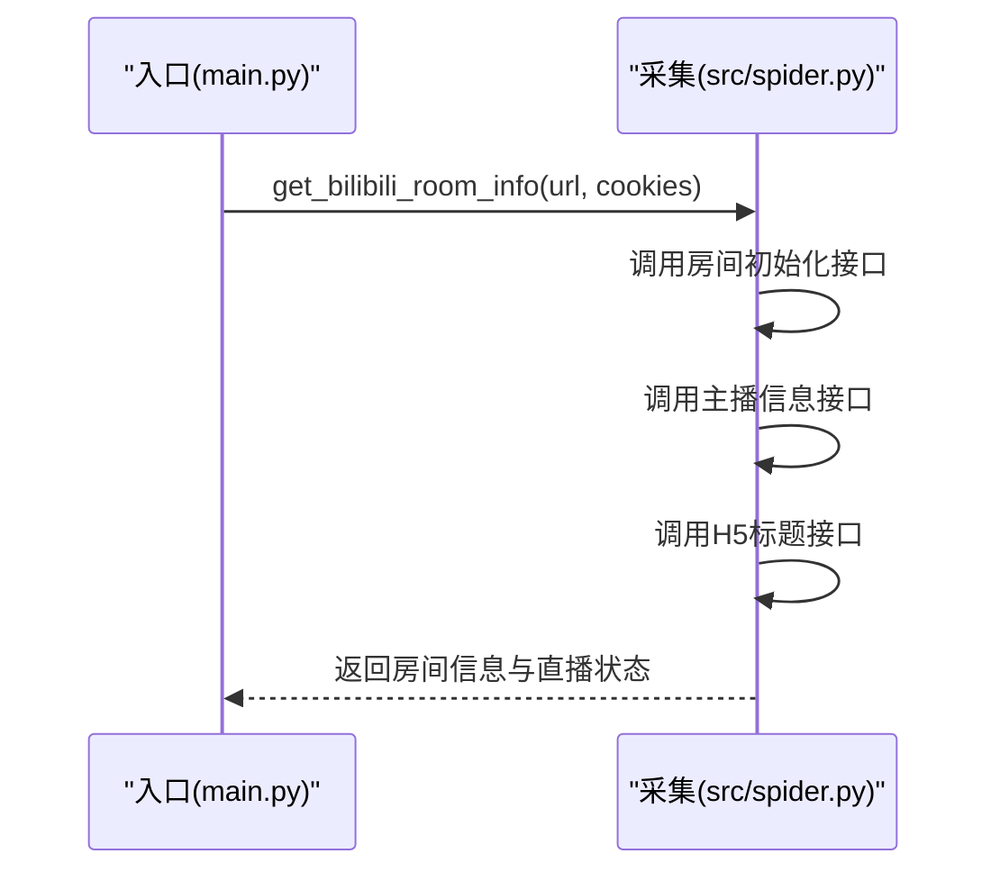
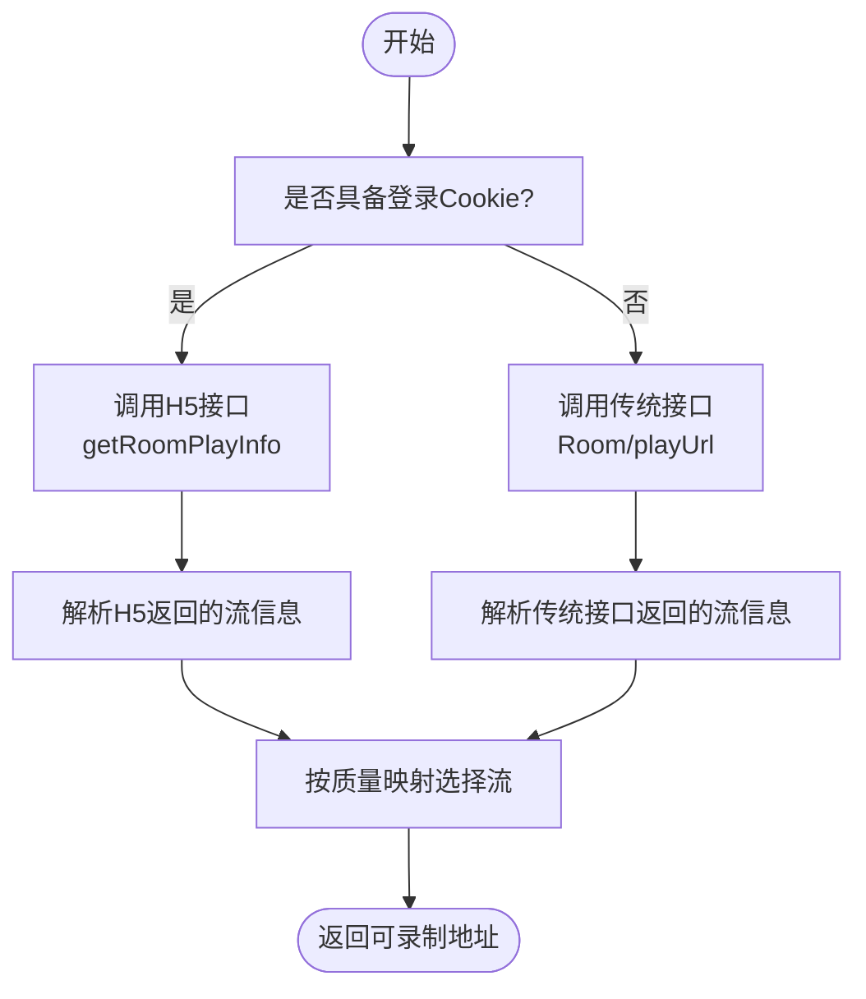
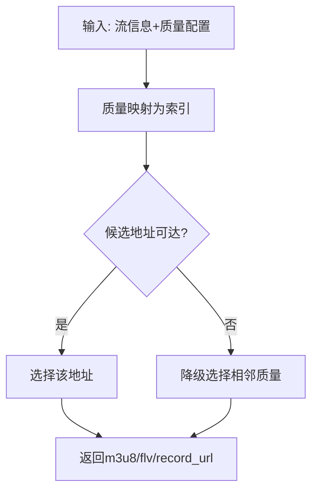
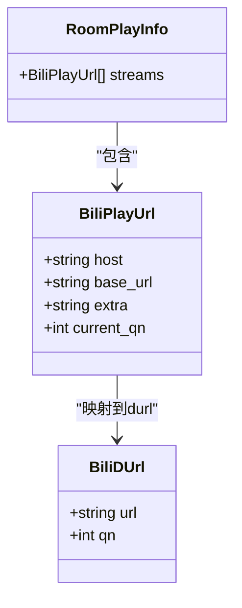
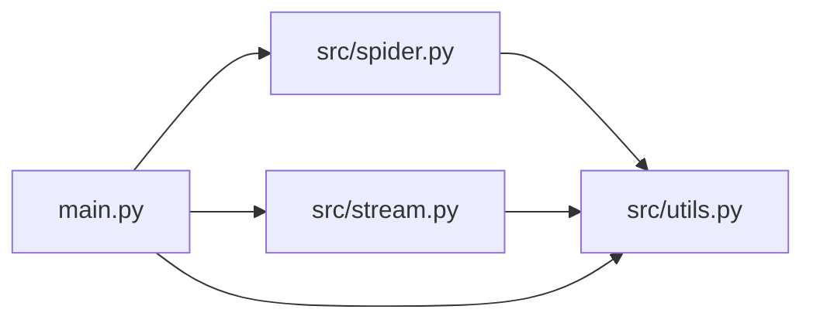

# B站平台

<cite>
**本文引用的文件**
- [README.md](file://README.md)
- [main.py](file://main.py)
- [src/spider.py](file://src/spider.py)
- [src/stream.py](file://src/stream.py)
- [src/utils.py](file://src/utils.py)
- [requirements.txt](file://requirements.txt)
- [demo.py](file://demo.py)
</cite>

## 目录
1. [简介](#简介)
2. [项目结构](#项目结构)
3. [核心组件](#核心组件)
4. [架构总览](#架构总览)
5. [组件详解](#组件详解)
6. [依赖关系分析](#依赖关系分析)
7. [性能与可靠性](#性能与可靠性)
8. [故障排查指南](#故障排查指南)
9. [结论](#结论)
10. [附录](#附录)

## 简介
本文件面向B站直播录制场景，系统梳理项目中B站直播数据获取与直播流地址解析的技术实现，覆盖两类数据来源（网页端H5接口与传统API接口）、反爬虫与Cookie管理、User-Agent配置、直播流格式与码率选择、CDN节点策略、配置要求与登录Cookie获取、以及直播状态检测与质量选择机制。文档同时给出关键流程图与类图，帮助读者快速理解与落地。

## 项目结构
项目采用模块化设计，围绕“采集-解析-录制”主线组织代码：
- 入口与调度：main.py负责配置加载、URL解析、并发控制、平台路由与录制流程编排
- 数据采集：src/spider.py封装各平台接口调用，含B站房间信息与播放地址接口
- 流地址解析：src/stream.py负责按质量选择与可用性校验，输出最终录制地址
- 工具与通用：src/utils.py提供配置读取、代理处理、日志装饰器等
- 依赖声明：requirements.txt声明HTTP与JS执行等运行期依赖

图表来源
- [main.py:650-656](file://main.py#L650-L656)
- [src/spider.py:676-766](file://src/spider.py#L676-L766)
- [src/stream.py:350-378](file://src/stream.py#L350-L378)

章节来源
- [README.md:14-682](file://README.md#L14-L682)
- [main.py:650-656](file://main.py#L650-L656)
- [src/spider.py:676-766](file://src/spider.py#L676-L766)
- [src/stream.py:350-378](file://src/stream.py#L350-L378)
- [src/utils.py:162-168](file://src/utils.py#L162-L168)
- [requirements.txt:1-7](file://requirements.txt#L1-L7)

## 核心组件
- 平台路由与调度：在main.py中识别B站直播URL并调用对应的采集与解析函数
- B站房间信息采集：通过房间初始化与H5信息接口获取直播标题与状态
- B站播放地址获取：通过playUrl与RoomPlayInfo接口获取M3U8/HLS与DASH/FLV等多格式流
- 质量选择与可用性校验：按配置质量与响应状态选择最优流
- Cookie与User-Agent：在采集阶段注入Cookie与合适的UA以满足风控要求
- CDN策略：优先选择稳定CDN，必要时回退

章节来源
- [main.py:650-656](file://main.py#L650-L656)
- [src/spider.py:676-766](file://src/spider.py#L676-L766)
- [src/stream.py:350-378](file://src/stream.py#L350-L378)

## 架构总览
下图展示B站直播录制的关键调用链：入口路由到采集，再到解析与最终录制。

图表来源
- [main.py:650-656](file://main.py#L650-L656)
- [src/spider.py:676-766](file://src/spider.py#L676-L766)
- [src/stream.py:350-378](file://src/stream.py#L350-L378)

## 组件详解

### B站房间信息采集
- 接口要点
  - 房间初始化：获取UID、直播状态
  - 主播信息：通过UID查询主播昵称
  - H5标题：补充直播标题
- 关键实现位置
  - 房间初始化与主播信息：[src/spider.py:687-699](file://src/spider.py#L687-L699)
  - H5标题获取：[src/spider.py:655-673](file://src/spider.py#L655-L673)

图表来源
- [src/spider.py:676-703](file://src/spider.py#L676-L703)

章节来源
- [src/spider.py:655-673](file://src/spider.py#L655-L673)
- [src/spider.py:676-703](file://src/spider.py#L676-L703)

### B站播放地址获取（网页端H5接口与传统API）
- 网页端H5接口
  - 用途：在登录态下获取高质量播放信息
  - 关键参数：qn（质量）、platform（web）、protocol/format/codec等
  - 实现位置：[src/spider.py:706-766](file://src/spider.py#L706-L766)
- 传统API接口
  - 用途：兼容未登录或受限场景
  - 实现位置：[src/spider.py:718-731](file://src/spider.py#L718-L731)
- 质量映射
  - 原画=10000、蓝光=400、超清=250、高清=150、标清=80
  - 实现位置：[src/stream.py:360-367](file://src/stream.py#L360-L367)

图表来源
- [src/spider.py:706-766](file://src/spider.py#L706-L766)
- [src/stream.py:360-367](file://src/stream.py#L360-L367)

章节来源
- [src/spider.py:706-766](file://src/spider.py#L706-L766)
- [src/stream.py:360-367](file://src/stream.py#L360-L367)

### 直播流地址解析与质量选择
- 质量映射与索引
  - 实现位置：[src/stream.py:26-37](file://src/stream.py#L26-L37)
- 可用性校验
  - 通过HTTP状态检查候选地址，失败时降级选择相邻质量
  - 实现位置：[src/stream.py:65-69](file://src/stream.py#L65-L69)
- 输出字段
  - 包含m3u8/flv/record_url等，供后续录制使用
  - 实现位置：[src/stream.py:70-77](file://src/stream.py#L70-L77)

图表来源
- [src/stream.py:26-37](file://src/stream.py#L26-L37)
- [src/stream.py:65-77](file://src/stream.py#L65-L77)

章节来源
- [src/stream.py:26-37](file://src/stream.py#L26-L37)
- [src/stream.py:65-77](file://src/stream.py#L65-L77)

### Cookie管理与User-Agent配置
- Cookie注入
  - 从配置文件读取B站Cookie并注入到请求头
  - 实现位置：[main.py:1882](file://main.py#L1882)、[src/spider.py:714-716](file://src/spider.py#L714-L716)
- User-Agent
  - H5接口使用浏览器UA，传统接口使用Firefox UA
  - 实现位置：[src/spider.py:709-714](file://src/spider.py#L709-L714)、[src/spider.py:718-722](file://src/spider.py#L718-L722)
- 代理处理
  - 统一代理地址格式化
  - 实现位置：[src/utils.py:162-168](file://src/utils.py#L162-L168)

章节来源
- [main.py:1882](file://main.py#L1882)
- [src/spider.py:709-716](file://src/spider.py#L709-L716)
- [src/spider.py:718-722](file://src/spider.py#L718-L722)
- [src/utils.py:162-168](file://src/utils.py#L162-L168)

### 直播状态检测与质量选择机制
- 直播状态检测
  - 通过房间初始化接口判断直播状态
  - 实现位置：[src/spider.py:692](file://src/spider.py#L692)
- 质量选择
  - 依据配置质量映射到qn，优先选择高画质
  - 实现位置：[src/stream.py:360-367](file://src/stream.py#L360-L367)
- 录制入口
  - 调用解析结果中的record_url进行录制
  - 实现位置：[main.py:655-656](file://main.py#L655-L656)

章节来源
- [src/spider.py:692](file://src/spider.py#L692)
- [src/stream.py:360-367](file://src/stream.py#L360-L367)
- [main.py:655-656](file://main.py#L655-L656)

### B站平台特有API调用方式与数据结构
- API调用方式
  - H5接口：getRoomPlayInfo，支持多格式/多码率/多CDN
  - 传统接口：Room/playUrl，返回durl数组
- 数据结构要点
  - playurl_info.playurl.stream.format.codec：包含base_url、url_info(host/extra)、current_qn
  - durl：包含url与qn
- 实现位置
  - H5接口解析：[src/spider.py:744-766](file://src/spider.py#L744-L766)
  - 传统接口解析：[src/spider.py:718-731](file://src/spider.py#L718-L731)

图表来源
- [src/spider.py:744-766](file://src/spider.py#L744-L766)
- [src/spider.py:718-731](file://src/spider.py#L718-L731)

章节来源
- [src/spider.py:718-731](file://src/spider.py#L718-L731)
- [src/spider.py:744-766](file://src/spider.py#L744-L766)

## 依赖关系分析
- 运行时依赖
  - httpx[http2]：支持HTTP/2，提升请求效率
  - PyExecJS：执行平台侧JS逻辑（如签名、加密）
- 模块间耦合
  - main.py依赖spider与stream模块；spider依赖utils进行代理与日志；stream依赖spider提供的数据

图表来源
- [requirements.txt:6](file://requirements.txt#L6)
- [src/spider.py:21-32](file://src/spider.py#L21-L32)
- [src/stream.py:21-24](file://src/stream.py#L21-L24)

章节来源
- [requirements.txt:1-7](file://requirements.txt#L1-L7)
- [src/spider.py:21-32](file://src/spider.py#L21-L32)
- [src/stream.py:21-24](file://src/stream.py#L21-L24)

## 性能与可靠性
- 并发与限速
  - 通过信号量与动态调整并发数降低风控概率
- 可用性校验
  - 对候选地址进行HTTP状态检查，失败时自动降级
- 日志与错误追踪
  - 使用装饰器统一捕获与记录异常，便于定位问题

章节来源
- [main.py:298-324](file://main.py#L298-L324)
- [src/stream.py:65-69](file://src/stream.py#L65-L69)
- [src/utils.py:38-51](file://src/utils.py#L38-L51)

## 故障排查指南
- 无法获取直播流
  - 检查Cookie是否有效与完整
  - 切换User-Agent或启用代理
  - 观察H5接口与传统接口差异
- 画质异常或无法录制
  - 确认质量映射与qn值匹配
  - 检查可用性校验逻辑是否触发降级
- 状态检测失败
  - 核对房间初始化接口返回的直播状态
- 日志定位
  - 使用装饰器输出的错误行号与函数名

章节来源
- [src/spider.py:706-766](file://src/spider.py#L706-L766)
- [src/stream.py:360-367](file://src/stream.py#L360-L367)
- [src/utils.py:38-51](file://src/utils.py#L38-L51)

## 结论
本项目对B站直播实现了两条数据通道：网页端H5接口与传统API接口，结合Cookie与User-Agent管理、质量映射与可用性校验，形成稳定的直播流获取与录制能力。通过模块化设计与统一的日志/错误处理机制，整体具备良好的可维护性与扩展性。

## 附录

### B站配置要求与登录Cookie获取
- 配置项
  - Cookie.B站cookie：用于B站接口鉴权
- 获取方式
  - 登录B站后在浏览器开发者工具中复制Cookie，填入配置文件对应项
- 示例位置
  - [main.py:1882](file://main.py#L1882)

章节来源
- [main.py:1882](file://main.py#L1882)

### 网络环境设置
- 代理
  - 支持统一代理与备用代理，按平台启用
- 依赖
  - httpx[http2]、PyExecJS等

章节来源
- [src/utils.py:162-168](file://src/utils.py#L162-L168)
- [requirements.txt:6](file://requirements.txt#L6)

### API调用与数据结构要点
- H5接口：getRoomPlayInfo
  - 返回playurl_info，包含format/codec/base_url/url_info/current_qn
- 传统接口：Room/playUrl
  - 返回durl数组，包含url与qn
- 实现位置
  - [src/spider.py:744-766](file://src/spider.py#L744-L766)
  - [src/spider.py:718-731](file://src/spider.py#L718-L731)

章节来源
- [src/spider.py:744-766](file://src/spider.py#L744-L766)
- [src/spider.py:718-731](file://src/spider.py#L718-L731)