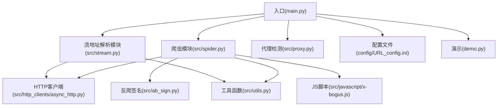
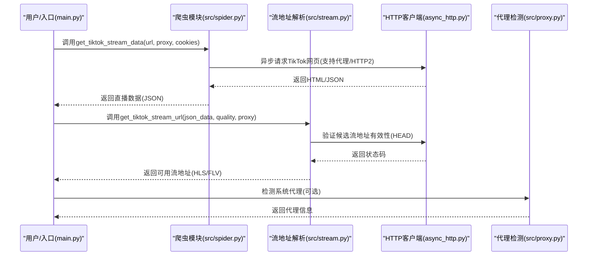
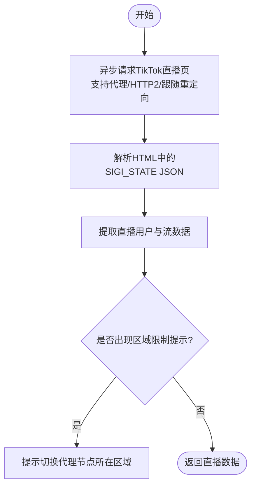
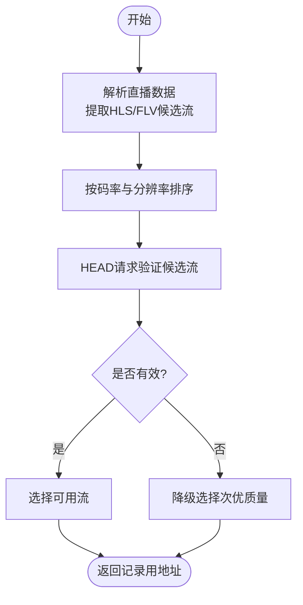
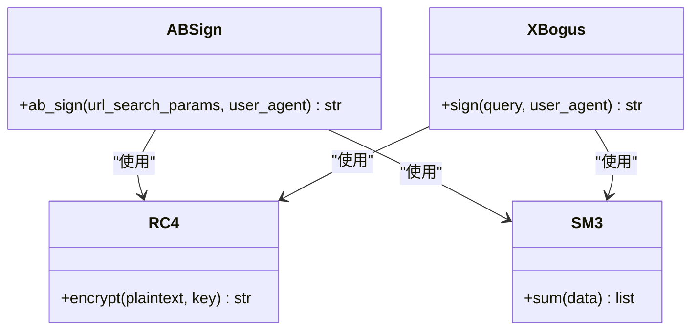
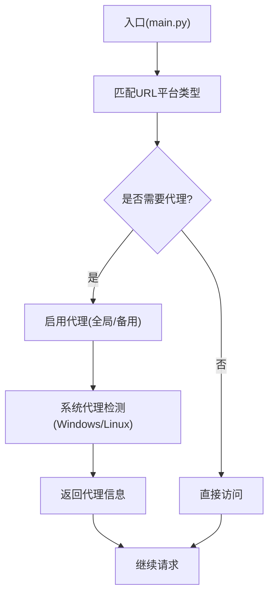
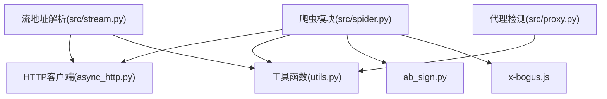

# TikTok平台

<cite>
**本文引用的文件**
- [README.md](file://README.md)
- [main.py](file://main.py)
- [src/spider.py](file://src/spider.py)
- [src/stream.py](file://src/stream.py)
- [src/room.py](file://src/room.py)
- [src/ab_sign.py](file://src/ab_sign.py)
- [src/javascript/x-bogus.js](file://src/javascript/x-bogus.js)
- [src/http_clients/async_http.py](file://src/http_clients/async_http.py)
- [src/utils.py](file://src/utils.py)
- [src/proxy.py](file://src/proxy.py)
- [requirements.txt](file://requirements.txt)
- [config/URL_config.ini](file://config/URL_config.ini)
- [demo.py](file://demo.py)
</cite>

## 目录
1. [简介](#简介)
2. [项目结构](#项目结构)
3. [核心组件](#核心组件)
4. [架构总览](#架构总览)
5. [详细组件分析](#详细组件分析)
6. [依赖关系分析](#依赖关系分析)
7. [性能考量](#性能考量)
8. [故障排查指南](#故障排查指南)
9. [结论](#结论)
10. [附录](#附录)

## 简介
本文件面向TikTok直播数据获取的技术实现，围绕网页端数据解析、JavaScript代码执行、反爬虫应对策略展开，系统梳理TikTok的网络访问限制、代理节点选择、区域访问控制、直播流地址获取与多CDN节点选择策略、流地址有效性验证、配置要求与网络环境准备、常见访问问题排查以及跨地区访问最佳实践。文档同时结合项目源码，给出代码级的架构图与流程图，帮助读者快速理解与落地实施。

## 项目结构
该项目采用模块化设计，按职责划分为爬虫层、流地址解析层、HTTP客户端、工具与代理检测、配置与演示等模块。TikTok相关逻辑主要集中在爬虫与流地址解析两个模块中，并通过统一的HTTP客户端与工具函数支撑。

图表来源
- [main.py:545-608](file://main.py#L545-L608)
- [src/spider.py:286-313](file://src/spider.py#L286-L313)
- [src/stream.py:82-153](file://src/stream.py#L82-L153)
- [src/http_clients/async_http.py:10-46](file://src/http_clients/async_http.py#L10-L46)
- [src/ab_sign.py:444-454](file://src/ab_sign.py#L444-L454)
- [src/javascript/x-bogus.js:500-564](file://src/javascript/x-bogus.js#L500-L564)
- [src/proxy.py:27-93](file://src/proxy.py#L27-L93)
- [config/URL_config.ini:1-5](file://config/URL_config.ini#L1-L5)
- [demo.py:13-16](file://demo.py#L13-L16)

章节来源
- [README.md:72-100](file://README.md#L72-L100)
- [main.py:545-608](file://main.py#L545-L608)

## 核心组件
- 爬虫模块：负责从TikTok网页中解析直播数据，包括HTML解析、JSON提取、反爬参数生成等。
- 流地址解析模块：负责从直播数据中提取可用的HLS/FLV流地址，并进行有效性验证与CDN选择。
- HTTP客户端：封装异步HTTP请求，支持代理、超时、HTTP/2开关、跟随重定向等。
- 工具与代理：提供通用工具函数（如代理地址处理、配置读写、查询参数解析）、系统代理检测。
- 反爬签名：提供a_bogus与X-Bogus等签名算法，用于绕过平台风控。
- 配置与演示：提供URL配置样例与平台测试入口。

章节来源
- [src/spider.py:286-313](file://src/spider.py#L286-L313)
- [src/stream.py:82-153](file://src/stream.py#L82-L153)
- [src/http_clients/async_http.py:10-46](file://src/http_clients/async_http.py#L10-L46)
- [src/utils.py:162-168](file://src/utils.py#L162-L168)
- [src/proxy.py:27-93](file://src/proxy.py#L27-L93)
- [src/ab_sign.py:444-454](file://src/ab_sign.py#L444-L454)
- [src/javascript/x-bogus.js:500-564](file://src/javascript/x-bogus.js#L500-L564)
- [config/URL_config.ini:1-5](file://config/URL_config.ini#L1-L5)
- [demo.py:13-16](file://demo.py#L13-L16)

## 架构总览
下图展示TikTok直播数据获取的整体流程：入口触发后，根据URL匹配平台类型，调用对应的爬虫函数获取直播数据；随后由流地址解析模块提取并验证可用的流地址；最后通过HTTP客户端发起请求并进行录制或播放。

图表来源
- [main.py:596-608](file://main.py#L596-L608)
- [src/spider.py:286-313](file://src/spider.py#L286-L313)
- [src/stream.py:82-153](file://src/stream.py#L82-L153)
- [src/http_clients/async_http.py:10-46](file://src/http_clients/async_http.py#L10-L46)
- [src/proxy.py:27-93](file://src/proxy.py#L27-L93)

## 详细组件分析

### TikTok网页数据解析
- 功能概述：从TikTok直播页解析SIGI_STATE中的直播数据，支持代理与HTTP/2开关，规避区域限制提示。
- 关键点：
  - 使用异步HTTP客户端请求直播页，支持跟随重定向与HTTP/2。
  - 解析HTML中的SIGI_STATE JSON，提取直播用户信息与流数据。
  - 区域限制检测：当返回“已停止运营”提示时，提示切换代理节点所在区域。
- 适用场景：网页端直播数据抓取，适用于需要解析直播状态与基础信息的场景。

图表来源
- [src/spider.py:286-313](file://src/spider.py#L286-L313)
- [src/http_clients/async_http.py:10-46](file://src/http_clients/async_http.py#L10-L46)

章节来源
- [src/spider.py:286-313](file://src/spider.py#L286-L313)

### TikTok流地址解析与有效性验证
- 功能概述：从直播数据中提取HLS/FLV候选流，按质量排序，验证可用性并返回最优地址。
- 关键点：
  - 提取多路流（HLS/FLV），按码率与分辨率排序。
  - 通过HEAD请求验证候选地址有效性，失败时降级选择次优质量。
  - 返回记录用地址（优先HLS，否则FLV）。
- 适用场景：需要稳定获取直播流地址并进行录制或播放的场景。

图表来源
- [src/stream.py:82-153](file://src/stream.py#L82-L153)
- [src/http_clients/async_http.py:49-59](file://src/http_clients/async_http.py#L49-L59)

章节来源
- [src/stream.py:82-153](file://src/stream.py#L82-L153)

### 反爬虫应对策略
- a_bogus签名：用于抖音/TikTok等平台的参数签名，生成a_bogus参数附加到URL。
- X-Bogus签名：用于生成X-Bogus参数，配合User-Agent与查询参数生成签名。
- RC4/SM3算法：在签名生成过程中使用RC4与SM3算法进行加密与摘要计算。
- JavaScript执行：通过PyExecJS加载x-bogus.js脚本，执行签名逻辑。

图表来源
- [src/ab_sign.py:444-454](file://src/ab_sign.py#L444-L454)
- [src/javascript/x-bogus.js:500-564](file://src/javascript/x-bogus.js#L500-L564)

章节来源
- [src/ab_sign.py:29-454](file://src/ab_sign.py#L29-L454)
- [src/javascript/x-bogus.js:500-564](file://src/javascript/x-bogus.js#L500-L564)

### 代理节点选择与区域访问控制
- 系统代理检测：支持Windows与Linux系统代理检测，自动获取系统代理配置。
- 代理地址处理：统一处理代理地址格式（自动补全http://前缀）。
- 平台代理策略：入口处根据URL匹配启用代理，支持全局代理与备用代理。
- 区域限制提示：当代理节点所在区域无法访问TikTok时，返回明确提示，建议切换节点。

图表来源
- [main.py:596-608](file://main.py#L596-L608)
- [src/proxy.py:27-93](file://src/proxy.py#L27-L93)
- [src/utils.py:162-168](file://src/utils.py#L162-L168)

章节来源
- [main.py:596-608](file://main.py#L596-L608)
- [src/proxy.py:27-93](file://src/proxy.py#L27-L93)
- [src/utils.py:162-168](file://src/utils.py#L162-L168)

### 网络访问限制与容错机制
- HTTP/2开关：针对特定平台关闭HTTP/2以规避兼容性问题。
- 超时与重试：统一的超时控制与异常捕获，避免单点失败影响整体流程。
- HEAD验证：对候选流地址进行HEAD请求验证，确保可用性。
- 区域限制提示：当检测到区域限制时，提示用户切换代理节点。

章节来源
- [src/http_clients/async_http.py:10-46](file://src/http_clients/async_http.py#L10-L46)
- [src/http_clients/async_http.py:49-59](file://src/http_clients/async_http.py#L49-L59)
- [src/spider.py:295-303](file://src/spider.py#L295-L303)

### 配置要求与网络环境准备
- Python与依赖：项目依赖httpx、PyExecJS、loguru等库，需满足版本要求。
- Node.js环境：用于执行x-bogus.js脚本，确保Node.js可用。
- FFmpeg：用于录制与转码，需正确安装并加入环境变量。
- 代理配置：在配置文件中启用代理并添加代理地址，支持全局与备用代理。
- URL配置：在URL配置文件中添加TikTok直播链接，支持注释与自定义画质。

章节来源
- [requirements.txt:1-7](file://requirements.txt#L1-L7)
- [README.md:390-428](file://README.md#L390-L428)
- [config/URL_config.ini:1-5](file://config/URL_config.ini#L1-L5)

### API调用方式与数据结构解析
- API调用：通过异步HTTP客户端发起GET/POST请求，支持代理、超时、HTTP/2、跟随重定向。
- 数据结构：TikTok直播数据包含用户信息、直播状态、流数据等字段，解析后按质量排序并验证有效性。
- 返回值：返回包含记录用地址、标题、质量等信息的数据结构，供后续录制或播放使用。

章节来源
- [src/http_clients/async_http.py:10-46](file://src/http_clients/async_http.py#L10-L46)
- [src/spider.py:286-313](file://src/spider.py#L286-L313)
- [src/stream.py:82-153](file://src/stream.py#L82-L153)

### 跨地区访问最佳实践
- 选择代理节点：优先选择与目标平台区域匹配的代理节点，避免区域限制提示。
- 代理轮换：在高并发场景下，建议使用多个代理节点轮换，降低被封风险。
- 网络稳定性：确保代理节点网络稳定，避免频繁断连导致录制中断。
- 日志监控：开启日志记录，及时发现并处理异常情况。

章节来源
- [src/spider.py:295-303](file://src/spider.py#L295-L303)
- [src/proxy.py:27-93](file://src/proxy.py#L27-L93)

## 依赖关系分析
- 组件耦合：爬虫模块与流地址解析模块通过统一的HTTP客户端与工具函数耦合，降低重复实现。
- 外部依赖：依赖httpx进行异步HTTP请求，依赖PyExecJS执行JavaScript脚本，依赖loguru进行日志记录。
- 反爬依赖：依赖ab_sign与x-bogus.js生成签名，提升请求成功率。

图表来源
- [src/spider.py:286-313](file://src/spider.py#L286-L313)
- [src/stream.py:82-153](file://src/stream.py#L82-L153)
- [src/http_clients/async_http.py:10-46](file://src/http_clients/async_http.py#L10-L46)
- [src/ab_sign.py:444-454](file://src/ab_sign.py#L444-L454)
- [src/javascript/x-bogus.js:500-564](file://src/javascript/x-bogus.js#L500-L564)
- [src/proxy.py:27-93](file://src/proxy.py#L27-L93)
- [src/utils.py:162-168](file://src/utils.py#L162-L168)

章节来源
- [src/spider.py:286-313](file://src/spider.py#L286-L313)
- [src/stream.py:82-153](file://src/stream.py#L82-L153)
- [src/http_clients/async_http.py:10-46](file://src/http_clients/async_http.py#L10-L46)
- [src/ab_sign.py:444-454](file://src/ab_sign.py#L444-L454)
- [src/javascript/x-bogus.js:500-564](file://src/javascript/x-bogus.js#L500-L564)
- [src/proxy.py:27-93](file://src/proxy.py#L27-L93)
- [src/utils.py:162-168](file://src/utils.py#L162-L168)

## 性能考量
- 异步请求：使用httpx异步客户端，提高并发效率，减少等待时间。
- 代理优化：合理配置代理节点，避免热点节点拥堵，提升请求成功率。
- HEAD验证：仅验证候选流地址有效性，避免大流量下载带来的资源浪费。
- 日志与监控：通过日志记录异常与耗时，便于定位性能瓶颈。

## 故障排查指南
- 网络异常：检查代理节点是否可用，确认网络环境与防火墙设置。
- 区域限制：当出现“已停止运营”提示时，切换代理节点所在区域。
- 请求失败：检查URL是否正确，确认Cookies与User-Agent是否有效。
- JavaScript执行：确保Node.js环境可用，避免PyExecJS执行JS失败。
- FFmpeg问题：确认FFmpeg已正确安装并加入环境变量，避免录制失败。

章节来源
- [src/spider.py:295-303](file://src/spider.py#L295-L303)
- [src/http_clients/async_http.py:10-46](file://src/http_clients/async_http.py#L10-L46)
- [src/utils.py:38-51](file://src/utils.py#L38-L51)

## 结论
本项目通过模块化的架构设计，实现了TikTok直播数据的高效获取与流地址解析。借助异步HTTP客户端、反爬签名算法与代理检测机制，能够在复杂的网络环境下稳定获取直播数据并进行录制。建议在生产环境中结合代理轮换、日志监控与容错机制，进一步提升系统的可靠性与稳定性。

## 附录
- 示例URL：TikTok直播链接示例位于演示文件中，可直接运行demo.py进行测试。
- 配置文件：URL配置文件支持注释与自定义画质，便于灵活管理多个直播源。

章节来源
- [demo.py:13-16](file://demo.py#L13-L16)
- [config/URL_config.ini:1-5](file://config/URL_config.ini#L1-L5)