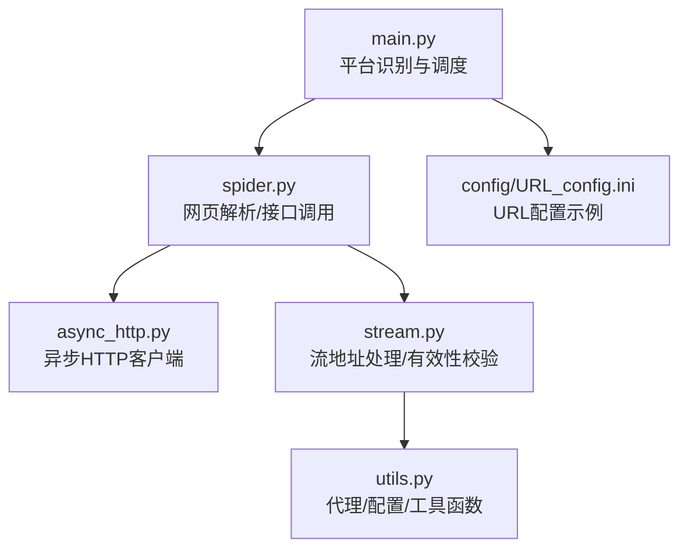
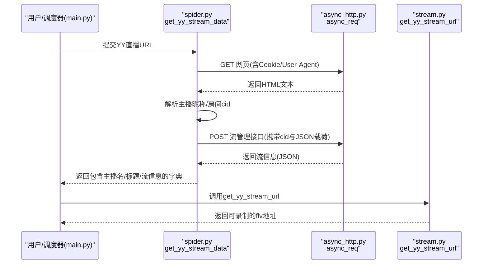
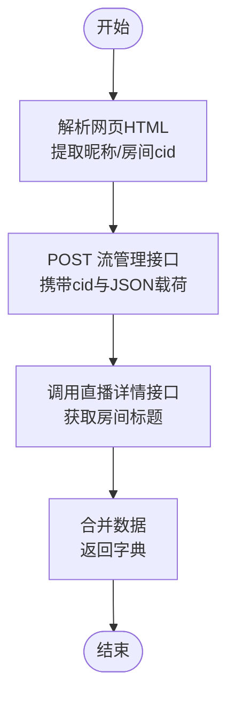
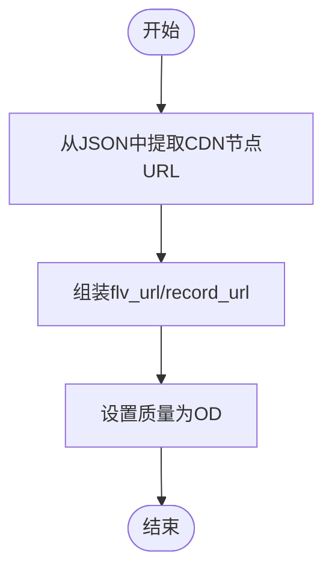
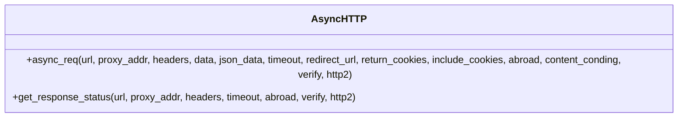
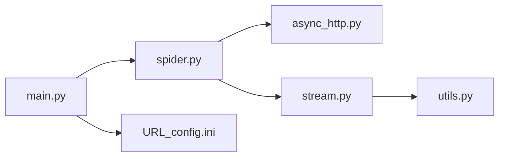

# YY平台

<cite>
**本文档引用的文件**
- [README.md](file://README.md)
- [main.py](file://main.py)
- [demo.py](file://demo.py)
- [spider.py](file://src/spider.py)
- [stream.py](file://src/stream.py)
- [async_http.py](file://src/http_clients/async_http.py)
- [utils.py](file://src/utils.py)
- [URL_config.ini](file://config/URL_config.ini)
- [requirements.txt](file://requirements.txt)
</cite>

## 目录
1. [简介](#简介)
2. [项目结构](#项目结构)
3. [核心组件](#核心组件)
4. [架构总览](#架构总览)
5. [详细组件分析](#详细组件分析)
6. [依赖分析](#依赖分析)
7. [性能考量](#性能考量)
8. [故障排查指南](#故障排查指南)
9. [结论](#结论)
10. [附录](#附录)

## 简介
本文件面向YY直播平台的技术实现，基于仓库现有代码，系统梳理YY直播数据获取、网页端数据解析、WebSocket连接、流地址获取与有效性校验、反爬虫机制与Cookie管理、User-Agent配置、CDN节点选择策略、直播状态检测、配置要求与网络环境设置、常见问题解决方案，以及YY平台特有数据结构与API调用方式。

## 项目结构
- 平台入口与调度：main.py中按URL特征识别并调用对应平台的数据抓取与流地址解析函数。
- 数据抓取层：spider.py提供各平台的网页解析与API调用逻辑，包含YY直播的网页解析与流信息获取。
- 流地址处理层：stream.py负责将抓取到的原始数据转换为可录制的m3u8/flv等地址，并进行有效性校验与CDN选择。
- 异步HTTP客户端：async_http.py封装GET/POST请求、重定向、Cookie返回、响应状态探测等能力。
- 工具与配置：utils.py提供代理地址标准化、Cookie字符串拼接、配置读写、查询参数解析等；URL_config.ini为URL配置文件示例。

图示来源
- [main.py:643-648](file://main.py#L643-L648)
- [spider.py:612-652](file://src/spider.py#L612-L652)
- [stream.py:328-346](file://src/stream.py#L328-L346)
- [async_http.py:10-46](file://src/http_clients/async_http.py#L10-L46)
- [utils.py:162-168](file://src/utils.py#L162-L168)
- [URL_config.ini:1-5](file://config/URL_config.ini#L1-L5)

章节来源
- [README.md:146-148](file://README.md#L146-L148)
- [main.py:643-648](file://main.py#L643-L648)
- [spider.py:612-652](file://src/spider.py#L612-L652)
- [stream.py:328-346](file://src/stream.py#L328-L346)
- [async_http.py:10-46](file://src/http_clients/async_http.py#L10-L46)
- [utils.py:162-168](file://src/utils.py#L162-L168)
- [URL_config.ini:1-5](file://config/URL_config.ini#L1-L5)

## 核心组件
- YY直播数据抓取函数：get_yy_stream_data，负责从网页提取主播昵称与房间cid，随后调用YY流管理接口获取可用CDN流信息。
- YY直播流地址处理函数：get_yy_stream_url，从流管理接口返回的JSON中提取CDN节点URL，组装为可录制的flv地址。
- 异步HTTP请求：async_req，统一处理GET/POST、重定向、Cookie返回、SSL关闭等，供spider.py调用。
- 流有效性校验：get_response_status，通过HEAD请求探测URL可达性，作为备用方案选择依据（在其他平台广泛使用）。
- 工具函数：handle_proxy_addr标准化代理地址；dict_to_cookie_str拼接Cookie；get_query_params解析URL查询参数。

章节来源
- [spider.py:612-652](file://src/spider.py#L612-L652)
- [stream.py:328-346](file://src/stream.py#L328-L346)
- [async_http.py:10-46](file://src/http_clients/async_http.py#L10-L46)
- [async_http.py:49-59](file://src/http_clients/async_http.py#L49-L59)
- [utils.py:60-62](file://src/utils.py#L60-L62)
- [utils.py:162-168](file://src/utils.py#L162-L168)
- [utils.py:197-206](file://src/utils.py#L197-L206)

## 架构总览
下图展示YY直播从URL识别到最终可录制流地址的关键流程：main.py识别URL并调用spider.py的get_yy_stream_data抓取网页与接口数据，再由stream.py的get_yy_stream_url提取CDN流地址。

图示来源
- [main.py:643-648](file://main.py#L643-L648)
- [spider.py:612-652](file://src/spider.py#L612-L652)
- [stream.py:328-346](file://src/stream.py#L328-L346)
- [async_http.py:10-46](file://src/http_clients/async_http.py#L10-L46)

章节来源
- [main.py:643-648](file://main.py#L643-L648)
- [spider.py:612-652](file://src/spider.py#L612-L652)
- [stream.py:328-346](file://src/stream.py#L328-L346)
- [async_http.py:10-46](file://src/http_clients/async_http.py#L10-L46)

## 详细组件分析

### YY直播数据抓取组件（spider.py）
- 功能职责
  - 从YY直播网页中解析主播昵称与房间cid。
  - 调用YY流管理接口（/v3/channel/streams）获取可用CDN流信息。
  - 调用直播详情接口获取房间标题。
- 关键实现要点
  - 网页解析：通过正则匹配提取主播昵称与cid。
  - 接口调用：构造JSON载荷（包含head/client_attribute/avp_parameter等字段），以POST方式访问流管理接口。
  - 详情接口：调用直播详情API获取房间标题，补充到返回数据中。
- 反爬虫与安全
  - 使用固定User-Agent与Cookie头，降低指纹差异。
  - 通过异步HTTP客户端发起请求，减少阻塞。
- 数据结构
  - 返回字典包含anchor_name、title、avp_info_res等字段，其中avp_info_res包含CDN节点列表。

图示来源
- [spider.py:612-652](file://src/spider.py#L612-L652)

章节来源
- [spider.py:612-652](file://src/spider.py#L612-L652)

### YY直播流地址处理组件（stream.py）
- 功能职责
  - 从流管理接口返回的JSON中提取CDN节点URL。
  - 组装为可录制的flv地址并返回。
- 关键实现要点
  - 从avp_info_res.stream_line_addr中取首个CDN节点的URL。
  - 设置quality为“OD”，记录flv_url与record_url。
- 适用场景
  - 适用于YY直播的flv直链录制场景。

图示来源
- [stream.py:328-346](file://src/stream.py#L328-L346)

章节来源
- [stream.py:328-346](file://src/stream.py#L328-L346)

### 异步HTTP客户端（async_http.py）
- 功能职责
  - 统一封装GET/POST请求，支持代理、超时、SSL关闭、HTTP/2开关、重定向跟随、Cookie返回等。
  - 提供get_response_status用于HEAD探测URL可达性。
- 关键实现要点
  - handle_proxy_addr标准化代理地址格式。
  - async_req支持data/json_data参数，自动选择POST或GET。
  - get_response_status仅HEAD探测，返回布尔值表示可达性。

图示来源
- [async_http.py:10-46](file://src/http_clients/async_http.py#L10-L46)
- [async_http.py:49-59](file://src/http_clients/async_http.py#L49-L59)

章节来源
- [async_http.py:10-46](file://src/http_clients/async_http.py#L10-L46)
- [async_http.py:49-59](file://src/http_clients/async_http.py#L49-L59)

### 工具与配置（utils.py、URL_config.ini）
- 工具函数
  - handle_proxy_addr：标准化代理地址，自动补全协议前缀。
  - dict_to_cookie_str：将字典Cookie拼接为字符串形式。
  - get_query_params：解析URL查询参数，支持单参数或全部参数返回。
- 配置文件
  - URL_config.ini：示例配置文件，包含URL列表与注释，便于添加/禁用录制目标。

章节来源
- [utils.py:60-62](file://src/utils.py#L60-L62)
- [utils.py:162-168](file://src/utils.py#L162-L168)
- [utils.py:197-206](file://src/utils.py#L197-L206)
- [URL_config.ini:1-5](file://config/URL_config.ini#L1-L5)

## 依赖分析
- 平台识别与调度
  - main.py通过URL特征判断是否为YY直播，若是则调用spider.get_yy_stream_data与stream.get_yy_stream_url。
- 组件耦合
  - spider.py依赖async_http.py进行HTTP请求；stream.py依赖spider.py返回的JSON结构。
  - utils.py被各模块复用，提供代理与Cookie处理能力。
- 外部依赖
  - httpx[http2]、PyExecJS等在requirements.txt中声明，分别用于HTTP/2与JS执行（其他平台可能使用）。

图示来源
- [main.py:643-648](file://main.py#L643-L648)
- [spider.py:612-652](file://src/spider.py#L612-L652)
- [stream.py:328-346](file://src/stream.py#L328-L346)
- [async_http.py:10-46](file://src/http_clients/async_http.py#L10-L46)
- [utils.py:162-168](file://src/utils.py#L162-L168)
- [URL_config.ini:1-5](file://config/URL_config.ini#L1-L5)

章节来源
- [main.py:643-648](file://main.py#L643-L648)
- [spider.py:612-652](file://src/spider.py#L612-L652)
- [stream.py:328-346](file://src/stream.py#L328-L346)
- [async_http.py:10-46](file://src/http_clients/async_http.py#L10-L46)
- [utils.py:162-168](file://src/utils.py#L162-L168)
- [URL_config.ini:1-5](file://config/URL_config.ini#L1-L5)

## 性能考量
- 异步请求：使用async_req统一发起异步HTTP请求，减少I/O阻塞，提升并发效率。
- HEAD探测：get_response_status采用HEAD请求探测URL可达性，避免完整下载，节省带宽与时间。
- 代理与超时：handle_proxy_addr与timeout参数控制网络请求的稳定性与速度。
- 适配建议
  - 在高并发场景下，合理设置代理与超时参数，避免请求失败。
  - 对于大流量直播，优先选择直链flv录制，减少转码成本。

章节来源
- [async_http.py:10-46](file://src/http_clients/async_http.py#L10-L46)
- [async_http.py:49-59](file://src/http_clients/async_http.py#L49-L59)
- [utils.py:162-168](file://src/utils.py#L162-L168)

## 故障排查指南
- 无法获取直播数据
  - 检查URL是否为正确YY直播地址；确认Cookie与User-Agent是否有效。
  - 查看async_req返回的错误信息，定位网络或权限问题。
- 流地址为空或不可用
  - 确认spider.py返回的JSON中是否包含avp_info_res与CDN节点URL。
  - 若存在多个CDN节点，可尝试切换至其他节点（本项目未实现多节点轮询，建议手动调整）。
- 录制失败
  - 使用get_response_status对目标URL进行可达性检测，排除网络波动。
  - 检查代理设置与防火墙规则，确保能够访问目标CDN节点。
- 配置问题
  - 确认URL_config.ini中URL格式正确，必要时添加#注释禁用特定URL。
  - 使用utils.dict_to_cookie_str将Cookie字典拼接为字符串，避免格式错误。

章节来源
- [spider.py:612-652](file://src/spider.py#L612-L652)
- [stream.py:328-346](file://src/stream.py#L328-L346)
- [async_http.py:10-46](file://src/http_clients/async_http.py#L10-L46)
- [async_http.py:49-59](file://src/http_clients/async_http.py#L49-L59)
- [utils.py:60-62](file://src/utils.py#L60-L62)
- [URL_config.ini:1-5](file://config/URL_config.ini#L1-L5)

## 结论
本项目对YY直播的实现采用“网页解析+接口调用”的组合方式：先从网页提取关键信息，再通过流管理接口获取CDN直链，最后由流地址处理模块组装为可录制的flv地址。整体流程清晰、模块职责明确，具备良好的扩展性。针对反爬虫与网络稳定性，项目提供了标准化的代理与Cookie管理、异步HTTP请求与可达性探测机制。后续可在多CDN节点轮询、动态质量选择等方面进一步增强。

## 附录

### YY直播配置要求与网络环境
- URL格式
  - 示例：https://www.yy.com/22490906/22490906
- Cookie与User-Agent
  - 使用固定Cookie与User-Agent头，降低指纹差异，提高成功率。
- 代理设置
  - 通过utils.handle_proxy_addr标准化代理地址，支持HTTP/HTTPS协议。
- 依赖库
  - httpx[http2]、PyExecJS等在requirements.txt中声明，确保运行环境满足。

章节来源
- [README.md:146-148](file://README.md#L146-L148)
- [spider.py:612-652](file://src/spider.py#L612-L652)
- [utils.py:162-168](file://src/utils.py#L162-L168)
- [requirements.txt:1-7](file://requirements.txt#L1-L7)