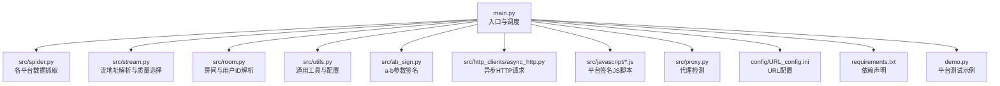
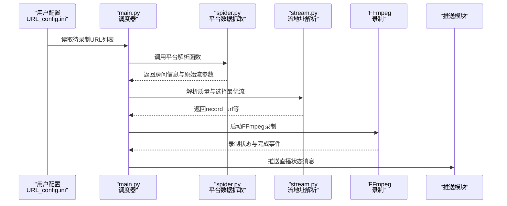
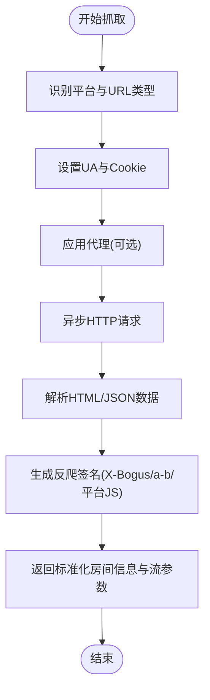
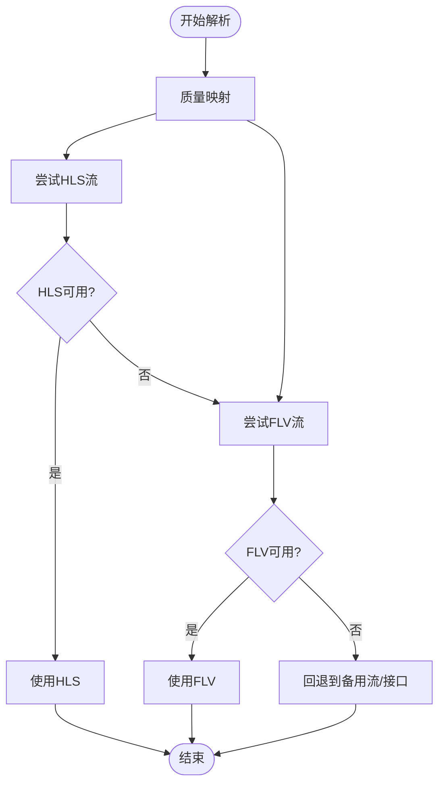
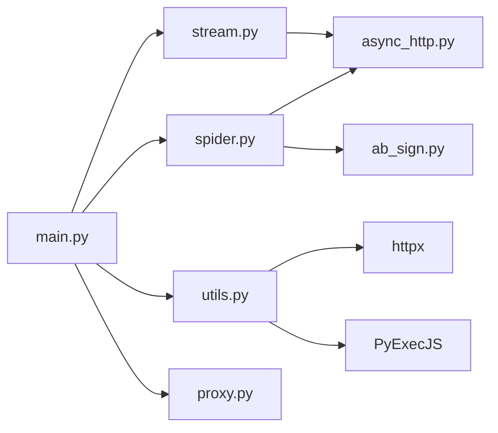

# 国内直播平台

<cite>
**本文引用的文件**
- [README.md](file://README.md)
- [main.py](file://main.py)
- [src/spider.py](file://src/spider.py)
- [src/stream.py](file://src/stream.py)
- [src/room.py](file://src/room.py)
- [src/utils.py](file://src/utils.py)
- [src/ab_sign.py](file://src/ab_sign.py)
- [src/http_clients/async_http.py](file://src/http_clients/async_http.py)
- [src/javascript/x-bogus.js](file://src/javascript/x-bogus.js)
- [src/javascript/haixiu.js](file://src/javascript/haixiu.js)
- [src/javascript/laixiu.js](file://src/javascript/laixiu.js)
- [src/javascript/liveme.js](file://src/javascript/liveme.js)
- [src/javascript/migu.js](file://src/javascript/migu.js)
- [src/javascript/taobao-sign.js](file://src/javascript/taobao-sign.js)
- [src/proxy.py](file://src/proxy.py)
- [demo.py](file://demo.py)
- [requirements.txt](file://requirements.txt)
- [config/URL_config.ini](file://config/URL_config.ini)
</cite>

## 目录
1. [简介](#简介)
2. [项目结构](#项目结构)
3. [核心组件](#核心组件)
4. [架构总览](#架构总览)
5. [详细组件分析](#详细组件分析)
6. [依赖关系分析](#依赖关系分析)
7. [性能考量](#性能考量)
8. [故障排查指南](#故障排查指南)
9. [结论](#结论)
10. [附录](#附录)

## 简介
本项目是一个支持国内外40+直播平台的录制工具，基于FFmpeg实现多平台直播源录制，支持自定义配置录制以及直播状态推送。项目覆盖抖音、快手、B站、虎牙、斗鱼、YY、小红书、Bigo、Blued、网易CC、千度热播、猫耳FM、Look直播、TwitCasting、百度直播、微博直播、酷狗直播、花椒直播、流星直播、Acfun、畅聊直播、映客直播、音播直播、知乎直播、CHZZK、嗨秀直播、VV星球直播、17Live、浪Live、飘飘直播、六间房直播、乐嗨直播、花猫直播、淘宝、京东、咪咕直播、连接直播、来秀直播、Shopee、YouTube、Faceit、Picarto等平台。

## 项目结构
项目采用模块化设计，核心逻辑集中在src目录下，包含爬虫、流地址解析、工具函数、代理检测、异步HTTP客户端、签名与反爬JS脚本等模块；顶层提供入口脚本、配置文件、演示脚本与Docker部署文件。

**图表来源**
- [main.py](file://main.py)
- [src/spider.py](file://src/spider.py)
- [src/stream.py](file://src/stream.py)
- [src/room.py](file://src/room.py)
- [src/utils.py](file://src/utils.py)
- [src/ab_sign.py](file://src/ab_sign.py)
- [src/http_clients/async_http.py](file://src/http_clients/async_http.py)
- [src/javascript/x-bogus.js](file://src/javascript/x-bogus.js)
- [src/proxy.py](file://src/proxy.py)
- [config/URL_config.ini](file://config/URL_config.ini)
- [requirements.txt](file://requirements.txt)
- [demo.py](file://demo.py)

**章节来源**
- [README.md](file://README.md)
- [main.py](file://main.py)

## 核心组件
- 平台适配层：通过统一的URL匹配与平台识别，路由到对应的spider解析函数，返回标准化的流信息。
- 数据抓取层：封装各平台的网页/接口解析逻辑，处理Cookie、UA、风控参数等。
- 流地址解析层：根据用户选择的质量，从多路流中挑选可用的m3u8/flv/rtmp地址。
- 反爬与签名层：集成X-Bogus、a-b签名、平台专用JS签名等，应对不同平台的风控策略。
- 录制控制层：FFmpeg子进程调用、分段录制、转码、时间戳文件生成、脚本钩子等。
- 配置与推送：INI配置读写、消息推送（微信、钉钉、邮箱、TG、Bark、NTFY、PushPlus）。

**章节来源**
- [main.py](file://main.py)
- [src/spider.py](file://src/spider.py)
- [src/stream.py](file://src/stream.py)
- [src/ab_sign.py](file://src/ab_sign.py)
- [src/http_clients/async_http.py](file://src/http_clients/async_http.py)
- [src/javascript/x-bogus.js](file://src/javascript/x-bogus.js)

## 架构总览
整体流程：入口脚本读取URL配置，按平台类型调用对应spider函数获取房间信息与流参数，随后解析质量并选择最优流地址，最后通过FFmpeg进行录制。过程中穿插代理检测、签名生成、错误处理与动态并发调节。

**图表来源**
- [main.py](file://main.py)
- [src/spider.py](file://src/spider.py)
- [src/stream.py](file://src/stream.py)

## 详细组件分析

### 平台适配与URL路由
- 平台识别：通过URL特征判断平台（如抖音、TikTok、快手、虎牙、斗鱼、YY、B站、小红书、Bigo、Blued、网易CC、千度热播、猫耳FM、Look直播、TwitCasting、百度直播、微博直播、酷狗直播、花椒直播、流星直播、Acfun、畅聊直播、映客直播、音播直播、知乎直播、CHZZK、嗨秀直播、VV星球直播、17Live、浪Live、飘飘直播、六间房直播、乐嗨直播、花猫直播、淘宝、京东、咪咕直播、连接直播、来秀直播、Shopee、YouTube、Faceit、Picarto等）。
- 路由策略：针对不同平台分别调用spider中的对应函数，如抖音Web/App、TikTok、快手App/H5、虎牙App/Web、斗鱼、YY、B站、小红书、Bigo、Blued、网易CC、千度热播、猫耳FM、Look直播、TwitCasting、百度直播、微博直播、酷狗直播、花椒直播、流星直播、Acfun、畅聊直播、映客直播、音播直播、知乎直播、CHZZK、嗨秀直播、VV星球直播、17Live、浪Live、飘飘直播、六间房直播、乐嗨直播、花猫直播、淘宝、京东、咪咕直播、连接直播、来秀直播、Shopee、YouTube、Faceit、Picarto等。
- 代理与Cookie：根据平台需求设置代理与Cookie，部分平台需要登录态或海外节点。

**章节来源**
- [main.py](file://main.py)
- [src/spider.py](file://src/spider.py)

### 数据抓取与反爬策略
- 异步HTTP请求：统一使用httpx异步客户端，支持代理、超时、HTTP/2开关、SSL验证等。
- Cookie与UA：针对不同平台设置合适的Cookie与User-Agent，部分平台需要登录态。
- 反爬参数：
  - X-Bogus：抖音/快手等平台使用x-bogus.js生成查询参数签名。
  - a-b签名：通过ab_sign.py生成a_bogus参数，用于抖音Web接口。
  - 平台专用JS签名：如嗨秀直播、来秀直播、LiveMe、咪咕直播、淘宝等平台使用各自JS脚本生成签名。
- 页面解析：正则表达式解析HTML中的JSON数据，或调用接口获取房间信息与流参数。

**图表来源**
- [src/http_clients/async_http.py](file://src/http_clients/async_http.py)
- [src/ab_sign.py](file://src/ab_sign.py)
- [src/javascript/x-bogus.js](file://src/javascript/x-bogus.js)
- [src/javascript/haixiu.js](file://src/javascript/haixiu.js)
- [src/javascript/laixiu.js](file://src/javascript/laixiu.js)
- [src/javascript/liveme.js](file://src/javascript/liveme.js)
- [src/javascript/migu.js](file://src/javascript/migu.js)
- [src/javascript/taobao-sign.js](file://src/javascript/taobao-sign.js)

**章节来源**
- [src/http_clients/async_http.py](file://src/http_clients/async_http.py)
- [src/ab_sign.py](file://src/ab_sign.py)
- [src/javascript/x-bogus.js](file://src/javascript/x-bogus.js)
- [src/javascript/haixiu.js](file://src/javascript/haixiu.js)
- [src/javascript/laixiu.js](file://src/javascript/laixiu.js)
- [src/javascript/liveme.js](file://src/javascript/liveme.js)
- [src/javascript/migu.js](file://src/javascript/migu.js)
- [src/javascript/taobao-sign.js](file://src/javascript/taobao-sign.js)

### 流地址解析与质量选择
- 质量映射：将用户输入的质量（原画/蓝光/超清/高清/标清/流畅）映射为平台内部质量码。
- 多路流选择：优先选择可用的m3u8，若不可用则回退到flv/rtmp；部分平台支持H265，需注意FLV不支持H265时回退到HLS。
- 虎牙CDN参数：动态生成anti-code参数，拼接CDN参数与质量标识。
- 斗鱼签名：通过计算token与参数签名，获取RTMP流地址。
- B站：优先使用官方接口获取播放地址，支持登录态以获取更高画质。
- 小红书：支持短链跳转与移动端页面解析，获取直播流参数。

**图表来源**
- [src/stream.py](file://src/stream.py)

**章节来源**
- [src/stream.py](file://src/stream.py)

### FFmpeg录制与分段
- 子进程调用：通过subprocess启动FFmpeg，支持ts分段、mp4转码、m4a提取、时间戳文件生成等。
- 分段录制：按设定时长切片，便于后续处理与存储。
- 转码策略：可强制h264转码，提升兼容性。
- 脚本钩子：录制完成后可执行自定义脚本（支持python/bat/bash）。

**章节来源**
- [main.py](file://main.py)

### 消息推送与配置管理
- 推送渠道：微信、钉钉、邮箱、Telegram、Bark、NTFY、PushPlus。
- 配置文件：INI格式，支持读取与更新Cookie、Token等敏感信息。
- 日志与颜色输出：彩色终端输出，便于调试。

**章节来源**
- [main.py](file://main.py)
- [src/utils.py](file://src/utils.py)

### 代理检测与网络适配
- 代理检测：支持Windows/Unix系统代理检测，自动获取系统代理配置。
- 全局代理：可为特定平台启用代理，或为备用代理节点配置。

**章节来源**
- [src/proxy.py](file://src/proxy.py)
- [src/utils.py](file://src/utils.py)

## 依赖关系分析
- 运行时依赖：httpx、PyExecJS、CryptoJS（通过JS脚本）、loguru、requests、distro、tqdm、pycryptodome等。
- 项目内依赖：spider依赖async_http与ab_sign；stream依赖spider与async_http；main.py依赖spider、stream、utils、proxy等。

**图表来源**
- [main.py](file://main.py)
- [src/spider.py](file://src/spider.py)
- [src/stream.py](file://src/stream.py)
- [src/utils.py](file://src/utils.py)
- [src/ab_sign.py](file://src/ab_sign.py)
- [src/http_clients/async_http.py](file://src/http_clients/async_http.py)
- [src/proxy.py](file://src/proxy.py)
- [requirements.txt](file://requirements.txt)

**章节来源**
- [requirements.txt](file://requirements.txt)

## 性能考量
- 异步并发：使用httpx异步请求，降低IO等待；动态调整并发数以平衡成功率与风控风险。
- 质量选择：优先选择可用且高质量的流，避免频繁切换造成卡顿。
- FFmpeg参数：合理设置分段时长与转码策略，兼顾磁盘占用与兼容性。
- 代理与网络：为受限平台启用代理，减少被封IP的风险。

[本节为通用指导，无需引用具体文件]

## 故障排查指南
- 平台无法解析：检查URL是否正确、是否需要登录态、是否需要代理。
- 无法获取流地址：确认质量选择是否可用、HLS/FLV是否可用、是否触发风控。
- FFmpeg录制失败：检查FFmpeg安装与路径、分段参数、转码策略。
- 推送失败：检查推送配置、网络连通性、第三方服务状态。
- 日志定位：使用彩色日志输出，结合错误堆栈定位问题。

**章节来源**
- [main.py](file://main.py)
- [src/utils.py](file://src/utils.py)

## 结论
本项目通过模块化设计与统一的平台适配层，实现了对40+国内外直播平台的稳定录制。其核心优势在于：
- 统一的URL路由与平台识别；
- 多层次反爬策略（X-Bogus、a-b签名、平台JS签名）；
- 灵活的流地址解析与质量选择；
- 完善的录制控制与消息推送；
- 可扩展的代理与配置体系。

[本节为总结，无需引用具体文件]

## 附录

### 平台差异与适配要点
- 抖音：支持Web/App两种入口，需a-b签名与X-Bogus；HLS优先，H265需回退HLS。
- TikTok：需海外节点与代理；页面解析获取直播数据。
- 快手：支持App/H5入口；解析playUrls与多分辨率。
- 虎牙：CDN参数动态生成，优先TX等CDN；HLS/FLV均可。
- 斗鱼：需计算token与签名，获取RTMP流。
- YY：通过接口获取流信息，支持FLV。
- B站：官方接口优先，登录态可获取更高画质。
- 小红书：短链跳转与移动端页面解析，获取直播参数。
- 其他平台：根据平台特性使用对应JS签名或接口解析。

**章节来源**
- [src/spider.py](file://src/spider.py)
- [src/stream.py](file://src/stream.py)
- [src/ab_sign.py](file://src/ab_sign.py)
- [src/javascript/x-bogus.js](file://src/javascript/x-bogus.js)
- [src/javascript/haixiu.js](file://src/javascript/haixiu.js)
- [src/javascript/laixiu.js](file://src/javascript/laixiu.js)
- [src/javascript/liveme.js](file://src/javascript/liveme.js)
- [src/javascript/migu.js](file://src/javascript/migu.js)
- [src/javascript/taobao-sign.js](file://src/javascript/taobao-sign.js)

### 开发与扩展指导
- 平台适配器设计模式：统一接口返回标准化数据结构，便于后续扩展。
- 扩展新平台方法论：分析URL特征与入口、研究反爬参数、编写spider与stream解析、补充JS签名（如需）、完善质量选择与回退策略。
- 兼容性处理：对H265/HLS/FLV差异、CDN参数、Cookie/UA策略进行差异化处理。
- 配置与性能：合理设置并发、分段时长、转码策略，结合代理与风控策略提升稳定性。

**章节来源**
- [demo.py](file://demo.py)
- [src/spider.py](file://src/spider.py)
- [src/stream.py](file://src/stream.py)