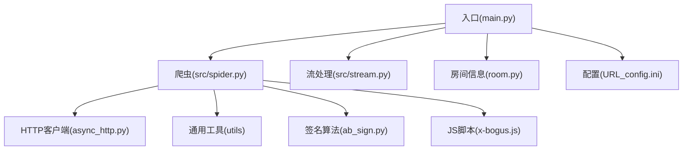
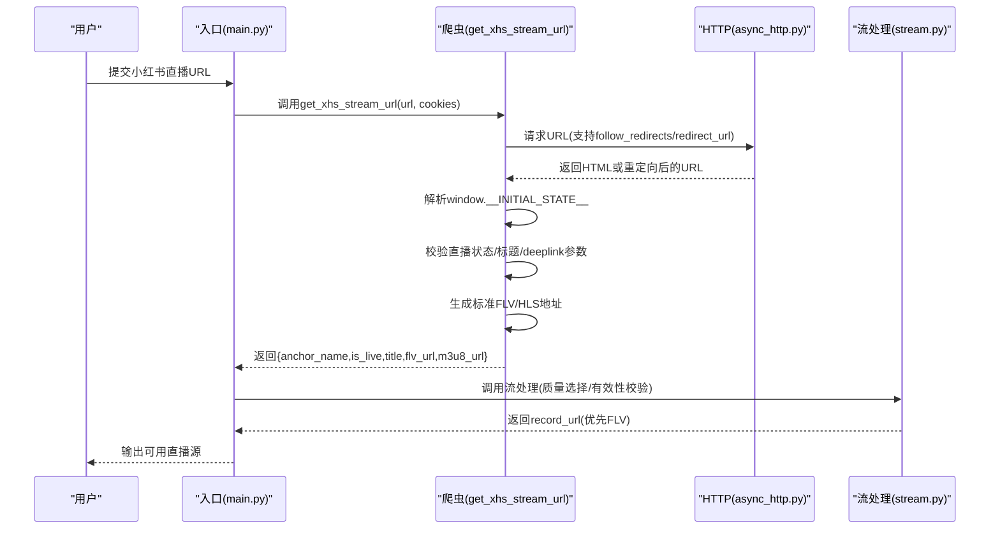
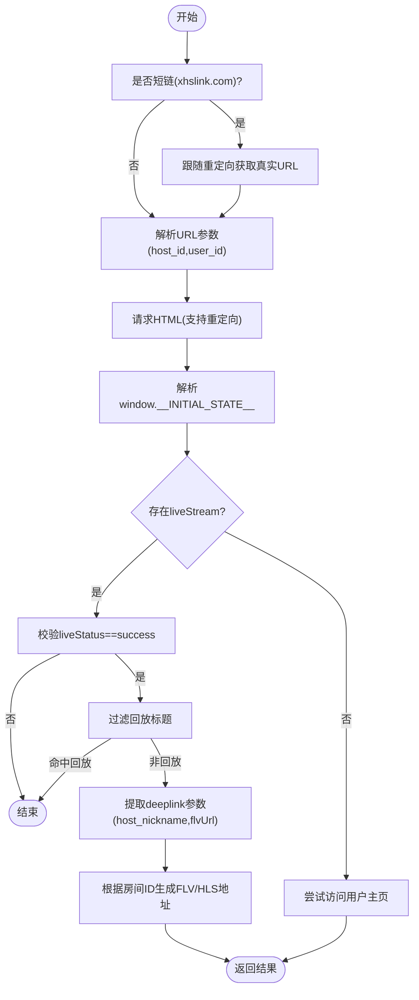
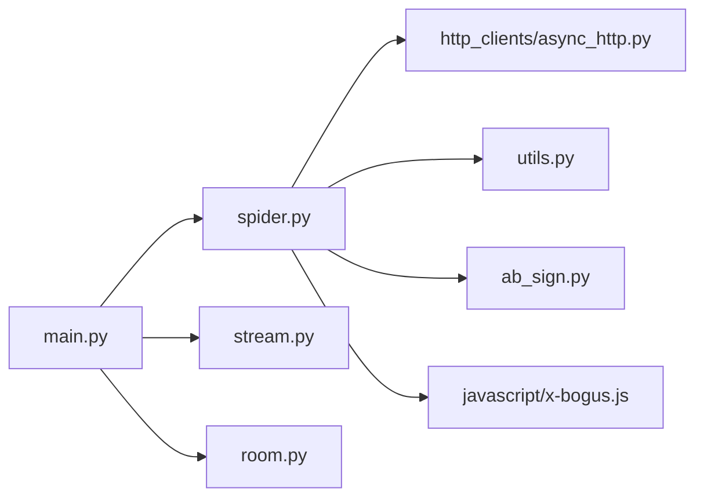

# 小红书平台

<cite>
**本文引用的文件**
- [README.md](file://README.md)
- [main.py](file://main.py)
- [src/spider.py](file://src/spider.py)
- [src/stream.py](file://src/stream.py)
- [src/room.py](file://src/room.py)
- [src/http_clients/async_http.py](file://src/http_clients/async_http.py)
- [src/ab_sign.py](file://src/ab_sign.py)
- [src/javascript/x-bogus.js](file://src/javascript/x-bogus.js)
- [config/URL_config.ini](file://config/URL_config.ini)
</cite>

## 目录
1. [简介](#简介)
2. [项目结构](#项目结构)
3. [核心组件](#核心组件)
4. [架构总览](#架构总览)
5. [详细组件分析](#详细组件分析)
6. [依赖关系分析](#依赖关系分析)
7. [性能考量](#性能考量)
8. [故障排查指南](#故障排查指南)
9. [结论](#结论)
10. [附录](#附录)

## 简介
本文件面向“小红书直播”在本项目中的实现，围绕以下目标展开：
- 解析小红书网页端直播数据，包括域名跳转、参数解析、Cookie管理
- 实现小红书直播流地址获取流程，涵盖 FLV/HLS 流处理、直播状态检测、回放内容识别
- 提供配置要求、网络环境设置、常见问题解决方案
- 总结小红书平台特有的数据结构解析、链接跳转处理与直播状态判断机制

## 项目结构
该项目采用模块化设计，按职责拆分为爬虫、流处理、通用工具、HTTP客户端等模块。小红书相关逻辑集中在爬虫模块与入口调度中。

图表来源
- [main.py:658-664](file://main.py#L658-L664)
- [src/spider.py:768-821](file://src/spider.py#L768-L821)
- [src/stream.py:1-446](file://src/stream.py#L1-L446)
- [src/room.py:1-151](file://src/room.py#L1-L151)
- [src/http_clients/async_http.py:1-60](file://src/http_clients/async_http.py#L1-L60)
- [src/ab_sign.py:444-455](file://src/ab_sign.py#L444-L455)
- [src/javascript/x-bogus.js:500-564](file://src/javascript/x-bogus.js#L500-L564)
- [config/URL_config.ini:1-5](file://config/URL_config.ini#L1-L5)

章节来源
- [README.md:72-100](file://README.md#L72-L100)
- [config/URL_config.ini:1-5](file://config/URL_config.ini#L1-L5)

## 核心组件
- 爬虫模块：负责小红书网页数据抓取、参数解析、域名跳转处理、Cookie注入与状态判断
- 流处理模块：负责从爬取的数据中提取可用的 FLV/HLS 地址，进行质量选择与有效性校验
- HTTP 客户端：统一的异步请求封装，支持重定向、Cookie 返回、HTTPS 校验开关
- 签名与JS：提供 ab 签名与 x-bogus 签名能力，用于构造合法请求头或参数
- 入口调度：在 main.py 中根据 URL 自动识别平台并调用相应解析流程

章节来源
- [src/spider.py:768-821](file://src/spider.py#L768-L821)
- [src/stream.py:1-446](file://src/stream.py#L1-L446)
- [src/http_clients/async_http.py:10-47](file://src/http_clients/async_http.py#L10-L47)
- [src/ab_sign.py:444-455](file://src/ab_sign.py#L444-L455)
- [src/javascript/x-bogus.js:500-564](file://src/javascript/x-bogus.js#L500-L564)
- [main.py:658-664](file://main.py#L658-L664)

## 架构总览
小红书直播数据获取的整体流程如下：
- URL 输入后由入口调度识别为“小红书直播”
- 若为短链（xhslink.com），先进行重定向解析，获取真实落地页
- 抓取落地页 HTML，解析 window.__INITIAL_STATE__ 中的直播数据
- 判断直播状态与标题，过滤回放内容
- 从 deeplink 参数中提取 host_nickname、flvUrl 等关键参数
- 通过房间 ID 生成标准 FLV/HLS 源地址
- 将结果交给流处理模块进行质量选择与有效性校验

图表来源
- [main.py:658-664](file://main.py#L658-L664)
- [src/spider.py:768-821](file://src/spider.py#L768-L821)
- [src/http_clients/async_http.py:10-47](file://src/http_clients/async_http.py#L10-L47)
- [src/stream.py:534-543](file://src/stream.py#L534-L543)

## 详细组件分析

### 小红书爬虫组件（get_xhs_stream_url）
- 域名跳转处理
  - 若 URL 包含 xhslink.com，则通过 HTTP 客户端跟随重定向，获取真实落地页
  - 通过 async_req 的 redirect_url 参数直接返回最终 URL
- 参数解析
  - 从 URL 中解析 host_id、user_id 等参数
  - 从 HTML 中提取 window.__INITIAL_STATE__ JSON 数据
- Cookie 管理
  - 支持传入 cookies 并注入到请求头
- 直播状态检测与回放识别
  - 读取 liveStream.liveStatus，仅当为 "success" 时视为直播
  - 读取 roomInfo.roomTitle，过滤包含“回放”的标题
- FLV/HLS 地址生成
  - 从 deeplink 参数中提取 flvUrl
  - 通过房间 ID 生成标准 FLV/HLS 源地址
  - 返回 m3u8_url 与 flv_url，并设置 record_url 为 flv_url（优先）

图表来源
- [src/spider.py:768-821](file://src/spider.py#L768-L821)
- [src/http_clients/async_http.py:34-37](file://src/http_clients/async_http.py#L34-L37)

章节来源
- [src/spider.py:768-821](file://src/spider.py#L768-L821)
- [src/http_clients/async_http.py:10-47](file://src/http_clients/async_http.py#L10-L47)

### 流处理与质量选择（select_source_url）
- 优先策略
  - 对于小红书等平台，优先使用 FLV 地址
  - 当 FLV 的 codec 为 h265 时，提示不支持并回退到 HLS
- 录制源选择
  - 若未命中 h265 或平台不偏好 FLV，则使用 record_url（通常为 HLS）

章节来源
- [src/stream.py:534-543](file://src/stream.py#L534-L543)

### 入口调度与平台识别
- 入口 main.py 中通过 URL 关键词识别“小红书直播”，并调用 get_xhs_stream_url
- 支持 cookies 注入与代理配置（按平台启用）

章节来源
- [main.py:658-664](file://main.py#L658-L664)

### 反爬虫应对策略
- 请求头与Referer
  - 使用 iOS UA 与特定 xy-common-params、Referer，模拟移动端环境
- 重定向与Cookie
  - follow_redirects 自动处理跳转；支持返回/携带 Cookie
- 签名算法
  - ab 签名与 x-bogus 签名用于构造合法请求参数（在其他平台广泛使用）
  - 小红书爬取流程中未显式使用 ab/x-bogus，但整体框架具备该能力

章节来源
- [src/spider.py:768-777](file://src/spider.py#L768-L777)
- [src/ab_sign.py:444-455](file://src/ab_sign.py#L444-L455)
- [src/javascript/x-bogus.js:500-564](file://src/javascript/x-bogus.js#L500-L564)

## 依赖关系分析
- 爬虫模块依赖 HTTP 客户端进行请求与重定向处理
- 爬虫模块依赖通用工具进行参数解析与 Cookie 序列化
- 爬虫模块依赖签名算法与 JS 脚本（在其他平台广泛使用）
- 入口调度模块按平台路由到对应爬虫函数

图表来源
- [src/spider.py:1-3395](file://src/spider.py#L1-L3395)
- [src/http_clients/async_http.py:1-60](file://src/http_clients/async_http.py#L1-L60)
- [src/ab_sign.py:1-455](file://src/ab_sign.py#L1-L455)
- [src/javascript/x-bogus.js:1-564](file://src/javascript/x-bogus.js#L1-L564)
- [src/stream.py:1-446](file://src/stream.py#L1-L446)
- [src/room.py:1-151](file://src/room.py#L1-L151)
- [main.py:1-2155](file://main.py#L1-L2155)

章节来源
- [src/spider.py:1-3395](file://src/spider.py#L1-L3395)
- [src/http_clients/async_http.py:1-60](file://src/http_clients/async_http.py#L1-L60)
- [src/ab_sign.py:1-455](file://src/ab_sign.py#L1-L455)
- [src/javascript/x-bogus.js:1-564](file://src/javascript/x-bogus.js#L1-L564)
- [src/stream.py:1-446](file://src/stream.py#L1-L446)
- [src/room.py:1-151](file://src/room.py#L1-L151)
- [main.py:1-2155](file://main.py#L1-L2155)

## 性能考量
- 异步请求：统一使用 httpx.AsyncClient，提升并发效率
- 动态线程池：入口模块内置动态调整并发线程数的机制，降低风控触发概率
- 质量选择：优先 FLV，必要时回退 HLS，兼顾稳定性与兼容性
- 重定向与缓存：合理利用 follow_redirects 减少无效请求

章节来源
- [src/http_clients/async_http.py:10-47](file://src/http_clients/async_http.py#L10-L47)
- [main.py:298-325](file://main.py#L298-L325)
- [src/stream.py:534-543](file://src/stream.py#L534-L543)

## 故障排查指南
- 短链无法解析
  - 确认 xhslink.com 是否正确跟随重定向；可通过 redirect_url 参数验证最终 URL
- 直播状态异常
  - 检查 liveStatus 是否为 "success"；标题中包含“回放”会被过滤
- FLV 地址不可用
  - 若 FLV codec 为 h265，将回退到 HLS；建议切换到 HLS 源
- 网络与代理
  - 小红书直播入口已支持代理配置；若网络受限，可启用代理录制
- Cookie 与登录
  - 若页面需要登录，需在 cookies 中注入有效会话；否则可能无法获取直播数据

章节来源
- [src/spider.py:768-821](file://src/spider.py#L768-L821)
- [src/http_clients/async_http.py:34-37](file://src/http_clients/async_http.py#L34-L37)
- [src/stream.py:534-543](file://src/stream.py#L534-L543)
- [main.py:562-574](file://main.py#L562-L574)

## 结论
本项目对小红书直播实现了完整的数据抓取与流地址生成流程：通过短链重定向、HTML 解析、参数提取与状态判断，最终输出可用的 FLV/HLS 源。配合入口调度与流处理模块的质量选择与有效性校验，能够稳定地支持录制任务。同时，项目保留了签名与 JS 能力，便于未来扩展更多平台或应对更严格的风控。

## 附录

### 配置要求与网络环境
- 配置文件
  - URL_config.ini：用于配置待录制的直播 URL 列表
- 网络环境
  - 可选代理：针对部分平台启用代理录制
  - HTTPS 校验：HTTP 客户端支持关闭证书校验（verify=False），谨慎使用
- FFmpeg
  - 录制与转码依赖 FFmpeg，入口模块会自动设置 PATH

章节来源
- [config/URL_config.ini:1-5](file://config/URL_config.ini#L1-L5)
- [src/http_clients/async_http.py:22-23](file://src/http_clients/async_http.py#L22-L23)
- [main.py:70-80](file://main.py#L70-L80)

### 常见问题与解决方案
- 无法获取直播数据
  - 检查 cookies 是否有效；确认 URL 是否为真实直播页（排除回放）
- 录制失败或卡顿
  - 切换到 HLS 源；检查网络与代理设置
- 平台识别错误
  - 确认 URL 关键词匹配（xhslink.com 或 www.xiaohongshu.com）

章节来源
- [src/spider.py:768-821](file://src/spider.py#L768-L821)
- [src/stream.py:534-543](file://src/stream.py#L534-L543)
- [main.py:658-664](file://main.py#L658-L664)