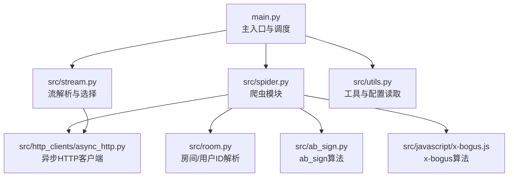
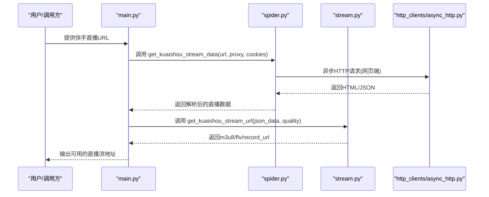
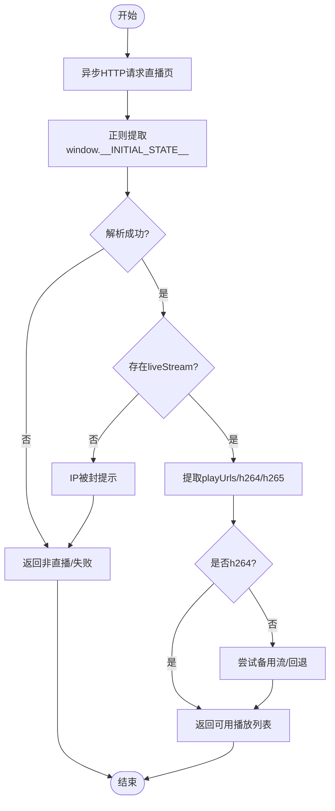
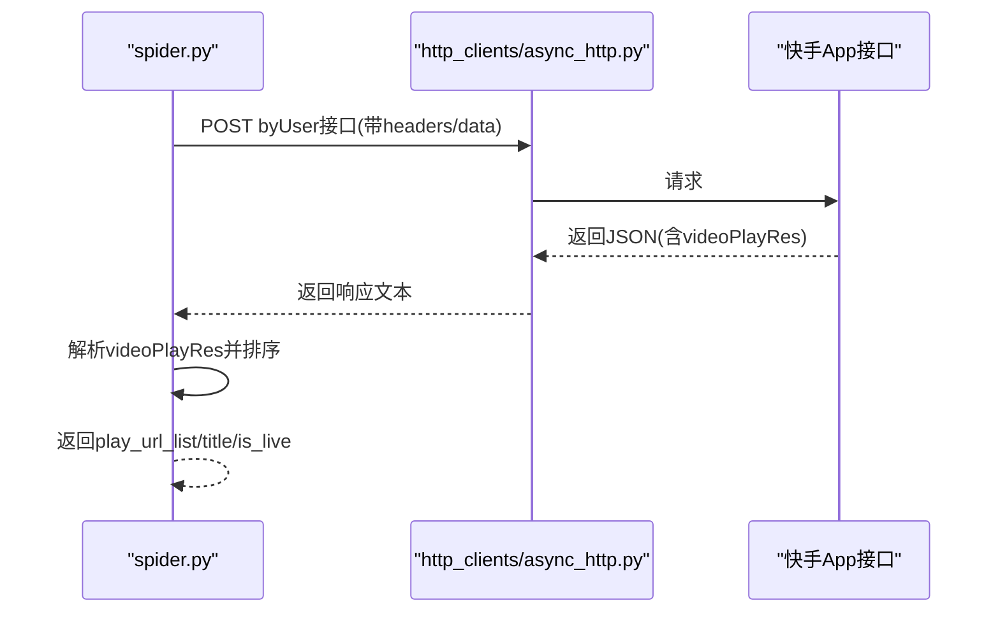
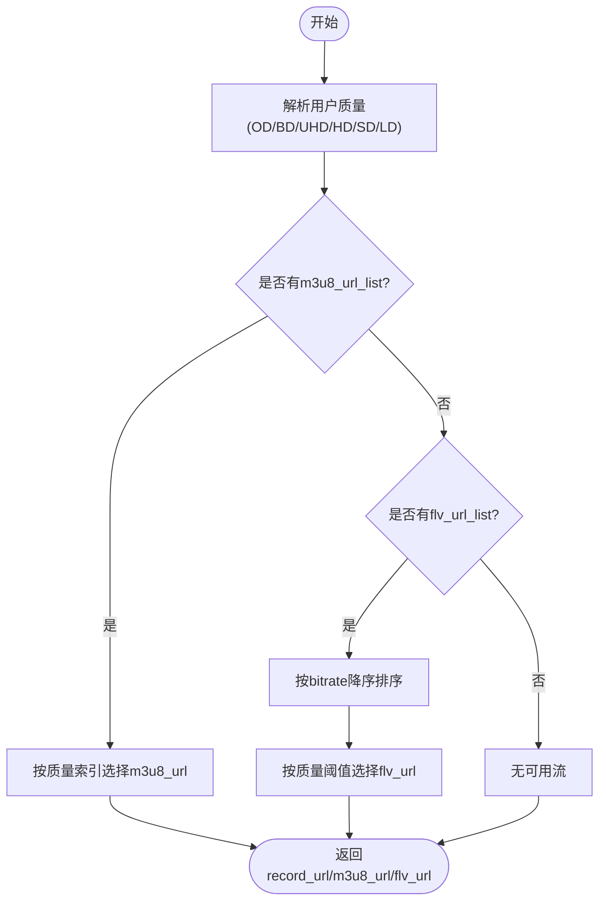
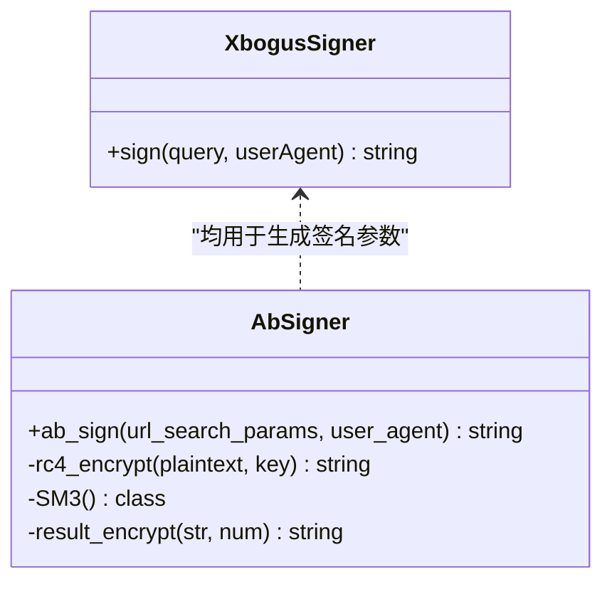
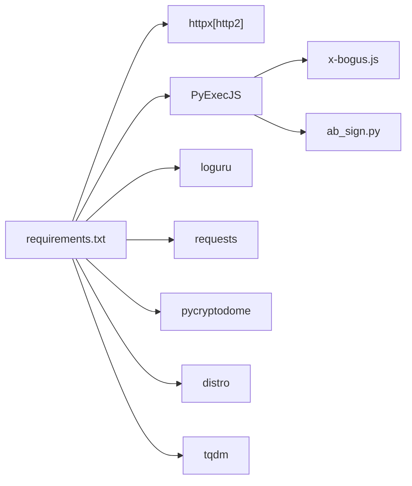

# 快手平台

<cite>
**本文引用的文件**
- [README.md](file://README.md)
- [main.py](file://main.py)
- [src/spider.py](file://src/spider.py)
- [src/stream.py](file://src/stream.py)
- [src/room.py](file://src/room.py)
- [src/ab_sign.py](file://src/ab_sign.py)
- [src/javascript/x-bogus.js](file://src/javascript/x-bogus.js)
- [src/http_clients/async_http.py](file://src/http_clients/async_http.py)
- [src/utils.py](file://src/utils.py)
- [requirements.txt](file://requirements.txt)
- [config/URL_config.ini](file://config/URL_config.ini)
</cite>

## 目录
1. [简介](#简介)
2. [项目结构](#项目结构)
3. [核心组件](#核心组件)
4. [架构总览](#架构总览)
5. [详细组件分析](#详细组件分析)
6. [依赖关系分析](#依赖关系分析)
7. [性能考量](#性能考量)
8. [故障排查指南](#故障排查指南)
9. [结论](#结论)
10. [附录](#附录)

## 简介
本文件面向“快手平台”技术实现，聚焦于直播数据获取的两种方法：网页端解析与App接口调用；深入解析JavaScript逆向工程、token生成算法、加密参数处理；阐述直播流地址获取流程（多分辨率选择、CDN节点切换、备用流处理）；并提供Cookie管理、User-Agent配置、网络环境要求、数据结构解析、错误处理策略及IP封禁应对方案。

## 项目结构
该项目采用模块化设计，围绕“采集-解析-流选择-录制”的链路组织代码：
- 主入口负责调度与配置加载
- 爬虫模块负责从网页或App接口抓取直播数据
- 流处理模块负责解析多分辨率与CDN节点
- 工具与HTTP客户端提供通用能力
- JavaScript逆向脚本与SM3/RC4算法实现token生成

图表来源
- [main.py:545-617](file://main.py#L545-L617)
- [src/spider.py:315-405](file://src/spider.py#L315-L405)
- [src/stream.py:157-206](file://src/stream.py#L157-L206)
- [src/http_clients/async_http.py:10-47](file://src/http_clients/async_http.py#L10-L47)
- [src/room.py:41-48](file://src/room.py#L41-L48)
- [src/ab_sign.py:444-455](file://src/ab_sign.py#L444-L455)
- [src/javascript/x-bogus.js:500-564](file://src/javascript/x-bogus.js#L500-L564)

章节来源
- [README.md:72-100](file://README.md#L72-L100)
- [main.py:545-617](file://main.py#L545-L617)

## 核心组件
- 爬虫模块：负责从网页端与App接口抓取直播数据，解析初始状态、播放列表、备用流等
- 流解析模块：负责多分辨率排序、CDN优先级选择、备用流回退
- 逆向算法模块：提供x-bogus与ab_sign两类token生成算法
- HTTP客户端：统一的异步请求封装，支持代理、头部、重定向、Cookie返回等
- 工具模块：配置读取、Cookie拼装、代理地址规范化、查询参数解析等

章节来源
- [src/spider.py:315-405](file://src/spider.py#L315-L405)
- [src/stream.py:157-206](file://src/stream.py#L157-L206)
- [src/ab_sign.py:444-455](file://src/ab_sign.py#L444-L455)
- [src/javascript/x-bogus.js:500-564](file://src/javascript/x-bogus.js#L500-L564)
- [src/http_clients/async_http.py:10-47](file://src/http_clients/async_http.py#L10-L47)
- [src/utils.py:65-108](file://src/utils.py#L65-L108)

## 架构总览
快手直播数据获取的两条路径：
- 网页端解析：从直播页HTML中提取window.__INITIAL_STATE__，解析直播流信息
- App接口调用：通过REST API获取播放列表，支持多分辨率与备用流

图表来源
- [main.py:609-616](file://main.py#L609-L616)
- [src/spider.py:315-405](file://src/spider.py#L315-L405)
- [src/stream.py:157-206](file://src/stream.py#L157-L206)
- [src/http_clients/async_http.py:10-47](file://src/http_clients/async_http.py#L10-L47)

## 详细组件分析

### 组件A：网页端解析（get_kuaishou_stream_data）
- 功能：从直播页HTML中提取window.__INITIAL_STATE__，解析直播流信息
- 关键点：
  - 解析HTML中的window.__INITIAL_STATE__，提取playUrls
  - 支持h264/h265判断与备用流fallback
  - 返回is_live、flv_url_list、m3u8_url_list、anchor_name等

图表来源
- [src/spider.py:315-405](file://src/spider.py#L315-L405)

章节来源
- [src/spider.py:315-405](file://src/spider.py#L315-L405)

### 组件B：App接口调用（get_kuaishou_stream_data2）
- 功能：通过REST API获取播放列表，支持多分辨率与备用流
- 关键点：
  - 通过byUser接口获取直播信息
  - 解析videoPlayRes中的adaptationSet，按bitrate降序排序
  - 返回play_url_list、title、is_live等

图表来源
- [src/spider.py:364-405](file://src/spider.py#L364-L405)

章节来源
- [src/spider.py:364-405](file://src/spider.py#L364-L405)

### 组件C：流地址选择与CDN切换（get_kuaishou_stream_url）
- 功能：根据用户选择的质量，从m3u8/flv列表中选择合适流，并处理备用流
- 关键点：
  - 质量映射与索引计算
  - 多分辨率列表补齐与排序
  - bitrate优先策略（当flv_url_list包含bitrate字段时）

图表来源
- [src/stream.py:157-206](file://src/stream.py#L157-L206)

章节来源
- [src/stream.py:157-206](file://src/stream.py#L157-L206)

### 组件D：JavaScript逆向与Token生成
- x-bogus算法：用于生成X-Bogus参数，常见于抖音/快手等平台的签名
- ab_sign算法：用于生成a_bogus参数，结合SM3、RC4、自定义Base64表等

图表来源
- [src/javascript/x-bogus.js:500-564](file://src/javascript/x-bogus.js#L500-L564)
- [src/ab_sign.py:444-455](file://src/ab_sign.py#L444-L455)

章节来源
- [src/javascript/x-bogus.js:500-564](file://src/javascript/x-bogus.js#L500-L564)
- [src/ab_sign.py:444-455](file://src/ab_sign.py#L444-L455)

### 组件E：Cookie管理与User-Agent配置
- Cookie管理：
  - 从配置文件读取各平台Cookie
  - 支持将字典转为Cookie字符串
  - 支持返回/包含Cookie的HTTP请求
- User-Agent配置：
  - 爬虫模块针对不同平台设置UA
  - 逆向脚本依赖UA参与签名

章节来源
- [main.py:1876-1876](file://main.py#L1876-L1876)
- [src/utils.py:60-62](file://src/utils.py#L60-L62)
- [src/spider.py:317-322](file://src/spider.py#L317-L322)
- [src/room.py:41-48](file://src/room.py#L41-L48)

### 组件F：网络环境与代理
- 代理地址规范化：统一为http://前缀
- 异步HTTP客户端：支持代理、超时、HTTP/2开关、重定向、Cookie返回等
- 网络异常处理：捕获异常并返回错误信息

章节来源
- [src/utils.py:162-168](file://src/utils.py#L162-L168)
- [src/http_clients/async_http.py:10-47](file://src/http_clients/async_http.py#L10-L47)

## 依赖关系分析
- 运行时依赖：httpx[http2]、PyExecJS、loguru、requests、pycryptodome、distro、tqdm
- 逆向依赖：Node.js环境（通过PyExecJS调用JS脚本）
- 平台差异：不同平台的UA、Headers、Cookie策略不同

图表来源
- [requirements.txt:1-7](file://requirements.txt#L1-L7)
- [src/javascript/x-bogus.js:500-564](file://src/javascript/x-bogus.js#L500-L564)
- [src/ab_sign.py:444-455](file://src/ab_sign.py#L444-L455)

章节来源
- [requirements.txt:1-7](file://requirements.txt#L1-L7)

## 性能考量
- 异步请求：使用httpx异步客户端，提升并发抓取效率
- 质量选择：按bitrate排序，优先选择更高质量
- CDN优先级：在多CDN可用时，按优先级选择最优节点
- 错误窗口自适应：动态调整并发请求数，降低风控触发概率

章节来源
- [src/http_clients/async_http.py:10-47](file://src/http_clients/async_http.py#L10-L47)
- [src/stream.py:180-203](file://src/stream.py#L180-L203)
- [main.py:298-325](file://main.py#L298-L325)

## 故障排查指南
- IP被封：
  - 网页端解析：出现“IP banned. Please change device or network.”提示
  - App接口：返回空直播流或错误类型
  - 建议：更换代理、切换网络、降低请求频率
- Cookie失效：
  - 从配置文件读取的Cookie可能过期
  - 建议：重新登录获取有效Cookie并更新配置
- UA/Headers不匹配：
  - 不同平台UA/Headers差异较大
  - 建议：按平台设置对应UA与Headers
- 逆向失败：
  - Node.js环境缺失或JS执行异常
  - 建议：安装Node.js并确保PyExecJS可用

章节来源
- [src/spider.py:344-346](file://src/spider.py#L344-L346)
- [src/utils.py:38-51](file://src/utils.py#L38-L51)
- [requirements.txt:6-7](file://requirements.txt#L6-L7)

## 结论
本项目通过“网页端解析 + App接口调用”的双通道策略，结合x-bogus与ab_sign两类逆向算法，实现了对快手直播数据的稳定抓取与多分辨率流选择。配合完善的Cookie管理、User-Agent配置与网络环境适配，能够在复杂风控环境下保持较高的成功率。建议在生产环境中合理配置代理与请求频率，以规避IP封禁风险。

## 附录
- 配置文件示例：URL_config.ini中可添加快手直播地址
- 平台Cookie：通过配置文件读取各平台Cookie，包括快手cookie

章节来源
- [config/URL_config.ini:1-5](file://config/URL_config.ini#L1-L5)
- [main.py:1876-1876](file://main.py#L1876-L1876)