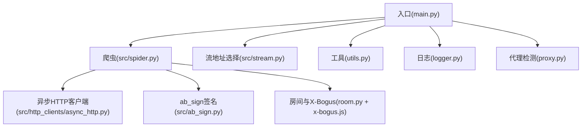
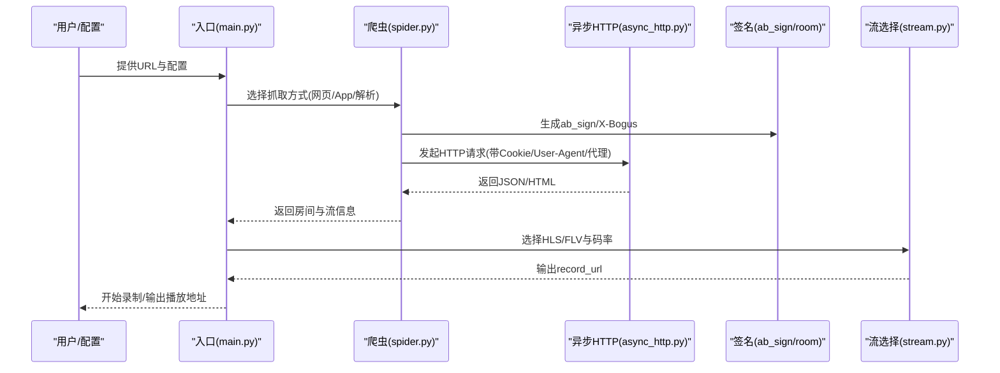
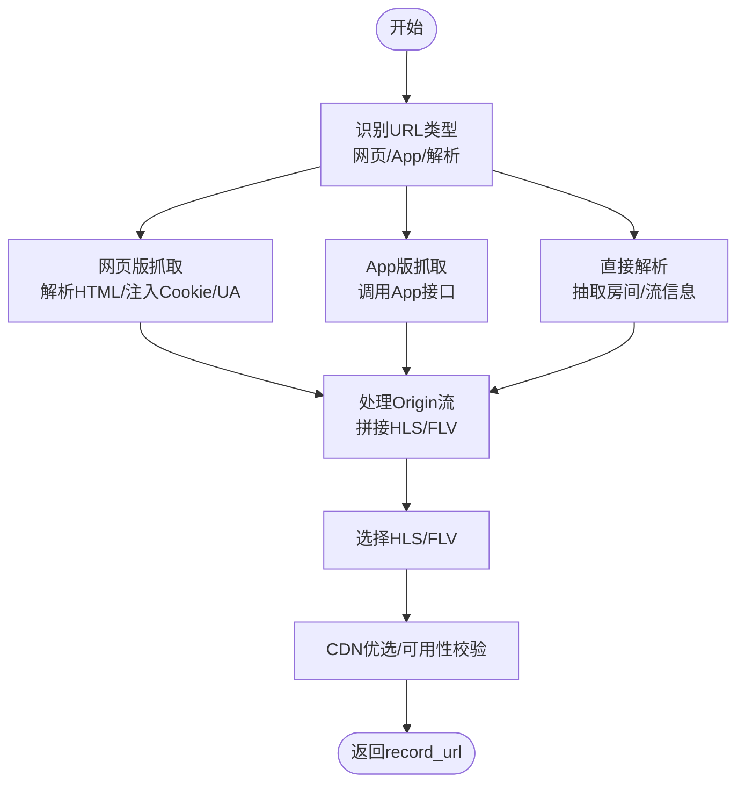
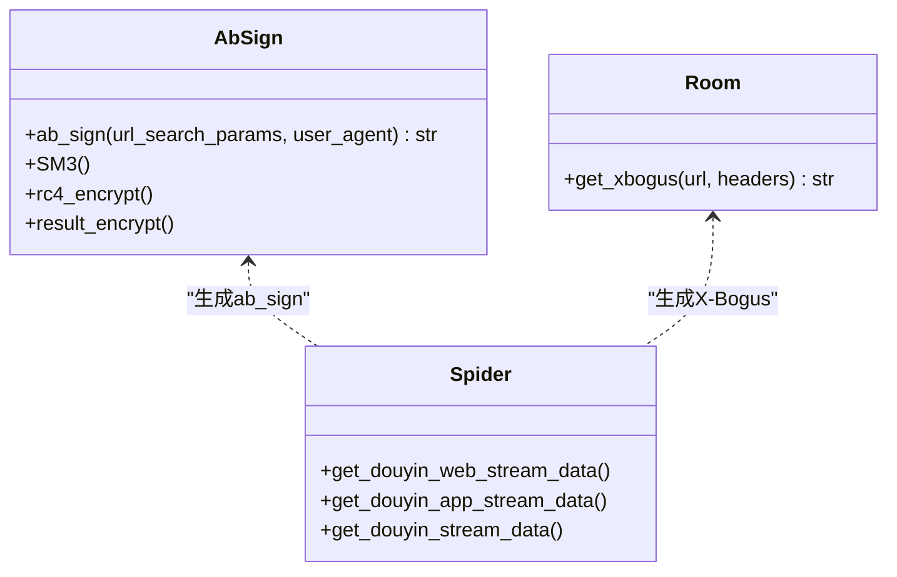
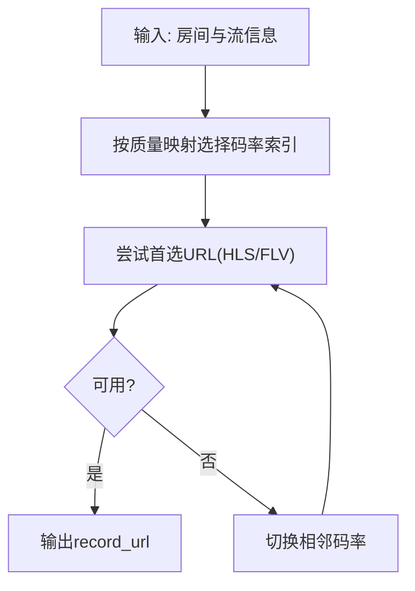
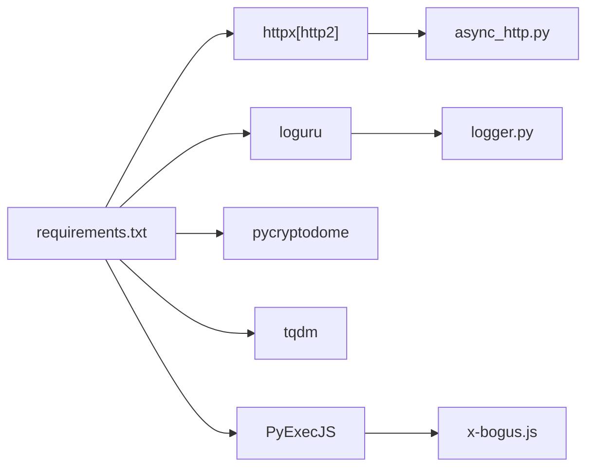

# 抖音平台

<cite>
**本文引用的文件**
- [README.md](file://README.md)
- [main.py](file://main.py)
- [src/spider.py](file://src/spider.py)
- [src/stream.py](file://src/stream.py)
- [src/ab_sign.py](file://src/ab_sign.py)
- [src/room.py](file://src/room.py)
- [src/http_clients/async_http.py](file://src/http_clients/async_http.py)
- [src/utils.py](file://src/utils.py)
- [src/proxy.py](file://src/proxy.py)
- [src/logger.py](file://src/logger.py)
- [src/javascript/x-bogus.js](file://src/javascript/x-bogus.js)
- [requirements.txt](file://requirements.txt)
- [config/URL_config.ini](file://config/URL_config.ini)
- [demo.py](file://demo.py)
</cite>

## 目录
1. [简介](#简介)
2. [项目结构](#项目结构)
3. [核心组件](#核心组件)
4. [架构总览](#架构总览)
5. [详细组件分析](#详细组件分析)
6. [依赖分析](#依赖分析)
7. [性能考量](#性能考量)
8. [故障排查指南](#故障排查指南)
9. [结论](#结论)
10. [附录](#附录)

## 简介
本文件面向抖音平台的技术实现，围绕直播数据获取的三种方式（网页版、App版、直接解析）、反爬虫机制与签名算法、Cookie与User-Agent管理、直播流地址获取流程（HLS/FLV选择与多码率处理、Origin流特殊处理）、平台配置与性能优化、常见问题与解决方案进行系统化梳理。文档同时给出代码级架构图与流程图，帮助读者快速理解与落地。

## 项目结构
项目采用分层设计：入口控制与调度、异步HTTP客户端、爬虫与解析、签名与工具、日志与代理检测等模块协同工作，形成可扩展的直播采集与录制体系。

**图表来源**
- [main.py](file://main.py)
- [src/spider.py](file://src/spider.py)
- [src/stream.py](file://src/stream.py)
- [src/ab_sign.py](file://src/ab_sign.py)
- [src/room.py](file://src/room.py)
- [src/http_clients/async_http.py](file://src/http_clients/async_http.py)
- [src/utils.py](file://src/utils.py)
- [src/proxy.py](file://src/proxy.py)
- [src/logger.py](file://src/logger.py)

**章节来源**
- [README.md](file://README.md)
- [main.py](file://main.py)

## 核心组件
- 入口与调度：负责读取配置、并发调度、录制控制、错误窗口与动态并发调节。
- 爬虫模块：封装抖音网页版、App版、直接解析三种数据抓取路径；统一处理Origin流、HLS/FLV多码率与CDN优选。
- 签名与安全：ab_sign签名生成、X-Bogus签名计算、User-Agent与Cookie注入、风控规避策略。
- 异步HTTP：统一的异步请求封装，支持代理、HTTP/2开关、重定向与Cookies返回。
- 工具与日志：通用工具、磁盘容量检查、代理地址规范化、日志分级与落盘。
- 代理检测：跨平台系统代理读取与启用判断。

**章节来源**
- [main.py](file://main.py)
- [src/spider.py](file://src/spider.py)
- [src/stream.py](file://src/stream.py)
- [src/ab_sign.py](file://src/ab_sign.py)
- [src/room.py](file://src/room.py)
- [src/http_clients/async_http.py](file://src/http_clients/async_http.py)
- [src/utils.py](file://src/utils.py)
- [src/proxy.py](file://src/proxy.py)
- [src/logger.py](file://src/logger.py)

## 架构总览
抖音直播采集整体流程：入口解析URL与配置 → 选择抓取方式（网页/App/解析）→ 生成必要签名（ab_sign/X-Bogus）→ 请求平台接口/解析页面 → 解析流地址（HLS/FLV）→ 选择最优码率与CDN → 下载/FFmpeg录制。

**图表来源**
- [main.py](file://main.py)
- [src/spider.py](file://src/spider.py)
- [src/stream.py](file://src/stream.py)
- [src/ab_sign.py](file://src/ab_sign.py)
- [src/room.py](file://src/room.py)
- [src/http_clients/async_http.py](file://src/http_clients/async_http.py)

## 详细组件分析

### 抖音直播数据获取的三种方式
- 网页版：通过浏览器UA与Cookie访问直播入口，解析页面中的房间与流信息，兼容Origin流并补充HLS/FLV多码率。
- App版：通过App接口获取房间与流信息，支持Origin流拼接与HLS/FLV多码率选择。
- 直接解析：从页面HTML中抽取房间与流数据，兼容Origin流与多码率。

**图表来源**
- [src/spider.py](file://src/spider.py)
- [src/stream.py](file://src/stream.py)

**章节来源**
- [src/spider.py](file://src/spider.py)
- [src/stream.py](file://src/stream.py)

### 反爬虫机制与签名算法
- ab_sign签名：用于抖音Web接口查询参数签名，结合时间戳、随机串、UA与SM3/RC4等算法生成。
- X-Bogus签名：用于部分接口的查询参数签名，通过内置JS脚本计算，模拟浏览器行为。
- Cookie与User-Agent：按平台注入Cookie与UA，降低风控触发概率。
- 风控应对：动态并发调节、错误率窗口、代理切换、HTTP/2开关、重试与降级。

**图表来源**
- [src/ab_sign.py](file://src/ab_sign.py)
- [src/room.py](file://src/room.py)
- [src/spider.py](file://src/spider.py)

**章节来源**
- [src/ab_sign.py](file://src/ab_sign.py)
- [src/room.py](file://src/room.py)
- [src/spider.py](file://src/spider.py)
- [src/javascript/x-bogus.js](file://src/javascript/x-bogus.js)

### Cookie管理与User-Agent轮换策略
- Cookie：按平台注入Cookie，部分接口支持Cookies返回与更新。
- UA：针对不同平台与接口设置UA，避免被识别为爬虫。
- 代理：支持系统代理读取与手动配置，按平台启用代理录制。

**章节来源**
- [src/spider.py](file://src/spider.py)
- [src/http_clients/async_http.py](file://src/http_clients/async_http.py)
- [src/proxy.py](file://src/proxy.py)

### 抖音直播流地址获取流程（HLS/FLV、多码率、Origin流）
- 多码率选择：按配置质量（原画/蓝光/超清/高清/标清/流畅）选择HLS/FLV列表中的对应项。
- CDN优选：优先选择稳定CDN，若首选CDN不可用则回退。
- 可用性校验：HEAD请求校验URL有效性，失败则切换相邻码率。
- Origin流特殊处理：当存在Origin流时，将其HLS/FLV与常规流合并，保持一致性。

**图表来源**
- [src/stream.py](file://src/stream.py)

**章节来源**
- [src/stream.py](file://src/stream.py)

### 平台API调用规范与配置要求
- 抖音Web接口：需生成ab_sign，注入Cookie与UA，支持Origin流拼接。
- 抖音App接口：需生成ab_sign或X-Bogus，注入Cookie与UA。
- 配置文件：支持URL配置、Cookie配置、代理配置、录制质量与格式等。

**章节来源**
- [src/spider.py](file://src/spider.py)
- [config/URL_config.ini](file://config/URL_config.ini)

## 依赖分析
项目依赖以异步HTTP库为核心，配合日志、工具与JS签名脚本，形成稳定的采集链路。

**图表来源**
- [requirements.txt](file://requirements.txt)
- [src/http_clients/async_http.py](file://src/http_clients/async_http.py)
- [src/logger.py](file://src/logger.py)
- [src/javascript/x-bogus.js](file://src/javascript/x-bogus.js)

**章节来源**
- [requirements.txt](file://requirements.txt)

## 性能考量
- 异步并发：通过信号量与动态并发调节，平衡吞吐与风控风险。
- 错误率窗口：基于滑动窗口统计错误率，动态调整并发，避免大规模失败。
- CDN优选与可用性校验：减少无效请求与失败重试成本。
- 日志分级与落盘：INFO级别URL输出便于排障，不影响调试日志性能。
- FFmpeg录制：支持分段与转码，兼顾录制稳定性与文件体积。

**章节来源**
- [main.py](file://main.py)
- [src/logger.py](file://src/logger.py)

## 故障排查指南
- 网络异常/风控触发：检查代理配置、UA与Cookie是否正确；适当降低并发；启用HTTP/2或切换节点。
- 签名失败：确认ab_sign/X-Bogus生成逻辑与参数顺序；核对UA与时间戳。
- Origin流不可用：回退到常规流或切换CDN；检查HLS/FLV参数是否包含codec。
- 录制中断：检查FFmpeg路径与权限；关注日志中的错误码与URL状态。
- 配置问题：核对URL配置、Cookie与代理配置文件；确认录制质量与格式设置。

**章节来源**
- [src/spider.py](file://src/spider.py)
- [src/stream.py](file://src/stream.py)
- [src/http_clients/async_http.py](file://src/http_clients/async_http.py)
- [src/logger.py](file://src/logger.py)

## 结论
本项目通过“网页/App/解析”三通道抓取抖音直播数据，结合ab_sign与X-Bogus签名、Cookie与UA管理、CDN优选与可用性校验，实现了稳定高效的直播采集与录制能力。建议在生产环境中配合代理池、动态UA与Cookie轮换、合理的并发与重试策略，进一步提升稳定性与抗风控能力。

## 附录
- 示例调用：可通过demo脚本快速验证各平台抓取逻辑。
- 配置文件：URL_config.ini用于批量配置直播URL，支持注释与画质前缀。

**章节来源**
- [demo.py](file://demo.py)
- [config/URL_config.ini](file://config/URL_config.ini)