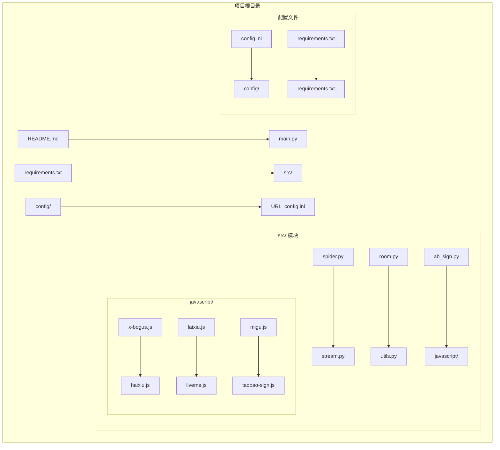
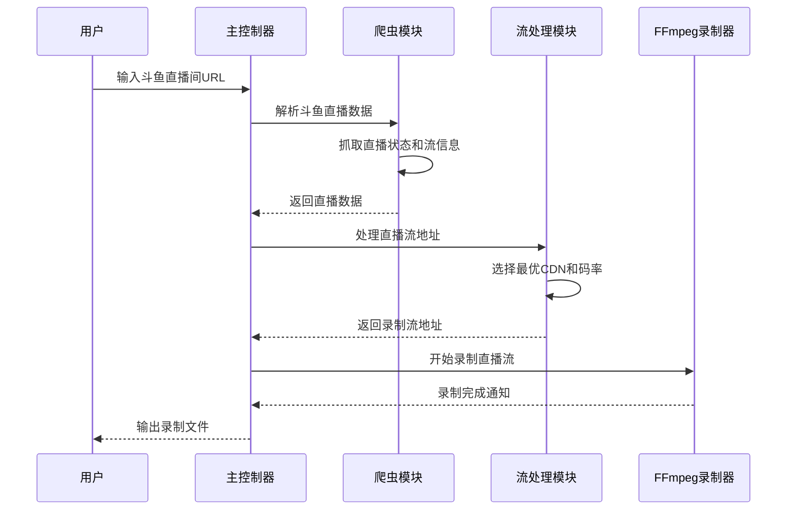
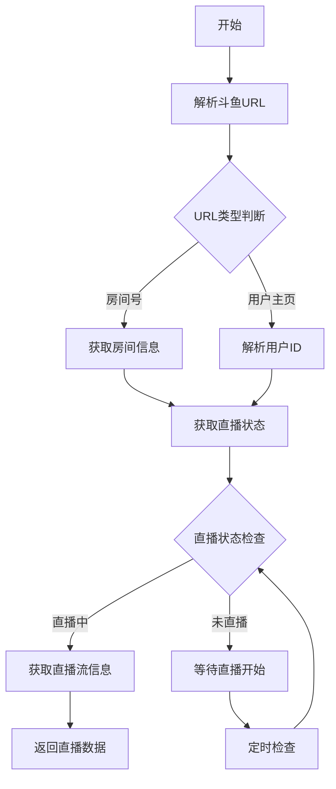
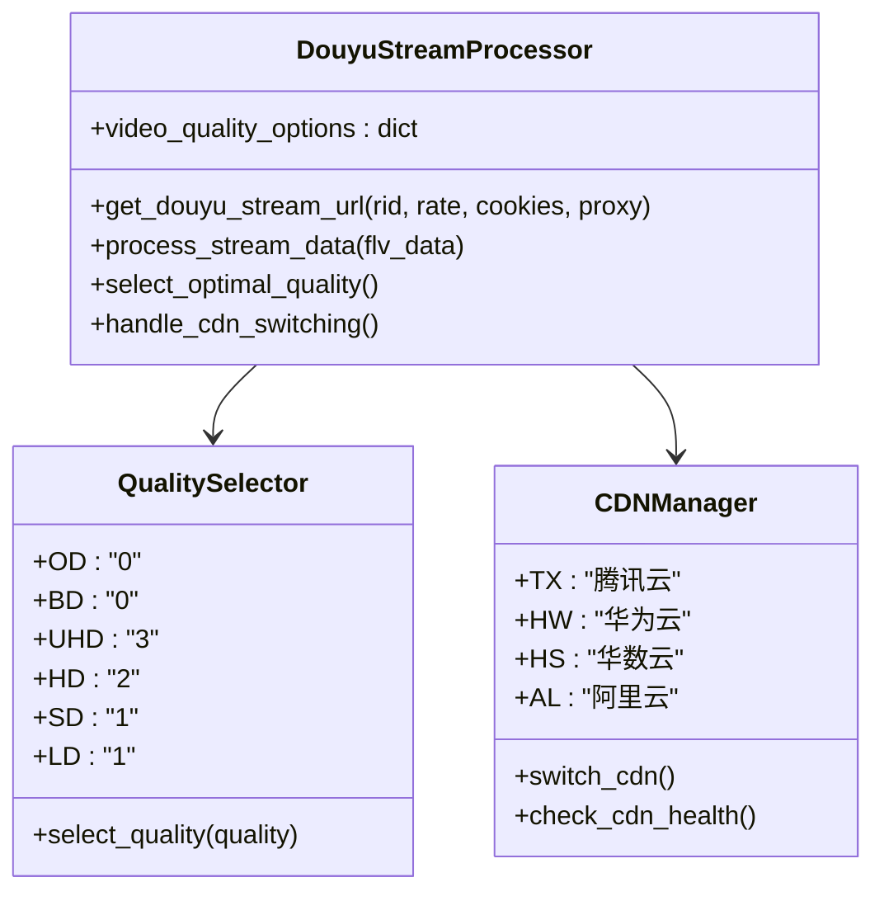
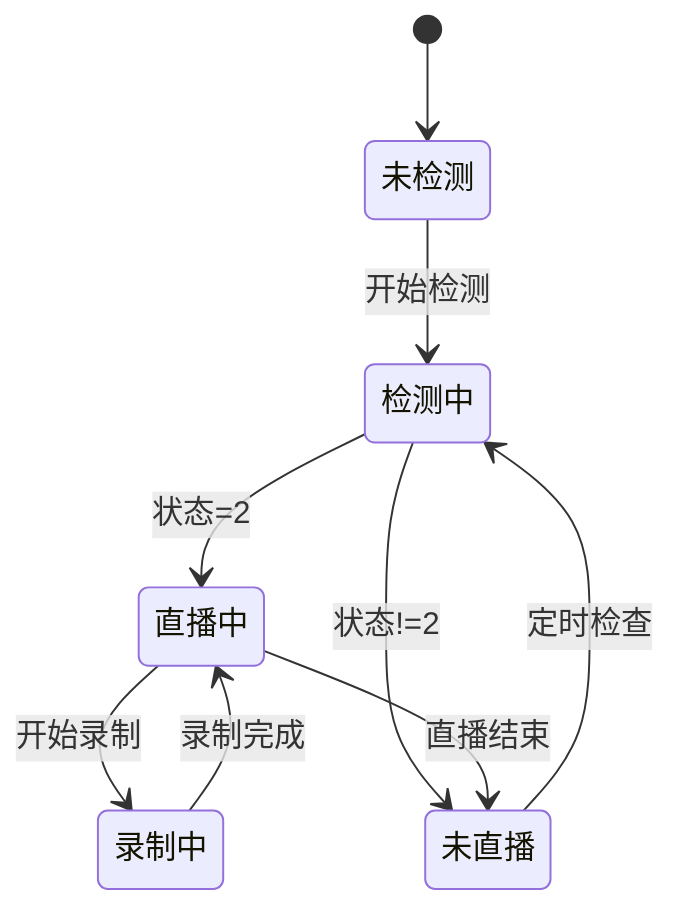
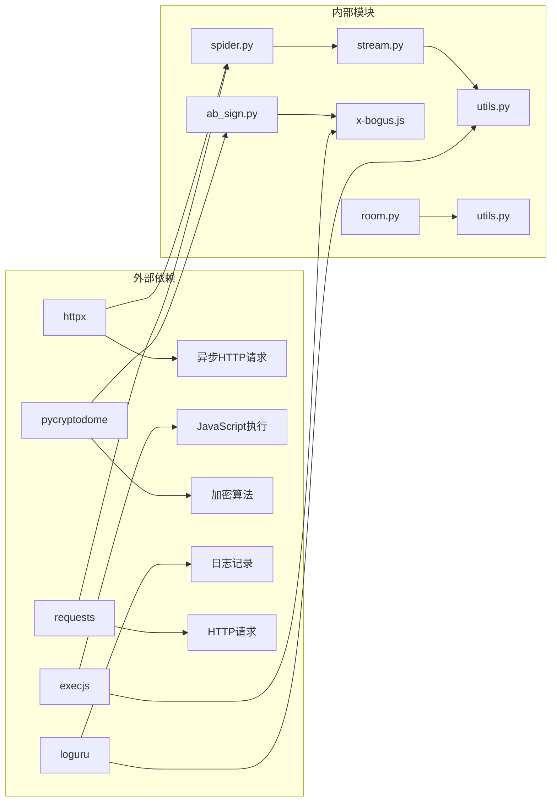

# 斗鱼平台

<cite>
**本文档引用的文件**
- [README.md](file://README.md)
- [main.py](file://main.py)
- [src/spider.py](file://src/spider.py)
- [src/stream.py](file://src/stream.py)
- [src/room.py](file://src/room.py)
- [src/ab_sign.py](file://src/ab_sign.py)
- [src/javascript/x-bogus.js](file://src/javascript/x-bogus.js)
- [src/javascript/haixiu.js](file://src/javascript/haixiu.js)
- [src/utils.py](file://src/utils.py)
- [requirements.txt](file://requirements.txt)
- [config/URL_config.ini](file://config/URL_config.ini)
</cite>

## 目录
1. [项目概述](#项目概述)
2. [项目结构](#项目结构)
3. [核心组件](#核心组件)
4. [架构概览](#架构概览)
5. [详细组件分析](#详细组件分析)
6. [依赖分析](#依赖分析)
7. [性能考虑](#性能考虑)
8. [故障排除指南](#故障排除指南)
9. [结论](#结论)

## 项目概述

DouyinLiveRecorder 是一个多功能的直播录制工具，支持超过40个直播平台，包括斗鱼直播。该项目采用Python开发，基于FFmpeg实现多平台直播源录制，支持自定义配置录制以及直播状态推送。

### 主要特性
- 支持40+直播平台的直播录制
- 异步并发请求处理
- 多种直播流格式支持（HLS、FLV、RTMP）
- 自动化直播状态检测
- 多种录制格式输出（TS、MP4、FLV）
- 智能画质选择和CDN节点切换

## 项目结构

**图表来源**
- [main.py:1-100](file://main.py#L1-L100)
- [src/spider.py:1-50](file://src/spider.py#L1-L50)
- [src/stream.py:1-50](file://src/stream.py#L1-L50)

**章节来源**
- [README.md:72-100](file://README.md#L72-L100)
- [main.py:1-100](file://main.py#L1-L100)

## 核心组件

### 1. 主控制器模块
- **功能**: 整个应用的入口点，负责调度各个平台的录制任务
- **特性**: 支持并发录制、错误处理、日志记录、配置管理

### 2. 爬虫模块 (Spider)
- **功能**: 负责从各个直播平台抓取直播数据和流地址
- **特性**: 支持多种解析策略、反爬虫机制应对、数据缓存

### 3. 流处理模块 (Stream)
- **功能**: 处理直播流地址，实现多码率选择和CDN切换
- **特性**: 智能流地址检测、备用流处理、质量自适应

### 4. 工具模块 (Utils)
- **功能**: 提供通用工具函数和辅助功能
- **特性**: 日志处理、配置管理、文件操作、代理处理

**章节来源**
- [main.py:545-641](file://main.py#L545-L641)
- [src/spider.py:68-141](file://src/spider.py#L68-L141)
- [src/stream.py:40-78](file://src/stream.py#L40-L78)

## 架构概览

**图表来源**
- [main.py:545-641](file://main.py#L545-L641)
- [src/spider.py:548-579](file://src/spider.py#L548-L579)
- [src/stream.py:302-325](file://src/stream.py#L302-L325)

## 详细组件分析

### 斗鱼直播数据获取实现

#### 1. 斗鱼信息获取流程

**图表来源**
- [src/spider.py:548-579](file://src/spider.py#L548-L579)
- [src/spider.py:582-586](file://src/spider.py#L582-L586)

#### 2. JavaScript逆向工程实现

项目实现了完整的JavaScript逆向工程来处理斗鱼的加密参数：

**X-Bogus算法实现**:
- 使用SM3哈希算法进行数据加密
- 实现RC4对称加密算法
- 生成随机字符串和时间戳
- 处理复杂的参数签名逻辑

**Token生成算法**:
- 解析HTML页面中的JavaScript代码
- 提取加密函数并编译执行
- 生成动态的访问令牌
- 处理MD5哈希验证

**章节来源**
- [src/spider.py:524-544](file://src/spider.py#L524-L544)
- [src/ab_sign.py:444-455](file://src/ab_sign.py#L444-L455)
- [src/javascript/x-bogus.js:500-564](file://src/javascript/x-bogus.js#L500-L564)

### 斗鱼直播流地址获取

#### 1. 多码率流选择机制

**图表来源**
- [src/stream.py:302-325](file://src/stream.py#L302-L325)
- [src/stream.py:307-314](file://src/stream.py#L307-L314)

#### 2. CDN节点切换策略

斗鱼平台采用多CDN节点部署，系统实现了智能切换机制：

**CDN优先级顺序**:
1. TX (腾讯云) - 优先选择，质量稳定
2. HW (华为云) - 备选方案
3. HS (华数云) - 备用节点
4. AL (阿里云) - 最终备选

**切换触发条件**:
- CDN节点响应超时
- 流地址访问失败
- 码率适配失败
- 网络质量检测不佳

**章节来源**
- [src/stream.py:302-325](file://src/stream.py#L302-L325)
- [src/spider.py:482-496](file://src/spider.py#L482-L496)

### 反爬虫机制应对

#### 1. 动态参数生成

项目实现了多种反爬虫对策：

**User-Agent轮换**:
- 支持多种浏览器User-Agent
- 动态生成随机User-Agent
- 避免固定模式识别

**Cookie管理**:
- 自动化Cookie获取和更新
- Cookie持久化存储
- Cookie失效检测和重置

**请求头伪装**:
- 动态Referer设置
- 随机延时机制
- 请求频率控制

#### 2. 加密参数处理

**a_bogus参数生成**:
- 基于X-Bogus算法的参数签名
- 实现完整的SM3哈希计算
- RC4加密算法集成
- 时间戳和随机数混合

**章节来源**
- [src/spider.py:68-141](file://src/spider.py#L68-L141)
- [src/ab_sign.py:293-455](file://src/ab_sign.py#L293-L455)

### 斗鱼直播状态检测

#### 1. 实时状态监控

**图表来源**
- [src/spider.py:548-579](file://src/spider.py#L548-L579)
- [src/spider.py:582-586](file://src/spider.py#L582-L586)

#### 2. 状态检测方法

**直播状态判断**:
- 检查房间状态字段
- 验证直播流可用性
- 监控直播流完整性
- 处理直播中断情况

**章节来源**
- [src/spider.py:548-579](file://src/spider.py#L548-L579)
- [src/spider.py:582-586](file://src/spider.py#L582-L586)

## 依赖分析

### 核心依赖关系

**图表来源**
- [requirements.txt:1-7](file://requirements.txt#L1-L7)
- [main.py:29-32](file://main.py#L29-L32)

### 关键依赖特性

**异步处理能力**:
- httpx库提供HTTP/2支持
- 并发请求处理大量直播源
- 异常处理和重试机制

**JavaScript执行环境**:
- PyExecJS提供Node.js环境
- 支持复杂的JavaScript加密算法
- 动态代码编译和执行

**加密安全**:
- pycryptodome提供高级加密功能
- SM3哈希算法实现
- RC4对称加密算法

**章节来源**
- [requirements.txt:1-7](file://requirements.txt#L1-L7)
- [src/utils.py:38-51](file://src/utils.py#L38-L51)

## 性能考虑

### 1. 并发处理优化

项目采用了多层次的并发处理策略：

**线程池管理**:
- 动态调整并发数量
- 错误率监控和自适应调节
- 资源使用优化

**请求队列管理**:
- 优先级队列处理
- 请求去重机制
- 超时处理和重试

### 2. 内存和磁盘优化

**内存使用优化**:
- 流式数据处理
- 缓冲区大小控制
- 及时释放资源

**磁盘I/O优化**:
- 分段录制减少单文件大小
- 磁盘空间监控
- 文件清理和归档

### 3. 网络性能优化

**连接复用**:
- HTTP/2协议支持
- 连接池管理
- CDN节点智能选择

**带宽管理**:
- 多码率自适应
- 网络质量检测
- 带宽限制和控制

## 故障排除指南

### 常见问题及解决方案

#### 1. 斗鱼直播无法获取数据

**问题症状**:
- 斗鱼直播数据获取失败
- 页面解析错误
- API调用异常

**解决步骤**:
1. 检查网络连接和代理设置
2. 验证User-Agent和Cookie有效性
3. 确认JavaScript环境正常
4. 查看日志文件获取详细错误信息

**章节来源**
- [src/utils.py:38-51](file://src/utils.py#L38-L51)
- [src/spider.py:68-141](file://src/spider.py#L68-L141)

#### 2. 录制质量异常

**问题症状**:
- 录制质量低于预期
- 视频卡顿或中断
- 音视频不同步

**解决步骤**:
1. 检查网络带宽和稳定性
2. 调整录制质量设置
3. 切换不同的CDN节点
4. 重启录制服务

#### 3. FFmpeg录制问题

**问题症状**:
- FFmpeg执行失败
- 录制文件损坏
- 格式转换错误

**解决步骤**:
1. 确认FFmpeg安装和路径正确
2. 检查输出目录权限
3. 验证录制格式支持
4. 查看FFmpeg详细输出

### 配置要求

#### 系统环境要求

**操作系统支持**:
- Windows 10/11 (推荐)
- Linux (Ubuntu 18.04+, CentOS 7+)
- macOS 10.15+

**硬件要求**:
- CPU: Intel i5-10400F 或同等AMD处理器
- 内存: 8GB RAM (推荐16GB)
- 存储: 至少50GB可用空间
- 网络: 10Mbps宽带连接

**软件依赖**:
- Python 3.10+
- FFmpeg 4.4+
- Node.js (用于JavaScript执行)

#### 网络环境准备

**代理配置**:
- 支持HTTP/HTTPS代理
- SOCKS5代理支持
- 代理轮换机制

**防火墙设置**:
- 允许Python进程网络访问
- FFmpeg网络权限
- JavaScript执行环境

**章节来源**
- [README.md:289-431](file://README.md#L289-L431)
- [requirements.txt:1-7](file://requirements.txt#L1-L7)

## 结论

DouyinLiveRecorder项目展现了现代直播录制系统的完整技术实现。通过对斗鱼平台的深入分析，我们可以看到项目在以下几个方面的优秀设计：

### 技术亮点

1. **完整的逆向工程实现**: 成功破解了斗鱼的JavaScript加密算法，实现了a_bogus参数的自动生成

2. **智能流处理机制**: 实现了多码率选择、CDN节点切换和备用流处理的完整方案

3. **强大的反爬虫能力**: 通过User-Agent轮换、Cookie管理和动态参数生成有效应对平台反爬虫机制

4. **高效的并发处理**: 采用异步编程和线程池管理，实现了高并发的直播录制能力

### 应用价值

该项目不仅为个人用户提供便捷的直播录制工具，也为开发者提供了研究直播平台技术实现的宝贵案例。其模块化的架构设计、完善的错误处理机制和灵活的配置选项，使其成为直播录制领域的优秀开源项目。

### 发展前景

随着直播行业的快速发展和技术的不断演进，该项目将继续完善和优化，为用户提供更好的直播录制体验。同时，其开源特性也鼓励社区参与，共同推动直播录制技术的发展。