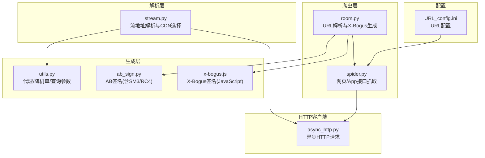
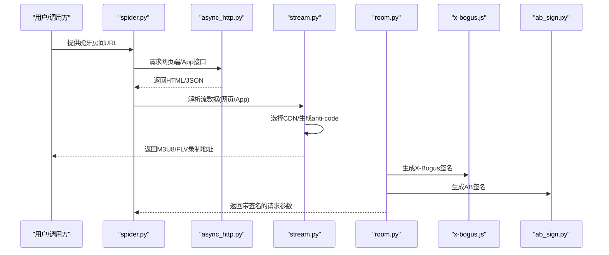
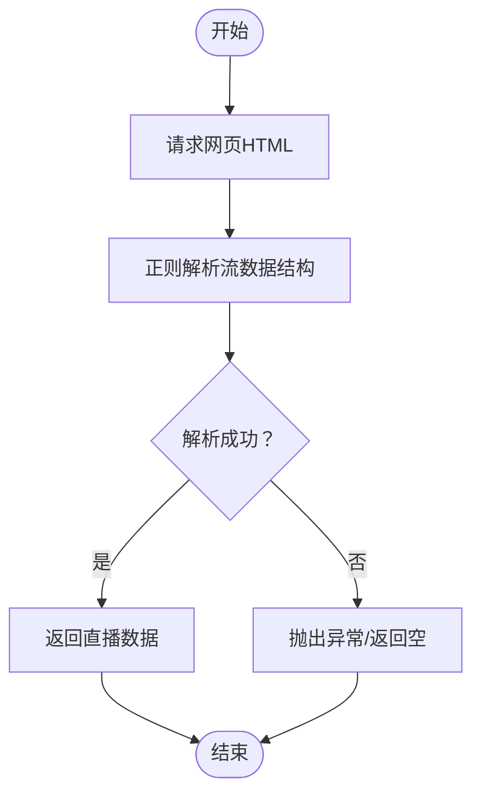
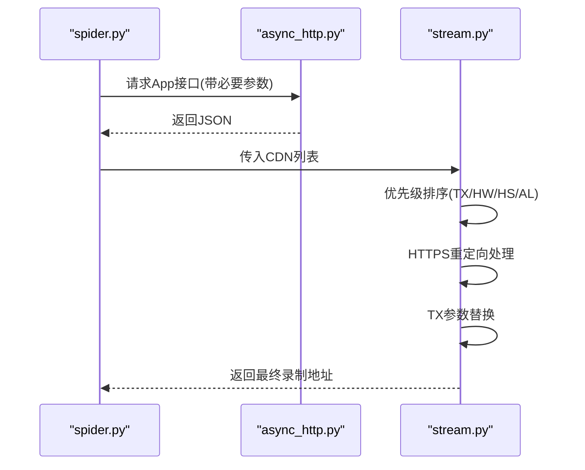
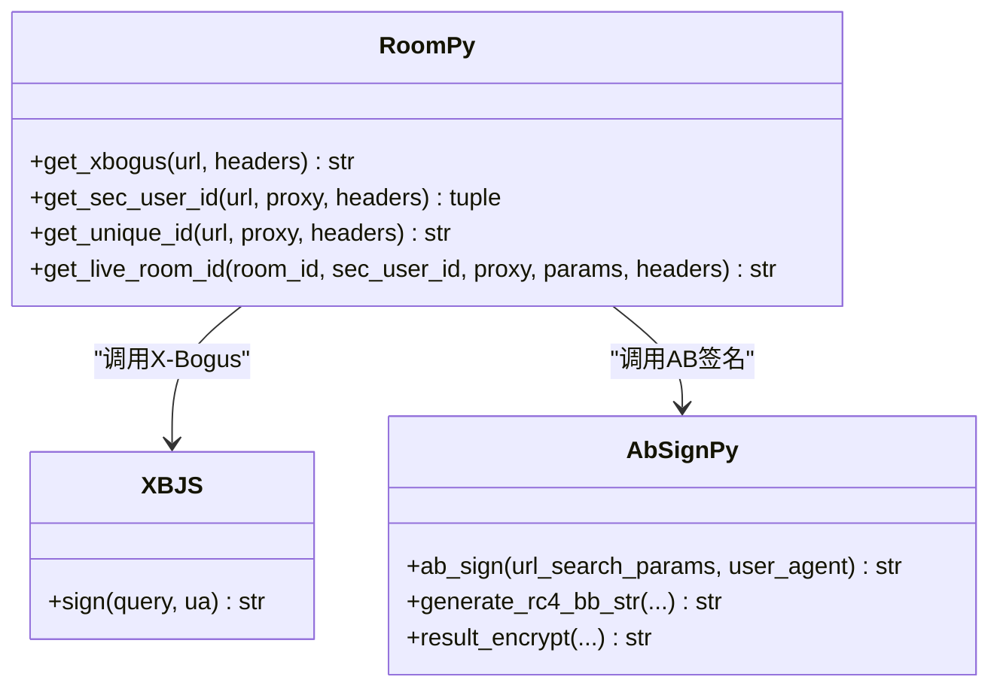
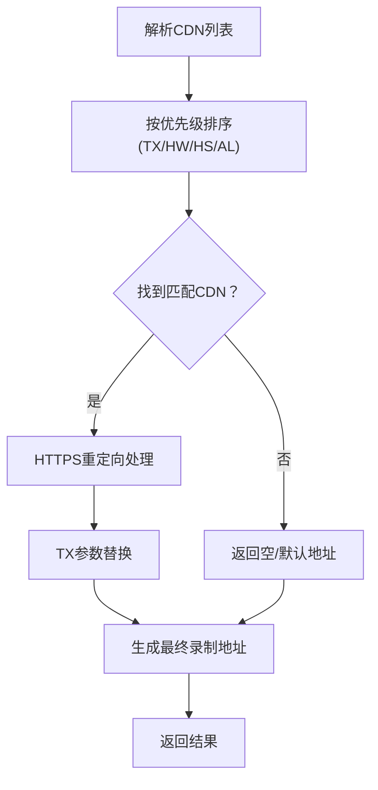
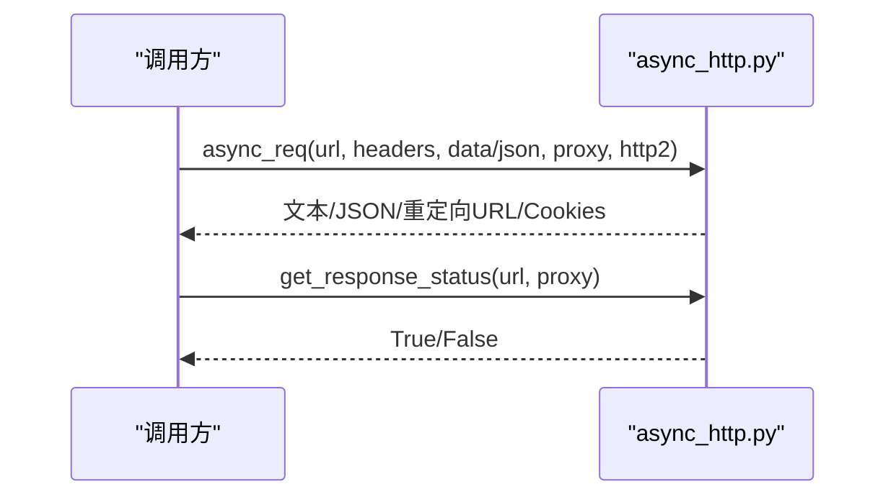
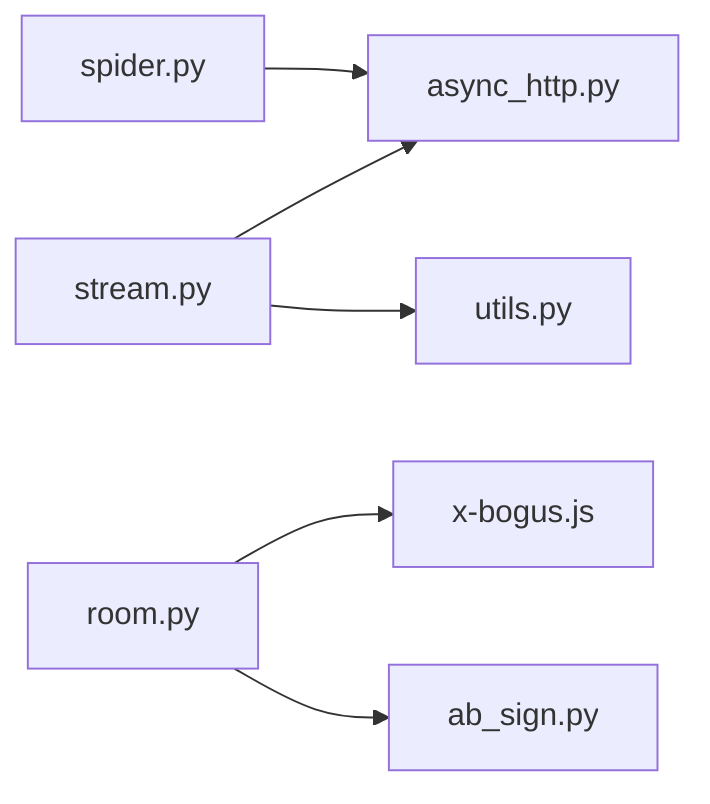

# 虎牙平台

<cite>
**本文引用的文件**
- [README.md](file://README.md)
- [spider.py](file://src/spider.py)
- [stream.py](file://src/stream.py)
- [room.py](file://src/room.py)
- [async_http.py](file://src/http_clients/async_http.py)
- [x-bogus.js](file://src/javascript/x-bogus.js)
- [ab_sign.py](file://src/ab_sign.py)
- [utils.py](file://src/utils.py)
- [URL_config.ini](file://config/URL_config.ini)
</cite>

## 目录
1. [简介](#简介)
2. [项目结构](#项目结构)
3. [核心组件](#核心组件)
4. [架构总览](#架构总览)
5. [详细组件分析](#详细组件分析)
6. [依赖分析](#依赖分析)
7. [性能考量](#性能考量)
8. [故障排查指南](#故障排查指南)
9. [结论](#结论)
10. [附录](#附录)

## 简介
本文件面向“虎牙直播”平台的技术实现，系统梳理该项目在获取直播数据、解析网页端与App接口、生成反爬虫参数与Token、选择CDN节点、处理M3U8与FLV流地址、以及Cookie与User-Agent配置等方面的具体实现。文档同时给出流程图、类图与序列图，帮助读者快速理解代码结构与运行机制。

## 项目结构
项目采用模块化设计，围绕“抓取-解析-生成-录制”的链路组织代码：
- 爬虫层：负责从网页与App接口抓取直播数据
- 解析层：负责解析JSON/HTML，抽取流地址与质量信息
- 生成层：负责生成反爬虫参数、Token与签名
- HTTP客户端：统一处理异步请求、代理、证书与响应状态
- 工具层：提供通用工具函数与配置读取

图表来源
- [spider.py](file://src/spider.py)
- [stream.py](file://src/stream.py)
- [room.py](file://src/room.py)
- [async_http.py](file://src/http_clients/async_http.py)
- [x-bogus.js](file://src/javascript/x-bogus.js)
- [ab_sign.py](file://src/ab_sign.py)
- [utils.py](file://src/utils.py)
- [URL_config.ini](file://config/URL_config.ini)

章节来源
- [README.md](file://README.md)
- [spider.py](file://src/spider.py)
- [stream.py](file://src/stream.py)
- [room.py](file://src/room.py)
- [async_http.py](file://src/http_clients/async_http.py)
- [x-bogus.js](file://src/javascript/x-bogus.js)
- [ab_sign.py](file://src/ab_sign.py)
- [utils.py](file://src/utils.py)
- [URL_config.ini](file://config/URL_config.ini)

## 核心组件
- 网页端数据抓取：解析网页HTML中的流数据结构，抽取Huya直播的流信息
- App接口抓取：通过App接口获取更稳定的流地址与CDN列表
- 反爬虫参数生成：X-Bogus与AB签名算法，用于生成合法的请求参数
- CDN节点选择：按优先级选择最优CDN，处理HTTPS重定向与特定CDN的参数替换
- 流地址处理：支持M3U8与FLV两种格式，处理质量选择与有效性校验
- Cookie与User-Agent：提供默认配置，支持外部传入覆盖

章节来源
- [spider.py](file://src/spider.py)
- [stream.py](file://src/stream.py)
- [room.py](file://src/room.py)
- [ab_sign.py](file://src/ab_sign.py)
- [x-bogus.js](file://src/javascript/x-bogus.js)
- [async_http.py](file://src/http_clients/async_http.py)

## 架构总览
下图展示虎牙平台从URL到最终录制地址的端到端流程：

图表来源
- [spider.py](file://src/spider.py)
- [stream.py](file://src/stream.py)
- [room.py](file://src/room.py)
- [async_http.py](file://src/http_clients/async_http.py)
- [x-bogus.js](file://src/javascript/x-bogus.js)
- [ab_sign.py](file://src/ab_sign.py)

## 详细组件分析

### 组件A：网页端数据抓取（虎牙）
- 功能：从虎牙网页解析直播流数据，抽取游戏直播信息与流列表
- 关键点：
  - 使用正则匹配网页中的流数据结构
  - 返回包含直播标题、主播昵称、流信息列表的数据结构
- 适用场景：当App接口不可用或需要备用方案时

图表来源
- [spider.py](file://src/spider.py)

章节来源
- [spider.py](file://src/spider.py)

### 组件B：App接口抓取（虎牙）
- 功能：通过App接口获取直播流信息与CDN列表，支持优先CDN选择与HTTPS重定向处理
- 关键点：
  - 从App接口返回的CDN列表中，按优先级选择CDN
  - 对TX（腾讯云）CDN进行特定参数替换，提升兼容性
  - 统一将FLV地址转换为HTTPS协议
- 输出：包含主播名、直播状态、标题、M3U8/FLV原始地址与最终录制地址

图表来源
- [spider.py](file://src/spider.py)
- [stream.py](file://src/stream.py)
- [async_http.py](file://src/http_clients/async_http.py)

章节来源
- [spider.py](file://src/spider.py)
- [stream.py](file://src/stream.py)

### 组件C：反爬虫参数生成（X-Bogus与AB签名）
- X-Bogus（网页端）：
  - 通过加载x-bogus.js脚本，调用sign函数生成X-Bogus参数
  - 依赖User-Agent与查询参数
- AB签名（App端）：
  - 使用SM3哈希、RC4加密与自定义Base64编码表生成签名
  - 包含时间戳、窗口环境、随机字符串等要素
- 作用：绕过虎牙服务端的参数校验与风控

图表来源
- [room.py](file://src/room.py)
- [ab_sign.py](file://src/ab_sign.py)
- [x-bogus.js](file://src/javascript/x-bogus.js)

章节来源
- [room.py](file://src/room.py)
- [ab_sign.py](file://src/ab_sign.py)
- [x-bogus.js](file://src/javascript/x-bogus.js)

### 组件D：流地址解析与CDN选择（虎牙）
- 功能：从解析到的流数据中生成M3U8与FLV地址，按质量与CDN优先级选择最优流
- 关键点：
  - 从anti-code中解析wsSecret、wsTime、seqid等参数，拼接新的anti-code
  - 支持按质量选择（UHD/HD/SD/LD），并进行有效性校验
  - 对TX CDN进行参数替换，确保HTTPS访问
- 输出：包含标题、主播名、质量、M3U8/FLV地址与最终录制地址

图表来源
- [stream.py](file://src/stream.py)

章节来源
- [stream.py](file://src/stream.py)

### 组件E：HTTP客户端与代理处理
- 功能：统一处理GET/POST请求、代理、超时、HTTP/2开关、证书校验与响应状态检查
- 关键点：
  - 自动处理代理地址格式
  - 支持返回Cookies、重定向URL、文本内容等
  - 提供HEAD请求用于快速校验URL有效性

图表来源
- [async_http.py](file://src/http_clients/async_http.py)

章节来源
- [async_http.py](file://src/http_clients/async_http.py)

## 依赖分析
- 模块耦合：
  - spider.py依赖async_http.py进行网络请求
  - stream.py依赖async_http.py进行URL有效性校验
  - room.py依赖x-bogus.js与ab_sign.py生成签名
- 外部依赖：
  - JavaScript执行环境（Node.js）用于X-Bogus签名
  - httpx异步HTTP库
  - execjs用于执行JavaScript代码

图表来源
- [spider.py](file://src/spider.py)
- [stream.py](file://src/stream.py)
- [room.py](file://src/room.py)
- [async_http.py](file://src/http_clients/async_http.py)
- [x-bogus.js](file://src/javascript/x-bogus.js)
- [ab_sign.py](file://src/ab_sign.py)
- [utils.py](file://src/utils.py)

章节来源
- [spider.py](file://src/spider.py)
- [stream.py](file://src/stream.py)
- [room.py](file://src/room.py)
- [async_http.py](file://src/http_clients/async_http.py)
- [x-bogus.js](file://src/javascript/x-bogus.js)
- [ab_sign.py](file://src/ab_sign.py)
- [utils.py](file://src/utils.py)

## 性能考量
- 异步请求：使用httpx异步客户端减少阻塞，提高并发效率
- 代理与HTTP/2：可配置代理与HTTP/2开关，优化网络性能
- CDN优先级：按CDN类型优先选择，减少失败重试
- URL有效性校验：在质量回退时使用HEAD请求快速判断URL可用性

章节来源
- [async_http.py](file://src/http_clients/async_http.py)
- [stream.py](file://src/stream.py)
- [spider.py](file://src/spider.py)

## 故障排查指南
- 网络与代理
  - 确认代理地址格式正确（自动补全http://）
  - 检查代理可用性与目标站点可达性
- JavaScript执行
  - X-Bogus签名依赖Node.js环境，若执行失败请检查Node.js安装与环境变量
- Cookie与User-Agent
  - 网页端与App接口可能需要不同的Cookie与User-Agent
  - 可通过参数传入自定义Cookie与User-Agent
- URL有效性
  - 使用get_response_status进行HEAD请求校验，定位无效流地址
- 日志与错误
  - 使用装饰器捕获异常并记录错误行号，便于定位问题

章节来源
- [utils.py](file://src/utils.py)
- [async_http.py](file://src/http_clients/async_http.py)
- [room.py](file://src/room.py)

## 结论
本项目对虎牙平台实现了较为完整的数据抓取与流地址解析能力，涵盖网页端与App接口、反爬虫参数生成、CDN节点选择与HTTPS重定向处理。通过模块化设计与异步HTTP客户端，具备良好的可维护性与扩展性。建议在生产环境中结合代理池、合理的重试策略与日志监控，进一步提升稳定性与鲁棒性。

## 附录

### 虎牙平台Cookie配置与User-Agent设置
- 网页端默认User-Agent与Cookie已在代码中内置，可按需传入自定义值
- App接口同样提供默认User-Agent与Cookie，支持外部覆盖
- 建议在部署时通过配置文件或环境变量注入Cookie与User-Agent

章节来源
- [spider.py](file://src/spider.py)

### 虎牙平台特有的数据结构解析
- 网页端：从HTML中解析出包含流数据的JSON片段，抽取直播标题、主播昵称与流信息列表
- App接口：返回CDN列表，包含CDN类型、HLS/FLV基础URL、anti-code等字段

章节来源
- [spider.py](file://src/spider.py)

### 流地址有效性验证与CDN节点可用性检测
- 使用HEAD请求快速检测URL有效性
- 对TX CDN进行参数替换与HTTPS重定向，提升可用性
- 当首选CDN不可用时，按优先级顺序选择备选CDN

章节来源
- [stream.py](file://src/stream.py)
- [async_http.py](file://src/http_clients/async_http.py)