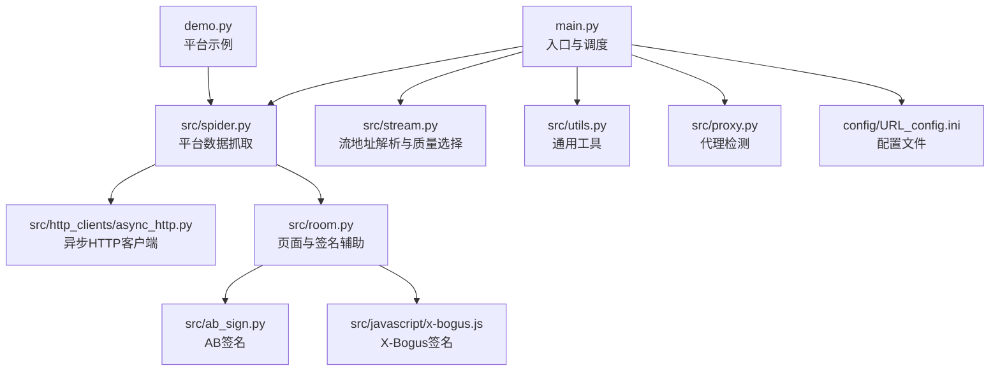
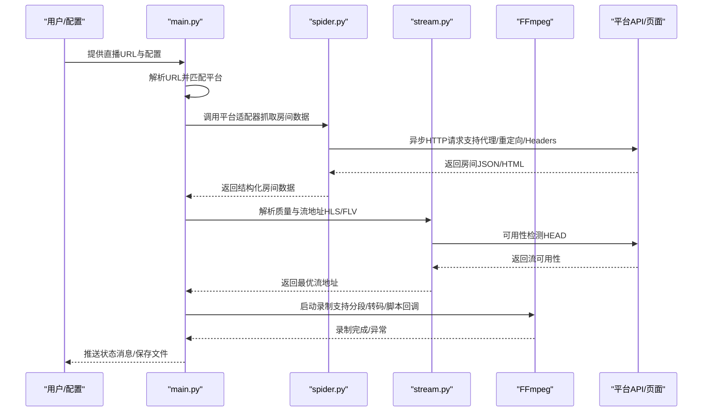
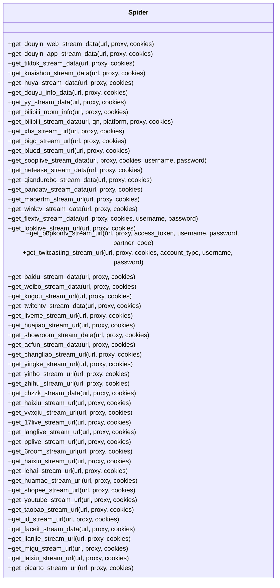
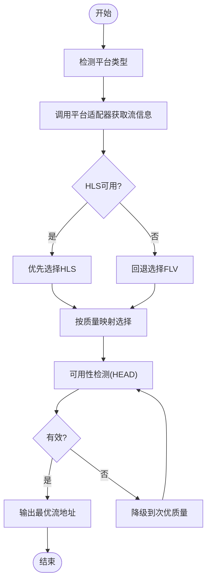
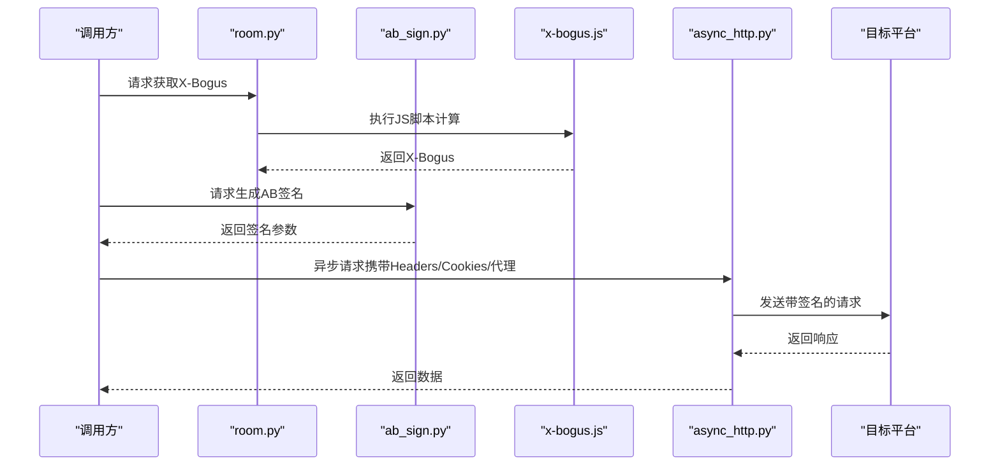
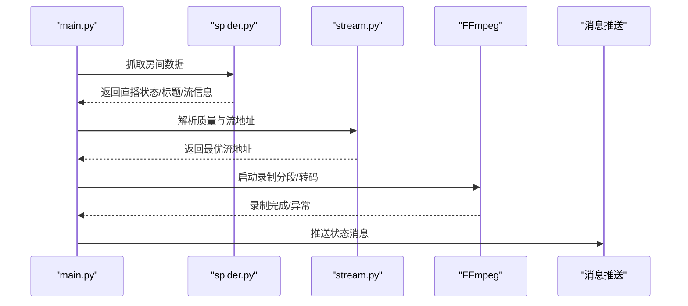
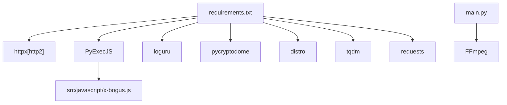

# 多平台支持

<cite>
**本文引用的文件**
- [README.md](file://README.md)
- [main.py](file://main.py)
- [src/spider.py](file://src/spider.py)
- [src/stream.py](file://src/stream.py)
- [src/room.py](file://src/room.py)
- [src/utils.py](file://src/utils.py)
- [src/ab_sign.py](file://src/ab_sign.py)
- [src/javascript/x-bogus.js](file://src/javascript/x-bogus.js)
- [src/http_clients/async_http.py](file://src/http_clients/async_http.py)
- [src/proxy.py](file://src/proxy.py)
- [requirements.txt](file://requirements.txt)
- [config/URL_config.ini](file://config/URL_config.ini)
- [demo.py](file://demo.py)
</cite>

## 目录
1. [简介](#简介)
2. [项目结构](#项目结构)
3. [核心组件](#核心组件)
4. [架构总览](#架构总览)
5. [详细组件分析](#详细组件分析)
6. [依赖关系分析](#依赖关系分析)
7. [性能考量](#性能考量)
8. [故障排除指南](#故障排除指南)
9. [结论](#结论)
10. [附录](#附录)

## 简介
本项目是一个多平台直播录制工具，支持国内外数百个直播平台，基于FFmpeg实现多平台直播源录制，具备直播状态推送、自定义配置录制、异步并发抓取、反爬虫对抗与质量选择等能力。项目采用模块化设计，通过“平台适配器”模式抽象各平台的差异化API与数据解析逻辑，统一调度与录制流程。

## 项目结构
项目采用按职责分层的组织方式：
- 核心入口与调度：main.py
- 平台数据抓取：src/spider.py（异步HTTP客户端封装在src/http_clients/async_http.py）
- 流地址解析与质量选择：src/stream.py
- 页面与签名辅助：src/room.py、src/ab_sign.py、src/javascript/x-bogus.js
- 工具与配置：src/utils.py、config/URL_config.ini、requirements.txt
- 示例与演示：demo.py
- 代理检测：src/proxy.py

图表来源
- [main.py:1-200](file://main.py#L1-L200)
- [src/spider.py:1-120](file://src/spider.py#L1-L120)
- [src/stream.py:1-120](file://src/stream.py#L1-L120)
- [src/room.py:1-120](file://src/room.py#L1-L120)
- [src/ab_sign.py:1-120](file://src/ab_sign.py#L1-L120)
- [src/javascript/x-bogus.js:1-120](file://src/javascript/x-bogus.js#L1-L120)
- [src/http_clients/async_http.py:1-60](file://src/http_clients/async_http.py#L1-L60)
- [src/proxy.py:1-93](file://src/proxy.py#L1-L93)
- [config/URL_config.ini:1-5](file://config/URL_config.ini#L1-L5)
- [demo.py:1-120](file://demo.py#L1-L120)

章节来源
- [README.md:72-120](file://README.md#L72-L120)
- [main.py:1-200](file://main.py#L1-L200)

## 核心组件
- 平台适配器（Spider）：负责从各平台抓取直播房间信息、解析直播状态与流地址，统一返回结构化的数据。
- 流解析器（Stream）：根据平台特性选择最优流地址（HLS/FLV），并进行质量选择与可用性检测。
- 异步HTTP客户端：封装httpx异步请求，支持代理、重定向、Cookies、HTTP/2等。
- 签名与反爬：提供AB签名、X-Bogus签名等算法，配合Node.js执行JS脚本。
- 录制调度：统一调度录制流程，支持分段录制、转码、脚本回调、消息推送等。
- 代理检测：跨平台检测系统代理配置，便于海外平台录制。

章节来源
- [src/spider.py:1-120](file://src/spider.py#L1-L120)
- [src/stream.py:1-120](file://src/stream.py#L1-L120)
- [src/http_clients/async_http.py:1-60](file://src/http_clients/async_http.py#L1-L60)
- [src/room.py:1-120](file://src/room.py#L1-L120)
- [src/ab_sign.py:1-120](file://src/ab_sign.py#L1-L120)
- [src/javascript/x-bogus.js:1-120](file://src/javascript/x-bogus.js#L1-L120)
- [src/proxy.py:1-93](file://src/proxy.py#L1-L93)
- [main.py:1-200](file://main.py#L1-L200)

## 架构总览
整体架构遵循“平台适配器 + 统一调度”的模式：
- 平台适配器：针对不同平台实现独立的数据抓取与解析逻辑，统一输出结构化数据。
- 统一调度：根据URL匹配平台类型，调用对应的适配器，解析质量与流地址，启动FFmpeg录制。
- 反爬虫：通过签名算法、User-Agent、Referer、Cookie等手段降低风控概率。
- 性能与稳定性：异步并发、动态请求窗口、错误率自适应调整、可用性检测与降级。

图表来源
- [main.py:545-790](file://main.py#L545-L790)
- [src/spider.py:68-142](file://src/spider.py#L68-L142)
- [src/stream.py:40-154](file://src/stream.py#L40-L154)
- [src/http_clients/async_http.py:10-47](file://src/http_clients/async_http.py#L10-L47)

章节来源
- [main.py:545-790](file://main.py#L545-L790)
- [src/spider.py:68-142](file://src/spider.py#L68-L142)
- [src/stream.py:40-154](file://src/stream.py#L40-L154)

## 详细组件分析

### 平台适配器设计模式
- 设计思想：每种平台实现独立的抓取函数，统一返回结构化的房间数据（含直播状态、标题、流地址等），由统一调度器进行后续处理。
- 关键点：
  - URL匹配与平台识别：通过URL特征判断平台类型。
  - 异步HTTP请求：统一使用async_http封装，支持代理、重定向、Cookies、HTTP/2。
  - 数据解析：从HTML或API响应中抽取直播状态、标题、流地址列表等。
  - 错误处理：统一装饰器捕获异常并记录日志。

图表来源
- [src/spider.py:68-800](file://src/spider.py#L68-L800)

章节来源
- [src/spider.py:68-800](file://src/spider.py#L68-L800)

### 流地址获取与质量选择
- 质量映射：将“原画/蓝光/超清/高清/标清/流畅”映射为内部质量索引。
- 流选择策略：
  - 优先选择HLS（m3u8），若HLS不可用则回退FLV。
  - 对于部分平台（如抖音/快手），当HLS为h265时强制回退FLV。
  - 对于虎牙等平台，提供CDN优先级与抗反爬参数拼接。
- 可用性检测：通过HEAD请求检测流地址有效性，失败时自动降级到次优质量。

图表来源
- [src/stream.py:29-154](file://src/stream.py#L29-L154)

章节来源
- [src/stream.py:29-154](file://src/stream.py#L29-L154)

### 反爬虫与签名机制
- AB签名：用于抖音/快手等平台的参数签名，生成a_bogus或类似参数。
- X-Bogus：用于抖音Web端的查询串签名，通过Node.js执行JS脚本计算。
- Cookie与Headers：针对不同平台设置Referer、Origin、User-Agent、Cookie等，降低风控概率。
- 代理支持：统一代理地址处理，支持海外平台录制。

图表来源
- [src/room.py:42-48](file://src/room.py#L42-L48)
- [src/ab_sign.py:444-455](file://src/ab_sign.py#L444-L455)
- [src/javascript/x-bogus.js:500-564](file://src/javascript/x-bogus.js#L500-L564)
- [src/http_clients/async_http.py:10-47](file://src/http_clients/async_http.py#L10-L47)

章节来源
- [src/room.py:42-48](file://src/room.py#L42-L48)
- [src/ab_sign.py:444-455](file://src/ab_sign.py#L444-L455)
- [src/javascript/x-bogus.js:500-564](file://src/javascript/x-bogus.js#L500-L564)
- [src/http_clients/async_http.py:10-47](file://src/http_clients/async_http.py#L10-L47)

### 直播状态检测与录制流程
- 直播状态检测：通过平台适配器返回的直播状态字段判断是否在直播。
- 录制流程：选择最优流地址，启动FFmpeg录制；支持分段录制、转码、生成时间文件、脚本回调、消息推送。
- 动态请求窗口：根据错误率动态调整并发请求数量，提升稳定性。

图表来源
- [main.py:545-790](file://main.py#L545-L790)
- [src/spider.py:68-142](file://src/spider.py#L68-L142)
- [src/stream.py:40-154](file://src/stream.py#L40-L154)

章节来源
- [main.py:545-790](file://main.py#L545-L790)

### 平台差异与适配要点
- 国内平台（抖音、快手、虎牙、斗鱼、B站、YY、小红书、Bigo、Blued、网易CC、千度热播、猫耳FM、Look直播、TwitCasting、百度、微博、酷狗、花椒、流星、Acfun、畅聊、映客、音播、知乎、嗨秀、VV星球、17Live、浪Live、飘飘、六间房、乐嗨、花猫、淘宝、京东、咪咕、连接、来秀）：
  - 主要差异在于房间信息获取方式（Web/App）、流地址格式（HLS/FLV）、质量映射与CDN参数。
  - 部分平台需要Cookie或登录态，支持自动登录与Cookie持久化。
- 海外平台（TikTok、SOOP、PandaTV、WinkTV、FlexTV、PopkonTV、TwitchTV、LiveMe、ShowRoom、CHZZK、Shopee、Youtube、Faceit、Picarto）：
  - 需要代理支持，部分平台存在区域限制，需切换节点。
  - 部分平台支持账号密码登录，自动获取并更新Cookie。

章节来源
- [README.md:15-68](file://README.md#L15-L68)
- [src/spider.py:68-800](file://src/spider.py#L68-L800)
- [src/stream.py:156-446](file://src/stream.py#L156-L446)

### 新平台接入指南
- 步骤概览：
  1. 在URL配置文件中添加待接入平台的直播链接。
  2. 在spider.py中新增平台抓取函数，返回标准化房间数据。
  3. 在stream.py中新增平台流解析函数，处理质量选择与可用性检测。
  4. 在main.py的URL匹配逻辑中加入平台识别与调用。
  5. 如需签名或反爬，补充ab_sign或x-bogus逻辑。
  6. 配置代理与Cookie（如适用），并在适配器中传入。
  7. 编写单元测试或使用demo.py验证。
- 注意事项：
  - 统一返回结构（直播状态、标题、质量、流地址等）。
  - 支持HLS优先、FLV回退、可用性检测与降级。
  - 遵循异步HTTP封装规范，支持代理与重定向。
  - 记录日志与异常处理，便于定位问题。

章节来源
- [demo.py:213-228](file://demo.py#L213-L228)
- [src/spider.py:68-142](file://src/spider.py#L68-L142)
- [src/stream.py:40-154](file://src/stream.py#L40-L154)
- [main.py:545-790](file://main.py#L545-L790)

## 依赖关系分析
- 第三方依赖：requests、httpx[http2]、loguru、pycryptodome、distro、tqdm、PyExecJS。
- Node.js执行：通过PyExecJS调用JavaScript脚本（如x-bogus.js）进行签名计算。
- FFmpeg：用于录制与转码，支持分段与格式转换。

图表来源
- [requirements.txt:1-7](file://requirements.txt#L1-L7)
- [src/javascript/x-bogus.js:500-564](file://src/javascript/x-bogus.js#L500-L564)
- [main.py:189-271](file://main.py#L189-L271)

章节来源
- [requirements.txt:1-7](file://requirements.txt#L1-L7)

## 性能考量
- 异步并发：使用httpx异步请求，减少IO等待，提升抓取效率。
- 动态请求窗口：根据错误率动态调整并发数，避免触发风控或资源耗尽。
- 流地址可用性检测：在选择质量前先HEAD探测，避免无效流导致录制失败。
- 分段录制与转码：支持按时间分段与转码，兼顾存储与兼容性。
- 代理与区域：海外平台需代理，合理配置代理池与节点切换策略。

章节来源
- [src/http_clients/async_http.py:10-60](file://src/http_clients/async_http.py#L10-L60)
- [main.py:298-325](file://main.py#L298-L325)
- [src/stream.py:65-137](file://src/stream.py#L65-L137)

## 故障排除指南
- 常见问题与解决：
  - 网络异常/风控：检查代理配置与节点可用性；适当降低并发；启用HTTP/2与合理的User-Agent。
  - Cookie失效：部分平台需登录态，更新Cookie或启用自动登录流程。
  - 海外平台无法访问：确认代理可用，必要时切换节点；部分平台存在区域限制。
  - FFmpeg问题：确认FFmpeg安装与路径；检查转码参数与分段设置。
  - 日志定位：使用日志记录与异常捕获，结合trace_error装饰器定位问题。
- 建议操作：
  - 逐步缩小问题范围：先验证URL与平台适配器，再检查流解析与录制。
  - 使用demo.py快速验证单平台抓取与解析。
  - 检查URL配置文件格式与注释符号。

章节来源
- [src/utils.py:38-52](file://src/utils.py#L38-L52)
- [src/http_clients/async_http.py:49-60](file://src/http_clients/async_http.py#L49-L60)
- [demo.py:213-228](file://demo.py#L213-L228)

## 结论
本项目通过“平台适配器 + 统一调度”的架构，实现了对数百个直播平台的稳定支持。其核心优势在于：
- 模块化设计与统一接口，便于新平台接入与维护。
- 强大的反爬虫与签名机制，保障长期可用性。
- 异步并发与动态窗口控制，提升稳定性与性能。
- 完善的录制与转码能力，满足多样化需求。

建议在新平台接入时严格遵循统一接口与异常处理规范，确保整体系统的稳定性与可维护性。

## 附录
- 平台列表（节选）：抖音、TikTok、快手、虎牙、斗鱼、YY、B站、小红书、Bigo、Blued、网易CC、千度热播、猫耳FM、Look直播、TwitCasting、百度、微博、酷狗、花椒、流星、Acfun、畅聊、映客、音播、知乎、嗨秀、VV星球、17Live、浪Live、飘飘、六间房、乐嗨、花猫、淘宝、京东、咪咕、连接、来秀、SOOP、PandaTV、WinkTV、FlexTV、PopkonTV、TwitchTV、LiveMe、ShowRoom、CHZZK、Shopee、Youtube、Faceit、Picarto。
- 配置文件：config/URL_config.ini，支持批量URL与注释停用。
- 示例脚本：demo.py，提供各平台抓取示例与测试入口。

章节来源
- [README.md:15-68](file://README.md#L15-L68)
- [config/URL_config.ini:1-5](file://config/URL_config.ini#L1-L5)
- [demo.py:1-228](file://demo.py#L1-L228)