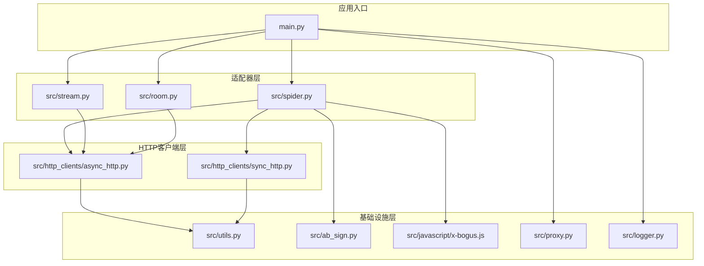
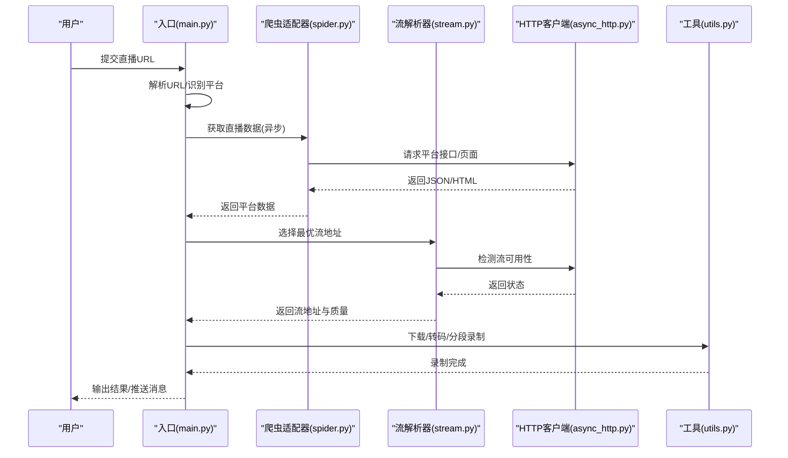
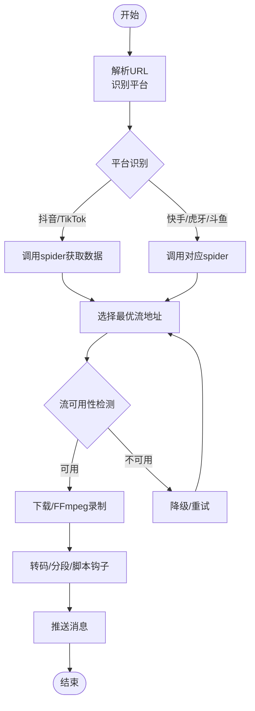
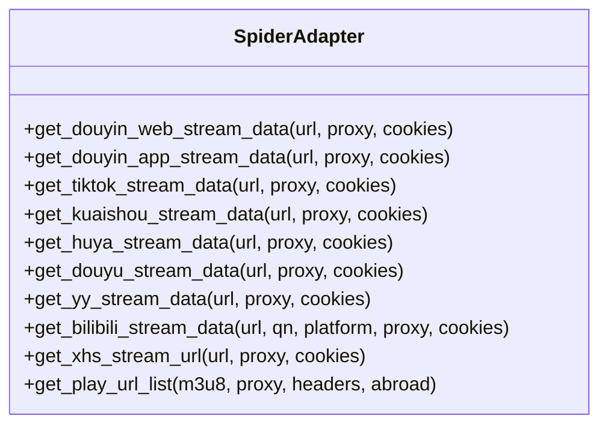
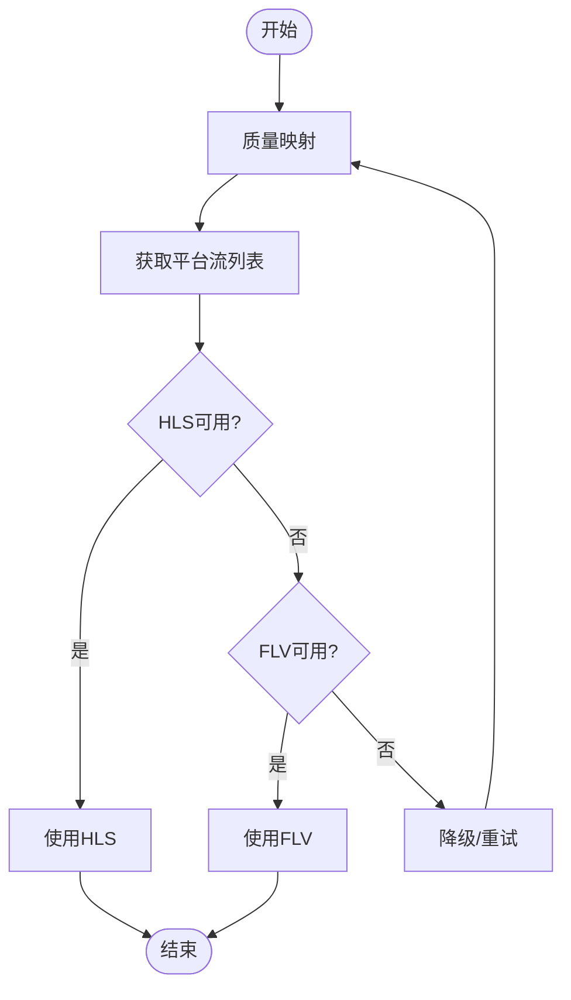
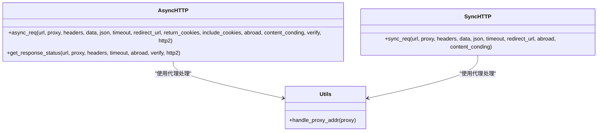
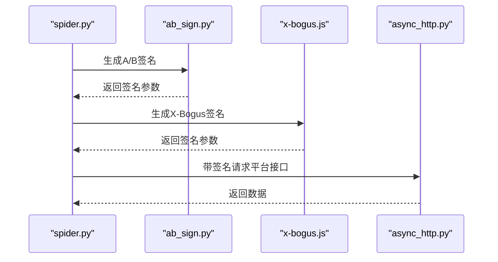
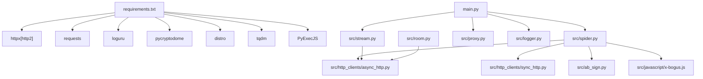

# 平台适配器架构

<cite>
**本文档引用的文件**
- [main.py](file://main.py)
- [spider.py](file://src/spider.py)
- [stream.py](file://src/stream.py)
- [room.py](file://src/room.py)
- [async_http.py](file://src/http_clients/async_http.py)
- [sync_http.py](file://src/http_clients/sync_http.py)
- [utils.py](file://src/utils.py)
- [ab_sign.py](file://src/ab_sign.py)
- [x-bogus.js](file://src/javascript/x-bogus.js)
- [proxy.py](file://src/proxy.py)
- [logger.py](file://src/logger.py)
- [URL_config.ini](file://config/URL_config.ini)
- [requirements.txt](file://requirements.txt)
- [README.md](file://README.md)
</cite>

## 目录
1. [简介](#简介)
2. [项目结构](#项目结构)
3. [核心组件](#核心组件)
4. [架构总览](#架构总览)
5. [详细组件分析](#详细组件分析)
6. [依赖关系分析](#依赖关系分析)
7. [性能考量](#性能考量)
8. [故障排查指南](#故障排查指南)
9. [结论](#结论)
10. [附录](#附录)

## 简介
本项目是一个支持多平台直播录制的工具，采用统一平台适配器架构，通过抽象化的爬虫层、流地址解析层与HTTP客户端层，实现对国内外数百个直播平台的统一接入与录制。系统具备异步并发处理、动态错误率调节、代理检测与注入、安全签名生成、日志监控与消息推送等能力，满足生产级的稳定性与可维护性要求。

## 项目结构
项目采用模块化分层设计，主要目录与职责如下：
- src：核心业务逻辑与基础设施
  - http_clients：异步/同步HTTP客户端封装
  - javascript：平台特定的JS签名/反爬逻辑
  - spider：各平台数据抓取与解析
  - stream：直播流地址选择与质量映射
  - room：抖音系房间ID与用户ID解析
  - ab_sign：A/B签名算法实现
  - utils、logger、proxy：通用工具与基础设施
- config：配置文件（URL配置、平台配置等）
- 根目录：入口脚本、Docker配置、依赖声明等

**图表来源**
- [main.py](file://main.py)
- [spider.py](file://src/spider.py)
- [stream.py](file://src/stream.py)
- [room.py](file://src/room.py)
- [async_http.py](file://src/http_clients/async_http.py)
- [sync_http.py](file://src/http_clients/sync_http.py)
- [utils.py](file://src/utils.py)
- [ab_sign.py](file://src/ab_sign.py)
- [x-bogus.js](file://src/javascript/x-bogus.js)
- [proxy.py](file://src/proxy.py)
- [logger.py](file://src/logger.py)

**章节来源**
- [README.md](file://README.md)
- [main.py](file://main.py)

## 核心组件
- 统一入口与调度器：负责URL解析、平台识别、并发调度、错误率动态调节、录制流程编排与消息推送。
- 平台爬虫适配器：针对不同平台的网页/接口特征，抽取直播信息与流地址，处理差异化参数与风控。
- 流地址解析器：根据用户画质偏好与平台特性，选择最优HLS/FLV流，并进行质量映射与可用性检测。
- HTTP客户端：提供异步/同步HTTP请求封装，支持代理、重定向、超时、头部注入与响应状态检测。
- 安全与签名：集成A/B签名与X-Bogus签名生成，应对平台风控与参数校验。
- 工具与基础设施：日志、代理检测、配置读写、磁盘容量检查、文件去重等。

**章节来源**
- [main.py](file://main.py)
- [spider.py](file://src/spider.py)
- [stream.py](file://src/stream.py)
- [async_http.py](file://src/http_clients/async_http.py)
- [sync_http.py](file://src/http_clients/sync_http.py)
- [ab_sign.py](file://src/ab_sign.py)
- [x-bogus.js](file://src/javascript/x-bogus.js)
- [utils.py](file://src/utils.py)
- [proxy.py](file://src/proxy.py)
- [logger.py](file://src/logger.py)

## 架构总览
系统采用“入口调度 + 适配器层 + HTTP客户端层 + 基础设施层”的分层架构，通过统一的平台识别与URL解析规则，将不同平台的差异化处理抽象为一致的接口，实现可扩展、可维护的平台适配器体系。

**图表来源**
- [main.py](file://main.py)
- [spider.py](file://src/spider.py)
- [stream.py](file://src/stream.py)
- [async_http.py](file://src/http_clients/async_http.py)
- [utils.py](file://src/utils.py)

## 详细组件分析

### 组件A：统一入口与调度器
- 职责：URL解析、平台识别、并发控制、错误率动态调节、录制流程编排、消息推送。
- 关键机制：
  - 平台识别：通过URL特征字符串匹配识别平台类型。
  - 并发调度：使用信号量控制同时访问网络的线程数。
  - 动态错误率调节：基于滑动窗口计算瞬时错误率，自动调整并发上限。
  - 录制流程：下载/FFmpeg录制、转码、分段、脚本钩子、时间文件生成。
  - 消息推送：支持多种推送渠道与批量推送。

**图表来源**
- [main.py](file://main.py)
- [spider.py](file://src/spider.py)
- [stream.py](file://src/stream.py)

**章节来源**
- [main.py](file://main.py)

### 组件B：平台爬虫适配器（spider.py）
- 职责：针对不同平台的网页/接口特征，抽取直播信息与流地址。
- 关键机制：
  - 异步HTTP请求：统一使用async_http封装，支持代理、超时、重定向。
  - 平台特化：抖音（Web/App/短链）、TikTok、快手、虎牙、斗鱼、YY、B站、小红书、SOOP、网易CC、千度热播、PandaTV、猫耳FM、Look直播、WinkTV、FlexTV、PopkonTV、TwitCasting、百度直播、微博直播、酷狗直播、TwitchTV、LiveMe、花椒直播、流星直播、ShowRoom、Acfun、映客直播、音播直播、知乎直播、CHZZK、嗨秀直播、VV星球直播、17Live、浪Live、畅聊直播、飘飘直播、六间房直播、乐嗨直播、花猫直播、Shopee、Youtube、淘宝、京东、Faceit、咪咕、连接直播、来秀直播、Picarto等。
  - Cookie与风控：部分平台需要登录态或自动登录，支持更新配置文件中的Cookie。
  - JS签名：部分平台使用X-Bogus签名，通过execjs调用JavaScript实现。

**图表来源**
- [spider.py](file://src/spider.py)

**章节来源**
- [spider.py](file://src/spider.py)

### 组件C：流地址解析器（stream.py）
- 职责：根据用户画质偏好与平台特性，选择最优HLS/FLV流，并进行质量映射与可用性检测。
- 关键机制：
  - 质量映射：将“原画/蓝光/超清/高清/标清/流畅”映射为平台内部质量码。
  - 流选择：优先HLS，必要时降级为FLV；对H265等特殊编码进行规避。
  - 可用性检测：通过HEAD请求检测流有效性，失败时自动降级。
  - 平台特化：针对不同平台的流地址结构与CDN策略进行适配。

**图表来源**
- [stream.py](file://src/stream.py)

**章节来源**
- [stream.py](file://src/stream.py)

### 组件D：HTTP客户端层
- 异步HTTP客户端（async_http.py）：支持GET/POST、代理、超时、重定向、状态检测、返回Cookies等。
- 同步HTTP客户端（sync_http.py）：兼容旧逻辑与非异步场景，支持gzip解压、代理、超时等。
- 统一代理处理：utils.handle_proxy_addr规范化代理地址格式。

**图表来源**
- [async_http.py](file://src/http_clients/async_http.py)
- [sync_http.py](file://src/http_clients/sync_http.py)
- [utils.py](file://src/utils.py)

**章节来源**
- [async_http.py](file://src/http_clients/async_http.py)
- [sync_http.py](file://src/http_clients/sync_http.py)
- [utils.py](file://src/utils.py)

### 组件E：安全与签名（ab_sign.py、x-bogus.js）
- A/B签名：实现SM3、RC4、自定义Base64编码表等算法，生成平台要求的签名参数。
- X-Bogus签名：通过execjs加载JavaScript实现，模拟浏览器环境生成签名。
- 应用场景：抖音、TikTok等平台的风控校验。

**图表来源**
- [spider.py](file://src/spider.py)
- [ab_sign.py](file://src/ab_sign.py)
- [x-bogus.js](file://src/javascript/x-bogus.js)
- [async_http.py](file://src/http_clients/async_http.py)

**章节来源**
- [ab_sign.py](file://src/ab_sign.py)
- [x-bogus.js](file://src/javascript/x-bogus.js)
- [spider.py](file://src/spider.py)

### 组件F：基础设施（proxy.py、logger.py、utils.py）
- 代理检测：跨平台检测系统代理配置，自动注入HTTP/HTTPS代理。
- 日志：统一的日志格式与分级输出，区分调试与信息级别。
- 工具：配置读写、MD5校验、去重、磁盘容量检查、随机字符串生成、查询参数解析等。

**章节来源**
- [proxy.py](file://src/proxy.py)
- [logger.py](file://src/logger.py)
- [utils.py](file://src/utils.py)

## 依赖关系分析
- 运行时依赖：httpx、requests、loguru、pycryptodome、distro、tqdm、PyExecJS等。
- 模块依赖：入口依赖爬虫与流解析模块；爬虫依赖HTTP客户端与签名模块；工具模块被广泛复用。

**图表来源**
- [requirements.txt](file://requirements.txt)
- [main.py](file://main.py)
- [spider.py](file://src/spider.py)
- [stream.py](file://src/stream.py)
- [room.py](file://src/room.py)
- [async_http.py](file://src/http_clients/async_http.py)
- [sync_http.py](file://src/http_clients/sync_http.py)
- [ab_sign.py](file://src/ab_sign.py)
- [x-bogus.js](file://src/javascript/x-bogus.js)
- [proxy.py](file://src/proxy.py)
- [logger.py](file://src/logger.py)

**章节来源**
- [requirements.txt](file://requirements.txt)

## 性能考量
- 异步并发：使用httpx异步客户端与信号量控制并发，结合动态错误率调节，平衡吞吐与稳定性。
- 流可用性检测：通过HEAD请求快速判断流有效性，避免无效下载浪费带宽。
- 代理与网络：支持系统代理检测与注入，降低平台封锁风险。
- 转码与分段：按需转码与分段录制，减少单文件体积与存储压力。
- 日志与监控：统一日志格式与分级输出，便于性能观测与问题定位。

## 故障排查指南
- 平台无法访问/风控：检查代理配置、Cookie有效性、签名生成是否成功。
- 录制失败：确认流地址可用性、网络连通性、FFmpeg安装与版本。
- 错误率过高：查看动态并发调节日志，适当降低并发或启用代理。
- 日志定位：利用调试日志与错误堆栈信息，定位具体模块与异常点。

**章节来源**
- [logger.py](file://src/logger.py)
- [main.py](file://main.py)

## 结论
本平台适配器架构通过清晰的分层设计与统一的适配器模式，实现了对多平台直播录制的高效接入与稳定运行。配合异步并发、动态错误率调节、代理检测、安全签名与完善的日志监控，系统在复杂多变的直播生态中保持了良好的可扩展性与可维护性。

## 附录

### 平台接入开发指南
- 接口规范
  - 数据抓取：实现对应平台的spider函数，返回包含直播标题、主播名、是否直播、流地址等字段的数据结构。
  - 流地址解析：实现stream函数，根据用户画质偏好与平台特性选择最优流。
  - 安全签名：如需签名，实现或复用ab_sign与x-bogus逻辑。
- 数据结构定义
  - 平台数据：包含anchor_name、is_live、title、m3u8_url、flv_url、record_url、quality等字段。
  - 配置文件：URL_config.ini中添加待录制URL，支持注释与自定义画质。
- 测试验证流程
  - 单平台测试：使用对应spider函数获取数据，验证流地址可用性。
  - 并发测试：在多URL环境下验证动态并发调节与错误率控制。
  - 代理测试：在受限网络环境下验证代理注入与平台访问。
  - 日志测试：验证日志输出与错误捕获。
- 兼容性与差异性处理
  - 差异化参数：针对不同平台的Cookie、User-Agent、Referer等进行适配。
  - 编码与容器：对H265等特殊编码进行规避或转码处理。
  - CDN与抗反爬：对CDN参数、签名、时间戳等进行动态生成与注入。
- 运维管理要点
  - 性能监控：关注并发、错误率、磁盘容量、CPU/内存占用。
  - 健康检查：定期检查FFmpeg、Node.js、代理可用性。
  - 自动化：结合定时任务与容器化部署，实现无人值守录制。

**章节来源**
- [spider.py](file://src/spider.py)
- [stream.py](file://src/stream.py)
- [URL_config.ini](file://config/URL_config.ini)
- [README.md](file://README.md)