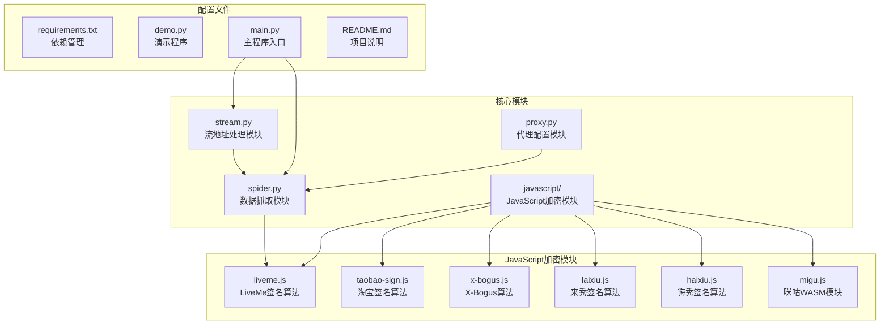
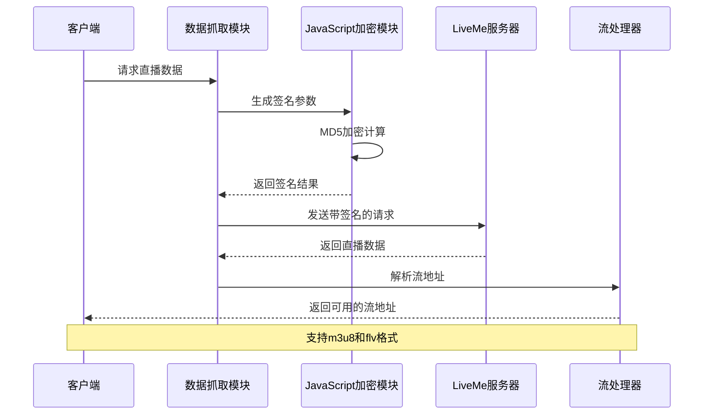
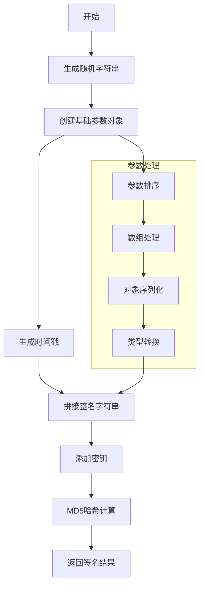
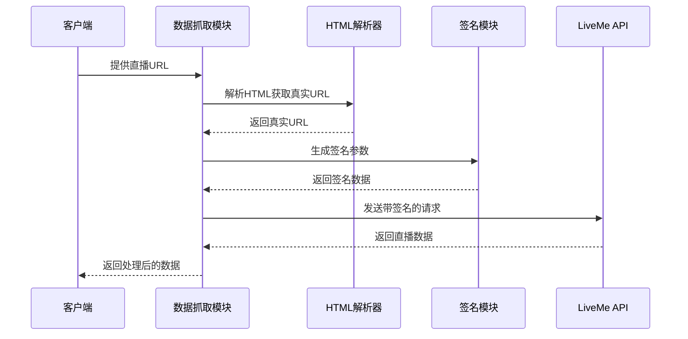
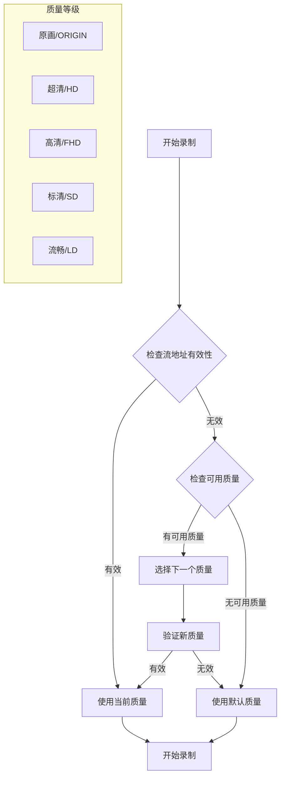
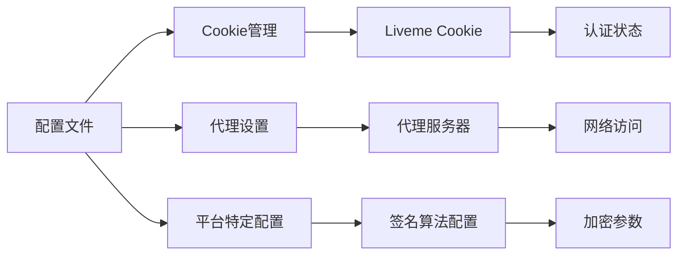
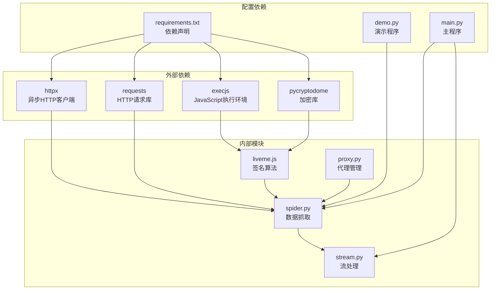

# LiveMe平台支持

<cite>
**本文档引用的文件**
- [src/javascript/liveme.js](file://src/javascript/liveme.js)
- [src/spider.py](file://src/spider.py)
- [src/stream.py](file://src/stream.py)
- [src/proxy.py](file://src/proxy.py)
- [demo.py](file://demo.py)
- [main.py](file://main.py)
- [README.md](file://README.md)
- [requirements.txt](file://requirements.txt)
</cite>

## 目录
1. [简介](#简介)
2. [项目结构](#项目结构)
3. [核心组件](#核心组件)
4. [架构概览](#架构概览)
5. [详细组件分析](#详细组件分析)
6. [依赖关系分析](#依赖关系分析)
7. [性能考虑](#性能考虑)
8. [故障排除指南](#故障排除指南)
9. [结论](#结论)
10. [附录](#附录)

## 简介

LiveMe是一个全球性的直播社交平台，支持多种直播形式和互动功能。本文档详细介绍LiveMe平台的技术实现，包括JavaScript加密算法执行、WASM模块支持、反爬虫机制应对、API数据结构、直播流地址获取和质量选择策略、签名算法、加密参数和安全防护机制，以及直播录制的技术实现方案。

## 项目结构

该项目采用模块化设计，主要包含以下核心模块：



**图表来源**
- [src/spider.py:1-50](file://src/spider.py#L1-L50)
- [src/stream.py:1-30](file://src/stream.py#L1-L30)
- [src/javascript/liveme.js:1-50](file://src/javascript/liveme.js#L1-L50)

**章节来源**
- [README.md:72-100](file://README.md#L72-L100)
- [requirements.txt:1-7](file://requirements.txt#L1-L7)

## 核心组件

### LiveMe签名算法模块

LiveMe平台采用了复杂的JavaScript加密算法来保护其API接口。该模块包含以下关键功能：

1. **动态随机字符串生成**：使用字符集生成32位随机字符串
2. **MD5哈希计算**：对拼接后的字符串进行MD5加密
3. **Base64解码密钥**：使用Base64解码的密钥进行签名验证
4. **参数排序和拼接**：对请求参数进行排序和字符串拼接

### 数据抓取模块

负责从LiveMe平台获取直播数据，包括：
- 房间ID提取和验证
- 签名参数生成
- API请求发送和响应处理
- 直播状态检查和数据解析

### 流地址处理模块

提供统一的流地址处理接口，支持：
- 多种直播平台的流地址解析
- 质量选择和切换
- 错误处理和重试机制
- 录制控制和格式转换

**章节来源**
- [src/javascript/liveme.js:1-100](file://src/javascript/liveme.js#L1-L100)
- [src/spider.py:2208-2254](file://src/spider.py#L2208-L2254)

## 架构概览

LiveMe平台的技术架构采用分层设计，确保了系统的可扩展性和安全性：



**图表来源**
- [src/spider.py:2208-2254](file://src/spider.py#L2208-L2254)
- [src/javascript/liveme.js:353-421](file://src/javascript/liveme.js#L353-L421)

## 详细组件分析

### LiveMe签名算法实现

#### 核心加密流程



**图表来源**
- [src/javascript/liveme.js:21-40](file://src/javascript/liveme.js#L21-L40)
- [src/javascript/liveme.js:333-351](file://src/javascript/liveme.js#L333-L351)

#### 签名参数结构

LiveMe签名算法使用以下参数结构：

| 参数名称 | 类型 | 描述 | 示例值 |
|---------|------|------|--------|
| alias | string | 平台标识符 | "liveme" |
| os | string | 操作系统类型 | "web" 或 "android" |
| lm_s_id | string | 用户标识符 | "LM6000101139961122666757" |
| lm_s_ts | string | 时间戳 | "17284909009151" |
| lm_s_str | string | 随机字符串 | "88f9777231dc2d6ac462a1d7ebf5f54e" |
| lm_s_ver | number | 版本号 | 1 |
| h5 | number | H5标识 | 1 |
| _time | number | 当前时间 | 1728490664651 |
| thirdchannel | number | 渠道标识 | 6 |
| videoid | string | 视频ID | "17284844223282059697" |
| area | string | 区域标识 | "zh" |
| vali | string | 验证字符串 | "zH8SlBwnCm4AZWp" |

**章节来源**
- [src/javascript/liveme.js:353-421](file://src/javascript/liveme.js#L353-L421)

### 数据抓取流程

#### API请求处理



**图表来源**
- [src/spider.py:2208-2254](file://src/spider.py#L2208-L2254)

#### 直播数据结构

LiveMe平台返回的直播数据包含以下关键字段：

| 字段名称 | 类型 | 描述 | 示例值 |
|---------|------|------|--------|
| uname | string | 主播名称 | "用户名" |
| status | string | 直播状态 | "0" (直播中) |
| hlsvideosource | string | HLS视频源地址 | "https://example.com/live.m3u8" |
| videosource | string | FLV视频源地址 | "https://example.com/live.flv" |

**章节来源**
- [src/spider.py:2241-2254](file://src/spider.py#L2241-L2254)

### 流地址处理机制

#### 质量选择策略



**图表来源**
- [src/stream.py:29-78](file://src/stream.py#L29-L78)

#### 录制控制逻辑

LiveMe平台的录制控制采用以下策略：

1. **自动质量检测**：系统会自动检测当前可用的直播质量
2. **质量降级机制**：当高分辨率流无法访问时，自动降级到较低质量
3. **格式兼容性**：同时支持m3u8和FLV格式，确保最大兼容性
4. **错误恢复**：在网络不稳定情况下自动重试和恢复录制

**章节来源**
- [src/stream.py:41-78](file://src/stream.py#L41-L78)

### 反爬虫机制应对

#### 多层防护绕过

LiveMe平台采用了多层次的反爬虫防护机制：

1. **JavaScript加密签名**：所有API请求都需要通过复杂的JavaScript加密算法生成签名
2. **动态参数生成**：请求参数包含动态生成的时间戳和随机字符串
3. **头部伪装**：使用移动设备的User-Agent和Referer头
4. **地理位置验证**：通过tongdun_black_box参数进行地理位置验证

#### 配置文件管理



**图表来源**
- [main.py:1898-1900](file://main.py#L1898-L1900)

**章节来源**
- [src/spider.py:2208-2254](file://src/spider.py#L2208-L2254)
- [main.py:845-852](file://main.py#L845-L852)

## 依赖关系分析

### 核心依赖关系



**图表来源**
- [requirements.txt:1-7](file://requirements.txt#L1-L7)
- [src/spider.py:21-32](file://src/spider.py#L21-L32)

### 模块间交互

LiveMe平台的模块间交互遵循清晰的职责分离原则：

1. **数据获取层**：负责与LiveMe服务器通信，获取直播数据
2. **加密处理层**：负责生成API签名，绕过反爬虫机制
3. **流处理层**：负责解析和处理直播流地址
4. **配置管理层**：负责管理各种配置参数和环境设置

**章节来源**
- [requirements.txt:1-7](file://requirements.txt#L1-L7)
- [src/spider.py:2208-2254](file://src/spider.py#L2208-L2254)

## 性能考虑

### 网络优化策略

1. **异步请求处理**：使用httpx库进行异步HTTP请求，提高并发处理能力
2. **智能重试机制**：在网络异常时自动重试，提高成功率
3. **连接池管理**：合理管理HTTP连接，减少连接建立开销
4. **缓存策略**：对静态资源和配置信息进行缓存

### 资源管理

1. **内存优化**：及时释放不再使用的变量和对象
2. **CPU使用率控制**：避免过度的CPU密集型操作
3. **磁盘I/O优化**：合理安排录制文件的写入时机
4. **网络带宽管理**：根据网络状况调整录制质量和频率

### 监控和诊断

1. **日志记录**：详细的日志记录帮助诊断问题
2. **性能指标**：监控关键性能指标如响应时间、成功率等
3. **错误统计**：统计各类错误的发生频率和原因
4. **资源使用监控**：监控内存、CPU、磁盘和网络使用情况

## 故障排除指南

### 常见问题及解决方案

#### 签名验证失败

**问题描述**：API请求返回签名验证失败的错误

**可能原因**：
1. JavaScript加密模块执行异常
2. 签名参数生成错误
3. 时间同步问题

**解决方案**：
1. 检查Node.js环境是否正确安装
2. 验证加密密钥的有效性
3. 确认系统时间的准确性

#### 直播流无法访问

**问题描述**：虽然API调用成功，但无法访问直播流

**可能原因**：
1. CDN节点问题
2. 地理位置限制
3. 网络连接不稳定

**解决方案**：
1. 尝试不同的CDN节点
2. 使用代理服务器
3. 检查网络连接质量

#### 录制质量异常

**问题描述**：录制的视频质量不符合预期

**可能原因**：
1. 质量选择策略问题
2. 网络带宽不足
3. 编码参数配置不当

**解决方案**：
1. 调整质量选择策略
2. 优化网络配置
3. 调整编码参数

**章节来源**
- [src/spider.py:2208-2254](file://src/spider.py#L2208-L2254)
- [src/stream.py:41-78](file://src/stream.py#L41-L78)

### 调试技巧

1. **启用详细日志**：通过配置日志级别获取更详细的信息
2. **网络抓包分析**：使用工具分析HTTP请求和响应
3. **JavaScript调试**：在浏览器开发者工具中调试加密算法
4. **性能分析**：使用性能分析工具识别瓶颈

## 结论

LiveMe平台的技术实现展现了现代直播平台的复杂性和技术挑战。通过JavaScript加密算法、多层反爬虫机制和灵活的流处理系统，该平台实现了高效、安全的直播服务。

本文档详细分析了LiveMe平台的核心技术组件，包括签名算法实现、数据抓取流程、流地址处理机制和反爬虫机制应对策略。这些技术实现为其他直播平台的开发提供了有价值的参考和借鉴。

随着直播技术的不断发展，LiveMe平台也在持续演进和完善。未来的发展方向可能包括更好的AI内容审核、更高效的视频传输技术和更丰富的互动功能。

## 附录

### 支持的平台列表

该项目支持多个直播平台，包括但不限于：

- 抖音、TikTok、快手
- 虎牙、斗鱼、YY
- B站、小红书、Bigo
- LiveMe、花椒直播、ShowRoom
- Acfun、映客直播、知乎直播
- CHZZK、咪咕直播、来秀直播
- TwitchTV、YouTube、淘宝直播
- 京东、Faceit、Shopee等

### 开发环境要求

1. **Python版本**：3.10及以上
2. **Node.js环境**：用于执行JavaScript加密算法
3. **FFmpeg**：用于视频录制和格式转换
4. **系统依赖**：根据操作系统安装相应的系统库

### 配置示例

```python
# LiveMe平台配置示例
liveme_config = {
    'url': 'https://www.liveme.com/zh/v/17141937295821012854/index.html',
    'cookies': 'your_liveme_cookies_here',
    'proxy': '127.0.0.1:7890'
}

# 调用示例
import asyncio
from src.spider import get_liveme_stream_url

async def main():
    result = await get_liveme_stream_url(
        url=liveme_config['url'],
        cookies=liveme_config['cookies'],
        proxy_addr=liveme_config['proxy']
    )
    print(result)

if __name__ == "__main__":
    asyncio.run(main())
```

**章节来源**
- [README.md:15-68](file://README.md#L15-L68)
- [demo.py:105-108](file://demo.py#L105-L108)