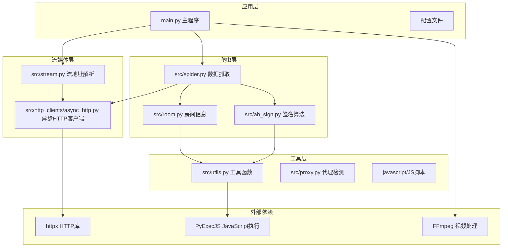
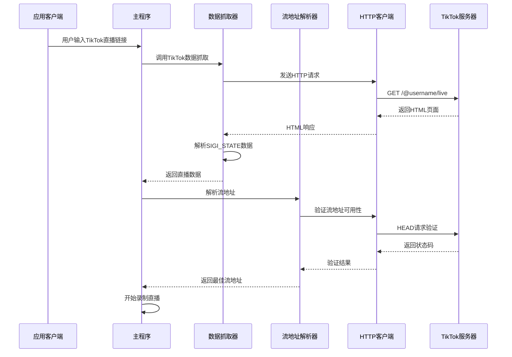
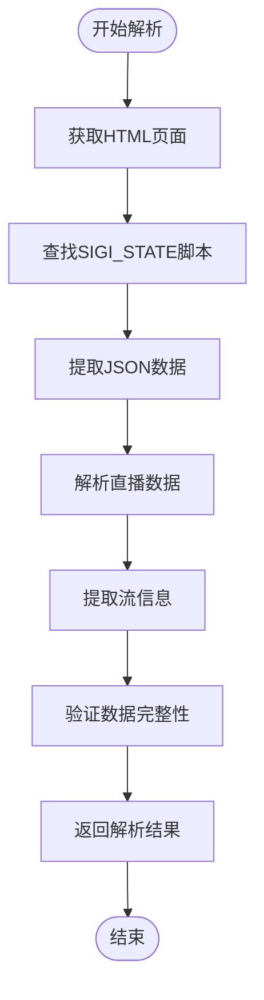
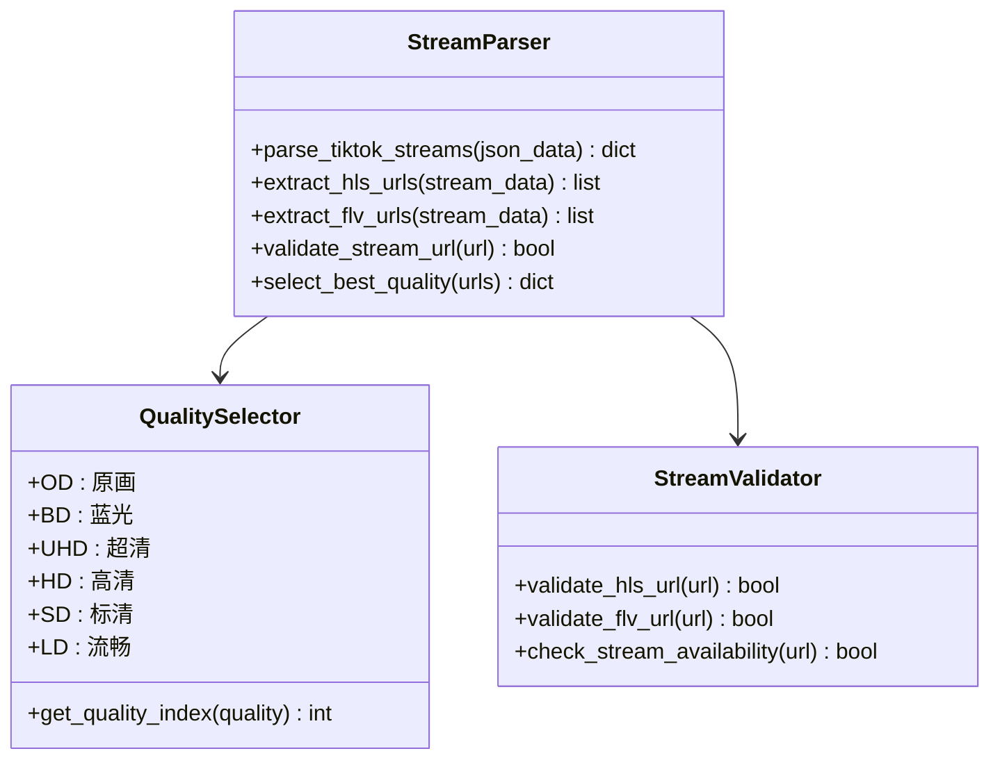
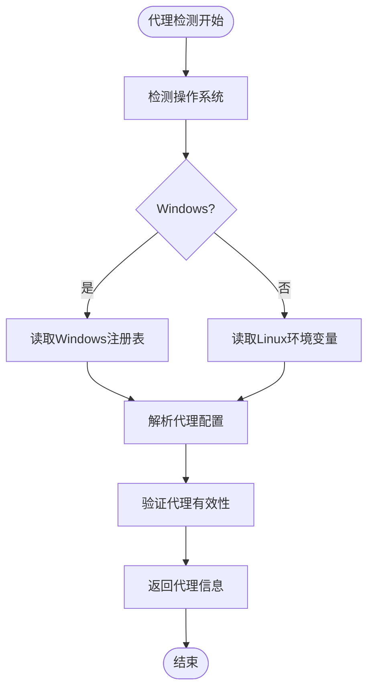
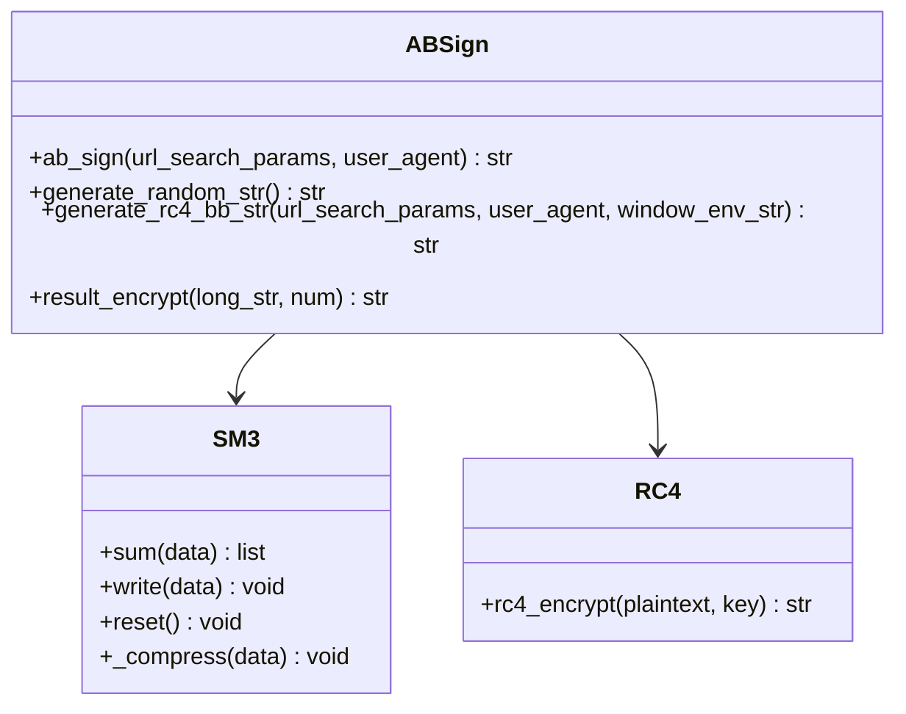
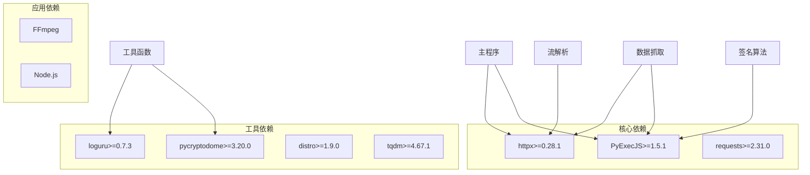
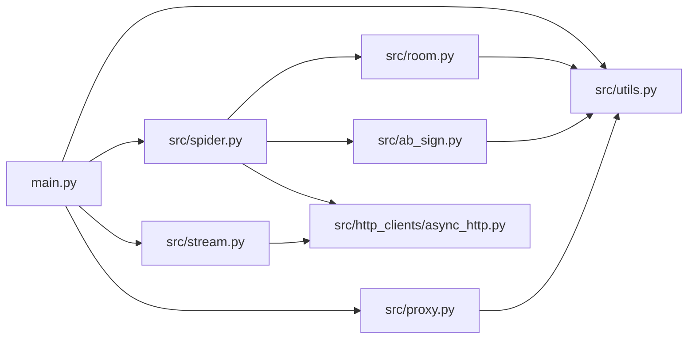
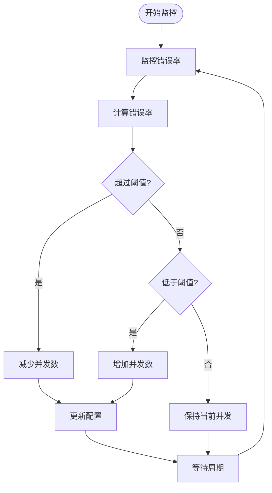

# TikTok平台支持

<cite>
**本文档引用的文件**
- [README.md](file://README.md)
- [main.py](file://main.py)
- [src/spider.py](file://src/spider.py)
- [src/stream.py](file://src/stream.py)
- [src/room.py](file://src/room.py)
- [src/ab_sign.py](file://src/ab_sign.py)
- [src/javascript/x-bogus.js](file://src/javascript/x-bogus.js)
- [src/http_clients/async_http.py](file://src/http_clients/async_http.py)
- [src/utils.py](file://src/utils.py)
- [src/proxy.py](file://src/proxy.py)
- [requirements.txt](file://requirements.txt)
- [config/URL_config.ini](file://config/URL_config.ini)
</cite>

## 目录
1. [简介](#简介)
2. [项目结构](#项目结构)
3. [核心组件](#核心组件)
4. [架构概览](#架构概览)
5. [详细组件分析](#详细组件分析)
6. [依赖关系分析](#依赖关系分析)
7. [性能考虑](#性能考虑)
8. [故障排除指南](#故障排除指南)
9. [结论](#结论)
10. [附录](#附录)

## 简介

本文档深入解析DouyinLiveRecorder项目中TikTok直播平台的技术实现，涵盖反爬虫机制、地区封锁策略、网络访问限制、数据获取方法、SIGI_STATE数据结构解析、房间信息获取、直播流地址解析等核心技术。同时提供海外节点选择原则、代理配置方法和网络稳定性保障方案，以及直播录制的技术难点、解决方案和性能优化建议。

## 项目结构

该项目是一个基于Python的直播录制工具，支持多个国内外直播平台，包括TikTok。项目采用模块化设计，主要包含以下核心模块：



**图表来源**
- [main.py:1-800](file://main.py#L1-L800)
- [src/spider.py:1-800](file://src/spider.py#L1-L800)
- [src/stream.py:1-446](file://src/stream.py#L1-L446)

**章节来源**
- [README.md:72-100](file://README.md#L72-L100)
- [main.py:41-45](file://main.py#L41-L45)

## 核心组件

### TikTok数据抓取组件

项目实现了完整的TikTok直播数据获取流程，包括网页版和移动端API的数据获取方法。

### SIGI_STATE数据结构解析

TikTok网页版通过SIGI_STATE脚本标签提供直播数据，项目实现了对该JSON数据结构的完整解析。

### 流地址解析组件

针对TikTok直播流的不同格式（HLS、FLV）提供统一的解析和选择逻辑。

**章节来源**
- [src/spider.py:285-314](file://src/spider.py#L285-L314)
- [src/stream.py:81-153](file://src/stream.py#L81-L153)

## 架构概览

项目采用分层架构设计，每层职责明确，便于维护和扩展：



**图表来源**
- [main.py:596-608](file://main.py#L596-L608)
- [src/spider.py:285-314](file://src/spider.py#L285-L314)
- [src/stream.py:81-153](file://src/stream.py#L81-L153)

## 详细组件分析

### TikTok数据抓取器

#### SIGI_STATE数据解析

TikTok网页版通过`<script id="SIGI_STATE" type="application/json">`标签提供直播数据，项目实现了对该数据结构的完整解析：



**图表来源**
- [src/spider.py:285-314](file://src/spider.py#L285-L314)

#### 反爬虫机制应对

项目实现了多种反爬虫机制的应对策略：

1. **User-Agent轮换**: 使用真实的浏览器User-Agent
2. **请求头伪装**: 设置完整的请求头信息
3. **代理支持**: 支持HTTP/HTTPS/SOCKS代理
4. **请求频率控制**: 动态调整并发请求数量

**章节来源**
- [src/spider.py:285-314](file://src/spider.py#L285-L314)
- [src/ab_sign.py:444-455](file://src/ab_sign.py#L444-L455)

### 流地址解析器

#### 多格式流地址支持

针对TikTok直播流的不同格式提供统一解析：



**图表来源**
- [src/stream.py:81-153](file://src/stream.py#L81-L153)
- [src/stream.py:29-37](file://src/stream.py#L29-L37)

#### 质量选择算法

项目实现了智能的质量选择算法，根据网络状况和可用性动态选择最佳直播流：

**章节来源**
- [src/stream.py:81-153](file://src/stream.py#L81-L153)

### 代理系统

#### 代理检测与配置

项目实现了跨平台的代理检测和配置功能：



**图表来源**
- [src/proxy.py:38-93](file://src/proxy.py#L38-L93)

**章节来源**
- [src/proxy.py:27-93](file://src/proxy.py#L27-L93)

### 签名算法系统

#### AB签名算法

项目实现了抖音和TikTok使用的AB签名算法，用于绕过反爬虫检测：



**图表来源**
- [src/ab_sign.py:444-455](file://src/ab_sign.py#L444-L455)
- [src/ab_sign.py:61-209](file://src/ab_sign.py#L61-L209)

#### X-Bogus算法

TikTok还使用X-Bogus算法进行安全验证，项目通过JavaScript引擎执行该算法：

**章节来源**
- [src/ab_sign.py:1-455](file://src/ab_sign.py#L1-L455)
- [src/javascript/x-bogus.js:500-564](file://src/javascript/x-bogus.js#L500-L564)

## 依赖关系分析

### 外部依赖

项目的主要外部依赖包括：



**图表来源**
- [requirements.txt:1-7](file://requirements.txt#L1-L7)

### 内部模块依赖



**图表来源**
- [main.py:30-36](file://main.py#L30-L36)
- [src/spider.py:27-32](file://src/spider.py#L27-L32)

**章节来源**
- [requirements.txt:1-7](file://requirements.txt#L1-L7)

## 性能考虑

### 并发控制

项目实现了智能的并发请求控制机制，根据错误率动态调整并发数量：



**图表来源**
- [main.py:298-325](file://main.py#L298-L325)

### 缓存策略

项目实现了多层缓存策略来提高性能：

1. **请求结果缓存**: 对重复的API请求进行缓存
2. **流地址缓存**: 缓存解析后的流地址
3. **配置缓存**: 缓存用户配置信息

### 网络优化

1. **HTTP/2支持**: 启用HTTP/2协议提升传输效率
2. **连接复用**: 复用HTTP连接减少建立成本
3. **超时控制**: 合理设置请求超时时间

## 故障排除指南

### 常见问题及解决方案

#### TikTok访问失败

**问题描述**: 无法访问TikTok直播页面

**可能原因**:
1. 网络地区限制
2. IP被封禁
3. 请求头不正确
4. 代理配置错误

**解决方案**:
1. 检查代理配置
2. 更换User-Agent
3. 增加请求延迟
4. 使用不同的代理节点

#### SIGI_STATE解析失败

**问题描述**: 无法解析SIGI_STATE数据

**可能原因**:
1. TikTok页面结构变化
2. JavaScript执行环境问题
3. 网络请求失败

**解决方案**:
1. 检查网络连接
2. 验证JavaScript引擎
3. 更新解析逻辑

#### 流地址获取失败

**问题描述**: 无法获取有效的直播流地址

**可能原因**:
1. 直播流已结束
2. 流地址失效
3. 网络连接问题

**解决方案**:
1. 检查直播状态
2. 刷新流地址
3. 检查网络连接

**章节来源**
- [src/spider.py:285-314](file://src/spider.py#L285-L314)
- [src/stream.py:81-153](file://src/stream.py#L81-L153)

### 日志分析

项目提供了详细的日志记录功能，便于问题诊断：

1. **错误级别日志**: 记录所有异常情况
2. **调试级别日志**: 提供详细的执行过程
3. **性能日志**: 记录关键操作的耗时

## 结论

DouyinLiveRecorder项目为TikTok直播平台提供了完整的技术解决方案，包括：

1. **反爬虫机制应对**: 实现了多种反爬虫检测的应对策略
2. **SIGI_STATE数据解析**: 完整解析TikTok网页版直播数据
3. **多格式流地址支持**: 支持HLS和FLV等多种直播流格式
4. **智能质量选择**: 根据网络状况自动选择最佳直播质量
5. **代理系统集成**: 提供完整的代理检测和配置功能
6. **性能优化**: 实现了并发控制和缓存策略

该项目为开发者提供了学习和参考的优秀案例，展示了如何在复杂的反爬虫环境下实现稳定的直播数据获取和录制功能。

## 附录

### 配置文件说明

#### URL配置文件

```ini
# TikTok直播链接示例
https://www.tiktok.com/@pearlgaga88/live

# 其他平台示例
https://live.douyin.com/745964462470
https://live.kuaishou.com/u/yall1102
```

**章节来源**
- [config/URL_config.ini:1-5](file://config/URL_config.ini#L1-L5)

### 依赖安装

```bash
# 安装项目依赖
pip install -r requirements.txt

# 安装FFmpeg（Linux系统）
sudo apt update
sudo apt install ffmpeg

# 安装Node.js（用于JavaScript执行）
# 从 https://nodejs.org 下载安装
```

### 使用示例

```python
# 基本使用
from src.spider import get_tiktok_stream_data
from src.stream import get_tiktok_stream_url

# 获取TikTok直播数据
url = "https://www.tiktok.com/@username/live"
json_data = await get_tiktok_stream_data(url)

# 解析流地址
stream_info = await get_tiktok_stream_url(json_data, "原画")
```