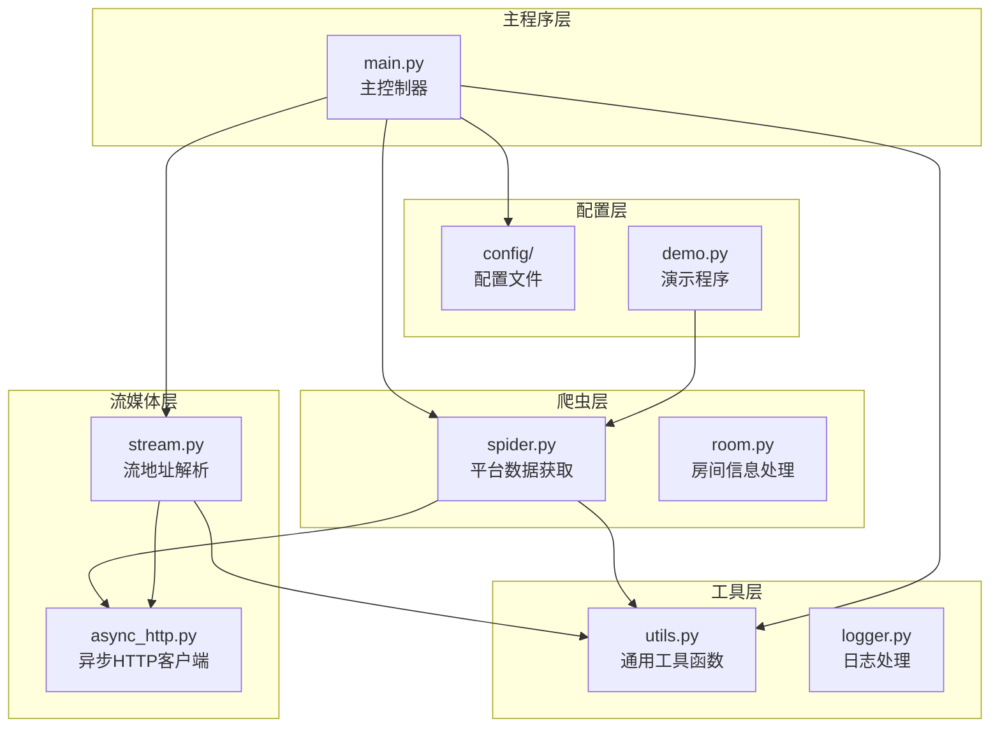
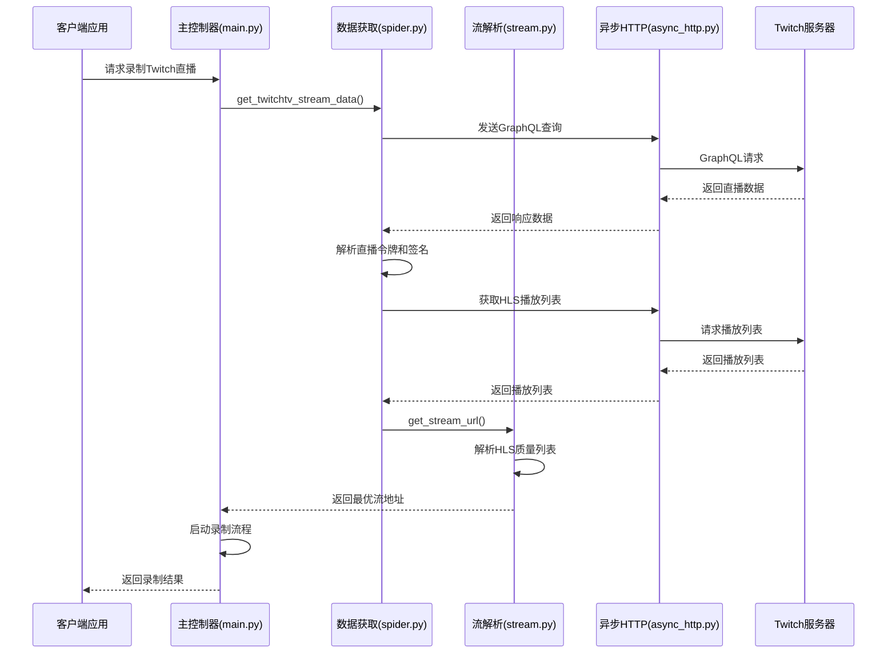
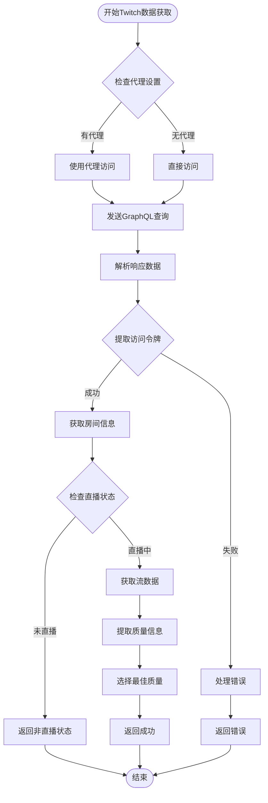
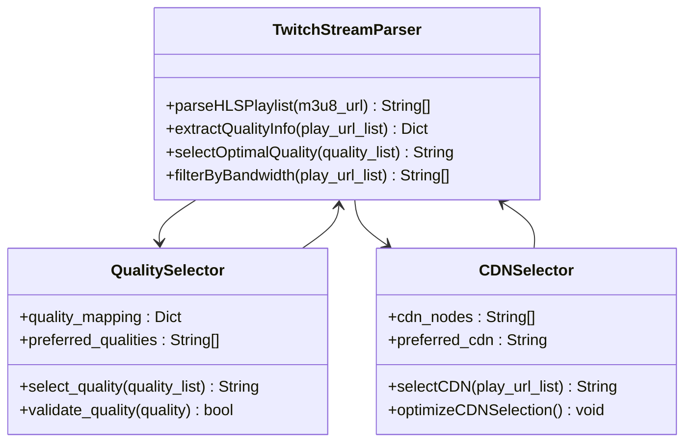
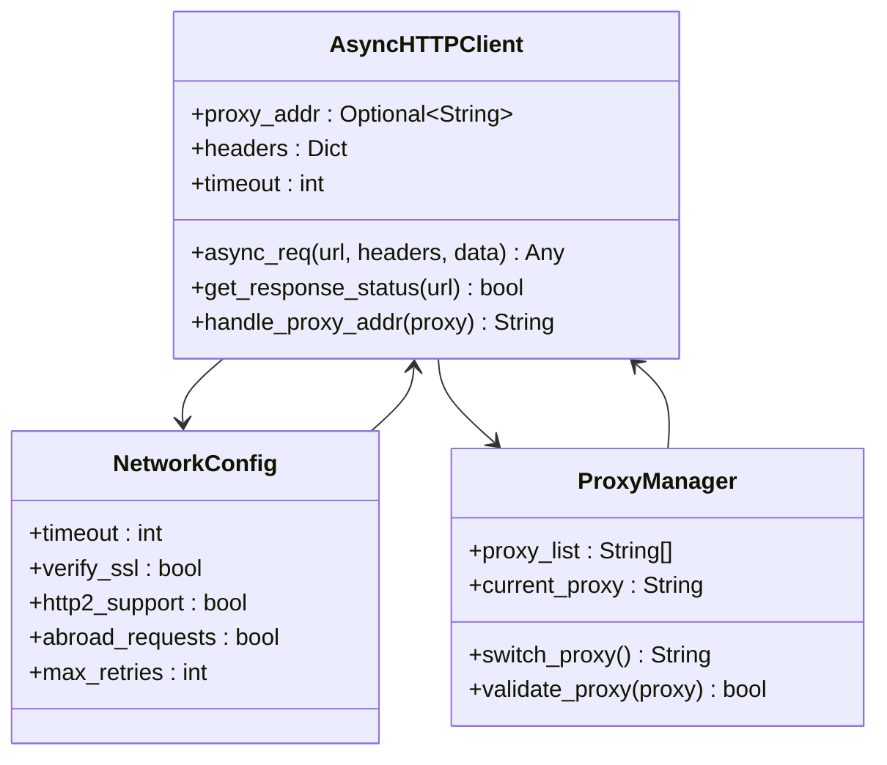
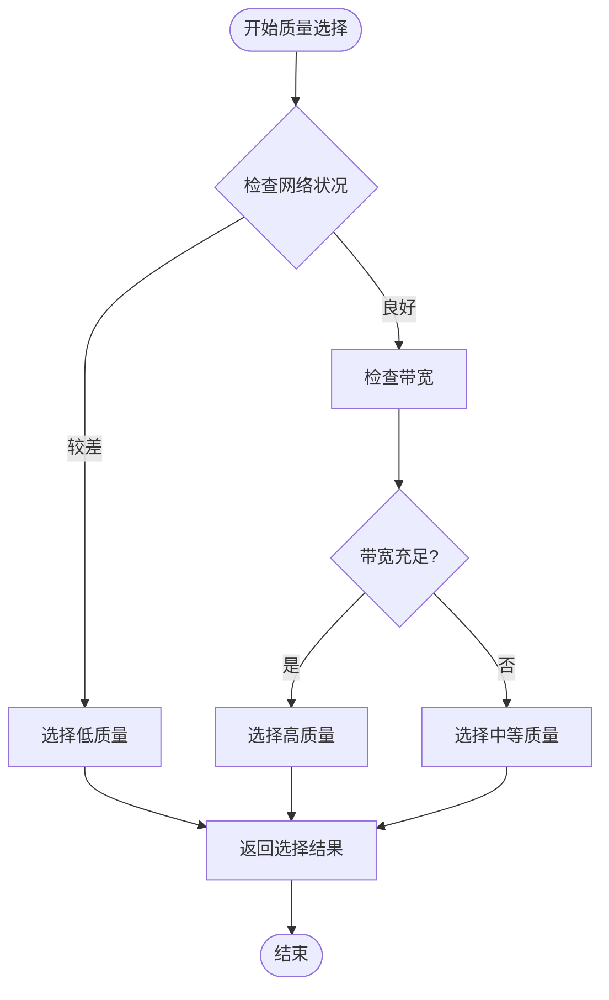
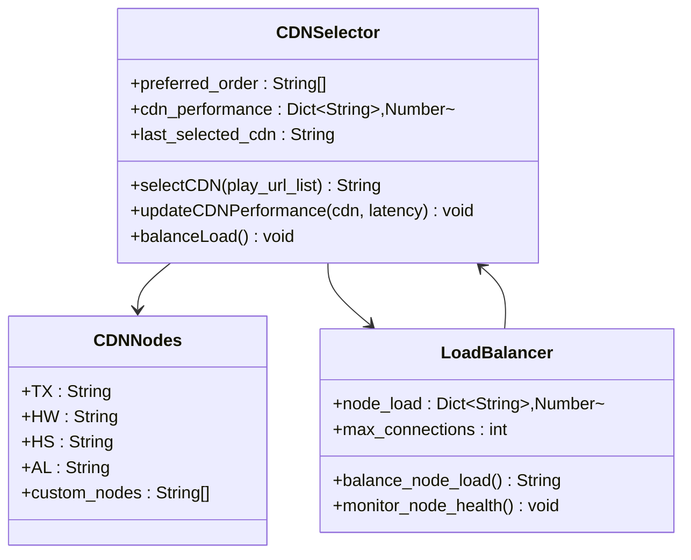
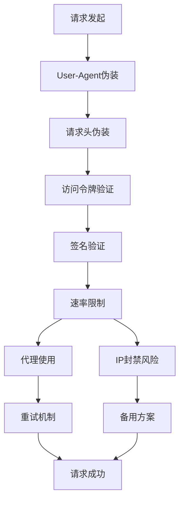
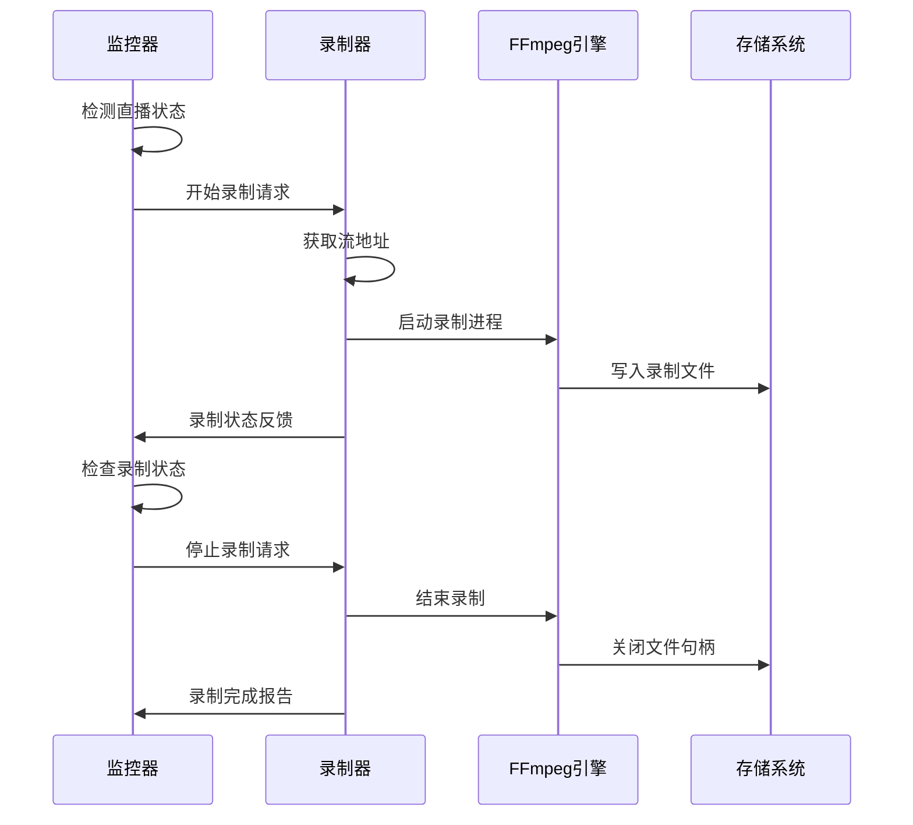
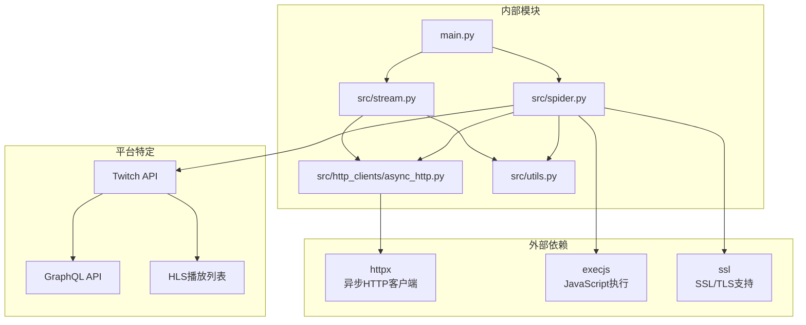

# Twitch平台支持

<cite>
**本文档引用的文件**
- [README.md](file://README.md)
- [main.py](file://main.py)
- [src/spider.py](file://src/spider.py)
- [src/stream.py](file://src/stream.py)
- [src/http_clients/async_http.py](file://src/http_clients/async_http.py)
- [src/utils.py](file://src/utils.py)
- [demo.py](file://demo.py)
</cite>

## 目录
1. [简介](#简介)
2. [项目结构](#项目结构)
3. [核心组件](#核心组件)
4. [架构概览](#架构概览)
5. [详细组件分析](#详细组件分析)
6. [依赖关系分析](#依赖关系分析)
7. [性能考虑](#性能考虑)
8. [故障排除指南](#故障排除指南)
9. [结论](#结论)

## 简介

本文档详细介绍了DouyinLiveRecorder项目中对Twitch直播平台的支持实现。该项目是一个基于Python的直播录制工具，支持多个国内外直播平台，包括Twitch、TikTok、B站、抖音等超过40个平台。本文档重点分析Twitch平台的技术实现，包括API调用规范、OAuth认证机制、直播流数据获取方法、HLS流地址解析、质量选择算法、CDN节点选择策略、反爬虫防护、速率限制和IP封禁应对方案，以及直播录制的技术实现细节。

## 项目结构

项目采用模块化的架构设计，主要包含以下核心模块：

**图表来源**
- [main.py:1-100](file://main.py#L1-L100)
- [src/spider.py:1-50](file://src/spider.py#L1-L50)
- [src/stream.py:1-50](file://src/stream.py#L1-L50)

**章节来源**
- [README.md:72-100](file://README.md#L72-L100)
- [main.py:1-100](file://main.py#L1-L100)

## 核心组件

### Twitch平台支持概述

项目明确支持Twitch直播平台，这是通过以下核心组件实现的：

1. **Twitch数据获取模块**：专门处理Twitch平台的数据获取和流地址解析
2. **异步HTTP客户端**：提供高效的网络请求能力，支持代理和超时控制
3. **质量选择算法**：智能选择最适合的直播质量
4. **CDN节点选择**：优化CDN节点选择策略
5. **反爬虫防护**：实现多种反爬虫策略

### 支持的Twitch功能特性

- **GraphQL API集成**：使用Twitch的GraphQL API获取直播数据
- **HLS流解析**：支持HLS直播流的解析和质量选择
- **多CDN支持**：支持多个CDN节点的选择和切换
- **质量自适应**：根据网络状况自动调整直播质量
- **代理支持**：支持代理服务器访问Twitch平台

**章节来源**
- [README.md:40](file://README.md#L40)
- [src/spider.py:2140-2205](file://src/spider.py#L2140-L2205)

## 架构概览

Twitch平台的技术架构采用分层设计，确保了良好的可扩展性和维护性：

**图表来源**
- [main.py:832-843](file://main.py#L832-L843)
- [src/spider.py:2140-2205](file://src/spider.py#L2140-L2205)
- [src/stream.py:411-446](file://src/stream.py#L411-L446)

## 详细组件分析

### Twitch数据获取组件

#### GraphQL API集成

Twitch平台的数据获取通过GraphQL API实现，这是现代直播平台的标准做法：

**图表来源**
- [src/spider.py:2140-2205](file://src/spider.py#L2140-L2205)
- [src/spider.py:2101-2137](file://src/spider.py#L2101-L2137)

#### 访问令牌和签名机制

Twitch使用复杂的访问令牌和签名机制来保护直播流：

1. **Client-ID头**：使用固定的Client-ID标识请求来源
2. **设备ID**：随机生成的设备ID确保请求的唯一性
3. **访问令牌**：通过GraphQL查询获取的临时访问令牌
4. **签名验证**：使用签名参数验证请求的有效性

#### HLS播放列表解析

Twitch的HLS播放列表解析采用了智能的质量选择算法：

**图表来源**
- [src/spider.py:50-65](file://src/spider.py#L50-L65)
- [src/stream.py:411-446](file://src/stream.py#L411-L446)

**章节来源**
- [src/spider.py:2140-2205](file://src/spider.py#L2140-L2205)
- [src/spider.py:50-65](file://src/spider.py#L50-L65)

### 异步HTTP客户端

#### 网络请求优化

异步HTTP客户端提供了高效的网络请求能力，特别适合直播数据获取：

**图表来源**
- [src/http_clients/async_http.py:10-47](file://src/http_clients/async_http.py#L10-L47)
- [src/utils.py:162-168](file://src/utils.py#L162-L168)

#### 代理支持和网络优化

异步HTTP客户端实现了完整的代理支持和网络优化：

1. **代理自动检测**：自动处理代理地址格式
2. **超时控制**：灵活的超时配置
3. **重试机制**：网络请求失败时的自动重试
4. **SSL验证**：可选的SSL证书验证

**章节来源**
- [src/http_clients/async_http.py:10-47](file://src/http_clients/async_http.py#L10-L47)
- [src/utils.py:162-168](file://src/utils.py#L162-L168)

### 质量选择算法

#### 智能质量选择

Twitch平台的质量选择算法考虑了多个因素：

**图表来源**
- [src/stream.py:411-446](file://src/stream.py#L411-L446)

#### 质量映射表

系统维护了完整的质量映射表，支持多种质量等级：

| 质量代码 | 数字值 | 描述 |
|---------|--------|------|
| OD | 0 | 原画/蓝光 |
| BD | 0 | 蓝光 |
| UHD | 1 | 超清 |
| HD | 2 | 高清 |
| SD | 3 | 标清 |
| LD | 4 | 流畅 |

**章节来源**
- [src/stream.py:26-37](file://src/stream.py#L26-L37)
- [src/stream.py:411-446](file://src/stream.py#L411-L446)

### CDN节点选择策略

#### 多CDN支持

Twitch平台支持多个CDN节点，系统实现了智能的CDN选择策略：

**图表来源**
- [src/spider.py:482-508](file://src/spider.py#L482-L508)

#### CDN性能监控

系统实现了CDN节点的性能监控和负载均衡：

1. **性能指标收集**：实时收集CDN节点的延迟和成功率
2. **负载均衡**：根据节点负载情况分配流量
3. **健康检查**：定期检查CDN节点的可用性
4. **自动切换**：在网络状况变化时自动切换CDN节点

**章节来源**
- [src/spider.py:482-508](file://src/spider.py#L482-L508)

### 反爬虫防护机制

#### 多层次防护策略

Twitch平台的反爬虫防护采用了多层次的策略：

**图表来源**
- [src/spider.py:2140-2205](file://src/spider.py#L2140-L2205)

#### 反爬虫技术实现

1. **User-Agent轮换**：使用不同的User-Agent字符串
2. **请求头伪装**：模拟真实浏览器的请求头
3. **访问令牌管理**：动态管理访问令牌的生命周期
4. **速率控制**：合理控制请求频率，避免触发限流
5. **代理池管理**：使用代理池分散请求来源

**章节来源**
- [src/spider.py:2140-2205](file://src/spider.py#L2140-L2205)

### 直播录制实现

#### 录制流程控制

Twitch直播录制实现了完整的录制流程控制：

**图表来源**
- [main.py:545-590](file://main.py#L545-L590)

#### 录制参数配置

系统提供了灵活的录制参数配置：

1. **录制格式**：支持TS、FLV、MKV等多种格式
2. **质量控制**：可选择原画、蓝光、超清、高清等质量
3. **分段录制**：支持按时间或大小分段录制
4. **转码选项**：可选择是否进行视频转码

**章节来源**
- [main.py:545-590](file://main.py#L545-L590)

## 依赖关系分析

### 核心依赖关系

**图表来源**
- [src/spider.py:2140-2205](file://src/spider.py#L2140-L2205)
- [src/http_clients/async_http.py:1-24](file://src/http_clients/async_http.py#L1-L24)

### 模块耦合度分析

Twitch平台支持模块展现了良好的模块化设计：

- **高内聚**：Twitch相关的功能集中在spider.py和stream.py中
- **低耦合**：与其他平台的实现相互独立
- **可扩展性**：新的平台可以通过类似的模式添加
- **可维护性**：清晰的职责分离便于维护

**章节来源**
- [src/spider.py:2140-2205](file://src/spider.py#L2140-L2205)
- [src/stream.py:1-50](file://src/stream.py#L1-L50)

## 性能考虑

### 网络性能优化

Twitch平台的性能优化主要体现在以下几个方面：

1. **异步请求**：使用async/await模式提高并发性能
2. **连接复用**：HTTP客户端支持连接池复用
3. **缓存策略**：合理的缓存机制减少重复请求
4. **超时控制**：灵活的超时配置避免资源浪费

### 内存和CPU优化

1. **流式处理**：直播流采用流式处理避免内存占用过高
2. **按需加载**：只在需要时加载相关数据
3. **垃圾回收**：及时释放不再使用的对象
4. **资源清理**：确保网络连接和文件句柄正确关闭

## 故障排除指南

### 常见问题及解决方案

#### Twitch访问问题

| 问题类型 | 症状描述 | 解决方案 |
|---------|---------|---------|
| 网络连接失败 | 无法访问Twitch服务器 | 检查代理设置，确认网络连通性 |
| 访问令牌失效 | GraphQL请求返回401 | 重新获取访问令牌，检查签名 |
| 直播流不可用 | HLS播放列表为空 | 检查直播状态，尝试其他CDN节点 |
| 速率限制 | 请求被限制 | 降低请求频率，使用代理池 |

#### 录制问题

| 问题类型 | 症状描述 | 解决方案 |
|---------|---------|---------|
| 录制中断 | 录制过程中断 | 检查网络稳定性，增加重试次数 |
| 音视频不同步 | 录制文件音视频不同步 | 调整FFmpeg参数，启用同步选项 |
| 文件损坏 | 录制完成后文件无法播放 | 检查磁盘空间，确保完整写入 |
| 质量不佳 | 录制质量低于预期 | 调整质量选择策略，检查CDN节点 |

**章节来源**
- [src/spider.py:2140-2205](file://src/spider.py#L2140-L2205)
- [src/http_clients/async_http.py:49-59](file://src/http_clients/async_http.py#L49-L59)

## 结论

DouyinLiveRecorder项目对Twitch直播平台的支持展现了现代直播录制工具的技术水平。通过GraphQL API集成、智能质量选择算法、多CDN节点支持、完善的反爬虫防护机制，以及高效的异步网络处理，系统能够稳定可靠地获取和录制Twitch直播内容。

主要技术特点包括：

1. **现代化API集成**：使用GraphQL API获取直播数据，确保了数据获取的效率和准确性
2. **智能质量控制**：基于网络状况和用户偏好的智能质量选择算法
3. **多CDN支持**：支持多个CDN节点的选择和负载均衡
4. **完善的防护机制**：多层次的反爬虫和防封禁策略
5. **高性能架构**：异步处理和连接池优化确保了系统的高性能

这些技术实现为其他直播平台的集成提供了良好的参考模式，展示了如何在保证合规的前提下实现高效的直播录制功能。