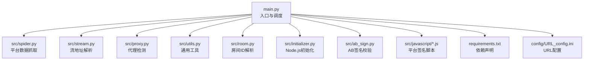
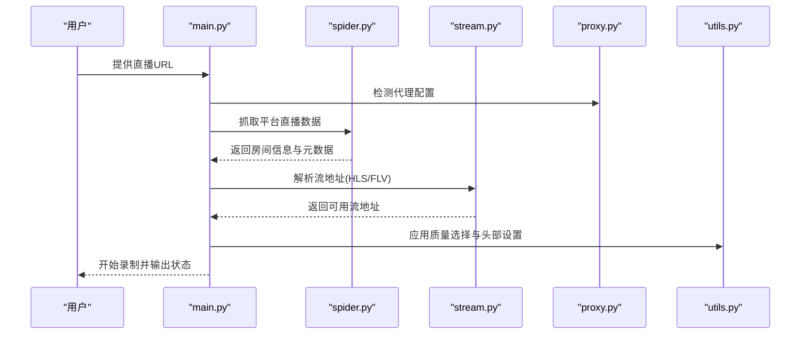
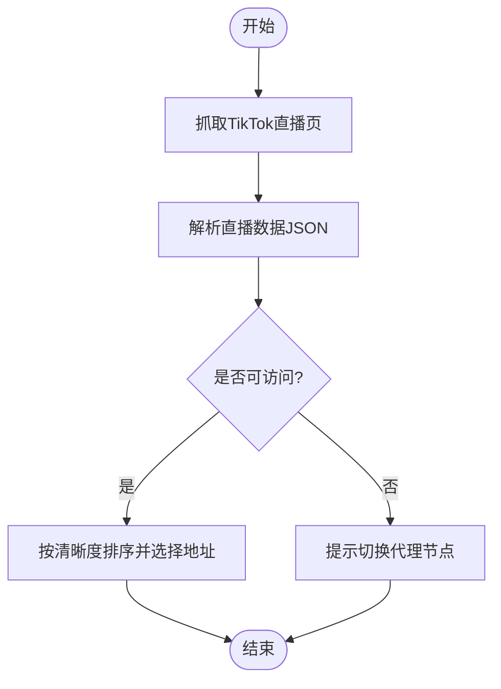
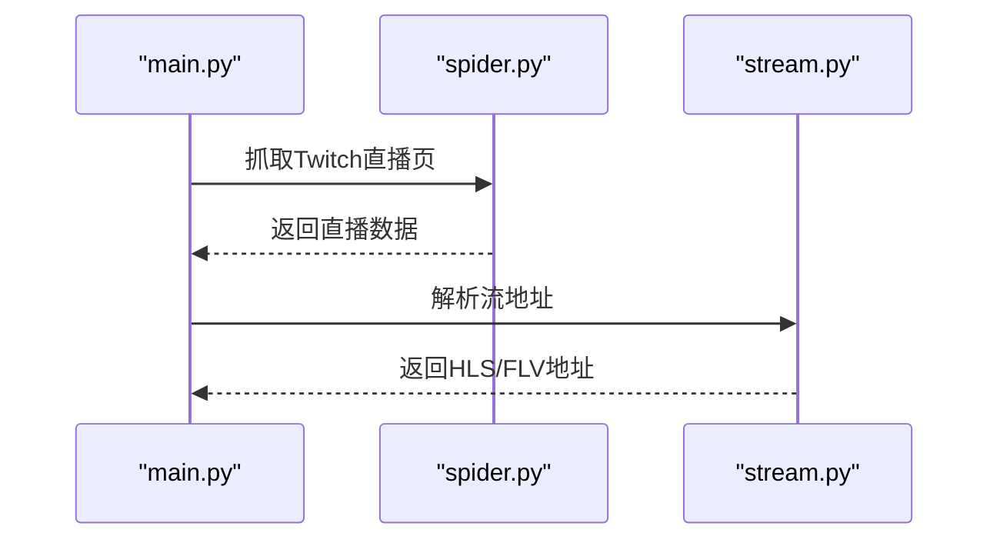
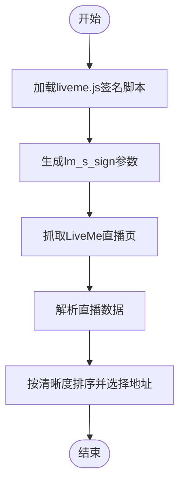
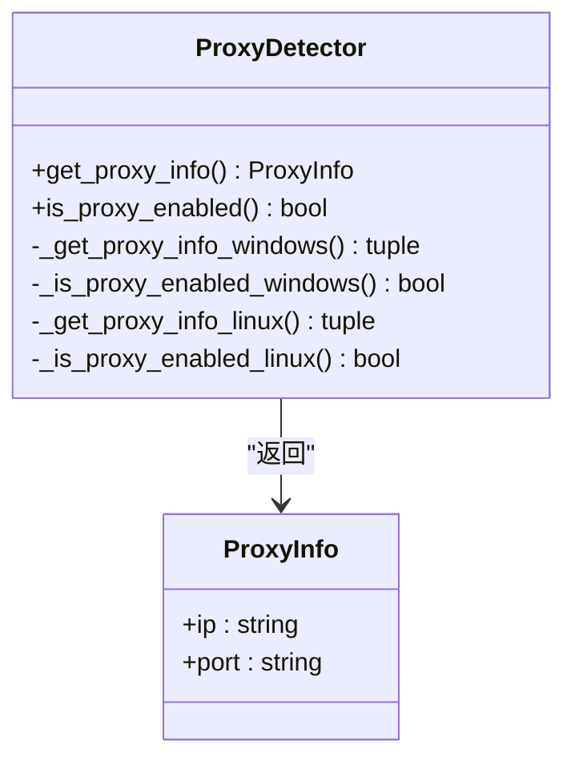
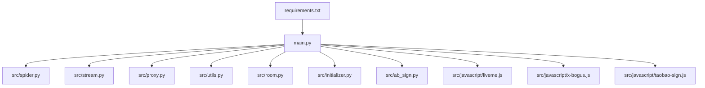

# 海外直播平台

<cite>
**本文档引用的文件**
- [README.md](file://README.md)
- [main.py](file://main.py)
- [src/spider.py](file://src/spider.py)
- [src/stream.py](file://src/stream.py)
- [src/room.py](file://src/room.py)
- [src/proxy.py](file://src/proxy.py)
- [src/utils.py](file://src/utils.py)
- [src/initializer.py](file://src/initializer.py)
- [src/ab_sign.py](file://src/ab_sign.py)
- [src/javascript/liveme.js](file://src/javascript/liveme.js)
- [src/javascript/x-bogus.js](file://src/javascript/x-bogus.js)
- [src/javascript/taobao-sign.js](file://src/javascript/taobao-sign.js)
- [requirements.txt](file://requirements.txt)
- [config/URL_config.ini](file://config/URL_config.ini)
</cite>

## 目录
1. [简介](#简介)
2. [项目结构](#项目结构)
3. [核心组件](#核心组件)
4. [架构总览](#架构总览)
5. [详细组件分析](#详细组件分析)
6. [依赖关系分析](#依赖关系分析)
7. [性能考虑](#性能考虑)
8. [故障排除指南](#故障排除指南)
9. [结论](#结论)
10. [附录](#附录)

## 简介
本项目是一个支持多平台直播录制的工具，涵盖国内外主流直播平台，特别针对海外平台（如TikTok、Twitch、LiveMe等）提供了完整的数据抓取、流地址解析与录制流程。项目采用异步HTTP客户端、代理检测与配置、Node.js集成等方式，适配复杂的网络访问限制与风控机制。

## 项目结构
项目采用模块化设计，核心逻辑集中在src目录下，包含爬虫、流地址解析、代理处理、工具函数等模块；顶层提供入口脚本、配置文件与依赖声明。

**图表来源**
- [main.py:1-2155](file://main.py#L1-L2155)
- [src/spider.py:1-3395](file://src/spider.py#L1-L3395)
- [src/stream.py:1-446](file://src/stream.py#L1-L446)
- [src/proxy.py:1-93](file://src/proxy.py#L1-L93)
- [src/utils.py:1-206](file://src/utils.py#L1-L206)
- [src/room.py:1-151](file://src/room.py#L1-L151)
- [src/initializer.py:1-221](file://src/initializer.py#L1-L221)
- [src/ab_sign.py:1-455](file://src/ab_sign.py#L1-L455)
- [requirements.txt:1-7](file://requirements.txt#L1-L7)
- [config/URL_config.ini:1-5](file://config/URL_config.ini#L1-L5)

**章节来源**
- [README.md:72-100](file://README.md#L72-L100)
- [main.py:1-2155](file://main.py#L1-L2155)

## 核心组件
- 平台数据抓取模块：负责从目标平台抓取直播房间信息、流地址元数据等。
- 流地址解析模块：将抓取到的数据转换为可用的HLS/FLV流地址，并选择合适的清晰度。
- 代理检测与配置模块：检测系统代理、解析代理地址，支持全局代理与特定平台代理。
- 工具函数模块：提供颜色输出、错误追踪、配置读取与更新、查询参数解析等功能。
- 房间ID解析模块：解析抖音类平台的房间ID、用户ID等关键参数。
- Node.js初始化模块：自动检测并安装Node.js，满足平台签名脚本运行需求。
- AB签名校验模块：实现特定平台的签名校验逻辑。
- JavaScript签名脚本：封装平台特有的签名算法，如LiveMe、X-Bogus、淘宝签名校验等。

**章节来源**
- [src/spider.py:1-3395](file://src/spider.py#L1-L3395)
- [src/stream.py:1-446](file://src/stream.py#L1-L446)
- [src/proxy.py:1-93](file://src/proxy.py#L1-L93)
- [src/utils.py:1-206](file://src/utils.py#L1-L206)
- [src/room.py:1-151](file://src/room.py#L1-L151)
- [src/initializer.py:1-221](file://src/initializer.py#L1-L221)
- [src/ab_sign.py:1-455](file://src/ab_sign.py#L1-L455)
- [src/javascript/liveme.js:1-426](file://src/javascript/liveme.js#L1-L426)
- [src/javascript/x-bogus.js:1-564](file://src/javascript/x-bogus.js#L1-L564)
- [src/javascript/taobao-sign.js:1-78](file://src/javascript/taobao-sign.js#L1-L78)

## 架构总览
系统采用异步HTTP请求与模块化设计，入口脚本负责调度各个模块，平台数据抓取模块负责解析网页或API获取直播信息，流地址解析模块负责选择最优清晰度与协议，代理模块负责网络访问控制，工具模块提供通用能力支撑。

**图表来源**
- [main.py:545-800](file://main.py#L545-L800)
- [src/spider.py:285-362](file://src/spider.py#L285-L362)
- [src/stream.py:81-154](file://src/stream.py#L81-L154)
- [src/proxy.py:27-93](file://src/proxy.py#L27-L93)
- [src/utils.py:162-169](file://src/utils.py#L162-L169)

**章节来源**
- [main.py:545-800](file://main.py#L545-L800)

## 详细组件分析

### TikTok平台实现
- 数据抓取：通过异步HTTP请求访问TikTok直播页，解析页面中的直播数据JSON。
- 代理与风控：当代理节点所在区域无法访问TikTok时，会抛出明确的错误提示，指导用户切换节点。
- 流地址解析：解析返回的直播数据，按清晰度排序并选择可用的HLS/FLV地址。

**图表来源**
- [src/spider.py:285-313](file://src/spider.py#L285-L313)
- [src/stream.py:81-154](file://src/stream.py#L81-L154)

**章节来源**
- [src/spider.py:285-313](file://src/spider.py#L285-L313)
- [src/stream.py:81-154](file://src/stream.py#L81-L154)

### Twitch平台实现
- 数据抓取：通过异步HTTP请求访问Twitch直播页，解析页面中的直播数据。
- 流地址解析：解析返回的直播数据，按清晰度排序并选择可用的HLS地址。

**图表来源**
- [src/spider.py:1-3395](file://src/spider.py#L1-L3395)
- [src/stream.py:1-446](file://src/stream.py#L1-L446)

**章节来源**
- [src/spider.py:1-3395](file://src/spider.py#L1-L3395)
- [src/stream.py:1-446](file://src/stream.py#L1-L446)

### LiveMe平台实现
- 数据抓取：通过异步HTTP请求访问LiveMe直播页，解析页面中的直播数据。
- 签名算法：使用JavaScript脚本实现LiveMe的签名算法，生成lm_s_sign参数。
- 流地址解析：解析返回的直播数据，按清晰度排序并选择可用的HLS/FLV地址。

**图表来源**
- [src/javascript/liveme.js:1-426](file://src/javascript/liveme.js#L1-L426)
- [src/spider.py:1-3395](file://src/spider.py#L1-L3395)
- [src/stream.py:1-446](file://src/stream.py#L1-L446)

**章节来源**
- [src/javascript/liveme.js:1-426](file://src/javascript/liveme.js#L1-L426)
- [src/spider.py:1-3395](file://src/spider.py#L1-L3395)
- [src/stream.py:1-446](file://src/stream.py#L1-L446)

### 代理与网络访问限制
- 代理检测：支持Windows/Linux系统的代理检测，自动获取系统代理配置。
- 代理配置：支持全局代理与特定平台代理，针对海外平台可启用独立代理节点。
- 区域封锁应对：当代理节点所在区域无法访问目标平台时，给出明确错误提示，建议切换到其他区域节点。

**图表来源**
- [src/proxy.py:27-93](file://src/proxy.py#L27-L93)

**章节来源**
- [src/proxy.py:1-93](file://src/proxy.py#L1-L93)

### 数据获取与API调用规范
- 异步HTTP客户端：统一使用httpx进行异步请求，支持HTTP/2与代理。
- 请求头管理：根据不同平台设置相应的Referer、Origin、User-Agent等头部。
- JSON解析：解析平台返回的JSON数据，提取房间信息、流地址等关键字段。

**章节来源**
- [src/spider.py:1-3395](file://src/spider.py#L1-L3395)
- [src/utils.py:162-169](file://src/utils.py#L162-L169)

### 流地址解析技术
- 清晰度选择：根据用户配置与平台支持情况，选择合适的清晰度。
- 协议选择：优先选择HLS，必要时回退到FLV。
- 地址有效性验证：对候选地址进行状态检查，确保可访问性。

**章节来源**
- [src/stream.py:1-446](file://src/stream.py#L1-L446)

### 跨地域部署最佳实践
- 代理节点选择：优先选择与目标平台服务器地理位置相近的节点，降低延迟。
- CDN节点选择：结合平台提供的CDN节点列表，选择延迟最低的节点。
- 动态调整并发：根据错误率动态调整并发请求数量，避免触发风控。

**章节来源**
- [main.py:298-325](file://main.py#L298-L325)

## 依赖关系分析
项目依赖包括httpx、PyExecJS、loguru等，分别用于HTTP请求、JavaScript执行与日志记录。Node.js用于执行平台签名脚本。

**图表来源**
- [requirements.txt:1-7](file://requirements.txt#L1-L7)
- [main.py:1-2155](file://main.py#L1-L2155)

**章节来源**
- [requirements.txt:1-7](file://requirements.txt#L1-L7)

## 性能考虑
- 异步请求：使用httpx进行异步HTTP请求，提升并发效率。
- 动态并发控制：根据错误率动态调整并发数量，平衡吞吐与稳定性。
- 缓存与重试：对关键数据进行缓存，减少重复请求；对失败请求进行有限重试。
- 录制优化：支持分段录制与转码，提高录制质量与兼容性。

## 故障排除指南
- 代理不可用：检查系统代理设置或手动配置代理地址，确保能够访问目标平台。
- 签名失败：确认Node.js已正确安装并可执行，检查签名脚本路径与参数。
- 请求超时：适当增加超时时间或切换代理节点，避免触发平台风控。
- 录制中断：检查磁盘空间与FFmpeg安装，确保录制过程稳定。

**章节来源**
- [src/initializer.py:162-221](file://src/initializer.py#L162-L221)
- [src/utils.py:149-160](file://src/utils.py#L149-L160)

## 结论
本项目通过模块化设计与异步架构，实现了对海外直播平台的稳定支持。通过代理检测、签名算法与流地址解析等关键技术，有效应对了网络访问限制与风控挑战。建议在实际部署中结合代理节点选择与CDN策略，进一步优化性能与稳定性。

## 附录
- 平台支持列表与使用说明详见项目README。
- 配置文件示例与参数说明参见config/URL_config.ini。

**章节来源**
- [README.md:15-68](file://README.md#L15-L68)
- [config/URL_config.ini:1-5](file://config/URL_config.ini#L1-L5)