# 代码架构设计

<cite>
**本文档引用的文件**
- [main.py](file://main.py)
- [src/__init__.py](file://src/__init__.py)
- [src/initializer.py](file://src/initializer.py)
- [src/spider.py](file://src/spider.py)
- [src/stream.py](file://src/stream.py)
- [src/room.py](file://src/room.py)
- [src/utils.py](file://src/utils.py)
- [src/http_clients/async_http.py](file://src/http_clients/async_http.py)
- [src/http_clients/sync_http.py](file://src/http_clients/sync_http.py)
- [src/proxy.py](file://src/proxy.py)
- [src/logger.py](file://src/logger.py)
- [src/javascript/x-bogus.js](file://src/javascript/x-bogus.js)
- [src/ab_sign.py](file://src/ab_sign.py)
- [requirements.txt](file://requirements.txt)
- [pyproject.toml](file://pyproject.toml)
- [config/URL_config.ini](file://config/URL_config.ini)
</cite>

## 目录
1. [项目概述](#项目概述)
2. [项目结构](#项目结构)
3. [核心组件](#核心组件)
4. [架构概览](#架构概览)
5. [详细组件分析](#详细组件分析)
6. [依赖分析](#依赖分析)
7. [性能考虑](#性能考虑)
8. [故障排除指南](#故障排除指南)
9. [结论](#结论)

## 项目概述

DouyinLiveRecorder是一个基于Python的直播录制工具，支持40+个国内外直播平台。该项目采用现代化的异步编程模式，结合多种设计模式来实现平台适配和高效的数据采集。

### 主要特性
- **多平台支持**: 抖音、TikTok、B站、虎牙、斗鱼等40+平台
- **异步架构**: 基于asyncio实现高效的并发处理
- **智能代理**: 支持HTTP、HTTPS、SOCKS代理自动检测
- **加密签名**: 实现复杂的反爬虫机制
- **容器化部署**: 提供Docker支持

## 项目结构

项目采用模块化的包结构设计，遵循Python标准的包组织原则：

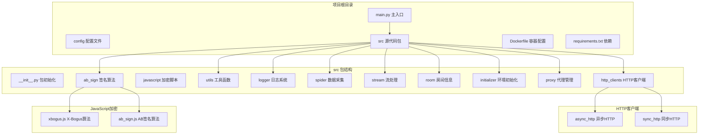

**图表来源**
- [main.py:1-100](file://main.py#L1-L100)
- [src/__init__.py:1-15](file://src/__init__.py#L1-L15)

**章节来源**
- [main.py:1-200](file://main.py#L1-L200)
- [src/__init__.py:1-15](file://src/__init__.py#L1-L15)

## 核心组件

### 1. 异步数据采集层

项目的核心是异步数据采集系统，采用工厂模式和策略模式来处理不同平台的数据获取：

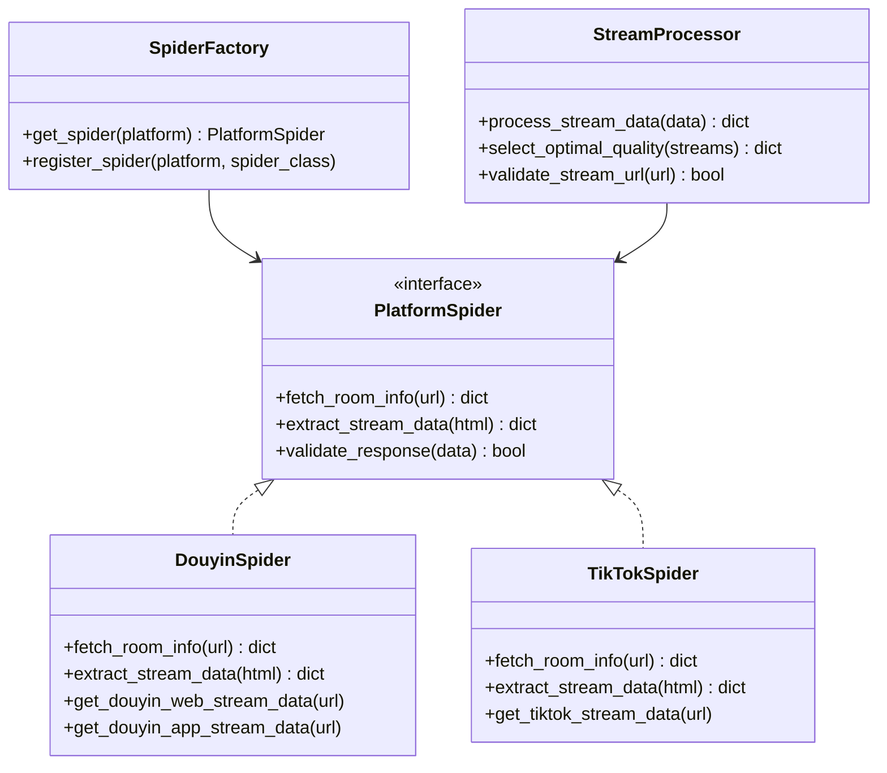

**图表来源**
- [src/spider.py:1-200](file://src/spider.py#L1-L200)
- [src/stream.py:1-100](file://src/stream.py#L1-L100)

### 2. 并发控制机制

项目实现了多层次的并发控制，确保系统的稳定性和效率：

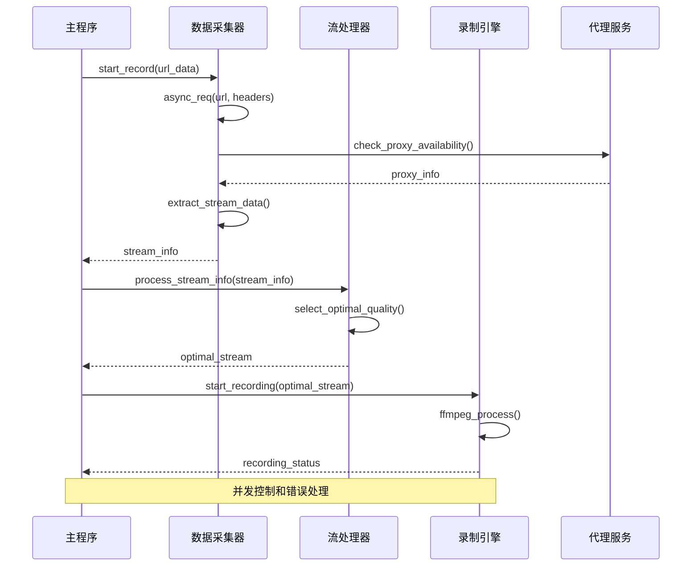

**图表来源**
- [main.py:545-800](file://main.py#L545-L800)
- [src/spider.py:68-282](file://src/spider.py#L68-L282)

**章节来源**
- [src/spider.py:1-3395](file://src/spider.py#L1-L3395)
- [src/stream.py:1-446](file://src/stream.py#L1-L446)
- [main.py:545-800](file://main.py#L545-L800)

## 架构概览

项目采用分层架构设计，每层都有明确的职责和边界：

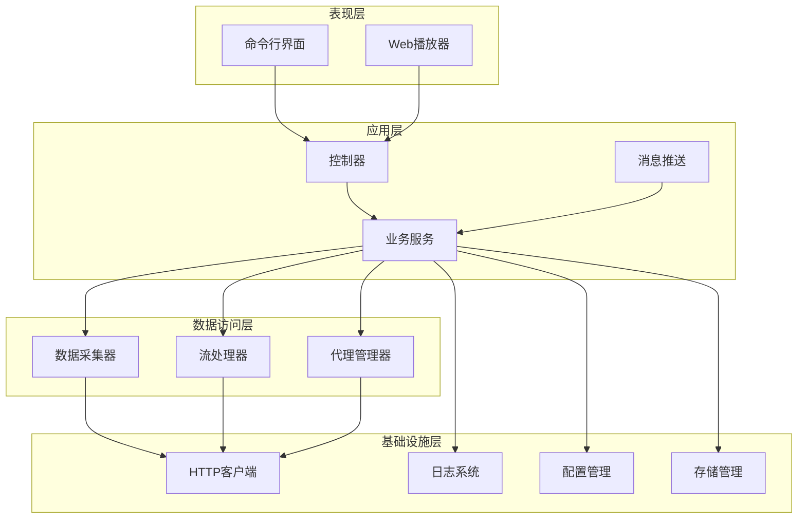

**图表来源**
- [main.py:1-200](file://main.py#L1-L200)
- [src/logger.py:1-44](file://src/logger.py#L1-L44)

### 设计模式应用

#### 工厂模式
项目广泛使用工厂模式来创建不同平台的爬虫实例：

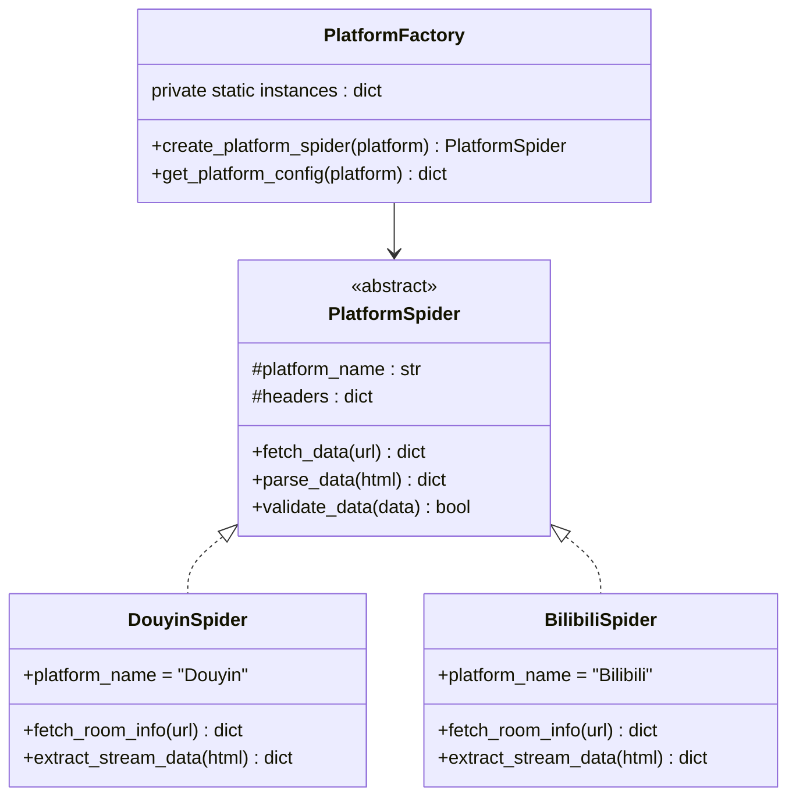

**图表来源**
- [src/spider.py:68-282](file://src/spider.py#L68-L282)

#### 策略模式
项目使用策略模式来处理不同的数据处理策略：

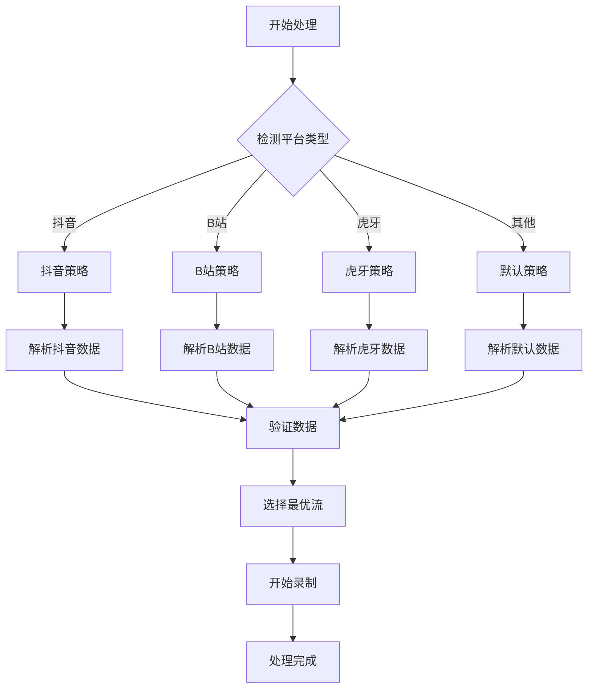

**图表来源**
- [src/stream.py:40-153](file://src/stream.py#L40-L153)

**章节来源**
- [src/spider.py:68-282](file://src/spider.py#L68-L282)
- [src/stream.py:40-153](file://src/stream.py#L40-L153)

## 详细组件分析

### 1. 数据采集组件

#### 抖音数据采集器
抖音作为项目的核心平台，采用了多重数据采集策略：

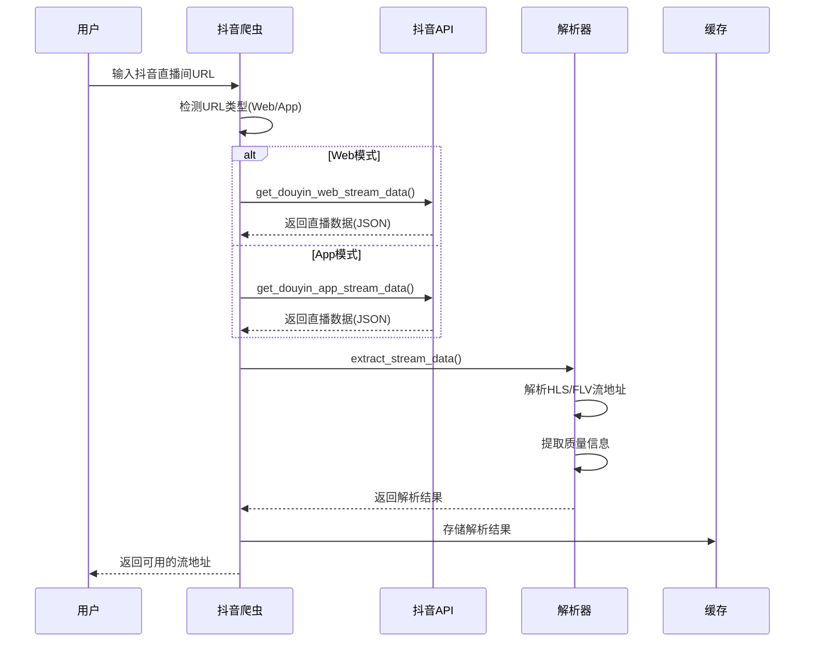

**图表来源**
- [src/spider.py:68-226](file://src/spider.py#L68-L226)

#### 多平台适配策略
项目通过统一的接口适配不同平台的特点：

| 平台 | 特点 | 适配策略 |
|------|------|----------|
| 抖音 | Web/App双模式 | 自动检测URL类型，选择最优模式 |
| TikTok | 国际版限制 | 支持代理访问，处理风控机制 |
| B站 | Cookie认证 | 支持登录态获取最高画质 |
| 虎牙 | CDN防盗链 | 动态生成防跨域参数 |
| 斗鱼 | Token验证 | 执行JS计算生成签名 |

**章节来源**
- [src/spider.py:68-800](file://src/spider.py#L68-L800)

### 2. 流处理组件

#### 流质量选择算法
项目实现了智能的流质量选择机制：

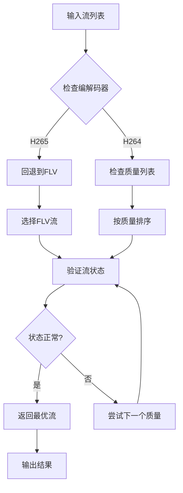

**图表来源**
- [src/stream.py:29-78](file://src/stream.py#L29-L78)

**章节来源**
- [src/stream.py:29-446](file://src/stream.py#L29-L446)

### 3. 代理管理系统

#### 代理检测与配置
项目实现了自动化的代理检测和配置机制：

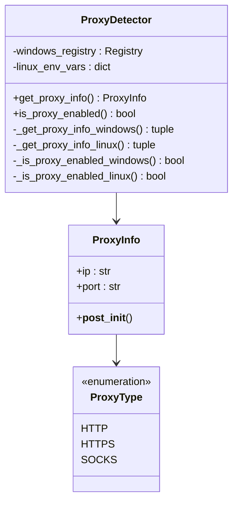

**图表来源**
- [src/proxy.py:27-93](file://src/proxy.py#L27-L93)

**章节来源**
- [src/proxy.py:1-93](file://src/proxy.py#L1-L93)

### 4. 加密与反爬虫机制

#### X-Bogus算法实现
项目实现了复杂的反爬虫算法来绕过平台的安全检测：

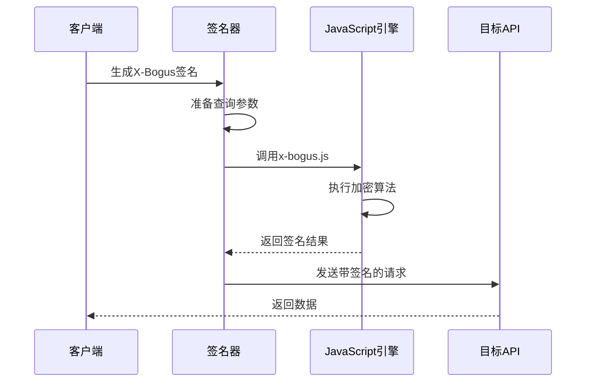

**图表来源**
- [src/room.py:42-48](file://src/room.py#L42-L48)
- [src/javascript/x-bogus.js:500-564](file://src/javascript/x-bogus.js#L500-L564)

**章节来源**
- [src/room.py:42-48](file://src/room.py#L42-L48)
- [src/javascript/x-bogus.js:1-564](file://src/javascript/x-bogus.js#L1-L564)
- [src/ab_sign.py:444-455](file://src/ab_sign.py#L444-L455)

## 依赖分析

### 1. 外部依赖关系

项目采用现代化的依赖管理策略，主要依赖包括：

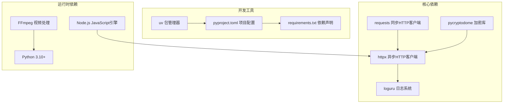

**图表来源**
- [requirements.txt:1-7](file://requirements.txt#L1-L7)
- [pyproject.toml:1-24](file://pyproject.toml#L1-L24)

### 2. 内部模块依赖

项目内部模块之间的依赖关系清晰且层次分明：

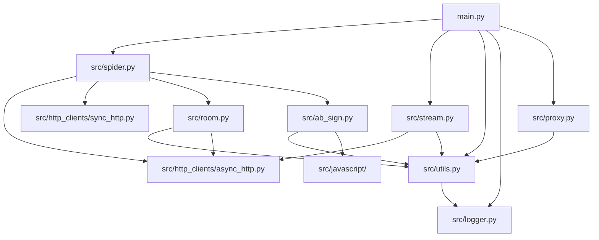

**图表来源**
- [main.py:30-40](file://main.py#L30-L40)
- [src/spider.py:25-32](file://src/spider.py#L25-L32)

**章节来源**
- [requirements.txt:1-7](file://requirements.txt#L1-L7)
- [pyproject.toml:1-24](file://pyproject.toml#L1-L24)
- [main.py:30-40](file://main.py#L30-L40)

## 性能考虑

### 1. 并发性能优化

项目通过多种机制优化并发性能：

- **异步I/O**: 使用asyncio实现非阻塞的网络请求
- **连接池**: httpx内置连接池复用TCP连接
- **限流控制**: 动态调整并发数量避免被封IP
- **资源管理**: 使用上下文管理器确保资源正确释放

### 2. 内存管理

项目实现了高效的内存管理策略：

- **流式处理**: 使用迭代器处理大文件和响应数据
- **垃圾回收**: 合理的变量生命周期管理
- **缓存机制**: 智能缓存减少重复请求

### 3. 错误恢复

项目具备完善的错误恢复机制：

- **重试机制**: 自动重试失败的请求
- **降级策略**: 当API不可用时使用备用方案
- **监控告警**: 实时监控系统状态和性能指标

## 故障排除指南

### 1. 常见问题诊断

#### 网络连接问题
```python
# 检查网络连接状态
def check_network_connection():
    try:
        response = httpx.get("https://www.google.com", timeout=5)
        return response.status_code == 200
    except:
        return False

# 配置代理
proxy_config = {
    "http://": "http://proxy:port",
    "https://": "http://proxy:port"
}
```

#### 代理检测失败
```python
# 手动配置代理
manual_proxy = "127.0.0.1:7890"
proxy_info = ProxyDetector().get_proxy_info()

if not proxy_info.ip:
    # 使用手动配置
    use_manual_proxy(manual_proxy)
```

#### FFmpeg集成问题
```python
# 检查FFmpeg安装
def check_ffmpeg():
    try:
        result = subprocess.run(["ffmpeg", "-version"], 
                              capture_output=True, text=True)
        return result.returncode == 0
    except FileNotFoundError:
        return False
```

### 2. 日志分析

项目使用loguru提供详细的日志记录：

```python
# 日志配置示例
logger.add(
    "logs/error.log",
    level="ERROR",
    format="{time:YYYY-MM-DD HH:mm:ss} | {level} | {message}",
    rotation="10 MB"
)

# 错误捕获和记录
try:
    # 业务逻辑
    pass
except Exception as e:
    logger.error(f"操作失败: {str(e)}")
    logger.exception("详细错误信息")
```

**章节来源**
- [src/logger.py:1-44](file://src/logger.py#L1-L44)
- [src/proxy.py:27-93](file://src/proxy.py#L27-L93)

## 结论

DouyinLiveRecorder项目展现了现代Python项目的最佳实践，通过合理的架构设计和多种设计模式的应用，实现了高性能、可扩展的直播录制解决方案。

### 主要优势

1. **模块化设计**: 清晰的包结构和职责分离
2. **异步架构**: 高效的并发处理能力
3. **平台适配**: 灵活的策略模式实现多平台支持
4. **错误处理**: 完善的异常处理和恢复机制
5. **性能优化**: 多层次的性能优化策略

### 技术亮点

- **工厂模式**: 实现平台爬虫的动态创建
- **策略模式**: 处理不同平台的数据解析策略
- **异步编程**: 基于asyncio的高性能网络请求
- **加密算法**: 复杂的反爬虫机制实现
- **容器化部署**: Docker支持简化部署流程

该项目为开发者提供了一个优秀的参考案例，展示了如何在实际项目中应用各种设计模式和最佳实践来构建高质量的软件系统。