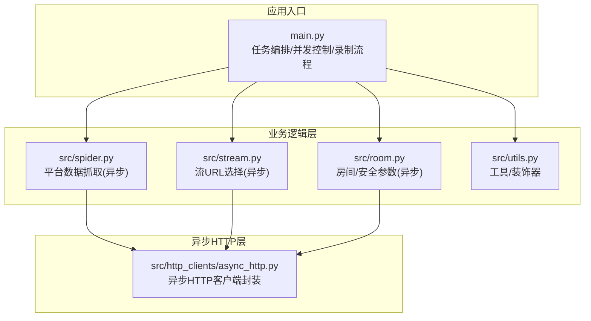
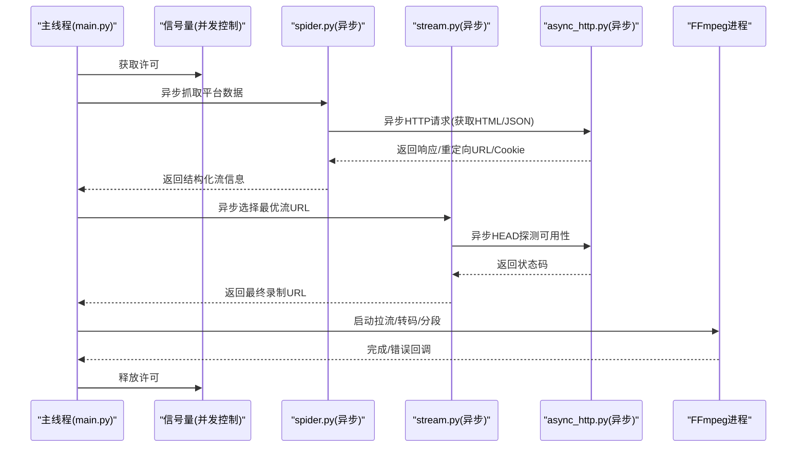
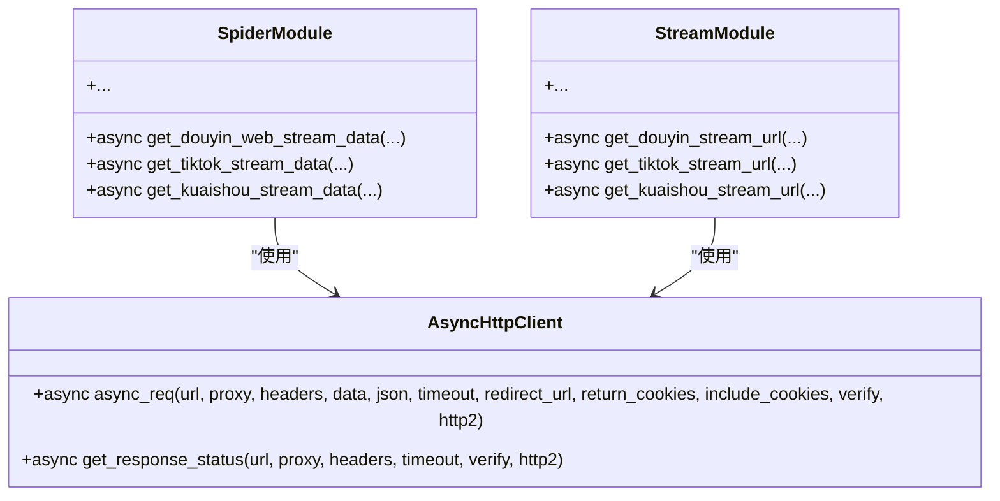
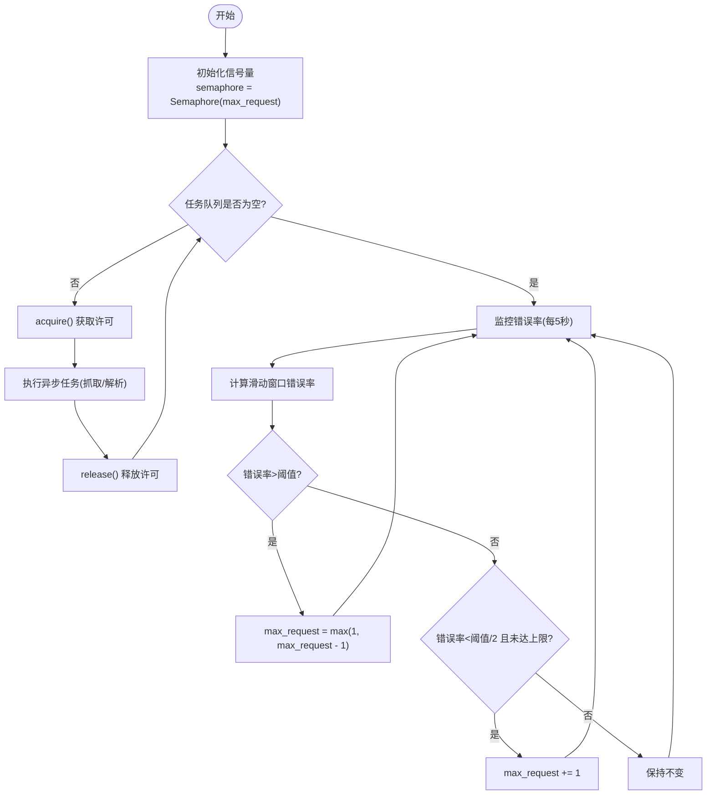
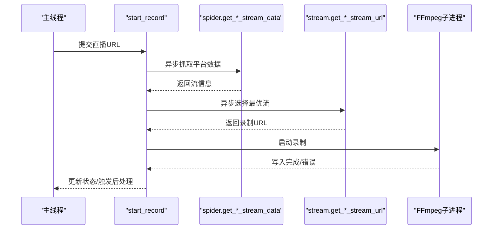
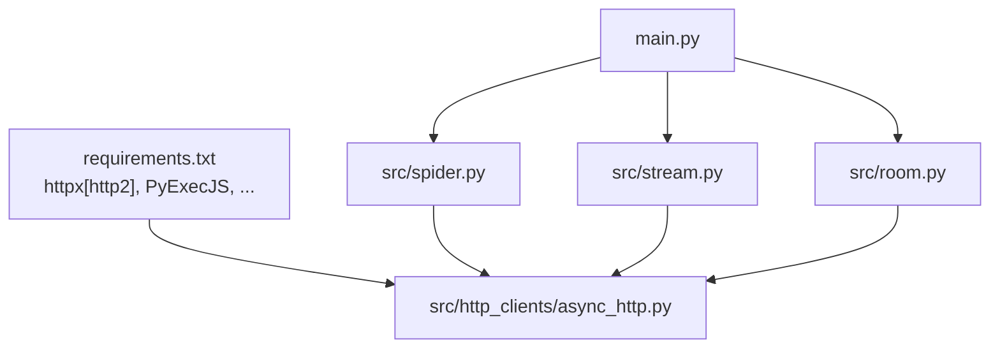

# 异步并发架构

<cite>
**本文档引用的文件**
- [main.py](file://main.py)
- [async_http.py](file://src/http_clients/async_http.py)
- [spider.py](file://src/spider.py)
- [stream.py](file://src/stream.py)
- [room.py](file://src/room.py)
- [utils.py](file://src/utils.py)
- [requirements.txt](file://requirements.txt)
- [demo.py](file://demo.py)
</cite>

## 目录
1. [简介](#简介)
2. [项目结构](#项目结构)
3. [核心组件](#核心组件)
4. [架构总览](#架构总览)
5. [详细组件分析](#详细组件分析)
6. [依赖分析](#依赖分析)
7. [性能考虑](#性能考虑)
8. [故障排查指南](#故障排查指南)
9. [结论](#结论)

## 简介
本项目是一个多平台直播录制工具，采用混合并发模型：主线程与子线程负责I/O密集型任务（如FFmpeg转码、文件操作、定时器等），同时在关键数据采集阶段使用异步HTTP客户端进行高并发网络请求。项目通过信号量实现任务级并发控制，结合自适应错误率调节机制动态调整并发强度，从而在保证稳定性的同时最大化吞吐。

## 项目结构
项目采用按功能模块划分的组织方式，核心目录与职责如下：
- src/http_clients：封装异步HTTP客户端，统一处理代理、超时、重定向与Cookie返回
- src：业务逻辑模块
  - spider.py：各平台直播源解析（异步）
  - stream.py：直播流URL选择与质量适配（异步）
  - room.py：部分平台的房间ID与安全参数计算（异步）
  - utils.py：通用工具函数与装饰器
- 根目录主程序：main.py，负责任务编排、并发控制、录制流程与系统集成

**图表来源**
- [main.py:11-39](file://main.py#L11-L39)
- [async_http.py:10-46](file://src/http_clients/async_http.py#L10-L46)
- [spider.py:31-37](file://src/spider.py#L31-L37)
- [stream.py:24-25](file://src/stream.py#L24-L25)
- [room.py:13-15](file://src/room.py#L13-L15)
- [utils.py:162-168](file://src/utils.py#L162-L168)

**章节来源**
- [main.py:11-39](file://main.py#L11-L39)
- [requirements.txt:1-7](file://requirements.txt#L1-7)

## 核心组件
- 异步HTTP客户端：基于httpx[http2]，支持GET/POST、自动跟随重定向、Cookie提取、SSL验证开关与HTTP/2选项
- 平台爬虫模块：针对不同直播平台的数据解析，统一返回结构化流信息
- 流URL选择模块：根据质量需求与可用性检测，选择最优播放源
- 任务并发控制器：使用信号量限制同时发起的异步任务数量；配合错误率滑动窗口动态调速
- 录制执行器：主线程/子线程负责FFmpeg拉流、转码、分段与后处理

**章节来源**
- [async_http.py:10-46](file://src/http_clients/async_http.py#L10-L46)
- [spider.py:68-226](file://src/spider.py#L68-L226)
- [stream.py:41-153](file://src/stream.py#L41-L153)
- [main.py:48-50](file://main.py#L48-L50)
- [main.py:1813](file://main.py#L1813)

## 架构总览
整体架构采用“主线程+子线程”承载I/O密集型工作，“异步HTTP客户端”承载高并发网络请求的混合并发模型。关键流程：
- 任务编排：主线程维护任务队列、并发信号量、错误统计与动态调速
- 数据采集：每个直播源解析在独立协程中进行，使用异步HTTP客户端
- 流URL选择：根据平台返回的多路流，结合质量与可用性检测选择最佳源
- 录制执行：FFmpeg子进程拉流写入，完成后触发转码/分段/通知等后续流程

**图表来源**
- [main.py:580-779](file://main.py#L580-L779)
- [spider.py:68-226](file://src/spider.py#L68-L226)
- [stream.py:41-153](file://src/stream.py#L41-L153)
- [async_http.py:10-46](file://src/http_clients/async_http.py#L10-L46)

## 详细组件分析

### 异步HTTP客户端设计
- 功能特性
  - GET/POST统一入口，自动处理重定向
  - 支持代理地址标准化、超时设置、SSL验证开关、HTTP/2启用
  - 可选返回重定向后的最终URL、Cookies字典或文本内容
- 使用模式
  - 在spider.py与stream.py中作为底层网络访问组件
  - 每次请求均在异步上下文中创建httpx.AsyncClient，确保非阻塞
- 错误处理
  - 捕获异常并返回字符串形式的错误信息，便于上层统一处理

**图表来源**
- [async_http.py:10-46](file://src/http_clients/async_http.py#L10-L46)
- [spider.py:31-37](file://src/spider.py#L31-L37)
- [stream.py:24-25](file://src/stream.py#L24-L25)

**章节来源**
- [async_http.py:10-46](file://src/http_clients/async_http.py#L10-L46)
- [spider.py:50-65](file://src/spider.py#L50-L65)
- [stream.py:49-56](file://src/stream.py#L49-L56)

### 并发控制策略
- 信号量控制
  - 使用threading.Semaphore(max_request)限制同时进行的异步任务数量
  - 每个直播源解析在with semaphore:块内执行，确保并发上限
- 自适应调速
  - 错误率滑动窗口：固定长度的错误计数队列，计算平均错误率
  - 动态调整max_request：错误率过高则降低并发，过低则适度提升
  - 使用线程锁保护共享变量，避免竞态条件
- 线程与协程分工
  - 协程负责高并发网络请求
  - 主线程/子线程负责FFmpeg子进程、文件IO与定时任务

**图表来源**
- [main.py:1813](file://main.py#L1813)
- [main.py:298-324](file://main.py#L298-L324)

**章节来源**
- [main.py:48-50](file://main.py#L48-L50)
- [main.py:298-324](file://main.py#L298-L324)
- [main.py:1813](file://main.py#L1813)

### 异步任务编排与录制执行
- 任务编排
  - start_record函数为核心编排入口，按平台分支调用spider与stream模块
  - 每个平台解析均在with semaphore:块内执行，避免并发溢出
- 录制执行
  - 使用httpx.Client进行流式下载或通过FFmpeg子进程拉流
  - 录制完成后触发转码、分段、生成时间文件等后续流程
  - 子线程用于生成时间文件，避免阻塞主线程

**图表来源**
- [main.py:545-819](file://main.py#L545-L819)
- [spider.py:68-226](file://src/spider.py#L68-L226)
- [stream.py:41-153](file://src/stream.py#L41-L153)

**章节来源**
- [main.py:545-819](file://main.py#L545-L819)
- [main.py:420-491](file://main.py#L420-L491)

### 线程池与进程池使用场景
- 当前实现
  - 未显式使用concurrent.futures.ProcessPoolExecutor或ThreadPoolExecutor
  - 通过信号量与异步HTTP客户端实现高并发网络请求
  - 录制阶段使用subprocess.Popen启动FFmpeg子进程
- CPU密集型任务识别
  - JavaScript加密参数计算（room.py中的X-bogus/JS执行）属于CPU密集型
  - 当前由PyExecJS在主线程同步执行，可能阻塞事件循环
- 建议
  - 将CPU密集型任务迁移至进程池，避免阻塞异步事件循环
  - 对于I/O密集型任务（网络请求、文件写入）维持现有异步模型

**章节来源**
- [room.py:42-48](file://src/room.py#L42-L48)
- [room.py:52-105](file://src/room.py#L52-L105)
- [requirements.txt:6](file://requirements.txt#L6)

## 依赖分析
- 外部库
  - httpx[http2]：提供异步HTTP客户端与HTTP/2支持
  - PyExecJS：执行JavaScript加密/签名逻辑
  - 其他：requests、loguru、pycryptodome、distro、tqdm
- 模块依赖
  - spider.py/stream.py/room.py均依赖async_http.py进行网络请求
  - main.py依赖spider/stream模块进行数据采集与流选择

**图表来源**
- [requirements.txt:1-7](file://requirements.txt#L1-7)
- [main.py:30-33](file://main.py#L30-L33)
- [spider.py:31-32](file://src/spider.py#L31-L32)
- [stream.py:24](file://src/stream.py#L24)
- [room.py:13](file://src/room.py#L13)

**章节来源**
- [requirements.txt:1-7](file://requirements.txt#L1-7)
- [main.py:30-33](file://main.py#L30-L33)

## 性能考虑
- 并发调优
  - 初始并发数由max_request控制，通过错误率滑动窗口动态调整
  - 建议根据目标平台的限流策略与网络状况逐步调优初始值
- 连接与会话
  - 异步HTTP客户端每次请求新建实例，适合高并发短连接
  - 如需复用连接，可在上层引入连接池（例如在单任务内复用AsyncClient实例）
- 超时与重试
  - 已在异步HTTP客户端中设置超时参数
  - 建议在spider/stream模块增加指数退避重试策略，避免瞬时抖动放大
- I/O与CPU分离
  - 将CPU密集型任务迁移到进程池，减少对事件循环的影响
  - 对磁盘写入与FFmpeg子进程使用合适的缓冲与异步回调

[本节为通用指导，无需特定文件引用]

## 故障排查指南
- 并发相关问题
  - 症状：大量请求失败或被限流
  - 排查：检查错误率滑动窗口与动态调速日志，适当降低max_request
  - 参考：[main.py:298-324](file://main.py#L298-L324)
- 代理与网络问题
  - 症状：平台访问异常或证书错误
  - 排查：确认代理地址标准化逻辑与SSL验证开关
  - 参考：[async_http.py:28](file://src/http_clients/async_http.py#L28)、[utils.py:162-168](file://src/utils.py#L162-L168)
- FFmpeg录制问题
  - 症状：录制中断或无法生成文件
  - 排查：检查FFmpeg命令参数、输出路径权限与磁盘空间
  - 参考：[main.py:420-491](file://main.py#L420-L491)
- CPU密集型阻塞
  - 症状：事件循环卡顿
  - 排查：确认PyExecJS执行位置，必要时迁移至进程池
  - 参考：[room.py:42-48](file://src/room.py#L42-L48)

**章节来源**
- [main.py:298-324](file://main.py#L298-L324)
- [async_http.py:28](file://src/http_clients/async_http.py#L28)
- [utils.py:162-168](file://src/utils.py#L162-L168)
- [main.py:420-491](file://main.py#L420-L491)
- [room.py:42-48](file://src/room.py#L42-L48)

## 结论
该项目通过“异步HTTP + 信号量并发控制 + 子线程I/O”的混合模型，在保证高并发网络请求效率的同时，有效隔离了CPU密集型任务对事件循环的影响。建议进一步引入进程池处理CPU密集型任务、在spider/stream模块增加重试与超时策略，并对连接复用与资源池进行优化，以获得更稳健的性能表现。