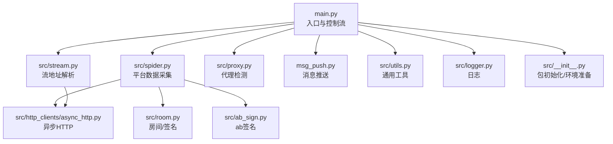
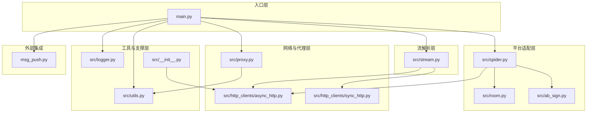
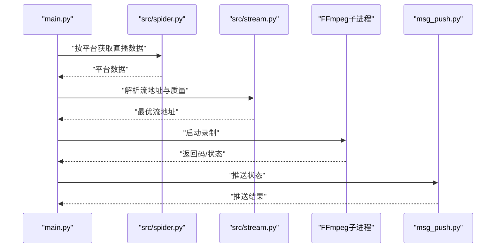
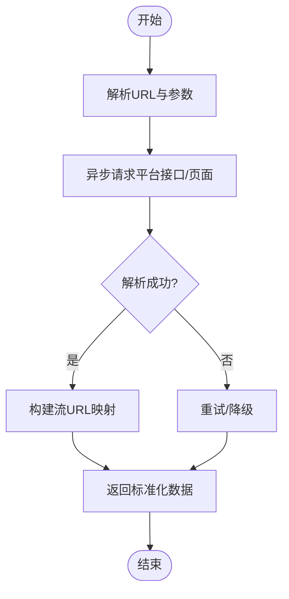
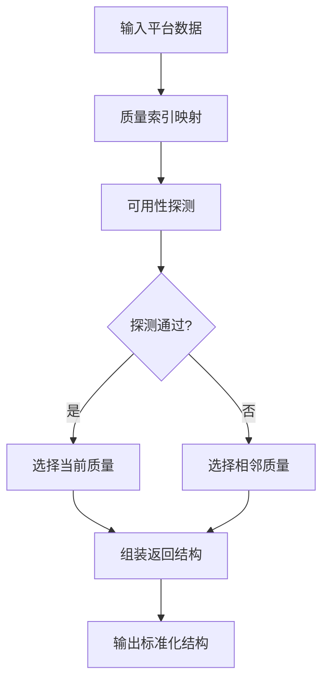
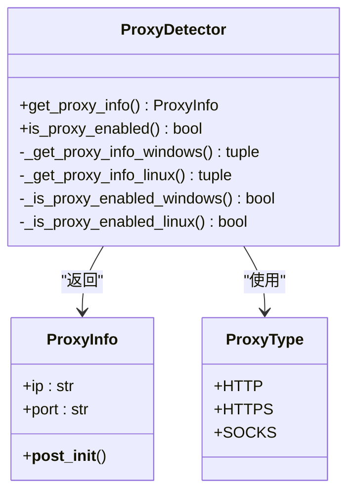
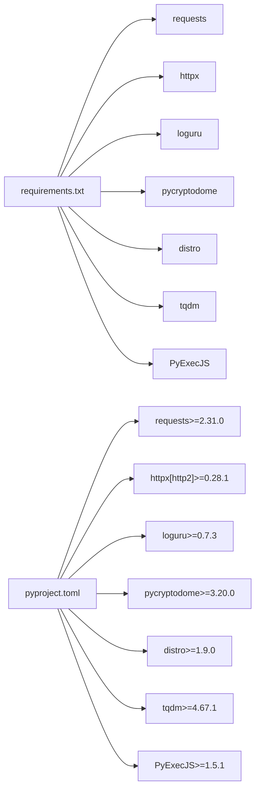

# 模块设计规范

<cite>
**本文档引用的文件**
- [main.py](file://main.py)
- [src/__init__.py](file://src/__init__.py)
- [src/initializer.py](file://src/initializer.py)
- [src/logger.py](file://src/logger.py)
- [src/utils.py](file://src/utils.py)
- [src/spider.py](file://src/spider.py)
- [src/stream.py](file://src/stream.py)
- [src/proxy.py](file://src/proxy.py)
- [src/room.py](file://src/room.py)
- [src/http_clients/async_http.py](file://src/http_clients/async_http.py)
- [src/http_clients/sync_http.py](file://src/http_clients/sync_http.py)
- [msg_push.py](file://msg_push.py)
- [requirements.txt](file://requirements.txt)
- [pyproject.toml](file://pyproject.toml)
- [README.md](file://README.md)
</cite>

## 目录
1. [引言](#引言)
2. [项目结构](#项目结构)
3. [核心组件](#核心组件)
4. [架构总览](#架构总览)
5. [详细组件分析](#详细组件分析)
6. [依赖关系分析](#依赖关系分析)
7. [性能考量](#性能考量)
8. [故障排查指南](#故障排查指南)
9. [结论](#结论)
10. [附录](#附录)

## 引言
本规范旨在为开发者提供一套完整的模块设计与扩展指南，覆盖模块划分原则、职责边界、依赖关系、导入与命名规范、接口设计原则、扩展与兼容性维护策略，以及测试与调试建议。项目采用分层模块化设计，核心模块负责业务流程编排，工具模块提供通用能力，配置模块承载运行参数与外部集成。

## 项目结构
项目采用“包内模块化 + 工具/配置分离”的组织方式：
- 核心入口与控制流：main.py
- 包初始化与环境准备：src/__init__.py
- 平台爬虫与数据采集：src/spider.py
- 流地址解析与质量选择：src/stream.py
- 房间与签名工具：src/room.py、src/ab_sign.py
- 代理与网络适配：src/proxy.py、src/http_clients/*
- 日志与通用工具：src/logger.py、src/utils.py
- 消息推送：msg_push.py
- 依赖声明：requirements.txt、pyproject.toml
- 文档与示例：README.md

图表来源
- [main.py:1-200](file://main.py#L1-L200)
- [src/__init__.py:1-15](file://src/__init__.py#L1-L15)
- [src/spider.py:1-100](file://src/spider.py#L1-L100)
- [src/stream.py:1-100](file://src/stream.py#L1-L100)
- [src/proxy.py:1-93](file://src/proxy.py#L1-L93)
- [src/room.py:1-151](file://src/room.py#L1-L151)
- [src/http_clients/async_http.py:1-60](file://src/http_clients/async_http.py#L1-L60)
- [msg_push.py:1-100](file://msg_push.py#L1-L100)
- [src/logger.py:1-44](file://src/logger.py#L1-L44)
- [src/utils.py:1-206](file://src/utils.py#L1-L206)

章节来源
- [README.md:72-100](file://README.md#L72-L100)
- [pyproject.toml:1-24](file://pyproject.toml#L1-L24)
- [requirements.txt:1-7](file://requirements.txt#L1-L7)

## 核心组件
- 入口与控制流模块（main.py）
  - 职责：任务调度、并发控制、录制流程编排、错误窗口与动态并发调节、消息推送、脚本钩子执行、FFmpeg子进程管理与转码。
  - 关键点：信号处理、线程安全、错误计数与滑动窗口、录制状态维护、文件写入锁。
- 包初始化模块（src/__init__.py）
  - 职责：初始化Node.js路径、检查Node.js可用性、注入PATH以便后续JS计算。
- 平台爬虫模块（src/spider.py）
  - 职责：按平台解析直播数据，统一返回结构；封装异步HTTP请求、X-Bogus/ab签名、房间ID解析。
- 流地址解析模块（src/stream.py）
  - 职责：根据平台返回数据选择最优流地址，处理质量映射与可用性探测。
- 房间与签名工具（src/room.py、src/ab_sign.py）
  - 职责：房间ID/用户ID解析、X-Bogus签名生成、通用请求头与重定向处理。
- 代理与网络适配（src/proxy.py、src/http_clients/*）
  - 职责：跨平台代理检测、HTTP客户端封装（同步/异步）、响应状态探测。
- 日志与通用工具（src/logger.py、src/utils.py）
  - 职责：结构化日志、磁盘容量检查、MD5/JSONP处理、配置读写、颜色输出、代理地址规范化。
- 消息推送模块（msg_push.py）
  - 职责：多渠道推送（钉钉、微信、邮箱、Telegram、Bark、Ntfy、PushPlus）。

章节来源
- [main.py:1-800](file://main.py#L1-L800)
- [src/__init__.py:1-15](file://src/__init__.py#L1-L15)
- [src/spider.py:1-800](file://src/spider.py#L1-L800)
- [src/stream.py:1-446](file://src/stream.py#L1-L446)
- [src/room.py:1-151](file://src/room.py#L1-L151)
- [src/proxy.py:1-93](file://src/proxy.py#L1-L93)
- [src/http_clients/async_http.py:1-60](file://src/http_clients/async_http.py#L1-L60)
- [src/http_clients/sync_http.py:1-89](file://src/http_clients/sync_http.py#L1-L89)
- [src/logger.py:1-44](file://src/logger.py#L1-L44)
- [src/utils.py:1-206](file://src/utils.py#L1-L206)
- [msg_push.py:1-296](file://msg_push.py#L1-L296)

## 架构总览
整体采用“入口编排 + 平台适配 + 流解析 + 工具支撑”的分层架构。入口模块负责任务生命周期管理，平台适配模块负责数据抓取，流解析模块负责地址选择，工具模块提供通用能力，消息模块提供外部联动。

图表来源
- [main.py:1-200](file://main.py#L1-L200)
- [src/spider.py:1-100](file://src/spider.py#L1-L100)
- [src/stream.py:1-100](file://src/stream.py#L1-L100)
- [src/room.py:1-100](file://src/room.py#L1-L100)
- [src/http_clients/async_http.py:1-60](file://src/http_clients/async_http.py#L1-L60)
- [src/http_clients/sync_http.py:1-89](file://src/http_clients/sync_http.py#L1-L89)
- [src/proxy.py:1-93](file://src/proxy.py#L1-L93)
- [src/utils.py:1-100](file://src/utils.py#L1-L100)
- [src/logger.py:1-44](file://src/logger.py#L1-L44)
- [src/__init__.py:1-15](file://src/__init__.py#L1-L15)
- [msg_push.py:1-100](file://msg_push.py#L1-L100)

## 详细组件分析

### 组件A：入口与控制流（main.py）
- 职责边界
  - 任务编排：按URL列表循环监测，动态并发调节，录制状态跟踪。
  - 子进程管理：FFmpeg录制、分段、转码、脚本钩子。
  - 消息推送：按配置推送直播状态变更。
  - 文件与配置：URL配置读取、去重、注释控制、配置项更新。
- 关键流程
  - URL解析与去重 → 平台识别 → 数据采集 → 流地址选择 → FFmpeg录制 → 结果处理与推送。
- 导入与命名
  - 使用相对导入src包内模块，统一使用绝对导入第三方库。
  - 命名采用下划线风格，函数/变量语义明确，避免全局污染。
- 接口设计
  - 函数参数尽量使用关键字参数，返回值统一为None或明确结构，便于测试与追踪。
  - 错误处理采用统一日志记录与异常传播，避免吞异常。

图表来源
- [main.py:545-800](file://main.py#L545-L800)
- [src/spider.py:68-282](file://src/spider.py#L68-L282)
- [src/stream.py:40-153](file://src/stream.py#L40-L153)
- [msg_push.py:327-354](file://msg_push.py#L327-L354)

章节来源
- [main.py:1-800](file://main.py#L1-L800)

### 组件B：平台爬虫（src/spider.py）
- 职责边界
  - 按平台解析直播数据，统一返回结构；封装异步HTTP请求、X-Bogus/ab签名、房间ID解析。
- 关键流程
  - URL解析 → 请求平台接口/页面 → 解析JSON/HTML → 生成流URL映射 → 返回标准化数据。
- 导入与命名
  - 依赖src.http_clients.async_http、src.room、src.utils、src.logger。
  - 函数命名以平台名+动作形式，如get_douyin_web_stream_data。
- 接口设计
  - 统一返回字典结构，包含anchor_name、is_live、title等关键字段。
  - 异常通过装饰器trace_error_decorator统一捕获与记录。

图表来源
- [src/spider.py:68-282](file://src/spider.py#L68-L282)
- [src/http_clients/async_http.py:10-47](file://src/http_clients/async_http.py#L10-L47)
- [src/room.py:42-143](file://src/room.py#L42-L143)

章节来源
- [src/spider.py:1-800](file://src/spider.py#L1-L800)

### 组件C：流地址解析（src/stream.py）
- 职责边界
  - 根据平台返回数据选择最优流地址，处理质量映射与可用性探测。
- 关键流程
  - 输入平台数据 → 质量索引映射 → 可用性探测 → 选择最佳流 → 输出标准化结构。
- 导入与命名
  - 依赖src.utils.trace_error_decorator、src.spider、src.http_clients.async_http。
  - 函数命名以平台名+动作形式，如get_douyin_stream_url。
- 接口设计
  - 统一返回字典结构，包含quality、m3u8_url、flv_url、record_url等字段。
  - 质量映射表与索引计算逻辑清晰，便于扩展新平台。

图表来源
- [src/stream.py:29-78](file://src/stream.py#L29-L78)
- [src/http_clients/async_http.py:49-60](file://src/http_clients/async_http.py#L49-L60)

章节来源
- [src/stream.py:1-446](file://src/stream.py#L1-L446)

### 组件D：代理与网络适配（src/proxy.py、src/http_clients/*）
- 职责边界
  - 跨平台代理检测与配置；HTTP客户端封装（同步/异步），支持代理、超时、重定向、证书校验等。
- 关键流程
  - 代理检测 → 规范化代理地址 → 选择HTTP客户端 → 发起请求 → 返回响应。
- 导入与命名
  - src/proxy.py使用Enum与dataclass描述代理类型与信息。
  - http_clients提供async_req与sync_req两个核心函数。
- 接口设计
  - 统一参数命名（proxy_addr、headers、timeout、verify等），支持返回Cookies、重定向URL等。

图表来源
- [src/proxy.py:8-93](file://src/proxy.py#L8-L93)

章节来源
- [src/proxy.py:1-93](file://src/proxy.py#L1-L93)
- [src/http_clients/async_http.py:1-60](file://src/http_clients/async_http.py#L1-L60)
- [src/http_clients/sync_http.py:1-89](file://src/http_clients/sync_http.py#L1-L89)

### 组件E：日志与通用工具（src/logger.py、src/utils.py）
- 职责边界
  - 结构化日志输出、磁盘空间检查、配置读写、MD5/JSONP处理、颜色输出、代理地址规范化。
- 关键流程
  - 初始化日志器 → 设置格式与级别 → 输出到stderr与文件 → 提供工具函数。
- 导入与命名
  - logger.py仅依赖loguru；utils.py依赖标准库与第三方库，提供多种工具函数。
- 接口设计
  - 工具函数参数明确，返回值类型一致，便于单元测试。

章节来源
- [src/logger.py:1-44](file://src/logger.py#L1-L44)
- [src/utils.py:1-206](file://src/utils.py#L1-L206)

### 组件F：消息推送（msg_push.py）
- 职责边界
  - 多渠道推送（钉钉、微信、邮箱、Telegram、Bark、Ntfy、PushPlus），统一返回成功/失败统计。
- 关键流程
  - 参数解析 → 组装请求体 → 发送HTTP请求 → 解析响应 → 返回统计。
- 导入与命名
  - 使用urllib、smtplib等标准库，函数命名以平台名+动作形式。
- 接口设计
  - 统一返回{"success": [...], "error": [...]}结构，便于上层汇总。

章节来源
- [msg_push.py:1-296](file://msg_push.py#L1-L296)

## 依赖关系分析
- 第三方依赖
  - requests、httpx、loguru、pycryptodome、distro、tqdm、PyExecJS。
- 包内依赖
  - main.py依赖src包内模块；spider/stream依赖http_clients与room/ab_sign；utils/logger为通用依赖。
- 外部集成
  - FFmpeg用于录制与转码；Node.js用于JS签名计算。

图表来源
- [requirements.txt:1-7](file://requirements.txt#L1-L7)
- [pyproject.toml:9-17](file://pyproject.toml#L9-L17)

章节来源
- [requirements.txt:1-7](file://requirements.txt#L1-L7)
- [pyproject.toml:1-24](file://pyproject.toml#L1-L24)

## 性能考量
- 并发与限流
  - 动态调整并发数，基于错误率滑动窗口进行增减，避免触发平台风控。
- I/O与磁盘
  - 录制前检查磁盘空间，避免录制过程中因磁盘不足导致失败。
- 网络与代理
  - 统一代理地址规范化，按平台启用代理，减少无效请求。
- 转码与分段
  - 按需转码与分段录制，降低单文件体积与内存占用。

## 故障排查指南
- 常见问题定位
  - 日志：使用src/logger.py输出DEBUG/ERROR级别日志，定位异常行号。
  - 网络：检查src/http_clients/*的代理与超时配置，确认平台可访问性。
  - FFmpeg：确认ffmpeg_path与环境变量PATH，检查转码与分段命令。
- 错误处理策略
  - 统一使用trace_error_decorator捕获JS执行异常与通用异常，记录堆栈信息。
  - 对HTTP请求异常进行降级与重试，必要时返回空结果或默认值。

章节来源
- [src/logger.py:1-44](file://src/logger.py#L1-L44)
- [src/utils.py:38-51](file://src/utils.py#L38-L51)
- [src/http_clients/async_http.py:43-46](file://src/http_clients/async_http.py#L43-L46)

## 结论
本项目通过清晰的模块划分与严格的接口设计，实现了多平台直播录制的稳定与可扩展。遵循本文档的模块设计规范，可确保新增模块与现有模块的兼容性，提升开发效率与系统可靠性。

## 附录

### 模块划分原则与职责边界
- 核心模块：负责业务流程编排与控制流（main.py）。
- 工具模块：提供通用能力（src/utils.py、src/logger.py、src/proxy.py）。
- 配置模块：承载运行参数与外部集成（msg_push.py、src/__init__.py）。
- 平台适配模块：按平台解析数据与流地址（src/spider.py、src/stream.py、src/room.py、src/ab_sign.py）。
- 网络适配模块：统一HTTP请求与代理处理（src/http_clients/*）。

### 模块导入规范与命名约定
- 导入规范
  - 包内模块使用相对导入，第三方库使用绝对导入。
  - 避免循环导入，尽量在模块末尾导入以减少耦合。
- 命名约定
  - 模块与函数采用下划线命名法，类名采用驼峰命名法。
  - 函数参数尽量使用关键字参数，保持一致性。

### 模块接口设计原则
- 函数签名设计
  - 参数尽量使用关键字参数，提供默认值与类型注解。
  - 返回值统一结构，便于上层处理与测试。
- 参数传递方式
  - 优先使用不可变对象，避免副作用。
- 返回值规范
  - 统一返回字典或元组，包含必要的状态与数据字段。

### 模块扩展指南
- 添加新平台
  - 在src/spider.py中新增平台解析函数，返回标准化数据结构。
  - 在src/stream.py中新增流地址解析函数，处理质量映射与可用性探测。
  - 在main.py中新增平台识别与调用逻辑。
- 维护现有模块的兼容性
  - 保持返回结构不变，新增字段时提供默认值。
  - 严格遵循日志与异常处理规范，确保可观测性。

### 模块测试策略与单元测试编写规范
- 测试策略
  - 单元测试：针对工具函数与独立模块进行测试，覆盖正常与异常路径。
  - 集成测试：模拟平台数据与流地址解析，验证端到端流程。
  - 回归测试：新增平台后，回归既有平台的解析与录制流程。
- 编写规范
  - 使用pytest或unittest框架，测试用例命名以test_开头。
  - 使用mock模拟HTTP请求与外部依赖，确保测试可重复。
  - 对日志输出与文件写入进行断言，确保行为符合预期。