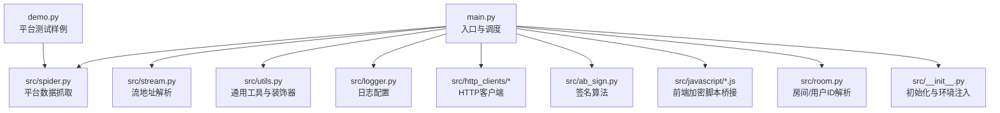
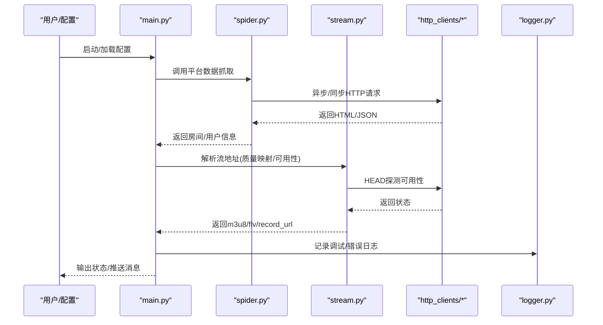
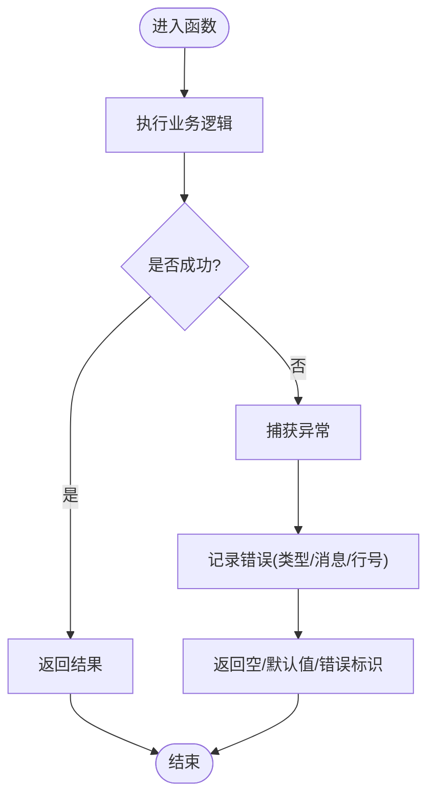
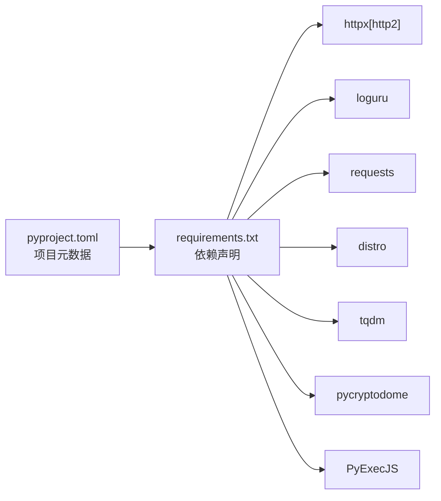

# 编码规范标准

<cite>
**本文引用的文件**
- [README.md](file://README.md)
- [main.py](file://main.py)
- [src/__init__.py](file://src/__init__.py)
- [src/logger.py](file://src/logger.py)
- [src/utils.py](file://src/utils.py)
- [src/spider.py](file://src/spider.py)
- [src/stream.py](file://src/stream.py)
- [src/room.py](file://src/room.py)
- [src/http_clients/async_http.py](file://src/http_clients/async_http.py)
- [src/http_clients/sync_http.py](file://src/http_clients/sync_http.py)
- [src/ab_sign.py](file://src/ab_sign.py)
- [src/javascript/haixiu.js](file://src/javascript/haixiu.js)
- [src/javascript/taobao-sign.js](file://src/javascript/taobao-sign.js)
- [demo.py](file://demo.py)
- [requirements.txt](file://requirements.txt)
- [pyproject.toml](file://pyproject.toml)
</cite>

## 目录
1. [简介](#简介)
2. [项目结构](#项目结构)
3. [核心组件](#核心组件)
4. [架构总览](#架构总览)
5. [详细组件分析](#详细组件分析)
6. [依赖关系分析](#依赖关系分析)
7. [性能考量](#性能考量)
8. [故障排查指南](#故障排查指南)
9. [结论](#结论)
10. [附录](#附录)

## 简介
本文件为“抖音直播录制器”项目的编码规范标准文档，面向开发者制定统一的代码风格、注释、格式化、异常处理与日志记录规范，并提供代码审查检查清单与最佳实践示例。文档依据仓库现有代码进行提炼总结，确保规范与实际实现一致。

## 项目结构
项目采用按功能域分层组织的结构：
- 根目录包含入口脚本、配置文件、国际化资源与容器化配置
- src 包含核心业务逻辑：爬虫、流地址解析、工具、日志、HTTP 客户端、签名算法与 JavaScript 辅助脚本
- demo.py 提供平台测试样例

图表来源
- [main.py](file://main.py)
- [src/spider.py](file://src/spider.py)
- [src/stream.py](file://src/stream.py)
- [src/utils.py](file://src/utils.py)
- [src/logger.py](file://src/logger.py)
- [src/http_clients/async_http.py](file://src/http_clients/async_http.py)
- [src/http_clients/sync_http.py](file://src/http_clients/sync_http.py)
- [src/ab_sign.py](file://src/ab_sign.py)
- [src/javascript/haixiu.js](file://src/javascript/haixiu.js)
- [src/javascript/taobao-sign.js](file://src/javascript/taobao-sign.js)
- [src/room.py](file://src/room.py)
- [src/__init__.py](file://src/__init__.py)
- [demo.py](file://demo.py)

章节来源
- [README.md](file://README.md)
- [main.py](file://main.py)
- [src/__init__.py](file://src/__init__.py)

## 核心组件
- 日志系统：基于 loguru，统一输出到控制台与文件，区分 DEBUG/INFO 级别与上下文信息
- 异步 HTTP 客户端：封装 httpx，支持代理、超时、HTTP/2、HEAD 预检
- 工具与装饰器：统一异常捕获与错误上报、MD5、Cookie 序列化、去重、磁盘容量检查、随机字符串生成等
- 平台爬虫：针对各直播平台的 HTML/JSON 解析与流地址提取
- 流地址解析：统一质量映射、优先选择、可用性探测与回退策略
- 签名与加密：SM3、RC4、Base64 自定义变种与 JS 加密脚本桥接
- 初始化与环境：Node.js 检测与 PATH 注入

章节来源
- [src/logger.py](file://src/logger.py)
- [src/http_clients/async_http.py](file://src/http_clients/async_http.py)
- [src/http_clients/sync_http.py](file://src/http_clients/sync_http.py)
- [src/utils.py](file://src/utils.py)
- [src/spider.py](file://src/spider.py)
- [src/stream.py](file://src/stream.py)
- [src/ab_sign.py](file://src/ab_sign.py)
- [src/javascript/haixiu.js](file://src/javascript/haixiu.js)
- [src/javascript/taobao-sign.js](file://src/javascript/taobao-sign.js)
- [src/room.py](file://src/room.py)
- [src/__init__.py](file://src/__init__.py)

## 架构总览
系统由入口调度模块协调各子模块，形成“入口 → 爬虫 → 流解析 → 录制/转码/分段 → 推送/脚本”的闭环。

图表来源
- [main.py](file://main.py)
- [src/spider.py](file://src/spider.py)
- [src/stream.py](file://src/stream.py)
- [src/http_clients/async_http.py](file://src/http_clients/async_http.py)
- [src/http_clients/sync_http.py](file://src/http_clients/sync_http.py)
- [src/logger.py](file://src/logger.py)

## 详细组件分析

### 日志与异常处理规范
- 日志格式
  - 控制台：时间、级别、消息，带颜色
  - 文件：时间、级别、来源模块/函数/行号、消息
  - INFO 与非 INFO 分离轮转，大小限制与保留期
- 异常处理
  - 统一装饰器捕获底层 JS 执行错误与通用异常，记录错误类型、消息与所在函数行号
  - HTTP 请求异常捕获并返回字符串，便于后续容错
  - 关键流程（如 FFmpeg 子进程）异常记录并清理状态

图表来源
- [src/utils.py](file://src/utils.py)
- [src/logger.py](file://src/logger.py)
- [src/http_clients/async_http.py](file://src/http_clients/async_http.py)

章节来源
- [src/logger.py](file://src/logger.py)
- [src/utils.py](file://src/utils.py)
- [src/http_clients/async_http.py](file://src/http_clients/async_http.py)
- [src/http_clients/sync_http.py](file://src/http_clients/sync_http.py)

### HTTP 客户端与请求规范
- 异步客户端
  - 支持 GET/POST、代理、超时、HTTP/2、跟随重定向
  - HEAD 预检仅返回状态码，用于可用性探测
- 同步客户端
  - 支持 urllib/requests，自动处理 gzip、代理、编码
- 通用代理处理
  - 自动补全 http:// 前缀，避免无效代理

章节来源
- [src/http_clients/async_http.py](file://src/http_clients/async_http.py)
- [src/http_clients/sync_http.py](file://src/http_clients/sync_http.py)
- [src/utils.py](file://src/utils.py)

### 爬虫与流解析规范
- 爬虫
  - 统一装饰器包装，异常转为错误日志
  - 平台特定解析：正则匹配、JSON 解析、CDN 优选
- 流解析
  - 质量映射：原画/蓝光/超清/高清/标清/流畅
  - 可用性探测：HEAD 检查，失败回退到次优质量
  - 多平台差异化处理：Huya 的抗反爬参数拼接、Bilibili 的多接口回退

章节来源
- [src/spider.py](file://src/spider.py)
- [src/stream.py](file://src/stream.py)

### 签名与加密规范
- SM3/RC4/Base64 自定义变种：用于生成 a_bogus/X-Bogus 等参数
- JS 加密脚本桥接：通过 PyExecJS 调用，保持与前端一致的签名逻辑
- 注意：JS 脚本中存在混淆与常量替换，调用时需确保依赖库与路径正确

章节来源
- [src/ab_sign.py](file://src/ab_sign.py)
- [src/javascript/haixiu.js](file://src/javascript/haixiu.js)
- [src/javascript/taobao-sign.js](file://src/javascript/taobao-sign.js)

### 工具与通用能力
- 错误追踪装饰器：自动记录异常行号与函数名
- MD5/JSON/URL 参数解析：统一工具函数
- 配置读写：安全转义百分号，避免写入异常
- 磁盘容量检查：按根分区统计可用空间
- 去重与文件路径遍历：提升配置与文件处理效率

章节来源
- [src/utils.py](file://src/utils.py)

### 入口与调度规范
- 全局状态与锁：并发控制、错误窗口统计、动态调整并发
- FFmpeg 调用：支持分段、转码、删除原始文件、生成时间文件
- 消息推送：多通道聚合调用，失败记录并继续
- 脚本执行：支持 Python/Bash/批处理，参数标准化传递

章节来源
- [main.py](file://main.py)

## 依赖关系分析
- Python 版本要求：>=3.10
- 关键依赖：httpx[http2]、loguru、requests、PyCryptodome、distro、tqdm、PyExecJS
- 项目元数据：名称、版本、描述、作者、许可证、主页、仓库、问题跟踪

图表来源
- [pyproject.toml](file://pyproject.toml)
- [requirements.txt](file://requirements.txt)

章节来源
- [pyproject.toml](file://pyproject.toml)
- [requirements.txt](file://requirements.txt)

## 性能考量
- 并发与限流：动态调整同时访问网络的线程数，基于错误率滑动窗口自适应
- 可用性探测：HEAD 预检减少无效下载，提高成功率
- 转码与分段：按需启用，避免不必要的 CPU 开销
- 日志轮转：限制单文件大小与保留期，平衡可观测性与磁盘占用

章节来源
- [main.py](file://main.py)
- [src/http_clients/async_http.py](file://src/http_clients/async_http.py)
- [src/logger.py](file://src/logger.py)

## 故障排查指南
- 日志定位
  - 查看 logs/streamget.log（非 INFO）与 logs/PlayURL.log（INFO）
  - 关注时间戳、模块/函数/行号、错误类型
- 常见问题
  - HTTP 请求异常：确认代理、超时、证书验证、HTTP/2 设置
  - JS 执行失败：检查 Node.js 环境与 JS 脚本路径
  - FFmpeg 异常：核对命令参数、输入输出路径、权限与磁盘空间
- 快速验证
  - 使用 demo.py 指定平台与可选代理/Cookie，观察日志输出

章节来源
- [src/logger.py](file://src/logger.py)
- [src/utils.py](file://src/utils.py)
- [demo.py](file://demo.py)

## 结论
本规范以仓库现有实现为基础，明确了日志、异常、HTTP 客户端、爬虫与流解析、签名加密、工具函数与入口调度的编码标准。建议在新功能开发中严格遵循，以保持一致性与可维护性。

## 附录

### 编码规范总览

- 变量命名
  - 使用下划线命名法（snake_case），语义明确，避免缩写
  - 常量使用全大写与下划线（如 QUALITY_MAPPING）

- 函数命名
  - 动词短语，清晰表达意图（如 get_douyin_stream_data、check_md5）
  - 异步函数以 async_ 前缀或以 async/await 明确

- 类命名
  - 首字母大写（PascalCase），单一职责，必要时提供清晰的构造/析构说明

- 注释规范
  - 模块头部注释：作者、来源、日期、更新时间、版权与功能概述
  - 函数注释：参数类型与含义、返回值、异常、示例（若有）
  - 类注释：用途、属性、方法、继承关系（若有）
  - 行内注释：解释复杂逻辑、边界条件、兼容性说明

- 代码格式化
  - 缩进：统一使用 4 空格
  - 行长度：建议不超过 100 列，必要时换行
  - 空行：模块级导入后空一行；类/函数之间空一行；逻辑分组内适当空行
  - 导入顺序：标准库、第三方库、项目内模块，每组内字母序排列

- 异常处理
  - 统一装饰器捕获底层异常并记录
  - HTTP 请求捕获异常返回字符串，便于上层容错
  - 关键流程异常记录并清理状态，避免资源泄漏

- 日志记录
  - 控制台彩色输出，文件分离 INFO 与非 INFO
  - 格式包含时间、级别、来源模块/函数/行号、消息
  - 重要事件与错误必须落盘，便于问题复现

- 代码审查检查清单
  - 是否遵循命名与注释规范
  - 是否存在硬编码字符串（如 URL/Headers），是否抽取为常量
  - 是否使用统一的 HTTP 客户端与代理处理
  - 是否使用装饰器统一异常捕获
  - 是否记录必要的日志
  - 是否考虑并发与资源清理
  - 是否有单元/集成测试覆盖关键路径

- 最佳实践示例（基于现有实现）
  - 使用装饰器统一捕获异常并记录行号
  - 使用 async_req/get_response_status 统一 HTTP 请求与可用性探测
  - 使用 QUALITY_MAPPING 统一质量映射与回退策略
  - 使用 logger 统一输出与文件落盘
  - 使用 utils.handle_proxy_addr 统一代理地址处理

章节来源
- [src/spider.py](file://src/spider.py)
- [src/stream.py](file://src/stream.py)
- [src/utils.py](file://src/utils.py)
- [src/logger.py](file://src/logger.py)
- [src/http_clients/async_http.py](file://src/http_clients/async_http.py)
- [src/http_clients/sync_http.py](file://src/http_clients/sync_http.py)
- [main.py](file://main.py)