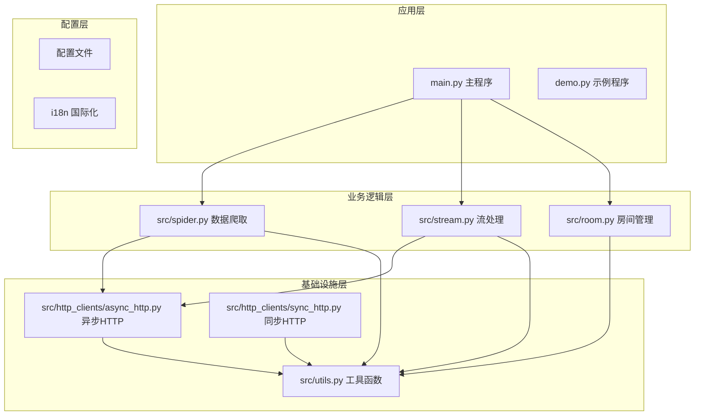
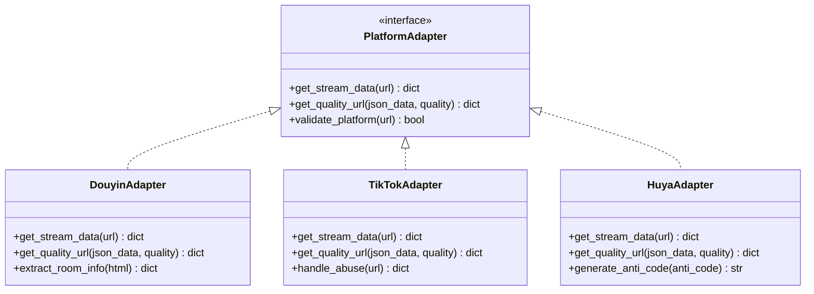
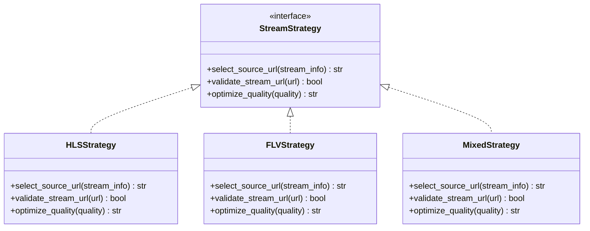
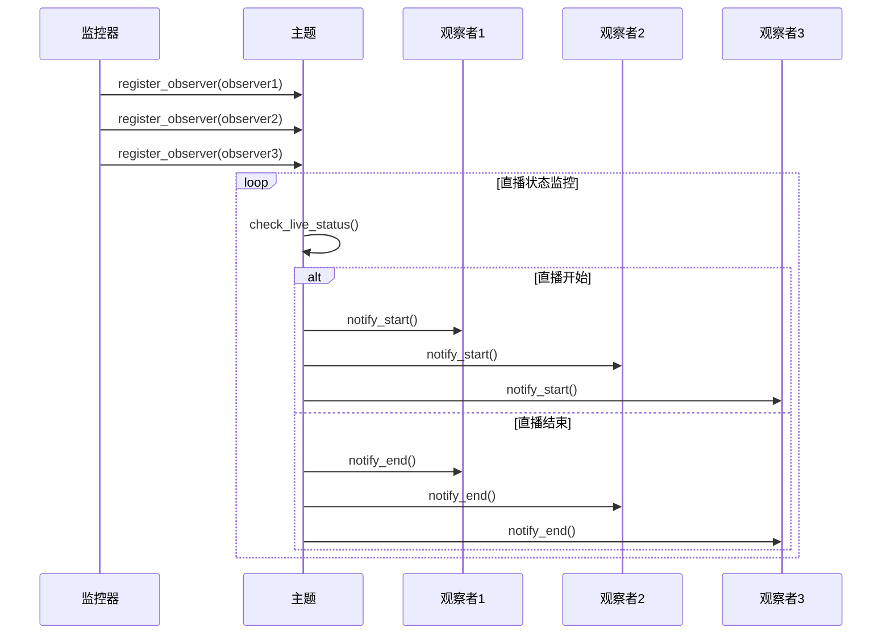
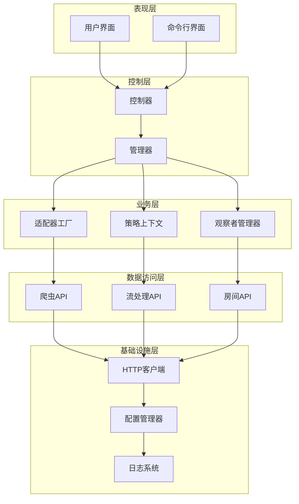
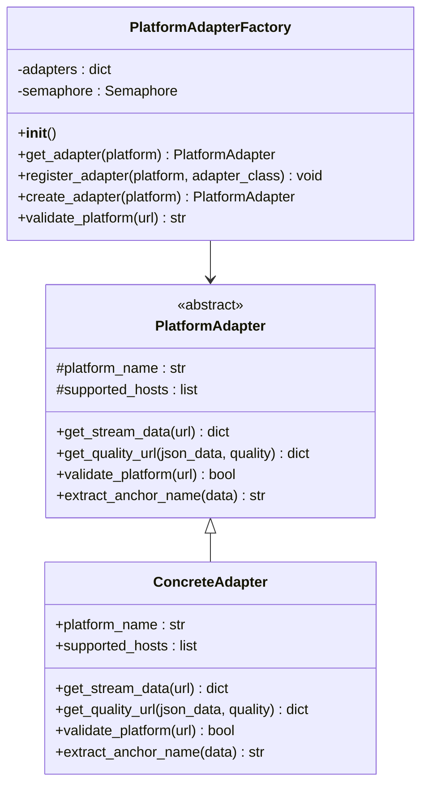
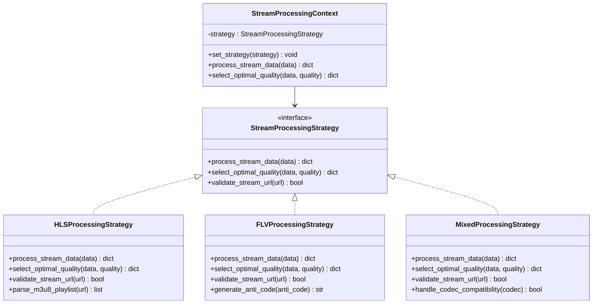
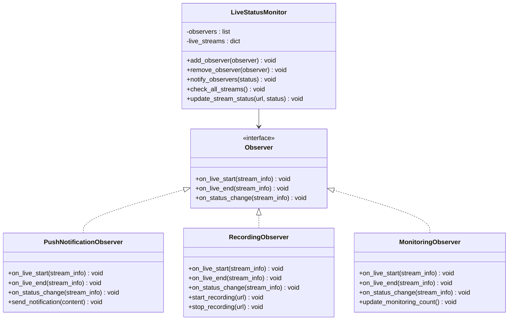
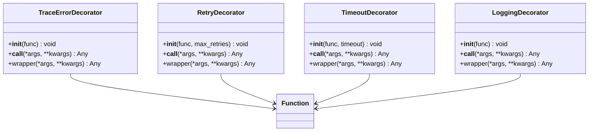
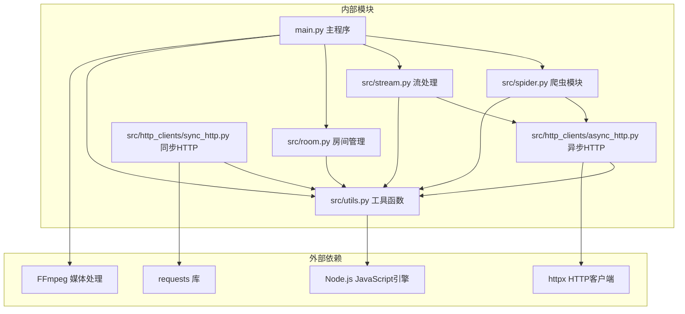

# 设计模式应用

<cite>
**本文档引用的文件**
- [main.py](file://main.py)
- [spider.py](file://src/spider.py)
- [stream.py](file://src/stream.py)
- [room.py](file://src/room.py)
- [utils.py](file://src/utils.py)
- [async_http.py](file://src/http_clients/async_http.py)
- [sync_http.py](file://src/http_clients/sync_http.py)
- [demo.py](file://demo.py)
</cite>

## 目录
1. [简介](#简介)
2. [项目结构](#项目结构)
3. [核心组件](#核心组件)
4. [架构概览](#架构概览)
5. [详细组件分析](#详细组件分析)
6. [依赖分析](#依赖分析)
7. [性能考虑](#性能考虑)
8. [故障排除指南](#故障排除指南)
9. [结论](#结论)

## 简介

本文档深入分析了抖音直播录制器项目中的设计模式应用。该项目是一个复杂的直播录制系统，支持超过40个不同的直播平台，采用多种设计模式来实现高可扩展性和可维护性。

该系统通过工厂模式实现平台适配器管理，通过策略模式处理不同直播平台的差异化处理逻辑，通过观察者模式实现直播状态监控。这些设计模式的综合应用使得系统能够轻松扩展新的直播平台，同时保持代码的清晰性和可维护性。

## 项目结构

项目采用模块化的架构设计，主要分为以下几个层次：

**图表来源**
- [main.py:1-200](file://main.py#L1-L200)
- [spider.py:1-100](file://src/spider.py#L1-L100)
- [stream.py:1-100](file://src/stream.py#L1-L100)

**章节来源**
- [main.py:1-200](file://main.py#L1-L200)
- [spider.py:1-100](file://src/spider.py#L1-L100)
- [stream.py:1-100](file://src/stream.py#L1-L100)

## 核心组件

### 平台适配器系统

系统实现了统一的平台适配器接口，通过工厂模式管理不同直播平台的差异化处理逻辑：

**图表来源**
- [main.py:580-800](file://main.py#L580-L800)
- [spider.py:68-226](file://src/spider.py#L68-L226)

### 策略模式实现

系统使用策略模式来处理不同直播平台的差异化需求：

**图表来源**
- [main.py:530-543](file://main.py#L530-L543)
- [stream.py:40-78](file://src/stream.py#L40-L78)

### 观察者模式实现

系统采用观察者模式实现直播状态监控和通知机制：

**图表来源**
- [main.py:327-354](file://main.py#L327-L354)
- [main.py:1087-1111](file://main.py#L1087-L1111)

**章节来源**
- [main.py:530-543](file://main.py#L530-L543)
- [main.py:327-354](file://main.py#L327-L354)
- [main.py:1087-1111](file://main.py#L1087-L1111)

## 架构概览

系统采用分层架构设计，通过多种设计模式实现松耦合和高内聚：

**图表来源**
- [main.py:1713-1782](file://main.py#L1713-L1782)
- [spider.py:1-100](file://src/spider.py#L1-L100)
- [stream.py:1-100](file://src/stream.py#L1-L100)

**章节来源**
- [main.py:1713-1782](file://main.py#L1713-L1782)
- [spider.py:1-100](file://src/spider.py#L1-L100)
- [stream.py:1-100](file://src/stream.py#L1-L100)

## 详细组件分析

### 工厂模式：平台适配器工厂

系统实现了统一的平台适配器工厂，用于创建和管理不同直播平台的适配器实例：

#### 适配器工厂类结构

**图表来源**
- [main.py:580-1040](file://main.py#L580-L1040)
- [spider.py:68-226](file://src/spider.py#L68-L226)

#### 工厂模式实现要点

1. **统一接口**：所有平台适配器都实现相同的接口，确保调用的一致性
2. **延迟加载**：适配器按需创建，减少内存占用
3. **配置驱动**：通过配置文件动态注册新的平台适配器
4. **线程安全**：使用信号量确保并发访问的安全性

**章节来源**
- [main.py:580-1040](file://main.py#L580-L1040)
- [spider.py:68-226](file://src/spider.py#L68-L226)

### 策略模式：直播流处理策略

系统使用策略模式来处理不同直播平台的差异化流处理需求：

#### 策略模式类结构

**图表来源**
- [stream.py:40-153](file://src/stream.py#L40-L153)
- [main.py:530-543](file://main.py#L530-L543)

#### 策略模式实现要点

1. **算法封装**：将不同的流处理算法封装在独立的策略类中
2. **运行时切换**：根据直播平台类型动态选择合适的处理策略
3. **扩展性**：新增平台时只需实现新的策略类，无需修改现有代码
4. **一致性**：所有策略类都实现相同的接口，确保调用的一致性

**章节来源**
- [stream.py:40-153](file://src/stream.py#L40-L153)
- [main.py:530-543](file://main.py#L530-L543)

### 观察者模式：直播状态监控

系统采用观察者模式实现直播状态的实时监控和通知：

#### 观察者模式实现

**图表来源**
- [main.py:327-354](file://main.py#L327-L354)
- [main.py:98-135](file://main.py#L98-L135)

#### 观察者模式实现要点

1. **解耦设计**：监控逻辑与通知逻辑分离，降低耦合度
2. **多播支持**：一个直播状态变化可以通知多个观察者
3. **动态注册**：支持运行时动态添加或移除观察者
4. **异步通知**：使用线程池实现异步通知，避免阻塞主流程

**章节来源**
- [main.py:327-354](file://main.py#L327-L354)
- [main.py:98-135](file://main.py#L98-L135)

### 装饰器模式：错误处理和日志记录

系统广泛使用装饰器模式来增强函数的功能：

#### 装饰器模式实现

**图表来源**
- [utils.py:38-51](file://src/utils.py#L38-L51)

**章节来源**
- [utils.py:38-51](file://src/utils.py#L38-L51)

## 依赖分析

系统采用模块化设计，各组件之间的依赖关系清晰明确：

**图表来源**
- [main.py:11-40](file://main.py#L11-L40)
- [spider.py:21-32](file://src/spider.py#L21-L32)
- [stream.py:11-24](file://src/stream.py#L11-L24)

**章节来源**
- [main.py:11-40](file://main.py#L11-L40)
- [spider.py:21-32](file://src/spider.py#L21-L32)
- [stream.py:11-24](file://src/stream.py#L11-L24)

## 性能考虑

系统在设计时充分考虑了性能优化：

### 并发控制
- 使用信号量限制同时访问网络的线程数量
- 实现动态调整机制，根据错误率自动调整并发度
- 采用异步HTTP请求减少阻塞等待

### 缓存策略
- 平台适配器实例缓存，避免重复创建
- 流URL验证结果缓存，减少重复验证
- Cookie和Token缓存，减少认证开销

### 内存管理
- 及时释放不再使用的资源
- 使用生成器处理大文件
- 定期清理临时文件

## 故障排除指南

### 常见问题及解决方案

#### 平台适配器问题
1. **问题**：特定平台无法识别
   - **解决方案**：检查URL匹配规则，确认平台主机名配置正确
   - **代码参考**：[main.py:580-1040](file://main.py#L580-L1040)

2. **问题**：流URL解析失败
   - **解决方案**：检查目标平台的反爬虫机制，可能需要更新签名算法
   - **代码参考**：[spider.py:68-226](file://src/spider.py#L68-L226)

#### 策略模式问题
1. **问题**：选择错误的流格式
   - **解决方案**：检查`select_source_url`函数的逻辑，确认HLS和FLV的优先级设置
   - **代码参考**：[main.py:530-543](file://main.py#L530-L543)

2. **问题**：质量选择不准确
   - **解决方案**：检查质量映射表，确认不同平台的质量标识符
   - **代码参考**：[stream.py:26-37](file://src/stream.py#L26-L37)

#### 观察者模式问题
1. **问题**：直播状态通知延迟
   - **解决方案**：检查监控线程的睡眠时间，适当调整检测频率
   - **代码参考**：[main.py:98-135](file://main.py#L98-L135)

2. **问题**：通知渠道配置错误
   - **解决方案**：检查推送配置，确认各个通知渠道的API密钥正确
   - **代码参考**：[main.py:327-354](file://main.py#L327-L354)

**章节来源**
- [main.py:530-543](file://main.py#L530-L543)
- [spider.py:68-226](file://src/spider.py#L68-L226)
- [stream.py:26-37](file://src/stream.py#L26-L37)
- [main.py:98-135](file://main.py#L98-L135)
- [main.py:327-354](file://main.py#L327-L354)

## 结论

该抖音直播录制器项目成功应用了多种设计模式来实现高可扩展性和可维护性：

### 设计模式应用总结

1. **工厂模式**：通过平台适配器工厂实现了统一的平台管理，支持新平台的快速接入
2. **策略模式**：通过流处理策略实现了不同直播平台的差异化处理逻辑
3. **观察者模式**：通过直播状态监控实现了松耦合的通知机制

### 技术优势

- **高可扩展性**：新增直播平台只需实现相应的适配器和策略类
- **高可维护性**：模块化设计使得代码结构清晰，易于维护和调试
- **高性能**：并发控制和缓存策略确保了系统的高效运行
- **容错性强**：完善的错误处理和重试机制提高了系统的稳定性

### 最佳实践建议

1. **遵循开闭原则**：新功能通过扩展实现，不修改现有代码
2. **单一职责原则**：每个模块专注于特定的功能领域
3. **依赖倒置原则**：高层模块不依赖低层模块，两者都依赖抽象
4. **接口隔离原则**：定义细粒度的接口，避免臃肿的接口

这些设计模式的应用使得该系统能够在支持众多直播平台的同时，保持良好的代码质量和扩展能力，为开发者提供了优秀的参考案例。