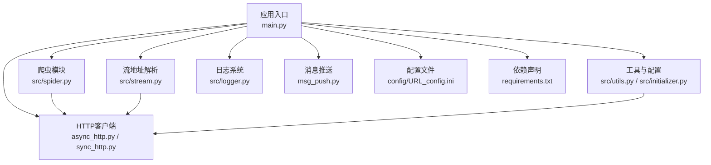
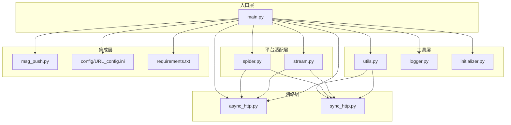
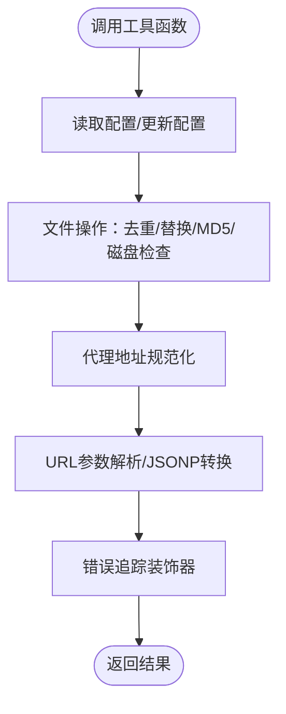
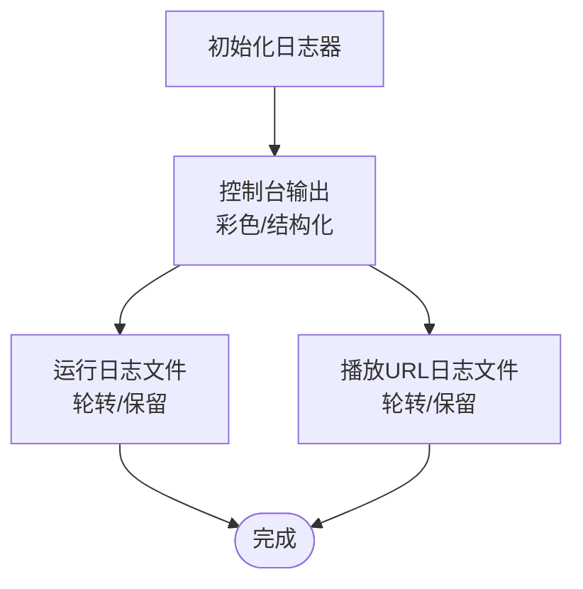
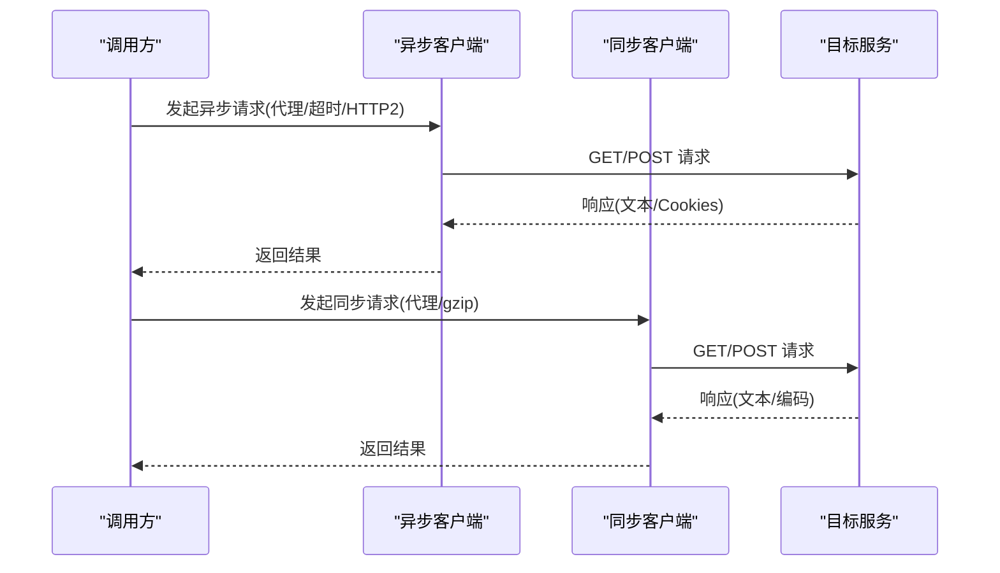
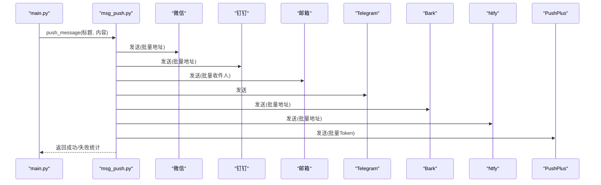
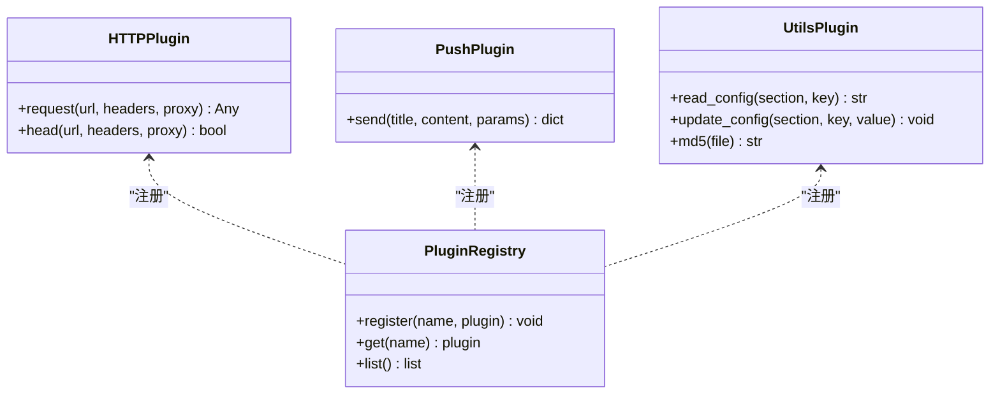
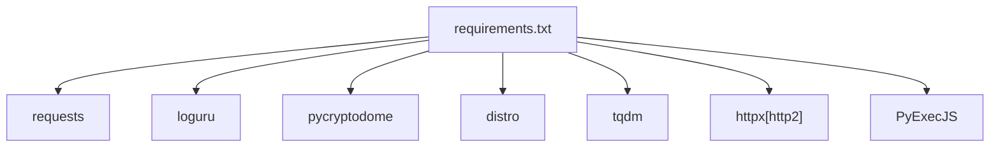

# 功能扩展开发

<cite>
**本文档引用的文件**
- [main.py](file://main.py)
- [msg_push.py](file://msg_push.py)
- [src/logger.py](file://src/logger.py)
- [src/utils.py](file://src/utils.py)
- [src/initializer.py](file://src/initializer.py)
- [src/spider.py](file://src/spider.py)
- [src/stream.py](file://src/stream.py)
- [src/http_clients/async_http.py](file://src/http_clients/async_http.py)
- [src/http_clients/sync_http.py](file://src/http_clients/sync_http.py)
- [requirements.txt](file://requirements.txt)
- [config/URL_config.ini](file://config/URL_config.ini)
- [README.md](file://README.md)
- [src/javascript/taobao-sign.js](file://src/javascript/taobao-sign.js)
- [src/javascript/x-bogus.js](file://src/javascript/x-bogus.js)
</cite>

## 目录
1. [简介](#简介)
2. [项目结构](#项目结构)
3. [核心组件](#核心组件)
4. [架构总览](#架构总览)
5. [详细组件分析](#详细组件分析)
6. [依赖分析](#依赖分析)
7. [性能考虑](#性能考虑)
8. [故障排除指南](#故障排除指南)
9. [结论](#结论)
10. [附录](#附录)

## 简介
本指南面向开发者，提供在现有抖音直播录制器基础上进行功能扩展的完整开发指南。内容涵盖工具函数扩展、日志系统增强、HTTP客户端功能扩展、消息推送系统扩展（新增推送渠道、自定义推送模板、推送策略配置）、插件开发模式（接口设计、注册机制、生命周期管理），并给出具体的扩展开发示例与最佳实践。

## 项目结构
项目采用模块化设计，主要分为以下层次：
- 应用入口与控制流：main.py
- 平台爬虫与流地址解析：src/spider.py、src/stream.py
- HTTP客户端抽象：src/http_clients/async_http.py、src/http_clients/sync_http.py
- 工具与通用逻辑：src/utils.py、src/initializer.py
- 日志系统：src/logger.py
- 消息推送：msg_push.py
- 配置与依赖：config/URL_config.ini、requirements.txt
- JavaScript辅助签名与加密：src/javascript/*.js

**图表来源**
- [main.py](file://main.py)
- [src/spider.py](file://src/spider.py)
- [src/stream.py](file://src/stream.py)
- [src/http_clients/async_http.py](file://src/http_clients/async_http.py)
- [src/http_clients/sync_http.py](file://src/http_clients/sync_http.py)
- [src/utils.py](file://src/utils.py)
- [src/initializer.py](file://src/initializer.py)
- [src/logger.py](file://src/logger.py)
- [msg_push.py](file://msg_push.py)
- [config/URL_config.ini](file://config/URL_config.ini)
- [requirements.txt](file://requirements.txt)

**章节来源**
- [README.md](file://README.md)
- [main.py](file://main.py)

## 核心组件
- 应用入口与控制流：负责URL解析、并发调度、录制流程编排、错误处理与动态配置调整。
- 爬虫模块：针对各直播平台的网页/接口解析，提取房间信息与可用直播流。
- 流地址解析：将平台返回的多路流按质量与可用性排序，选择最优源。
- HTTP客户端：统一异步/同步请求封装，支持代理、重定向、头部注入与响应状态探测。
- 工具与配置：日志、颜色输出、MD5、配置读写、去重、磁盘容量检查、代理地址规范化等。
- 日志系统：基于loguru的多通道日志输出，分别记录运行日志与播放URL日志。
- 消息推送：统一推送入口，支持微信、钉钉、邮箱、Telegram、Bark、Ntfy、PushPlus等。
- JavaScript辅助：提供签名与加密函数，便于扩展新平台或新接口校验。

**章节来源**
- [main.py](file://main.py)
- [src/spider.py](file://src/spider.py)
- [src/stream.py](file://src/stream.py)
- [src/http_clients/async_http.py](file://src/http_clients/async_http.py)
- [src/http_clients/sync_http.py](file://src/http_clients/sync_http.py)
- [src/utils.py](file://src/utils.py)
- [src/logger.py](file://src/logger.py)
- [msg_push.py](file://msg_push.py)
- [src/javascript/taobao-sign.js](file://src/javascript/taobao-sign.js)
- [src/javascript/x-bogus.js](file://src/javascript/x-bogus.js)

## 架构总览
整体架构采用“入口控制 + 平台适配 + HTTP抽象 + 工具支撑 + 推送集成”的分层设计。入口模块协调各子模块，平台适配模块负责解析与选择流，HTTP抽象提供稳定的网络访问能力，工具模块提供通用能力，日志与推送贯穿整个流程。

**图表来源**
- [main.py](file://main.py)
- [src/spider.py](file://src/spider.py)
- [src/stream.py](file://src/stream.py)
- [src/http_clients/async_http.py](file://src/http_clients/async_http.py)
- [src/http_clients/sync_http.py](file://src/http_clients/sync_http.py)
- [src/utils.py](file://src/utils.py)
- [src/logger.py](file://src/logger.py)
- [src/initializer.py](file://src/initializer.py)
- [msg_push.py](file://msg_push.py)
- [config/URL_config.ini](file://config/URL_config.ini)
- [requirements.txt](file://requirements.txt)

## 详细组件分析

### 工具函数扩展
- 扩展点位置：src/utils.py
- 关键能力：
  - 配置读写：读取/更新配置项，支持转义特殊字符，保证写入安全。
  - 文件操作：去重、替换、MD5计算、磁盘空间检查。
  - 代理处理：规范化代理地址，支持http/https协议。
  - URL参数解析：查询参数提取与JSONP转换。
  - 错误追踪装饰器：统一捕获异常并记录详细错误信息。
- 扩展建议：
  - 新增配置项：在配置文件中添加键值，通过工具函数读取与更新。
  - 新增文件处理：在工具函数中增加新方法，复用现有日志与异常处理。
  - 新增代理策略：扩展代理地址处理逻辑，支持多代理轮询或条件选择。

**图表来源**
- [src/utils.py](file://src/utils.py)

**章节来源**
- [src/utils.py](file://src/utils.py)

### 日志系统增强
- 扩展点位置：src/logger.py
- 当前能力：
  - 控制台彩色输出与结构化日志。
  - 运行日志与播放URL日志分离，分别落盘并设置轮转与保留策略。
- 扩展建议：
  - 新增日志级别：根据业务场景增加更细粒度的日志级别。
  - 自定义格式：支持模板化日志格式，便于对接外部日志平台。
  - 异步写入：结合enqueue参数，进一步提升高并发下的日志写入性能。

**图表来源**
- [src/logger.py](file://src/logger.py)

**章节来源**
- [src/logger.py](file://src/logger.py)

### HTTP客户端功能扩展
- 扩展点位置：src/http_clients/async_http.py、src/http_clients/sync_http.py
- 当前能力：
  - 异步客户端：支持代理、超时、HTTP/2、重定向、Cookies返回。
  - 同步客户端：支持代理、gzip解压、异常处理与编码控制。
- 扩展建议：
  - 新增认证头：在请求头中注入平台特定的鉴权参数。
  - 新增重试策略：指数退避、条件重试（如429/5xx）。
  - 新增速率限制：统一管理并发与请求频率，避免触发风控。
  - 新增Mock/测试模式：便于单元测试与离线调试。

**图表来源**
- [src/http_clients/async_http.py](file://src/http_clients/async_http.py)
- [src/http_clients/sync_http.py](file://src/http_clients/sync_http.py)

**章节来源**
- [src/http_clients/async_http.py](file://src/http_clients/async_http.py)
- [src/http_clients/sync_http.py](file://src/http_clients/sync_http.py)

### 消息推送系统扩展
- 扩展点位置：msg_push.py、main.py中的push_message函数
- 当前能力：
  - 支持微信、钉钉、邮箱、Telegram、Bark、Ntfy、PushPlus等渠道。
  - 批量推送地址支持（逗号分隔）。
  - 统一返回成功/失败统计。
- 扩展建议：
  - 新增推送渠道：在msg_push.py中新增函数，遵循统一签名与返回格式。
  - 自定义推送模板：通过配置项控制标题/内容模板，支持变量替换。
  - 推送策略配置：支持按平台/URL/质量阈值等条件选择推送渠道与模板。
  - 限流与重试：为第三方API增加限流与重试逻辑，提升成功率。

**图表来源**
- [msg_push.py](file://msg_push.py)
- [main.py](file://main.py)

**章节来源**
- [msg_push.py](file://msg_push.py)
- [main.py](file://main.py)

### 插件开发模式
- 接口设计：
  - HTTP客户端插件：实现统一的请求接口（异步/同步），支持代理、超时、头部注入。
  - 推送插件：实现统一的send函数，接收标题/内容/参数，返回成功/失败统计。
  - 工具插件：提供独立的工具函数（如签名、加密、配置读写）。
- 注册机制：
  - 在入口模块中集中注册插件，通过字典或枚举选择启用的插件。
  - 支持动态加载与热插拔（通过配置开关）。
- 生命周期管理：
  - 初始化：加载配置、建立连接、预热缓存。
  - 运行期：按需调用插件，处理异常与重试。
  - 清理：释放资源、关闭连接、清理临时文件。

**图表来源**
- [src/http_clients/async_http.py](file://src/http_clients/async_http.py)
- [src/http_clients/sync_http.py](file://src/http_clients/sync_http.py)
- [msg_push.py](file://msg_push.py)
- [src/utils.py](file://src/utils.py)

**章节来源**
- [src/http_clients/async_http.py](file://src/http_clients/async_http.py)
- [src/http_clients/sync_http.py](file://src/http_clients/sync_http.py)
- [msg_push.py](file://msg_push.py)
- [src/utils.py](file://src/utils.py)

### 具体扩展开发示例

#### 示例1：新增配置选项
- 目标：新增一个录制质量偏好配置项。
- 实现步骤：
  1) 在配置文件中添加新键值。
  2) 在工具函数中读取配置，提供默认值与类型校验。
  3) 在入口模块中读取并传递给流选择逻辑。
- 参考路径：
  - [src/utils.py](file://src/utils.py)
  - [main.py](file://main.py)

**章节来源**
- [src/utils.py](file://src/utils.py)
- [main.py](file://main.py)

#### 示例2：扩展录制功能（新增平台）
- 目标：为新平台添加爬虫与流解析。
- 实现步骤：
  1) 在spider.py中新增平台解析函数，返回标准化的房间信息。
  2) 在stream.py中新增平台流解析函数，返回m3u8/flv等可用地址。
  3) 在入口模块中新增平台识别逻辑，调用对应解析函数。
- 参考路径：
  - [src/spider.py](file://src/spider.py)
  - [src/stream.py](file://src/stream.py)
  - [main.py](file://main.py)

**章节来源**
- [src/spider.py](file://src/spider.py)
- [src/stream.py](file://src/stream.py)
- [main.py](file://main.py)

#### 示例3：增强UI组件（网页播放器）
- 目标：在index.html中新增播放器控件或主题切换。
- 实现步骤：
  1) 在HTML中新增控件元素。
  2) 在CSS/JS中绑定事件与样式。
  3) 通过配置项控制播放器行为（如自动播放、清晰度切换）。
- 参考路径：
  - [index.html](file://index.html)

**章节来源**
- [index.html](file://index.html)

#### 示例4：新增推送渠道
- 目标：新增企业微信/飞书推送渠道。
- 实现步骤：
  1) 在msg_push.py中新增send_enterprise_wechat/send_feishu函数。
  2) 在入口模块的推送字典中注册新渠道。
  3) 在配置文件中新增渠道参数（如Webhook/Token）。
- 参考路径：
  - [msg_push.py](file://msg_push.py)
  - [main.py](file://main.py)

**章节来源**
- [msg_push.py](file://msg_push.py)
- [main.py](file://main.py)

## 依赖分析
- 核心依赖：requests、loguru、pycryptodome、distro、tqdm、httpx[http2]、PyExecJS
- 依赖关系图：

**图表来源**
- [requirements.txt](file://requirements.txt)

**章节来源**
- [requirements.txt](file://requirements.txt)

## 性能考虑
- 并发与限流：通过信号量与动态请求上限控制并发，避免触发平台风控。
- 缓存与重用：对解析结果与Cookies进行缓存，减少重复请求。
- I/O优化：使用异步HTTP客户端与分段录制，降低CPU与内存占用。
- 日志轮转：合理设置rotation与retention，避免磁盘空间膨胀。

## 故障排除指南
- 常见问题：
  - 网络异常：检查代理配置与网络连通性，必要时切换代理节点。
  - 平台风控：增加随机延时、更换User-Agent、使用平台Cookie。
  - 推送失败：检查API地址与凭据，查看返回的错误信息。
  - 录制中断：检查FFmpeg安装与权限，确认脚本执行权限。
- 建议：
  - 使用日志系统定位问题，关注ERROR级别日志。
  - 在工具函数中增加重试与降级策略。
  - 对第三方API增加超时与熔断保护。

**章节来源**
- [src/logger.py](file://src/logger.py)
- [src/utils.py](file://src/utils.py)
- [main.py](file://main.py)

## 结论
通过模块化设计与清晰的扩展点，项目具备良好的可扩展性。开发者可按照本文档提供的接口与流程，快速实现工具函数扩展、日志系统增强、HTTP客户端功能扩展、消息推送系统扩展与插件开发模式。建议在扩展过程中遵循统一的接口规范、错误处理与配置管理，确保系统的稳定性与可维护性。

## 附录
- 配置文件示例：config/URL_config.ini
- 依赖声明：requirements.txt
- 项目说明：README.md

**章节来源**
- [config/URL_config.ini](file://config/URL_config.ini)
- [requirements.txt](file://requirements.txt)
- [README.md](file://README.md)