# 插件开发模式

<cite>
**本文档引用的文件**
- [main.py](file://main.py)
- [demo.py](file://demo.py)
- [src/spider.py](file://src/spider.py)
- [src/stream.py](file://src/stream.py)
- [src/room.py](file://src/room.py)
- [src/utils.py](file://src/utils.py)
- [src/http_clients/async_http.py](file://src/http_clients/async_http.py)
- [src/ab_sign.py](file://src/ab_sign.py)
- [src/javascript/x-bogus.js](file://src/javascript/x-bogus.js)
- [src/javascript/taobao-sign.js](file://src/javascript/taobao-sign.js)
- [src/initializer.py](file://src/initializer.py)
- [README.md](file://README.md)
</cite>

## 目录
1. [简介](#简介)
2. [项目结构](#项目结构)
3. [核心组件](#核心组件)
4. [架构概览](#架构概览)
5. [详细组件分析](#详细组件分析)
6. [依赖关系分析](#依赖关系分析)
7. [性能考虑](#性能考虑)
8. [故障排除指南](#故障排除指南)
9. [结论](#结论)
10. [附录](#附录)

## 简介

DouyinLiveRecorder是一个基于Python的直播录制工具，支持超过50个直播平台。该项目采用模块化架构设计，为开发者提供了完整的插件开发框架。本文档将详细介绍插件架构设计、接口定义、注册机制和生命周期管理，帮助开发者创建新的直播平台插件。

## 项目结构

项目采用分层架构设计，主要分为以下几个层次：

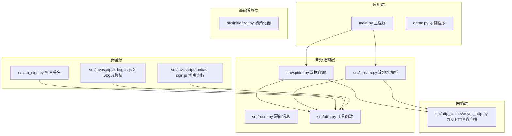

**图表来源**
- [main.py:1-800](file://main.py#L1-L800)
- [src/spider.py:1-800](file://src/spider.py#L1-L800)
- [src/stream.py:1-446](file://src/stream.py#L1-L446)

**章节来源**
- [main.py:1-800](file://main.py#L1-L800)
- [README.md:72-100](file://README.md#L72-L100)

## 核心组件

### 平台适配器接口定义

项目采用统一的平台适配器模式，所有直播平台都遵循相同的接口规范：

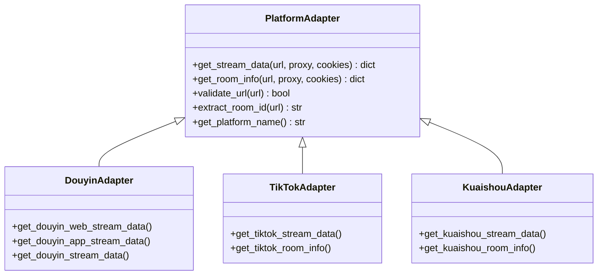

**图表来源**
- [src/spider.py:68-282](file://src/spider.py#L68-L282)
- [src/stream.py:40-153](file://src/stream.py#L40-L153)

### 数据流处理管道

系统采用流水线模式处理直播数据：

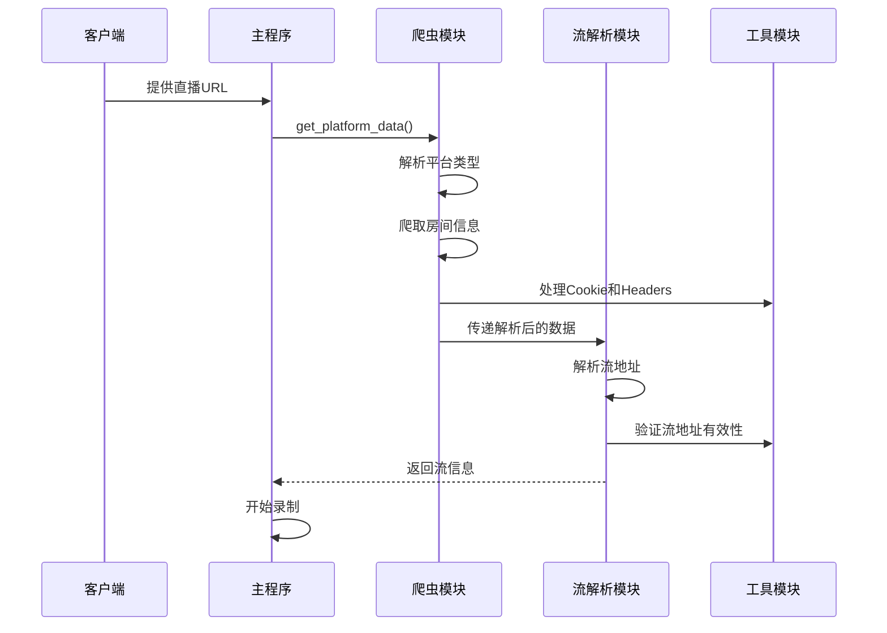

**图表来源**
- [main.py:545-800](file://main.py#L545-L800)
- [src/spider.py:68-282](file://src/spider.py#L68-L282)
- [src/stream.py:40-153](file://src/stream.py#L40-L153)

**章节来源**
- [src/spider.py:68-282](file://src/spider.py#L68-L282)
- [src/stream.py:40-153](file://src/stream.py#L40-L153)
- [src/utils.py:38-51](file://src/utils.py#L38-L51)

## 架构概览

### 插件注册机制

系统采用动态注册机制，支持运行时加载新的直播平台插件：

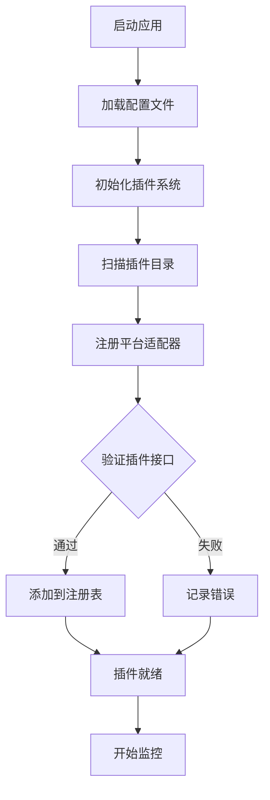

**图表来源**
- [main.py:545-800](file://main.py#L545-L800)
- [src/initializer.py:1-221](file://src/initializer.py#L1-L221)

### 生命周期管理

插件生命周期包括以下阶段：

1. **发现阶段**: 系统扫描可用的直播平台
2. **初始化阶段**: 加载平台特定的配置和依赖
3. **运行阶段**: 处理直播数据请求
4. **清理阶段**: 释放资源和关闭连接

**章节来源**
- [src/initializer.py:162-221](file://src/initializer.py#L162-L221)
- [src/utils.py:38-51](file://src/utils.py#L38-L51)

## 详细组件分析

### 爬虫模块 (Spider)

爬虫模块负责从各个直播平台抓取直播数据：

#### 核心功能

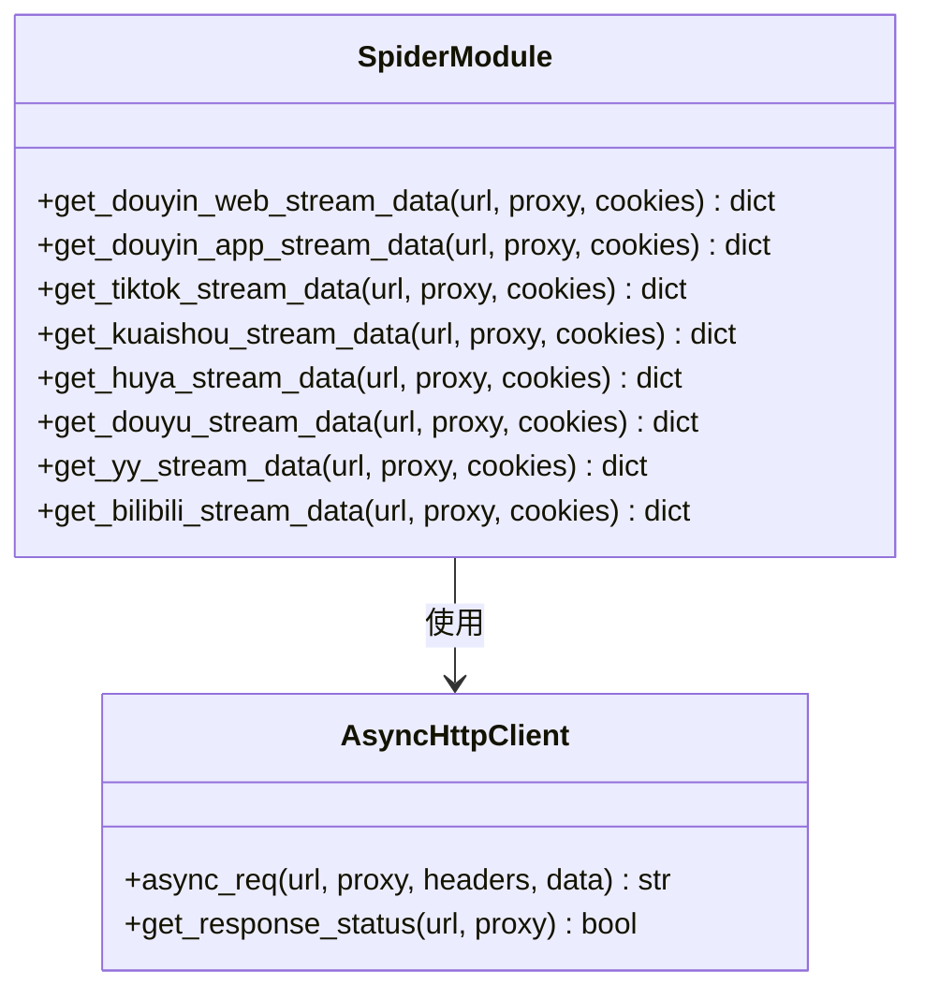

**图表来源**
- [src/spider.py:68-282](file://src/spider.py#L68-L282)
- [src/http_clients/async_http.py:10-60](file://src/http_clients/async_http.py#L10-L60)

#### 数据解析流程

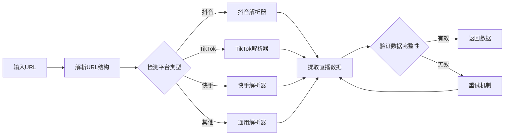

**图表来源**
- [src/spider.py:68-282](file://src/spider.py#L68-L282)

**章节来源**
- [src/spider.py:68-282](file://src/spider.py#L68-L282)
- [src/http_clients/async_http.py:10-60](file://src/http_clients/async_http.py#L10-L60)

### 流地址解析模块 (Stream)

流地址解析模块负责将平台特定的数据转换为标准的流地址：

#### 质量选择算法

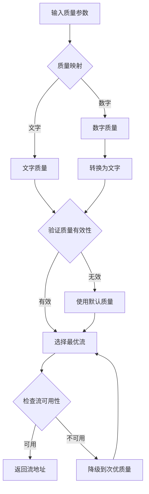

**图表来源**
- [src/stream.py:29-78](file://src/stream.py#L29-L78)

#### 平台特定解析器

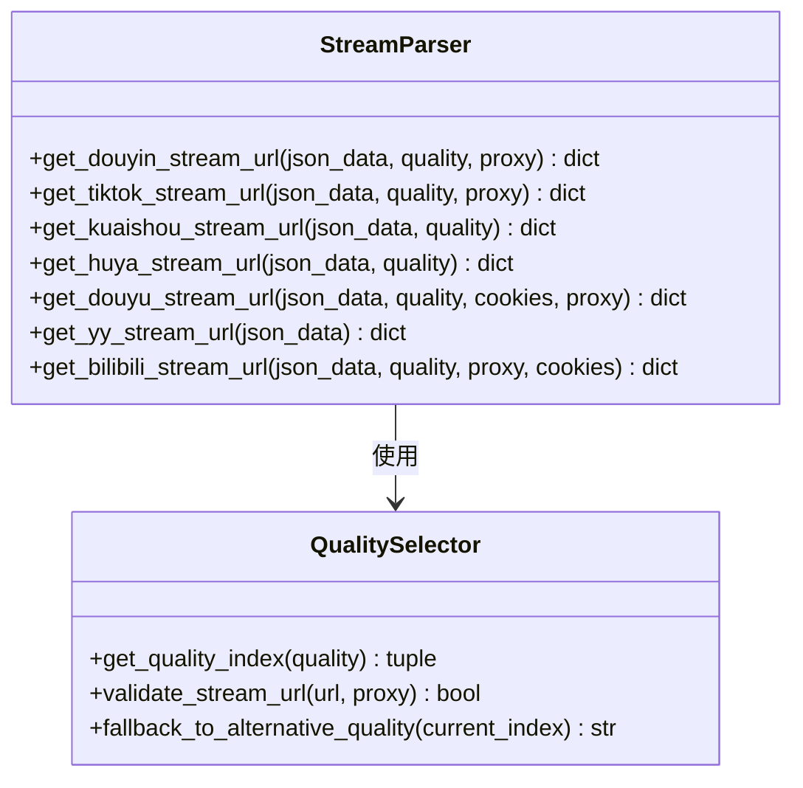

**图表来源**
- [src/stream.py:40-153](file://src/stream.py#L40-L153)

**章节来源**
- [src/stream.py:29-153](file://src/stream.py#L29-L153)

### 安全认证模块

系统实现了多种安全认证机制来绕过平台的反爬虫措施：

#### 抖音签名算法

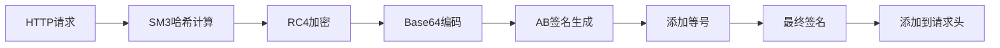

**图表来源**
- [src/ab_sign.py:444-455](file://src/ab_sign.py#L444-L455)

#### JavaScript算法集成

系统集成了多个JavaScript算法用于处理复杂的签名逻辑：

**章节来源**
- [src/ab_sign.py:1-455](file://src/ab_sign.py#L1-L455)
- [src/javascript/x-bogus.js:500-564](file://src/javascript/x-bogus.js#L500-L564)
- [src/javascript/taobao-sign.js:1-78](file://src/javascript/taobao-sign.js#L1-L78)

### 工具函数模块

工具函数模块提供了插件开发所需的各种辅助功能：

#### 错误处理装饰器

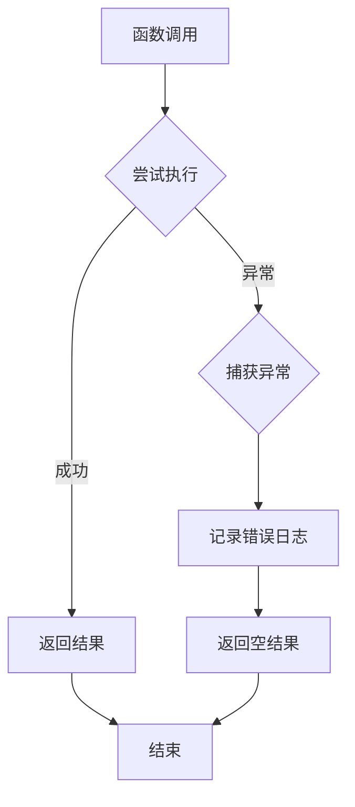

**图表来源**
- [src/utils.py:38-51](file://src/utils.py#L38-L51)

**章节来源**
- [src/utils.py:38-51](file://src/utils.py#L38-L51)

## 依赖关系分析

### 外部依赖

项目的主要外部依赖包括：

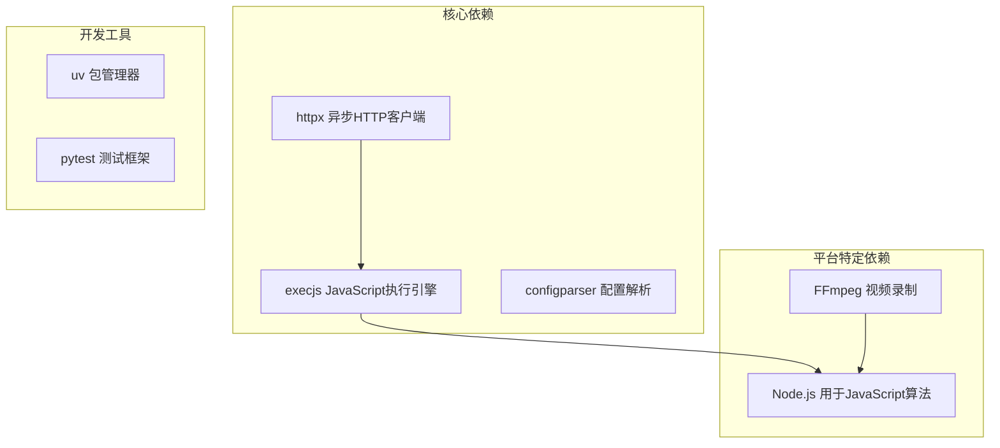

**图表来源**
- [requirements.txt](file://requirements.txt)
- [src/initializer.py:1-221](file://src/initializer.py#L1-L221)

### 内部模块依赖

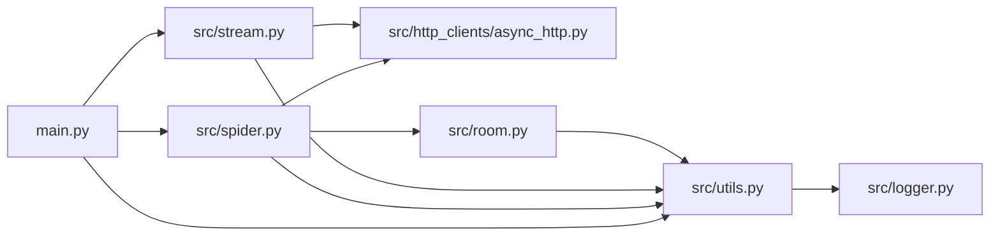

**图表来源**
- [main.py:30-36](file://main.py#L30-L36)
- [src/spider.py:21-32](file://src/spider.py#L21-L32)

**章节来源**
- [main.py:30-36](file://main.py#L30-L36)
- [src/spider.py:21-32](file://src/spider.py#L21-L32)

## 性能考虑

### 异步处理优化

系统采用异步编程模型来提高并发处理能力：

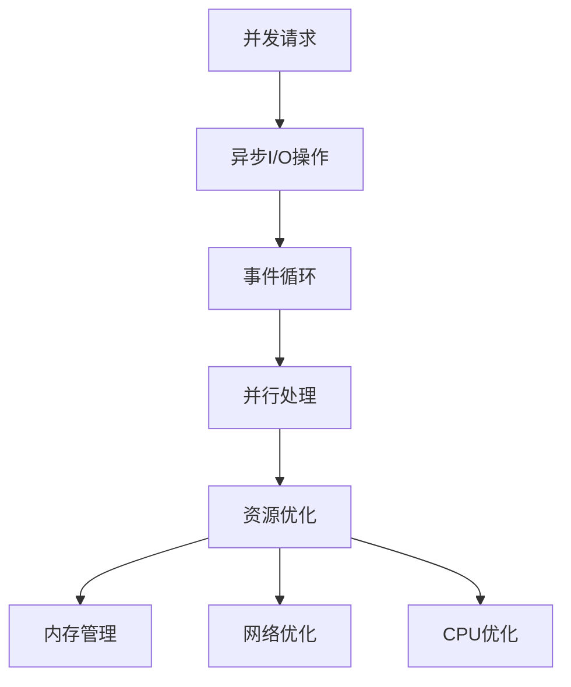

### 缓存策略

系统实现了多层次的缓存机制：

1. **响应缓存**: 缓存平台API响应数据
2. **流地址缓存**: 缓存解析后的流地址
3. **Cookie缓存**: 缓存认证信息

### 资源管理

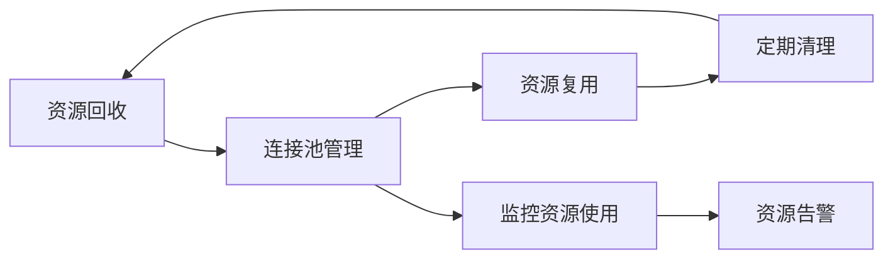

## 故障排除指南

### 常见问题诊断

#### 网络连接问题

```mermaid
flowchart TD
ConnectionError[连接错误] --> CheckProxy{检查代理设置}
CheckProxy --> |代理可用| TestProxy[Test代理连接}
CheckProxy --> |代理不可用| DisableProxy[禁用代理]
TestProxy --> ProxyWorking{代理工作正常?}
ProxyWorking --> |是| TestPlatform[Test平台连接}
ProxyWorking --> |否| FixProxy[修复代理配置]
TestPlatform --> PlatformAccessible{平台可访问?}
PlatformAccessible --> |是| Success[连接成功]
PlatformAccessible --> |否| CheckFirewall[检查防火墙设置]
```

#### 认证失败问题

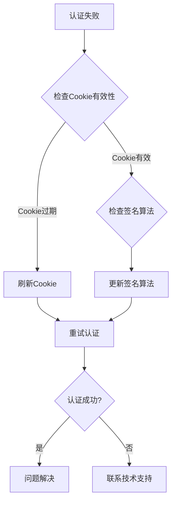

### 调试技巧

#### 日志分析

系统提供了详细的日志记录功能，开发者可以通过以下方式分析问题：

1. **启用详细日志**: 设置日志级别为DEBUG
2. **分析请求响应**: 查看HTTP请求和响应详情
3. **跟踪异常堆栈**: 分析错误发生的具体位置

#### 性能监控

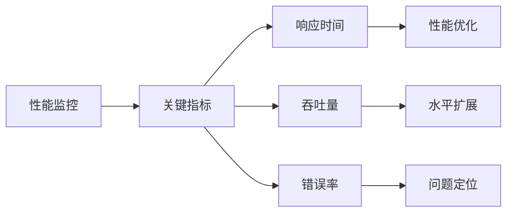

**章节来源**
- [src/utils.py:38-51](file://src/utils.py#L38-L51)
- [src/initializer.py:179-221](file://src/initializer.py#L179-L221)

## 结论

DouyinLiveRecorder项目展示了现代直播录制系统的最佳实践。其模块化架构设计、统一的插件接口、完善的错误处理机制和性能优化策略为开发者提供了强大的基础。

通过本文档介绍的插件开发模式，开发者可以快速创建新的直播平台适配器，同时保持系统的稳定性和可维护性。建议在开发新插件时遵循以下原则：

1. **遵循统一接口**: 确保新插件实现标准的平台适配器接口
2. **处理异常情况**: 实现完善的错误处理和重试机制
3. **优化性能**: 采用异步处理和缓存策略提升性能
4. **保持兼容性**: 确保新插件与现有系统的兼容性

## 附录

### 插件开发示例

#### 创建新的直播平台插件

```python
# 示例：创建一个新的直播平台插件
class NewPlatformAdapter:
    def __init__(self):
        self.platform_name = "新平台"
        self.supported_urls = ["newplatform.com"]
    
    def get_stream_data(self, url, proxy=None, cookies=None):
        """获取直播流数据"""
        try:
            # 实现平台特定的数据获取逻辑
            response = self._fetch_data(url, proxy, cookies)
            return self._parse_data(response)
        except Exception as e:
            logger.error(f"获取{self.platform_name}数据失败: {e}")
            return {"is_live": False}
    
    def _fetch_data(self, url, proxy, cookies):
        """从平台API获取原始数据"""
        # 实现HTTP请求逻辑
        pass
    
    def _parse_data(self, raw_data):
        """解析原始数据为标准格式"""
        # 实现数据解析逻辑
        pass
    
    def validate_url(self, url):
        """验证URL是否为支持的平台URL"""
        return any(platform_url in url for platform_url in self.supported_urls)
```

#### 集成新插件到系统

```python
# 在main.py中注册新插件
def register_platform_adapter(adapter):
    """注册平台适配器到系统"""
    platform_adapters[adapter.platform_name] = adapter
    logger.info(f"已注册平台适配器: {adapter.platform_name}")

# 使用示例
new_platform = NewPlatformAdapter()
register_platform_adapter(new_platform)
```

### 最佳实践

#### 代码组织

1. **模块化设计**: 将功能相关的代码组织在独立的模块中
2. **接口标准化**: 定义清晰的接口契约，便于扩展
3. **错误处理**: 实现统一的错误处理机制
4. **日志记录**: 提供详细的日志信息便于调试

#### 性能优化

1. **异步处理**: 使用异步编程模型提高并发性能
2. **缓存策略**: 实现合理的缓存机制减少重复请求
3. **资源管理**: 有效管理内存和网络资源
4. **监控告警**: 建立性能监控和告警机制

#### 测试策略

1. **单元测试**: 为每个模块编写单元测试
2. **集成测试**: 测试模块间的交互
3. **性能测试**: 评估系统的性能表现
4. **回归测试**: 确保新功能不影响现有功能