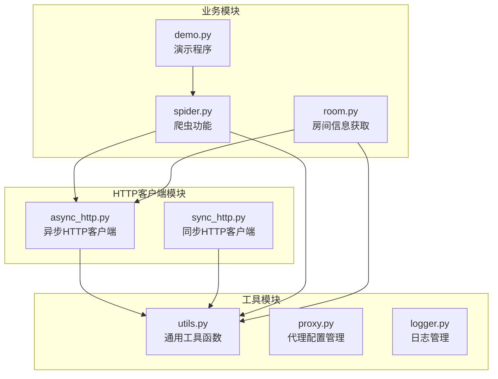
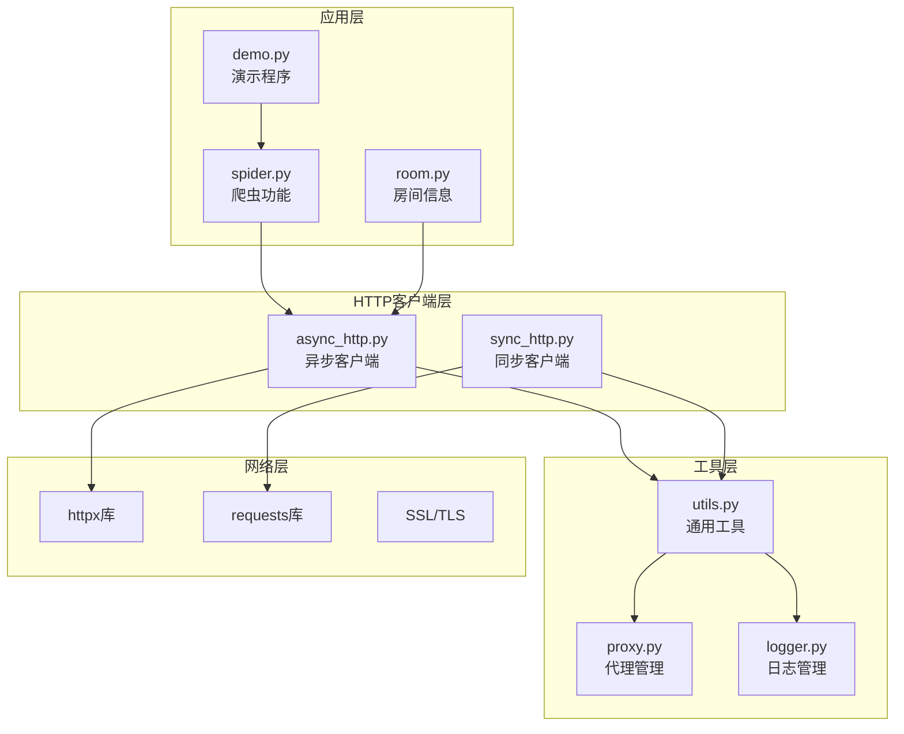
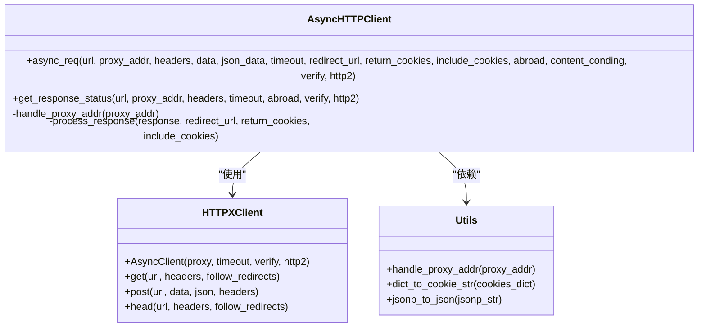
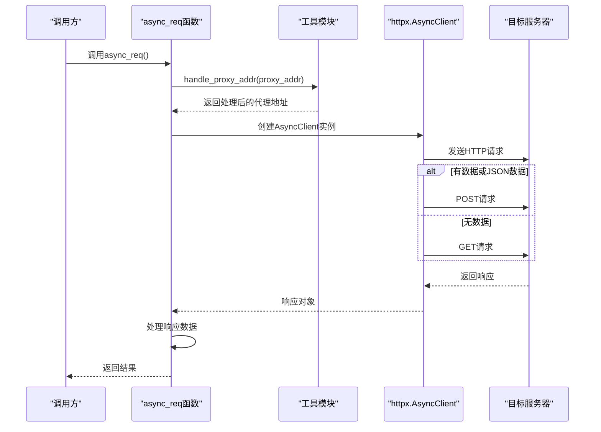
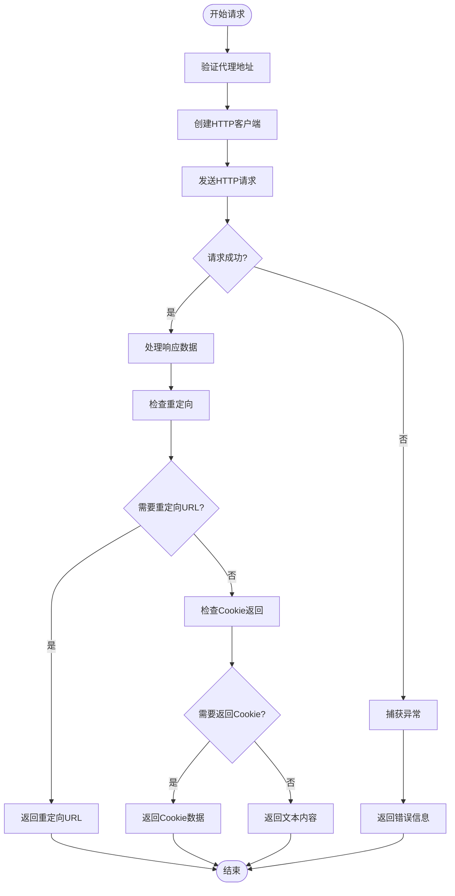
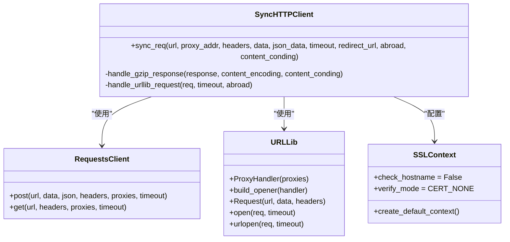
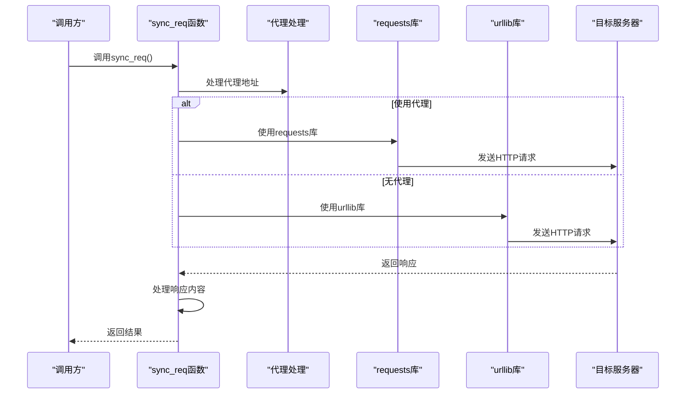
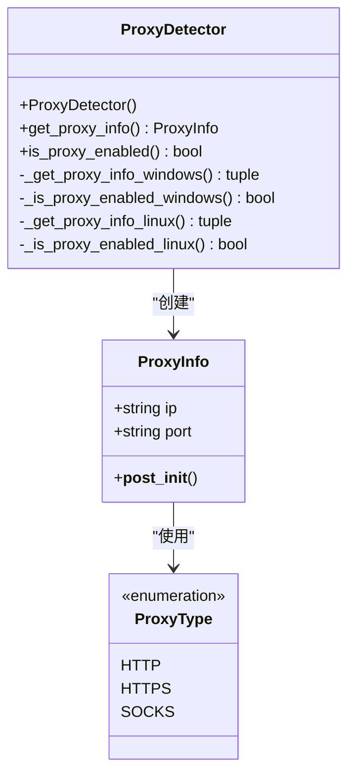
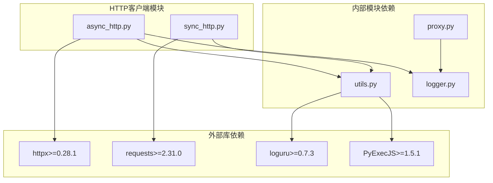

# HTTP客户端模块扩展

<cite>
**本文档引用的文件**
- [async_http.py](file://src/http_clients/async_http.py)
- [sync_http.py](file://src/http_clients/sync_http.py)
- [utils.py](file://src/utils.py)
- [proxy.py](file://src/proxy.py)
- [spider.py](file://src/spider.py)
- [room.py](file://src/room.py)
- [logger.py](file://src/logger.py)
- [demo.py](file://demo.py)
- [requirements.txt](file://requirements.txt)
- [README.md](file://README.md)
</cite>

## 目录
1. [简介](#简介)
2. [项目结构](#项目结构)
3. [核心组件](#核心组件)
4. [架构概览](#架构概览)
5. [详细组件分析](#详细组件分析)
6. [依赖分析](#依赖分析)
7. [性能考虑](#性能考虑)
8. [故障排除指南](#故障排除指南)
9. [结论](#结论)
10. [附录](#附录)

## 简介

本文档为开发者提供HTTP客户端模块扩展指南，详细介绍如何扩展现有的异步和同步HTTP客户端模块。该系统包含两个主要的HTTP客户端实现：异步HTTP客户端和同步HTTP客户端，分别基于httpx和requests库构建。文档涵盖了新增HTTP方法支持、代理配置扩展、连接池管理、超时设置、重试机制等扩展功能，并说明了异步HTTP客户端和同步HTTP客户端的不同特性和使用场景。

## 项目结构

该项目采用模块化设计，HTTP客户端功能集中在`src/http_clients/`目录下：

**图表来源**
- [async_http.py:1-60](file://src/http_clients/async_http.py#L1-L60)
- [sync_http.py:1-89](file://src/http_clients/sync_http.py#L1-L89)
- [utils.py:1-206](file://src/utils.py#L1-L206)
- [proxy.py:1-93](file://src/proxy.py#L1-L93)

**章节来源**
- [async_http.py:1-60](file://src/http_clients/async_http.py#L1-L60)
- [sync_http.py:1-89](file://src/http_clients/sync_http.py#L1-L89)
- [utils.py:1-206](file://src/utils.py#L1-L206)
- [proxy.py:1-93](file://src/proxy.py#L1-L93)

## 核心组件

### 异步HTTP客户端 (async_http.py)

异步HTTP客户端基于httpx库构建，提供高性能的异步网络请求能力：

**主要特性：**
- 支持GET和POST请求
- 自动代理处理
- Cookie管理和返回
- 超时控制
- SSL证书验证选项
- HTTP/2支持

**核心函数：**
- `async_req()`: 主要的异步请求函数
- `get_response_status()`: 获取响应状态

### 同步HTTP客户端 (sync_http.py)

同步HTTP客户端提供阻塞式的网络请求功能：

**主要特性：**
- 支持GET和POST请求
- 代理配置支持
- Gzip内容解压缩
- 错误处理和异常捕获
- 跨平台兼容性

**核心函数：**
- `sync_req()`: 主要的同步请求函数

### 通用工具模块 (utils.py)

提供HTTP客户端扩展所需的基础功能：

**主要功能：**
- 代理地址处理
- Cookie字符串转换
- 配置文件读取和更新
- MD5计算
- JSONP解析
- 查询参数处理

### 代理配置模块 (proxy.py)

专门处理代理相关的功能：

**主要功能：**
- 代理类型枚举
- 代理信息数据类
- 系统代理检测
- 平台特定代理配置

**章节来源**
- [async_http.py:10-60](file://src/http_clients/async_http.py#L10-L60)
- [sync_http.py:20-89](file://src/http_clients/sync_http.py#L20-L89)
- [utils.py:162-168](file://src/utils.py#L162-L168)
- [proxy.py:8-93](file://src/proxy.py#L8-L93)

## 架构概览

系统采用分层架构设计，HTTP客户端模块位于应用的核心层：

**图表来源**
- [spider.py:31-32](file://src/spider.py#L31-L32)
- [room.py:13-18](file://src/room.py#L13-L18)
- [async_http.py:2-3](file://src/http_clients/async_http.py#L2-L3)
- [sync_http.py:4-5](file://src/http_clients/sync_http.py#L4-L5)

## 详细组件分析

### 异步HTTP客户端详细分析

#### 类关系图

**图表来源**
- [async_http.py:10-60](file://src/http_clients/async_http.py#L10-L60)
- [utils.py:162-168](file://src/utils.py#L162-L168)

#### 请求流程序列图

**图表来源**
- [async_http.py:25-46](file://src/http_clients/async_http.py#L25-L46)

#### 错误处理流程图

**图表来源**
- [async_http.py:25-46](file://src/http_clients/async_http.py#L25-L46)

**章节来源**
- [async_http.py:10-60](file://src/http_clients/async_http.py#L10-L60)

### 同步HTTP客户端详细分析

#### 类关系图

**图表来源**
- [sync_http.py:20-89](file://src/http_clients/sync_http.py#L20-L89)

#### 请求流程序列图

**图表来源**
- [sync_http.py:33-88](file://src/http_clients/sync_http.py#L33-L88)

**章节来源**
- [sync_http.py:20-89](file://src/http_clients/sync_http.py#L20-L89)

### 代理配置管理分析

#### 代理类型和配置

**图表来源**
- [proxy.py:8-93](file://src/proxy.py#L8-L93)

**章节来源**
- [proxy.py:8-93](file://src/proxy.py#L8-L93)

## 依赖分析

### 外部依赖关系

**图表来源**
- [requirements.txt:1-7](file://requirements.txt#L1-L7)
- [async_http.py:2](file://src/http_clients/async_http.py#L2)
- [sync_http.py:5](file://src/http_clients/sync_http.py#L5)

### 内部模块耦合分析

系统采用松耦合设计，各模块职责明确：

**模块间依赖关系：**
- `spider.py` 依赖 `async_http.py` 进行异步请求
- `room.py` 依赖 `async_http.py` 进行房间信息获取
- `utils.py` 被所有HTTP客户端模块依赖
- `proxy.py` 被 `utils.py` 间接依赖

**章节来源**
- [requirements.txt:1-7](file://requirements.txt#L1-L7)
- [spider.py:31-32](file://src/spider.py#L31-L32)
- [room.py:13-18](file://src/room.py#L13-L18)

## 性能考虑

### 异步 vs 同步性能对比

| 特性 | 异步HTTP客户端 | 同步HTTP客户端 |
|------|----------------|----------------|
| 并发处理 | 支持多并发请求 | 单线程阻塞 |
| 内存使用 | 较低 | 中等 |
| CPU效率 | 高 | 中等 |
| 延迟 | 低 | 中等 |
| 适用场景 | 大量并发请求 | 简单顺序请求 |

### 连接池管理

**异步客户端连接池：**
- 使用httpx内置连接池
- 自动复用TCP连接
- 支持HTTP/2协议
- 连接超时自动回收

**同步客户端连接池：**
- requests库自动管理连接
- urllib库无连接池
- 需要手动实现连接复用

### 超时设置策略

**最佳实践：**
- 网络请求超时：10-30秒
- DNS解析超时：5-10秒
- 连接建立超时：5-15秒
- 读取超时：10-60秒

**章节来源**
- [async_http.py:16](file://src/http_clients/async_http.py#L16)
- [sync_http.py:26](file://src/http_clients/sync_http.py#L26)

## 故障排除指南

### 常见问题及解决方案

#### 代理配置问题

**问题症状：**
- 请求超时或失败
- IP被封禁
- 访问受限

**解决方案：**
1. 检查代理地址格式
2. 验证代理服务器可用性
3. 设置合适的超时时间
4. 实现代理轮换机制

#### SSL证书验证问题

**问题症状：**
- SSL证书验证失败
- HTTPS请求异常
- 安全警告

**解决方案：**
1. 配置SSL证书验证
2. 使用自定义SSL上下文
3. 实现证书验证绕过（仅测试环境）

#### 请求超时问题

**问题症状：**
- 请求长时间无响应
- 网络不稳定
- 服务器负载过高

**解决方案：**
1. 实现指数退避重试
2. 设置合理的超时时间
3. 添加请求队列管理
4. 实现健康检查机制

**章节来源**
- [utils.py:162-168](file://src/utils.py#L162-L168)
- [logger.py:1-44](file://src/logger.py#L1-44)

## 结论

HTTP客户端模块扩展指南提供了完整的扩展框架和最佳实践。通过理解现有架构和设计模式，开发者可以：

1. **选择合适的客户端类型**：根据应用场景选择异步或同步客户端
2. **实现新功能**：基于现有接口扩展新的HTTP方法和功能
3. **优化性能**：利用连接池和并发机制提升性能
4. **确保可靠性**：实现完善的错误处理和重试机制
5. **保障安全性**：正确配置SSL和代理设置

该系统的设计充分考虑了可扩展性和可维护性，为未来的功能扩展奠定了良好的基础。

## 附录

### 扩展开发最佳实践

#### 新增HTTP方法支持

**步骤：**
1. 在现有函数基础上添加参数
2. 实现相应的HTTP方法逻辑
3. 添加错误处理和异常捕获
4. 编写单元测试验证功能

#### 代理配置扩展

**建议：**
1. 支持多种代理协议（HTTP、HTTPS、SOCKS）
2. 实现代理认证机制
3. 实现代理轮换和故障转移
4. 添加代理健康检查

#### 连接池管理

**实现要点：**
1. 配置连接池大小
2. 设置连接超时时间
3. 实现连接复用机制
4. 监控连接池状态

#### 超时设置优化

**策略：**
1. 动态调整超时时间
2. 实现分级超时策略
3. 添加超时统计和监控
4. 支持用户自定义超时设置

### 安全考虑

#### 代理安全

- 验证代理服务器可信度
- 实施代理认证机制
- 监控代理使用情况
- 定期轮换代理配置

#### SSL安全

- 启用证书验证
- 使用安全的TLS版本
- 定期更新证书
- 实施证书固定机制

#### 数据安全

- 加密敏感数据传输
- 实施请求签名机制
- 监控异常请求模式
- 实施访问控制