# 工具函数模块扩展

<cite>
**本文档引用的文件**
- [src/utils.py](file://src/utils.py)
- [src/logger.py](file://src/logger.py)
- [src/initializer.py](file://src/initializer.py)
- [src/proxy.py](file://src/proxy.py)
- [src/room.py](file://src/room.py)
- [config/URL_config.ini](file://config/URL_config.ini)
- [requirements.txt](file://requirements.txt)
- [README.md](file://README.md)
</cite>

## 目录
1. [简介](#简介)
2. [项目结构](#项目结构)
3. [核心组件](#核心组件)
4. [架构概览](#架构概览)
5. [详细组件分析](#详细组件分析)
6. [依赖分析](#依赖分析)
7. [性能考虑](#性能考虑)
8. [故障排除指南](#故障排除指南)
9. [结论](#结论)
10. [附录](#附录)

## 简介

本文档为开发者提供了DouyinLiveRecorder项目中工具函数模块的扩展指南。该项目是一个基于Python的直播录制工具，支持多个直播平台的直播流解析和录制。工具函数模块位于src/utils.py文件中，包含了各种实用工具函数，涵盖了字符串处理、文件操作、配置管理、网络处理等多个方面。

本文档旨在帮助开发者理解现有工具函数的实现模式，提供扩展新工具函数的最佳实践，并确保向后兼容性。

## 项目结构

项目采用模块化的组织结构，主要组件包括：

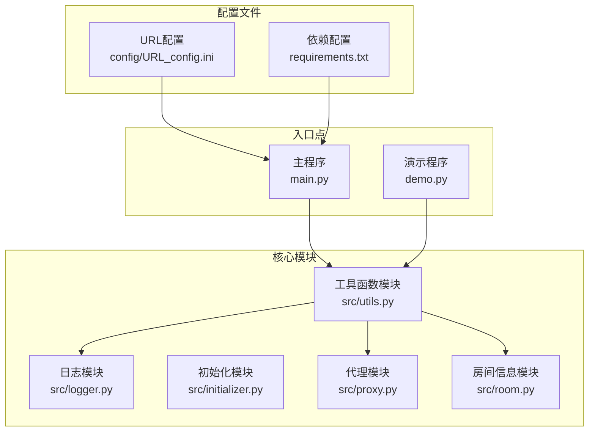

**图表来源**
- [src/utils.py:1-206](file://src/utils.py#L1-L206)
- [src/logger.py:1-44](file://src/logger.py#L1-L44)
- [src/initializer.py:1-221](file://src/initializer.py#L1-L221)

**章节来源**
- [README.md:72-100](file://README.md#L72-L100)

## 核心组件

工具函数模块目前包含以下主要功能分类：

### 字符串处理函数
- `remove_emojis()`: 移除文本中的表情符号
- `remove_duplicate_lines()`: 去除文件中的重复行
- `generate_random_string()`: 生成随机字符串
- `dict_to_cookie_str()`: 将字典转换为Cookie字符串
- `jsonp_to_json()`: 解析JSONP格式数据

### 文件操作函数
- `get_file_paths()`: 获取目录下所有文件路径
- `check_disk_capacity()`: 检查磁盘容量
- `replace_url()`: 替换文件中的URL

### 配置管理函数
- `read_config_value()`: 读取配置值
- `update_config()`: 更新配置值

### 网络处理函数
- `handle_proxy_addr()`: 处理代理地址
- `get_query_params()`: 解析URL查询参数

### 错误处理装饰器
- `trace_error_decorator()`: 通用错误追踪装饰器

**章节来源**
- [src/utils.py:23-206](file://src/utils.py#L23-L206)

## 架构概览

工具函数模块采用分层架构设计，具有良好的内聚性和低耦合性：

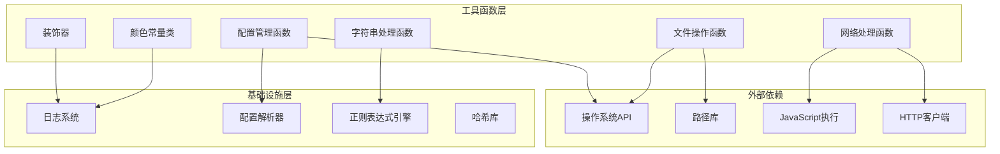

**图表来源**
- [src/utils.py:1-206](file://src/utils.py#L1-L206)
- [src/logger.py:1-44](file://src/logger.py#L1-L44)

## 详细组件分析

### 字符串处理组件

#### Emoji移除功能
该功能使用Unicode范围匹配来识别和移除各种表情符号：

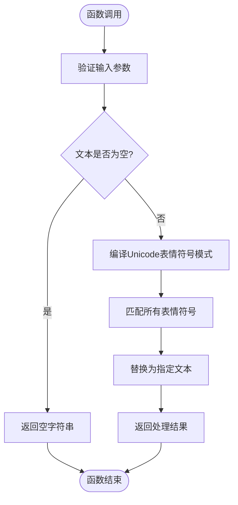

**图表来源**
- [src/utils.py:118-135](file://src/utils.py#L118-L135)

#### JSONP解析功能
提供JSONP格式数据的解析能力：

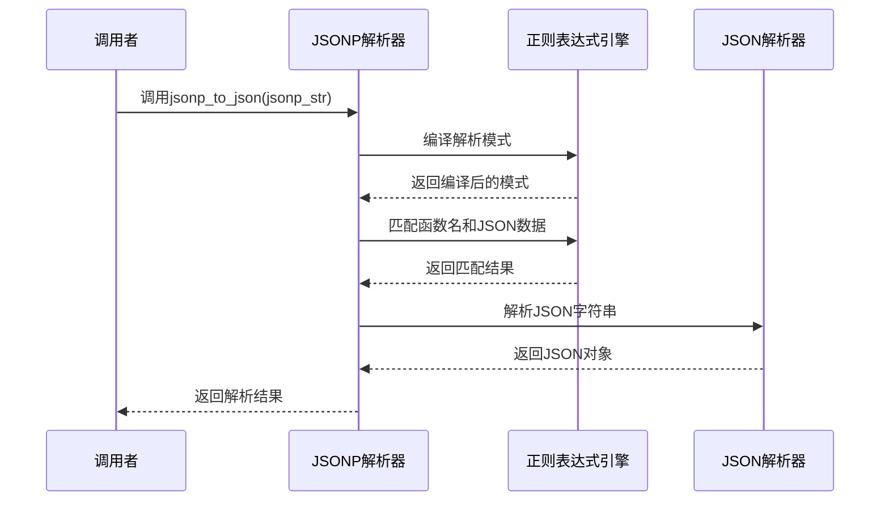

**图表来源**
- [src/utils.py:177-187](file://src/utils.py#L177-L187)

**章节来源**
- [src/utils.py:118-187](file://src/utils.py#L118-L187)

### 文件操作组件

#### 磁盘容量检查功能
提供磁盘空间监控能力：

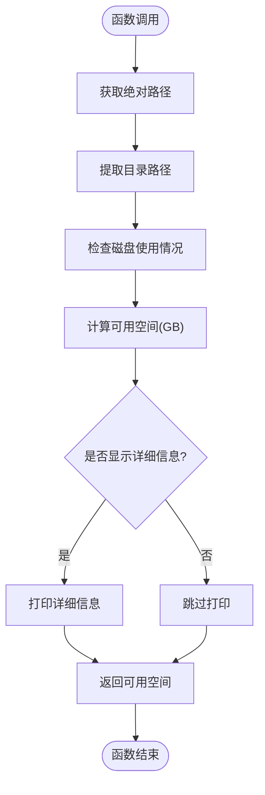

**图表来源**
- [src/utils.py:149-159](file://src/utils.py#L149-L159)

#### 代理地址处理功能
统一处理不同格式的代理地址：

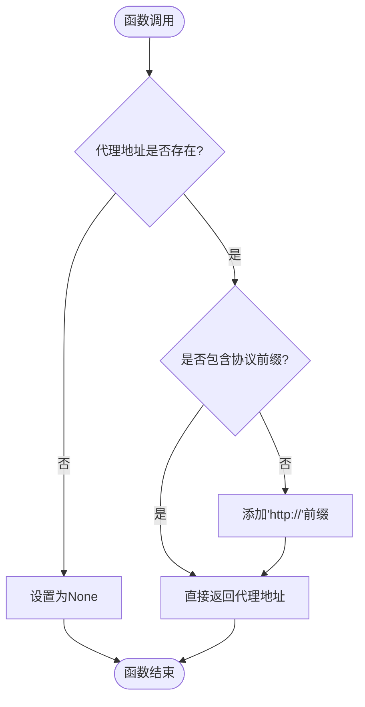

**图表来源**
- [src/utils.py:162-168](file://src/utils.py#L162-L168)

**章节来源**
- [src/utils.py:149-168](file://src/utils.py#L149-L168)

### 配置管理组件

#### 配置文件读取功能
提供安全的配置文件读取机制：

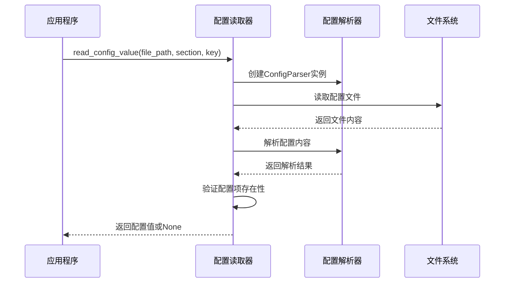

**图表来源**
- [src/utils.py:65-82](file://src/utils.py#L65-L82)

#### 配置文件更新功能
提供配置文件的安全更新机制：

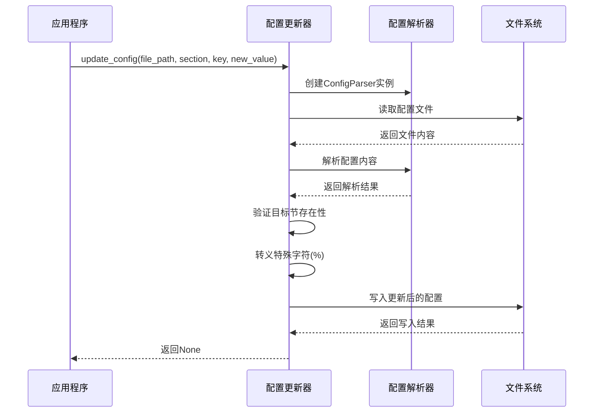

**图表来源**
- [src/utils.py:85-107](file://src/utils.py#L85-L107)

**章节来源**
- [src/utils.py:65-107](file://src/utils.py#L65-L107)

### 日志系统组件

#### 日志配置架构
日志系统采用多处理器架构，支持不同级别的日志输出：

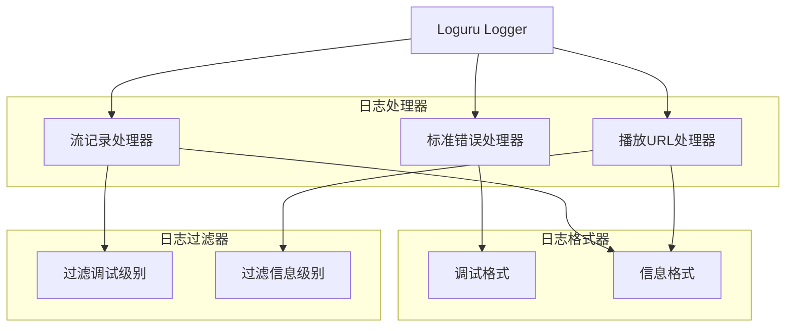

**图表来源**
- [src/logger.py:1-44](file://src/logger.py#L1-L44)

**章节来源**
- [src/logger.py:1-44](file://src/logger.py#L1-L44)

### 代理检测组件

#### 跨平台代理检测架构
代理检测功能支持Windows和Linux系统的代理配置检测：

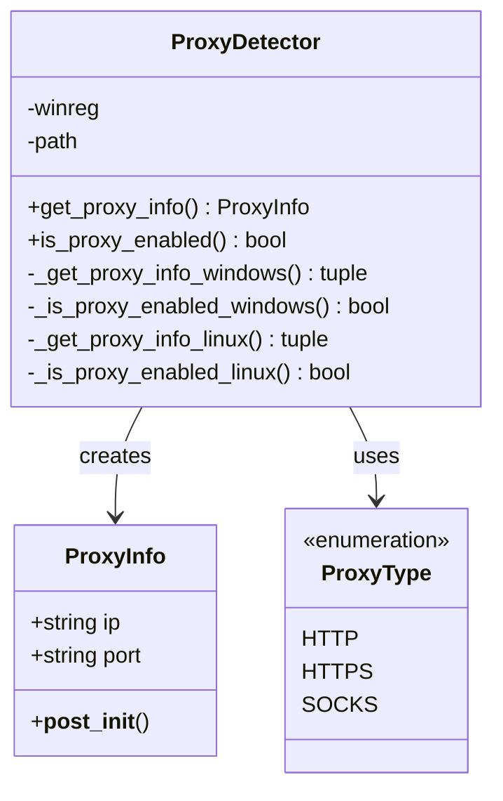

**图表来源**
- [src/proxy.py:8-93](file://src/proxy.py#L8-L93)

**章节来源**
- [src/proxy.py:8-93](file://src/proxy.py#L8-L93)

## 依赖分析

### 外部依赖关系

项目的主要外部依赖包括：

```mermaid
graph TB
subgraph "核心依赖"
Requests[requests>=2.31.0]
Loguru[loguru>=0.7.3]
Crypto[pycryptodome>=3.20.0]
Distro[distro>=1.9.0]
Tqdm[tqdm>=4.67.1]
Httpx[httpx[http2]>=0.28.1]
ExecJS[PyExecJS>=1.5.1]
end
subgraph "内部模块"
Utils[utils.py]
Logger[logger.py]
Initializer[initializer.py]
Proxy[proxy.py]
Room[room.py]
end
Utils --> Requests
Utils --> Loguru
Utils --> Httpx
Utils --> ExecJS
Logger --> Loguru
Initializer --> Requests
Initializer --> Distro
Initializer --> Tqdm
Proxy --> Loguru
Room --> Httpx
Room --> ExecJS
```

**图表来源**
- [requirements.txt:1-7](file://requirements.txt#L1-L7)
- [src/utils.py:1-17](file://src/utils.py#L1-L17)

### 内部模块依赖

工具函数模块与其他模块的依赖关系：

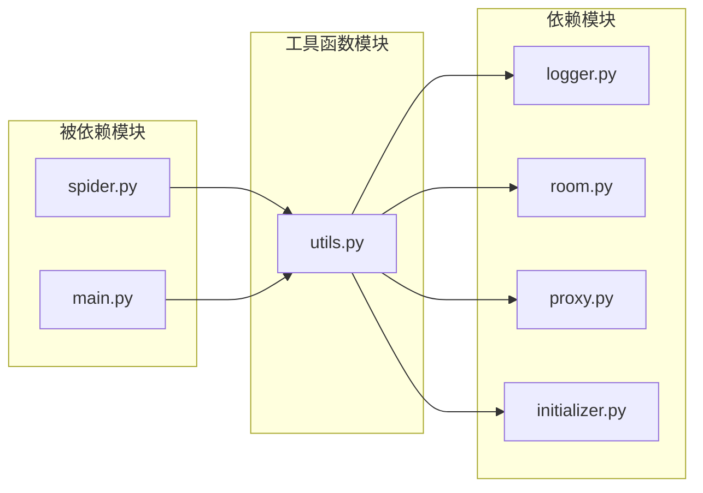

**图表来源**
- [src/utils.py:16](file://src/utils.py#L16)
- [src/room.py:15](file://src/room.py#L15)

**章节来源**
- [requirements.txt:1-7](file://requirements.txt#L1-L7)

## 性能考虑

### 时间复杂度分析

1. **文件遍历操作**: `get_file_paths()`函数的时间复杂度为O(n)，其中n是文件总数
2. **磁盘容量检查**: `check_disk_capacity()`函数的时间复杂度为O(1)
3. **配置文件读取**: `read_config_value()`函数的时间复杂度为O(m)，其中m是配置项数量
4. **字符串处理**: 各种字符串处理函数的时间复杂度通常为O(k)，其中k是字符串长度

### 内存使用优化

1. **文件读取**: 使用生成器模式处理大文件，避免一次性加载到内存
2. **正则表达式**: 预编译正则表达式以提高重复使用的性能
3. **缓存策略**: 对于频繁访问的配置项，建议在应用层面实现缓存机制

### 并发处理

工具函数模块目前主要采用同步模式，但在某些场景下可以考虑：
- 使用异步I/O处理大量文件操作
- 实现线程池处理并发任务
- 利用生成器减少内存占用

## 故障排除指南

### 常见问题及解决方案

#### 配置文件读取失败
**问题症状**: `read_config_value()`返回None
**可能原因**:
- 配置文件不存在或路径错误
- 文件编码格式不正确
- 权限不足无法读取文件

**解决方案**:
1. 验证配置文件路径的正确性
2. 检查文件编码格式（应为utf-8-sig）
3. 确认应用程序具有文件读取权限

#### 代理配置问题
**问题症状**: 网络请求失败或代理连接超时
**可能原因**:
- 代理地址格式不正确
- 代理服务器不可用
- 网络连接问题

**解决方案**:
1. 使用`handle_proxy_addr()`函数标准化代理地址格式
2. 验证代理服务器的可用性和响应时间
3. 检查防火墙和网络设置

#### 日志输出异常
**问题症状**: 日志文件未生成或内容异常
**可能原因**:
- 日志目录权限不足
- 文件句柄未正确关闭
- 日志格式配置错误

**解决方案**:
1. 确认日志目录存在且具有写入权限
2. 检查日志文件的轮转和保留策略
3. 验证日志格式配置的正确性

**章节来源**
- [src/utils.py:65-107](file://src/utils.py#L65-L107)
- [src/proxy.py:38-93](file://src/proxy.py#L38-L93)
- [src/logger.py:1-44](file://src/logger.py#L1-L44)

## 结论

工具函数模块为DouyinLiveRecorder项目提供了坚实的基础功能支持。通过本文档的分析，我们可以看到：

1. **模块化设计**: 工具函数按功能分类组织，具有良好的内聚性和低耦合性
2. **错误处理**: 提供了完善的错误处理机制和日志记录功能
3. **跨平台兼容**: 支持Windows和Linux等多种操作系统
4. **扩展性**: 模块设计允许轻松添加新的工具函数

对于未来的扩展，建议遵循本文档提供的最佳实践，确保新功能与现有代码保持一致的风格和质量标准。

## 附录

### 开发者最佳实践

#### 函数设计原则
1. **单一职责**: 每个函数应该专注于一个特定的任务
2. **参数验证**: 对所有输入参数进行适当的验证和类型检查
3. **错误处理**: 提供清晰的错误信息和适当的异常处理
4. **文档注释**: 为所有公共函数提供详细的文档字符串

#### 代码示例模板

```python
def new_utility_function(parameter1: Type1, parameter2: Type2 = default_value) -> ReturnType:
    """
    简要描述函数功能
    
    参数:
        parameter1: 参数1的用途说明
        parameter2: 参数2的用途说明，包含默认值
    
    返回:
        返回值的类型和含义
    
    异常:
        可能抛出的异常类型和触发条件
    
    示例:
        >>> result = new_utility_function("test", 42)
        >>> print(result)
        "expected_result"
    """
    # 函数实现
    pass
```

#### 向后兼容性考虑
1. **参数向后兼容**: 添加新参数时，确保提供合理的默认值
2. **返回值兼容**: 修改返回值结构时，提供兼容的替代方案
3. **API稳定性**: 避免破坏性的API变更，必要时提供迁移指南
4. **文档更新**: 及时更新相关文档和示例代码

#### 测试建议
1. **单元测试**: 为每个工具函数编写单元测试
2. **边界测试**: 测试输入参数的边界条件
3. **错误测试**: 验证错误处理逻辑的正确性
4. **集成测试**: 测试函数之间的交互和组合使用