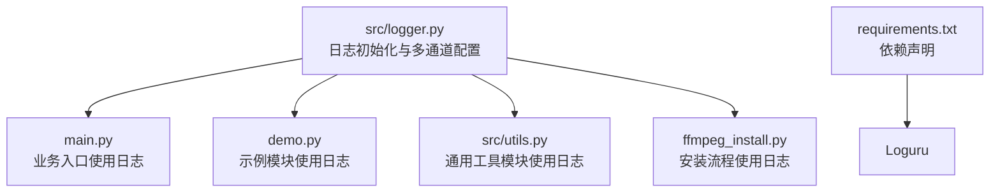
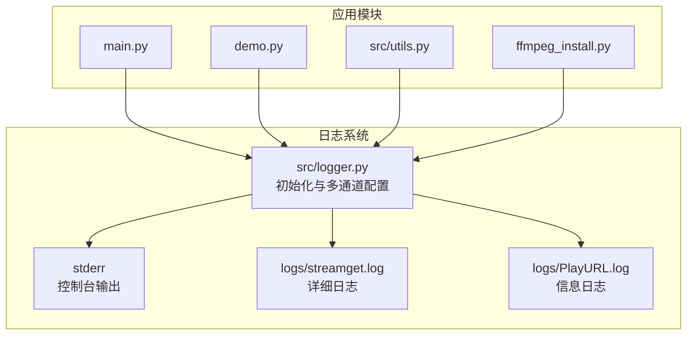
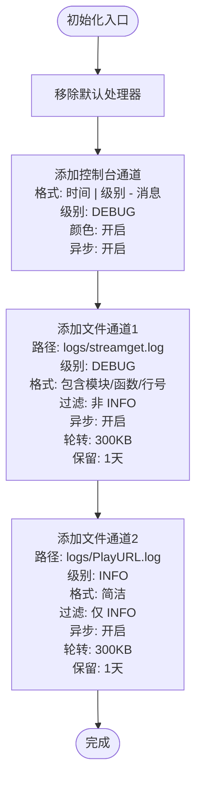
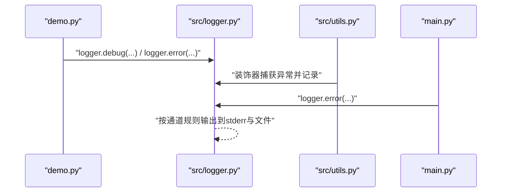
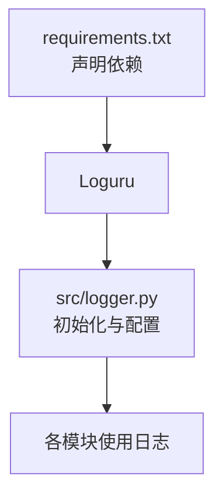

# 日志系统扩展

<cite>
**本文引用的文件**
- [src/logger.py](file://src/logger.py)
- [main.py](file://main.py)
- [demo.py](file://demo.py)
- [src/utils.py](file://src/utils.py)
- [ffmpeg_install.py](file://ffmpeg_install.py)
- [requirements.txt](file://requirements.txt)
- [README.md](file://README.md)
</cite>

## 目录
1. [引言](#引言)
2. [项目结构](#项目结构)
3. [核心组件](#核心组件)
4. [架构总览](#架构总览)
5. [详细组件分析](#详细组件分析)
6. [依赖分析](#依赖分析)
7. [性能考量](#性能考量)
8. [故障排查指南](#故障排查指南)
9. [结论](#结论)
10. [附录](#附录)

## 引言
本指南面向开发者，系统讲解如何在现有日志系统基础上进行扩展与定制，包括但不限于：
- 新增日志级别与自定义格式
- 多输出目标配置（控制台、文件、条件过滤）
- 日志轮转与保留策略
- 性能监控日志与异步写入
- 结构化日志、上下文日志、异步日志写入、日志过滤器等高级能力
- 最佳实践与性能优化建议

日志系统基于 Loguru 实现，已在入口处完成初始化与多通道输出配置。

## 项目结构
日志系统位于 src/logger.py，其他模块通过统一导入的 logger 实例进行日志记录；同时 README.md 展示了项目整体结构，便于定位日志相关目录与文件。

图表来源
- [src/logger.py:1-44](file://src/logger.py#L1-L44)
- [main.py:32](file://main.py#L32)
- [demo.py:3](file://demo.py#L3)
- [src/utils.py:16](file://src/utils.py#L16)
- [ffmpeg_install.py:18](file://ffmpeg_install.py#L18)
- [requirements.txt:2](file://requirements.txt#L2)

章节来源
- [README.md:72-100](file://README.md#L72-L100)
- [requirements.txt:1-7](file://requirements.txt#L1-L7)

## 核心组件
- 日志初始化与多通道配置：在 src/logger.py 中完成移除默认处理器、自定义格式、异步队列、条件过滤、轮转与保留策略等配置。
- 日志使用入口：各模块通过 from src.logger import logger 导入统一实例，按需调用 debug/info/warning/error 等方法。
- 日志输出目标：
  - 控制台输出（stderr），彩色高亮，包含时间与级别。
  - 文件输出（streamget.log），非 INFO 级别写入，带模块名、函数名、行号。
  - 文件输出（PlayURL.log），仅 INFO 级别写入，简洁格式。
- 日志轮转与保留：基于大小的轮转与天数保留策略，避免磁盘占用过大。

章节来源
- [src/logger.py:7-43](file://src/logger.py#L7-L43)

## 架构总览
下图展示了日志系统在应用中的位置与交互关系：

图表来源
- [src/logger.py:11-43](file://src/logger.py#L11-L43)
- [main.py:32](file://main.py#L32)
- [demo.py:3](file://demo.py#L3)
- [src/utils.py:16](file://src/utils.py#L16)
- [ffmpeg_install.py:18](file://ffmpeg_install.py#L18)

## 详细组件分析

### 日志初始化与多通道配置（src/logger.py）
- 移除默认处理器，避免重复输出
- 控制台通道：格式化时间与级别，彩色输出，异步队列
- 文件通道1：streamget.log，非 INFO 级别，包含模块名/函数/行号，异步队列，大小轮转与保留
- 文件通道2：PlayURL.log，仅 INFO 级别，简洁格式，异步队列，大小轮转与保留
- 路径：脚本所在目录下的 logs 子目录

图表来源
- [src/logger.py:7-43](file://src/logger.py#L7-L43)

章节来源
- [src/logger.py:7-43](file://src/logger.py#L7-L43)

### 日志使用示例（main.py、demo.py、src/utils.py、ffmpeg_install.py）
- main.py：在业务逻辑中使用 logger.error 记录异常信息
- demo.py：在测试脚本中使用 logger.debug/logger.error/logger.warning
- src/utils.py：在装饰器中捕获异常并记录详细错误信息
- ffmpeg_install.py：在安装流程中使用 logger.warning/debug/error

图表来源
- [demo.py:213-222](file://demo.py#L213-L222)
- [src/utils.py:38-51](file://src/utils.py#L38-L51)
- [main.py:134](file://main.py#L134)
- [src/logger.py:11-43](file://src/logger.py#L11-L43)

章节来源
- [demo.py:213-222](file://demo.py#L213-L222)
- [src/utils.py:38-51](file://src/utils.py#L38-L51)
- [main.py:134](file://main.py#L134)

### 日志扩展点与最佳实践

- 新增日志级别
  - 使用 Loguru 的 add 方法注册新通道，设置 level 参数
  - 示例路径：[src/logger.py:11-17](file://src/logger.py#L11-L17)
  - 注意：级别名称与数值由 Loguru 内置，无需额外定义

- 自定义日志格式
  - 控制台与文件通道分别设置 format
  - 支持时间、级别、消息、模块名、函数名、行号等字段
  - 示例路径：
    - 控制台：[src/logger.py:9-17](file://src/logger.py#L9-L17)
    - 文件通道1：[src/logger.py:24-31](file://src/logger.py#L24-L31)
    - 文件通道2：[src/logger.py:36-43](file://src/logger.py#L36-L43)

- 多输出目标配置
  - 控制台：sys.stderr
  - 文件：按路径添加多个 add 调用
  - 示例路径：[src/logger.py:11-43](file://src/logger.py#L11-L43)

- 日志轮转管理
  - 基于大小的轮转（rotation="300 KB"）
  - 保留策略（retention=1）
  - 示例路径：[src/logger.py:28-31](file://src/logger.py#L28-L31), [src/logger.py:40-43](file://src/logger.py#L40-L43)

- 性能监控日志
  - 建议在高频路径使用 debug/info，避免在热路径频繁调用 error
  - 使用异步队列（enqueue=True）降低阻塞
  - 示例路径：[src/logger.py:16](file://src/logger.py#L16), [src/logger.py:27](file://src/logger.py#L27), [src/logger.py:39](file://src/logger.py#L39)

- 结构化日志
  - 使用 serialize 参数序列化复杂对象
  - 示例路径：[src/logger.py:26](file://src/logger.py#L26), [src/logger.py:38](file://src/logger.py#L38)

- 上下文日志
  - 通过绑定上下文（如任务ID、用户ID）在日志中携带上下文信息
  - 可结合 filter 或自定义处理器实现
  - 示例路径：[src/logger.py:25](file://src/logger.py#L25), [src/logger.py:37](file://src/logger.py#L37)

- 异步日志写入
  - enqueue=True 启用内部队列
  - 示例路径：[src/logger.py:16](file://src/logger.py#L16), [src/logger.py:27](file://src/logger.py#L27), [src/logger.py:39](file://src/logger.py#L39)

- 日志过滤器
  - 使用 filter 参数按级别或其他条件筛选
  - 示例路径：[src/logger.py:25](file://src/logger.py#L25), [src/logger.py:37](file://src/logger.py#L37)

- 错误处理与异常记录
  - 在装饰器中捕获异常并记录详细信息
  - 示例路径：[src/utils.py:38-51](file://src/utils.py#L38-L51)

章节来源
- [src/logger.py:9-43](file://src/logger.py#L9-L43)
- [src/utils.py:38-51](file://src/utils.py#L38-L51)

## 依赖分析
- 日志系统依赖 Loguru 库，版本要求在 requirements.txt 中声明
- 项目中所有模块通过统一的 logger 实例进行日志记录，耦合度低，扩展性强

图表来源
- [requirements.txt:2](file://requirements.txt#L2)
- [src/logger.py:5](file://src/logger.py#L5)

章节来源
- [requirements.txt:1-7](file://requirements.txt#L1-L7)
- [src/logger.py:5](file://src/logger.py#L5)

## 性能考量
- 异步写入：enqueue=True 提升吞吐，减少主线程阻塞
- 轮转策略：按大小轮转避免单文件过大，保留策略控制磁盘占用
- 格式化成本：复杂格式与序列化会增加 CPU 开销，建议在非关键路径使用
- 过滤与级别：合理使用 filter 与级别，避免不必要的 IO
- 输出目标：多通道输出会增加 IO 压力，建议按需启用

## 故障排查指南
- 日志未输出
  - 检查是否正确导入 logger 实例
  - 确认通道级别与消息级别匹配
  - 示例路径：[main.py:32](file://main.py#L32), [demo.py:3](file://demo.py#L3)

- 日志文件未生成
  - 确认 logs 目录存在且有写权限
  - 检查路径拼接与脚本执行目录
  - 示例路径：[src/logger.py:19-20](file://src/logger.py#L19-L20), [src/logger.py:21-31](file://src/logger.py#L21-L31), [src/logger.py:33-43](file://src/logger.py#L33-L43)

- 日志轮转无效
  - 检查 rotation 与 retention 设置
  - 确认文件大小达到阈值触发轮转
  - 示例路径：[src/logger.py:28-31](file://src/logger.py#L28-L31), [src/logger.py:40-43](file://src/logger.py#L40-L43)

- 异步写入未生效
  - 确认 enqueue=True 已设置
  - 示例路径：[src/logger.py:16](file://src/logger.py#L16), [src/logger.py:27](file://src/logger.py#L27), [src/logger.py:39](file://src/logger.py#L39)

- 异常信息未记录
  - 检查装饰器或 try/except 是否正确捕获并记录
  - 示例路径：[src/utils.py:38-51](file://src/utils.py#L38-L51)

章节来源
- [src/logger.py:16-43](file://src/logger.py#L16-L43)
- [src/utils.py:38-51](file://src/utils.py#L38-L51)
- [main.py:32](file://main.py#L32)
- [demo.py:3](file://demo.py#L3)

## 结论
通过在 src/logger.py 中集中配置日志通道、格式、过滤与轮转策略，项目实现了清晰、可扩展的日志体系。开发者可在此基础上按需新增通道、调整格式、引入结构化与上下文信息，并结合异步写入与轮转策略提升性能与可维护性。

## 附录
- 项目结构概览与日志目录说明：[README.md:72-100](file://README.md#L72-L100)
- 依赖声明与版本要求：[requirements.txt:1-7](file://requirements.txt#L1-L7)