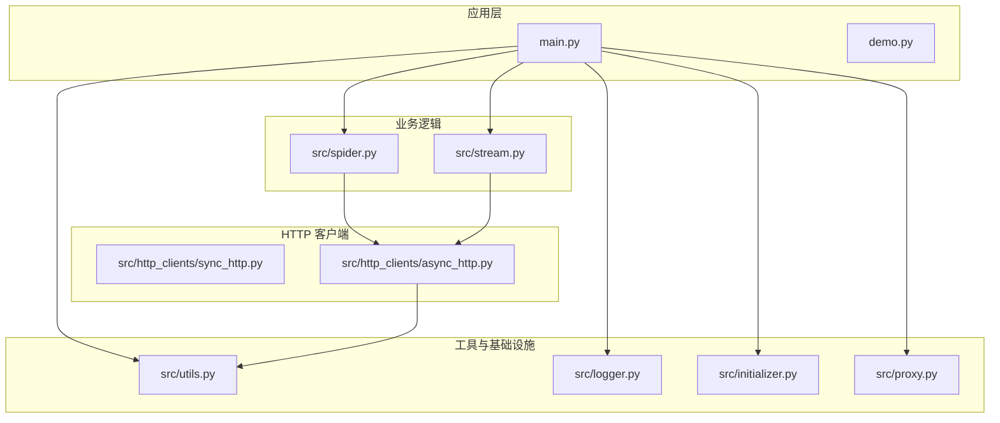
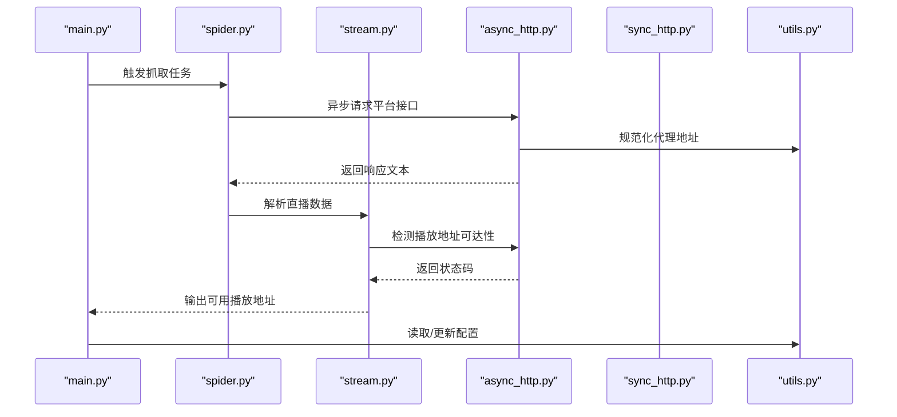
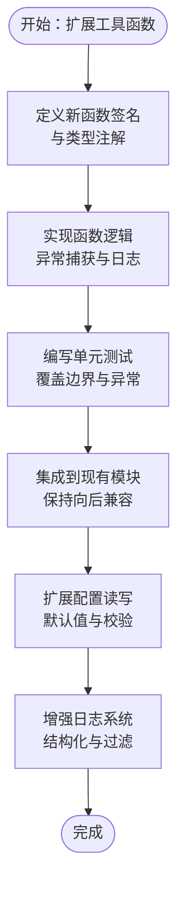
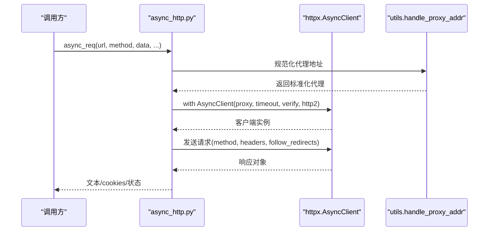
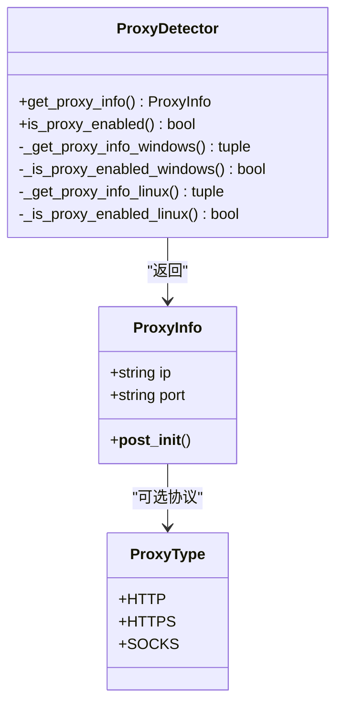
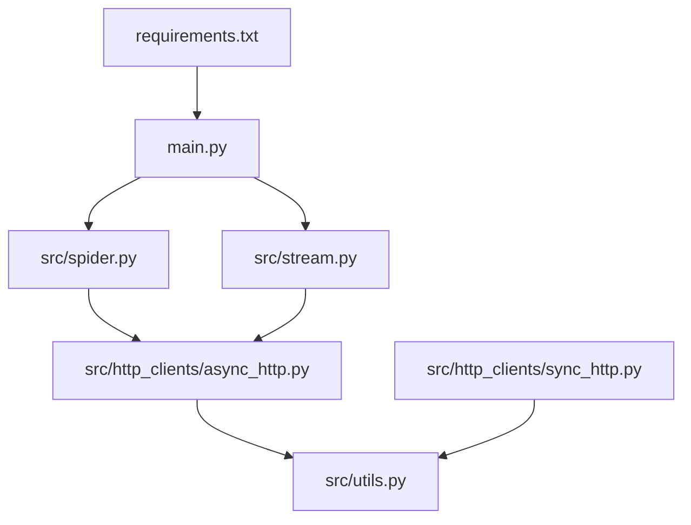

# 模块扩展开发

<cite>
**本文引用的文件**
- [src/utils.py](file://src/utils.py)
- [src/logger.py](file://src/logger.py)
- [src/http_clients/sync_http.py](file://src/http_clients/sync_http.py)
- [src/http_clients/async_http.py](file://src/http_clients/async_http.py)
- [src/proxy.py](file://src/proxy.py)
- [src/initializer.py](file://src/initializer.py)
- [src/spider.py](file://src/spider.py)
- [src/stream.py](file://src/stream.py)
- [config/URL_config.ini](file://config/URL_config.ini)
- [main.py](file://main.py)
- [requirements.txt](file://requirements.txt)
- [demo.py](file://demo.py)
</cite>

## 目录
1. [简介](#简介)
2. [项目结构](#项目结构)
3. [核心组件](#核心组件)
4. [架构总览](#架构总览)
5. [详细组件分析](#详细组件分析)
6. [依赖分析](#依赖分析)
7. [性能考虑](#性能考虑)
8. [故障排查指南](#故障排查指南)
9. [结论](#结论)
10. [附录](#附录)

## 简介
本指南面向开发者，系统讲解如何在现有代码库基础上进行模块扩展，涵盖以下主题：
- 工具函数模块扩展：新增实用工具函数、扩展配置管理功能、增强日志系统
- HTTP 客户端模块扩展：新增 HTTP 方法支持、代理配置扩展、连接池管理
- 具体示例路径：通过“章节来源”定位到相应实现位置，便于直接参考
- 设计原则与最佳实践：可维护性、可测试性、兼容性与性能平衡

## 项目结构
项目采用按功能域划分的模块化组织方式，核心目录与职责如下：
- src/utils.py：通用工具函数集合（配置读写、字符串处理、代理地址规范化、JSONP 解析等）
- src/logger.py：日志初始化与多通道输出（控制台与文件，带轮转与保留策略）
- src/http_clients：同步与异步 HTTP 客户端封装
  - sync_http.py：基于 urllib/requests 的同步请求
  - async_http.py：基于 httpx 的异步请求，支持 cookies 返回与 HTTP/2
- src/proxy.py：跨平台代理探测与信息解析
- src/initializer.py：Node.js 自动安装与运行时检查
- src/spider.py：各平台直播源抓取与参数处理
- src/stream.py：直播流质量选择与可用性检测
- config/URL_config.ini：示例 URL 配置文件
- main.py：主程序入口，负责配置加载、监控与调度
- requirements.txt：第三方依赖清单
- demo.py：示例配置与调用入口

图表来源
- [main.py](file://main.py)
- [src/spider.py](file://src/spider.py)
- [src/stream.py](file://src/stream.py)
- [src/http_clients/async_http.py](file://src/http_clients/async_http.py)
- [src/utils.py](file://src/utils.py)

章节来源
- [main.py](file://main.py)
- [src/utils.py](file://src/utils.py)
- [src/logger.py](file://src/logger.py)
- [src/http_clients/sync_http.py](file://src/http_clients/sync_http.py)
- [src/http_clients/async_http.py](file://src/http_clients/async_http.py)
- [src/proxy.py](file://src/proxy.py)
- [src/initializer.py](file://src/initializer.py)
- [src/spider.py](file://src/spider.py)
- [src/stream.py](file://src/stream.py)
- [config/URL_config.ini](file://config/URL_config.ini)
- [requirements.txt](file://requirements.txt)
- [demo.py](file://demo.py)

## 核心组件
- 工具函数模块（src/utils.py）
  - 配置读写：读取/更新 INI 配置，自动转义百分号，异常安全
  - 字符串与文件处理：MD5、Cookie 字符串拼接、去重、Emoji 移除、磁盘容量检查
  - 代理地址规范化：统一 http/https 前缀，空值安全
  - JSONP 解析：正则匹配回调包裹，提取 JSON
  - URL 参数解析：解析查询参数，支持单值或全量返回
- 日志模块（src/logger.py）
  - 控制台彩色输出与文件落盘
  - 多通道：错误日志与播放 URL 日志分离，带轮转与保留策略
- HTTP 客户端
  - 同步：支持代理、gzip 解压、超时、异常捕获
  - 异步：支持 cookies 返回、HTTP/2、follow_redirects、verify 关闭选项
- 代理探测（src/proxy.py）
  - 跨平台：Windows 注册表与 Linux 环境变量
  - 数据模型：枚举与不可变数据类，参数校验
- 初始化器（src/initializer.py）
  - Node.js 自动安装与版本检查，装饰器确保运行时可用
- 业务模块
  - 抓取（src/spider.py）：各平台直播数据获取与 a_bogus 签名集成
  - 流处理（src/stream.py）：质量映射、可用性检测与回退策略

章节来源
- [src/utils.py](file://src/utils.py)
- [src/logger.py](file://src/logger.py)
- [src/http_clients/sync_http.py](file://src/http_clients/sync_http.py)
- [src/http_clients/async_http.py](file://src/http_clients/async_http.py)
- [src/proxy.py](file://src/proxy.py)
- [src/initializer.py](file://src/initializer.py)
- [src/spider.py](file://src/spider.py)
- [src/stream.py](file://src/stream.py)

## 架构总览
整体流程从 main.py 启动，加载配置与日志，初始化运行时环境，随后进入监控循环；业务侧通过 spider 与 stream 调用 HTTP 客户端获取直播数据与播放地址，再由工具函数完成配置读写与代理处理。

图表来源
- [main.py](file://main.py)
- [src/spider.py](file://src/spider.py)
- [src/stream.py](file://src/stream.py)
- [src/http_clients/async_http.py](file://src/http_clients/async_http.py)
- [src/utils.py](file://src/utils.py)

## 详细组件分析

### 工具函数模块扩展指南
目标：在不破坏现有 API 的前提下，新增实用工具函数、扩展配置读写能力、增强日志系统。

- 新增实用工具函数
  - 建议遵循现有风格：明确类型注解、异常捕获与日志记录、默认值与边界处理
  - 示例路径参考：
    - [字符串与文件处理函数集合](file://src/utils.py)
    - [JSONP 解析与 URL 参数解析](file://src/utils.py)
- 扩展配置管理功能
  - 在现有 read_config_value/update_config 基础上，增加：
    - 多段落批量读取/写入
    - 默认值合并与回退策略
    - 配置项校验与类型转换
  - 参考实现位置：
    - [配置读取函数](file://src/utils.py)
    - [配置更新函数](file://src/utils.py)
    - [主程序配置读取与默认值注入](file://main.py)
- 增强日志系统
  - 在现有 sink 基础上，新增：
    - 结构化日志字段（trace_id、module、action）
    - 异步队列与并发安全
    - 多级过滤与动态开关
  - 参考实现位置：
    - [日志初始化与多通道](file://src/logger.py)

图表来源
- [src/utils.py](file://src/utils.py)
- [src/logger.py](file://src/logger.py)
- [main.py](file://main.py)

章节来源
- [src/utils.py](file://src/utils.py)
- [src/logger.py](file://src/logger.py)
- [main.py](file://main.py)

### HTTP 客户端模块扩展指南
目标：在现有同步/异步客户端基础上，扩展支持更多 HTTP 方法、代理配置与连接池管理。

- 新增 HTTP 方法支持
  - 同步客户端：在 sync_req 中根据 data/json_data 判断 POST/GET，建议扩展为显式 method 参数
  - 异步客户端：在 async_req 中增加 method 参数与 body 类型判断
  - 参考实现位置：
    - [同步请求函数](file://src/http_clients/sync_http.py)
    - [异步请求函数](file://src/http_clients/async_http.py)
- 代理配置扩展
  - 支持 SOCKS 代理（当前仅 HTTP/HTTPS），在 utils.handle_proxy_addr 基础上扩展协议识别
  - 参考实现位置：
    - [代理地址规范化](file://src/utils.py)
    - [代理探测与信息模型](file://src/proxy.py)
- 连接池管理
  - 异步客户端：复用 httpx.AsyncClient 实例，减少握手开销
  - 同步客户端：引入连接池（如 urllib3）以提升高并发场景性能
  - 参考实现位置：
    - [异步客户端复用模式](file://src/http_clients/async_http.py)

图表来源
- [src/http_clients/async_http.py](file://src/http_clients/async_http.py)
- [src/utils.py](file://src/utils.py)

章节来源
- [src/http_clients/sync_http.py](file://src/http_clients/sync_http.py)
- [src/http_clients/async_http.py](file://src/http_clients/async_http.py)
- [src/utils.py](file://src/utils.py)
- [src/proxy.py](file://src/proxy.py)

### 代理系统扩展设计
目标：支持更多代理协议与自动发现，增强健壮性与可配置性。

- 协议扩展
  - 在 ProxyType 中新增 SOCKS，并在 ProxyInfo 中扩展协议字段
  - 在 handle_proxy_addr 中识别并构造 httpx 代理字典
- 自动发现
  - 统一 Windows 注册表与 Linux 环境变量读取，支持多种代理键
- 校验与容错
  - 对 IP/端口进行严格校验，异常时降级为直连

图表来源
- [src/proxy.py](file://src/proxy.py)

章节来源
- [src/proxy.py](file://src/proxy.py)
- [src/utils.py](file://src/utils.py)

### 日志系统扩展设计
目标：在现有 sink 基础上，增强结构化与可运维性。

- 结构化字段
  - 增加 trace_id、module、action、level 等字段，便于检索
- 动态过滤
  - 提供运行时开关，按模块/级别过滤输出
- 文件轮转
  - 保持现有大小限制与保留天数策略，避免磁盘占用过大

章节来源
- [src/logger.py](file://src/logger.py)

### 配置系统扩展设计
目标：在现有 INI 配置基础上，增强默认值注入与类型转换。

- 默认值注入
  - 在读取失败时自动创建默认值并写回配置文件
- 类型转换
  - 将字符串转换为布尔、整数、浮点等类型，避免运行时类型错误
- 主程序集成
  - 在启动阶段集中读取并校验关键配置项

章节来源
- [main.py](file://main.py)
- [src/utils.py](file://src/utils.py)
- [config/URL_config.ini](file://config/URL_config.ini)

## 依赖分析
- 第三方依赖
  - requests、httpx[http2]、loguru、pycryptodome、distro、tqdm、PyExecJS
- 内部模块耦合
  - spider/stream 依赖 async_http；async_http 依赖 utils.handle_proxy_addr；main.py 统一调度并读取配置

图表来源
- [requirements.txt](file://requirements.txt)
- [main.py](file://main.py)
- [src/spider.py](file://src/spider.py)
- [src/stream.py](file://src/stream.py)
- [src/http_clients/async_http.py](file://src/http_clients/async_http.py)
- [src/http_clients/sync_http.py](file://src/http_clients/sync_http.py)
- [src/utils.py](file://src/utils.py)

章节来源
- [requirements.txt](file://requirements.txt)
- [main.py](file://main.py)
- [src/spider.py](file://src/spider.py)
- [src/stream.py](file://src/stream.py)
- [src/http_clients/async_http.py](file://src/http_clients/async_http.py)
- [src/http_clients/sync_http.py](file://src/http_clients/sync_http.py)
- [src/utils.py](file://src/utils.py)

## 性能考虑
- 异步优先：在 IO 密集场景优先使用 async_http，减少阻塞
- 连接复用：复用 httpx.AsyncClient 实例，降低握手成本
- 代理与证书：在调试阶段可关闭 verify，生产环境务必启用
- 日志落盘：控制文件大小与轮转频率，避免磁盘 IO 抖动
- 配置缓存：对频繁读取的配置项进行内存缓存，减少磁盘访问

## 故障排查指南
- Node.js 缺失
  - 使用 ensure_nodejs_installed 装饰器确保可用，否则抛出运行时错误
  - 参考实现位置：
    - [Node.js 安装与检查](file://src/initializer.py)
- HTTP 请求异常
  - 同步：捕获 HTTPError/URLError 并打印错误信息
  - 异步：捕获异常并返回字符串形式的错误描述
  - 参考实现位置：
    - [同步请求异常处理](file://src/http_clients/sync_http.py)
    - [异步请求异常处理](file://src/http_clients/async_http.py)
- 日志未输出
  - 检查 sink 配置与过滤条件，确认文件路径存在且有写权限
  - 参考实现位置：
    - [日志初始化](file://src/logger.py)
- 配置读写失败
  - 检查文件编码（utf-8-sig）、Section/Key 是否存在，必要时自动创建
  - 参考实现位置：
    - [配置读取与更新](file://src/utils.py)
    - [主程序默认值注入](file://main.py)

章节来源
- [src/initializer.py](file://src/initializer.py)
- [src/http_clients/sync_http.py](file://src/http_clients/sync_http.py)
- [src/http_clients/async_http.py](file://src/http_clients/async_http.py)
- [src/logger.py](file://src/logger.py)
- [src/utils.py](file://src/utils.py)
- [main.py](file://main.py)

## 结论
通过以上扩展指南，开发者可以在不破坏现有架构的前提下，逐步增强工具函数、HTTP 客户端与日志系统的能力。建议遵循“最小变更、向后兼容、可观测性优先”的原则，结合单元测试与集成测试，确保扩展的稳定性与可维护性。

## 附录
- 示例配置文件：URL_config.ini
- 示例调用入口：demo.py
- 依赖清单：requirements.txt

章节来源
- [config/URL_config.ini](file://config/URL_config.ini)
- [demo.py](file://demo.py)
- [requirements.txt](file://requirements.txt)