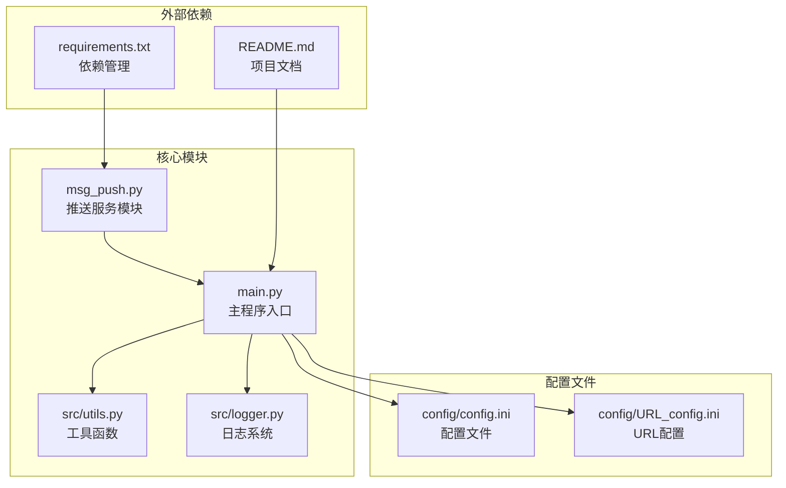
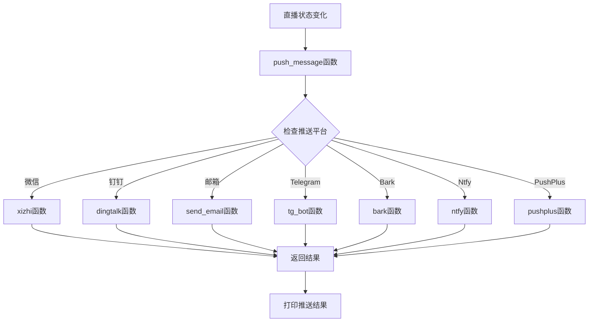
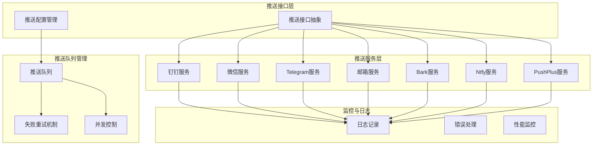
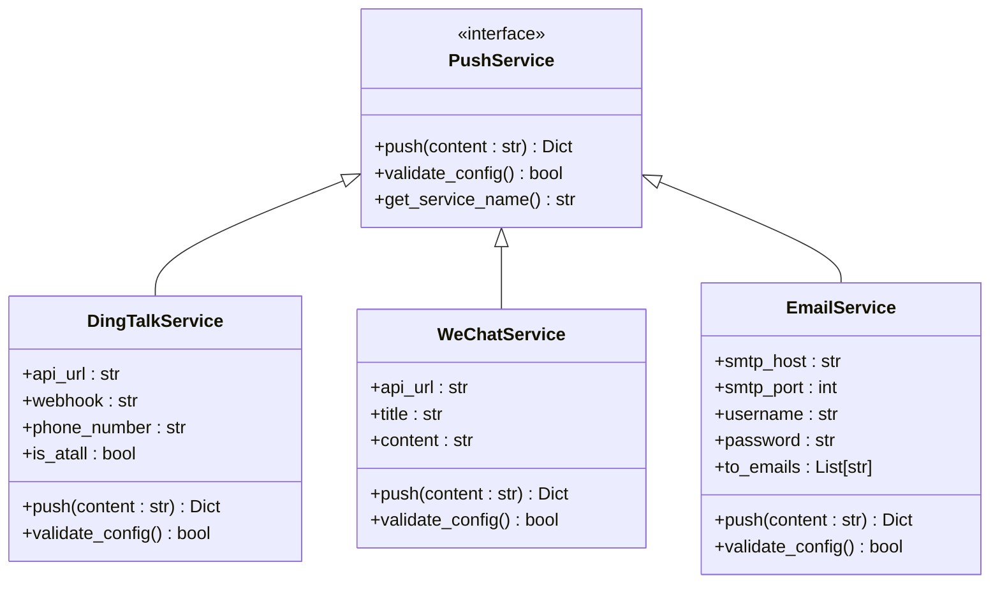
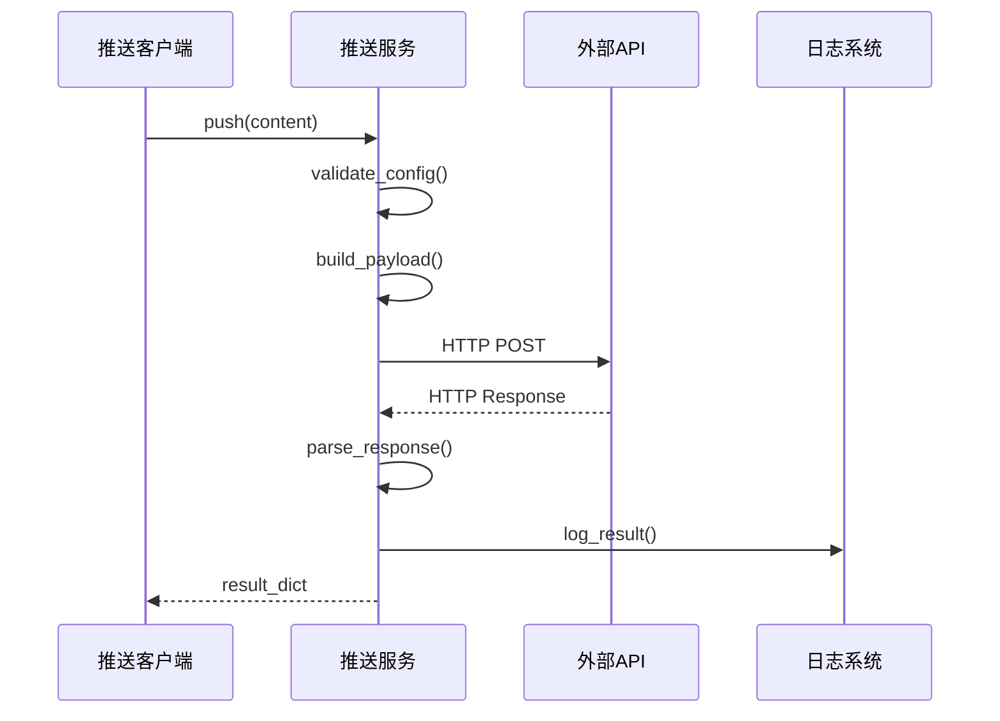
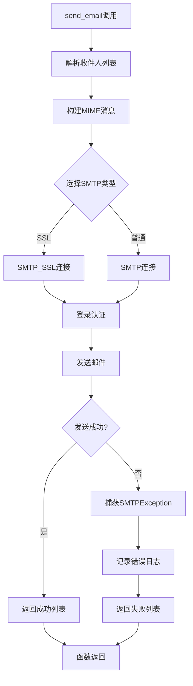
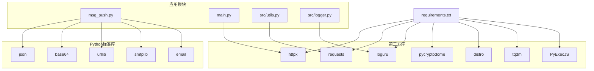
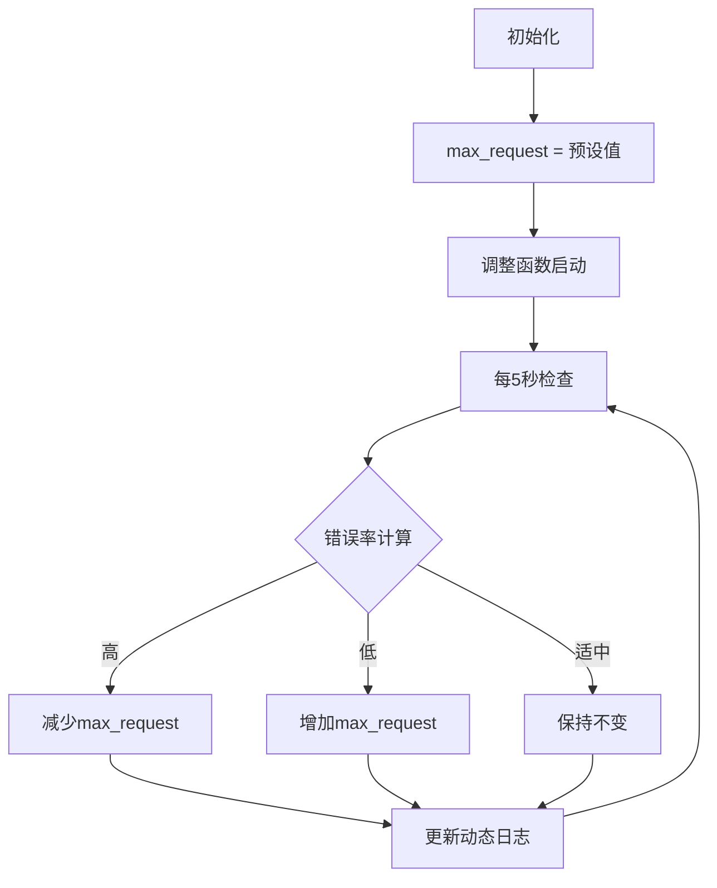

# 消息推送系统扩展

<cite>
**本文档引用的文件**
- [msg_push.py](file://msg_push.py)
- [main.py](file://main.py)
- [src/utils.py](file://src/utils.py)
- [src/logger.py](file://src/logger.py)
- [requirements.txt](file://requirements.txt)
- [README.md](file://README.md)
</cite>

## 目录
1. [简介](#简介)
2. [项目结构](#项目结构)
3. [核心组件](#核心组件)
4. [架构概览](#架构概览)
5. [详细组件分析](#详细组件分析)
6. [依赖关系分析](#依赖关系分析)
7. [性能考虑](#性能考虑)
8. [故障排除指南](#故障排除指南)
9. [结论](#结论)
10. [附录](#附录)

## 简介

DouyinLiveRecorder 是一个基于 Python 的直播录制工具，支持多平台直播源录制和直播状态推送功能。本文档专注于消息推送系统的扩展指南，详细说明如何扩展现有的消息推送功能，包括新增推送渠道、自定义推送模板、推送策略配置等。

该系统提供了多种推送渠道，包括钉钉、微信、Telegram、邮箱、Bark、Ntfy、PushPlus 等，采用模块化设计，便于扩展新的推送服务。

## 项目结构

**图表来源**
- [msg_push.py:1-296](file://msg_push.py#L1-L296)
- [main.py:34-36](file://main.py#L34-L36)
- [requirements.txt:1-7](file://requirements.txt#L1-L7)

**章节来源**
- [README.md:72-100](file://README.md#L72-L100)
- [main.py:34-36](file://main.py#L34-L36)

## 核心组件

### 推送服务模块 (msg_push.py)

推送服务模块是整个消息推送系统的核心，包含了所有现有的推送渠道实现：

- **钉钉推送** (`dingtalk`): 支持文本消息推送，支持@特定用户
- **微信推送** (`xizhi`): 支持单点推送接口
- **Telegram推送** (`tg_bot`): 支持聊天ID和机器人Token
- **邮箱推送** (`send_email`): 支持SMTP协议，支持SSL/TLS加密
- **Bark推送** (`bark`): 支持iOS推送通知
- **Ntfy推送** (`ntfy`): 支持跨平台推送通知
- **PushPlus推送** (`pushplus`): 支持PushPlus平台

每个推送函数都遵循统一的模式：
- 接收必要的配置参数
- 构建JSON请求体
- 发送HTTP请求
- 返回成功和失败的API地址列表

**章节来源**
- [msg_push.py:25-250](file://msg_push.py#L25-L250)

### 主程序集成 (main.py)

主程序通过 `push_message` 函数统一管理所有推送服务：

**图表来源**
- [main.py:327-354](file://main.py#L327-L354)

**章节来源**
- [main.py:327-354](file://main.py#L327-L354)

## 架构概览

**图表来源**
- [msg_push.py:25-250](file://msg_push.py#L25-L250)
- [main.py:327-354](file://main.py#L327-L354)

### 推送接口抽象

系统采用统一的推送接口抽象，所有推送服务都遵循相同的调用模式：

**图表来源**
- [msg_push.py:25-112](file://msg_push.py#L25-L112)

## 详细组件分析

### 推送服务实现模式

所有推送服务都遵循相似的实现模式，具有以下共同特征：

1. **参数验证**: 检查必要的配置参数
2. **请求构建**: 构建适当的JSON请求体
3. **HTTP请求**: 发送POST请求到目标API
4. **响应处理**: 解析响应并返回结果
5. **错误处理**: 捕获并处理各种异常情况

**图表来源**
- [msg_push.py:25-82](file://msg_push.py#L25-L82)

### 邮件推送服务详解

邮件推送服务展示了完整的错误处理和配置管理模式：

**图表来源**
- [msg_push.py:85-112](file://msg_push.py#L85-L112)

**章节来源**
- [msg_push.py:85-112](file://msg_push.py#L85-L112)

### 推送配置管理

推送配置通过主程序的全局变量进行管理，支持多种推送渠道的开关控制：

**章节来源**
- [main.py:327-354](file://main.py#L327-L354)

## 依赖关系分析

**图表来源**
- [requirements.txt:1-7](file://requirements.txt#L1-L7)
- [msg_push.py:10-19](file://msg_push.py#L10-L19)

**章节来源**
- [requirements.txt:1-7](file://requirements.txt#L1-L7)

## 性能考虑

### 并发控制

系统通过全局变量 `max_request` 控制同时访问网络的线程数量：

**图表来源**
- [main.py:298-325](file://main.py#L298-L325)

### 错误处理策略

系统采用多层次的错误处理策略：

1. **网络异常处理**: 捕获HTTP请求异常
2. **API响应验证**: 检查返回的状态码和错误信息
3. **日志记录**: 记录详细的错误信息和堆栈跟踪
4. **降级处理**: 在部分服务失败时不影响整体功能

**章节来源**
- [main.py:298-325](file://main.py#L298-L325)

## 故障排除指南

### 常见问题诊断

1. **推送失败排查**
   - 检查API密钥和配置参数
   - 验证网络连接和防火墙设置
   - 查看日志文件获取详细错误信息

2. **邮件推送问题**
   - 确认SMTP服务器配置正确
   - 验证用户名和密码
   - 检查SSL/TLS设置

3. **HTTP请求超时**
   - 增加超时时间设置
   - 检查代理服务器配置
   - 验证目标API的可用性

### 调试方法

系统提供了完善的日志记录机制：

**章节来源**
- [src/logger.py:1-44](file://src/logger.py#L1-L44)

## 结论

DouyinLiveRecorder 的消息推送系统采用了模块化设计，具有良好的扩展性和维护性。通过统一的接口抽象和标准化的实现模式，开发者可以轻松添加新的推送渠道。

系统的主要优势包括：
- **模块化设计**: 每个推送服务都是独立的模块
- **统一接口**: 所有推送服务遵循相同的设计模式
- **完善的错误处理**: 提供多层次的异常处理机制
- **灵活的配置管理**: 支持动态启用/禁用推送渠道

## 附录

### 扩展新推送渠道的步骤

1. **创建新的推送函数**
   - 在 `msg_push.py` 中添加新的推送函数
   - 遵循现有的函数签名和返回格式

2. **更新配置管理**
   - 在 `main.py` 的 `push_message` 函数中注册新服务
   - 添加相应的配置参数和验证逻辑

3. **测试和验证**
   - 编写单元测试验证功能正确性
   - 进行集成测试确保与其他组件兼容

4. **文档更新**
   - 更新README文档说明新功能
   - 添加使用示例和配置说明

### 推送模板引擎实现

虽然现有系统没有内置的模板引擎，但可以通过以下方式实现：

1. **模板文件管理**: 创建模板文件存储推送内容
2. **变量替换**: 实现占位符替换功能
3. **条件渲染**: 支持基于条件的模板选择
4. **缓存机制**: 实现模板编译结果的缓存

### 推送策略配置

系统支持多种推送策略的配置：

1. **推送频率控制**: 限制单位时间内推送次数
2. **推送去重**: 避免重复推送相同内容
3. **优先级管理**: 设置不同推送内容的优先级
4. **批量处理**: 支持批量推送多个目标