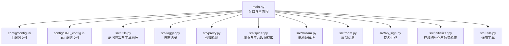
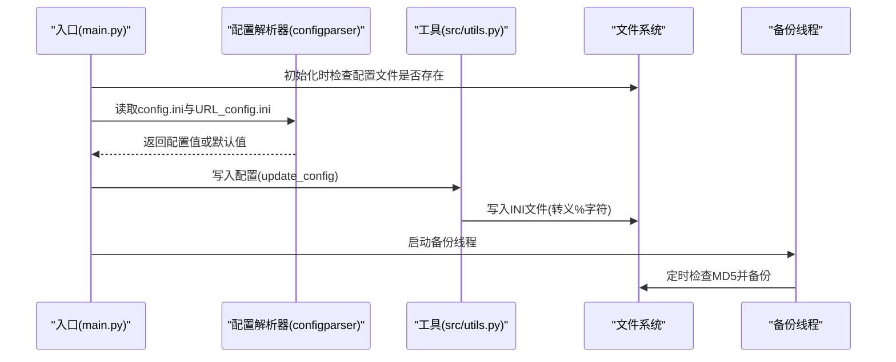
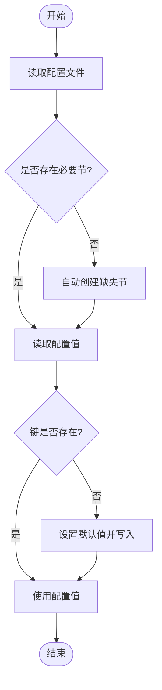
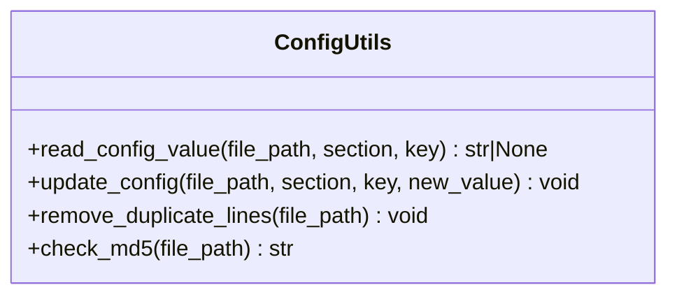
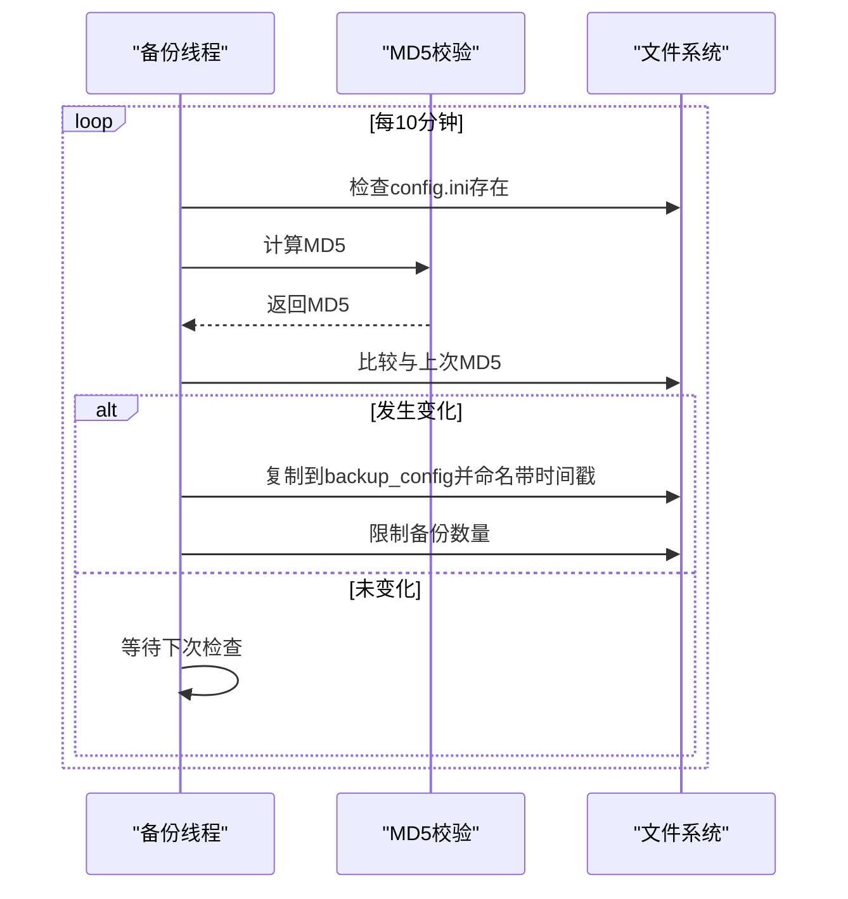
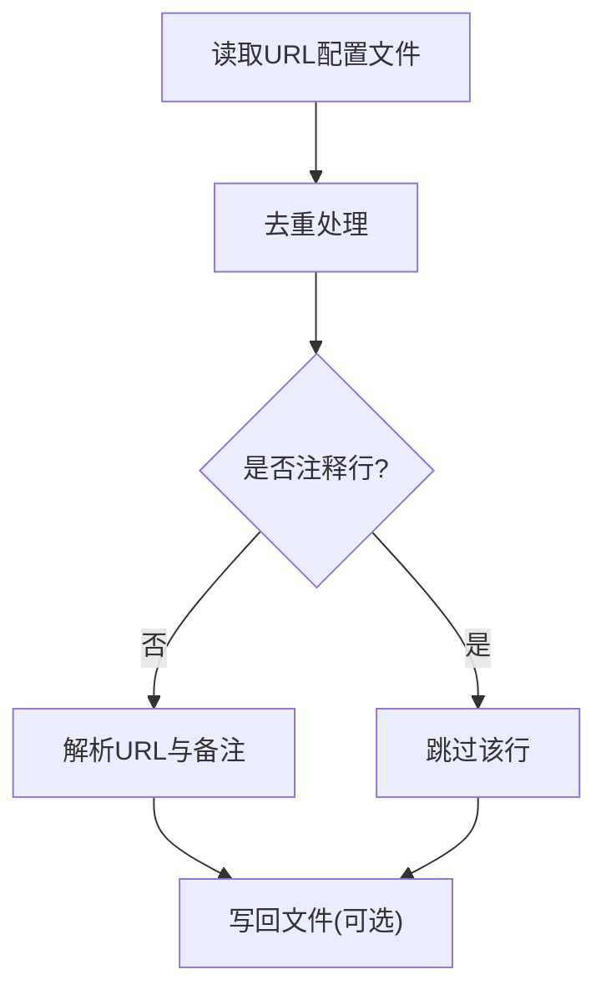
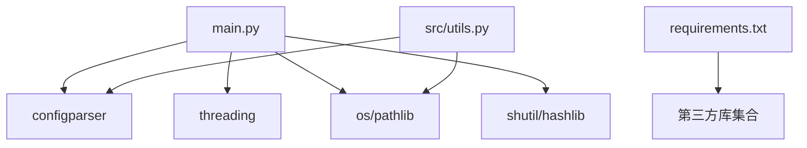

# 配置系统扩展

<cite>
**本文档引用的文件**
- [main.py](file://main.py)
- [src/utils.py](file://src/utils.py)
- [config/config.ini](file://config/config.ini)
- [config/URL_config.ini](file://config/URL_config.ini)
- [README.md](file://README.md)
- [pyproject.toml](file://pyproject.toml)
- [requirements.txt](file://requirements.txt)
</cite>

## 目录
1. [简介](#简介)
2. [项目结构](#项目结构)
3. [核心组件](#核心组件)
4. [架构总览](#架构总览)
5. [详细组件分析](#详细组件分析)
6. [依赖分析](#依赖分析)
7. [性能考虑](#性能考虑)
8. [故障排除指南](#故障排除指南)
9. [结论](#结论)
10. [附录](#附录)

## 简介
本指南面向开发者，系统性介绍如何扩展该直播录制项目的配置系统。内容涵盖：
- 新增配置项与扩展配置文件格式
- 增强配置验证与容错机制
- 配置加载、热更新与备份恢复策略
- 具体扩展示例：添加新配置选项、动态更新配置、处理配置冲突
- 安全考虑与性能优化建议

## 项目结构
该项目采用“入口脚本 + 工具模块 + 配置文件”的分层组织方式：
- 入口脚本负责初始化、加载配置、监控与录制流程控制
- 工具模块提供通用能力（如配置读写、去重、MD5校验等）
- 配置文件分为两类：主配置文件与URL配置文件

图表来源
- [main.py:1-200](file://main.py#L1-L200)
- [src/utils.py:1-206](file://src/utils.py#L1-L206)

章节来源
- [main.py:69-76](file://main.py#L69-L76)
- [config/config.ini](file://config/config.ini)
- [config/URL_config.ini](file://config/URL_config.ini)

## 核心组件
- 配置加载与默认值注入：通过统一的读取函数在缺失时自动创建默认配置项，保证系统健壮性
- 配置读写工具：提供安全的INI读取与写入，含转义处理与异常捕获
- 配置备份与恢复：基于MD5检测的定时备份，保留历史快照
- URL配置管理：支持URL列表的去重、注释与动态更新

章节来源
- [main.py:1731-1751](file://main.py#L1731-L1751)
- [src/utils.py:65-108](file://src/utils.py#L65-L108)
- [main.py:1648-1690](file://main.py#L1648-L1690)
- [src/utils.py:138-147](file://src/utils.py#L138-L147)

## 架构总览
配置系统围绕“入口脚本”为中心，形成“配置文件 → 加载器 → 全局变量 → 业务模块”的调用链。

图表来源
- [main.py:1731-1751](file://main.py#L1731-L1751)
- [src/utils.py:85-108](file://src/utils.py#L85-L108)
- [main.py:1671-1690](file://main.py#L1671-L1690)

## 详细组件分析

### 组件A：配置加载与默认值注入
- 功能要点
  - 自动创建缺失的配置节（录制设置、推送配置、Cookie、Authorization、账号密码）
  - 读取失败时写入默认值并落盘，避免后续流程中断
  - 支持布尔映射（“是/否”字符串到布尔值）

- 关键流程
  - 初始化阶段读取所有配置项
  - 缺失项自动补全并持久化
  - 全局变量赋值供后续模块使用

图表来源
- [main.py:1731-1751](file://main.py#L1731-L1751)

章节来源
- [main.py:1755-1900](file://main.py#L1755-L1900)
- [main.py:1731-1751](file://main.py#L1731-L1751)

### 组件B：配置读写工具
- 功能要点
  - 安全读取：带异常捕获，不存在节或键时返回None
  - 安全写入：对百分号进行转义，避免ConfigParser解析异常
  - 日志输出：成功/失败信息便于排障

- 使用场景
  - 平台登录成功后更新Cookie/Token
  - 用户修改配置后的落盘

图表来源
- [src/utils.py:65-108](file://src/utils.py#L65-L108)

章节来源
- [src/utils.py:65-108](file://src/utils.py#L65-L108)

### 组件C：配置备份与恢复
- 功能要点
  - 基于MD5的增量备份：仅在文件变更时触发备份
  - 定时轮询：每10分钟检查一次
  - 保留上限：超过数量自动清理最旧备份
  - 异常保护：备份失败不影响主流程

- 恢复策略
  - 从backup_config目录按时间戳排序选取最近备份
  - 手动替换config.ini或URL_config.ini进行恢复

图表来源
- [main.py:1671-1690](file://main.py#L1671-L1690)
- [main.py:1648-1669](file://main.py#L1648-L1669)

章节来源
- [main.py:1671-1690](file://main.py#L1671-L1690)
- [main.py:1648-1669](file://main.py#L1648-L1669)

### 组件D：URL配置管理
- 功能要点
  - 去重：读取后去除重复行，保持唯一性
  - 注释：以#开头的行视为注释，不参与解析
  - 动态更新：提供文件级更新与删除操作，配合锁保证并发安全

- 扩展点
  - 支持多行注释与空行
  - 可扩展为支持正则匹配过滤

图表来源
- [src/utils.py:138-147](file://src/utils.py#L138-L147)
- [main.py:137-178](file://main.py#L137-L178)

章节来源
- [src/utils.py:138-147](file://src/utils.py#L138-L147)
- [main.py:137-178](file://main.py#L137-L178)

## 依赖分析
- 配置系统依赖
  - configparser：标准库INI解析
  - os/pathlib：文件路径与目录操作
  - threading：备份线程与并发控制
  - shutil/hashlib：备份与MD5校验

- 外部依赖
  - 项目使用requirements.txt声明的第三方库，与配置系统无直接耦合

图表来源
- [main.py:28-39](file://main.py#L28-L39)
- [requirements.txt:1-7](file://requirements.txt#L1-L7)

章节来源
- [requirements.txt:1-7](file://requirements.txt#L1-L7)
- [pyproject.toml:9-17](file://pyproject.toml#L9-L17)

## 性能考虑
- 配置读取
  - 采用RawConfigParser减少插值开销
  - 仅在初始化阶段集中读取，避免频繁IO
- 写入与备份
  - 写入前进行转义，降低解析失败概率
  - 备份线程每10分钟一次，频率适中
- 并发安全
  - 文件更新使用锁保护，避免竞态
  - 备份线程独立运行，不影响主流程

## 故障排除指南
- 配置读取异常
  - 现象：读取返回None或抛出异常
  - 处理：确认文件编码为UTF-8-SIG；检查节与键是否存在；查看工具函数返回值
- 写入异常
  - 现象：写入后配置未生效
  - 处理：确认转义逻辑；检查文件权限；重启应用使配置生效
- 备份失败
  - 现象：备份线程报错
  - 处理：检查backup_config目录权限；确认磁盘空间；查看日志定位具体异常
- URL配置冲突
  - 现象：重复URL导致重复录制
  - 处理：利用去重函数；注释不需要的URL；核对解析逻辑

章节来源
- [src/utils.py:65-108](file://src/utils.py#L65-L108)
- [main.py:1671-1690](file://main.py#L1671-L1690)
- [src/utils.py:138-147](file://src/utils.py#L138-L147)

## 结论
该配置系统以INI文件为核心，结合工具函数与备份机制，提供了稳定可靠的配置管理能力。通过本文档的扩展指南，开发者可以安全地新增配置项、增强验证、实现热更新与备份恢复，同时保持系统的高性能与高可用。

## 附录

### 扩展示例：新增配置项
- 步骤
  - 在入口处添加默认值读取与全局变量赋值
  - 在需要使用的模块中读取全局变量
  - 如需持久化，使用工具函数写入配置文件
- 示例路径
  - [main.py:1802-1835](file://main.py#L1802-L1835)
  - [src/utils.py:85-108](file://src/utils.py#L85-L108)

章节来源
- [main.py:1802-1835](file://main.py#L1802-L1835)
- [src/utils.py:85-108](file://src/utils.py#L85-L108)

### 扩展示例：动态更新配置
- 步骤
  - 使用工具函数更新指定节与键
  - 注意百分号转义
  - 触发备份线程以保留历史快照
- 示例路径
  - [src/utils.py:85-108](file://src/utils.py#L85-L108)
  - [main.py:1671-1690](file://main.py#L1671-L1690)

章节来源
- [src/utils.py:85-108](file://src/utils.py#L85-L108)
- [main.py:1671-1690](file://main.py#L1671-L1690)

### 扩展示例：处理配置冲突
- 步骤
  - URL去重：读取后去重，避免重复录制
  - 注释处理：以#开头的行不参与解析
  - 文件更新：使用锁保护，避免竞态
- 示例路径
  - [src/utils.py:138-147](file://src/utils.py#L138-L147)
  - [main.py:137-178](file://main.py#L137-L178)

章节来源
- [src/utils.py:138-147](file://src/utils.py#L138-L147)
- [main.py:137-178](file://main.py#L137-L178)

### 安全考虑
- 配置敏感信息
  - Cookie与Token应避免明文存储，必要时进行加密或外部密钥管理
- 文件权限
  - 确保配置文件与备份目录具备最小权限集
- 输入校验
  - 对用户输入的URL与路径进行严格校验，防止注入与越权

### 性能优化建议
- 减少IO次数：合并多次读取为一次性读取
- 缓存策略：对热点配置进行内存缓存
- 异步写入：在不影响一致性前提下异步写入配置文件
- 备份策略：根据变更频率调整备份周期