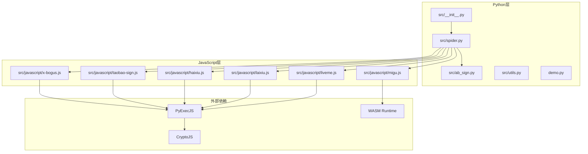
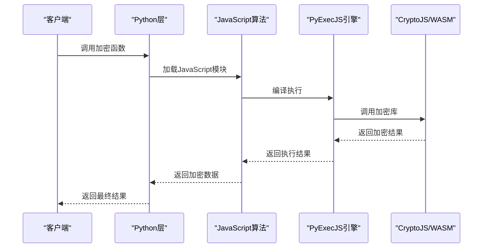
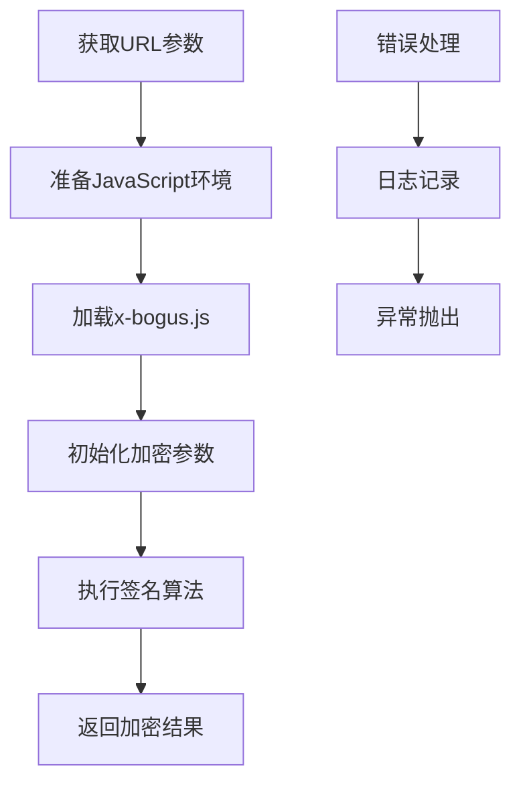
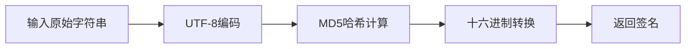
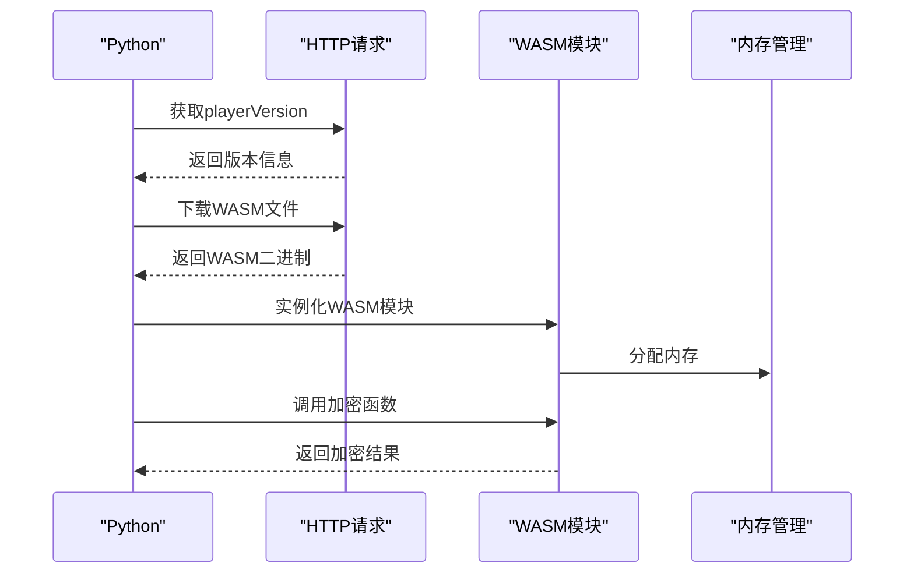
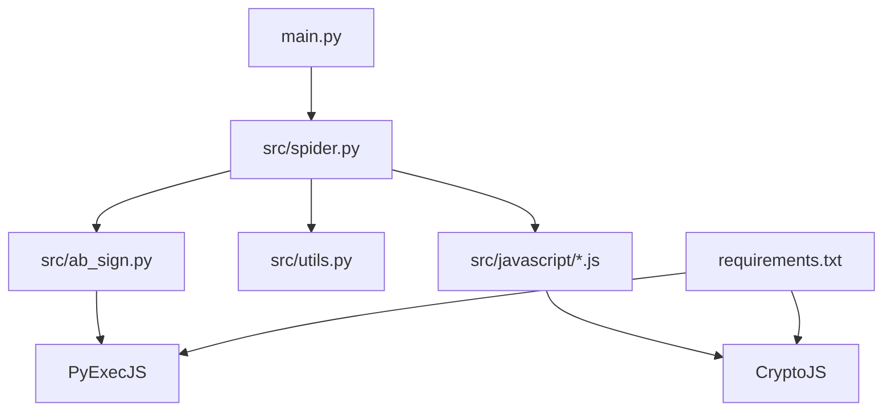
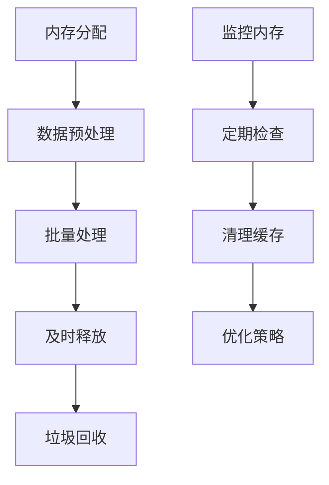

# 加密算法集成

<cite>
**本文档引用的文件**
- [src/javascript/x-bogus.js](file://src/javascript/x-bogus.js)
- [src/javascript/taobao-sign.js](file://src/javascript/taobao-sign.js)
- [src/javascript/haixiu.js](file://src/javascript/haixiu.js)
- [src/javascript/laixiu.js](file://src/javascript/laixiu.js)
- [src/javascript/liveme.js](file://src/javascript/liveme.js)
- [src/javascript/migu.js](file://src/javascript/migu.js)
- [src/ab_sign.py](file://src/ab_sign.py)
- [src/spider.py](file://src/spider.py)
- [src/utils.py](file://src/utils.py)
- [src/__init__.py](file://src/__init__.py)
- [requirements.txt](file://requirements.txt)
- [demo.py](file://demo.py)
- [README.md](file://README.md)
</cite>

## 目录
1. [简介](#简介)
2. [项目结构](#项目结构)
3. [核心组件](#核心组件)
4. [架构概览](#架构概览)
5. [详细组件分析](#详细组件分析)
6. [依赖分析](#依赖分析)
7. [性能考虑](#性能考虑)
8. [故障排除指南](#故障排除指南)
9. [结论](#结论)
10. [附录](#附录)

## 简介

本文档为平台接入开发提供加密算法集成指南，重点说明如何在Python项目中集成JavaScript加密算法，包括PyExecJS的使用方法、WASM模块的集成、算法参数传递等技术要点。文档涵盖常见的加密算法类型，如X-Bogus、签名生成、参数混淆等处理方法，并提供具体的集成示例，展示如何在Python中调用JavaScript函数、如何处理复杂的加密逻辑、如何优化算法性能，以及算法调试和测试方法。

## 项目结构

该项目采用模块化设计，加密算法主要分布在JavaScript文件中，Python侧通过PyExecJS调用这些JavaScript函数。核心结构如下：



**图表来源**
- [src/__init__.py:1-15](file://src/__init__.py#L1-L15)
- [src/spider.py:1-800](file://src/spider.py#L1-L800)
- [src/javascript/x-bogus.js:1-564](file://src/javascript/x-bogus.js#L1-L564)

**章节来源**
- [src/__init__.py:1-15](file://src/__init__.py#L1-L15)
- [README.md:72-100](file://README.md#L72-L100)

## 核心组件

### JavaScript加密算法模块

项目包含多种JavaScript加密算法实现：

1. **X-Bogus算法** - 抖音平台专用的反爬虫参数加密
2. **淘宝签名算法** - 基于MD5的参数签名生成
3. **海秀参数混淆** - 复杂的参数混淆和加密
4. **来秀MD5签名** - 简单的MD5签名生成
5. **LiveMe签名** - 多层次的参数签名验证
6. **咪咕WASM集成** - WebAssembly模块的参数计算

### Python集成层

Python侧通过以下组件实现JavaScript算法的调用：

1. **PyExecJS** - JavaScript引擎执行器
2. **CryptoJS** - JavaScript加密库
3. **WASM运行时** - WebAssembly模块支持

**章节来源**
- [src/javascript/x-bogus.js:500-564](file://src/javascript/x-bogus.js#L500-L564)
- [src/javascript/taobao-sign.js:1-78](file://src/javascript/taobao-sign.js#L1-L78)
- [src/javascript/haixiu.js:524-539](file://src/javascript/haixiu.js#L524-L539)
- [src/javascript/laixiu.js:26-33](file://src/javascript/laixiu.js#L26-L33)
- [src/javascript/liveme.js:333-425](file://src/javascript/liveme.js#L333-L425)
- [src/javascript/migu.js:1-143](file://src/javascript/migu.js#L1-L143)

## 架构概览

系统采用"Python控制层 + JavaScript算法层 + 外部依赖"的三层架构：



**图表来源**
- [src/spider.py:524-544](file://src/spider.py#L524-L544)
- [src/utils.py:38-51](file://src/utils.py#L38-L51)

## 详细组件分析

### X-Bogus算法集成

X-Bogus是抖音平台的核心反爬虫机制，通过复杂的JavaScript算法生成参数签名。

#### 算法特点
- 使用自定义的虚拟机解释器
- 包含MD5哈希计算
- 支持参数混淆和编码
- 提供完整的签名生成流程

#### Python集成实现



**图表来源**
- [src/spider.py:96-97](file://src/spider.py#L96-L97)
- [src/ab_sign.py:444-455](file://src/ab_sign.py#L444-L455)

#### 关键实现细节

1. **参数准备**：从URL查询参数中提取必要信息
2. **JavaScript编译**：使用PyExecJS编译JavaScript代码
3. **参数传递**：将Python变量转换为JavaScript可用格式
4. **结果处理**：将JavaScript返回值转换为Python格式

**章节来源**
- [src/javascript/x-bogus.js:500-564](file://src/javascript/x-bogus.js#L500-L564)
- [src/spider.py:96-97](file://src/spider.py#L96-L97)

### 淘宝签名算法

淘宝签名算法相对简单，主要基于MD5哈希计算。

#### 算法流程



**图表来源**
- [src/javascript/taobao-sign.js:32-74](file://src/javascript/taobao-sign.js#L32-L74)

**章节来源**
- [src/javascript/taobao-sign.js:1-78](file://src/javascript/taobao-sign.js#L1-L78)

### 海秀参数混淆

海秀算法实现了复杂的参数混淆机制，包含多个加密步骤。

#### 主要特性
- 参数名称混淆
- 常量值编码
- 多层次加密
- 动态参数生成

**章节来源**
- [src/javascript/haixiu.js:1-539](file://src/javascript/haixiu.js#L1-L539)

### 来秀MD5签名

来秀算法提供简单的MD5签名生成，包含UUID生成和时间戳处理。

**章节来源**
- [src/javascript/laixiu.js:1-33](file://src/javascript/laixiu.js#L1-L33)

### LiveMe签名算法

LiveMe算法是最复杂的签名实现，包含多重加密和参数验证。

#### 算法层次
1. **基础参数生成** - 时间戳和随机数
2. **签名参数构建** - 排序和拼接
3. **最终签名计算** - MD5哈希生成

**章节来源**
- [src/javascript/liveme.js:333-425](file://src/javascript/liveme.js#L333-L425)

### 咪咕WASM集成

咪咕算法集成了WebAssembly模块，提供高性能的参数计算。

#### WASM集成流程



**图表来源**
- [src/javascript/migu.js:52-134](file://src/javascript/migu.js#L52-L134)

**章节来源**
- [src/javascript/migu.js:1-143](file://src/javascript/migu.js#L1-L143)

## 依赖分析

### Python依赖关系



**图表来源**
- [requirements.txt:1-7](file://requirements.txt#L1-L7)
- [src/spider.py:25-32](file://src/spider.py#L25-L32)

### JavaScript模块依赖

各JavaScript模块具有独立的依赖关系：

| 模块 | 依赖库 | 主要功能 |
|------|--------|----------|
| x-bogus.js | 内置虚拟机 | 抖音X-Bogus签名 |
| taobao-sign.js | 无 | 淘宝MD5签名 |
| haixiu.js | CryptoJS | 海秀参数混淆 |
| laixiu.js | CryptoJS | 来秀MD5签名 |
| liveme.js | CryptoJS | LiveMe复杂签名 |
| migu.js | WASM | 咪咕参数计算 |

**章节来源**
- [requirements.txt:1-7](file://requirements.txt#L1-L7)

## 性能考虑

### JavaScript引擎性能优化

1. **缓存机制**：PyExecJS支持引擎缓存，避免重复编译
2. **内存管理**：合理管理JavaScript对象生命周期
3. **并发处理**：使用异步方式减少阻塞

### WASM性能优势

1. **执行效率**：相比JavaScript，WASM执行速度更快
2. **内存安全**：提供更严格的内存访问控制
3. **跨平台兼容**：统一的二进制接口

### 内存使用优化



## 故障排除指南

### 常见问题及解决方案

#### PyExecJS执行错误
- **症状**：JavaScript执行失败，抛出ProgramError异常
- **原因**：Node.js环境缺失或JavaScript语法错误
- **解决**：检查Node.js安装，验证JavaScript代码语法

#### CryptoJS依赖问题
- **症状**：CryptoJS未定义错误
- **原因**：CryptoJS库未正确加载
- **解决**：确保crypto-js.min.js文件存在且路径正确

#### WASM加载失败
- **症状**：WebAssembly实例化失败
- **原因**：WASM文件下载失败或格式不正确
- **解决**：检查网络连接，验证WASM文件完整性

### 调试技巧

1. **日志记录**：使用trace_error_decorator捕获JavaScript异常
2. **参数验证**：检查传入JavaScript的参数格式
3. **性能监控**：监控JavaScript执行时间和内存使用

**章节来源**
- [src/utils.py:38-51](file://src/utils.py#L38-L51)

## 结论

本文档详细介绍了如何在Python项目中集成JavaScript加密算法，涵盖了从基础的PyExecJS使用到复杂的WASM模块集成。通过合理的架构设计和性能优化，可以有效提升加密算法的执行效率和系统的稳定性。建议在实际应用中：

1. 优先使用WASM模块处理高性能需求
2. 建立完善的错误处理和日志系统
3. 实施内存管理和性能监控
4. 制定详细的测试和调试流程

## 附录

### 集成示例代码

#### 基础PyExecJS使用
```python
import execjs

# 加载JavaScript文件
with open('path/to/script.js', 'r') as f:
    js_code = f.read()

# 编译JavaScript
ctx = execjs.compile(js_code)

# 调用JavaScript函数
result = ctx.call('functionName', param1, param2)
```

#### WASM模块集成
```python
import asyncio
import aiohttp
import base64

async def load_wasm_module():
    # 下载WASM文件
    async with aiohttp.ClientSession() as session:
        async with session.get(wasm_url) as response:
            wasm_data = await response.read()
    
    # 实例化WASM模块
    wasm_instance = await WebAssembly.instantiate(wasm_data)
    return wasm_instance
```

### 测试方法

1. **单元测试**：为每个加密算法编写独立的测试用例
2. **集成测试**：测试Python与JavaScript的完整调用流程
3. **性能测试**：测量算法执行时间和内存使用情况
4. **兼容性测试**：验证不同平台和浏览器的兼容性