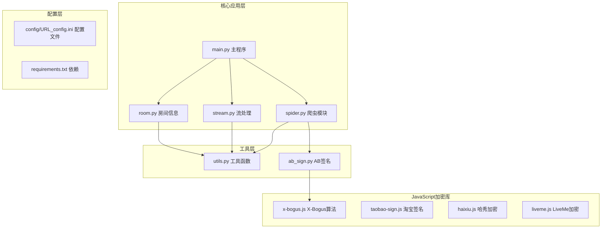
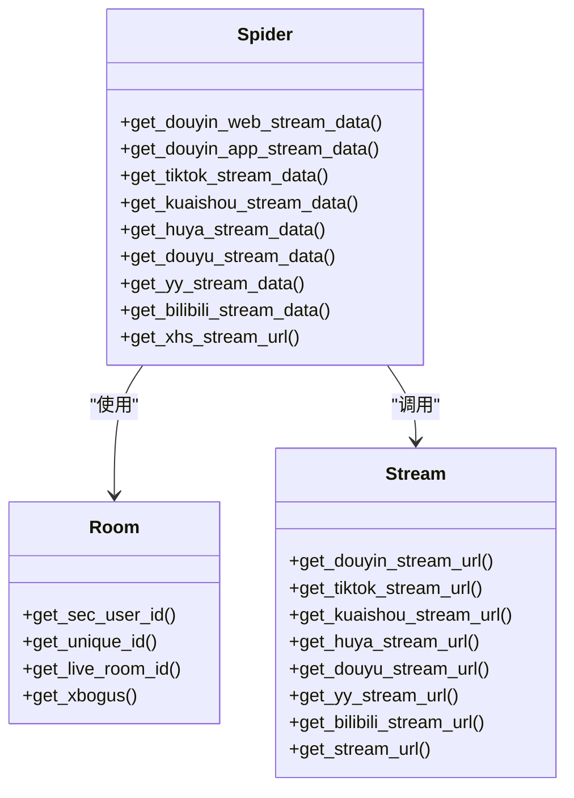
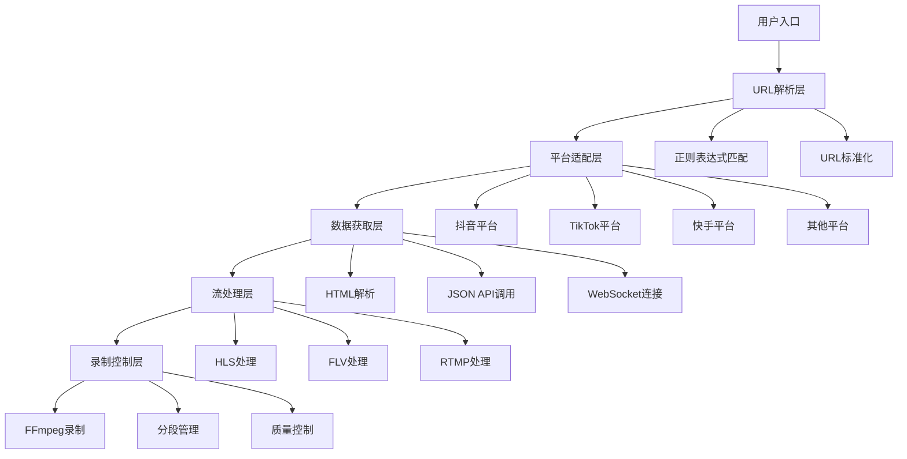
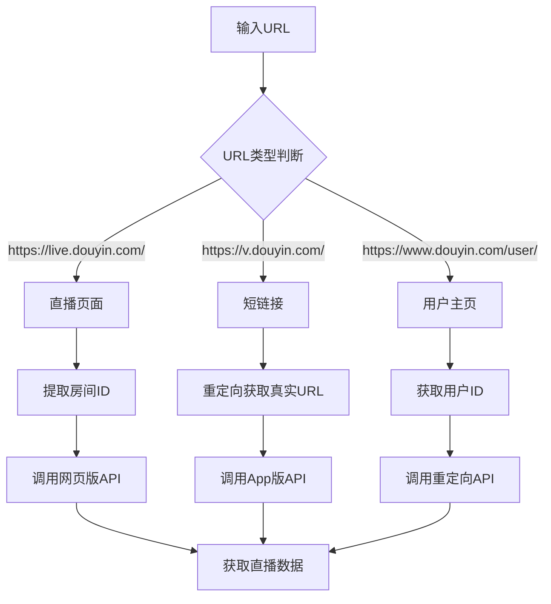
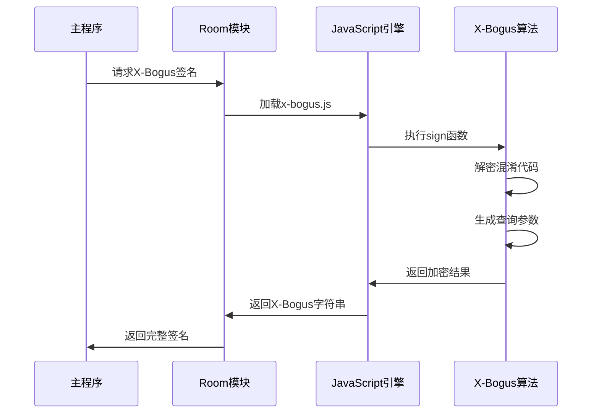
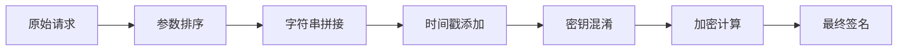
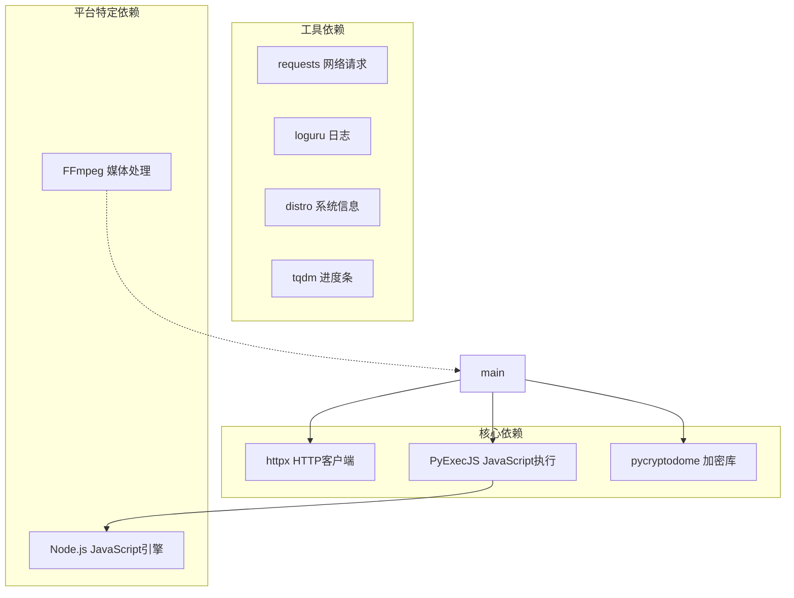
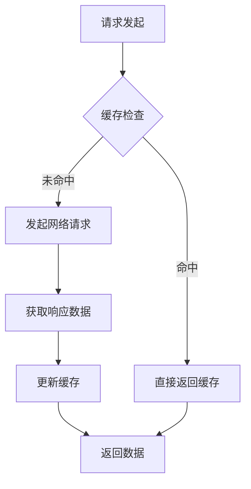

# 平台分析与准备

<cite>
**本文档引用的文件**
- [README.md](file://README.md)
- [main.py](file://main.py)
- [src/spider.py](file://src/spider.py)
- [src/room.py](file://src/room.py)
- [src/stream.py](file://src/stream.py)
- [src/ab_sign.py](file://src/ab_sign.py)
- [src/utils.py](file://src/utils.py)
- [src/javascript/x-bogus.js](file://src/javascript/x-bogus.js)
- [src/javascript/taobao-sign.js](file://src/javascript/taobao-sign.js)
- [src/javascript/haixiu.js](file://src/javascript/haixiu.js)
- [src/javascript/liveme.js](file://src/javascript/liveme.js)
- [requirements.txt](file://requirements.txt)
- [config/URL_config.ini](file://config/URL_config.ini)
</cite>

## 目录
1. [引言](#引言)
2. [项目结构](#项目结构)
3. [核心组件](#核心组件)
4. [架构概览](#架构概览)
5. [详细组件分析](#详细组件分析)
6. [依赖关系分析](#依赖关系分析)
7. [性能考虑](#性能考虑)
8. [故障排除指南](#故障排除指南)
9. [结论](#结论)
10. [附录](#附录)

## 引言

本文档为平台接入开发提供详细的平台分析指南。基于抖音直播录制器项目的代码库，我们将深入分析目标直播平台的技术架构，包括网页结构分析、API接口研究、反爬虫机制识别等准备工作。文档特别关注平台URL解析方法，包括房间ID提取、用户ID获取、参数解析等技术要点，并提供具体的分析示例，展示如何使用正则表达式提取关键信息，如何分析JavaScript加密算法，如何识别平台的风控机制。

该项目支持超过50个直播平台，涵盖国内外主流直播平台，为平台接入开发提供了丰富的实践案例和参考模板。

## 项目结构

该项目采用模块化设计，主要包含以下核心模块：

**图表来源**
- [main.py:1-100](file://main.py#L1-L100)
- [src/spider.py:1-50](file://src/spider.py#L1-L50)
- [src/stream.py:1-50](file://src/stream.py#L1-L50)
- [src/room.py:1-50](file://src/room.py#L1-L50)

**章节来源**
- [README.md:72-100](file://README.md#L72-L100)
- [main.py:1-200](file://main.py#L1-L200)

## 核心组件

### 主程序控制流

主程序负责协调各个平台的接入流程，包含以下关键功能：

1. **URL解析与验证**：支持多种直播平台URL格式
2. **并发控制**：通过信号量控制同时访问的线程数
3. **代理配置**：支持全局代理和特定平台代理
4. **录制控制**：管理录制任务的生命周期

### 爬虫模块架构

爬虫模块采用异步设计，支持多种平台的数据获取：

**图表来源**
- [src/spider.py:68-282](file://src/spider.py#L68-L282)
- [src/room.py:52-143](file://src/room.py#L52-L143)
- [src/stream.py:41-153](file://src/stream.py#L41-L153)

**章节来源**
- [src/spider.py:1-200](file://src/spider.py#L1-L200)
- [src/room.py:1-151](file://src/room.py#L1-L151)
- [src/stream.py:1-200](file://src/stream.py#L1-L200)

## 架构概览

项目采用分层架构设计，每层职责明确，便于扩展和维护：

**图表来源**
- [main.py:545-800](file://main.py#L545-L800)
- [src/spider.py:68-800](file://src/spider.py#L68-L800)

## 详细组件分析

### URL解析与平台识别

#### 抖音平台URL解析

抖音平台支持多种URL格式，系统通过智能识别机制自动处理：

**图表来源**
- [src/spider.py:68-282](file://src/spider.py#L68-L282)
- [src/room.py:52-105](file://src/room.py#L52-L105)

#### 虎牙平台URL解析

虎牙平台提供两种解析方式：

1. **网页版解析**：适用于标准直播页面
2. **App版解析**：适用于移动端分享链接

**章节来源**
- [src/spider.py:408-517](file://src/spider.py#L408-L517)
- [src/spider.py:425-517](file://src/spider.py#L425-L517)

### JavaScript加密算法分析

#### X-Bogus算法实现

X-Bogus是抖音平台的重要反爬虫机制，系统通过Node.js环境执行JavaScript加密：

**图表来源**
- [src/room.py:42-48](file://src/room.py#L42-L48)
- [src/javascript/x-bogus.js:500-564](file://src/javascript/x-bogus.js#L500-L564)

#### 淘宝签名算法

淘宝平台使用MD5算法进行参数签名：

**章节来源**
- [src/javascript/taobao-sign.js:1-78](file://src/javascript/taobao-sign.js#L1-L78)

### 反爬虫机制识别

#### 动态参数生成

平台通过动态生成参数来防止爬虫：

**图表来源**
- [src/javascript/haixiu.js:524-530](file://src/javascript/haixiu.js#L524-L530)
- [src/javascript/liveme.js:353-425](file://src/javascript/liveme.js#L353-L425)

#### 风控检测机制

系统通过以下方式识别和应对风控：

1. **请求频率控制**：动态调整并发数量
2. **代理轮换**：支持多代理IP轮换
3. **User-Agent轮换**：模拟不同设备环境
4. **Cookie管理**：自动更新失效Cookie

**章节来源**
- [main.py:298-325](file://main.py#L298-L325)
- [src/utils.py:162-168](file://src/utils.py#L162-L168)

## 依赖关系分析

项目依赖关系清晰，主要依赖包括：

**图表来源**
- [requirements.txt:1-7](file://requirements.txt#L1-L7)

**章节来源**
- [requirements.txt:1-7](file://requirements.txt#L1-L7)

## 性能考虑

### 并发控制策略

系统采用动态并发控制机制：

1. **自适应调整**：根据错误率动态调整并发数量
2. **信号量控制**：限制同时进行的网络请求
3. **资源池管理**：复用HTTP连接和JavaScript引擎

### 缓存机制

**图表来源**
- [main.py:298-325](file://main.py#L298-L325)

## 故障排除指南

### 常见问题及解决方案

#### 网络连接问题

1. **代理配置错误**
   - 检查代理服务器可用性
   - 验证代理认证信息
   - 测试代理连接速度

2. **超时处理**
   - 增加请求超时时间
   - 实现重试机制
   - 使用备用服务器

#### JavaScript执行问题

1. **Node.js环境缺失**
   - 安装Node.js运行时
   - 验证JavaScript文件完整性
   - 检查文件路径配置

2. **加密算法失败**
   - 更新加密算法版本
   - 检查依赖库兼容性
   - 验证参数传递正确性

#### FFmpeg处理问题

1. **录制质量异常**
   - 检查FFmpeg安装路径
   - 验证编解码器支持
   - 调整录制参数设置

**章节来源**
- [src/utils.py:38-51](file://src/utils.py#L38-L51)
- [main.py:356-374](file://main.py#L356-L374)

## 结论

本项目为直播平台接入开发提供了完整的参考框架。通过深入分析抖音直播录制器的实现，我们可以总结出以下关键经验：

1. **模块化设计**：清晰的分层架构便于功能扩展和维护
2. **异步处理**：高效的并发控制提升整体性能
3. **加密算法集成**：JavaScript引擎集成解决复杂加密需求
4. **反爬虫应对**：多维度风控机制保障稳定性

这些实践经验为新平台的接入开发提供了宝贵的指导，包括URL解析策略、API接口适配、加密算法分析和风控机制应对等方面。

## 附录

### 支持平台列表

项目支持的直播平台包括但不限于：

- 国内平台：抖音、快手、虎牙、斗鱼、B站、小红书等
- 海外平台：TikTok、LiveMe、ShowRoom、CHZZK等
- 其他平台：网易CC、千度热播、猫耳FM等

### 开发最佳实践

1. **URL标准化**：统一处理各种URL格式
2. **错误处理**：完善的异常捕获和恢复机制
3. **日志记录**：详细的调试信息和错误追踪
4. **配置管理**：灵活的参数配置和环境适配