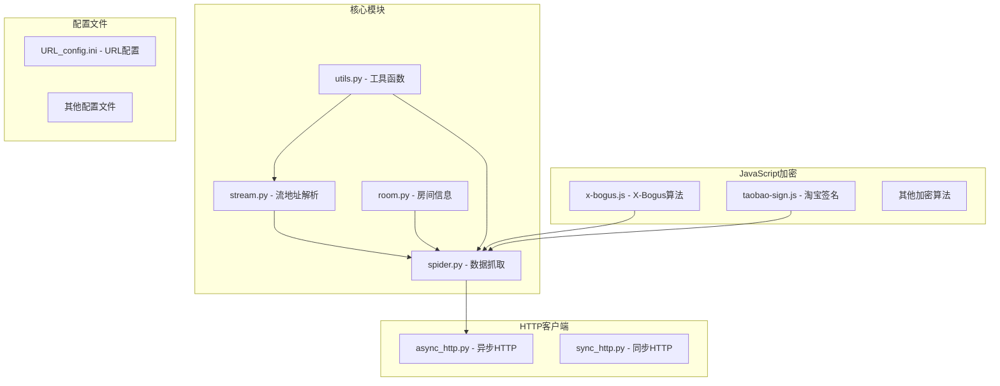
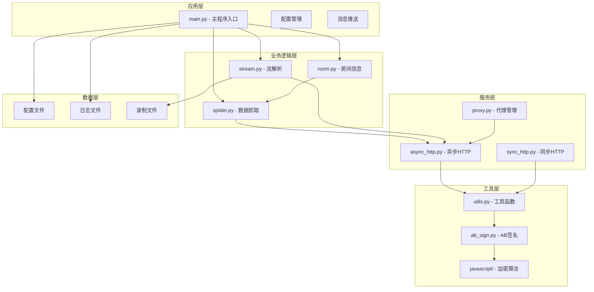
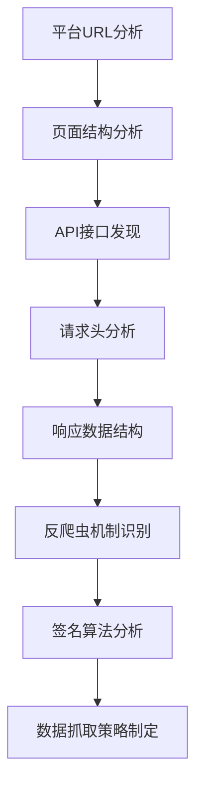
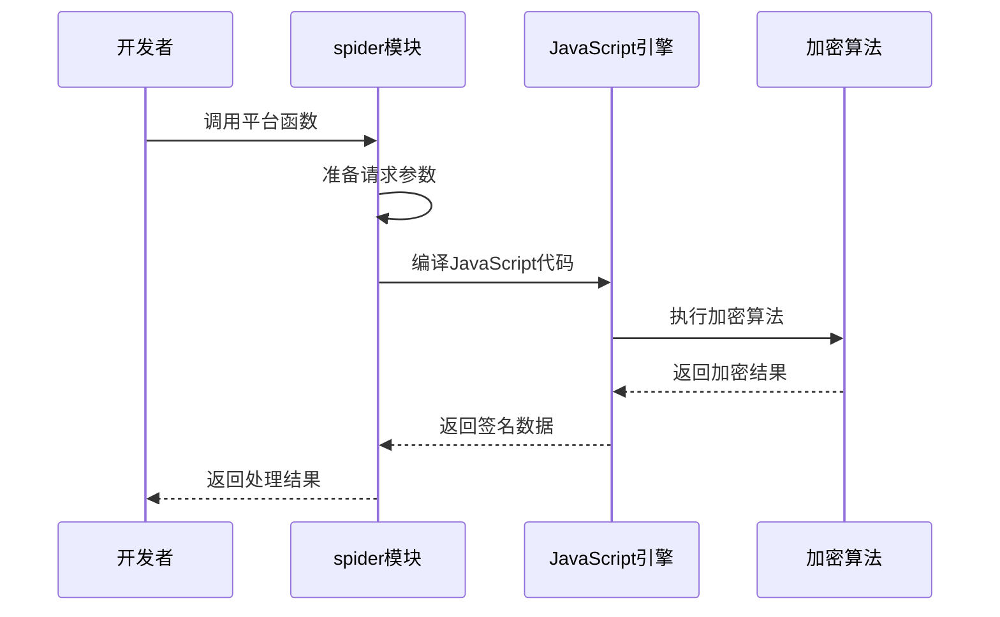
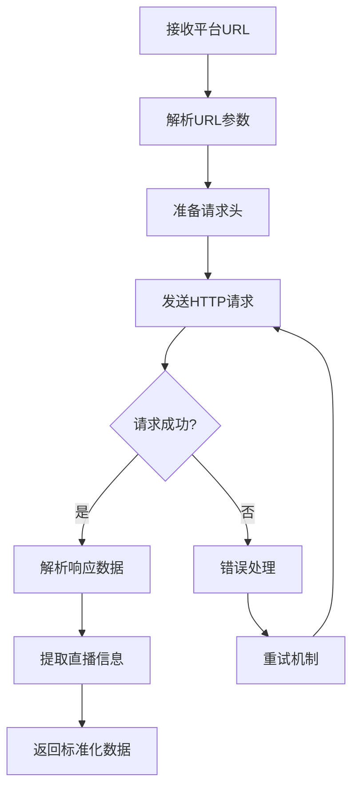
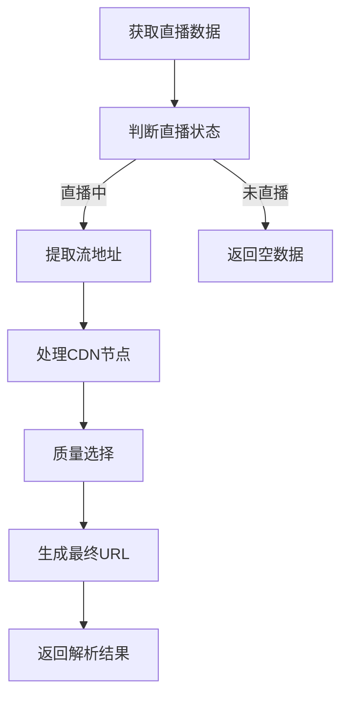
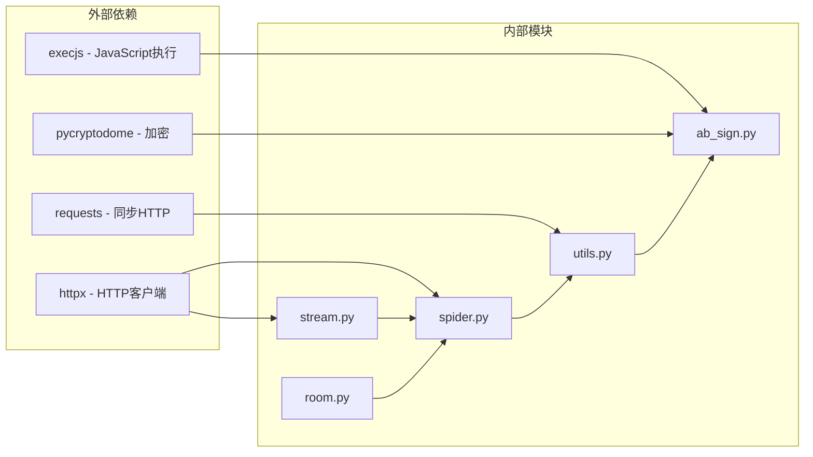
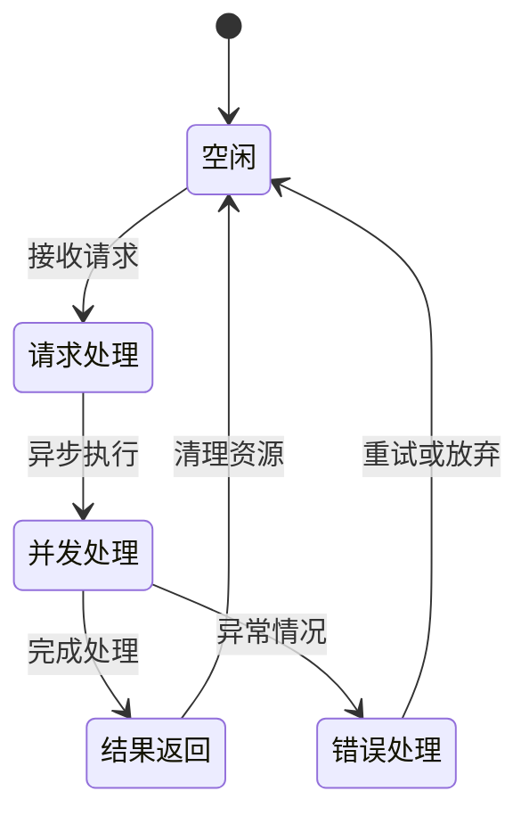

# 平台接入开发

<cite>
**本文档引用的文件**
- [README.md](file://README.md)
- [spider.py](file://src/spider.py)
- [stream.py](file://src/stream.py)
- [room.py](file://src/room.py)
- [utils.py](file://src/utils.py)
- [ab_sign.py](file://src/ab_sign.py)
- [x-bogus.js](file://src/javascript/x-bogus.js)
- [taobao-sign.js](file://src/javascript/taobao-sign.js)
- [async_http.py](file://src/http_clients/async_http.py)
- [sync_http.py](file://src/http_clients/sync_http.py)
- [URL_config.ini](file://config/URL_config.ini)
- [proxy.py](file://src/proxy.py)
- [main.py](file://main.py)
</cite>

## 目录
1. [简介](#简介)
2. [项目结构](#项目结构)
3. [核心组件](#核心组件)
4. [架构概览](#架构概览)
5. [详细组件分析](#详细组件分析)
6. [依赖关系分析](#依赖关系分析)
7. [性能考虑](#性能考虑)
8. [故障排除指南](#故障排除指南)
9. [结论](#结论)
10. [附录](#附录)

## 简介

DouyinLiveRecorder 是一个功能强大的直播平台录制工具，支持超过60个国内外直播平台。本文档为开发者提供完整的平台接入开发指南，涵盖从平台分析到代码实现的全流程。

该工具采用异步架构设计，基于HTTPX库实现高效的并发请求处理，支持多种直播平台的数据抓取和流地址解析。项目内置了丰富的JavaScript加密算法支持，能够应对各种反爬虫机制。

## 项目结构

项目采用模块化设计，主要包含以下核心模块：



**图表来源**
- [spider.py:1-800](file://src/spider.py#L1-L800)
- [stream.py:1-446](file://src/stream.py#L1-L446)
- [room.py:1-151](file://src/room.py#L1-L151)

**章节来源**
- [README.md:72-100](file://README.md#L72-L100)
- [main.py:41-46](file://main.py#L41-L46)

## 核心组件

### 数据抓取模块 (Spider)

数据抓取模块是平台接入的核心，负责从各个直播平台获取直播数据。该模块采用异步设计，支持多种平台的API调用和页面解析。

主要功能特性：
- 支持60+个直播平台
- 异步HTTP请求处理
- JavaScript加密算法集成
- 反爬虫机制应对

### 流地址解析模块 (Stream)

流地址解析模块负责将原始直播数据转换为可用的流地址，支持多种视频格式和质量选项。

核心能力：
- 多种视频格式支持（HLS、FLV、DASH等）
- 自适应码率选择
- CDN节点智能选择
- 质量优化和降级策略

### 加密算法支持

项目内置了多种JavaScript加密算法的Python实现，用于应对各种反爬虫机制：

**图表来源**
- [ab_sign.py:444-455](file://src/ab_sign.py#L444-L455)
- [x-bogus.js:500-564](file://src/javascript/x-bogus.js#L500-L564)

**章节来源**
- [spider.py:42-48](file://src/spider.py#L42-L48)
- [stream.py:26-27](file://src/stream.py#L26-L27)

## 架构概览

系统采用分层架构设计，确保了良好的可扩展性和维护性：



**图表来源**
- [main.py:30-36](file://main.py#L30-L36)
- [spider.py:21-32](file://src/spider.py#L21-L32)
- [stream.py:20-24](file://src/stream.py#L20-L24)

## 详细组件分析

### 平台适配器开发方法

#### 1. 平台分析阶段

在开始开发之前，需要对目标直播平台进行全面分析：

**API研究流程**：


**图表来源**
- [spider.py:286-313](file://src/spider.py#L286-L313)

#### 2. 反爬虫机制分析

常见的反爬虫机制及应对策略：

**JavaScript加密算法**：
- X-Bogus算法：用于抖音等平台的参数签名
- AB签名算法：综合加密方案
- 各种平台特定的加密函数

**请求头伪装**：
- User-Agent轮换
- Cookie管理
- Referer控制
- Accept-Language设置

#### 3. 适配器开发实现

##### 扩展spider模块

在spider.py中添加新的平台函数：

**代码结构示例**：
```python
@trace_error_decorator
async def get_new_platform_stream_data(url: str, proxy_addr: OptionalStr = None, cookies: OptionalStr = None) -> dict:
    """
    新直播平台数据抓取函数
    """
    headers = {
        'User-Agent': 'Mozilla/5.0 (Windows NT 10.0; Win64; x64) AppleWebKit/537.36',
        'Referer': 'https://www.newplatform.com/',
        'Cookie': cookies or ''
    }
    
    try:
        # 实现平台特定的数据抓取逻辑
        response = await async_req(url=url, proxy_addr=proxy_addr, headers=headers)
        
        # 解析JSON数据
        json_data = json.loads(response)
        
        # 提取直播相关信息
        result = {
            'anchor_name': json_data.get('anchor_name', ''),
            'is_live': json_data.get('is_live', False),
            'room_id': json_data.get('room_id', ''),
            'title': json_data.get('title', '')
        }
        
        return result
        
    except Exception as e:
        logger.error(f"平台数据抓取失败: {e}")
        return {"type": 1, "is_live": False}
```

**章节来源**
- [spider.py:548-579](file://src/spider.py#L548-L579)

##### 集成JavaScript加密算法

对于需要JavaScript加密的平台，需要在项目中集成相应的加密算法：

**加密算法集成流程**：


**图表来源**
- [room.py:42-48](file://src/room.py#L42-L48)
- [x-bogus.js:500-564](file://src/javascript/x-bogus.js#L500-L564)

#### 4. 数据抓取逻辑实现

**核心抓取流程**：


**章节来源**
- [spider.py:144-226](file://src/spider.py#L144-L226)

#### 5. 流地址解析实现

**流地址解析流程**：


**图表来源**
- [stream.py:41-78](file://src/stream.py#L41-L78)

**章节来源**
- [stream.py:411-446](file://src/stream.py#L411-L446)

### 开发示例

#### 示例1：添加抖音平台支持

**步骤1：分析抖音API**
```python
# 在spider.py中添加抖音数据抓取函数
@trace_error_decorator
async def get_douyin_stream_data(url: str, proxy_addr: OptionalStr = None, cookies: OptionalStr = None) -> dict:
    # 实现抖音特定的数据抓取逻辑
    pass
```

**步骤2：集成X-Bogus签名**
```python
# 使用X-Bogus算法生成签名
headers = {
    'User-Agent': 'Mozilla/5.0 (Windows NT 10.0; Win64; x64) AppleWebKit/537.36',
    'Referer': 'https://live.douyin.com/',
}

# 生成X-Bogus签名
xbogus = await get_xbogus(api_url)
api_with_signature = api_url + "&X-Bogus=" + xbogus
```

**步骤3：解析直播数据**
```python
# 解析返回的直播数据
try:
    json_data = json.loads(response)
    room_data = json_data['data']['roomInfo']['room']
    return room_data
except Exception as e:
    logger.error(f"抖音数据解析失败: {e}")
    return {}
```

#### 示例2：添加新平台支持

**步骤1：创建平台特定的抓取函数**
```python
@trace_error_decorator
async def get_custom_platform_data(url: str, proxy_addr: OptionalStr = None, cookies: OptionalStr = None) -> dict:
    """
    自定义直播平台数据抓取
    """
    # 实现平台特定的API调用
    headers = {
        'User-Agent': 'Custom-Agent/1.0',
        'Referer': url,
        'Cookie': cookies or ''
    }
    
    # 发送请求
    response = await async_req(url, proxy_addr, headers)
    
    # 解析数据
    return parse_platform_response(response)
```

**步骤2：实现数据解析**
```python
def parse_platform_response(response: str) -> dict:
    """
    解析平台特定的响应数据
    """
    try:
        data = json.loads(response)
        
        # 提取必要的直播信息
        return {
            'anchor_name': data.get('anchor', {}).get('name', ''),
            'is_live': data.get('status', 0) == 1,
            'room_id': data.get('room_id', ''),
            'title': data.get('title', ''),
            'stream_url': data.get('stream_url', {})
        }
    except Exception as e:
        logger.error(f"数据解析错误: {e}")
        return {}
```

**章节来源**
- [spider.py:68-141](file://src/spider.py#L68-L141)
- [room.py:42-48](file://src/room.py#L42-L48)

## 依赖关系分析

### 核心依赖关系



**图表来源**
- [requirements.txt:1-7](file://requirements.txt#L1-L7)
- [spider.py:21-32](file://src/spider.py#L21-L32)

### 模块间耦合分析

**低耦合设计原则**：
- 各平台功能相对独立
- 通用工具函数集中管理
- 加密算法模块化
- HTTP客户端抽象化

**章节来源**
- [utils.py:38-51](file://src/utils.py#L38-L51)
- [async_http.py:10-46](file://src/http_clients/async_http.py#L10-L46)

## 性能考虑

### 异步并发处理

系统采用异步架构，支持高并发的直播数据抓取：

**并发控制机制**：


**图表来源**
- [main.py:545-608](file://main.py#L545-L608)

### 资源管理优化

**内存管理策略**：
- 及时释放HTTP连接
- 控制并发数量
- 优化JSON解析
- 合理使用缓存

**网络优化**：
- 连接池复用
- 请求超时控制
- 代理服务器使用
- 错误重试机制

## 故障排除指南

### 常见问题及解决方案

#### 1. 反爬虫检测问题

**问题现象**：
- 请求被拒绝
- 返回验证码
- IP被封禁

**解决方法**：
```python
# 实现反爬虫应对策略
def handle_antispider():
    """
    反爬虫机制应对
    """
    # 1. 轮换User-Agent
    user_agents = [
        'Mozilla/5.0 (Windows NT 10.0; Win64; x64) AppleWebKit/537.36',
        'Mozilla/5.0 (Macintosh; Intel Mac OS X 10_15_7) AppleWebKit/537.36',
        'Mozilla/5.0 (X11; Linux x86_64) AppleWebKit/537.36'
    ]
    
    # 2. 设置合理的请求间隔
    time.sleep(random.uniform(1, 3))
    
    # 3. 使用代理IP池
    proxy = get_random_proxy()
    
    # 4. 处理验证码
    captcha_result = solve_captcha()
```

#### 2. JavaScript加密算法问题

**问题现象**：
- 加密结果不正确
- 执行JavaScript时报错
- Node.js环境缺失

**解决方法**：
```python
# 检查JavaScript环境
def check_js_environment():
    """
    检查JavaScript执行环境
    """
    try:
        # 测试JavaScript执行
        js_code = "console.log('JavaScript环境正常')"
        execjs.compile(js_code)
        return True
    except Exception as e:
        logger.error(f"JavaScript环境检查失败: {e}")
        return False

# 处理加密算法错误
@trace_error_decorator
def execute_encryption_algorithm():
    """
    执行加密算法的错误处理
    """
    try:
        # 执行加密算法
        result = encrypt_function()
        return result
    except execjs.ProgramError as e:
        logger.warning("JavaScript执行错误，检查Node.js环境")
        return None
    except Exception as e:
        logger.error(f"加密算法执行失败: {e}")
        return None
```

#### 3. 网络连接问题

**问题现象**：
- 请求超时
- 连接失败
- 代理不可用

**解决方法**：
```python
# 实现网络连接重试机制
async def retry_request(url, max_retries=3, delay=1):
    """
    带重试的HTTP请求
    """
    for attempt in range(max_retries):
        try:
            response = await async_req(url)
            return response
        except Exception as e:
            if attempt < max_retries - 1:
                logger.warning(f"请求失败，{delay}秒后重试: {e}")
                await asyncio.sleep(delay)
                delay *= 2  # 指数退避
            else:
                logger.error(f"请求最终失败: {e}")
                raise e
```

**章节来源**
- [utils.py:38-51](file://src/utils.py#L38-L51)
- [async_http.py:43-44](file://src/http_clients/async_http.py#L43-L44)

### 调试技巧

#### 1. 日志记录

系统提供了完善的日志记录机制：

**日志级别设置**：
```python
# 配置日志级别
from loguru import logger

# 开发模式日志
logger.add("debug.log", level="DEBUG")

# 生产模式日志
logger.add("production.log", level="ERROR")

# 实时输出
logger.add(sys.stdout, level="INFO")
```

#### 2. 调试工具

**HTTP请求调试**：
```python
# 启用HTTP调试
import http.client
http.client.HTTPConnection.debuglevel = 1

# 使用代理调试
proxy_info = {
    'http': 'http://127.0.0.1:8080',
    'https': 'http://127.0.0.1:8080'
}
```

#### 3. 性能监控

**监控指标收集**：
```python
# 记录请求耗时
start_time = time.time()
response = await async_req(url)
end_time = time.time()
request_time = end_time - start_time

# 记录并发数
logger.info(f"当前并发数: {current_concurrency}")

# 记录错误率
error_rate = error_count / total_requests
logger.info(f"错误率: {error_rate:.2%}")
```

## 结论

DouyinLiveRecorder提供了一个完整而灵活的直播平台接入框架。通过本文档的指导，开发者可以：

1. **系统性地分析新平台**：从API研究到反爬虫机制分析
2. **高效地实现适配器**：利用现有的模块化架构快速集成新平台
3. **处理复杂的技术挑战**：JavaScript加密算法、反爬虫机制等
4. **确保代码质量**：通过完善的错误处理和调试机制

该框架的设计充分考虑了可扩展性和维护性，为后续的平台扩展提供了坚实的基础。开发者可以根据具体需求，在现有架构基础上进行定制化开发。

## 附录

### 开发最佳实践

#### 1. 代码组织规范

**模块命名**：
- 平台相关函数：`get_platform_name_stream_data()`
- 工具函数：`extract_platform_info()`
- 类型定义：`PlatformConfig`, `StreamInfo`

**错误处理**：
```python
@trace_error_decorator
async def robust_function():
    """
    具备完整错误处理的函数
    """
    try:
        # 主要逻辑
        result = await main_operation()
        return result
    except SpecificError as e:
        # 特定错误处理
        logger.warning(f"特定错误: {e}")
        return fallback_result()
    except Exception as e:
        # 通用错误处理
        logger.error(f"未知错误: {e}")
        raise  # 重新抛出异常
```

#### 2. 测试策略

**单元测试**：
```python
import unittest
from unittest.mock import AsyncMock, patch

class TestPlatformIntegration(unittest.TestCase):
    def setUp(self):
        self.spider = SpiderModule()
    
    @patch('spider.async_req')
    async def test_get_platform_data_success(self, mock_async_req):
        # 测试成功场景
        mock_async_req.return_value = '{"status": "success"}'
        
        result = await self.spider.get_platform_data("test_url")
        
        self.assertTrue(result['is_live'])
    
    @patch('spider.async_req')
    async def test_get_platform_data_failure(self, mock_async_req):
        # 测试失败场景
        mock_async_req.side_effect = Exception("Network Error")
        
        result = await self.spider.get_platform_data("test_url")
        
        self.assertFalse(result['is_live'])
```

**集成测试**：
```python
class TestEndToEndFlow(unittest.TestCase):
    def test_complete_workflow(self):
        """
        端到端工作流程测试
        """
        # 1. 数据抓取测试
        # 2. 流地址解析测试
        # 3. 录制流程测试
        pass
```

#### 3. 部署和配置

**配置文件管理**：
```python
# 平台特定配置
PLATFORM_CONFIG = {
    'douyin': {
        'api_base': 'https://live.douyin.com',
        'headers': {
            'User-Agent': 'custom-douyin-agent'
        },
        'timeout': 30
    },
    'tiktok': {
        'api_base': 'https://www.tiktok.com',
        'headers': {
            'User-Agent': 'custom-tiktok-agent'
        },
        'timeout': 45
    }
}
```

通过遵循这些开发指南和最佳实践，开发者可以高效地为DouyinLiveRecorder项目添加新的直播平台支持，同时确保代码质量和系统的稳定性。