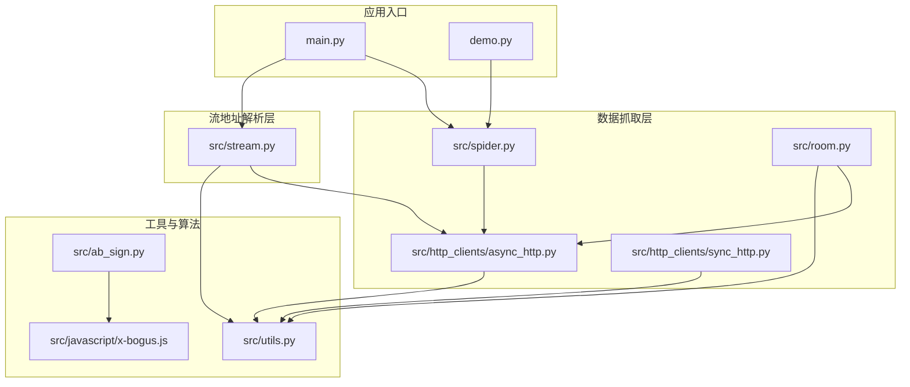
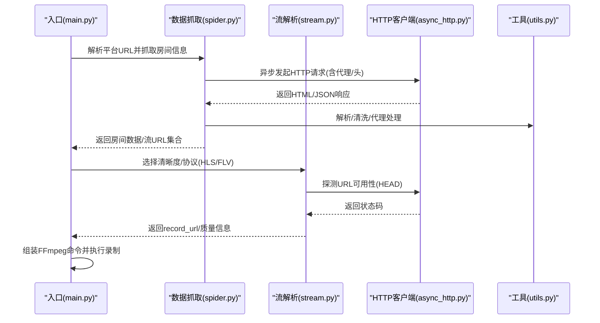
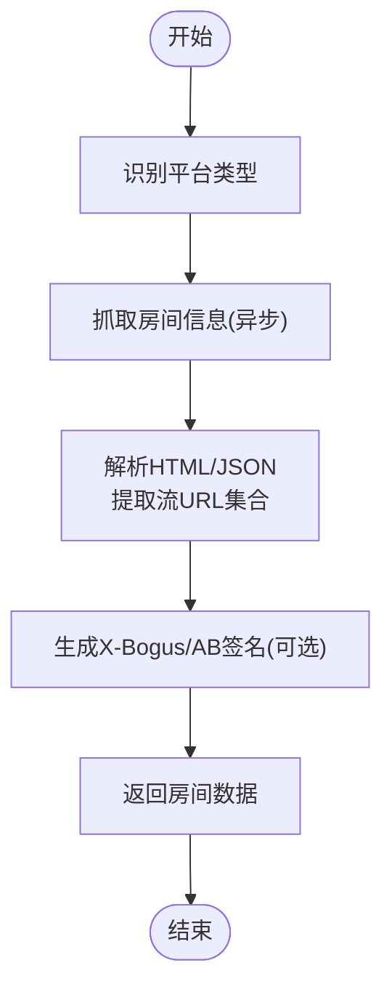
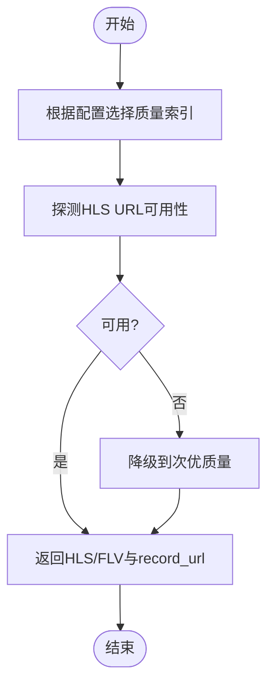
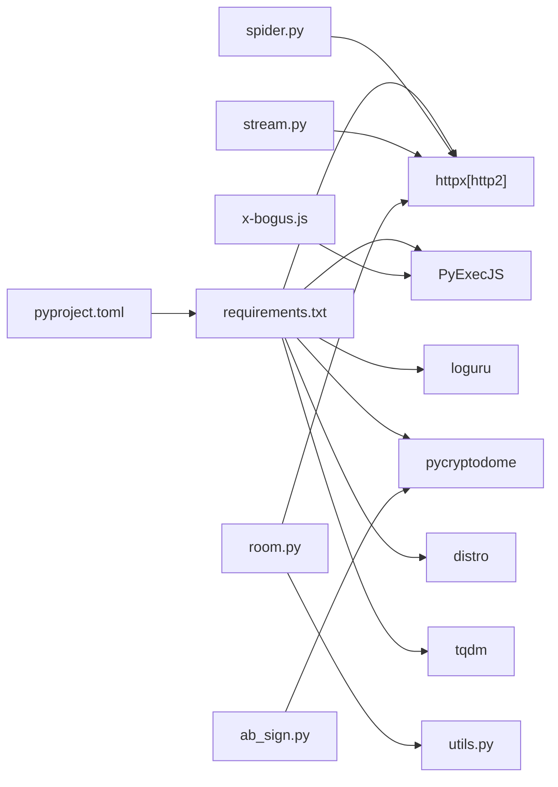

# 测试与验证

<cite>
**本文引用的文件**
- [README.md](file://README.md)
- [main.py](file://main.py)
- [src/spider.py](file://src/spider.py)
- [src/stream.py](file://src/stream.py)
- [src/room.py](file://src/room.py)
- [src/utils.py](file://src/utils.py)
- [src/http_clients/async_http.py](file://src/http_clients/async_http.py)
- [src/http_clients/sync_http.py](file://src/http_clients/sync_http.py)
- [src/javascript/x-bogus.js](file://src/javascript/x-bogus.js)
- [src/ab_sign.py](file://src/ab_sign.py)
- [demo.py](file://demo.py)
- [requirements.txt](file://requirements.txt)
- [pyproject.toml](file://pyproject.toml)
</cite>

## 目录
1. [简介](#简介)
2. [项目结构](#项目结构)
3. [核心组件](#核心组件)
4. [架构总览](#架构总览)
5. [详细组件分析](#详细组件分析)
6. [依赖关系分析](#依赖关系分析)
7. [性能考量](#性能考量)
8. [故障排查指南](#故障排查指南)
9. [结论](#结论)
10. [附录](#附录)

## 简介
本指南面向平台接入开发，提供一套完整的测试与验证方案，覆盖单元测试、集成测试、并发与性能测试、测试数据管理、测试覆盖率分析与持续集成最佳实践。目标是帮助开发者在不依赖真实直播源的情况下稳定验证数据抓取、URL解析、签名算法与HTTP客户端等关键能力。

## 项目结构
该项目采用“按功能域分层”的组织方式，核心模块包括：
- 数据抓取层：src/spider.py、src/room.py、src/http_clients/*
- 流地址解析层：src/stream.py
- 工具与通用能力：src/utils.py、src/ab_sign.py、src/javascript/x-bogus.js
- 主流程与录制控制：main.py
- 示例与演示：demo.py
- 依赖与元信息：requirements.txt、pyproject.toml

图表来源
- [main.py](file://main.py)
- [src/spider.py](file://src/spider.py)
- [src/stream.py](file://src/stream.py)
- [src/room.py](file://src/room.py)
- [src/http_clients/async_http.py](file://src/http_clients/async_http.py)
- [src/http_clients/sync_http.py](file://src/http_clients/sync_http.py)
- [src/utils.py](file://src/utils.py)
- [src/ab_sign.py](file://src/ab_sign.py)
- [src/javascript/x-bogus.js](file://src/javascript/x-bogus.js)
- [demo.py](file://demo.py)

章节来源
- [README.md](file://README.md)
- [main.py](file://main.py)
- [src/spider.py](file://src/spider.py)
- [src/stream.py](file://src/stream.py)
- [src/room.py](file://src/room.py)
- [src/http_clients/async_http.py](file://src/http_clients/async_http.py)
- [src/http_clients/sync_http.py](file://src/http_clients/sync_http.py)
- [src/utils.py](file://src/utils.py)
- [src/ab_sign.py](file://src/ab_sign.py)
- [src/javascript/x-bogus.js](file://src/javascript/x-bogus.js)
- [demo.py](file://demo.py)
- [requirements.txt](file://requirements.txt)
- [pyproject.toml](file://pyproject.toml)

## 核心组件
- 数据抓取层：负责从各平台页面/接口解析直播信息，封装异步与同步HTTP请求，处理反爬策略（如X-Bogus、AB签名）。
- 流地址解析层：根据平台差异选择最优清晰度与协议（HLS/FLV），并进行可用性探测。
- 工具与算法：提供代理处理、JSONP解析、MD5计算、颜色打印、trace装饰器等；实现SM3、RC4、签名生成等算法。
- 主流程与录制控制：调度抓取与解析，组装FFmpeg命令，执行录制与转码，处理并发与错误窗口自适应。

章节来源
- [src/spider.py](file://src/spider.py)
- [src/stream.py](file://src/stream.py)
- [src/room.py](file://src/room.py)
- [src/utils.py](file://src/utils.py)
- [src/ab_sign.py](file://src/ab_sign.py)
- [src/javascript/x-bogus.js](file://src/javascript/x-bogus.js)
- [main.py](file://main.py)

## 架构总览
下图展示了从入口到数据抓取、流地址解析与录制控制的关键调用链路。

图表来源
- [main.py](file://main.py)
- [src/spider.py](file://src/spider.py)
- [src/stream.py](file://src/stream.py)
- [src/http_clients/async_http.py](file://src/http_clients/async_http.py)
- [src/utils.py](file://src/utils.py)

## 详细组件分析

### 数据抓取层（spider.py）
职责与关注点
- 平台适配：针对抖音、TikTok、快手、虎牙、斗鱼、YY、B站、小红书、SOOP、网易CC、千度热播、PandaTV、猫耳FM、WinkTV、FlexTV、PopkonTV、TwitCasting、百度、微博、酷狗、17Live、Twitch、Acfun、CHZZK、Shopee、YouTube、淘宝、京东、Faceit、连接直播、咪咕、来秀、Picarto等平台分别实现解析逻辑。
- 反爬策略：使用X-Bogus与AB签名生成器，配合UA与Cookie注入，提升成功率。
- 错误处理：统一装饰器捕获异常并记录日志，避免中断。

关键流程（以抖音为例）

图表来源
- [src/spider.py](file://src/spider.py)
- [src/room.py](file://src/room.py)
- [src/ab_sign.py](file://src/ab_sign.py)
- [src/javascript/x-bogus.js](file://src/javascript/x-bogus.js)

章节来源
- [src/spider.py](file://src/spider.py)
- [src/room.py](file://src/room.py)
- [src/ab_sign.py](file://src/ab_sign.py)
- [src/javascript/x-bogus.js](file://src/javascript/x-bogus.js)

### 流地址解析层（stream.py）
职责与关注点
- 清晰度选择：根据配置映射OD/BD/UHD/HD/SD/LD到平台内部质量索引。
- 协议选择：优先HLS，必要时回退FLV；对H265场景给出告警并回退。
- 可用性探测：通过HEAD请求快速判断URL有效性，失败时自动降级。

关键流程（以抖音为例）

图表来源
- [src/stream.py](file://src/stream.py)
- [src/http_clients/async_http.py](file://src/http_clients/async_http.py)

章节来源
- [src/stream.py](file://src/stream.py)
- [src/http_clients/async_http.py](file://src/http_clients/async_http.py)

### 工具与算法（utils.py、ab_sign.py、x-bogus.js）
职责与关注点
- 工具函数：代理地址规范化、JSONP转JSON、MD5计算、去重、磁盘容量检查、随机字符串生成、查询参数解析等。
- 算法实现：SM3、RC4、Base64魔改表、签名生成、X-Bogus签名生成器（通过JS脚本桥接）。

章节来源
- [src/utils.py](file://src/utils.py)
- [src/ab_sign.py](file://src/ab_sign.py)
- [src/javascript/x-bogus.js](file://src/javascript/x-bogus.js)

### 主流程与录制控制（main.py）
职责与关注点
- 并发与限流：动态调整同时访问网络的线程数，基于错误率窗口自适应。
- 录制编排：拼接FFmpeg命令、分段录制、转码、脚本钩子、时间戳字幕生成、消息推送。
- 错误处理：统一异常捕获与日志记录，支持注释/停止指令触发清理。

章节来源
- [main.py](file://main.py)

## 依赖关系分析
- 运行时依赖：httpx[http2]、PyExecJS、requests、loguru、pycryptodome、distro、tqdm。
- 关键耦合点：spider/stream依赖async_http；room依赖utils与httpx；ab_sign与x-bogus共同支撑签名生成。

图表来源
- [pyproject.toml](file://pyproject.toml)
- [requirements.txt](file://requirements.txt)
- [src/spider.py](file://src/spider.py)
- [src/stream.py](file://src/stream.py)
- [src/room.py](file://src/room.py)
- [src/utils.py](file://src/utils.py)
- [src/ab_sign.py](file://src/ab_sign.py)
- [src/javascript/x-bogus.js](file://src/javascript/x-bogus.js)

章节来源
- [pyproject.toml](file://pyproject.toml)
- [requirements.txt](file://requirements.txt)
- [src/spider.py](file://src/spider.py)
- [src/stream.py](file://src/stream.py)
- [src/room.py](file://src/room.py)
- [src/utils.py](file://src/utils.py)
- [src/ab_sign.py](file://src/ab_sign.py)
- [src/javascript/x-bogus.js](file://src/javascript/x-bogus.js)

## 性能考量
- 并发与限流：通过动态窗口与错误率阈值自适应调整并发，避免触发平台风控与自身资源瓶颈。
- 探测优先：解析前先探测URL可用性，减少无效下载与录制失败。
- 转码策略：按需启用强制h264转码与分段录制，平衡质量与存储。
- 日志与可观测：统一日志输出，便于定位性能瓶颈。

章节来源
- [main.py](file://main.py)
- [src/stream.py](file://src/stream.py)
- [src/http_clients/async_http.py](file://src/http_clients/async_http.py)

## 故障排查指南
常见问题与建议
- 请求失败/风控：检查代理配置、UA与Cookie注入、X-Bogus/AB签名生成是否正确。
- 解析异常：确认HTML/JSON结构变化，必要时更新解析逻辑或降级策略。
- 录制中断：检查FFmpeg命令参数、分段与转码开关、脚本钩子返回值。
- 并发过高：降低并发或延长探测间隔，观察错误率窗口变化。

章节来源
- [src/spider.py](file://src/spider.py)
- [src/stream.py](file://src/stream.py)
- [src/room.py](file://src/room.py)
- [src/utils.py](file://src/utils.py)
- [src/ab_sign.py](file://src/ab_sign.py)
- [src/javascript/x-bogus.js](file://src/javascript/x-bogus.js)
- [main.py](file://main.py)

## 结论
通过将数据抓取、流地址解析与录制控制解耦，结合统一的HTTP客户端与工具库，项目具备良好的可测试性。建议在CI中引入单元测试、集成测试与性能测试，配合覆盖率统计与自动化报告，持续保障平台接入的稳定性与可维护性。

## 附录

### 单元测试指南（pytest）
目标：验证数据抓取、URL解析、签名算法与HTTP客户端行为。

建议的测试策略
- 模拟HTTP请求
  - 使用httpx.AsyncClient与httpx.Client的上下文管理器，避免外部依赖。
  - 对spider/stream中的异步/同步函数进行隔离测试，确保返回结构符合预期。
  - 参考路径：[src/http_clients/async_http.py](file://src/http_clients/async_http.py)、[src/http_clients/sync_http.py](file://src/http_clients/sync_http.py)

- 测试数据抓取逻辑
  - 针对不同平台构造最小化的HTML/JSON响应，验证解析函数能否正确提取关键字段（如flv_url、m3u8_url、title、anchor_name）。
  - 参考路径：[src/spider.py](file://src/spider.py)

- 验证流地址解析
  - 输入不同质量配置与URL集合，断言返回的record_url与质量字段。
  - 参考路径：[src/stream.py](file://src/stream.py)

- 签名算法与加密
  - 针对ab_sign与x-bogus，使用固定输入与期望输出进行回归测试，确保签名一致性。
  - 参考路径：[src/ab_sign.py](file://src/ab_sign.py)、[src/javascript/x-bogus.js](file://src/javascript/x-bogus.js)

- 工具函数
  - 对utils中的MD5、JSONP解析、代理处理、查询参数解析等函数进行边界与异常场景测试。
  - 参考路径：[src/utils.py](file://src/utils.py)

- 测试用例编写要点
  - 使用pytest标记与fixtures组织公共依赖（如代理、UA、Cookie）。
  - 使用monkeypatch模拟网络请求，避免真实网络交互。
  - 对异步函数使用pytest-asyncio的标记与事件循环。

- 测试数据管理
  - 将平台样例HTML/JSON保存为测试资源文件，便于离线验证。
  - 对签名与加密函数使用确定性输入，确保可重复性。

- 测试覆盖率分析
  - 使用pytest-cov统计覆盖率，重点关注spider、stream、utils与ab_sign模块。
  - 设置覆盖率阈值，逐步提升关键路径覆盖率。

- 持续集成最佳实践
  - 在CI中并行执行单元测试与集成测试，缩短反馈周期。
  - 对关键平台解析逻辑建立回归测试集，防止上游变更导致解析失败。
  - 将覆盖率报告与测试日志归档，便于追踪历史趋势。

章节来源
- [src/http_clients/async_http.py](file://src/http_clients/async_http.py)
- [src/http_clients/sync_http.py](file://src/http_clients/sync_http.py)
- [src/spider.py](file://src/spider.py)
- [src/stream.py](file://src/stream.py)
- [src/utils.py](file://src/utils.py)
- [src/ab_sign.py](file://src/ab_sign.py)
- [src/javascript/x-bogus.js](file://src/javascript/x-bogus.js)
- [demo.py](file://demo.py)