# 适配器开发

<cite>
**本文档引用的文件**
- [spider.py](file://src/spider.py)
- [room.py](file://src/room.py)
- [stream.py](file://src/stream.py)
- [utils.py](file://src/utils.py)
- [ab_sign.py](file://src/ab_sign.py)
- [async_http.py](file://src/http_clients/async_http.py)
- [x-bogus.js](file://src/javascript/x-bogus.js)
- [taobao-sign.js](file://src/javascript/taobao-sign.js)
- [demo.py](file://demo.py)
- [README.md](file://README.md)
</cite>

## 目录
1. [简介](#简介)
2. [项目结构](#项目结构)
3. [核心组件](#核心组件)
4. [架构概览](#架构概览)
5. [详细组件分析](#详细组件分析)
6. [依赖关系分析](#依赖关系分析)
7. [性能考虑](#性能考虑)
8. [故障排除指南](#故障排除指南)
9. [结论](#结论)
10. [附录](#附录)

## 简介

DouyinLiveRecorder 是一个基于 Python 的直播录制工具，支持 60+ 个直播平台。本文档专注于平台接入开发，详细介绍如何扩展现有的 spider 模块，添加新的平台适配器，实现数据抓取逻辑，处理流地址解析等核心技术。

该项目采用异步编程模型，使用 httpx 库进行网络请求，集成了多种 JavaScript 加密算法来处理反爬虫机制。系统架构清晰，模块职责明确，为平台接入开发提供了良好的基础框架。

## 项目结构

项目采用模块化设计，主要包含以下核心模块：

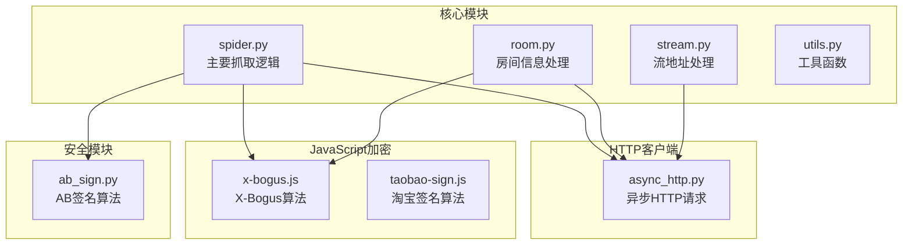

**图表来源**
- [spider.py:1-800](file://src/spider.py#L1-L800)
- [room.py:1-151](file://src/room.py#L1-L151)
- [stream.py:1-446](file://src/stream.py#L1-L446)

**章节来源**
- [README.md:72-100](file://README.md#L72-L100)

## 核心组件

### 异步HTTP客户端

系统使用统一的异步HTTP客户端处理所有网络请求：

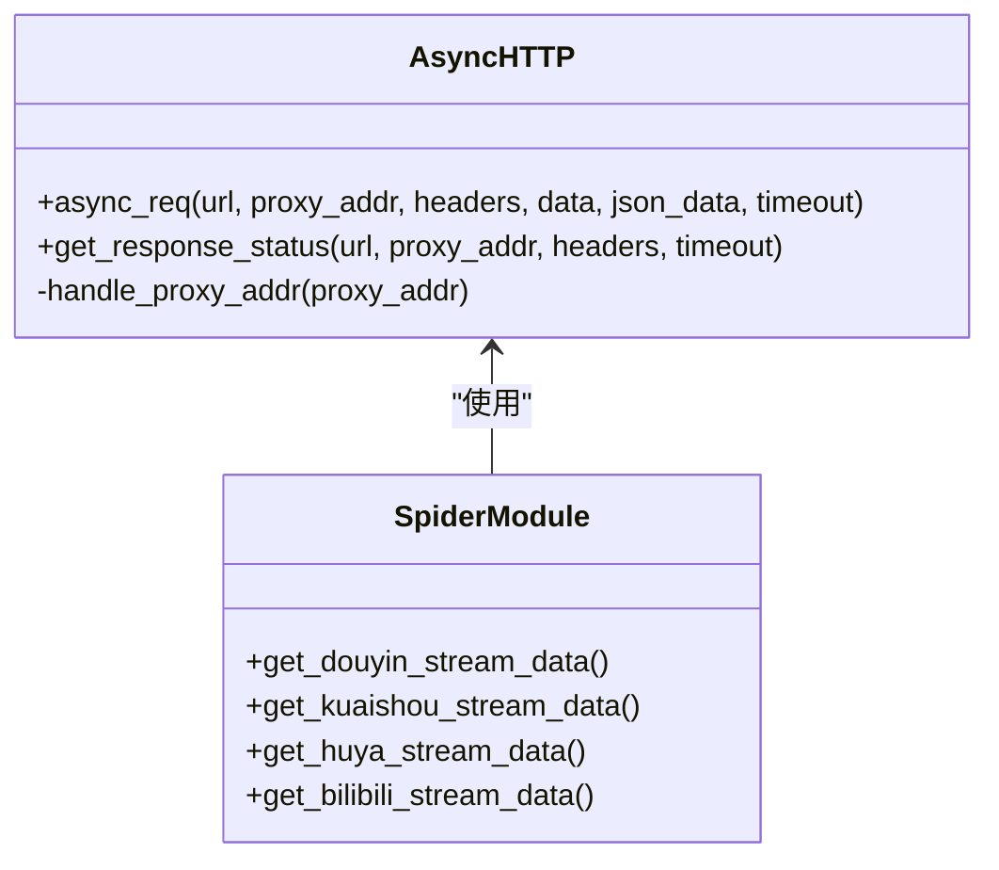

**图表来源**
- [async_http.py:10-60](file://src/http_clients/async_http.py#L10-L60)
- [spider.py:68-800](file://src/spider.py#L68-L800)

### 错误处理装饰器

系统实现了统一的错误处理机制：

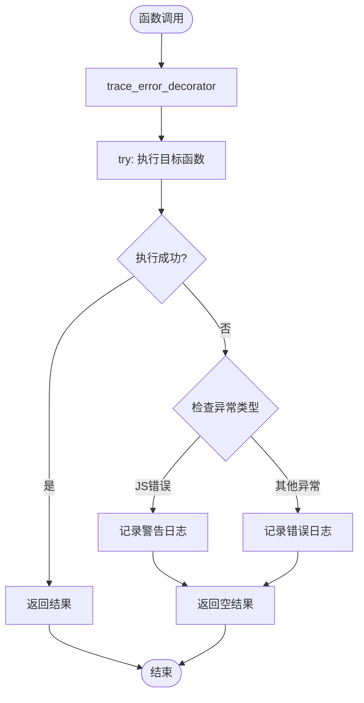

**图表来源**
- [utils.py:38-52](file://src/utils.py#L38-L52)

**章节来源**
- [async_http.py:10-60](file://src/http_clients/async_http.py#L10-L60)
- [utils.py:38-52](file://src/utils.py#L38-L52)

## 架构概览

系统采用分层架构设计，每层职责明确：

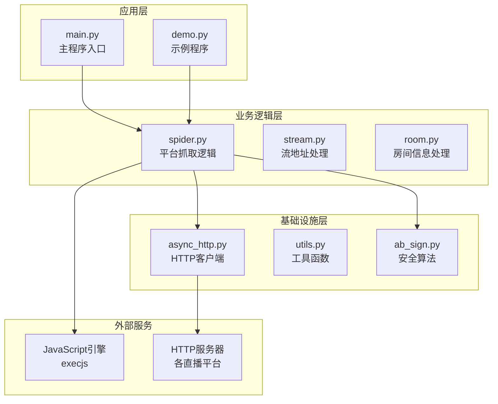

**图表来源**
- [spider.py:1-800](file://src/spider.py#L1-L800)
- [stream.py:1-446](file://src/stream.py#L1-L446)
- [room.py:1-151](file://src/room.py#L1-L151)

## 详细组件分析

### 平台适配器开发模式

#### 抖音平台适配器

抖音平台提供了三种获取数据的方式：

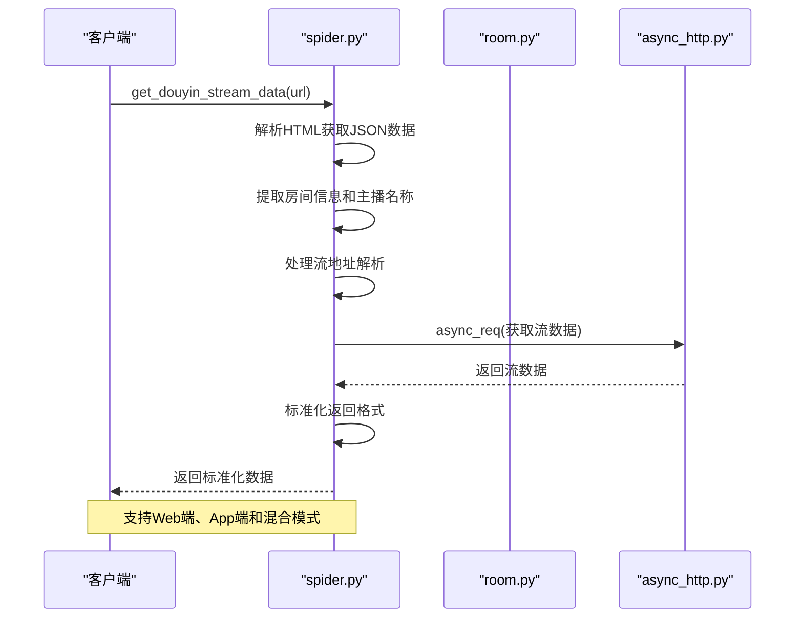

**图表来源**
- [spider.py:230-282](file://src/spider.py#L230-L282)
- [room.py:52-105](file://src/room.py#L52-L105)

#### 快手平台适配器

快手平台的数据获取相对简单：

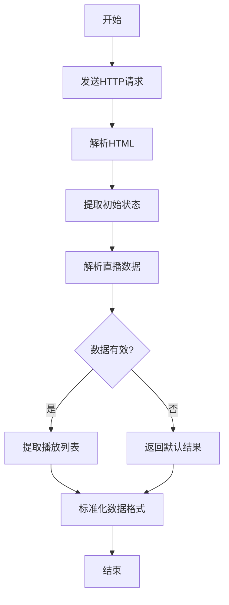

**图表来源**
- [spider.py:316-361](file://src/spider.py#L316-L361)

#### 虎牙平台适配器

虎牙平台的反爬虫机制较为复杂：

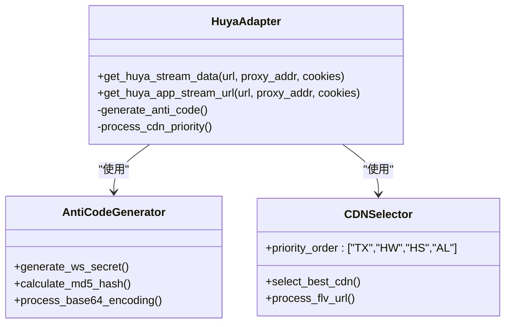

**图表来源**
- [spider.py:408-517](file://src/spider.py#L408-L517)

### JavaScript加密算法集成

系统集成了多种JavaScript加密算法：

#### X-Bogus算法

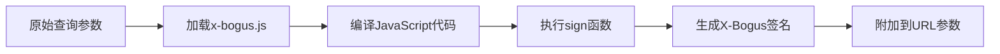

**图表来源**
- [room.py:42-48](file://src/room.py#L42-L48)
- [x-bogus.js:500-564](file://src/javascript/x-bogus.js#L500-L564)

#### AB签名算法

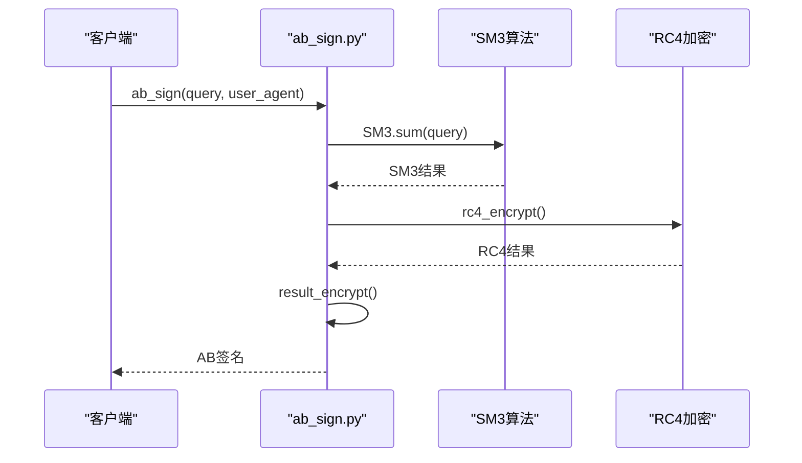

**图表来源**
- [ab_sign.py:444-455](file://src/ab_sign.py#L444-L455)

**章节来源**
- [spider.py:68-800](file://src/spider.py#L68-L800)
- [room.py:42-48](file://src/room.py#L42-L48)
- [ab_sign.py:444-455](file://src/ab_sign.py#L444-L455)

### 数据流处理管道

系统实现了标准化的数据处理流程：

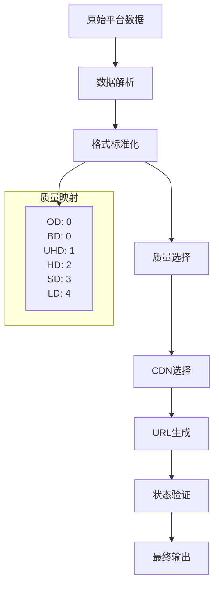

**图表来源**
- [stream.py:29-78](file://src/stream.py#L29-L78)
- [stream.py:157-206](file://src/stream.py#L157-L206)

**章节来源**
- [stream.py:29-78](file://src/stream.py#L29-L78)
- [stream.py:157-206](file://src/stream.py#L157-L206)

## 依赖关系分析

### 核心依赖关系

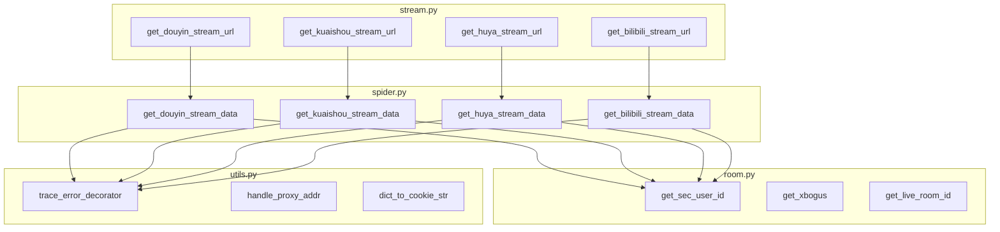

**图表来源**
- [spider.py:1-800](file://src/spider.py#L1-L800)
- [room.py:1-151](file://src/room.py#L1-L151)
- [stream.py:1-446](file://src/stream.py#L1-L446)

### 第三方依赖

系统依赖的关键第三方库：

| 依赖库 | 版本要求 | 用途 |
|--------|----------|------|
| httpx | >=0.23.0 | 异步HTTP客户端 |
| execjs | >=1.5.0 | JavaScript执行引擎 |
| httpx | >=0.23.0 | 异步HTTP客户端 |
| typing_extensions | >=4.0.0 | 类型提示支持 |

**章节来源**
- [spider.py:1-800](file://src/spider.py#L1-L800)
- [room.py:1-151](file://src/room.py#L1-L151)
- [stream.py:1-446](file://src/stream.py#L1-L446)

## 性能考虑

### 异步并发处理

系统采用异步编程模型，能够有效处理大量并发请求：

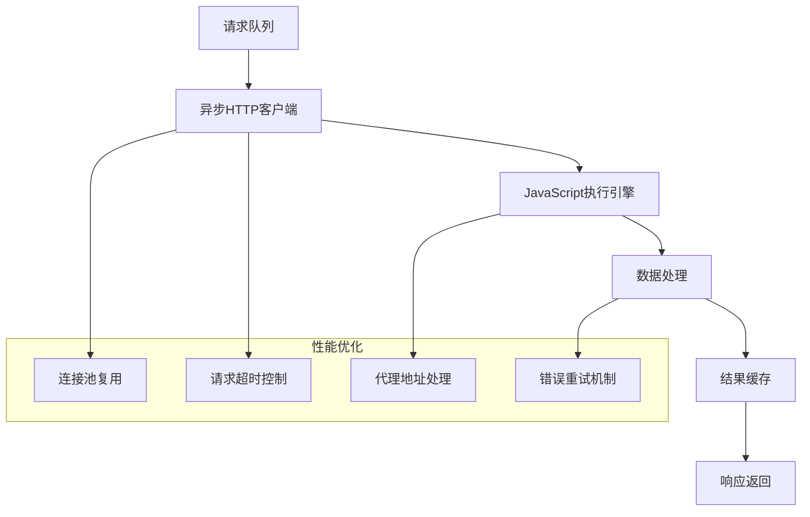

### 缓存策略

系统实现了多层次的缓存机制：

1. **HTTP响应缓存**：避免重复网络请求
2. **JavaScript代码缓存**：减少编译开销
3. **结果缓存**：缓存处理后的数据

**章节来源**
- [async_http.py:10-60](file://src/http_clients/async_http.py#L10-L60)
- [utils.py:162-168](file://src/utils.py#L162-L168)

## 故障排除指南

### 常见问题及解决方案

#### JavaScript执行错误

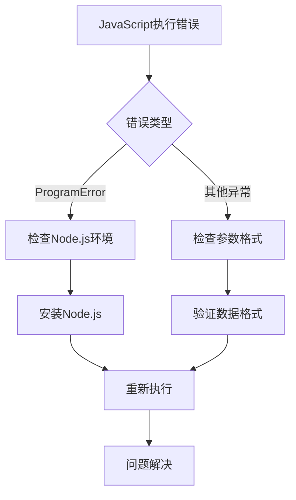

**图表来源**
- [utils.py:38-52](file://src/utils.py#L38-L52)

#### 网络请求失败

常见网络问题及处理方案：

1. **超时问题**：调整超时参数或使用代理
2. **SSL证书问题**：禁用SSL验证或更新证书
3. **代理连接问题**：检查代理配置和可用性

#### 反爬虫机制应对

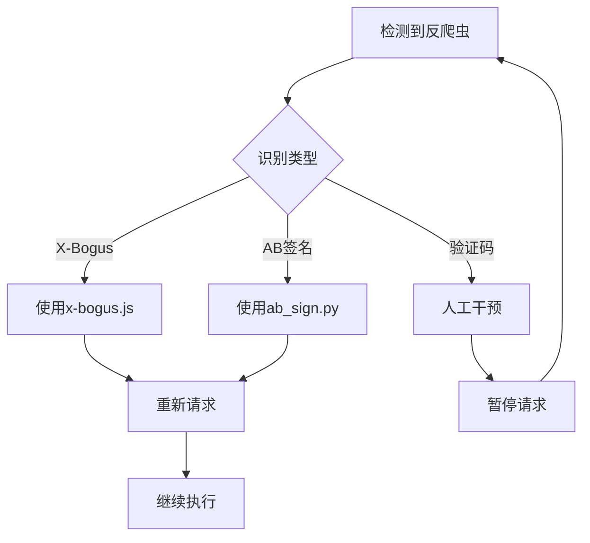

**图表来源**
- [room.py:42-48](file://src/room.py#L42-L48)
- [ab_sign.py:444-455](file://src/ab_sign.py#L444-L455)

**章节来源**
- [utils.py:38-52](file://src/utils.py#L38-L52)
- [room.py:42-48](file://src/room.py#L42-L48)
- [ab_sign.py:444-455](file://src/ab_sign.py#L444-L455)

## 结论

DouyinLiveRecorder 项目为平台接入开发提供了完整的框架和最佳实践。通过分析其架构设计、核心组件和实现模式，我们可以总结出以下关键要点：

1. **模块化设计**：清晰的职责分离使得新平台的接入变得简单
2. **异步编程**：高效的并发处理能力
3. **统一接口**：标准化的数据格式和返回值
4. **错误处理**：完善的异常处理和恢复机制
5. **安全性**：集成多种反爬虫应对策略

对于新平台的接入开发，建议遵循现有的代码模式和最佳实践，确保系统的稳定性和可维护性。

## 附录

### 开发示例模板

#### 基础适配器模板

```python
# 平台名称适配器
@trace_error_decorator
async def get_平台名称_stream_data(url: str, proxy_addr: OptionalStr = None, cookies: OptionalStr = None) -> dict:
    """
    获取平台名称直播数据
    
    Args:
        url: 直播间URL
        proxy_addr: 代理地址
        cookies: Cookie信息
        
    Returns:
        dict: 标准化的直播数据
    """
    headers = {
        'User-Agent': 'Mozilla/5.0 (Windows NT 10.0; Win64; x64) AppleWebKit/537.36',
        'Referer': 'https://www.platform.com/',
    }
    
    if cookies:
        headers['Cookie'] = cookies
    
    try:
        # 实现平台特定的数据获取逻辑
        html_str = await async_req(url=url, proxy_addr=proxy_addr, headers=headers)
        
        # 解析平台特定的数据格式
        # ...
        
        # 标准化返回格式
        result = {
            'anchor_name': anchor_name,
            'is_live': is_live,
            'title': title,
            'm3u8_url': m3u8_url,
            'flv_url': flv_url,
            'quality': quality,
        }
        
        return result
        
    except Exception as e:
        logger.error(f"获取平台名称数据失败: {e}")
        return {}
```

#### JavaScript加密集成示例

```python
# 集成JavaScript加密算法
def integrate_js_encryption():
    """
    集成JavaScript加密算法的示例
    """
    # 加载JavaScript文件
    js_code = open(JS_SCRIPT_PATH + '/algorithm.js').read()
    
    # 编译JavaScript代码
    js = execjs.compile(js_code)
    
    # 执行加密函数
    encrypted_result = js.call('encrypt_function', data)
    
    return encrypted_result
```

### 最佳实践清单

1. **错误处理**：始终使用 `@trace_error_decorator` 装饰器
2. **异步编程**：使用 `async def` 函数和 `await` 关键字
3. **数据标准化**：返回统一格式的数据结构
4. **代理支持**：支持代理地址配置
5. **Cookie处理**：正确处理Cookie认证
6. **JavaScript集成**：合理使用 execjs 执行加密算法
7. **日志记录**：使用统一的日志记录机制
8. **资源清理**：及时释放网络连接和JavaScript上下文

### 代码模板路径

- [异步HTTP请求模板:10-46](file://src/http_clients/async_http.py#L10-L46)
- [错误处理装饰器:38-52](file://src/utils.py#L38-L52)
- [JavaScript执行模板:42-48](file://src/room.py#L42-L48)
- [数据标准化模板:41-78](file://src/stream.py#L41-L78)