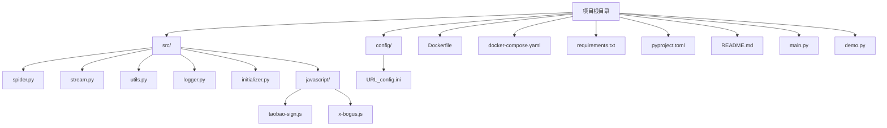
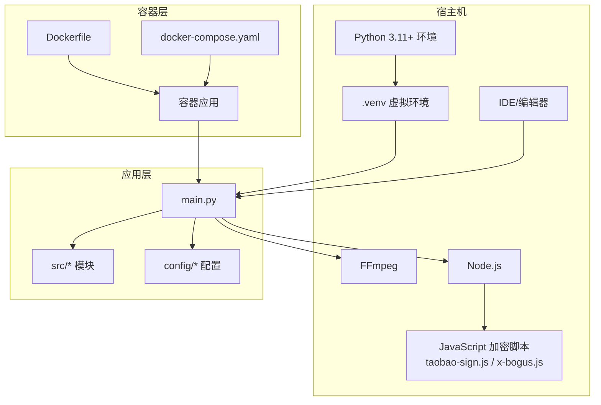
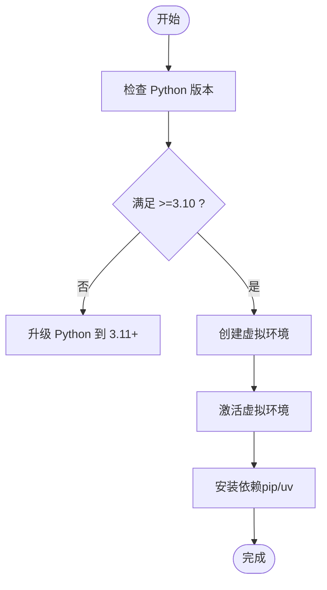
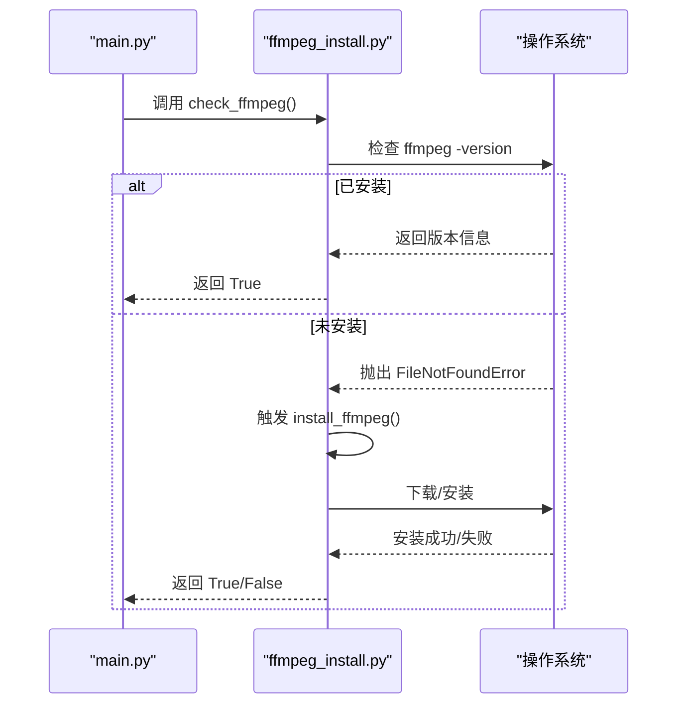
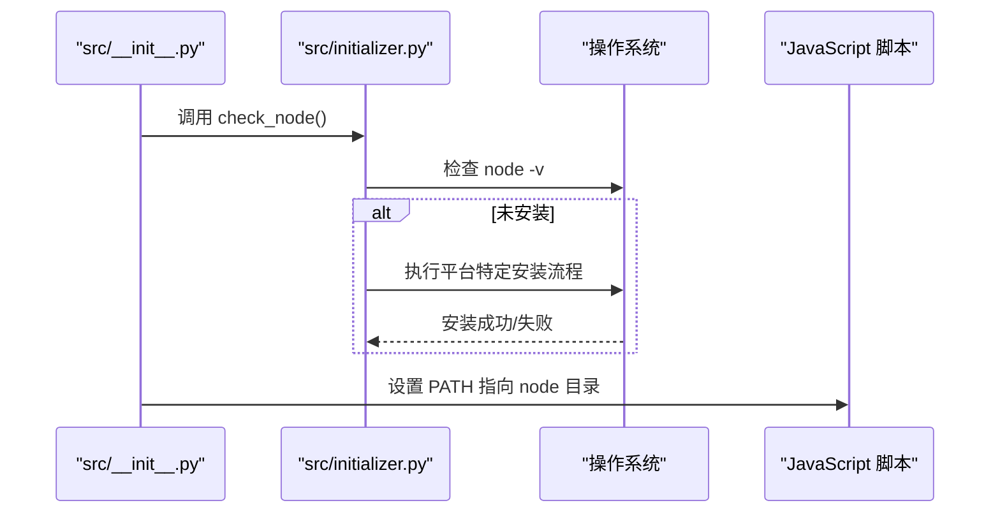
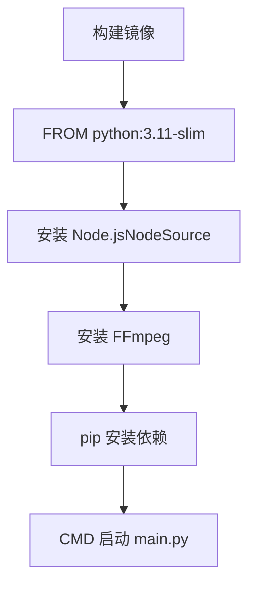
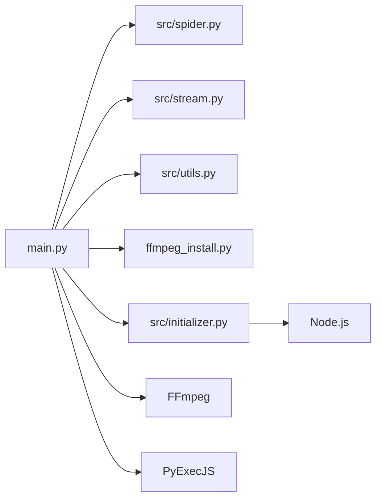

# 开发环境搭建

<cite>
**本文档引用的文件**
- [requirements.txt](file://requirements.txt)
- [pyproject.toml](file://pyproject.toml)
- [Dockerfile](file://Dockerfile)
- [docker-compose.yaml](file://docker-compose.yaml)
- [ffmpeg_install.py](file://ffmpeg_install.py)
- [README.md](file://README.md)
- [src/__init__.py](file://src/__init__.py)
- [src/initializer.py](file://src/initializer.py)
- [src/javascript/taobao-sign.js](file://src/javascript/taobao-sign.js)
- [src/javascript/x-bogus.js](file://src/javascript/x-bogus.js)
- [main.py](file://main.py)
- [demo.py](file://demo.py)
- [config/URL_config.ini](file://config/URL_config.ini)
</cite>

## 目录
1. [简介](#简介)
2. [项目结构](#项目结构)
3. [核心组件](#核心组件)
4. [架构总览](#架构总览)
5. [详细组件分析](#详细组件分析)
6. [依赖关系分析](#依赖关系分析)
7. [性能考量](#性能考量)
8. [故障排查指南](#故障排查指南)
9. [结论](#结论)
10. [附录](#附录)

## 简介
本指南面向开发者，帮助您快速搭建并运行 DouyinLiveRecorder 的开发环境。内容涵盖：
- Python 3.11+ 环境与虚拟环境配置
- 依赖安装与管理
- FFmpeg、Node.js、PyExecJS 运行时准备
- IDE 配置建议与调试设置
- Docker 开发环境与容器编排
- 常见问题排查与解决方案

## 项目结构
项目采用模块化组织，核心入口为 main.py，业务逻辑分布在 src 子模块中，配置文件位于 config 目录，Docker 相关文件位于根目录。

图表来源
- [main.py](file://main.py)
- [src/__init__.py](file://src/__init__.py)
- [src/initializer.py](file://src/initializer.py)
- [src/javascript/taobao-sign.js](file://src/javascript/taobao-sign.js)
- [src/javascript/x-bogus.js](file://src/javascript/x-bogus.js)
- [config/URL_config.ini](file://config/URL_config.ini)

章节来源
- [README.md](file://README.md)
- [main.py](file://main.py)

## 核心组件
- Python 运行时与依赖
  - Python 版本要求：>=3.10（推荐 3.11+）
  - 依赖清单：requests、loguru、pycryptodome、distro、tqdm、httpx[http2]、PyExecJS
- FFmpeg
  - 用于视频录制与转码；项目提供自动安装脚本与运行时检查
- Node.js
  - 用于执行 JavaScript 加密/签名脚本；项目提供自动安装脚本与运行时检查
- Docker
  - 提供容器化运行与开发环境

章节来源
- [pyproject.toml](file://pyproject.toml)
- [requirements.txt](file://requirements.txt)
- [ffmpeg_install.py](file://ffmpeg_install.py)
- [src/initializer.py](file://src/initializer.py)
- [Dockerfile](file://Dockerfile)

## 架构总览
下图展示开发环境的关键组件及其交互关系。

图表来源
- [main.py](file://main.py)
- [src/__init__.py](file://src/__init__.py)
- [src/initializer.py](file://src/initializer.py)
- [src/javascript/taobao-sign.js](file://src/javascript/taobao-sign.js)
- [src/javascript/x-bogus.js](file://src/javascript/x-bogus.js)
- [Dockerfile](file://Dockerfile)
- [docker-compose.yaml](file://docker-compose.yaml)

## 详细组件分析

### Python 环境与依赖管理
- 版本要求
  - 项目要求 Python >=3.10；推荐使用 3.11+ 以获得更好的兼容性
- 虚拟环境
  - 推荐使用 venv 或 uv 创建隔离环境
  - 激活方式因操作系统而异（Bash/Powershell/CMD）
- 依赖安装
  - 使用 pip 或 uv 安装 requirements.txt
  - 可使用国内镜像源加速（pip/uv 均支持镜像源参数）

图表来源
- [README.md](file://README.md)
- [requirements.txt](file://requirements.txt)
- [pyproject.toml](file://pyproject.toml)

章节来源
- [README.md](file://README.md)
- [requirements.txt](file://requirements.txt)
- [pyproject.toml](file://pyproject.toml)

### FFmpeg 安装与配置
- 自动安装
  - 项目提供 ffmpeg_install.py，支持 Windows/macOS/Linux 平台自动检测与安装
  - Windows：下载并解压，加入 PATH
  - macOS：通过 Homebrew 安装
  - Linux：优先尝试 yum，否则使用 apt
- 运行时检查
  - main.py 启动时会注入 ffmpeg 路径并检查可用性
  - 若未安装，将触发自动安装流程

图表来源
- [ffmpeg_install.py](file://ffmpeg_install.py)
- [main.py](file://main.py)

章节来源
- [ffmpeg_install.py](file://ffmpeg_install.py)
- [main.py](file://main.py)

### Node.js 与 JavaScript 加密脚本
- Node.js 自动安装
  - 项目提供 src/initializer.py，支持 Windows/CentOS/Ubuntu/macOS 自动安装
  - Windows：从镜像站点下载并解压，加入 PATH
  - Linux：使用 NodeSource 安装脚本
  - macOS：通过 Homebrew 安装
- JavaScript 加密脚本
  - src/javascript/taobao-sign.js 与 x-bogus.js 用于生成签名参数
  - 通过 PyExecJS 在 Python 中调用 Node.js 执行这些脚本

图表来源
- [src/__init__.py](file://src/__init__.py)
- [src/initializer.py](file://src/initializer.py)

章节来源
- [src/__init__.py](file://src/__init__.py)
- [src/initializer.py](file://src/initializer.py)
- [src/javascript/taobao-sign.js](file://src/javascript/taobao-sign.js)
- [src/javascript/x-bogus.js](file://src/javascript/x-bogus.js)

### Docker 开发环境
- 镜像构建
  - 基于 python:3.11-slim，安装 Node.js（NodeSource），安装 FFmpeg，设置时区
  - 使用 requirements.txt 安装 Python 依赖
- 容器编排
  - docker-compose.yaml 提供服务定义，挂载 config、logs、backup_config、downloads 目录
  - 可直接运行官方镜像或本地构建镜像

图表来源
- [Dockerfile](file://Dockerfile)
- [docker-compose.yaml](file://docker-compose.yaml)

章节来源
- [Dockerfile](file://Dockerfile)
- [docker-compose.yaml](file://docker-compose.yaml)

### IDE 配置与调试建议
- VS Code
  - 推荐安装 Python 扩展，选择正确的解释器（.venv）
  - 可使用 tasks.json/launch.json 配置运行与调试任务
- PyCharm
  - 配置项目解释器为 .venv
  - 可直接运行 main.py 或创建运行配置
- 代码格式化
  - 建议使用 black/isort 等工具统一风格
  - 配置保存时自动格式化

章节来源
- [README.md](file://README.md)

## 依赖关系分析
- Python 依赖
  - requests/httpx：网络请求
  - loguru：日志
  - pycryptodome：加密
  - distro：系统信息
  - tqdm：进度条
  - PyExecJS：执行 JS 脚本
- 运行时依赖
  - FFmpeg：录制与转码
  - Node.js：执行加密/签名脚本
- 容器依赖
  - Docker 与 Docker Compose

图表来源
- [main.py](file://main.py)
- [ffmpeg_install.py](file://ffmpeg_install.py)
- [src/initializer.py](file://src/initializer.py)

章节来源
- [main.py](file://main.py)
- [requirements.txt](file://requirements.txt)
- [pyproject.toml](file://pyproject.toml)

## 性能考量
- 并发与限速
  - 项目内置动态调整并发请求的机制，可根据错误率自动增减并发数
- 录制策略
  - 支持按时间分段录制与转码为 MP4，合理配置可降低资源占用
- 网络与代理
  - 针对海外平台可启用代理，减少请求失败带来的重试成本

章节来源
- [main.py](file://main.py)

## 故障排查指南
- Python 版本不符
  - 症状：安装依赖时报错或运行时报错
  - 处理：升级 Python 至 3.11+，重建虚拟环境
- 依赖安装缓慢或失败
  - 症状：pip/uv 安装超时或失败
  - 处理：使用国内镜像源（pip -i / uv --index）
- FFmpeg 未找到
  - 症状：运行时报错提示 ffmpeg 未安装
  - 处理：使用 ffmpeg_install.py 自动安装；确认 PATH 包含 ffmpeg
- Node.js 未找到
  - 症状：运行时报错提示 node 未安装
  - 处理：使用 src/initializer.py 自动安装；确认 PATH 包含 node
- Docker 构建失败
  - 症状：apt/yum 安装失败
  - 处理：检查网络与镜像源；必要时手动安装依赖
- 容器内录制中断导致文件损坏
  - 处理：避免手动中断容器；推荐使用 ts 格式保存

章节来源
- [README.md](file://README.md)
- [ffmpeg_install.py](file://ffmpeg_install.py)
- [src/initializer.py](file://src/initializer.py)
- [Dockerfile](file://Dockerfile)
- [docker-compose.yaml](file://docker-compose.yaml)

## 结论
按照本指南完成 Python 环境、FFmpeg、Node.js 的安装与配置，并结合 Docker 容器化部署，即可快速搭建稳定高效的开发与运行环境。遇到问题时，可依据故障排查指南逐项定位并解决。

## 附录
- 快速开始
  - 拉取代码并进入目录
  - 创建并激活虚拟环境
  - 安装依赖（pip/uv）
  - 安装 FFmpeg 与 Node.js
  - 运行 main.py 或使用 Docker Compose 启动
- 示例配置
  - 在 config/URL_config.ini 添加待录制的直播间地址
  - 使用 demo.py 测试目标平台的直播流抓取

章节来源
- [README.md](file://README.md)
- [demo.py](file://demo.py)
- [config/URL_config.ini](file://config/URL_config.ini)