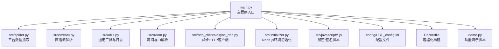
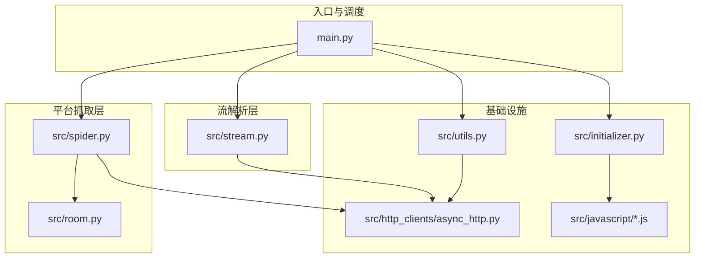
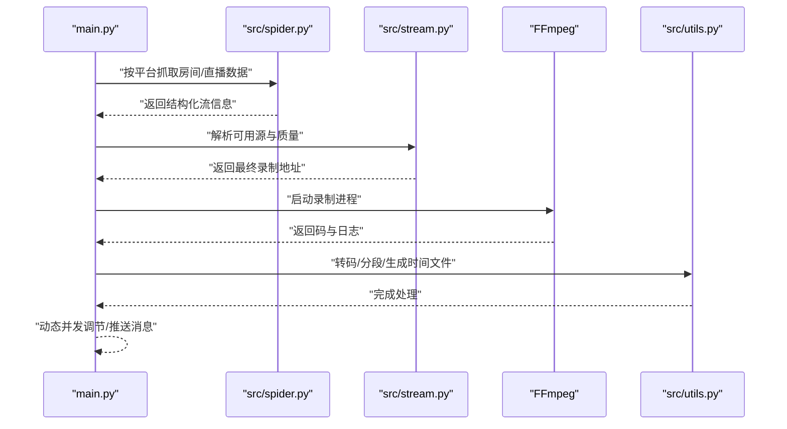
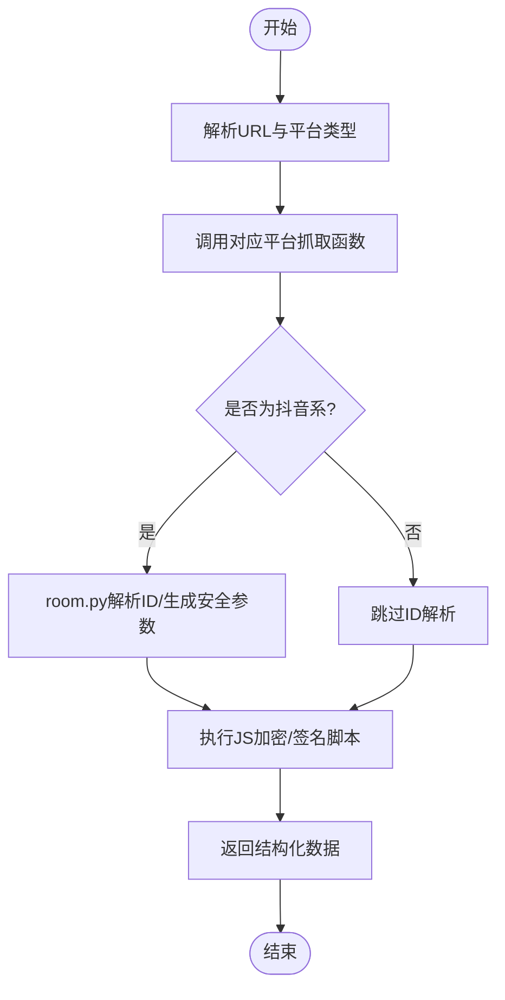
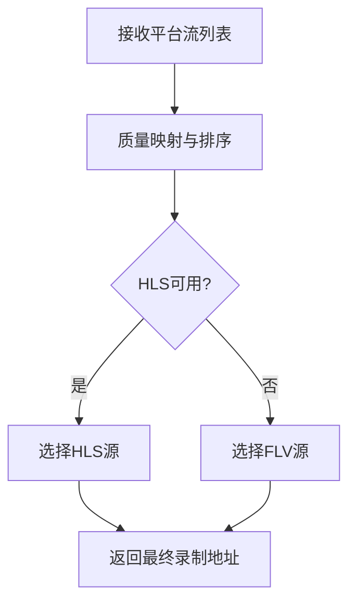
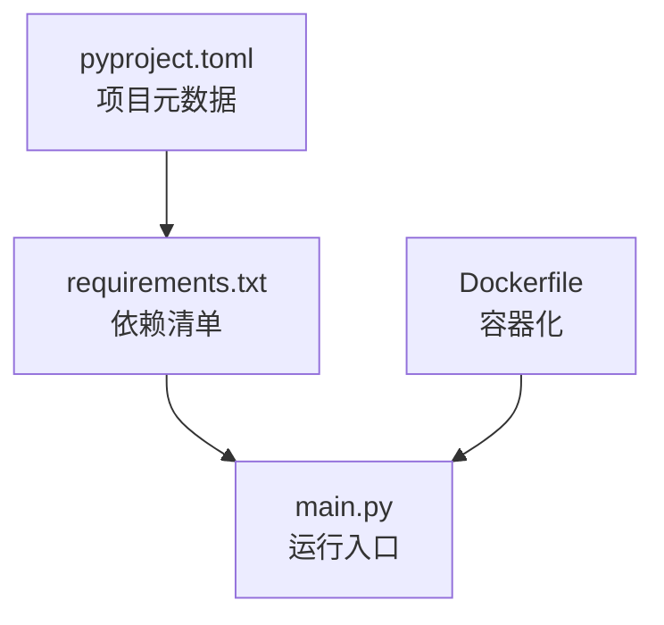
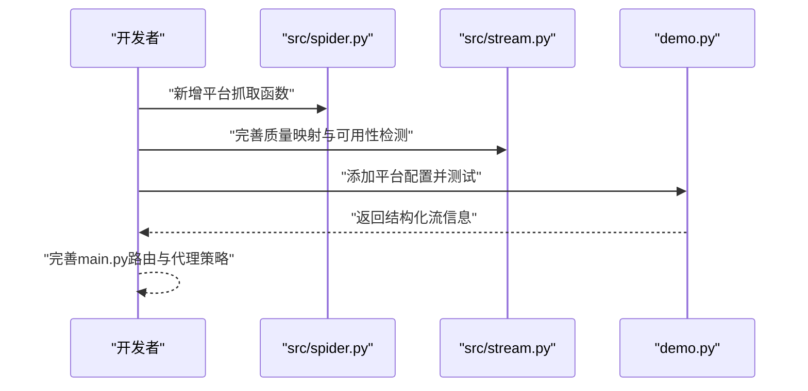

# 开发者指南

<cite>
**本文引用的文件**   
- [README.md](file://README.md)
- [main.py](file://main.py)
- [requirements.txt](file://requirements.txt)
- [pyproject.toml](file://pyproject.toml)
- [src/__init__.py](file://src/__init__.py)
- [src/spider.py](file://src/spider.py)
- [src/stream.py](file://src/stream.py)
- [src/utils.py](file://src/utils.py)
- [src/initializer.py](file://src/initializer.py)
- [src/room.py](file://src/room.py)
- [src/http_clients/async_http.py](file://src/http_clients/async_http.py)
- [src/javascript/taobao-sign.js](file://src/javascript/taobao-sign.js)
- [demo.py](file://demo.py)
- [Dockerfile](file://Dockerfile)
- [config/URL_config.ini](file://config/URL_config.ini)
</cite>

## 目录
1. [简介](#简介)
2. [项目结构](#项目结构)
3. [核心组件](#核心组件)
4. [架构总览](#架构总览)
5. [详细组件分析](#详细组件分析)
6. [依赖分析](#依赖分析)
7. [性能考量](#性能考量)
8. [故障排查指南](#故障排查指南)
9. [结论](#结论)
10. [附录](#附录)

## 简介
本指南面向希望参与开发与扩展 DouyinLiveRecorder 的开发者，覆盖开发环境搭建、代码结构与架构设计、新平台接入流程、功能扩展方法、单元测试与代码审查、持续集成配置，以及调试与性能分析实践。项目采用 Python 异步编程模型，结合 FFmpeg 实现多平台直播录制，并通过容器化部署简化运行。

## 项目结构
项目采用“包内模块化 + 平台适配”的组织方式，核心入口为 main.py，业务逻辑按职责拆分为 spider（抓取）、stream（解析流地址）、utils（通用工具）、room（房间与ID解析）、http_clients（HTTP客户端）、initializer（Node.js初始化）等模块；同时提供 demo.py 作为功能演示与快速验证。

图表来源
- [main.py:1-120](file://main.py#L1-L120)
- [src/spider.py:1-60](file://src/spider.py#L1-L60)
- [src/stream.py:1-60](file://src/stream.py#L1-L60)
- [src/utils.py:1-60](file://src/utils.py#L1-L60)
- [src/room.py:1-60](file://src/room.py#L1-L60)
- [src/http_clients/async_http.py:1-40](file://src/http_clients/async_http.py#L1-L40)
- [src/initializer.py:1-60](file://src/initializer.py#L1-L60)
- [config/URL_config.ini:1-5](file://config/URL_config.ini#L1-L5)
- [Dockerfile:1-20](file://Dockerfile#L1-L20)
- [demo.py:1-60](file://demo.py#L1-L60)

章节来源
- [README.md:72-100](file://README.md#L72-L100)
- [main.py:1-120](file://main.py#L1-L120)
- [src/__init__.py:1-15](file://src/__init__.py#L1-L15)

## 核心组件
- 主程序入口与调度
  - 负责配置加载、URL解析、并发控制、录制流程编排、消息推送、脚本钩子执行、FFmpeg调用与转码等。
  - 关键点：信号处理、动态并发调整、录制分段与转码、代理策略、错误计数与窗口滑动。
- 平台抓取层（spider）
  - 针对各平台的房间信息与直播数据抓取，统一返回结构化的流信息字典，供上层选择最优源。
- 流解析层（stream）
  - 将平台返回的多路流按质量映射与可用性检测，输出最终录制地址（优先 HLS，必要时回退 FLV）。
- 工具与日志（utils）
  - 提供颜色打印、MD5校验、配置读写、去重、磁盘容量检查、代理地址规范化、随机字符串生成、JSONP解析、查询参数提取等。
- 房间与ID解析（room）
  - 解析抖音类链接的 sec_user_id、unique_id、web_rid，生成带安全参数的请求（含 X-Bogus）。
- 异步HTTP客户端（http_clients/async_http）
  - 统一封装 GET/POST、重定向、Cookies、状态探测、代理与HTTP/2开关。
- Node.js 初始化（initializer）
  - 自动检测并安装 Node.js（Windows/Linux/macOS），注入 PATH，供 JavaScript 加密/签名脚本使用。
- 配置与演示
  - URL_config.ini 提供待录制直播列表；demo.py 提供平台测试样例。

章节来源
- [main.py:545-800](file://main.py#L545-L800)
- [src/spider.py:68-200](file://src/spider.py#L68-L200)
- [src/stream.py:40-154](file://src/stream.py#L40-L154)
- [src/utils.py:23-200](file://src/utils.py#L23-L200)
- [src/room.py:52-144](file://src/room.py#L52-L144)
- [src/http_clients/async_http.py:10-60](file://src/http_clients/async_http.py#L10-L60)
- [src/initializer.py:179-221](file://src/initializer.py#L179-L221)
- [config/URL_config.ini:1-5](file://config/URL_config.ini#L1-L5)
- [demo.py:213-228](file://demo.py#L213-L228)

## 架构总览
系统采用“入口调度 + 平台抓取 + 流解析 + 工具与日志 + 容器化”的分层架构。入口负责并发与录制生命周期管理，抓取与流解析模块对平台差异进行抽象，工具模块提供横切能力，Node.js 初始化保障 JS 加密/签名脚本可用。

图表来源
- [main.py:1-120](file://main.py#L1-L120)
- [src/spider.py:1-60](file://src/spider.py#L1-L60)
- [src/stream.py:1-60](file://src/stream.py#L1-L60)
- [src/utils.py:1-60](file://src/utils.py#L1-L60)
- [src/room.py:1-60](file://src/room.py#L1-L60)
- [src/http_clients/async_http.py:1-40](file://src/http_clients/async_http.py#L1-L40)
- [src/initializer.py:1-60](file://src/initializer.py#L1-L60)

## 详细组件分析

### 组件A：入口与录制流程（main.py）
- 职责
  - 解析配置与URL列表，按平台路由到对应抓取函数，动态选择源与质量，调用 FFmpeg 录制，支持分段、转码、生成时间文件、执行自定义脚本、消息推送。
- 关键流程
  - URL预处理与注释过滤
  - 平台识别与抓取
  - 源选择与质量映射
  - FFmpeg子进程管理与异常处理
  - 动态并发调节与错误窗口统计
- 并发与稳定性
  - 使用信号量控制并发，动态调整最大并发，基于滑动窗口计算错误率，避免触发风控。

图表来源
- [main.py:545-800](file://main.py#L545-L800)
- [src/spider.py:68-200](file://src/spider.py#L68-L200)
- [src/stream.py:40-154](file://src/stream.py#L40-L154)
- [src/utils.py:197-200](file://src/utils.py#L197-L200)

章节来源
- [main.py:545-800](file://main.py#L545-L800)

### 组件B：平台抓取与房间解析（spider.py、room.py）
- 职责
  - spider：针对抖音/TikTok/快手/虎牙/斗鱼/YY/B站/小红书/Blued/SOOP/网易CC/千度热播/PandaTV/猫耳FM/WinkTV/FlexTV/Look/PopkonTV/TwitCasting/百度/微博/酷狗/Twitch/LiveMe/花椒/ShowRoom/Acfun/畅聊/映客/音播/知乎/CHZZK/嗨秀/VV星球/17Live/浪Live/飘飘/六间房/乐嗨/花猫/淘宝/京东/咪咕/连接/来秀/Picarto 等平台，抓取房间信息与直播数据。
  - room：解析抖音系链接，获取 sec_user_id、unique_id、web_rid，并生成带安全参数的请求。
- 设计要点
  - 统一返回结构，便于上层进行质量映射与可用性检测。
  - 使用异步HTTP客户端与代理支持，规避地域限制。
  - 集成 JS 加密/签名脚本（X-Bogus/taobao-sign等）。

图表来源
- [src/spider.py:68-200](file://src/spider.py#L68-L200)
- [src/room.py:52-144](file://src/room.py#L52-L144)
- [src/javascript/taobao-sign.js:1-78](file://src/javascript/taobao-sign.js#L1-L78)

章节来源
- [src/spider.py:68-200](file://src/spider.py#L68-L200)
- [src/room.py:52-144](file://src/room.py#L52-L144)

### 组件C：流解析与质量选择（stream.py）
- 职责
  - 将平台返回的多路流按质量映射（原画/蓝光/超清/高清/标清/流畅）排序，检测可用性，优先选择 HLS，必要时回退 FLV。
- 设计要点
  - 统一质量索引与映射表，支持数字与文字两种输入。
  - 对不可用源进行降级选择，提升鲁棒性。

图表来源
- [src/stream.py:29-78](file://src/stream.py#L29-L78)
- [src/stream.py:82-154](file://src/stream.py#L82-L154)

章节来源
- [src/stream.py:29-154](file://src/stream.py#L29-L154)

### 组件D：异步HTTP客户端（async_http.py）
- 职责
  - 封装 GET/POST 请求、重定向、Cookies、状态探测、代理与HTTP/2开关。
- 设计要点
  - 统一异常捕获与返回值，便于上层判断。

章节来源
- [src/http_clients/async_http.py:10-60](file://src/http_clients/async_http.py#L10-L60)

### 组件E：Node.js初始化与JS脚本（initializer.py、javascript/*.js）
- 职责
  - 自动检测并安装 Node.js（Windows/Linux/macOS），注入 PATH；加载 JS 脚本执行加密/签名。
- 设计要点
  - 通过装饰器确保 Node.js 可用，否则抛出运行时错误。

章节来源
- [src/initializer.py:179-221](file://src/initializer.py#L179-L221)
- [src/javascript/taobao-sign.js:1-78](file://src/javascript/taobao-sign.js#L1-L78)

### 组件F：通用工具与配置（utils.py、URL_config.ini）
- 职责
  - 颜色打印、MD5校验、配置读写、去重、磁盘容量检查、代理地址规范化、随机字符串生成、JSONP解析、查询参数提取。
  - URL_config.ini 提供待录制直播列表，支持注释与自定义画质前缀。
- 设计要点
  - 配置文件读写封装，避免直接操作文件引发异常。

章节来源
- [src/utils.py:23-200](file://src/utils.py#L23-L200)
- [config/URL_config.ini:1-5](file://config/URL_config.ini#L1-L5)

## 依赖分析
- Python版本与依赖
  - Python >= 3.10，核心依赖包括 requests、loguru、pycryptodome、distro、tqdm、httpx[http2]、PyExecJS。
- 包元数据
  - 项目名称、版本、描述、主页、仓库与问题跟踪地址均在 pyproject.toml 中声明。
- 运行与容器化
  - Dockerfile 基于 python:3.11-slim，安装 Node.js 与 FFmpeg，并设置时区。

图表来源
- [pyproject.toml:1-24](file://pyproject.toml#L1-L24)
- [requirements.txt:1-7](file://requirements.txt#L1-L7)
- [Dockerfile:1-20](file://Dockerfile#L1-L20)

章节来源
- [pyproject.toml:1-24](file://pyproject.toml#L1-L24)
- [requirements.txt:1-7](file://requirements.txt#L1-L7)
- [Dockerfile:1-20](file://Dockerfile#L1-L20)

## 性能考量
- 并发与限速
  - 使用信号量控制并发，动态调整最大并发，基于错误率滑动窗口进行自适应调节，降低风控概率。
- 源选择与质量
  - 优先 HLS，必要时回退 FLV；对不可用源进行降级，减少录制失败。
- FFmpeg参数
  - 分段录制与转码参数可配置，建议在容器或稳定环境下使用 ts 分段，避免异常中断导致文件损坏。
- 代理与地域
  - 针对海外平台启用代理，减少访问失败与风控风险。

章节来源
- [main.py:298-325](file://main.py#L298-L325)
- [src/stream.py:65-78](file://src/stream.py#L65-L78)
- [README.md:474-481](file://README.md#L474-L481)

## 故障排查指南
- Node.js 未安装
  - 现象：JS 加密/签名执行失败。
  - 处理：initializer 自动安装 Node.js 并注入 PATH；重启应用。
- FFmpeg 未安装或路径异常
  - 现象：录制失败或转码异常。
  - 处理：按平台安装 FFmpeg，并确保 PATH 生效。
- 平台风控与访问失败
  - 现象：抓取返回空或状态异常。
  - 处理：启用代理、降低并发、增加延时、检查 Cookie/Headers。
- 配置文件错误
  - 现象：URL 列表无效或注释导致录制中断。
  - 处理：检查 URL_config.ini 格式，确认注释与自定义画质前缀正确。
- 容器内中断导致文件损坏
  - 现象：容器停止导致录制文件损坏。
  - 处理：使用 ts 分段录制，避免手动中断容器。

章节来源
- [src/initializer.py:179-221](file://src/initializer.py#L179-L221)
- [README.md:390-431](file://README.md#L390-L431)
- [README.md:474-481](file://README.md#L474-L481)
- [config/URL_config.ini:1-5](file://config/URL_config.ini#L1-L5)

## 结论
本项目通过清晰的分层架构与异步化设计，实现了多平台直播录制的高可用与可扩展性。开发者可依据本文档完成环境搭建、理解代码结构、按流程接入新平台、扩展功能模块，并结合调试与性能优化实践提升稳定性与效率。

## 附录

### 开发环境搭建流程
- Python 环境
  - 使用 uv 管理 Python 版本与虚拟环境，或使用系统 Python >= 3.10。
  - 安装依赖：pip 或 uv 同步 requirements.txt。
- Node.js 环境
  - initializer 会在缺失时自动安装 Node.js；确保 PATH 生效。
- FFmpeg
  - 按平台安装 FFmpeg，确保命令可用。
- IDE 设置与调试
  - 推荐使用支持 Python 异步调试的 IDE；设置断点于 main.py 的录制流程与 spider/stream 的关键函数。
  - 使用 demo.py 快速验证平台抓取逻辑。

章节来源
- [README.md:298-431](file://README.md#L298-L431)
- [src/initializer.py:179-221](file://src/initializer.py#L179-L221)
- [demo.py:213-228](file://demo.py#L213-L228)

### 代码结构与开发标准
- 模块划分
  - 入口：main.py
  - 抓取：src/spider.py
  - 流解析：src/stream.py
  - 工具：src/utils.py
  - 房间解析：src/room.py
  - HTTP客户端：src/http_clients/async_http.py
  - 初始化：src/initializer.py
  - JS脚本：src/javascript/*
- 接口设计
  - 抓取函数统一返回结构化数据，便于上层质量映射与可用性检测。
  - HTTP客户端提供一致的 GET/POST、Cookies、状态探测接口。
- 命名规范
  - 模块与函数采用下划线命名；常量使用全大写；类名使用驼峰。
- 代码风格
  - 使用类型注解；异常捕获与日志记录规范化；避免全局变量滥用。

章节来源
- [src/spider.py:68-200](file://src/spider.py#L68-L200)
- [src/stream.py:29-154](file://src/stream.py#L29-L154)
- [src/http_clients/async_http.py:10-60](file://src/http_clients/async_http.py#L10-L60)
- [src/utils.py:23-200](file://src/utils.py#L23-L200)

### 新平台接入开发流程
- 平台分析
  - 分析目标平台的直播页结构、鉴权机制、安全参数（如 X-Bogus、ab_sign、taobao-sign）与流地址格式（HLS/FLV）。
- API研究
  - 使用浏览器开发者工具抓取请求，定位房间页与直播数据接口，确认参数与响应结构。
- 适配器开发
  - 在 spider.py 中新增平台抓取函数，返回统一结构；在 stream.py 中完善质量映射与可用性检测。
  - 如需 JS 加密/签名，放置于 src/javascript 并在 room.py 或相应模块中调用。
- 测试验证
  - 使用 demo.py 指定平台与链接进行测试；关注并发、代理、Cookie/Headers 的正确性。
- 配置与上线
  - 在 URL_config.ini 中添加测试链接；在 main.py 的平台分支中完善路由与代理策略。

图表来源
- [src/spider.py:68-200](file://src/spider.py#L68-L200)
- [src/stream.py:29-154](file://src/stream.py#L29-L154)
- [demo.py:213-228](file://demo.py#L213-L228)

章节来源
- [src/spider.py:68-200](file://src/spider.py#L68-L200)
- [src/stream.py:29-154](file://src/stream.py#L29-L154)
- [demo.py:213-228](file://demo.py#L213-L228)

### 功能扩展开发方法
- 模块扩展
  - 在现有模块内扩展：如在 spider.py 增加新平台抓取函数；在 stream.py 增加质量映射规则。
- 插件开发
  - 通过自定义脚本钩子（main.py 中的 run_script）扩展外部动作（如通知、后处理）。
- API接口设计
  - 保持抓取函数返回结构一致，便于上层统一处理；HTTP客户端提供统一的代理与超时配置。

章节来源
- [main.py:356-374](file://main.py#L356-L374)
- [src/http_clients/async_http.py:10-60](file://src/http_clients/async_http.py#L10-L60)

### 单元测试编写指南
- 测试策略
  - 针对抓取函数与流解析函数编写异步测试，模拟不同响应与异常场景。
  - 使用 demo.py 作为快速回归测试入口，覆盖主流平台。
- 测试用例建议
  - 正常响应、空响应、状态码异常、网络超时、代理失败、Cookie失效等边界条件。
- 测试执行
  - 使用 pytest 或 unittest；在 CI 中与容器化构建联动。

[本节为通用指导，无需特定文件引用]

### 代码审查标准
- 代码质量
  - 类型注解完整、异常处理明确、日志记录规范、避免魔法数字与字符串硬编码。
- 并发与资源
  - 控制并发、及时释放资源、避免阻塞主线程。
- 安全性
  - 代理与证书校验、敏感信息脱敏、最小权限原则。

[本节为通用指导，无需特定文件引用]

### 持续集成配置
- 构建镜像
  - 使用 Dockerfile 构建镜像，安装 Node.js 与 FFmpeg，拷贝依赖并设置时区。
- 运行与验证
  - 在容器内运行 main.py，结合 demo.py 进行平台抓取验证。
- 建议
  - 在 CI 中加入依赖安装、静态检查、单元测试与容器构建步骤。

章节来源
- [Dockerfile:1-20](file://Dockerfile#L1-L20)
- [README.md:433-472](file://README.md#L433-L472)

### 开发示例与调试技巧
- 快速验证
  - 使用 demo.py 指定平台名称与链接，观察返回的流信息结构。
- 调试技巧
  - 在 main.py 的录制流程关键节点设置断点；在 spider/stream 中打印请求与响应摘要；利用动态并发调节观察错误率变化。
- 性能分析
  - 关注网络请求耗时与源可用性检测；在容器内使用分段录制与转码参数优化存储与兼容性。

章节来源
- [demo.py:213-228](file://demo.py#L213-L228)
- [main.py:298-325](file://main.py#L298-L325)
- [README.md:474-481](file://README.md#L474-L481)