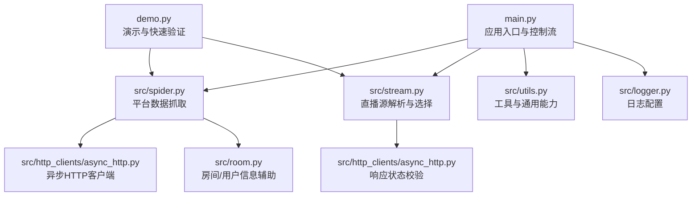
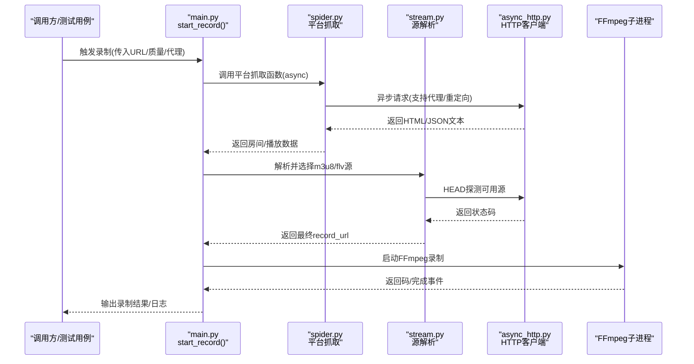
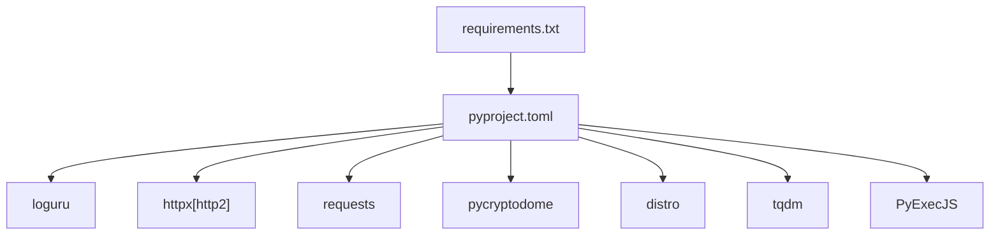

# 测试与调试

<cite>
**本文引用的文件**
- [README.md](file://README.md)
- [main.py](file://main.py)
- [src/spider.py](file://src/spider.py)
- [src/stream.py](file://src/stream.py)
- [src/room.py](file://src/room.py)
- [src/http_clients/async_http.py](file://src/http_clients/async_http.py)
- [src/http_clients/sync_http.py](file://src/http_clients/sync_http.py)
- [src/utils.py](file://src/utils.py)
- [src/logger.py](file://src/logger.py)
- [demo.py](file://demo.py)
- [requirements.txt](file://requirements.txt)
- [pyproject.toml](file://pyproject.toml)
</cite>

## 目录
1. [引言](#引言)
2. [项目结构](#项目结构)
3. [核心组件](#核心组件)
4. [架构总览](#架构总览)
5. [详细组件分析](#详细组件分析)
6. [依赖分析](#依赖分析)
7. [性能考量](#性能考量)
8. [故障排查指南](#故障排查指南)
9. [结论](#结论)
10. [附录](#附录)

## 引言
本指南面向开发者，围绕“抖音直播录制器”项目提供系统化的测试与调试实践，覆盖单元测试设计、Mock对象使用、异步函数测试、集成测试策略（平台测试、功能测试、性能测试）、调试技巧与工具、常见问题排查流程，以及测试覆盖率与质量保障建议。目标是在不直接阅读代码的前提下，帮助团队建立稳定可靠的测试体系与高效的调试流程。

## 项目结构
该项目采用按职责分层的模块化组织方式：
- 应用入口与控制流：main.py
- 平台采集与解析：src/spider.py、src/stream.py、src/room.py
- 网络客户端：src/http_clients/async_http.py、src/http_clients/sync_http.py
- 工具与通用能力：src/utils.py、src/logger.py
- 示例与演示：demo.py
- 依赖与元信息：requirements.txt、pyproject.toml

图示来源
- [main.py:1-200](file://main.py#L1-L200)
- [src/spider.py:1-120](file://src/spider.py#L1-L120)
- [src/stream.py:1-80](file://src/stream.py#L1-L80)
- [src/room.py:1-60](file://src/room.py#L1-L60)
- [src/http_clients/async_http.py:1-60](file://src/http_clients/async_http.py#L1-L60)
- [src/utils.py:1-60](file://src/utils.py#L1-L60)
- [src/logger.py:1-44](file://src/logger.py#L1-L44)
- [demo.py:1-80](file://demo.py#L1-L80)

章节来源
- [README.md:72-100](file://README.md#L72-L100)
- [main.py:1-200](file://main.py#L1-L200)
- [src/spider.py:1-120](file://src/spider.py#L1-L120)
- [src/stream.py:1-80](file://src/stream.py#L1-L80)
- [src/room.py:1-60](file://src/room.py#L1-L60)
- [src/http_clients/async_http.py:1-60](file://src/http_clients/async_http.py#L1-L60)
- [src/utils.py:1-60](file://src/utils.py#L1-L60)
- [src/logger.py:1-44](file://src/logger.py#L1-L44)
- [demo.py:1-80](file://demo.py#L1-L80)

## 核心组件
- 平台数据抓取层：负责从各直播平台抓取房间信息、播放列表、签名参数等，典型函数包括抖音/快手/TikTok等平台的抓取函数。
- 源解析层：根据平台返回数据，选择合适的m3u8/flv源，处理CDN与质量映射，必要时进行HTTP状态探测。
- 网络客户端层：提供同步与异步HTTP请求封装，支持代理、重定向、Cookies返回等。
- 工具与日志：统一的日志配置、错误追踪装饰器、代理地址处理、查询参数解析等。
- 应用入口：调度各模块，协调录制流程、转码、分段、脚本回调、消息推送等。

章节来源
- [src/spider.py:68-282](file://src/spider.py#L68-L282)
- [src/stream.py:40-153](file://src/stream.py#L40-L153)
- [src/http_clients/async_http.py:10-46](file://src/http_clients/async_http.py#L10-L46)
- [src/http_clients/sync_http.py:20-88](file://src/http_clients/sync_http.py#L20-L88)
- [src/utils.py:38-51](file://src/utils.py#L38-L51)
- [src/logger.py:1-44](file://src/logger.py#L1-L44)
- [main.py:545-800](file://main.py#L545-L800)

## 架构总览
下图展示从入口到平台抓取、源解析与录制控制的关键交互：

图示来源
- [main.py:545-800](file://main.py#L545-L800)
- [src/spider.py:68-282](file://src/spider.py#L68-L282)
- [src/stream.py:40-153](file://src/stream.py#L40-L153)
- [src/http_clients/async_http.py:10-46](file://src/http_clients/async_http.py#L10-L46)

## 详细组件分析

### 平台抓取组件（spider.py）
- 关键职责：针对不同平台构造请求、处理反爬/风控、解析房间/播放数据。
- 异步特性：大量使用async/await，便于并发抓取与降低延迟。
- 错误处理：通过装饰器统一捕获异常并记录日志，避免崩溃传播。
- 代表性函数路径：
  - [抖音App/网页数据抓取:68-226](file://src/spider.py#L68-L226)
  - [TikTok数据抓取:286-313](file://src/spider.py#L286-L313)
  - [快手数据抓取:316-404](file://src/spider.py#L316-L404)
  - [虎牙/YY/B站等平台抓取:408-766](file://src/spider.py#L408-L766)

章节来源
- [src/spider.py:68-282](file://src/spider.py#L68-L282)
- [src/spider.py:286-404](file://src/spider.py#L286-L404)
- [src/spider.py:408-766](file://src/spider.py#L408-L766)

### 源解析组件（stream.py）
- 关键职责：从平台返回的数据中提取m3u8/flv源，按质量映射选择最优源，必要时进行可用性探测。
- 质量映射：统一的质量枚举与索引计算，便于跨平台一致性处理。
- 代表性函数路径：
  - [抖音源解析与选择:40-78](file://src/stream.py#L40-L78)
  - [TikTok源解析与排序:81-153](file://src/stream.py#L81-L153)
  - [快手/虎牙/YY/B站等解析:156-378](file://src/stream.py#L156-L378)

章节来源
- [src/stream.py:26-38](file://src/stream.py#L26-L38)
- [src/stream.py:40-78](file://src/stream.py#L40-L78)
- [src/stream.py:81-153](file://src/stream.py#L81-L153)
- [src/stream.py:156-378](file://src/stream.py#L156-L378)

### 网络客户端（async_http/sync_http）
- 异步客户端：支持代理、超时、HTTP/2开关、重定向跟随、Cookies返回等。
- 同步客户端：兼容历史逻辑，支持gzip解码、重定向获取真实URL。
- 代表性函数路径：
  - [异步请求封装:10-46](file://src/http_clients/async_http.py#L10-L46)
  - [响应状态探测:49-59](file://src/http_clients/async_http.py#L49-L59)
  - [同步请求封装:20-88](file://src/http_clients/sync_http.py#L20-L88)

章节来源
- [src/http_clients/async_http.py:10-46](file://src/http_clients/async_http.py#L10-L46)
- [src/http_clients/async_http.py:49-59](file://src/http_clients/async_http.py#L49-L59)
- [src/http_clients/sync_http.py:20-88](file://src/http_clients/sync_http.py#L20-L88)

### 工具与日志（utils/logger）
- 日志：统一格式、多通道输出（stderr与文件），区分INFO与非INFO级别。
- 错误追踪装饰器：捕获JS执行错误与一般异常，记录函数名与行号。
- 代理地址处理：自动补全协议头，适配httpx代理格式。
- 代表性函数路径：
  - [日志配置:1-44](file://src/logger.py#L1-L44)
  - [错误追踪装饰器:38-51](file://src/utils.py#L38-L51)
  - [代理地址处理:162-168](file://src/utils.py#L162-L168)

章节来源
- [src/logger.py:1-44](file://src/logger.py#L1-L44)
- [src/utils.py:38-51](file://src/utils.py#L38-L51)
- [src/utils.py:162-168](file://src/utils.py#L162-L168)

### 应用入口（main.py）
- 录制主流程：解析URL、抓取平台数据、选择源、启动FFmpeg、转码/分段、脚本回调、消息推送。
- 并发与限流：动态调整并发请求上限，依据错误窗口自适应。
- 代表性函数路径：
  - [录制主流程start_record:545-800](file://main.py#L545-800)
  - [动态并发调节:298-324](file://main.py#L298-324)
  - [FFmpeg子进程控制:420-491](file://main.py#L420-491)

章节来源
- [main.py:545-800](file://main.py#L545-L800)
- [main.py:298-324](file://main.py#L298-L324)
- [main.py:420-491](file://main.py#L420-L491)

## 依赖分析
- 第三方库：requests、httpx[http2]、loguru、pycryptodome、distro、tqdm、PyExecJS。
- 依赖关系与版本约束由requirements.txt与pyproject.toml共同定义。

图示来源
- [requirements.txt:1-7](file://requirements.txt#L1-L7)
- [pyproject.toml:1-24](file://pyproject.toml#L1-L24)

章节来源
- [requirements.txt:1-7](file://requirements.txt#L1-L7)
- [pyproject.toml:1-24](file://pyproject.toml#L1-L24)

## 性能考量
- 异步并发：平台抓取与源探测均采用异步，减少I/O阻塞；动态并发窗口可根据错误率自适应调整。
- 源可用性探测：通过HEAD请求快速判断m3u8/flv可用性，避免无效源导致的录制失败。
- FFmpeg参数：支持分段录制与强制h264转码，兼顾兼容性与体积。
- 磁盘空间监控：提供磁盘容量检查工具，避免录制过程中因磁盘不足导致失败。

章节来源
- [src/stream.py:65-69](file://src/stream.py#L65-L69)
- [src/http_clients/async_http.py:49-59](file://src/http_clients/async_http.py#L49-L59)
- [main.py:298-324](file://main.py#L298-L324)
- [src/utils.py:149-159](file://src/utils.py#L149-L159)

## 故障排查指南

### 网络请求问题
- 症状：抓取失败、403/400、超时。
- 排查要点：
  - 检查代理配置与可用性（异步客户端支持代理）。
  - 核对User-Agent/Referer/Cookie等头部是否正确。
  - 使用HEAD探测确认源可用性。
- 相关路径
  - [异步请求封装:10-46](file://src/http_clients/async_http.py#L10-L46)
  - [响应状态探测:49-59](file://src/http_clients/async_http.py#L49-L59)

章节来源
- [src/http_clients/async_http.py:10-46](file://src/http_clients/async_http.py#L10-L46)
- [src/http_clients/async_http.py:49-59](file://src/http_clients/async_http.py#L49-L59)

### 加密/签名问题
- 症状：平台风控触发、返回风险控制信息。
- 排查要点：
  - 检查a_bogus/X-Bogus生成逻辑是否正确。
  - 确认User-Agent与签名算法匹配。
- 相关路径
  - [抖音签名生成:96-97](file://src/spider.py#L96-L97)
  - [X-Bogus生成:42-48](file://src/room.py#L42-L48)

章节来源
- [src/spider.py:96-97](file://src/spider.py#L96-L97)
- [src/room.py:42-48](file://src/room.py#L42-L48)

### 录制失败问题
- 症状：FFmpeg返回非0码、录制中断、文件损坏。
- 排查要点：
  - 检查record_url是否有效（HEAD探测）。
  - 确认FFmpeg路径与参数配置。
  - 分段/转码策略是否与源一致。
- 相关路径
  - [源可用性探测:65-69](file://src/stream.py#L65-L69)
  - [FFmpeg子进程控制:420-491](file://main.py#L420-L491)

章节来源
- [src/stream.py:65-69](file://src/stream.py#L65-L69)
- [main.py:420-491](file://main.py#L420-L491)

### 日志与定位
- 使用统一日志输出，区分错误与信息级别，便于快速定位异常。
- 相关路径
  - [日志配置:1-44](file://src/logger.py#L1-L44)
  - [错误追踪装饰器:38-51](file://src/utils.py#L38-L51)

章节来源
- [src/logger.py:1-44](file://src/logger.py#L1-L44)
- [src/utils.py:38-51](file://src/utils.py#L38-L51)

## 结论
本项目具备完善的异步抓取与源解析能力，配合统一日志与错误追踪机制，适合构建高可靠性的测试与调试体系。建议在现有基础上补充单元测试与集成测试，明确覆盖率门槛，并将日志与断点调试、性能分析工具结合，形成闭环的质量保障。

## 附录

### 单元测试编写要点
- 测试用例设计
  - 输入：URL、质量、代理、Cookies等参数组合。
  - 行为：模拟平台返回数据，验证源解析与质量映射。
  - 输出：record_url、质量标签、异常抛出。
- Mock对象使用
  - 使用异步HTTP客户端的返回值Mock，避免真实网络请求。
  - 对JS签名生成函数进行隔离，仅验证调用与返回格式。
- 异步函数测试
  - 使用事件循环运行async函数，确保超时与异常路径覆盖。
- 覆盖率与质量标准
  - 建议：核心模块（spider/stream）行覆盖率≥80%，分支覆盖率≥60%。
  - 代码审查：重点检查异常处理、代理与Cookies传递、日志输出。

章节来源
- [src/spider.py:68-282](file://src/spider.py#L68-L282)
- [src/stream.py:40-153](file://src/stream.py#L40-L153)
- [src/http_clients/async_http.py:10-46](file://src/http_clients/async_http.py#L10-L46)
- [src/utils.py:38-51](file://src/utils.py#L38-L51)

### 集成测试策略
- 平台测试：按平台清单逐项验证抓取与解析流程，覆盖正常/异常/风控场景。
- 功能测试：录制流程端到端验证（抓取→解析→FFmpeg→转码/分段→脚本回调）。
- 性能测试：并发抓取与源探测的吞吐与延迟评估，动态并发窗口有效性验证。
- 稳健性测试：网络抖动、代理失效、源不可用等边界条件。

章节来源
- [demo.py:213-223](file://demo.py#L213-L223)
- [main.py:545-800](file://main.py#L545-L800)

### 调试技巧与工具
- 日志分析：利用日志文件定位异常发生位置与上下文。
- 断点调试：在关键函数入口（如平台抓取、源解析）设置断点，观察参数与返回。
- 性能分析：统计抓取耗时、并发窗口变化、FFmpeg处理时延，识别瓶颈。
- 依赖与环境：确保httpx[http2]、FFmpeg、PyExecJS环境就绪。

章节来源
- [src/logger.py:1-44](file://src/logger.py#L1-L44)
- [requirements.txt:1-7](file://requirements.txt#L1-L7)
- [pyproject.toml:1-24](file://pyproject.toml#L1-L24)