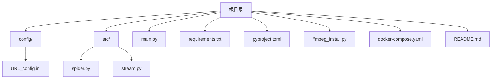
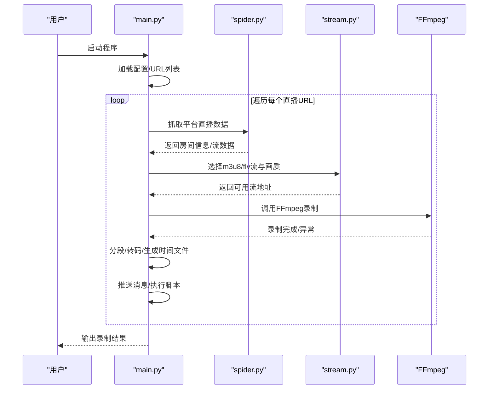
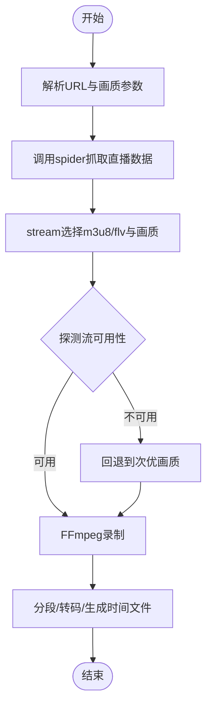
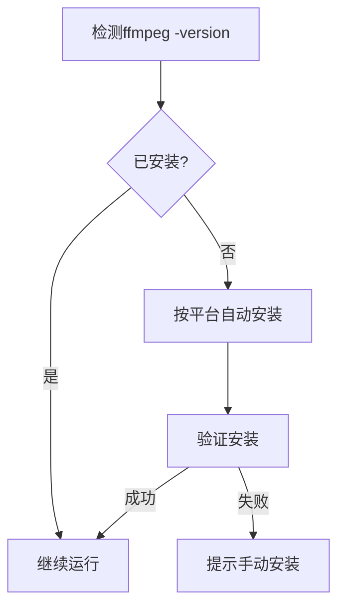
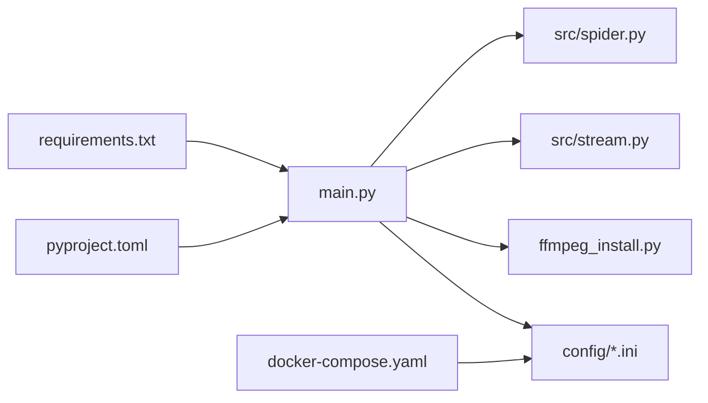

# 快速开始

<cite>
**本文引用的文件**   
- [README.md](file://README.md)
- [requirements.txt](file://requirements.txt)
- [pyproject.toml](file://pyproject.toml)
- [main.py](file://main.py)
- [src/spider.py](file://src/spider.py)
- [src/stream.py](file://src/stream.py)
- [ffmpeg_install.py](file://ffmpeg_install.py)
- [docker-compose.yaml](file://docker-compose.yaml)
- [config/URL_config.ini](file://config/URL_config.ini)
- [demo.py](file://demo.py)
</cite>

## 目录
1. [简介](#简介)
2. [项目结构](#项目结构)
3. [核心组件](#核心组件)
4. [架构总览](#架构总览)
5. [详细组件分析](#详细组件分析)
6. [依赖关系分析](#依赖关系分析)
7. [性能与稳定性建议](#性能与稳定性建议)
8. [故障排除指南](#故障排除指南)
9. [结论](#结论)
10. [附录](#附录)

## 简介
DouyinLiveRecorder 是一款简易、可循环值守的直播录制工具，基于 FFmpeg 实现多平台直播源录制，覆盖抖音、TikTok、快手、虎牙、斗鱼、B站、小红书、海外平台等 40+ 平台。它支持自定义录制画质、分段录制、转码、脚本扩展、消息推送等功能，并提供 Windows 预编译包、Docker 部署与源码运行三种使用方式。

本“快速开始”面向新手用户，目标是在约 30 分钟内完成环境准备、安装依赖、配置直播地址、启动录制、查看结果，并掌握常见问题的排查思路。

## 项目结构
- 根目录包含入口脚本、依赖清单、Docker 编排、FFmpeg 安装辅助脚本、示例演示脚本等。
- config 目录存放直播 URL 配置文件与运行配置文件（含录制设置、推送配置、Cookie、授权等）。
- src 目录包含爬虫模块、流地址解析模块、HTTP 客户端、代理检测、工具与日志等核心逻辑。
- downloads 目录用于保存录制文件；logs 与 backup_config 用于日志与配置备份。

图示来源
- [main.py:1-120](file://main.py#L1-L120)
- [config/URL_config.ini:1-5](file://config/URL_config.ini#L1-L5)
- [src/spider.py:1-60](file://src/spider.py#L1-L60)
- [src/stream.py:1-60](file://src/stream.py#L1-L60)
- [ffmpeg_install.py:1-60](file://ffmpeg_install.py#L1-L60)
- [docker-compose.yaml:1-16](file://docker-compose.yaml#L1-L16)

章节来源
- [README.md:72-120](file://README.md#L72-L120)

## 核心组件
- 录制入口与控制流：main.py 负责加载配置、解析 URL 列表、按平台抓取直播数据、选择合适流地址、调用 FFmpeg 录制、分段/转码、消息推送与脚本钩子。
- 爬虫模块：src/spider.py 提供各平台房间信息与直播数据抓取能力，处理风控参数与 Cookie。
- 流地址解析：src/stream.py 提供各平台 m3u8/flv 流地址选择、质量映射与可用性探测。
- FFmpeg 安装与集成：ffmpeg_install.py 自动检测并安装 FFmpeg（Windows/macOS/Linux），并将路径加入系统 PATH。
- 配置与运行：config/URL_config.ini 存放待录制的直播地址；docker-compose.yaml 提供容器化部署方案。

章节来源
- [main.py:40-120](file://main.py#L40-L120)
- [src/spider.py:68-141](file://src/spider.py#L68-L141)
- [src/stream.py:40-78](file://src/stream.py#L40-L78)
- [ffmpeg_install.py:161-200](file://ffmpeg_install.py#L161-L200)
- [config/URL_config.ini:1-5](file://config/URL_config.ini#L1-L5)

## 架构总览
下图展示了从启动到录制完成的关键流程：加载配置 → 解析 URL → 抓取直播数据 → 选择流地址 → FFmpeg 录制 → 分段/转码 → 结束处理与推送。

图示来源
- [main.py:545-800](file://main.py#L545-L800)
- [src/spider.py:68-141](file://src/spider.py#L68-L141)
- [src/stream.py:40-78](file://src/stream.py#L40-L78)
- [ffmpeg_install.py:174-200](file://ffmpeg_install.py#L174-L200)

## 详细组件分析

### 安装与运行方式
- Windows 预编译包
  - 从 Releases 下载最新 zip 包，解压后在 config/URL_config.ini 添加直播地址，运行 DouyinLiveRecorder.exe 即可。
  - 若系统提示病毒，可忽略或更换浏览器下载。
- 源码运行（推荐使用 uv）
  - 安装 Python 3.10+ 与 uv（可选但推荐），在项目根目录执行 uv sync 安装依赖。
  - 安装 FFmpeg：Windows 可跳过；Linux/macOS 按官方文档安装。
  - 运行 python main.py（或 uv run main.py）。
- Docker 运行
  - 确保已安装 Docker 与 Docker Compose，执行 docker-compose up 即可。
  - 容器内需提前在 config/URL_config.ini 添加直播地址；手动中断容器可能导致正在录制的视频损坏，建议使用 ts 格式保存。

章节来源
- [README.md:104-120](file://README.md#L104-L120)
- [README.md:289-431](file://README.md#L289-L431)
- [README.md:433-481](file://README.md#L433-L481)
- [docker-compose.yaml:1-16](file://docker-compose.yaml#L1-L16)
- [ffmpeg_install.py:161-200](file://ffmpeg_install.py#L161-L200)

### 依赖安装方法
- 使用 uv（推荐）
  - 安装 uv 后，在项目根目录执行 uv sync 或 uv pip sync requirements.txt。
  - 可使用国内镜像源加速：uv sync --index https://pypi.tuna.tsinghua.edu.cn/simple。
- 使用 pip
  - pip3 install -U pip && pip3 install -r requirements.txt。
- 依赖清单
  - requests、loguru、pycryptodome、distro、tqdm、httpx[http2]、PyExecJS。

章节来源
- [README.md:304-388](file://README.md#L304-L388)
- [requirements.txt:1-7](file://requirements.txt#L1-L7)
- [pyproject.toml:8-17](file://pyproject.toml#L8-L17)

### 环境要求
- Python 版本：3.10+（项目元数据要求 >=3.10；README 显示 3.11.6）
- FFmpeg：Linux/macOS 需自行安装；Windows 可由程序自动安装或手动安装。
- 平台支持：覆盖国内/海外主流直播平台，详见 README 的平台列表。

章节来源
- [pyproject.toml:8](file://pyproject.toml#L8)
- [README.md:3-68](file://README.md#L3-L68)
- [ffmpeg_install.py:161-200](file://ffmpeg_install.py#L161-L200)

### 配置文件设置
- URL_config.ini
  - 位置：config/URL_config.ini
  - 规则：每行一个直播地址；如需注释某条目，可在地址前加 #。
  - 画质设置：在地址前加“画质, ”（英文逗号分隔），例如“超清, https://...”，支持“原画/蓝光/超清/高清/标清/流畅”。
  - 代理配置：如需对特定平台启用代理，可在配置文件中设置代理地址（参考 README 的代理说明）。
- config.ini（运行配置）
  - 录制设置：包含录制格式（建议 ts）、分段录制、转码、画质、保存路径等。
  - 推送配置：可配置微信、钉钉、邮箱、Telegram、Bark、NTFY、PushPlus 等推送通道。
  - Cookie/Authorization/账号密码：针对需要登录或风控防护的平台，可在相应节中填入 Cookie、Token 或账号密码。

章节来源
- [README.md:104-120](file://README.md#L104-L120)
- [README.md:111-118](file://README.md#L111-L118)
- [README.md:115](file://README.md#L115)
- [config/URL_config.ini:1-5](file://config/URL_config.ini#L1-L5)

### 基本使用示例
- 启动录制
  - 方式一：Windows 预编译包，解压后在 config/URL_config.ini 添加地址，运行 DouyinLiveRecorder.exe。
  - 方式二：源码运行，uv sync 安装依赖后，python main.py（或 uv run main.py）。
  - 方式三：Docker，docker-compose up 启动。
- 停止录制
  - Windows：执行 StopRecording.vbs；或在控制台按 Ctrl+C。
  - 停止单个直播：在 URL_config.ini 对应地址前加 #，程序会自动停止该直播的录制并保存文件。
- 查看录制文件
  - 录制文件保存在项目根目录的 downloads 文件夹，按平台分类存储。

章节来源
- [README.md:104-120](file://README.md#L104-L120)
- [README.md:119](file://README.md#L119)

### 关键流程与算法

#### 流地址选择与画质映射
- main.py 中根据平台调用对应的 spider 获取直播数据，随后在 stream.py 中按传入画质映射到具体 m3u8/flv 地址，并进行可用性探测与回退策略。

图示来源
- [main.py:545-800](file://main.py#L545-L800)
- [src/stream.py:40-78](file://src/stream.py#L40-L78)

#### FFmpeg 安装与集成
- 程序启动时会检测 FFmpeg 是否存在，不存在则按平台自动安装（Windows/macOS/Linux），并将路径加入系统 PATH。

图示来源
- [ffmpeg_install.py:174-200](file://ffmpeg_install.py#L174-L200)
- [ffmpeg_install.py:161-171](file://ffmpeg_install.py#L161-L171)

## 依赖关系分析
- main.py 依赖 spider 与 stream 模块抓取与解析直播数据，依赖 ffmpeg_install.py 确保 FFmpeg 可用。
- requirements.txt 与 pyproject.toml 定义了运行期依赖（httpx、requests、loguru、pycryptodome、distro、tqdm、PyExecJS）。
- docker-compose.yaml 将 config、logs、backup_config、downloads 挂载到容器内，便于持久化与配置共享。

图示来源
- [main.py:30-40](file://main.py#L30-L40)
- [requirements.txt:1-7](file://requirements.txt#L1-L7)
- [pyproject.toml:8-17](file://pyproject.toml#L8-L17)
- [docker-compose.yaml:11-16](file://docker-compose.yaml#L11-L16)

章节来源
- [requirements.txt:1-7](file://requirements.txt#L1-L7)
- [pyproject.toml:8-17](file://pyproject.toml#L8-L17)
- [docker-compose.yaml:1-16](file://docker-compose.yaml#L1-L16)

## 性能与稳定性建议
- 降低并发与请求频率：合理设置循环监测间隔，避免频繁请求导致 IP 被封。
- 优先使用 ts 格式：容器内或异常中断风险较高时，建议使用 ts 格式保存，减少损坏概率。
- 代理与风控：对海外平台或受限区域，按需开启代理；必要时补充 Cookie/Token。
- 分段录制：开启按时间分段可提升断点续录与后期处理效率。

章节来源
- [README.md:117-118](file://README.md#L117-L118)
- [README.md:474-481](file://README.md#L474-L481)

## 故障排除指南
- 无法找到 FFmpeg
  - 现象：启动时报错提示未安装 FFmpeg。
  - 处理：Windows 可重试自动安装；Linux/macOS 按官方文档安装；确认 PATH 已包含 FFmpeg 路径。
- 录制中断或文件损坏
  - 现象：容器内手动中断导致录制文件损坏。
  - 处理：避免手动中断容器；使用 ts 格式保存；在 URL_config.ini 对应地址前加 # 停止单个直播。
- 画质选择无效或无法解析
  - 现象：指定画质后仍录制到较低画质。
  - 处理：确认 URL 前画质参数格式正确；若平台不支持指定画质，程序会自动回退到可用画质。
- 海外平台无法访问
  - 现象：TikTok/SOOP/PandaTV 等平台无法录制。
  - 处理：在配置中开启代理并填写代理地址；必要时补充平台 Cookie/Token。
- 依赖安装缓慢或失败
  - 处理：使用 uv 并指定国内镜像源；或使用 pip -i 指定镜像源。

章节来源
- [ffmpeg_install.py:174-200](file://ffmpeg_install.py#L174-L200)
- [README.md:117-118](file://README.md#L117-L118)
- [README.md:111](file://README.md#L111)
- [README.md:304-388](file://README.md#L304-L388)

## 结论
通过本快速开始指南，您可以在 30 分钟内完成环境准备、安装依赖、配置直播地址并成功运行录制任务。建议优先使用 uv 管理依赖与 Python 版本，结合 ts 格式与分段录制提升稳定性，并按需启用代理与 Cookie/Token 以应对风控与登录限制。

## 附录

### 常用命令速查
- 安装依赖（uv）：uv sync
- 安装依赖（pip）：pip3 install -r requirements.txt
- 运行程序：python main.py 或 uv run main.py
- Docker 启动：docker-compose up
- 停止录制（Windows）：执行 StopRecording.vbs 或 Ctrl+C

章节来源
- [README.md:304-431](file://README.md#L304-L431)
- [docker-compose.yaml:1-16](file://docker-compose.yaml#L1-L16)