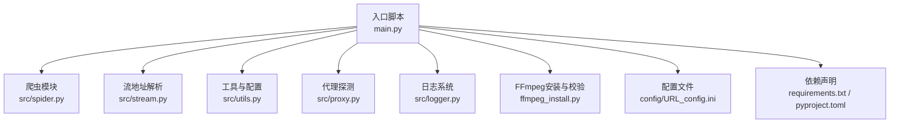
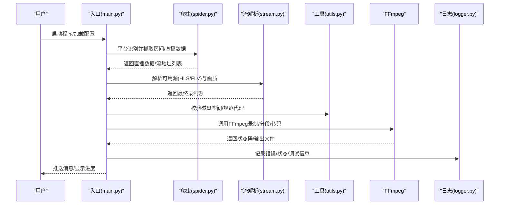
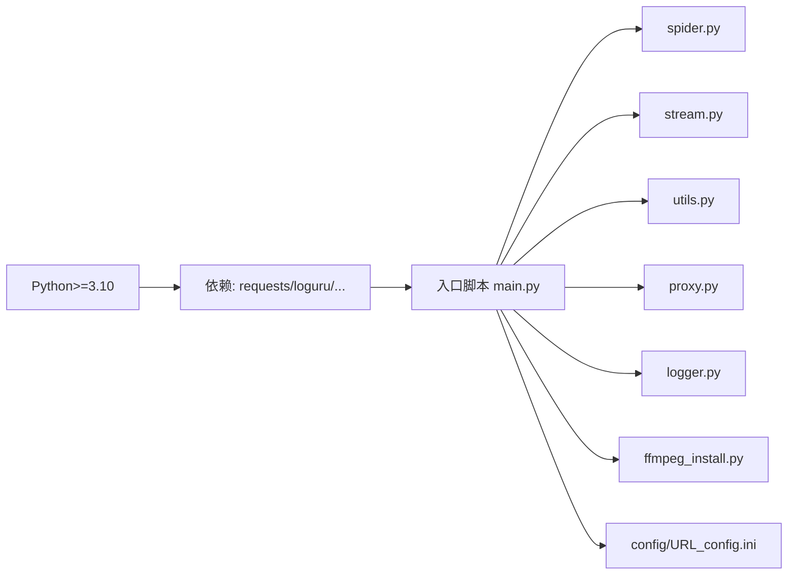
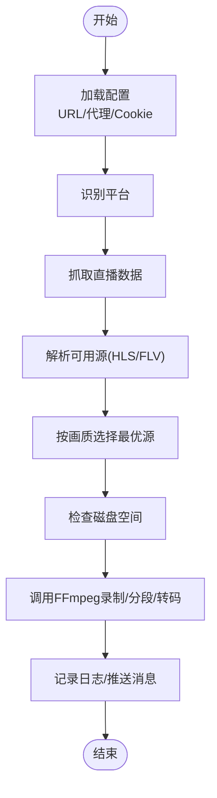

# 常见问题

<cite>
**本文引用的文件**   
- [README.md](file://README.md)
- [requirements.txt](file://requirements.txt)
- [pyproject.toml](file://pyproject.toml)
- [main.py](file://main.py)
- [ffmpeg_install.py](file://ffmpeg_install.py)
- [src/spider.py](file://src/spider.py)
- [src/stream.py](file://src/stream.py)
- [src/utils.py](file://src/utils.py)
- [src/proxy.py](file://src/proxy.py)
- [src/logger.py](file://src/logger.py)
- [config/URL_config.ini](file://config/URL_config.ini)
</cite>

## 目录
1. [简介](#简介)
2. [项目结构](#项目结构)
3. [核心组件](#核心组件)
4. [架构总览](#架构总览)
5. [详细组件分析](#详细组件分析)
6. [依赖关系分析](#依赖关系分析)
7. [性能与稳定性考量](#性能与稳定性考量)
8. [故障排查指南](#故障排查指南)
9. [结论](#结论)
10. [附录](#附录)

## 简介
本FAQ面向安装、配置与录制全流程中常见的问题，覆盖Python版本与依赖、FFmpeg配置、配置文件错误、录制中断与格式转换失败、存储空间不足、网络连接（DNS、代理、防火墙）等场景。文档结合源码实现与使用说明，提供可操作的诊断步骤、错误代码说明、解决步骤、预防建议与最佳实践。

## 项目结构
项目采用“入口脚本 + 子模块 + 工具与日志 + 配置”的组织方式，核心流程由入口脚本调度爬虫、流地址解析、FFmpeg录制与转换、消息推送等模块协作完成。

图表来源
- [main.py:1-120](file://main.py#L1-L120)
- [src/spider.py:1-60](file://src/spider.py#L1-L60)
- [src/stream.py:1-60](file://src/stream.py#L1-L60)
- [src/utils.py:1-60](file://src/utils.py#L1-L60)
- [src/proxy.py:1-40](file://src/proxy.py#L1-L40)
- [src/logger.py:1-44](file://src/logger.py#L1-L44)
- [ffmpeg_install.py:1-60](file://ffmpeg_install.py#L1-L60)
- [config/URL_config.ini:1-5](file://config/URL_config.ini#L1-L5)
- [requirements.txt:1-7](file://requirements.txt#L1-L7)
- [pyproject.toml:1-24](file://pyproject.toml#L1-L24)

章节来源
- [README.md:72-100](file://README.md#L72-L100)
- [main.py:1-120](file://main.py#L1-L120)

## 核心组件
- 入口与控制流：负责加载配置、调度录制任务、动态调节并发、FFmpeg调用、分段与转码、脚本钩子、消息推送与日志输出。
- 爬虫与流解析：针对不同平台的直播源抓取与解析，选择HLS/FLV等可用源，处理风控与画质选择。
- 工具与配置：提供磁盘容量检查、配置读写、代理地址规范化、随机字符串生成等辅助能力。
- 日志系统：统一输出到控制台与文件，区分错误级别，便于定位问题。
- FFmpeg安装与校验：跨平台自动安装与版本检测，保障录制前置条件。
- 代理探测：读取系统代理设置，辅助海外平台录制。

章节来源
- [main.py:120-260](file://main.py#L120-L260)
- [src/spider.py:60-140](file://src/spider.py#L60-L140)
- [src/stream.py:25-80](file://src/stream.py#L25-L80)
- [src/utils.py:60-120](file://src/utils.py#L60-L120)
- [src/logger.py:1-44](file://src/logger.py#L1-L44)
- [ffmpeg_install.py:160-222](file://ffmpeg_install.py#L160-L222)
- [src/proxy.py:27-93](file://src/proxy.py#L27-L93)

## 架构总览
下图展示从入口到录制完成的关键交互路径，包括平台识别、数据抓取、源选择、FFmpeg录制与转换、分段与脚本钩子、消息推送与日志记录。

图表来源
- [main.py:540-820](file://main.py#L540-L820)
- [src/spider.py:60-140](file://src/spider.py#L60-L140)
- [src/stream.py:40-153](file://src/stream.py#L40-L153)
- [src/utils.py:149-169](file://src/utils.py#L149-L169)
- [src/logger.py:1-44](file://src/logger.py#L1-L44)

## 详细组件分析

### 安装与依赖问题
- Python版本要求
  - 项目要求Python版本不低于3.10；推荐使用3.11及以上。
  - 若系统未安装或版本过低，可通过uv自动创建并使用虚拟环境，或手动创建虚拟环境后安装依赖。
- 依赖安装失败
  - 建议使用uv同步依赖，或使用国内镜像源加速pip安装。
  - 若出现网络不稳定，可多次重试或切换镜像源。
- FFmpeg配置错误
  - Windows/Linux/macOS分别提供自动安装逻辑；若自动安装失败，需手动安装并确保在PATH中可找到。
  - 若PATH未更新或安装位置不正确，将导致录制阶段无法调用FFmpeg，表现为录制进程立即退出或报错。

章节来源
- [README.md:298-431](file://README.md#L298-L431)
- [pyproject.toml:8](file://pyproject.toml#L8)
- [requirements.txt:1-7](file://requirements.txt#L1-L7)
- [ffmpeg_install.py:160-222](file://ffmpeg_install.py#L160-L222)

### 配置文件相关问题
- URL配置错误
  - URL配置文件支持注释（以#开头）、单行一个URL、可选自定义画质前缀（逗号分隔）。
  - 若链接无效或格式不被识别，将无法匹配到平台，导致抓取失败。
- Cookie失效
  - 部分平台（如淘宝、抖音、快手、B站等）需要有效Cookie才能获取直播数据或播放源。
  - 建议定期更新Cookie，或按平台指引重新登录获取。
- 代理设置不当
  - 海外平台通常需要代理；可按说明在配置中启用代理并设置代理地址。
  - 代理地址需带协议头（http/https），否则会被规范化为None导致不生效。
- 配置读写与更新
  - 工具模块提供配置读取与写入能力，更新时会对百分号进行转义，避免配置解析异常。

章节来源
- [README.md:104-120](file://README.md#L104-L120)
- [config/URL_config.ini:1-5](file://config/URL_config.ini#L1-L5)
- [src/utils.py:65-108](file://src/utils.py#L65-L108)
- [src/utils.py:162-169](file://src/utils.py#L162-L169)

### 录制过程中的典型故障
- 直播流无法获取
  - 平台风控触发或接口返回空数据，将抛出风险控制或数据为空异常。
  - 建议降低请求频率、更换代理、检查Cookie有效性。
- 录制中断
  - FFmpeg进程收到终止信号或被注释/停止指令中断，会尝试优雅退出并清理。
  - 若中途被注释（在URL前加#），将从录制列表移除并保存已录制文件。
- 格式转换失败
  - 转码阶段（如强制h264）或分段失败会记录错误日志。
  - 建议确认FFmpeg可用、磁盘空间充足、目标格式受支持。
- 存储空间不足
  - 工具模块提供磁盘容量检查，建议在录制前预留足够空间。
  - 若空间不足，录制会提前失败或转换阶段报错。

章节来源
- [src/spider.py:98-141](file://src/spider.py#L98-L141)
- [main.py:420-492](file://main.py#L420-L492)
- [src/utils.py:149-169](file://src/utils.py#L149-L169)

### 网络连接问题
- DNS解析失败
  - 可能由于系统DNS策略或网络环境导致；建议更换DNS服务器或使用代理。
- 代理连接超时
  - 代理不可用或端口不正确；请核对代理地址与端口，必要时更换代理。
- 防火墙阻断
  - 部分企业/校园网络可能拦截特定域名；建议在允许的网络环境下运行或使用稳定代理。
- 代理探测与规范化
  - 系统代理读取仅在Windows/Linux上实现；工具模块会将无协议头的代理地址补全为http://。

章节来源
- [src/proxy.py:27-93](file://src/proxy.py#L27-L93)
- [src/utils.py:162-169](file://src/utils.py#L162-L169)

## 依赖关系分析
- Python版本与依赖
  - 项目要求Python>=3.10；依赖通过requirements.txt与pyproject.toml声明。
- FFmpeg与Node.js
  - FFmpeg为录制必需；Node.js用于部分平台的JS解密逻辑。
- 模块耦合
  - 入口脚本依赖爬虫与流解析模块获取播放源，依赖工具模块进行磁盘检查与配置读写，依赖日志模块输出错误与调试信息。

图表来源
- [pyproject.toml:8](file://pyproject.toml#L8)
- [requirements.txt:1-7](file://requirements.txt#L1-L7)
- [main.py:1-120](file://main.py#L1-L120)
- [ffmpeg_install.py:160-222](file://ffmpeg_install.py#L160-L222)

章节来源
- [pyproject.toml:1-24](file://pyproject.toml#L1-L24)
- [requirements.txt:1-7](file://requirements.txt#L1-L7)
- [main.py:1-120](file://main.py#L1-L120)

## 性能与稳定性考量
- 动态并发调节
  - 系统根据瞬时错误率动态调整并发线程数，避免触发平台风控或自身资源瓶颈。
- 请求节流与延迟
  - 录制结束后会短暂缩短检测周期，降低误判；当瞬时错误过多会增加等待时间。
- 分段录制与转码
  - 支持按时间分段与MP4转码；建议优先使用ts格式以减少损坏风险。

章节来源
- [main.py:298-325](file://main.py#L298-L325)
- [main.py:1604-1630](file://main.py#L1604-L1630)
- [main.py:189-252](file://main.py#L189-L252)

## 故障排查指南

### 一、安装与依赖类
- 症状：依赖安装缓慢或失败
  - 步骤：使用uv同步依赖；或指定国内镜像源安装；多次重试。
  - 参考：[README.md:304-388](file://README.md#L304-L388)
- 症状：Python版本过低
  - 步骤：升级Python至3.10+；使用uv自动创建并使用虚拟环境。
  - 参考：[pyproject.toml:8](file://pyproject.toml#L8)
- 症状：FFmpeg未找到或版本异常
  - 步骤：运行自动安装脚本；检查PATH；重启终端/容器；手动安装后验证版本。
  - 参考：[ffmpeg_install.py:160-222](file://ffmpeg_install.py#L160-L222)

章节来源
- [README.md:304-388](file://README.md#L304-L388)
- [pyproject.toml:8](file://pyproject.toml#L8)
- [ffmpeg_install.py:160-222](file://ffmpeg_install.py#L160-L222)

### 二、配置文件类
- 症状：无法识别URL或无法录制
  - 步骤：确认URL格式正确；为海外平台开启代理；为需要Cookie的平台填入有效Cookie。
  - 参考：[README.md:104-120](file://README.md#L104-L120)
- 症状：Cookie失效
  - 步骤：重新登录平台获取最新Cookie；更新配置文件。
  - 参考：[src/utils.py:65-108](file://src/utils.py#L65-L108)
- 症状：代理不生效
  - 步骤：确保代理地址带协议头；检查代理可用性；必要时更换代理。
  - 参考：[src/utils.py:162-169](file://src/utils.py#L162-L169)

章节来源
- [README.md:104-120](file://README.md#L104-L120)
- [src/utils.py:65-108](file://src/utils.py#L65-L108)
- [src/utils.py:162-169](file://src/utils.py#L162-L169)

### 三、录制过程类
- 症状：直播流无法获取
  - 步骤：降低请求频率；更换代理；检查Cookie；查看日志定位平台风控。
  - 参考：[src/spider.py:98-141](file://src/spider.py#L98-L141)
- 症状：录制中断
  - 步骤：检查是否被注释（URL前加#）；确认FFmpeg进程状态；查看日志。
  - 参考：[main.py:420-492](file://main.py#L420-L492)
- 症状：格式转换失败
  - 步骤：确认FFmpeg可用；检查目标格式支持；避免强制转码h264导致失败。
  - 参考：[main.py:219-252](file://main.py#L219-L252)
- 症状：存储空间不足
  - 步骤：使用磁盘检查函数评估剩余空间；清理旧文件；扩大分区。
  - 参考：[src/utils.py:149-169](file://src/utils.py#L149-L169)

章节来源
- [src/spider.py:98-141](file://src/spider.py#L98-L141)
- [main.py:219-252](file://main.py#L219-L252)
- [src/utils.py:149-169](file://src/utils.py#L149-L169)

### 四、网络连接类
- 症状：DNS解析失败
  - 步骤：更换DNS；使用代理；在允许网络环境下测试。
- 症状：代理连接超时
  - 步骤：核对代理地址与端口；更换代理；检查防火墙。
- 症状：防火墙阻断
  - 步骤：在允许网络环境下运行；使用稳定代理；联系网络管理员。
- 症状：系统代理未生效
  - 步骤：检查系统代理设置；Windows/Linux读取逻辑不同；必要时手动指定代理。
  - 参考：[src/proxy.py:27-93](file://src/proxy.py#L27-L93)

章节来源
- [src/proxy.py:27-93](file://src/proxy.py#L27-L93)

### 五、错误代码与日志定位
- 常见错误类型
  - 网络请求错误：状态码非200、超时、风控触发。
  - FFmpeg错误：返回码非0、路径不存在、权限不足。
  - 配置错误：Section/Key不存在、百分号未转义。
- 日志定位
  - 控制台输出与文件日志分离；错误级别日志落盘，便于事后分析。
  - 参考：[src/logger.py:1-44](file://src/logger.py#L1-L44)

章节来源
- [src/logger.py:1-44](file://src/logger.py#L1-L44)

## 结论
通过规范安装与依赖、正确配置URL与Cookie、合理设置代理、关注磁盘与网络状况，并利用日志与动态并发调节机制，可显著提升录制成功率与稳定性。遇到问题时，优先检查FFmpeg可用性、代理连通性与磁盘空间，其次核对配置项与平台风控因素。

## 附录

### A. 关键流程图：录制启动与源选择

图表来源
- [main.py:540-820](file://main.py#L540-L820)
- [src/spider.py:60-140](file://src/spider.py#L60-L140)
- [src/stream.py:40-153](file://src/stream.py#L40-L153)
- [src/utils.py:149-169](file://src/utils.py#L149-L169)